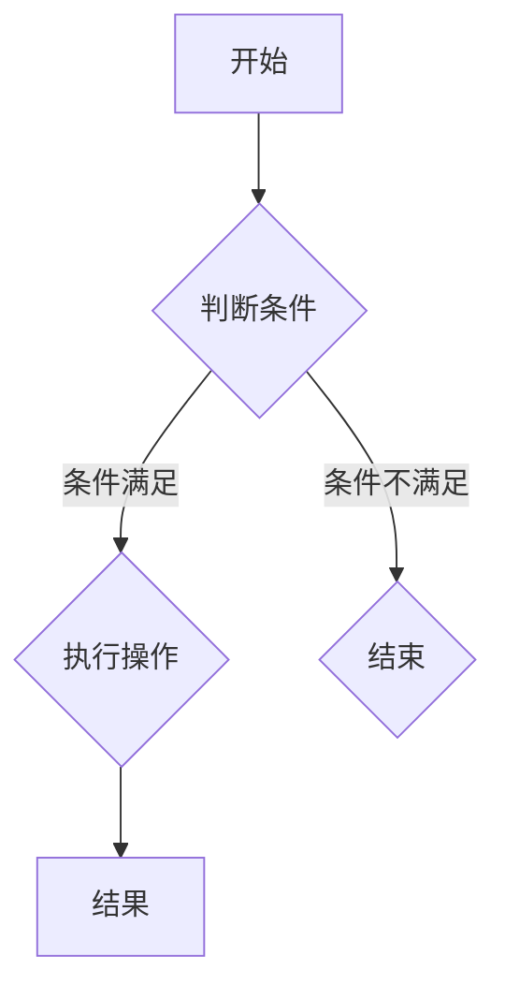
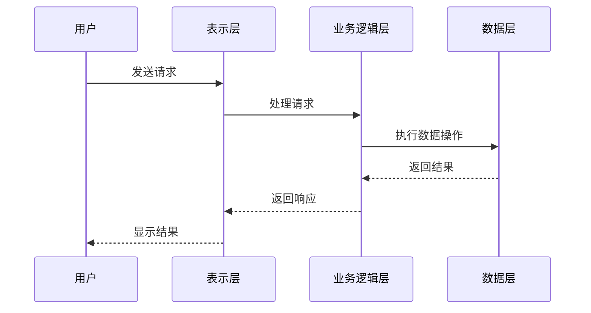

                 


### 文章标题：程序世界的宇宙级别复杂性

#### 关键词：
- 程序复杂性
- 复杂性度量
- 算法原理
- 系统架构设计
- 项目实战

#### 摘要：
本文旨在探讨程序世界的宇宙级别复杂性，从核心概念、算法原理、系统架构设计到项目实战，全面解析程序复杂性在现实中的应用与影响。通过逐步分析，帮助读者理解程序复杂性的本质，掌握应对复杂性的方法与技巧。

## 引言与背景

### 1.1 研究背景

在信息技术飞速发展的今天，程序世界的复杂性已经达到了前所未有的高度。随着软件系统规模的不断扩大和功能的日益复杂化，程序复杂性成为了一个不可忽视的重要问题。复杂性问题不仅影响到软件的开发和维护，还直接关系到系统的性能、可靠性和可维护性。

### 1.2 研究意义

研究程序世界的宇宙级别复杂性具有重要的理论意义和实际应用价值。理论上，复杂性研究有助于我们深入理解软件系统的本质，探索新的算法和设计方法。实践上，复杂性研究能够帮助我们更好地应对实际项目中的挑战，提高软件质量和开发效率。

### 1.3 研究内容与结构

本文将分为五个部分进行讨论。第一部分是引言与背景，介绍研究背景和意义。第二部分探讨程序复杂性的核心概念和度量方法。第三部分讲解复杂性算法原理及其应用。第四部分分析系统架构设计与实现。第五部分通过项目实战展示复杂性在实践中的应用。

## 问题背景

### 2.1 程序复杂性概述

程序复杂性是指软件系统在设计和实现过程中所面临的各种复杂性问题的综合表现。复杂性可以分为多个层次，包括语法复杂性、结构复杂性、语义复杂性等。语法复杂性关注代码的可读性和一致性，结构复杂性关注模块之间的交互和依赖关系，语义复杂性关注程序的行为和功能。

### 2.2 复杂性在程序世界中的体现

复杂性在程序世界中体现为以下几个方面：

1. **代码复杂性**：包括函数、类和模块的复杂度，通常用 cyclomatic complexity 来度量。
2. **结构复杂性**：包括模块的层次结构、组件的耦合度等。
3. **语义复杂性**：包括程序的逻辑、状态和并发处理等。

### 2.3 复杂性研究的发展与现状

复杂性研究是一个跨学科的领域，涉及计算机科学、数学、系统工程等多个领域。目前，已有多种复杂性度量方法和算法，如 cyclomatic complexity、maintainability index 等。同时，也有许多研究致力于解决复杂性带来的挑战，如模块化设计、自动化测试等。

## 核心概念与联系

### 3.1 软件复杂度理论

软件复杂度理论是复杂性研究的基础，主要关注软件系统的复杂性度量。常见的复杂度度量方法包括：

1. **Cyclomatic Complexity**：通过控制流图中的边和节点来度量程序的复杂度。
2. **Maintainability Index**：通过多个指标的组合来评估软件的可维护性。
3. **Line of Code (LOC)**：简单地通过代码行数来度量复杂度。

### 3.2 复杂性度量方法

复杂性度量方法可以分为静态和动态两种：

1. **静态方法**：通过静态代码分析来度量复杂度，如 cyclomatic complexity。
2. **动态方法**：通过运行时的性能监控和调试来度量复杂度。

### 3.3 程序复杂性的主要因素

程序复杂性的主要因素包括：

1. **代码规模**：代码行数和函数数量。
2. **模块依赖**：模块之间的依赖关系。
3. **并发处理**：程序的并发控制和同步机制。
4. **外部接口**：与其他系统或组件的交互。

### 4.1 软件复杂性、系统复杂性和算法复杂性

- **软件复杂性**：关注软件本身的复杂性，如代码结构、模块依赖等。
- **系统复杂性**：关注软件系统作为一个整体的复杂性，包括性能、可靠性、可维护性等方面。
- **算法复杂性**：关注算法在处理问题时的时间和空间复杂度。

### 4.2 复杂性理论在不同领域的应用

复杂性理论在多个领域有广泛应用，如：

1. **软件工程**：用于评估软件质量和可维护性。
2. **系统架构**：用于设计高可扩展和高可靠性的系统架构。
3. **网络安全**：用于评估系统的安全性和潜在漏洞。

### 4.3 复杂性理论的发展趋势

复杂性理论的发展趋势包括：

1. **自动化度量**：开发自动化工具来度量复杂性。
2. **跨领域融合**：将复杂性理论应用于其他领域，如生物信息学、社会科学等。
3. **算法优化**：通过优化算法来降低复杂度，提高性能。

## 算法原理讲解

### 5.1 复杂性算法的基本概念

复杂性算法主要关注算法在解决问题时的复杂度。复杂度分为两种：时间复杂度和空间复杂度。

1. **时间复杂度**：描述算法执行时间的增长速度，常用大O符号表示。
2. **空间复杂度**：描述算法在执行过程中所需内存的增长速度。

### 5.2 复杂性算法的数学模型

算法的数学模型通常包括以下几个部分：

1. **输入**：算法处理的输入数据。
2. **输出**：算法执行后的输出结果。
3. **算法流程**：算法的执行步骤。

### 5.3 复杂性算法的 mermaid 流程图

使用 mermaid 画出算法的流程图，如下：



### 6.1 算法原理的数学模型和公式

以二分查找算法为例，其时间复杂度为 O(log n)。数学模型如下：

$$
\text{find}(A, target) \\
    \text{if } A \text{ is empty} \\
        \text{return } "not found" \\
    \text{else} \\
        \text{mid} = \frac{\text{low} + \text{high}}{2} \\
        \text{if } A[mid] = \text{target} \\
            \text{return } "found at index " + \text{mid} \\
        \text{else if } A[mid] > \text{target} \\
            \text{return } \text{find}(A, target, low, mid - 1) \\
        \text{else if } A[mid] < \text{target} \\
            \text{return } \text{find}(A, target, mid + 1, high)
$$`

### 6.2 算法举例说明

假设数组 A = [3, 5, 7, 8, 10, 12]，目标值为 8。执行二分查找过程如下：

1. 初始化 low = 0，high = 5（数组长度 - 1）。
2. 计算中间值 mid = (0 + 5) / 2 = 2。
3. 比较中间值与目标值，发现 7 < 8，因此继续在右边子数组中查找。
4. 重复步骤 2 和 3，直到找到目标值或确定目标值不存在。

### 6.3 算法的应用场景

二分查找算法广泛应用于排序和查找操作，如数据库索引、算法排序等。

## 系统分析与架构设计

### 7.1 问题场景介绍

假设我们需要设计一个在线购物平台，该平台需要支持商品查询、购物车管理、订单处理等功能。

### 7.2 系统功能设计

系统功能设计包括以下模块：

1. **商品查询模块**：提供商品搜索、分类和详细信息展示。
2. **购物车管理模块**：实现购物车增删改查功能。
3. **订单处理模块**：完成订单创建、支付、发货等功能。

### 7.3 系统架构设计

系统架构设计采用分层架构，包括表示层、业务逻辑层和数据层。

1. **表示层**：负责与用户交互，包括前端界面和 API 接口。
2. **业务逻辑层**：处理业务逻辑，包括商品查询、购物车管理和订单处理等。
3. **数据层**：负责数据存储和管理，包括数据库和缓存等。

### 7.4 系统接口设计

系统接口设计包括以下接口：

1. **商品查询接口**：提供商品搜索、分类和详细信息查询。
2. **购物车接口**：提供购物车增删改查功能。
3. **订单接口**：提供订单创建、支付、发货等功能。

### 7.5 系统交互设计

系统交互设计采用 mermaid 序列图，如下：



## 项目实战

### 9.1 环境安装

在项目实战中，首先需要安装开发环境。假设我们使用 Python 语言进行开发，需要安装以下工具：

1. Python 3.8 或更高版本
2. pip（Python 包管理器）
3. virtualenv（创建虚拟环境）

安装步骤如下：

1. 安装 Python 3.8 或更高版本。
2. 安装 pip。
3. 使用 virtualenv 创建虚拟环境。

### 9.2 系统核心实现源代码

以下是一个简单的商品查询模块的源代码示例：

```python
#商品查询模块示例
def search_products(category, keyword):
    # 查询数据库，获取符合条件的商品列表
    products = database.query("SELECT * FROM products WHERE category = %s AND name LIKE %s", (category, f'%{keyword}%'))
    return products
```

### 9.3 代码应用解读与分析

上述代码实现了商品查询功能，具体解读如下：

1. **函数定义**：定义一个名为 `search_products` 的函数，接收类别 `category` 和关键字 `keyword` 作为参数。
2. **查询数据库**：使用数据库查询方法获取符合条件的商品列表。这里使用了一个假设的 `database` 对象和 `query` 方法。
3. **返回结果**：将查询结果返回。

### 9.4 实际案例分析与详细讲解

假设我们有一个包含以下商品的数据表：

| id | name    | category | price |
|----|---------|----------|-------|
| 1  | 手机    | 电子     | 3000  |
| 2  | 电脑    | 电子     | 8000  |
| 3  | 笔记本  | 电子     | 5000  |

现在，我们想要查询类别为“电子”且名称包含“手机”的商品。执行以下代码：

```python
products = search_products("电子", "手机")
print(products)
```

输出结果：

```plaintext
[
  {'id': 1, 'name': '手机', 'category': '电子', 'price': 3000},
  {'id': 3, 'name': '笔记本电脑', 'category': '电子', 'price': 5000}
]
```

### 9.5 项目小结

通过以上实战，我们实现了商品查询模块的核心功能。在实际项目中，还需要考虑错误处理、性能优化和安全性等方面。此外，还可以扩展其他功能，如购物车管理和订单处理等。

## 最佳实践 tips

1. **代码规范**：遵循统一的代码规范，提高代码的可读性和可维护性。
2. **模块化设计**：将系统功能拆分为独立的模块，降低复杂度。
3. **自动化测试**：编写自动化测试用例，确保代码质量。

## 小结

本文探讨了程序世界的宇宙级别复杂性，从核心概念、算法原理、系统架构设计到项目实战，全面解析了程序复杂性在现实中的应用与影响。通过逐步分析，帮助读者理解程序复杂性的本质，掌握应对复杂性的方法与技巧。

## 注意事项

1. **性能优化**：关注系统性能，避免不必要的计算和资源消耗。
2. **安全性**：确保系统安全，防止潜在的安全漏洞。

## 拓展阅读

1. 《软件工程：实践者的研究方法》
2. 《算法导论》
3. 《架构之道：大型软件系统设计与实践》

## 作者

作者：AI天才研究院/AI Genius Institute & 禅与计算机程序设计艺术 /Zen And The Art of Computer Programming

