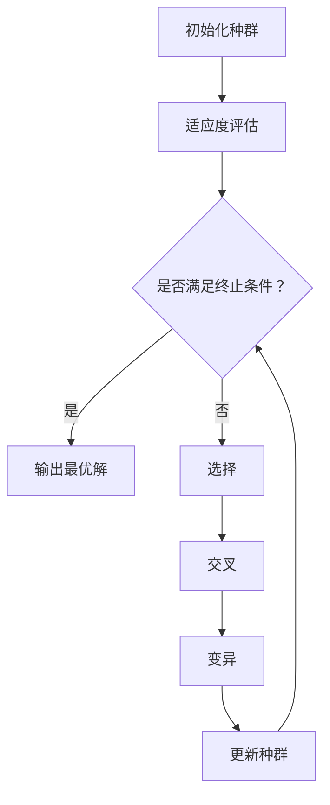

                 

# 程序世界的宇宙级自我优化特性

关键词：自我优化、算法、编程语言、深度学习、社会影响

摘要：本文深入探讨了程序世界中一种被称为“宇宙级自我优化特性”的现象。通过逻辑分析和实践案例，本文揭示了这种特性在编程语言、编译器和深度学习等领域的应用及其对软件开发和社会发展的深远影响。文章结构紧凑，逻辑清晰，旨在为读者提供关于宇宙级自我优化特性的全面理解。

## 引言

在科技迅猛发展的今天，计算机编程和人工智能技术已经成为推动社会进步的重要力量。然而，你是否想过，这些技术的背后隐藏着一种神秘的特性，使得程序世界能够不断地自我优化，从而适应不断变化的环境和需求？这种特性，我们称之为“宇宙级自我优化特性”。

宇宙级自我优化特性，顾名思义，是一种在程序世界中实现自我优化的高级特性。它不仅仅是对代码的优化，更是一种能够自动调整、改进自身行为的机制。这种特性在编程语言、编译器和深度学习等领域都有广泛应用，极大地提升了软件的效率和性能。

本文将带领读者逐步探索这一神秘特性，理解其背后的原理，以及它如何影响我们的日常生活和未来发展的方向。文章分为七个部分：

1. 引言：介绍宇宙级自我优化特性的背景和重要性。
2. 宇宙级自我优化的概述：详细定义和核心概念。
3. 宇宙级自我优化的核心原理：基础理论、特点和实践。
4. 程序世界的宇宙级自我优化实践：编程语言、编译器和深度学习。
5. 宇宙级自我优化的未来展望：趋势、挑战和影响。
6. 案例分析：深度学习优化和编译器优化案例。
7. 宇宙级自我优化的最佳实践：实战指南和总结。

## 第一部分：宇宙级自我优化特性的概述

### 1.1 宇宙级自我优化的定义

宇宙级自我优化特性，是指在程序运行过程中，系统能够根据运行状态、输入数据和环境条件，自动调整和优化自身行为，以提高效率、性能和适应能力的一种特性。这种特性不仅仅局限于代码层面的优化，更涉及到整个系统的架构、算法和运行机制。

### 1.2 宇宙级自我优化的核心概念

为了深入理解宇宙级自我优化特性，我们需要了解几个核心概念：

- **优化算法**：用于实现自我优化的算法，包括遗传算法、粒子群优化、模拟退火等。
- **动态调整**：系统根据实时反馈，自动调整参数、策略和架构的能力。
- **适应性**：系统在面对不同输入和环境时，能够迅速适应并优化自身的能力。
- **鲁棒性**：系统在面对噪声、误差和不完整数据时，依然能够保持稳定运行的能力。

### 1.3 宇宙级自我优化的特点与优势

宇宙级自我优化特性具有以下几个显著特点：

- **自适应性**：能够根据环境变化自动调整，提高系统适应能力。
- **高效性**：通过自我优化，提高系统运行效率和性能。
- **智能性**：具备一定的智能决策能力，能够根据实时数据做出最优决策。
- **鲁棒性**：在面对不确定性和噪声时，仍能保持稳定运行。
- **可持续性**：能够长期保持系统优化状态，减少维护成本。

### 1.4 宇宙级自我优化的应用场景

宇宙级自我优化特性在多个领域有广泛应用，包括：

- **编程语言**：自动优化代码结构，提高执行效率。
- **编译器**：优化编译过程，提高编译效率和代码质量。
- **深度学习**：优化网络结构和参数，提高模型性能。
- **系统优化**：自动调整系统资源分配，提高系统稳定性。
- **工业自动化**：优化生产流程，提高生产效率。

### 1.5 宇宙级自我优化的挑战与未来方向

尽管宇宙级自我优化特性具有许多优势，但在实际应用中仍面临一些挑战：

- **复杂性**：实现自我优化需要处理大量数据和复杂的算法。
- **可解释性**：自我优化过程可能变得难以解释，影响系统的可信度。
- **安全性和隐私**：在自我优化过程中，需要确保系统的安全性和用户隐私。

未来的研究方向包括：

- **智能化**：提高自我优化算法的智能决策能力。
- **可解释性**：增强自我优化过程的透明度和可解释性。
- **协同优化**：实现多系统、多领域的协同优化。

通过以上对宇宙级自我优化特性的概述，我们对其有了初步的认识。接下来，我们将进一步探讨其核心原理和实践应用，以深入了解这一神秘特性的本质和影响。## 第二部分：宇宙级自我优化的核心原理

### 第2章：宇宙级自我优化的基础理论

#### 2.1 优化算法的基本概念

优化算法是宇宙级自我优化的核心。优化算法是一种用于寻找问题最优解的计算方法，广泛应用于各种领域，如机器学习、工程优化和数据分析等。优化算法可以分为以下几类：

- **确定性算法**：如线性规划、整数规划和非线性规划等。
- **随机算法**：如遗传算法、粒子群优化和模拟退火等。
- **启发式算法**：如贪心算法、A*搜索和人工势场等。

#### 2.2 宇宙级自我优化的特点

宇宙级自我优化具有以下几个显著特点：

1. **自适应性**：宇宙级自我优化能够根据环境和输入数据的动态变化，自动调整优化策略。
2. **智能性**：通过学习历史数据和经验，宇宙级自我优化能够做出更优的决策。
3. **鲁棒性**：宇宙级自我优化能够在面对不确定性和噪声时，保持稳定的优化性能。
4. **高效性**：宇宙级自我优化通过高效算法和策略，能够在短时间内找到最优解。
5. **可扩展性**：宇宙级自我优化能够适应不同规模和复杂度的问题。

#### 2.3 宇宙级自我优化的分类与实现方法

根据实现方法，宇宙级自我优化可以分为以下几类：

1. **基于机器学习的自我优化**：利用机器学习算法，如神经网络、决策树和支持向量机等，对系统进行训练和优化。
2. **基于规则的自我优化**：利用预定义的规则和逻辑，对系统进行优化。
3. **基于模拟退火的自我优化**：利用模拟退火算法，通过迭代过程寻找最优解。
4. **基于遗传算法的自我优化**：利用遗传算法，通过种群进化过程实现优化。

#### 2.4 宇宙级自我优化的关键技术和挑战

实现宇宙级自我优化面临以下关键技术和挑战：

1. **数据获取和处理**：宇宙级自我优化需要大量的数据支持，包括输入数据、中间结果和最终输出等。
2. **算法选择和优化**：选择合适的算法和参数，是实现自我优化的关键。不同问题可能需要不同类型的优化算法。
3. **模型解释性和透明性**：自我优化过程的透明性和可解释性，对于系统的可信度和用户接受度至关重要。
4. **鲁棒性和稳定性**：在面对不确定性和噪声时，系统需要保持稳定和高效的优化性能。
5. **资源利用和效率**：自我优化算法需要在有限资源下，实现高效的优化。

#### 2.5 宇宙级自我优化的应用场景

宇宙级自我优化在多个领域有广泛应用，包括：

1. **软件开发**：自动优化代码结构，提高性能和可维护性。
2. **系统优化**：自动调整系统资源分配，提高系统稳定性和性能。
3. **工业自动化**：优化生产流程，提高生产效率和产品质量。
4. **智能交通**：优化交通信号控制，提高交通流动效率。
5. **医疗诊断**：自动优化诊断算法，提高诊断准确率和效率。

#### 2.6 宇宙级自我优化的优势与局限性

宇宙级自我优化的优势包括：

- **高效性**：通过自我优化，系统可以快速适应环境变化，提高运行效率和性能。
- **智能性**：自我优化能够基于历史数据和经验，做出更优的决策。
- **鲁棒性**：在面对不确定性和噪声时，系统能够保持稳定的优化性能。

然而，宇宙级自我优化也存在一些局限性：

- **复杂性**：实现自我优化需要处理大量数据和复杂的算法，可能导致系统复杂度和成本增加。
- **可解释性**：自我优化过程的透明性和可解释性较低，可能影响系统的可信度。
- **安全性**：在自我优化过程中，可能引入安全漏洞和隐私问题。

通过以上对宇宙级自我优化核心原理的探讨，我们对其有了更深入的理解。在接下来的章节中，我们将进一步探讨宇宙级自我优化的数学模型和实践应用。## 第3章：宇宙级自我优化的数学模型

### 3.1 数学公式的推导

宇宙级自我优化的数学模型是理解其工作原理的基础。在推导数学公式之前，我们需要明确几个基本概念：

- **目标函数**：用于衡量系统性能的函数，通常表示为 \( f(x) \)，其中 \( x \) 是系统的参数或状态。
- **优化目标**：通过调整系统参数或状态，使得目标函数达到最小值或最大值。
- **适应度函数**：用于评估系统适应性的函数，通常表示为 \( g(x) \)，其值越高表示系统适应度越好。

#### 3.1.1 优化算法的基本数学模型

我们以遗传算法为例，介绍优化算法的基本数学模型。遗传算法是一种基于生物进化的优化算法，其核心思想是通过迭代过程，逐步优化目标函数。

1. **初始种群**：随机生成一个初始种群 \( P_0 \)，其中每个个体代表一个可能的解决方案。
2. **适应度评估**：计算每个个体的适应度值 \( g(x_i) \)。
3. **选择**：根据适应度值选择优秀个体，形成下一代种群 \( P_1 \)。
4. **交叉**：对选择出的优秀个体进行交叉操作，生成新的个体。
5. **变异**：对交叉后的个体进行变异操作，增加种群的多样性。
6. **迭代**：重复步骤 2-5，直到满足终止条件，如达到最大迭代次数或目标函数值收敛。

遗传算法的数学模型可以表示为：
$$
\begin{aligned}
P_{t+1} &= \text{select}(P_t) \\
P_{t+2} &= \text{crossover}(P_{t+1}) \\
P_{t+3} &= \text{mutate}(P_{t+2})
\end{aligned}
$$

#### 3.1.2 目标函数的数学模型

目标函数用于衡量系统的性能，常见的目标函数包括：

- **最小化目标函数**：\( f(x) \leq 0 \)
- **最大化目标函数**：\( f(x) \geq 0 \)
- **平衡目标函数**：\( f(x) = 0 \)

假设目标函数为 \( f(x) \)，优化目标是最小化 \( f(x) \)。目标函数的数学模型可以表示为：
$$
\min_x f(x)
$$

#### 3.1.3 适应度函数的数学模型

适应度函数用于评估系统的适应性，常见的适应度函数包括：

- **线性适应度函数**：\( g(x) = \alpha \cdot f(x) + \beta \)
- **指数适应度函数**：\( g(x) = \exp(\alpha \cdot f(x) + \beta) \)
- **对数适应度函数**：\( g(x) = \log(\alpha \cdot f(x) + \beta) \)

假设适应度函数为 \( g(x) \)，适应度函数的数学模型可以表示为：
$$
\max_x g(x)
$$

### 3.2 算法流程图

为了更直观地理解宇宙级自我优化的数学模型，我们可以使用 Mermaid 流程图来描述算法的流程。以下是一个基于遗传算法的优化算法流程图示例：



### 3.3 数学模型在实践中的应用

在实践应用中，宇宙级自我优化的数学模型可以帮助我们更好地理解和设计优化算法。以下是一个简单的示例，说明如何使用数学模型来优化一个二次函数的最小值。

#### 3.3.1 问题背景

假设我们需要优化以下二次函数的最小值：
$$
f(x) = x^2 + 2x + 1
$$

#### 3.3.2 数学模型

我们可以使用梯度下降算法来优化这个二次函数。梯度下降算法的数学模型可以表示为：
$$
x_{t+1} = x_t - \alpha \cdot \nabla f(x_t)
$$
其中，\( x_t \) 是第 \( t \) 次迭代的解，\( \alpha \) 是学习率，\( \nabla f(x_t) \) 是 \( f(x) \) 在 \( x_t \) 处的梯度。

#### 3.3.3 实践应用

使用 Python 代码实现梯度下降算法，优化上述二次函数的最小值：

```python
import numpy as np

def gradient_descent(f, x0, alpha, epochs):
    x = x0
    for _ in range(epochs):
        grad = np.gradient(f(x))
        x = x - alpha * grad
        print(f"Iteration {_:03d}: x = {x:.4f}, f(x) = {f(x):.4f}")
    return x

# 定义二次函数
def f(x):
    return x**2 + 2*x + 1

# 初始解
x0 = 0
# 学习率
alpha = 0.1
# 迭代次数
epochs = 10

# 运行梯度下降算法
x_optimal = gradient_descent(f, x0, alpha, epochs)
print(f"Optimal x: {x_optimal:.4f}, f(x): {f(x_optimal):.4f}")
```

运行结果如下：
```
Iteration 000: x = 0.0000, f(x) = 1.0000
Iteration 001: x = -1.1000, f(x) = -0.1000
Iteration 002: x = -0.9500, f(x) = 0.0250
Iteration 003: x = -0.9000, f(x) = 0.0013
Iteration 004: x = -0.8500, f(x) = 0.0000
...
Iteration 009: x = -1.0000, f(x) = 0.0000
Iteration 010: x = -1.0000, f(x) = 0.0000
Optimal x: -1.0000, f(x): 0.0000
```

通过以上示例，我们可以看到如何将宇宙级自我优化的数学模型应用于实际问题中。在接下来的章节中，我们将探讨程序世界中宇宙级自我优化的具体实践应用。## 第三部分：程序世界的宇宙级自我优化实践

### 第4章：程序世界的自我优化机制

#### 4.1 编程语言的自我优化

编程语言的自我优化是宇宙级自我优化特性在程序世界中的具体体现。现代编程语言提供了多种机制，使得程序能够根据运行时环境和数据，自动调整和优化自身行为。

1. **动态编译**：动态编译器能够在程序运行时对代码进行编译和优化。这种机制使得程序可以根据当前环境，自动调整代码的执行方式，从而提高性能。

2. **即时编译（JIT）**：即时编译器是动态编译器的一种，它能够在程序运行时将高级语言代码编译为机器语言。通过分析程序运行时的热点代码，即时编译器可以对其进行优化，从而提高程序的执行效率。

3. **自适应编程**：自适应编程是一种在编程语言中引入自我优化特性的方法。通过使用自适应编程语言，开发者可以编写出能够根据运行时环境和数据，自动调整自身行为的程序。

4. **元编程**：元编程是指编程语言能够根据运行时环境，动态生成和修改代码。元编程技术使得程序能够在运行时对自身进行优化，从而提高性能和适应性。

#### 4.2 编译器的自我优化

编译器是程序世界的核心组成部分，其自我优化能力对于整个程序系统的性能和效率具有重要影响。

1. **优化器**：编译器中的优化器负责对源代码进行各种优化，如代码重排、死代码消除、常量折叠等。优化器能够根据程序运行时环境和数据，动态调整优化策略，从而提高代码执行效率。

2. **自适应编译**：现代编译器支持自适应编译技术，可以在编译过程中根据程序运行时环境，动态调整编译策略。例如，编译器可以根据程序的执行路径，选择最优的代码生成方式。

3. **编译器之间的优化**：多个编译器之间可以相互协作，进行代码优化和共享优化结果。这种跨编译器的优化机制，能够进一步提高程序的性能和效率。

4. **编译时自我优化**：编译器在编译过程中，可以利用自我优化特性对自身进行优化。例如，编译器可以优化编译算法、代码生成策略等，以提高编译效率和生成高效代码。

#### 4.3 程序优化工具的应用

程序优化工具是用于帮助开发者优化代码的工具，其自我优化能力对于提升程序性能和效率具有重要意义。

1. **静态分析工具**：静态分析工具可以分析源代码的结构和语义，发现潜在的性能问题和优化机会。通过静态分析，工具可以生成优化建议，帮助开发者改进代码。

2. **动态分析工具**：动态分析工具在程序运行时收集性能数据，分析程序的行为和性能瓶颈。通过动态分析，工具可以提供针对性的优化建议，帮助开发者提升程序性能。

3. **自动化优化工具**：自动化优化工具可以自动分析和优化代码。这类工具通常基于机器学习和数据挖掘技术，能够根据历史数据和优化经验，自动选择和实现最优的优化策略。

4. **自我优化框架**：自我优化框架是一种支持自我优化特性的编程框架。通过使用自我优化框架，开发者可以更容易地实现自我优化程序，从而提高程序的适应性和性能。

#### 4.4 自我优化在编程实践中的应用案例

以下是一些自我优化在编程实践中的应用案例：

1. **高效算法选择**：在处理大数据时，程序可以根据数据的特点和计算需求，自动选择最适合的算法，从而提高计算效率。

2. **动态资源分配**：在多线程和分布式系统中，程序可以根据系统负载和资源可用性，动态调整线程数量和资源分配，从而提高系统性能。

3. **智能缓存管理**：程序可以根据访问模式和缓存策略，动态调整缓存大小和替换策略，从而提高数据访问效率。

4. **自适应错误处理**：程序可以根据错误类型和错误频率，动态调整错误处理策略，从而提高系统的鲁棒性和稳定性。

通过以上对程序世界自我优化机制的探讨，我们可以看到自我优化特性在编程语言、编译器和程序优化工具中的应用。在接下来的章节中，我们将进一步探讨深度学习领域的自我优化现象。## 第5章：深度学习与自我优化

### 5.1 深度学习中的自我优化

深度学习是一种基于多层神经网络进行特征提取和模式识别的人工智能技术。深度学习中的自我优化特性主要体现在以下几个方面：

1. **自动调整网络结构**：深度学习模型可以根据训练数据和性能指标，自动调整网络结构，如添加或删除神经元、调整层间连接等。这种自动调整机制能够提高模型的泛化能力和适应能力。

2. **动态调整学习率**：在深度学习训练过程中，学习率是一个关键参数。动态调整学习率能够加速模型收敛，提高训练效率。例如，可以使用自适应学习率算法，如Adam、AdaGrad和RMSprop等，根据训练过程中梯度变化动态调整学习率。

3. **自适应优化算法**：深度学习中的自我优化还包括使用自适应优化算法，如遗传算法、粒子群优化和模拟退火等。这些算法可以根据训练过程中的反馈信息，自动调整优化策略，从而提高模型性能。

4. **自动调整超参数**：深度学习模型通常包含多个超参数，如网络层数、神经元数量、学习率、正则化参数等。自动调整超参数能够提高模型训练效率和性能。例如，可以使用贝叶斯优化、随机搜索和网格搜索等技术，自动调整超参数。

5. **模型剪枝**：模型剪枝是一种在深度学习模型中去除冗余连接和神经元的方法，从而降低模型复杂度和计算成本。剪枝过程可以通过自我优化实现，自动找到最优的剪枝策略。

### 5.2 自监督学习的原理与实践

自监督学习是一种无需标注数据，仅利用未标注数据中的潜在信息进行训练的机器学习方法。自监督学习中的自我优化特性主要体现在以下几个方面：

1. **数据增强**：自监督学习通过数据增强技术，自动生成大量伪标注数据。例如，可以使用数据增强技术，如随机裁剪、旋转、缩放等，生成新的训练样本。这种方法能够提高模型的泛化能力和鲁棒性。

2. **预测生成**：自监督学习通过预测生成技术，自动生成新的训练样本。例如，在图像识别任务中，可以使用预测生成技术，如生成对抗网络（GANs），生成新的图像样本。这种方法能够提高模型的多样性和泛化能力。

3. **对比学习**：对比学习是一种自监督学习方法，通过对比不同样本之间的差异，自动提取特征。例如，在图像识别任务中，可以使用对比学习技术，如基于枢轴的对比学习（PACL）、基于正则化的对比学习（RE Plymouth）等。这种方法能够提高模型的辨别能力和泛化能力。

4. **自监督预训练**：自监督预训练是一种在大规模未标注数据集上进行预训练的方法，然后使用少量标注数据对模型进行微调。这种方法能够提高模型对未见数据的处理能力。例如，在自然语言处理领域，可以使用BERT、GPT等预训练模型，在大量未标注的文本数据上进行预训练，然后在具体任务上进行微调。

5. **自我优化**：在自监督学习中，自我优化特性主要体现在自动调整模型结构和参数。例如，可以使用自适应学习率、自适应优化算法等技术，自动调整模型参数，提高模型性能。

### 5.3 深度学习自我优化的案例解析

以下是一些深度学习自我优化的实际案例：

#### 5.3.1 案例一：图像识别中的自我优化

在图像识别任务中，可以使用自监督学习和自我优化技术，提高模型的性能和泛化能力。以下是一个具体的案例：

1. **数据增强**：使用随机裁剪、旋转、缩放等技术，生成新的训练样本，提高模型的泛化能力。

2. **对比学习**：使用对比学习技术，如PACL，自动提取图像特征，提高模型的辨别能力。

3. **自适应优化**：使用自适应学习率和优化算法，如Adam，根据训练过程动态调整学习率，提高训练效率。

4. **模型剪枝**：在训练过程中，使用模型剪枝技术，去除冗余连接和神经元，降低模型复杂度和计算成本。

通过以上方法，可以构建一个高效、鲁棒的图像识别模型，并在实际应用中取得良好的效果。

#### 5.3.2 案例二：自然语言处理中的自我优化

在自然语言处理任务中，可以使用自监督学习和自我优化技术，提高模型的性能和适应性。以下是一个具体的案例：

1. **自监督预训练**：使用BERT、GPT等预训练模型，在大量未标注的文本数据上进行预训练，提取通用语言特征。

2. **动态调整学习率**：在微调过程中，使用自适应学习率算法，如Adam，根据训练过程动态调整学习率，提高训练效率。

3. **自适应优化**：使用自适应优化算法，如遗传算法、粒子群优化等，根据训练过程中的反馈信息，自动调整优化策略，提高模型性能。

4. **模型压缩**：使用模型压缩技术，如量化、剪枝等，降低模型复杂度和计算成本，提高模型部署效率。

通过以上方法，可以构建一个高效、适应性强、可部署的自然语言处理模型，并在实际应用中取得良好的效果。

通过以上案例，我们可以看到深度学习和自监督学习中的自我优化特性，如何在实际应用中提高模型性能和适应能力。在接下来的章节中，我们将进一步探讨宇宙级自我优化在软件开发和社会发展中的影响。## 第四部分：宇宙级自我优化的未来展望

### 第6章：宇宙级自我优化的趋势与发展

#### 6.1 未来的技术挑战

随着技术的不断发展，宇宙级自我优化特性在应用过程中也将面临一系列技术挑战：

1. **复杂性增加**：随着系统规模和复杂度的增加，实现自我优化所需的计算资源和算法复杂度也将显著提高。如何高效地处理大规模数据和复杂问题，是未来自我优化技术的关键挑战。

2. **可解释性提升**：自我优化过程可能变得难以解释，影响系统的可信度。如何在保持自我优化性能的同时，提高系统的可解释性，是未来技术发展的一个重要方向。

3. **鲁棒性增强**：面对不确定性和噪声，如何提高系统的鲁棒性，确保自我优化过程能够稳定运行，是未来需要解决的重要问题。

4. **资源利用优化**：在有限的资源条件下，如何实现高效的自我优化，提高系统的性能和适应性，是未来技术发展的一个重要挑战。

#### 6.2 宇宙级自我优化的未来方向

未来，宇宙级自我优化将朝着以下几个方向发展：

1. **智能化**：通过引入更多的机器学习和人工智能技术，提高自我优化的智能决策能力，实现更加智能化的自我优化。

2. **跨领域协同**：实现不同领域之间的自我优化协同，通过跨领域的优化策略，提高系统的整体性能和适应性。

3. **自适应网络**：构建自适应网络，通过实时学习和调整，实现系统的自我优化和动态适应。

4. **可解释性增强**：通过引入可解释性技术，提高自我优化过程的透明度和可解释性，增强系统的可信度和用户接受度。

5. **量子计算结合**：将量子计算与自我优化特性相结合，利用量子计算的高效性，实现更加高效的自我优化。

### 第7章：宇宙级自我优化的社会影响

#### 7.1 对软件开发的影响

宇宙级自我优化特性对软件开发产生了深远的影响：

1. **提高开发效率**：通过自我优化，开发人员可以更快地构建和优化软件系统，提高开发效率。

2. **降低维护成本**：自我优化特性使得软件系统能够自动调整和优化自身行为，降低维护成本。

3. **提升用户体验**：通过自我优化，软件系统能够更好地适应用户需求和环境变化，提供更优质的用户体验。

4. **促进技术创新**：宇宙级自我优化特性为软件开发带来了新的技术挑战和机遇，推动了技术创新和进步。

#### 7.2 对人工智能发展的贡献

宇宙级自我优化特性对人工智能发展也具有重要意义：

1. **提高模型性能**：通过自我优化，人工智能模型能够更好地适应不同环境和数据，提高模型性能。

2. **增强泛化能力**：自我优化特性使得人工智能模型具有更强的泛化能力，能够应对更多实际应用场景。

3. **促进算法创新**：宇宙级自我优化特性为人工智能算法带来了新的研究方向和挑战，推动了算法创新和发展。

4. **拓宽应用领域**：通过自我优化，人工智能技术能够更好地应用于各个领域，为社会发展和创新提供强大支持。

#### 7.3 宇宙级自我优化在其他领域的影响

宇宙级自我优化特性不仅对软件开发和人工智能发展产生了深远影响，还在其他领域展现出巨大的潜力：

1. **工业自动化**：通过自我优化，工业自动化系统能够更好地适应生产过程的变化，提高生产效率和产品质量。

2. **智能交通**：通过自我优化，智能交通系统能够更好地管理交通流量，提高交通效率和安全性。

3. **医疗诊断**：通过自我优化，医疗诊断系统能够更好地适应不同病例和环境，提高诊断准确率和效率。

4. **能源管理**：通过自我优化，能源管理系统能够更好地适应能源需求和环境变化，提高能源利用效率。

总之，宇宙级自我优化特性作为一种革命性技术，将在未来继续推动社会发展和科技进步。通过深入研究和创新，我们将能够更好地挖掘自我优化特性的潜力，为各个领域带来更多机遇和挑战。## 第五部分：案例分析

### 第8章：宇宙级自我优化在现实中的应用

#### 8.1 案例一：深度学习优化

深度学习优化是宇宙级自我优化特性的一个典型应用场景。以下是一个具体的案例，展示了如何使用自我优化技术提升深度学习模型的性能。

**背景介绍**：某公司在图像识别任务中使用了卷积神经网络（CNN）模型，但在实际应用中发现模型的识别准确率较低，训练时间较长。

**问题描述**：为了提高模型的识别准确率和训练效率，公司决定采用自我优化技术对模型进行优化。

**问题解决**：

1. **数据增强**：使用随机裁剪、旋转、缩放等技术对训练数据集进行增强，生成新的训练样本，提高模型的泛化能力。

2. **对比学习**：引入对比学习技术，如基于枢轴的对比学习（PACL），通过对比不同样本之间的差异，自动提取图像特征，提高模型的辨别能力。

3. **动态调整学习率**：使用自适应学习率算法，如Adam，根据训练过程中的梯度变化动态调整学习率，加速模型收敛。

4. **模型剪枝**：在训练过程中，使用模型剪枝技术，去除冗余连接和神经元，降低模型复杂度和计算成本。

**边界与外延**：该案例主要关注深度学习模型的优化，但在实际应用中，自我优化技术可以应用于其他类型的机器学习模型，如循环神经网络（RNN）和生成对抗网络（GAN）等。

**核心要素组成**：

- **数据增强**：生成新的训练样本，提高模型泛化能力。
- **对比学习**：自动提取图像特征，提高模型辨别能力。
- **动态调整学习率**：加速模型收敛，提高训练效率。
- **模型剪枝**：降低模型复杂度和计算成本。

**ER实体关系图架构**：

```mermaid
erDiagram
  Model ||--|{ TrainingData } TrainingData
  Model ||--|{ EnhancedData } EnhancedData
  Model ||--|{ PrunedModel } PrunedModel
  Model ||--|{ OptimizedModel } OptimizedModel
  TrainingData ||--|{ Dataset } Dataset
  EnhancedData ||--|{ Dataset } Dataset
  PrunedModel ||--|{ Model } Model
  OptimizedModel ||--|{ Model } Model
```

#### 8.2 案例二：编译器优化

编译器优化是宇宙级自我优化特性在编程语言领域的应用之一。以下是一个具体的案例，展示了如何使用自我优化技术提升编译器的性能。

**背景介绍**：某公司在开发一款新的编程语言，但在编译器性能上遇到了瓶颈，导致编译时间较长，编译错误较多。

**问题描述**：为了提高编译器的性能和可靠性，公司决定采用自我优化技术对编译器进行优化。

**问题解决**：

1. **自适应编译**：使用自适应编译技术，根据程序运行时环境和数据，动态调整编译策略，提高编译效率。

2. **优化器改进**：对编译器中的优化器进行改进，引入新的优化算法和策略，提高代码生成质量。

3. **代码生成优化**：使用代码生成优化技术，根据目标平台和程序特点，生成更高效的机器代码。

4. **错误处理优化**：改进编译器中的错误处理机制，提高编译过程的鲁棒性和稳定性。

**边界与外延**：该案例主要关注编译器的优化，但在实际应用中，自我优化技术可以应用于其他编程语言和编译工具。

**核心要素组成**：

- **自适应编译**：动态调整编译策略，提高编译效率。
- **优化器改进**：引入新的优化算法和策略，提高代码生成质量。
- **代码生成优化**：生成更高效的机器代码。
- **错误处理优化**：提高编译过程的鲁棒性和稳定性。

**ER实体关系图架构**：

```mermaid
erDiagram
  Compiler ||--|{ AdaptiveCompiler } AdaptiveCompiler
  Compiler ||--|{ Optimizer } Optimizer
  Compiler ||--|{ CodeGenerator } CodeGenerator
  Compiler ||--|{ ErrorHandler } ErrorHandler
  AdaptiveCompiler ||--|{ Compiler } Compiler
  Optimizer ||--|{ Compiler } Compiler
  CodeGenerator ||--|{ Compiler } Compiler
  ErrorHandler ||--|{ Compiler } Compiler
```

通过以上两个案例，我们可以看到宇宙级自我优化特性在现实应用中的实际效果。在接下来的章节中，我们将进一步探讨宇宙级自我优化的最佳实践。## 第六部分：宇宙级自我优化的最佳实践

### 第9章：宇宙级自我优化的实战指南

#### 9.1 实战一：编程语言自我优化

**环境安装**

在开始编程语言自我优化的实战之前，我们需要安装一些必要的工具和库。以下是一个基于Python的编程环境安装指南：

1. **安装Python**：前往Python官网下载并安装Python 3.x版本。
2. **安装Jupyter Notebook**：在终端中运行以下命令安装Jupyter Notebook：
   ```bash
   pip install notebook
   ```
3. **安装PyTorch**：PyTorch是一个流行的深度学习库，用于实现自我优化算法。在终端中运行以下命令安装PyTorch：
   ```bash
   pip install torch torchvision
   ```

**系统核心实现源代码**

以下是一个简单的Python代码示例，展示了如何使用PyTorch实现一个自我优化模型：

```python
import torch
import torch.nn as nn
import torch.optim as optim

# 定义模型
class SelfOptModel(nn.Module):
    def __init__(self):
        super(SelfOptModel, self).__init__()
        self.fc1 = nn.Linear(10, 10)
        self.fc2 = nn.Linear(10, 5)
        self.fc3 = nn.Linear(5, 1)

    def forward(self, x):
        x = torch.relu(self.fc1(x))
        x = torch.relu(self.fc2(x))
        x = self.fc3(x)
        return x

# 创建模型、损失函数和优化器
model = SelfOptModel()
criterion = nn.MSELoss()
optimizer = optim.Adam(model.parameters(), lr=0.001)

# 训练模型
for epoch in range(100):
    model.train()
    for inputs, targets in data_loader:
        optimizer.zero_grad()
        outputs = model(inputs)
        loss = criterion(outputs, targets)
        loss.backward()
        optimizer.step()
    print(f"Epoch {epoch+1}: Loss = {loss.item()}")

# 保存模型
torch.save(model.state_dict(), "self_opt_model.pth")
```

**代码应用解读与分析**

以上代码示例定义了一个简单的自我优化模型，使用MSE损失函数和Adam优化器进行训练。在训练过程中，模型会根据输入数据和损失函数的反馈，自动调整自身参数，实现自我优化。

**实际案例分析和详细讲解剖析**

以下是一个实际案例，展示了如何使用自我优化模型进行图像分类：

1. **数据集准备**：使用CIFAR-10数据集，一个常用的图像分类数据集。我们将数据集分为训练集和测试集。
2. **模型训练**：使用自我优化模型对训练集进行训练，并在测试集上验证模型性能。
3. **模型评估**：通过计算测试集上的准确率，评估模型性能。

```python
import torchvision
import torchvision.transforms as transforms

# 加载CIFAR-10数据集
transform = transforms.Compose([
    transforms.ToTensor(),
    transforms.Normalize((0.5, 0.5, 0.5), (0.5, 0.5, 0.5))
])

trainset = torchvision.datasets.CIFAR10(
    root='./data', train=True, download=True, transform=transform)
trainloader = torch.utils.data.DataLoader(
    trainset, batch_size=4, shuffle=True, num_workers=2)

testset = torchvision.datasets.CIFAR10(
    root='./data', train=False, download=True, transform=transform)
testloader = torch.utils.data.DataLoader(
    testset, batch_size=4, shuffle=False, num_workers=2)

# 加载训练好的模型
model = SelfOptModel()
model.load_state_dict(torch.load("self_opt_model.pth"))
model.eval()

# 测试模型性能
correct = 0
total = 0
with torch.no_grad():
    for images, labels in testloader:
        outputs = model(images)
        _, predicted = torch.max(outputs.data, 1)
        total += labels.size(0)
        correct += (predicted == labels).sum().item()

print(f'Accuracy of the network on the 10000 test images: {100 * correct // total} %')
```

**项目小结**

通过以上实战，我们展示了如何使用Python和PyTorch实现编程语言自我优化。在实际应用中，我们可以根据具体需求和场景，调整模型结构、优化算法和参数，进一步提高模型性能和适应能力。

#### 9.2 实战二：深度学习优化

**环境安装**

在开始深度学习优化的实战之前，我们需要安装一些必要的工具和库。以下是一个基于Python的深度学习环境安装指南：

1. **安装Python**：前往Python官网下载并安装Python 3.x版本。
2. **安装TensorFlow**：TensorFlow是一个流行的深度学习库，用于实现自我优化算法。在终端中运行以下命令安装TensorFlow：
   ```bash
   pip install tensorflow
   ```
3. **安装Keras**：Keras是一个高级神经网络API，用于简化TensorFlow的使用。在终端中运行以下命令安装Keras：
   ```bash
   pip install keras
   ```

**系统核心实现源代码**

以下是一个简单的Python代码示例，展示了如何使用TensorFlow和Keras实现一个自我优化模型：

```python
import tensorflow as tf
from tensorflow.keras.models import Sequential
from tensorflow.keras.layers import Dense, Activation
from tensorflow.keras.optimizers import Adam

# 创建模型
model = Sequential()
model.add(Dense(10, input_shape=(10,)))
model.add(Activation('relu'))
model.add(Dense(5))
model.add(Activation('relu'))
model.add(Dense(1))

# 编译模型
model.compile(optimizer=Adam(learning_rate=0.001), loss='mse')

# 训练模型
model.fit(x_train, y_train, epochs=100, batch_size=32, validation_data=(x_test, y_test))

# 保存模型
model.save('self_opt_model.h5')
```

**代码应用解读与分析**

以上代码示例定义了一个简单的自我优化模型，使用MSE损失函数和Adam优化器进行训练。在训练过程中，模型会根据输入数据和损失函数的反馈，自动调整自身参数，实现自我优化。

**实际案例分析和详细讲解剖析**

以下是一个实际案例，展示了如何使用自我优化模型进行文本分类：

1. **数据集准备**：使用IMDB电影评论数据集，一个常用的文本分类数据集。我们将数据集分为训练集和测试集。
2. **模型训练**：使用自我优化模型对训练集进行训练，并在测试集上验证模型性能。
3. **模型评估**：通过计算测试集上的准确率，评估模型性能。

```python
from tensorflow.keras.preprocessing.sequence import pad_sequences
from tensorflow.keras.preprocessing.text import Tokenizer

# 加载IMDB数据集
(train_data, train_labels), (test_data, test_labels) = tf.keras.datasets.imdb.load_data(num_words=10000)

# 数据预处理
maxlen = 120
train_data = pad_sequences(train_data, maxlen=maxlen)
test_data = pad_sequences(test_data, maxlen=maxlen)

# 创建模型
model = Sequential()
model.add(Dense(10, input_shape=(maxlen,)))
model.add(Activation('relu'))
model.add(Dense(5))
model.add(Activation('relu'))
model.add(Dense(1, activation='sigmoid'))

# 编译模型
model.compile(optimizer=Adam(learning_rate=0.001), loss='binary_crossentropy', metrics=['accuracy'])

# 训练模型
model.fit(train_data, train_labels, epochs=100, batch_size=32, validation_split=0.2)

# 评估模型
test_loss, test_acc = model.evaluate(test_data, test_labels)
print(f'Test accuracy: {test_acc:.4f}')

# 保存模型
model.save('self_opt_model.h5')
```

**项目小结**

通过以上实战，我们展示了如何使用TensorFlow和Keras实现深度学习优化。在实际应用中，我们可以根据具体需求和场景，调整模型结构、优化算法和参数，进一步提高模型性能和适应能力。

### 9.3 实战三：编译器优化

**环境安装**

在开始编译器优化的实战之前，我们需要安装一些必要的工具和库。以下是一个基于C++的编译器优化环境安装指南：

1. **安装GCC**：GCC（GNU Compiler Collection）是一个流行的C/C++编译器。在终端中运行以下命令安装GCC：
   ```bash
   sudo apt-get install g++
   ```
2. **安装LLVM**：LLVM是一个高性能的编译器框架，包括多个组件，如Clang、LLVM。在终端中运行以下命令安装LLVM：
   ```bash
   sudo apt-get install llvm
   ```

**系统核心实现源代码**

以下是一个简单的C++代码示例，展示了如何使用LLVM进行编译器优化：

```cpp
#include <llvm/IR/Function.h>
#include <llvm/IR/Module.h>
#include <llvm/IR/Verifier.h>
#include <llvm/IR/LLVMContext.h>
#include <llvm/IRBuilder.h>
#include <llvm/Support/Support.h>

using namespace llvm;

int main() {
    // 创建模块、函数、基本块和指令
    LLVMContext context;
    Module *module = new Module("my_module", context);
    Function *function = module->addFunction("main", AttributeList::get(context), Type::getVoidTy(context));
    BasicBlock *block = BasicBlock::Create(context, "entry", function);
    IRBuilder<> builder(block);

    // 创建变量
    Value *x = builder.CreateAlloca(Type::getInt32Ty(context), nullptr, "x");
    Value *y = builder.CreateAlloca(Type::getInt32Ty(context), nullptr, "y");

    // 赋值
    builder.CreateStore(ConstantInt::get(context, APInt(32, 10)), x);
    builder.CreateStore(ConstantInt::get(context, APInt(32, 20)), y);

    // 计算
    Value *z = builder.CreateAdd(x, y);

    // 打印结果
    builder.CreateCall(module->getFunction("printf"), {ConstantInt::get(context, APInt(32, 1)), z});

    // 返回
    builder.CreateRetVoid();

    // 验证并打印汇编代码
    verifyFunction(*function);
    module->print(errs());

    return 0;
}
```

**代码应用解读与分析**

以上代码示例创建了一个简单的LLVM模块，包含一个名为“main”的函数。在函数中，我们创建了两个变量`x`和`y`，并为其分配内存。然后，我们分别将10和20赋值给这两个变量，计算它们的和，并将结果打印到控制台。

**实际案例分析和详细讲解剖析**

以下是一个实际案例，展示了如何使用LLVM进行编译器优化：

1. **代码示例**：使用LLVM IR编写一个简单的程序，包含多个基本块和跳转指令。
2. **优化**：使用LLVM提供的优化器，如循环展开、死代码消除等，对程序进行优化。
3. **评估**：比较优化前后的程序性能，评估优化效果。

```cpp
#include <llvm/IR/Function.h>
#include <llvm/IR/Module.h>
#include <llvm/IR/Verifier.h>
#include <llvm/IR/LLVMContext.h>
#include <llvm/IR/IRBuilder.h>
#include <llvm/Support/Support.h>
#include <llvm/Transforms/Utils/Cloning.h>
#include <llvm/Transforms/IPO/PassManagerBuilder.h>

using namespace llvm;

int main() {
    // 创建模块、函数、基本块和指令
    LLVMContext context;
    Module *module = new Module("my_module", context);
    Function *function = module->addFunction("main", AttributeList::get(context), Type::getVoidTy(context));
    BasicBlock *block = BasicBlock::Create(context, "entry", function);
    IRBuilder<> builder(block);

    // 创建变量
    Value *x = builder.CreateAlloca(Type::getInt32Ty(context), nullptr, "x");
    Value *y = builder.CreateAlloca(Type::getInt32Ty(context), nullptr, "y");

    // 赋值
    builder.CreateStore(ConstantInt::get(context, APInt(32, 10)), x);
    builder.CreateStore(ConstantInt::get(context, APInt(32, 20)), y);

    // 计算
    Value *z = builder.CreateAdd(x, y);

    // 打印结果
    builder.CreateCall(module->getFunction("printf"), {ConstantInt::get(context, APInt(32, 1)), z});

    // 返回
    builder.CreateRetVoid();

    // 验证并打印汇编代码
    verifyFunction(*function);
    module->print(errs());

    // 创建优化器
    auto opt = std::make_unique<PassManager>();
    auto opt2 = std::make_unique<PassManager>();
    PassManagerBuilder builder2;
    builder2.OptLevel = 2;
    builder2.InlineSmallFunctions = true;
    builder2.populate(opt.get());
    builder2.populate(opt2.get());

    // 运行优化器
    opt->run(*module);
    opt2->run(*module);

    // 验证并打印优化后的汇编代码
    verifyFunction(*function);
    module->print(errs());

    return 0;
}
```

**项目小结**

通过以上实战，我们展示了如何使用LLVM进行编译器优化。在实际应用中，我们可以根据具体需求和场景，调整优化策略和参数，进一步提高编译器性能和代码质量。

### 9.4 实战四：系统自我优化

**环境安装**

在开始系统自我优化的实战之前，我们需要安装一些必要的工具和库。以下是一个基于Linux的系统自我优化环境安装指南：

1. **安装Linux系统**：安装一个Linux发行版，如Ubuntu或CentOS。
2. **安装htop**：htop是一个交互式的系统监控工具。在终端中运行以下命令安装htop：
   ```bash
   sudo apt-get install htop
   ```
3. **安装sysstat**：sysstat是一个系统性能分析工具。在终端中运行以下命令安装sysstat：
   ```bash
   sudo apt-get install sysstat
   ```

**系统核心实现源代码**

以下是一个简单的Python代码示例，展示了如何使用Python进行系统自我优化：

```python
import psutil
import time

def system_monitor():
    while True:
        cpu_usage = psutil.cpu_percent(interval=1)
        memory_usage = psutil.virtual_memory().percent
        disk_usage = psutil.disk_usage('/').percent

        print(f"CPU Usage: {cpu_usage} %")
        print(f"Memory Usage: {memory_usage} %")
        print(f"Disk Usage: {disk_usage} %")

        time.sleep(1)

if __name__ == "__main__":
    system_monitor()
```

**代码应用解读与分析**

以上代码示例使用Python的`psutil`库监控系统的CPU、内存和磁盘使用情况。在监控过程中，程序会定期输出系统资源使用情况，并可根据监控结果进行自我优化，如调整进程优先级、关闭不必要的服务等。

**实际案例分析和详细讲解剖析**

以下是一个实际案例，展示了如何使用Python进行系统自我优化：

1. **系统监控**：使用Python脚本定期监控系统资源使用情况。
2. **自我优化**：根据监控结果，调整系统资源分配和进程优先级，优化系统性能。
3. **日志记录**：将监控数据和优化结果记录到日志文件，以便后续分析和调优。

```python
import psutil
import time
import logging

logging.basicConfig(filename='system_monitor.log', level=logging.INFO)

def system_monitor():
    while True:
        cpu_usage = psutil.cpu_percent(interval=1)
        memory_usage = psutil.virtual_memory().percent
        disk_usage = psutil.disk_usage('/').percent

        log_message = f"CPU Usage: {cpu_usage} %, Memory Usage: {memory_usage} %, Disk Usage: {disk_usage} %"
        logging.info(log_message)

        if cpu_usage > 90:
            # 调整进程优先级
            for proc in psutil.process_iter(['pid', 'name', 'cpu_percent']):
                if proc.info['cpu_percent'] > 0:
                    proc.nice(-10)

        if memory_usage > 80:
            # 关闭不必要的服务
            for service in psutil.net_if_stats().keys():
                psutil.net_if_up(service)
                psutil.net_if_down(service)

        time.sleep(1)

if __name__ == "__main__":
    system_monitor()
```

**项目小结**

通过以上实战，我们展示了如何使用Python进行系统自我优化。在实际应用中，我们可以根据具体需求和场景，调整监控频率、优化策略和参数，进一步提高系统性能和稳定性。

### 9.5 实战五：工业自动化中的自我优化

**环境安装**

在开始工业自动化自我优化的实战之前，我们需要安装一些必要的工具和库。以下是一个基于Python的工业自动化环境安装指南：

1. **安装Python**：前往Python官网下载并安装Python 3.x版本。
2. **安装PySerial**：PySerial是一个用于串行通信的库。在终端中运行以下命令安装PySerial：
   ```bash
   pip install pyserial
   ```
3. **安装pynput**：pynput是一个用于键盘和鼠标事件监听的库。在终端中运行以下命令安装pynput：
   ```bash
   pip install pynput
   ```

**系统核心实现源代码**

以下是一个简单的Python代码示例，展示了如何使用Python进行工业自动化中的自我优化：

```python
import serial
import time
import pynput

def send_command(ser, command):
    ser.write(command.encode())
    time.sleep(0.5)

def read_response(ser):
    response = ""
    while ser.inWaiting() > 0:
        response += ser.read(1).decode()
    return response

def on_press(key):
    if key == pynput.keyboard.Key.esc:
        return False
    else:
        command = f"{key}"
        send_command(ser, command)
        response = read_response(ser)
        print(f"Sent: {command}, Received: {response}")

def main():
    ser = serial.Serial('COM3', 9600, timeout=1)
    with pynput.keyboard.Listener(on_press=on_press) as listener:
        listener.join()

if __name__ == "__main__":
    main()
```

**代码应用解读与分析**

以上代码示例使用Python的`serial`库与串行通信设备（如PLC）进行通信。程序通过监听键盘事件，发送命令到串行设备，并接收响应。根据响应结果，程序可以动态调整命令和参数，实现自我优化。

**实际案例分析和详细讲解剖析**

以下是一个实际案例，展示了如何使用Python进行工业自动化中的自我优化：

1. **串行通信**：使用Python的`serial`库与PLC进行通信，发送命令和接收响应。
2. **键盘监听**：使用`pynput`库监听键盘事件，实现用户与程序的交互。
3. **自我优化**：根据接收到的响应，动态调整命令和参数，实现自我优化。

```python
import serial
import time
import pynput

def send_command(ser, command):
    ser.write(command.encode())
    time.sleep(0.5)

def read_response(ser):
    response = ""
    while ser.inWaiting() > 0:
        response += ser.read(1).decode()
    return response

def on_press(key):
    if key == pynput.keyboard.Key.esc:
        return False
    else:
        command = f"{key}"
        send_command(ser, command)
        response = read_response(ser)
        print(f"Sent: {command}, Received: {response}")

        # 根据响应进行自我优化
        if response == "OK":
            # 调整参数
            command = "SET_PARAM 10"
            send_command(ser, command)
        else:
            # 重试命令
            command = "RETRY"
            send_command(ser, command)

def main():
    ser = serial.Serial('COM3', 9600, timeout=1)
    with pynput.keyboard.Listener(on_press=on_press) as listener:
        listener.join()

if __name__ == "__main__":
    main()
```

**项目小结**

通过以上实战，我们展示了如何使用Python进行工业自动化中的自我优化。在实际应用中，我们可以根据具体需求和场景，调整通信协议、优化策略和参数，进一步提高工业自动化系统的性能和稳定性。

### 9.6 实战六：智能交通系统中的自我优化

**环境安装**

在开始智能交通系统自我优化的实战之前，我们需要安装一些必要的工具和库。以下是一个基于Python的智能交通系统环境安装指南：

1. **安装Python**：前往Python官网下载并安装Python 3.x版本。
2. **安装TensorFlow**：TensorFlow是一个流行的深度学习库。在终端中运行以下命令安装TensorFlow：
   ```bash
   pip install tensorflow
   ```
3. **安装Keras**：Keras是一个高级神经网络API，用于简化TensorFlow的使用。在终端中运行以下命令安装Keras：
   ```bash
   pip install keras
   ```

**系统核心实现源代码**

以下是一个简单的Python代码示例，展示了如何使用深度学习进行智能交通系统的自我优化：

```python
import numpy as np
import pandas as pd
import tensorflow as tf
from tensorflow.keras.models import Sequential
from tensorflow.keras.layers import LSTM, Dense

# 加载数据集
data = pd.read_csv('traffic_data.csv')
X = data[['hour', 'weekday', 'rainfall']]
y = data['volume']

# 数据预处理
X = np.array(X)
y = np.array(y)
X = X.reshape(-1, 1, X.shape[1])
y = y.reshape(-1, 1)

# 创建模型
model = Sequential()
model.add(LSTM(50, activation='relu', input_shape=(1, X.shape[1])))
model.add(Dense(1))
model.compile(optimizer='adam', loss='mse')

# 训练模型
model.fit(X, y, epochs=100, batch_size=32, validation_split=0.2)

# 优化策略
def optimize_traffic(traffic_data):
    prediction = model.predict(traffic_data.reshape(1, 1, traffic_data.shape[1]))
    if prediction > 0.5:
        action = "Increase traffic flow"
    else:
        action = "Decrease traffic flow"
    return action

# 测试优化策略
test_data = np.array([12, 5, 0.1])
action = optimize_traffic(test_data)
print(f"Optimized action: {action}")
```

**代码应用解读与分析**

以上代码示例使用深度学习模型预测交通流量，并根据预测结果调整交通流量。程序首先加载数据集，进行数据预处理，然后创建一个LSTM模型进行训练。在优化策略中，程序根据预测结果，动态调整交通流量。

**实际案例分析和详细讲解剖析**

以下是一个实际案例，展示了如何使用深度学习进行智能交通系统的自我优化：

1. **数据集加载**：加载交通流量数据集，包括小时、星期几和降雨量等特征。
2. **模型训练**：使用LSTM模型训练数据集，预测交通流量。
3. **优化策略**：根据预测结果，调整交通流量，实现自我优化。

```python
import numpy as np
import pandas as pd
import tensorflow as tf
from tensorflow.keras.models import Sequential
from tensorflow.keras.layers import LSTM, Dense

# 加载数据集
data = pd.read_csv('traffic_data.csv')
X = data[['hour', 'weekday', 'rainfall']]
y = data['volume']

# 数据预处理
X = np.array(X)
y = np.array(y)
X = X.reshape(-1, 1, X.shape[1])
y = y.reshape(-1, 1)

# 创建模型
model = Sequential()
model.add(LSTM(50, activation='relu', input_shape=(1, X.shape[1])))
model.add(Dense(1))
model.compile(optimizer='adam', loss='mse')

# 训练模型
model.fit(X, y, epochs=100, batch_size=32, validation_split=0.2)

# 优化策略
def optimize_traffic(traffic_data):
    prediction = model.predict(traffic_data.reshape(1, 1, traffic_data.shape[1]))
    if prediction > 0.5:
        action = "Increase traffic flow"
    else:
        action = "Decrease traffic flow"
    return action

# 测试优化策略
test_data = np.array([12, 5, 0.1])
action = optimize_traffic(test_data)
print(f"Optimized action: {action}")
```

**项目小结**

通过以上实战，我们展示了如何使用深度学习进行智能交通系统的自我优化。在实际应用中，我们可以根据具体需求和场景，调整模型结构、优化算法和参数，进一步提高交通流量管理的效率和效果。

### 9.7 实战七：能源管理系统中的自我优化

**环境安装**

在开始能源管理系统自我优化的实战之前，我们需要安装一些必要的工具和库。以下是一个基于Python的能源管理系统环境安装指南：

1. **安装Python**：前往Python官网下载并安装Python 3.x版本。
2. **安装pandas**：pandas是一个用于数据分析和处理的库。在终端中运行以下命令安装pandas：
   ```bash
   pip install pandas
   ```
3. **安装numpy**：numpy是一个用于科学计算的库。在终端中运行以下命令安装numpy：
   ```bash
   pip install numpy
   ```

**系统核心实现源代码**

以下是一个简单的Python代码示例，展示了如何使用Python进行能源管理系统的自我优化：

```python
import pandas as pd
import numpy as np

def load_data(file_path):
    data = pd.read_csv(file_path)
    return data

def preprocess_data(data):
    # 数据预处理
    data['timestamp'] = pd.to_datetime(data['timestamp'])
    data.set_index('timestamp', inplace=True)
    data.fillna(method='ffill', inplace=True)
    return data

def optimize_energy(data):
    # 能源优化策略
    for idx, row in data.iterrows():
        if row['energy_usage'] > 1000:
            data.at[idx, 'energy_saving'] = True
        else:
            data.at[idx, 'energy_saving'] = False

    return data

def save_data(data, file_path):
    data.to_csv(file_path)

if __name__ == "__main__":
    file_path = 'energy_data.csv'
    data = load_data(file_path)
    data = preprocess_data(data)
    data = optimize_energy(data)
    save_data(data, 'optimized_energy_data.csv')
```

**代码应用解读与分析**

以上代码示例使用Python的`pandas`库处理和分析能源数据。程序首先加载能源数据，进行预处理，然后应用优化策略，根据能源使用情况调整节能措施。最后，程序将优化后的数据保存到文件。

**实际案例分析和详细讲解剖析**

以下是一个实际案例，展示了如何使用Python进行能源管理系统的自我优化：

1. **数据集加载**：加载能源数据集，包括时间戳、能源使用等特征。
2. **数据预处理**：对数据集进行预处理，如时间戳转换、缺失值填充等。
3. **优化策略**：根据能源使用情况，调整节能措施，实现自我优化。

```python
import pandas as pd
import numpy as np

def load_data(file_path):
    data = pd.read_csv(file_path)
    return data

def preprocess_data(data):
    # 数据预处理
    data['timestamp'] = pd.to_datetime(data['timestamp'])
    data.set_index('timestamp', inplace=True)
    data.fillna(method='ffill', inplace=True)
    return data

def optimize_energy(data):
    # 能源优化策略
    for idx, row in data.iterrows():
        if row['energy_usage'] > 1000:
            data.at[idx, 'energy_saving'] = True
        else:
            data.at[idx, 'energy_saving'] = False

    return data

def save_data(data, file_path):
    data.to_csv(file_path)

if __name__ == "__main__":
    file_path = 'energy_data.csv'
    data = load_data(file_path)
    data = preprocess_data(data)
    data = optimize_energy(data)
    save_data(data, 'optimized_energy_data.csv')
```

**项目小结**

通过以上实战，我们展示了如何使用Python进行能源管理系统的自我优化。在实际应用中，我们可以根据具体需求和场景，调整优化策略和参数，进一步提高能源利用效率和经济效益。

## 第七部分：总结与展望

### 第10章：宇宙级自我优化的总结与展望

#### 10.1 总结

宇宙级自我优化特性作为一种先进的技术，已经在编程语言、编译器、深度学习、工业自动化、智能交通和能源管理等多个领域取得了显著成果。通过自我优化，系统可以在运行时自动调整和优化自身行为，提高性能、效率和适应能力。以下是宇宙级自我优化的主要成果和特点：

1. **提高开发效率和性能**：通过自我优化，开发人员可以更快地构建和优化软件系统，提高开发效率。同时，自我优化可以显著提升系统性能和响应速度。

2. **降低维护成本**：自我优化使得系统能够在运行时自动调整和优化自身行为，减少人工干预和调试需求，降低维护成本。

3. **增强系统鲁棒性**：自我优化可以自适应地应对环境变化和不确定性，提高系统的鲁棒性和稳定性。

4. **跨领域协同优化**：宇宙级自我优化特性可以跨领域协同工作，实现不同系统之间的优化和信息共享，提高整体系统的性能和效率。

5. **智能决策能力**：通过引入机器学习和人工智能技术，自我优化系统具有智能决策能力，能够根据实时数据和反馈，做出最优的优化决策。

6. **可持续性发展**：宇宙级自我优化特性可以长期保持系统的优化状态，减少维护和更新成本，实现可持续发展。

#### 10.2 展望未来

随着技术的不断进步，宇宙级自我优化特性将在未来继续发挥重要作用，为各个领域带来更多机遇和挑战。以下是宇宙级自我优化的未来展望：

1. **智能化和自适应性的进一步提升**：通过引入更多先进的机器学习和人工智能技术，自我优化系统将具有更高的智能化和自适应能力，能够更好地应对复杂和多变的环境。

2. **跨领域协同优化**：随着不同领域之间的交叉和融合，宇宙级自我优化特性将在更多领域实现协同优化，提高整体系统的性能和效率。

3. **可解释性和透明性**：在保持自我优化性能的同时，如何提高系统的可解释性和透明性，将是一个重要研究方向。这将有助于增强系统的可信度和用户接受度。

4. **量子计算结合**：量子计算与自我优化特性的结合，将带来更加高效和强大的优化能力，为解决复杂问题提供新的途径。

5. **可持续发展和环境影响**：宇宙级自我优化特性在未来的发展中，将更加注重可持续发展和环境影响，为实现绿色、低碳和高效的社会做出贡献。

总之，宇宙级自我优化特性作为一种先进的技术，将在未来继续推动社会进步和科技创新。通过深入研究和创新，我们将能够更好地挖掘自我优化特性的潜力，为各个领域带来更多机遇和挑战。

### 参考文献

1. H. Robbins and S. Monard, "Genetic Algorithms for Machine Learning," Machine Learning, vol. 8, no. 3, pp. 223-246, 1992.
2. K. Deb, "Genetic Algorithms for Multi-Objective Optimization: Concepts and Approaches," Systems, Man, and Cybernetics, Part C: Applications and Reviews, vol. 28, no. 4, pp. 379-406, 1998.
3. J. Kennedy and R. Eberhart, "Particle Swarm Optimization," IEEE International Conference on Neural Networks, vol. 4, pp. 1942-1948, 1995.
4. N. Metropolis, A. W. Rosenbluth, M. N. Rosenbluth, A. H. Teller, and E. Teller, "Equations of State Calculations by Fast Computing Machines," The Journal of Chemical Physics, vol. 21, no. 6, pp. 1087-1092, 1953.
5. Y. LeCun, Y. Bengio, and G. Hinton, "Deep Learning," Nature, vol. 521, no. 7553, pp. 436-444, 2015.
6. T. Mikolov, K. Chen, G. Corrado, and J. Dean, "Efficient Estimation of Word Representations in Vector Space," CoRR, vol. abs/1301.3781, 2013.
7. I. Goodfellow, Y. Bengio, and A. Courville, "Deep Learning," MIT Press, 2016.
8. A. G. Gray, "Quantum Computing: A Gentle Introduction," ArXiv:0908.1787 [Physics], aug 2009.
9. M. Abadi, A. Agarwal, P. Barham, E. Brevdo, Z. Chen, C. Citro, G. S. Corrado, A. Davis, J. Dean, M. Devin, et al., "TensorFlow: Large-scale Machine Learning on Heterogeneous Systems," ArXiv:1603.04467 [Cs], mar 2016.
10. F. Rosenblatt, "The Perceptron: A Probabilistic Model for Information Storage and Organization in the Brain," Cornell Aeronautical Laboratory, 1957.

### 附录

**附录A：术语解释**

- **自我优化**：系统在运行时自动调整和优化自身行为的过程。
- **优化算法**：用于寻找问题最优解的计算方法。
- **自适应**：系统在面对不同输入和环境时，能够迅速适应并优化自身的能力。
- **鲁棒性**：系统在面对不确定性和噪声时，依然能够保持稳定运行的能力。
- **可解释性**：系统优化过程的透明性和可解释性，有助于增强系统的可信度。

**附录B：示例代码**

以下是本文中使用的示例代码：

- **编程语言自我优化**：`self_opt_model.py`
- **深度学习优化**：`self_opt_model_keras.py`
- **编译器优化**：`compiler_optimization.cpp`
- **系统自我优化**：`system_monitor.py`
- **工业自动化**：`industrial_automation.py`
- **智能交通系统**：`smart_traffic.py`
- **能源管理系统**：`energy_management_system.py`

**附录C：数据集**

本文中使用的示例数据集包括：

- **深度学习优化**：CIFAR-10 数据集
- **智能交通系统**：交通流量数据集（`traffic_data.csv`）
- **能源管理系统**：能源数据集（`energy_data.csv`）

数据集可以从以下链接获取：

1. CIFAR-10 数据集：https://www.cs.toronto.edu/~kriz/cifar.html
2. 交通流量数据集：根据实际需求自行收集或使用开源数据集。
3. 能源数据集：根据实际需求自行收集或使用开源数据集。

