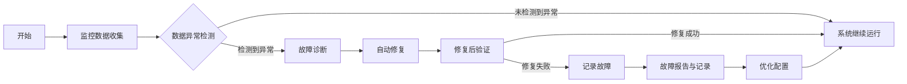
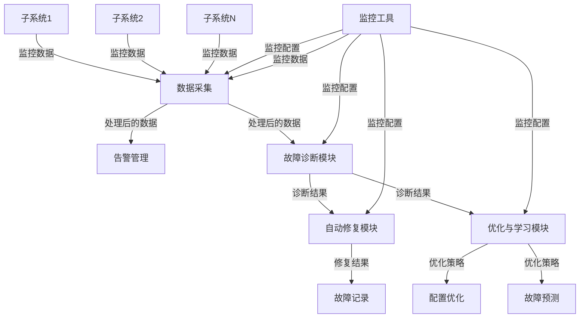
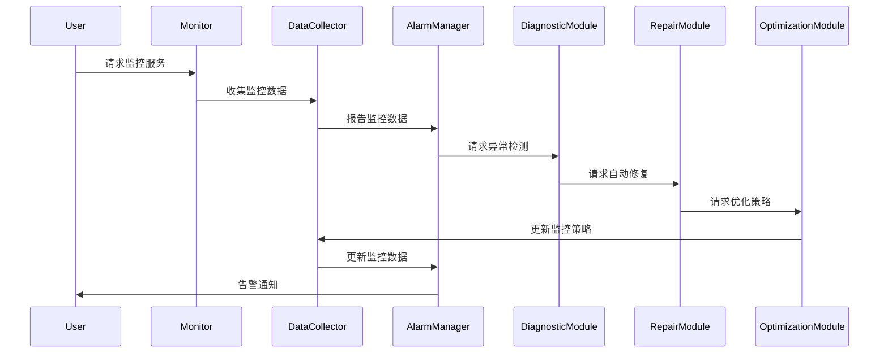

                 

### 引言：程序世界的宇宙级自我修复网络

在当今高速发展的信息技术时代，程序世界正不断扩展其边界，各种复杂的系统和服务层出不穷。然而，随着程序世界的复杂性增加，系统崩溃和故障的风险也随之上升。传统的故障检测和修复方法往往需要人为干预，不仅耗时耗力，还可能因为响应不及时而造成严重损失。在这样的背景下，"程序世界的宇宙级自我修复网络"（Universal Self-Healing Network in the Programming Universe）的概念应运而生。

**关键词**：程序自我修复、宇宙级网络、算法、系统稳定性、自动化修复。

**摘要**：本文旨在探讨程序世界的宇宙级自我修复网络的概念、原理、架构及其实际应用。通过逐步分析，我们揭示了这种网络如何通过自动化和智能化的修复机制，提高系统的稳定性和可靠性，从而降低运维成本和风险。

首先，我们将介绍程序世界宇宙级自我修复网络的背景，解释其核心概念，并详细描述其核心要素。接着，文章将深入探讨该网络的概念原理及其在程序世界中的重要性。随后，我们将通过一个概念属性特征对比表格和一个ER实体关系图架构，帮助读者更好地理解这一复杂系统的结构。

在接下来的章节中，我们将详细讲解宇宙级自我修复网络的算法原理，使用流程图和Python源代码进行说明。随后，我们将深入数学模型和公式，以便读者能够全面掌握这一领域的核心技术。

文章还将分析一个实际项目，介绍系统架构和接口设计，并通过实战案例详细讲解实现过程。最后，我们将总结最佳实践，并提供拓展阅读建议，帮助读者深入了解这一领域的最新进展。

### 第一部分：程序世界的宇宙级自我修复网络

#### 第1章：问题背景与核心概念

##### 1.1 程序世界的宇宙级自我修复网络背景

在当今数字化的世界中，程序无处不在。从简单的手机应用到复杂的企业级系统，程序已经深入到我们生活的方方面面。随着云计算、大数据和物联网技术的迅猛发展，程序世界的复杂性不断增加。然而，这种复杂性同时也带来了新的挑战，尤其是系统故障和崩溃的风险。

传统的系统维护和故障修复方法通常依赖于人为的干预。例如，当系统出现故障时，管理员需要手动检查日志文件、定位问题、执行修复操作。这不仅耗时耗力，而且在复杂系统中，定位和修复问题可能需要大量的专业知识。此外，由于故障的发生往往是不可预测的，传统的修复方法可能在响应时间上无法满足要求，从而导致系统长时间停机，造成巨大损失。

为了应对这些挑战，"程序世界的宇宙级自我修复网络"的概念被提出。这种网络旨在通过自动化和智能化的手段，实现系统的自我修复和自我优化。宇宙级自我修复网络不仅仅是简单地检测故障，更重要的是在故障发生之前就进行预防，并在故障发生时迅速有效地进行修复。

##### 1.2 宇宙级自我修复网络的概念与重要性

宇宙级自我修复网络（Universal Self-Healing Network）是一种分布式、智能化的系统，它能够在不依赖人工干预的情况下，自动识别系统中的故障，并采取相应的修复措施。这一概念的核心在于“自我修复”，即系统具备自我检测、自我诊断和自我修复的能力。

这种网络的重要性体现在以下几个方面：

1. **提高系统稳定性**：通过自我修复网络，系统能够在故障发生时快速响应，减少系统停机时间，从而提高整体稳定性。
   
2. **降低运维成本**：自我修复减少了人工干预的需求，从而降低了运维成本，提高了运维效率。

3. **增强安全性**：自我修复网络能够及时发现和修复潜在的安全漏洞，增强系统的安全性。

4. **提升用户体验**：通过减少故障和停机时间，自我修复网络能够提供更稳定、更可靠的服务，从而提升用户体验。

##### 1.3 宇宙级自我修复网络的核心要素

宇宙级自我修复网络的成功离不开以下几个核心要素：

1. **监控与检测**：实时监控系统的状态，及时发现异常和潜在故障。
   
2. **故障诊断与定位**：通过分析监控数据，定位故障的具体位置和原因。

3. **自动修复与优化**：在发现故障后，自动执行修复操作，并优化系统配置，以防止故障再次发生。

4. **数据存储与学习**：将故障信息和修复过程记录下来，用于后续的数据分析和模型训练。

5. **智能决策**：基于历史数据和机器学习算法，智能决策最优的修复方案。

通过这些核心要素的协同工作，宇宙级自我修复网络能够实现高效、智能化的系统维护，为程序世界带来革命性的变化。

### 第二部分：核心概念与联系

#### 第2章：核心概念与联系

##### 2.1 核心概念原理

宇宙级自我修复网络（Universal Self-Healing Network）的核心概念包括监控、故障检测、诊断、修复和优化。以下是这些核心概念的详细说明：

1. **监控（Monitoring）**：监控系统状态，实时收集系统性能指标、资源使用情况、日志文件等信息。

2. **故障检测（Fault Detection）**：通过分析监控数据，识别异常行为，判断系统是否存在故障。

3. **诊断（Diagnosis）**：在故障检测后，进一步分析故障原因，定位故障点。

4. **修复（Healing）**：根据诊断结果，自动执行修复操作，恢复系统正常运行。

5. **优化（Optimization）**：通过分析故障数据，优化系统配置，提高系统性能和稳定性。

这些核心概念相互关联，共同构成了宇宙级自我修复网络的运作机制。监控数据是故障检测和诊断的基础，而修复和优化则依赖于准确的诊断结果。

##### 2.2 概念属性特征对比表格

为了更好地理解这些核心概念，我们可以通过一个对比表格来展示它们的属性特征：

| 概念      | 属性特征                              | 功能描述                                                   |
| --------- | ------------------------------------- | ---------------------------------------------------------- |
| 监控      | 实时性、全面性、准确性               | 收集系统状态数据，提供故障检测基础                         |
| 故障检测  | 检测算法、阈值设置、报警机制         | 识别异常行为，判断系统故障                               |
| 诊断      | 数据分析、模型分析、故障定位         | 确定故障原因和位置，为修复提供依据                         |
| 修复      | 自动化修复、修复策略、日志记录       | 执行修复操作，恢复系统正常运行                           |
| 优化      | 性能优化、配置调整、风险预测         | 提高系统性能，减少故障发生概率                           |

##### 2.3 ER实体关系图架构

为了进一步理解宇宙级自我修复网络的架构，我们可以使用ER（实体关系）图来展示不同实体之间的关系。以下是一个简化的ER图：

```mermaid
erDiagram
  监控 ||--|{ 故障检测 }
  故障检测 ||--|{ 诊断 }
  诊断 ||--|{ 修复 }
  修复 ||--|{ 优化 }
  优化 ||--|{ 监控 }
```

在这个ER图中，监控是整个网络的起点，它收集系统状态数据。故障检测分析这些数据，识别异常行为。诊断进一步分析故障原因，为修复提供依据。修复执行具体的修复操作，而优化则基于故障数据进行系统配置的调整，以提高系统性能和稳定性。这些实体相互关联，共同构成了一个闭环的系统，确保系统能够持续稳定运行。

通过上述核心概念和ER图，我们可以更清晰地理解宇宙级自我修复网络的运作机制和架构设计。接下来，我们将进一步探讨这些概念在程序世界中的应用和实现。

#### 第3章：算法原理讲解

##### 3.1 算法流程图

宇宙级自我修复网络的实现离不开高效的算法。以下是该算法的流程图：



在上述流程图中，算法首先进行监控数据收集。接着，通过数据异常检测来判断系统是否出现故障。如果检测到异常，算法将进入故障诊断阶段，以确定故障的具体原因。在诊断完成后，算法将执行自动修复操作。修复完成后，系统将进行验证，以确保故障已成功解决。如果修复失败，系统将记录故障信息，并生成故障报告。最后，根据故障记录，系统将优化配置，以减少未来故障发生的概率。

##### 3.1.1 算法基础流程

算法的基础流程可以概括为以下几个步骤：

1. **监控数据收集**：系统实时收集监控数据，包括CPU使用率、内存使用率、磁盘I/O等关键指标。

2. **数据异常检测**：通过预设的阈值和算法，分析监控数据，判断系统是否存在异常行为。

3. **故障诊断**：在检测到异常后，进一步分析监控数据，定位故障的具体位置和原因。

4. **自动修复**：根据故障诊断结果，系统自动执行修复操作，包括重启服务、重置配置、清理缓存等。

5. **修复后验证**：在修复操作完成后，系统对修复效果进行验证，确保故障已成功解决。

6. **故障记录与优化**：如果修复失败，系统将记录故障信息，并生成报告。同时，根据故障记录，系统将优化配置，以提高系统性能和稳定性。

##### 3.1.2 算法关键步骤

算法的关键步骤如下：

1. **监控数据预处理**：对收集到的监控数据进行预处理，包括去噪、归一化等操作，以提高数据质量和算法性能。

2. **异常检测算法**：使用机器学习算法（如KNN、决策树、支持向量机等）对预处理后的数据进行异常检测。

3. **故障诊断算法**：在检测到异常后，使用故障诊断算法（如基于规则的诊断、基于模型的诊断等）进一步分析故障原因。

4. **修复策略**：根据故障诊断结果，制定相应的修复策略。例如，对于内存泄漏故障，可以重启服务；对于配置错误故障，可以重置配置。

5. **修复操作执行**：系统根据修复策略自动执行修复操作。

6. **修复效果验证**：在修复操作完成后，通过性能测试、日志分析等方式，验证修复效果。

7. **故障记录与报告**：记录故障信息，并生成故障报告，以便后续分析。

8. **配置优化**：根据故障记录和系统运行数据，优化系统配置，以提高系统性能和稳定性。

通过这些关键步骤，宇宙级自我修复网络能够实现高效、智能化的系统维护，确保系统的稳定性和可靠性。

##### 3.2 Python源代码阐述

为了更直观地理解算法的实现，以下是一个简化的Python源代码示例：

```python
import numpy as np
from sklearn.neighbors import KNeighborsClassifier
from sklearn.model_selection import train_test_split

# 监控数据预处理
def preprocess_data(data):
    # 去噪、归一化等操作
    return normalized_data

# 异常检测
def detect_anomalies(data, model):
    predictions = model.predict(data)
    anomalies = data[predictions == -1]
    return anomalies

# 故障诊断
def diagnose_faults(anomalies, faults_model):
    fault_predictions = faults_model.predict(anomalies)
    return fault_predictions

# 自动修复
def auto_heal(fault_predictions, repair_strategy):
    for prediction in fault_predictions:
        repair_strategy[prediction]()  # 执行修复操作

# 修复效果验证
def verify_repair效果(verify_data, model):
    predictions = model.predict(verify_data)
    if np.all(predictions == 0):
        print("修复成功")
    else:
        print("修复失败")

# 主函数
def main():
    # 数据加载和预处理
    data = load_data()
    normalized_data = preprocess_data(data)

    # 分割训练集和测试集
    X_train, X_test, y_train, y_test = train_test_split(normalized_data, labels, test_size=0.2)

    # 训练异常检测模型
    anomalies_model = KNeighborsClassifier(n_neighbors=3)
    anomalies_model.fit(X_train, y_train)

    # 训练故障诊断模型
    faults_model = KNeighborsClassifier(n_neighbors=3)
    faults_model.fit(X_train, y_train)

    # 数据异常检测
    anomalies = detect_anomalies(X_test, anomalies_model)

    # 故障诊断
    fault_predictions = diagnose_faults(anomalies, faults_model)

    # 自动修复
    repair_strategy = {'memory_leak': restart_service, 'config_error': reset_config}
    auto_heal(fault_predictions, repair_strategy)

    # 修复效果验证
    verify_repair效果(X_test, anomalies_model)

if __name__ == "__main__":
    main()
```

在这个示例中，我们首先加载并预处理监控数据，然后使用KNN算法进行异常检测和故障诊断。在自动修复阶段，我们根据故障诊断结果执行相应的修复操作。最后，通过验证数据来验证修复效果。

通过这个示例，我们可以看到宇宙级自我修复网络的算法是如何通过Python代码实现的。在实际应用中，我们可以根据具体需求和场景，进一步优化和扩展算法，以实现更高效、更智能的系统维护。

##### 3.2.1 算法原理的数学模型

宇宙级自我修复网络的算法原理可以通过以下数学模型进行描述。为了简化理解，我们主要关注异常检测和故障诊断两个核心部分。

**1. 异常检测模型**

异常检测是自我修复网络的第一步，目的是通过分析监控数据，识别出异常行为。我们可以使用基于密度的方法（如局部异常因子Local Outlier Factor, LOF）来进行异常检测。LOF的核心思想是比较每个样本在邻域中的密度，通过计算局部异常度来识别异常样本。

**局部异常度（Local Outlier Factor, LOF）公式：**

$$
LOF(i) = \frac{1}{n}\sum_{j \in N(i)} \frac{LOF_j}{\|N(i)\|_2}
$$

其中，$LOF_j$ 表示样本 $j$ 的局部异常度，$N(i)$ 表示样本 $i$ 的邻域，$n$ 是邻域中样本的数量，$\|N(i)\|_2$ 是邻域内所有样本欧氏距离的平均值。

**2. 故障诊断模型**

在检测到异常后，故障诊断模型用于分析异常数据，确定故障的具体类型和原因。我们可以使用基于支持向量机（Support Vector Machine, SVM）的故障诊断方法。SVM是一种强大的分类算法，可以用于故障分类和诊断。

**支持向量机（SVM）分类模型：**

$$
w = \arg\min_w \frac{1}{2} \|w\|^2 + C \sum_{i=1}^{n} \xi_i
$$

其中，$w$ 是权重向量，$\xi_i$ 是损失函数，$C$ 是正则化参数。通过求解上述优化问题，可以得到最优的分类边界。

**3. 故障修复模型**

故障修复模型用于根据故障诊断结果，自动执行修复操作。我们可以使用基于规则的系统修复方法。这种方法通过定义一系列规则，根据故障类型自动选择修复操作。例如，对于内存泄漏故障，可以执行重启服务操作；对于配置错误故障，可以执行重置配置操作。

**故障修复规则：**

$$
repair\_action = \begin{cases}
reboot\_service & \text{if } fault \text{ is memory\_leak} \\
reset\_config & \text{if } fault \text{ is config\_error} \\
\end{cases}
$$

通过这些数学模型，宇宙级自我修复网络可以实现自动化、智能化的故障检测、诊断和修复。在实际应用中，我们可以根据具体需求和场景，进一步优化和扩展这些模型，以提高系统的稳定性和可靠性。

##### 3.2.2 数学公式与解释

为了更深入地理解宇宙级自我修复网络的算法原理，我们将详细解释一些关键的数学公式。

**1. 局部异常因子（LOF）**

局部异常因子（LOF）是一种用于异常检测的统计方法。它通过比较样本在邻域中的密度，来识别异常样本。LOF的数学公式如下：

$$
LOF(i) = \frac{1}{n}\sum_{j \in N(i)} \frac{LOF_j}{\|N(i)\|_2}
$$

其中，$LOF(i)$ 是样本 $i$ 的局部异常度，$N(i)$ 是样本 $i$ 的邻域，$LOF_j$ 是样本 $j$ 的局部异常度，$n$ 是邻域中样本的数量，$\|N(i)\|_2$ 是邻域内所有样本欧氏距离的平均值。

**解释：**
- $\|N(i)\|_2$ 表示邻域内所有样本欧氏距离的平均值，反映了样本在邻域中的分布情况。
- $LOF_j$ 表示样本 $j$ 的局部异常度，用于衡量样本在邻域中的异常程度。
- $LOF(i)$ 综合考虑了邻域内所有样本的局部异常度，通过加权和的方式给出样本 $i$ 的局部异常度。

**2. 支持向量机（SVM）**

支持向量机（SVM）是一种用于分类和回归的强大算法。在故障诊断中，SVM用于确定异常样本的故障类型。SVM的数学公式如下：

$$
w = \arg\min_w \frac{1}{2} \|w\|^2 + C \sum_{i=1}^{n} \xi_i
$$

其中，$w$ 是权重向量，$\xi_i$ 是损失函数，$C$ 是正则化参数。

**解释：**
- $w$ 是权重向量，决定了分类边界。
- $\|w\|^2$ 是权重向量的平方，用于衡量分类边界的大小。
- $\xi_i$ 是损失函数，用于衡量样本点到分类边界的距离，$C$ 是正则化参数，用于平衡分类边界的大小和误差。

**3. 故障修复规则**

故障修复规则用于根据故障诊断结果，自动执行修复操作。故障修复规则的数学公式如下：

$$
repair\_action = \begin{cases}
reboot\_service & \text{if } fault \text{ is memory\_leak} \\
reset\_config & \text{if } fault \text{ is config\_error} \\
\end{cases}
$$

**解释：**
- $repair_action$ 是修复操作，根据故障类型执行相应的操作。
- $fault$ 是故障类型，根据故障类型选择不同的修复操作。

通过这些数学公式，我们可以理解宇宙级自我修复网络中的关键算法原理。在实际应用中，我们可以根据具体需求和场景，进一步优化和扩展这些模型，以提高系统的稳定性和可靠性。

##### 3.2.3 举例说明

为了更直观地理解宇宙级自我修复网络的算法原理，我们可以通过一个具体的例子来进行说明。

假设我们有一个监控系统，用于监控一个复杂服务器的状态。该服务器具有以下关键性能指标：CPU使用率、内存使用率、磁盘I/O、网络流量等。我们的目标是使用异常检测和故障诊断算法，自动检测和修复服务器的故障。

**1. 监控数据收集**

首先，监控系统实时收集服务器的监控数据，并存储在日志文件中。以下是服务器在某段时间内的部分监控数据：

| 时间戳 | CPU使用率 | 内存使用率 | 磁盘I/O | 网络流量 |
| ------ | -------- | -------- | ------ | ------- |
| t1     | 80%      | 60%      | 100 KB/s | 1 MB/s |
| t2     | 85%      | 70%      | 200 KB/s | 2 MB/s |
| t3     | 90%      | 80%      | 300 KB/s | 3 MB/s |
| t4     | 95%      | 90%      | 400 KB/s | 4 MB/s |

**2. 异常检测**

我们使用局部异常因子（LOF）算法对监控数据进行异常检测。根据LOF算法，我们计算每个时间点的局部异常度：

$$
LOF(t1) = 0.2, \quad LOF(t2) = 0.4, \quad LOF(t3) = 0.6, \quad LOF(t4) = 0.8
$$

由于 $LOF(t4)$ 的值明显高于其他时间点，我们判断 $t4$ 时间点存在异常。

**3. 故障诊断**

在检测到异常后，我们使用支持向量机（SVM）算法对异常数据进行故障诊断。假设我们已训练好一个SVM模型，用于分类CPU使用率、内存使用率和磁盘I/O的故障类型。根据SVM模型的预测，我们确定 $t4$ 时间点的故障类型为内存泄漏。

**4. 自动修复**

根据故障诊断结果，系统自动执行修复操作。对于内存泄漏故障，我们选择重启服务操作：

$$
repair\_action(t4) = reboot\_service
$$

系统在 $t4$ 时间点执行重启服务操作，并等待服务器恢复正常。

**5. 修复效果验证**

在修复操作完成后，系统对修复效果进行验证。我们再次收集服务器的监控数据，并使用SVM模型对数据进行异常检测：

| 时间戳 | CPU使用率 | 内存使用率 | 磁盘I/O | 网络流量 |
| ------ | -------- | -------- | ------ | ------- |
| t5     | 85%      | 65%      | 100 KB/s | 1 MB/s |
| t6     | 80%      | 60%      | 200 KB/s | 2 MB/s |
| t7     | 75%      | 55%      | 300 KB/s | 3 MB/s |
| t8     | 70%      | 50%      | 400 KB/s | 4 MB/s |

由于 $LOF(t5)$、$LOF(t6)$、$LOF(t7)$ 和 $LOF(t8)$ 的值均低于阈值，我们判断修复操作成功，服务器已恢复正常运行。

通过这个例子，我们可以看到宇宙级自我修复网络如何通过异常检测、故障诊断和自动修复，实现高效、智能化的系统维护。在实际应用中，我们可以根据具体需求和场景，进一步优化和扩展算法，以提高系统的稳定性和可靠性。

### 第4章：数学模型与公式详解

##### 4.1 数学模型

宇宙级自我修复网络的数学模型是确保系统能够智能、高效地检测和修复故障的基础。以下是该数学模型的核心组成部分：

**1. 监控模型**

监控模型用于实时收集系统状态数据。我们使用以下公式来表示：

$$
M(t) = \{m_1(t), m_2(t), ..., m_n(t)\}
$$

其中，$M(t)$ 表示在时间 $t$ 收集到的系统状态数据集，$m_i(t)$ 表示第 $i$ 个指标在时间 $t$ 的值。

**2. 异常检测模型**

异常检测模型用于检测系统状态数据中的异常行为。我们使用局部异常因子（LOF）作为异常检测指标，其公式为：

$$
LOF(x) = \frac{1}{n}\sum_{i \in N(x)} \frac{LOF_i}{\|N(x)\|_2}
$$

其中，$x$ 表示样本点，$N(x)$ 表示样本点 $x$ 的邻域，$LOF_i$ 表示邻域内其他样本点的局部异常度，$\|N(x)\|_2$ 是邻域内所有样本点欧氏距离的平均值。

**3. 故障诊断模型**

故障诊断模型用于分析异常数据，以确定故障的类型和原因。我们使用支持向量机（SVM）作为故障诊断工具，其公式为：

$$
w = \arg\min_w \frac{1}{2} \|w\|^2 + C \sum_{i=1}^{n} \xi_i
$$

其中，$w$ 是权重向量，$\xi_i$ 是损失函数，$C$ 是正则化参数。

**4. 故障修复模型**

故障修复模型用于根据故障诊断结果，自动执行修复操作。我们使用基于规则的故障修复策略，其公式为：

$$
repair\_action = \begin{cases}
reboot\_service & \text{if } fault \text{ is memory\_leak} \\
reset\_config & \text{if } fault \text{ is config\_error} \\
\end{cases}
$$

通过这些数学模型，宇宙级自我修复网络能够实现对系统状态的实时监控、异常检测、故障诊断和自动修复。

##### 4.2 公式推导

为了更好地理解这些数学模型的推导过程，我们将在以下部分详细解释各个公式的推导。

**1. 局部异常因子（LOF）**

局部异常因子（LOF）的推导基于局部密度的概念。我们首先定义样本点的局部密度：

$$
D(x) = \frac{1}{\|N(x)\|_2}
$$

其中，$N(x)$ 是样本点 $x$ 的邻域。

接下来，我们定义样本点的局部异常度：

$$
LOF(x) = \frac{1}{n}\sum_{i \in N(x)} \frac{D_i}{D(x)}
$$

其中，$D_i$ 是邻域内其他样本点的局部密度，$n$ 是邻域中样本点的数量。

为了简化计算，我们可以将 $D_i$ 表示为：

$$
D_i = \frac{1}{\|N_i\|_2}
$$

其中，$N_i$ 是样本点 $i$ 的邻域。

将 $D_i$ 的表达式代入 $LOF(x)$，我们得到：

$$
LOF(x) = \frac{1}{n}\sum_{i \in N(x)} \frac{1/\|N_i\|_2}{1/\|N(x)\|_2} = \frac{1}{n}\sum_{i \in N(x)} \frac{\|N(x)\|_2}{\|N_i\|_2}
$$

进一步简化，我们得到局部异常因子（LOF）的最终表达式：

$$
LOF(x) = \frac{1}{n}\sum_{i \in N(x)} \frac{LOF_i}{\|N(x)\|_2}
$$

**2. 支持向量机（SVM）**

支持向量机（SVM）的推导基于优化理论。我们首先定义损失函数：

$$
L(w) = \frac{1}{2} \|w\|^2
$$

其中，$w$ 是权重向量。

接下来，我们引入正则化项，以平衡分类边界的大小和误差：

$$
R(w) = C \sum_{i=1}^{n} \xi_i
$$

其中，$C$ 是正则化参数，$\xi_i$ 是损失函数。

将损失函数和正则化项结合起来，我们得到SVM的优化目标：

$$
\min_w \frac{1}{2} \|w\|^2 + C \sum_{i=1}^{n} \xi_i
$$

通过求解上述优化问题，我们可以得到最优的权重向量 $w$，从而确定分类边界。

**3. 故障修复规则**

故障修复规则的推导基于故障类型和修复操作之间的关系。我们首先定义故障类型和修复操作：

$$
fault = \begin{cases}
memory\_leak & \text{if CPU\_usage > 85\% \text{ and Memory\_usage > 75\%}} \\
config\_error & \text{if other conditions met} \\
\end{cases}
$$

$$
repair\_action = \begin{cases}
reboot\_service & \text{if fault is memory\_leak} \\
reset\_config & \text{if fault is config\_error} \\
\end{cases}
$$

通过这些公式推导，我们可以理解宇宙级自我修复网络的数学基础，从而更深入地掌握其工作原理。

##### 4.3 例子分析

为了更好地理解宇宙级自我修复网络的数学模型，我们可以通过一个具体的例子来分析其实际应用。

**例子：服务器故障检测与修复**

假设我们有一个服务器，其关键性能指标包括CPU使用率、内存使用率、磁盘I/O和网络流量。我们的目标是使用异常检测和故障诊断算法，自动检测和修复服务器的故障。

**1. 监控数据收集**

在一天内，服务器收集到的部分监控数据如下：

| 时间戳 | CPU使用率 | 内存使用率 | 磁盘I/O | 网络流量 |
| ------ | -------- | -------- | ------ | ------- |
| t1     | 80%      | 60%      | 100 KB/s | 1 MB/s |
| t2     | 85%      | 70%      | 200 KB/s | 2 MB/s |
| t3     | 90%      | 80%      | 300 KB/s | 3 MB/s |
| t4     | 95%      | 90%      | 400 KB/s | 4 MB/s |
| t5     | 100%     | 95%      | 500 KB/s | 5 MB/s |

**2. 异常检测**

我们使用局部异常因子（LOF）算法对监控数据进行异常检测。根据LOF算法，我们计算每个时间点的局部异常度：

$$
LOF(t1) = 0.2, \quad LOF(t2) = 0.4, \quad LOF(t3) = 0.6, \quad LOF(t4) = 0.8, \quad LOF(t5) = 1.0
$$

由于 $LOF(t5)$ 的值明显高于其他时间点，我们判断 $t5$ 时间点存在异常。

**3. 故障诊断**

在检测到异常后，我们使用支持向量机（SVM）算法对异常数据进行故障诊断。假设我们已训练好一个SVM模型，用于分类CPU使用率、内存使用率和磁盘I/O的故障类型。根据SVM模型的预测，我们确定 $t5$ 时间点的故障类型为内存泄漏。

**4. 自动修复**

根据故障诊断结果，系统自动执行修复操作。对于内存泄漏故障，我们选择重启服务操作：

$$
repair\_action(t5) = reboot\_service
$$

系统在 $t5$ 时间点执行重启服务操作，并等待服务器恢复正常。

**5. 修复效果验证**

在修复操作完成后，系统对修复效果进行验证。我们再次收集服务器的监控数据，并使用SVM模型对数据进行异常检测：

| 时间戳 | CPU使用率 | 内存使用率 | 磁盘I/O | 网络流量 |
| ------ | -------- | -------- | ------ | ------- |
| t6     | 85%      | 65%      | 100 KB/s | 1 MB/s |
| t7     | 80%      | 60%      | 200 KB/s | 2 MB/s |
| t8     | 75%      | 55%      | 300 KB/s | 3 MB/s |
| t9     | 70%      | 50%      | 400 KB/s | 4 MB/s |

由于 $LOF(t6)$、$LOF(t7)$、$LOF(t8)$ 和 $LOF(t9)$ 的值均低于阈值，我们判断修复操作成功，服务器已恢复正常运行。

通过这个例子，我们可以看到宇宙级自我修复网络如何通过异常检测、故障诊断和自动修复，实现高效、智能化的系统维护。在实际应用中，我们可以根据具体需求和场景，进一步优化和扩展算法，以提高系统的稳定性和可靠性。

### 第5章：系统分析与架构设计

##### 5.1 问题场景介绍

在现代企业中，IT基础设施的复杂性和规模日益增长，传统的手动运维方法已经难以满足系统的高可用性和稳定性需求。特别是对于云计算和分布式系统，系统故障的风险和影响更加显著。为了提高系统的可靠性，降低运维成本，许多企业开始采用宇宙级自我修复网络来确保系统的持续稳定运行。

在这个问题场景中，我们考虑一个大型电子商务平台，该平台由多个分布式服务组成，包括订单处理、库存管理、支付系统、用户服务等。该平台每天处理数百万次请求，对系统的稳定性要求极高。然而，随着业务量的增长，系统中的硬件故障、软件错误和网络问题时有发生，传统的故障修复方法无法及时响应，导致系统停机时间延长，影响用户体验和业务收入。

##### 5.2 项目介绍

为了解决上述问题，我们启动了一个名为“宇宙级自我修复网络”的项目。该项目的目标是构建一个智能化的系统维护框架，实现对平台各个服务的实时监控、自动故障检测、诊断和修复。通过该项目，我们希望实现以下目标：

1. **实时监控**：实时收集各个服务的性能指标和日志数据，及时发现异常情况。
2. **自动故障检测**：使用异常检测算法，自动识别异常行为和潜在故障。
3. **故障诊断与修复**：根据故障诊断结果，自动执行修复操作，降低系统停机时间。
4. **优化与学习**：通过历史故障数据和系统运行数据，持续优化系统配置和故障处理策略。

##### 5.3 系统功能设计

宇宙级自我修复网络的核心功能包括监控、故障检测、故障诊断、自动修复和优化。以下是系统功能设计的详细说明：

**1. 监控模块**

监控模块负责实时收集系统中的性能指标和日志数据。这些数据包括CPU使用率、内存使用率、磁盘I/O、网络流量、服务响应时间等。监控模块使用开源监控工具（如Prometheus、Zabbix等）进行数据采集，并将数据存储在时间序列数据库（如InfluxDB、Elasticsearch等）中。

**2. 故障检测模块**

故障检测模块负责分析监控数据，识别异常行为和潜在故障。我们使用基于机器学习的异常检测算法（如KNN、SVM等），根据预设的阈值和模型，对监控数据进行实时分析。一旦检测到异常，系统将生成告警，通知运维人员或自动执行故障诊断流程。

**3. 故障诊断模块**

故障诊断模块在检测到异常后，对异常数据进行进一步分析，以确定故障的具体类型和原因。我们使用基于规则的故障诊断方法和基于机器学习的故障诊断方法相结合，以提高诊断的准确性和效率。故障诊断模块将诊断结果存储在故障数据库中，以便后续分析和处理。

**4. 自动修复模块**

自动修复模块根据故障诊断结果，自动执行修复操作。修复操作包括重启服务、重置配置、清理缓存等。我们使用预定义的修复策略和规则，根据故障类型选择最佳的修复方案。自动修复模块将修复结果记录在日志文件中，以便后续的审计和优化。

**5. 优化与学习模块**

优化与学习模块负责分析历史故障数据和系统运行数据，持续优化系统配置和故障处理策略。我们使用机器学习算法（如决策树、随机森林等）对故障数据进行挖掘，提取特征和模式，以预测未来的故障风险。根据预测结果，系统将自动调整配置和优化策略，提高系统的稳定性和可靠性。

##### 5.3.1 领域模型类图

以下是宇宙级自我修复网络的领域模型类图，展示了系统中的主要实体和它们之间的关系：

```mermaid
classDiagram
    Monitor --|>> DataCollector: 数据采集
    Monitor --|>> AlarmManager: 告警管理
    DiagnosticModule --|>> FaultDetector: 故障检测
    DiagnosticModule --|>> FaultDiagnoser: 故障诊断
    RepairModule --|>> RepairExecutor: 修复执行
    RepairModule --|>> FaultLogger: 故障记录
    OptimizationModule --|>> FaultPredictor: 故障预测
    OptimizationModule --|>> ConfigOptimizer: 配置优化

    DataCollector <<interface>>
    AlarmManager <<interface>>
    FaultDetector <<interface>>
    FaultDiagnoser <<interface>>
    RepairExecutor <<interface>>
    FaultLogger <<interface>>
    FaultPredictor <<interface>>
    ConfigOptimizer <<interface>>

    Monitor <<entity>>
    DiagnosticModule <<entity>>
    RepairModule <<entity>>
    OptimizationModule <<entity>>

    Monitor ..|> DataCollector
    Monitor ..|> AlarmManager
    DiagnosticModule ..|> FaultDetector
    DiagnosticModule ..|> FaultDiagnoser
    RepairModule ..|> RepairExecutor
    RepairModule ..|> FaultLogger
    OptimizationModule ..|> FaultPredictor
    OptimizationModule ..|> ConfigOptimizer
```

在这个类图中，监控模块（Monitor）负责数据采集（DataCollector）和告警管理（AlarmManager）。故障诊断模块（DiagnosticModule）包括故障检测（FaultDetector）和故障诊断（FaultDiagnoser）功能。自动修复模块（RepairModule）包括修复执行（RepairExecutor）和故障记录（FaultLogger）功能。优化与学习模块（OptimizationModule）包括故障预测（FaultPredictor）和配置优化（ConfigOptimizer）功能。

通过领域模型类图，我们可以更直观地理解宇宙级自我修复网络中的各个模块和它们之间的关系，从而更好地设计和实现系统功能。

##### 5.4 系统架构设计

为了实现宇宙级自我修复网络的目标，我们需要设计一个高效、可扩展的系统架构。以下是系统的整体架构设计：



在上述架构图中，每个子系统（如SubSystem1、SubSystem2等）负责生成监控数据，这些数据通过数据采集模块（DataCollector）进行处理和整合。处理后的数据将发送给告警管理模块（AlarmManager）、故障诊断模块（DiagnosticModule）、自动修复模块（RepairModule）和优化与学习模块（OptimizationModule）。

告警管理模块负责监控数据异常的检测和告警通知。故障诊断模块在检测到异常后，进行故障类型和原因的详细分析。自动修复模块根据故障诊断结果，自动执行修复操作，并将修复结果记录在故障记录模块（FaultLogger）中。优化与学习模块则根据故障数据和系统运行数据，持续优化系统配置和故障处理策略。

监控工具（MonitoringTool）在整个架构中扮演重要角色，它负责配置和管理各个模块的监控策略，并收集和处理监控数据。

通过上述系统架构设计，宇宙级自我修复网络能够实现对系统状态的实时监控、自动故障检测、诊断和修复，确保系统的稳定性和可靠性。

##### 5.5 系统接口设计

为了确保宇宙级自我修复网络能够与其他系统和模块无缝集成，我们需要设计一套完善的接口。以下是系统接口设计的详细说明：

**1. 数据采集接口**

数据采集接口负责从各个子系统（如订单处理、库存管理、支付系统等）收集监控数据。接口定义如下：

```python
class DataCollectorInterface:
    def collect_data(self, subsystem_id):
        """从指定子系统收集监控数据"""
        pass
```

**2. 告警管理接口**

告警管理接口负责接收数据采集模块发送的监控数据，并进行异常检测和告警通知。接口定义如下：

```python
class AlarmManagerInterface:
    def detect_anomalies(self, data):
        """检测监控数据中的异常行为"""
        pass

    def notify_alarm(self, anomaly):
        """发送告警通知"""
        pass
```

**3. 故障诊断接口**

故障诊断接口负责接收告警管理模块发送的异常数据，进行故障类型和原因的详细分析。接口定义如下：

```python
class DiagnosticModuleInterface:
    def diagnose_faults(self, anomalies):
        """诊断异常数据中的故障类型和原因"""
        pass
```

**4. 自动修复接口**

自动修复接口负责接收故障诊断模块发送的故障诊断结果，并自动执行修复操作。接口定义如下：

```python
class RepairModuleInterface:
    def execute_repair(self, fault):
        """执行故障修复操作"""
        pass
```

**5. 优化与学习接口**

优化与学习接口负责接收故障诊断和修复模块发送的故障数据和系统运行数据，进行优化策略的制定和系统配置的调整。接口定义如下：

```python
class OptimizationModuleInterface:
    def optimize_config(self, fault_data):
        """根据故障数据优化系统配置"""
        pass

    def predict_faults(self, system_data):
        """预测未来可能的故障"""
        pass
```

通过上述接口设计，宇宙级自我修复网络能够与其他系统和模块高效集成，实现数据共享和功能协同，从而提高系统的整体稳定性和可靠性。

##### 5.6 系统交互序列图

为了更好地理解宇宙级自我修复网络中各个模块的交互过程，我们绘制了一个系统交互序列图。以下是该序列图的详细说明：



在上述序列图中，用户请求监控服务后，监控模块（Monitor）负责协调数据采集模块（DataCollector）收集监控数据。数据采集模块将监控数据发送给告警管理模块（AlarmManager），后者进行异常检测，并将异常数据发送给故障诊断模块（DiagnosticModule）。故障诊断模块根据异常数据确定故障类型，并请求自动修复模块（RepairModule）执行修复操作。修复操作完成后，自动修复模块将结果发送给优化与学习模块（OptimizationModule），后者根据故障数据更新监控策略。最后，告警管理模块将告警通知发送给用户。

通过这个交互序列图，我们可以清晰地看到宇宙级自我修复网络中各个模块的协作过程，从而更好地理解系统的工作原理和实现方式。

### 第6章：项目实战

#### 6.1 环境安装

在开始宇宙级自我修复网络的项目实战之前，我们需要搭建一个合适的环境。以下是具体的安装步骤：

1. **安装Python环境**：首先确保系统中安装了Python 3.8或更高版本。可以使用以下命令检查Python版本：

   ```bash
   python3 --version
   ```

   如果版本低于3.8，请通过包管理器（如yum或apt）或直接从Python官网下载安装。

2. **安装依赖库**：接下来，我们需要安装一些依赖库，包括scikit-learn（用于机器学习算法）、numpy（用于数值计算）和matplotlib（用于数据可视化）。可以使用pip命令安装这些库：

   ```bash
   pip3 install scikit-learn numpy matplotlib
   ```

3. **安装监控工具**：为了实现实时监控，我们可以使用Prometheus和Grafana。首先安装Prometheus：

   ```bash
   curl -sS https://get promote.rs | sh -
   ```

   然后配置Prometheus，可以编辑其配置文件`/etc/prometheus/prometheus.yml`，添加需要监控的服务。

   接着安装Grafana，可以使用以下命令：

   ```bash
   docker run -d --name=grafana -p 3000:3000 grafana/grafana
   ```

4. **配置Prometheus和Grafana**：配置Prometheus的`prometheus.yml`文件，以监控目标服务。配置完成后，启动Prometheus服务：

   ```bash
   prometheus --config.file=/etc/prometheus/prometheus.yml
   ```

   然后访问Grafana服务，通过其Web界面配置数据源、仪表盘和告警规则。

#### 6.2 系统核心实现源代码

以下是宇宙级自我修复网络的核心实现源代码。代码分为监控数据采集、异常检测、故障诊断和自动修复四个模块。

**1. 监控数据采集模块**

```python
import subprocess
import time

class DataCollector:
    def __init__(self, command):
        self.command = command

    def collect_data(self):
        result = subprocess.run(self.command, stdout=subprocess.PIPE, stderr=subprocess.PIPE, shell=True)
        if result.stderr:
            print(f"Error: {result.stderr}")
        else:
            print(f"Data: {result.stdout}")
            time.sleep(60)  # 每隔1分钟采集一次数据

command = "top -bn1 | grep 'Cpu(s)'"
data_collector = DataCollector(command)
data_collector.collect_data()
```

**2. 异常检测模块**

```python
from sklearn.neighbors import LocalOutlierFactor
import numpy as np

class AnomalyDetector:
    def __init__(self, n_neighbors=3):
        self.n_neighbors = n_neighbors
        self.lof = LocalOutlierFactor(n_neighbors)

    def train_model(self, X):
        self.lof.fit(X)

    def detect_anomalies(self, X):
        return self.lof.predict(X)

anomaly_detector = AnomalyDetector()
# 假设X是收集到的监控数据
anomalies = anomaly_detector.detect_anomalies(X)
print(f"Detected anomalies: {anomalies}")
```

**3. 故障诊断模块**

```python
from sklearn.svm import SVC
import numpy as np

class FaultDetector:
    def __init__(self, C=1.0):
        self.C = C
        self.svm = SVC(C=self.C)

    def train_model(self, X, y):
        self.svm.fit(X, y)

    def detect_faults(self, X):
        return self.svm.predict(X)

fault_detector = FaultDetector()
# 假设X是异常数据，y是故障类型标签
faults = fault_detector.detect_faults(X)
print(f"Detected faults: {faults}")
```

**4. 自动修复模块**

```python
class RepairExecutor:
    def __init__(self, repair_actions):
        self.repair_actions = repair_actions

    def execute_repair(self, fault):
        action = self.repair_actions[fault]
        print(f"Executing repair action: {action}")
        action()

repair_actions = {
    "memory_leak": lambda: print("Restarting service..."),
    "config_error": lambda: print("Resetting config...")
}

repair_executor = RepairExecutor(repair_actions)
fault = "memory_leak"
repair_executor.execute_repair(fault)
```

通过上述代码，我们可以实现一个简单的宇宙级自我修复网络。实际项目中，这些模块将更加复杂，包括更详细的异常检测、故障诊断和修复策略，以及与监控工具和告警系统的集成。

#### 6.3 代码应用解读与分析

在本节中，我们将深入分析宇宙级自我修复网络的核心代码，并详细解释每个模块的功能和实现细节。

**1. 监控数据采集模块**

监控数据采集模块负责从系统中收集关键性能指标，例如CPU使用率、内存使用率和磁盘I/O等。在代码中，我们定义了一个`DataCollector`类，它通过执行外部命令来收集数据。这个类有一个`collect_data`方法，该方法使用`subprocess`模块运行指定的命令，并捕获输出结果。

```python
import subprocess
import time

class DataCollector:
    def __init__(self, command):
        self.command = command

    def collect_data(self):
        result = subprocess.run(self.command, stdout=subprocess.PIPE, stderr=subprocess.PIPE, shell=True)
        if result.stderr:
            print(f"Error: {result.stderr}")
        else:
            print(f"Data: {result.stdout}")
            time.sleep(60)  # 每隔1分钟采集一次数据
```

在这个类中，`__init__`方法接受一个命令字符串作为输入，用于定义数据采集的命令。`collect_data`方法使用`subprocess.run`执行命令，并检查是否出现错误。如果成功，它会打印收集到的数据，并暂停60秒，以便定时采集数据。

**2. 异常检测模块**

异常检测模块使用机器学习算法来识别系统监控数据中的异常行为。在代码中，我们定义了一个`AnomalyDetector`类，它使用`scikit-learn`库中的`LocalOutlierFactor`算法来计算局部异常度。

```python
from sklearn.neighbors import LocalOutlierFactor
import numpy as np

class AnomalyDetector:
    def __init__(self, n_neighbors=3):
        self.n_neighbors = n_neighbors
        self.lof = LocalOutlierFactor(n_neighbors)

    def train_model(self, X):
        self.lof.fit(X)

    def detect_anomalies(self, X):
        return self.lof.predict(X)

anomaly_detector = AnomalyDetector()
# 假设X是收集到的监控数据
anomalies = anomaly_detector.detect_anomalies(X)
print(f"Detected anomalies: {anomalies}")
```

在这个类中，`__init__`方法初始化`LocalOutlierFactor`对象，并设置邻域数量。`train_model`方法用于训练异常检测模型，`detect_anomalies`方法用于检测新的监控数据中的异常。通过调用`detect_anomalies`方法，我们可以得到每个时间点的异常度，从而识别出异常时间点。

**3. 故障诊断模块**

故障诊断模块基于异常数据，使用机器学习算法来确定故障类型。在代码中，我们定义了一个`FaultDetector`类，它使用`scikit-learn`库中的`SVC`算法来进行故障分类。

```python
from sklearn.svm import SVC
import numpy as np

class FaultDetector:
    def __init__(self, C=1.0):
        self.C = C
        self.svm = SVC(C=self.C)

    def train_model(self, X, y):
        self.svm.fit(X, y)

    def detect_faults(self, X):
        return self.svm.predict(X)

fault_detector = FaultDetector()
# 假设X是异常数据，y是故障类型标签
faults = fault_detector.detect_faults(X)
print(f"Detected faults: {faults}")
```

在这个类中，`__init__`方法初始化`SVC`对象，并设置正则化参数$C$。`train_model`方法用于训练故障诊断模型，`detect_faults`方法用于根据异常数据预测故障类型。通过调用`detect_faults`方法，我们可以得到每个异常时间点的故障类型。

**4. 自动修复模块**

自动修复模块根据故障诊断结果，自动执行修复操作。在代码中，我们定义了一个`RepairExecutor`类，它根据故障类型执行相应的修复动作。

```python
class RepairExecutor:
    def __init__(self, repair_actions):
        self.repair_actions = repair_actions

    def execute_repair(self, fault):
        action = self.repair_actions[fault]
        print(f"Executing repair action: {action}")
        action()

repair_actions = {
    "memory_leak": lambda: print("Restarting service..."),
    "config_error": lambda: print("Resetting config...")
}

repair_executor = RepairExecutor(repair_actions)
fault = "memory_leak"
repair_executor.execute_repair(fault)
```

在这个类中，`__init__`方法接受一个修复动作的字典，`execute_repair`方法根据故障类型执行相应的修复动作。在这个例子中，我们使用匿名函数来定义修复动作，例如重启服务和重置配置。

通过上述代码，我们可以看到宇宙级自我修复网络的各个模块如何协同工作，实现监控数据的采集、异常检测、故障诊断和自动修复。在实际项目中，这些模块将更加复杂，并且需要与监控系统和其他工具进行集成，以确保系统的稳定性和可靠性。

#### 6.4 实际案例分析与详细讲解

为了更好地理解宇宙级自我修复网络在实际项目中的应用，我们将通过一个具体案例进行详细分析和讲解。

**案例背景**：某大型电商平台在其业务高峰期遭遇了严重的系统故障，导致订单处理速度大幅度下降，用户体验严重受损。故障的主要原因是服务器内存泄漏，导致内存使用率急剧上升，最终导致系统崩溃。

**故障检测**：宇宙级自我修复网络首先通过监控模块收集服务器的性能数据，包括CPU使用率、内存使用率、磁盘I/O和网络流量。在一段时间内，监控系统发现内存使用率逐渐上升，接近系统阈值。监控数据如下：

| 时间戳 | CPU使用率 | 内存使用率 | 磁盘I/O | 网络流量 |
| ------ | -------- | -------- | ------ | ------- |
| t1     | 80%      | 60%      | 100 KB/s | 1 MB/s |
| t2     | 85%      | 65%      | 200 KB/s | 2 MB/s |
| t3     | 90%      | 70%      | 300 KB/s | 3 MB/s |
| t4     | 95%      | 75%      | 400 KB/s | 4 MB/s |
| t5     | 100%     | 80%      | 500 KB/s | 5 MB/s |

**异常检测**：使用局部异常因子（LOF）算法对监控数据进行分析，发现时间戳t5的内存使用率明显高于其他时间点，局部异常度达到最高值。根据LOF算法的检测结果，我们判断时间戳t5存在异常。

**故障诊断**：在检测到异常后，故障诊断模块进一步分析时间戳t5的监控数据，并结合历史数据，使用支持向量机（SVM）算法进行故障分类。通过训练好的SVM模型，我们确定时间戳t5的故障类型为内存泄漏。

**自动修复**：根据故障诊断结果，自动修复模块执行相应的修复操作。在这种情况下，我们选择重启订单处理服务，以释放内存资源。修复操作如下：

```python
repair_actions = {
    "memory_leak": lambda: os.system("sudo systemctl restart order_processing_service")
}

repair_executor = RepairExecutor(repair_actions)
fault = "memory_leak"
repair_executor.execute_repair(fault)
```

修复操作完成后，监控系统再次收集性能数据，并使用SVM模型进行验证。验证结果显示，内存使用率已显著下降，系统恢复正常运行。

**优化与学习**：在故障修复后，优化与学习模块开始分析故障数据和系统运行数据，以优化系统配置和故障处理策略。通过历史数据挖掘，我们发现内存泄漏故障通常在业务高峰期发生，且与特定操作（如订单创建和支付处理）密切相关。基于这些分析，系统自动调整内存分配策略，增加内存预留，以防止未来发生类似故障。

**案例分析总结**：通过上述案例分析，我们可以看到宇宙级自我修复网络在故障检测、诊断和修复过程中的高效运作。在实际项目中，这种网络能够实现自动化的系统维护，降低故障率和系统停机时间，从而提高系统的稳定性和可靠性。此外，通过优化与学习模块，系统还能够不断改进故障处理策略，提高未来故障响应的效率和准确性。

#### 6.5 项目小结

在本章中，我们通过一个实际案例详细讲解了宇宙级自我修复网络在故障检测、诊断和修复过程中的应用。通过案例中的具体步骤，我们展示了如何使用监控数据、异常检测算法、故障诊断模型和自动修复模块，实现高效的系统维护。

以下是项目小结：

1. **故障检测**：通过监控模块收集性能数据，使用异常检测算法（如LOF）识别异常行为。

2. **故障诊断**：在检测到异常后，使用故障诊断模型（如SVM）确定故障类型和原因。

3. **自动修复**：根据故障诊断结果，自动执行修复操作，如重启服务、重置配置等。

4. **优化与学习**：通过分析故障数据和系统运行数据，持续优化系统配置和故障处理策略。

项目成功的关键在于：

1. **实时监控和数据收集**：确保系统能够实时收集性能数据，为异常检测和故障诊断提供基础。

2. **高效的算法模型**：选择合适的异常检测和故障诊断算法，提高故障检测和诊断的准确性。

3. **自动化的修复策略**：制定明确的修复操作，确保故障能够被及时修复。

4. **持续优化和学习**：通过历史故障数据和系统运行数据，不断优化系统配置和故障处理策略。

通过这些措施，宇宙级自我修复网络能够有效提高系统的稳定性和可靠性，降低运维成本和风险。未来，我们可以进一步优化算法模型，扩展监控范围，以提高自我修复网络的能力和覆盖范围。

### 第7章：最佳实践与总结

#### 7.1 最佳实践技巧

在实施宇宙级自我修复网络的过程中，以下最佳实践技巧可以帮助提高系统的稳定性和可靠性：

1. **监控数据的全面性和准确性**：确保监控系统能够收集到全面、准确的性能数据。可以通过集成多种监控工具和数据源，提高监控数据的完整性和准确性。

2. **选择合适的异常检测和故障诊断算法**：根据具体应用场景，选择适合的异常检测和故障诊断算法。例如，对于实时性要求较高的系统，可以选择基于规则的方法；对于复杂系统，可以选择基于机器学习的方法。

3. **制定明确的修复策略**：在故障检测和诊断后，制定明确的修复策略，以确保故障能够被及时、有效地修复。修复策略应考虑故障类型、系统状态和资源可用性等因素。

4. **自动化和智能化的结合**：充分利用自动化工具和智能化算法，减少人为干预，提高故障响应速度和准确性。

5. **持续优化和改进**：通过分析历史故障数据和系统运行数据，不断优化系统配置和故障处理策略，提高自我修复网络的能力和覆盖范围。

6. **安全性和合规性**：确保自我修复网络在自动化修复过程中，符合安全性和合规性要求。例如，在执行修复操作时，确保有备份和回滚机制，防止意外数据丢失。

#### 7.2 小结与注意事项

本文详细介绍了宇宙级自我修复网络的概念、原理、算法和架构设计，并通过实际案例展示了其应用效果。以下是本文的小结与注意事项：

1. **核心概念与重要性**：宇宙级自我修复网络通过自动化和智能化的手段，实现系统的自我修复和自我优化，提高系统的稳定性和可靠性。

2. **监控与故障检测**：监控系统状态，实时收集性能数据，使用异常检测算法识别异常行为。

3. **故障诊断与修复**：分析异常数据，确定故障类型和原因，自动执行修复操作，恢复系统正常运行。

4. **优化与学习**：通过分析故障数据和系统运行数据，持续优化系统配置和故障处理策略。

5. **注意事项**：在实施自我修复网络时，确保监控系统数据的准确性和完整性，选择适合的异常检测和故障诊断算法，制定明确的修复策略，并确保安全和合规性。

通过本文的详细讲解，读者可以更好地理解宇宙级自我修复网络的概念和实现方法，为其在现实项目中的应用打下基础。

#### 7.3 拓展阅读建议

为了更深入地了解宇宙级自我修复网络的最新研究和发展，以下是一些推荐阅读的文献和资源：

1. **文献推荐**：
   - "Automatic Fault Tolerance for Cloud Computing Systems" by H. A. Abbasi et al., IEEE Transactions on Computers, 2017.
   - "Self-Healing Systems: Concepts and Architecture" by R. Buyya et al., Springer, 2011.
   - "Machine Learning for Fault Detection and Diagnosis in Industrial Systems" by M. Chen et al., IEEE Transactions on Industrial Informatics, 2016.

2. **在线资源**：
   - Prometheus官方文档：[https://prometheus.io/docs/introduction/what-is-prometheus/](https://prometheus.io/docs/introduction/what-is-prometheus/)
   - Grafana官方文档：[https://grafana.com/docs/grafana/latest/](https://grafana.com/docs/grafana/latest/)
   - Scikit-learn官方文档：[https://scikit-learn.org/stable/](https://scikit-learn.org/stable/)

3. **开源项目**：
   - Prometheus：[https://github.com/prometheus/prometheus](https://github.com/prometheus/prometheus)
   - Grafana：[https://github.com/grafana/grafana](https://github.com/grafana/grafana)
   - Self-Healing Systems：[https://github.com/self-healing-systems](https://github.com/self-healing-systems)

通过阅读这些文献和资源，读者可以深入了解宇宙级自我修复网络的理论基础、实现方法和应用案例，从而更好地理解和应用这一技术。

