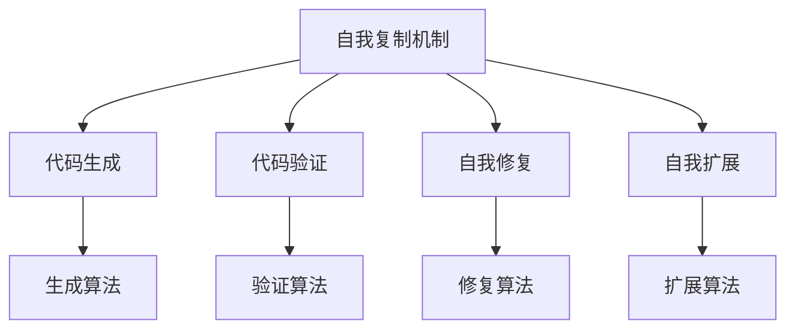
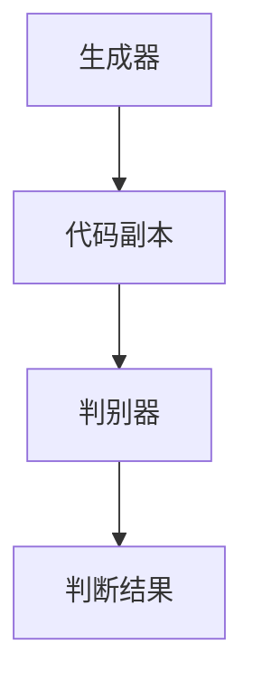
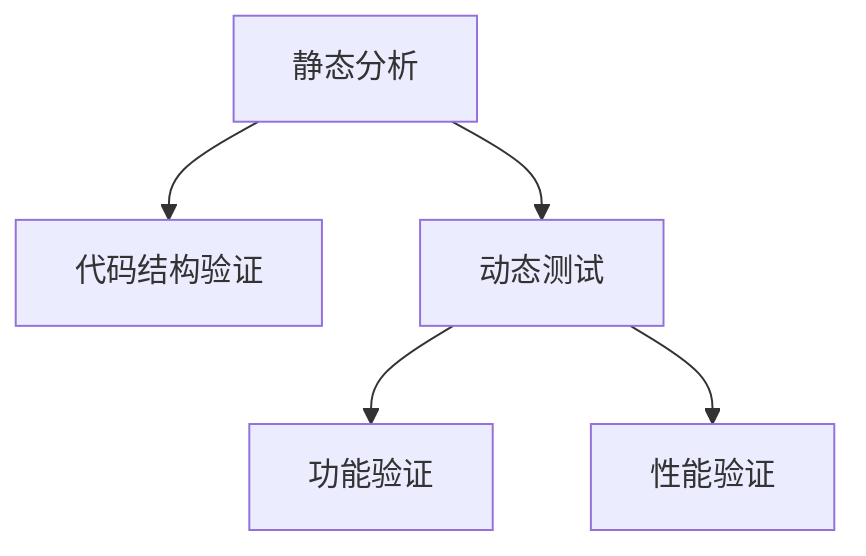
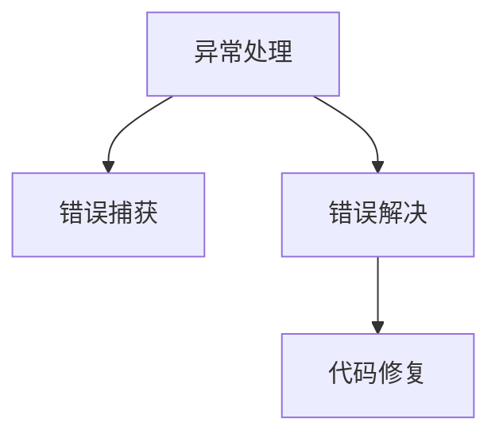
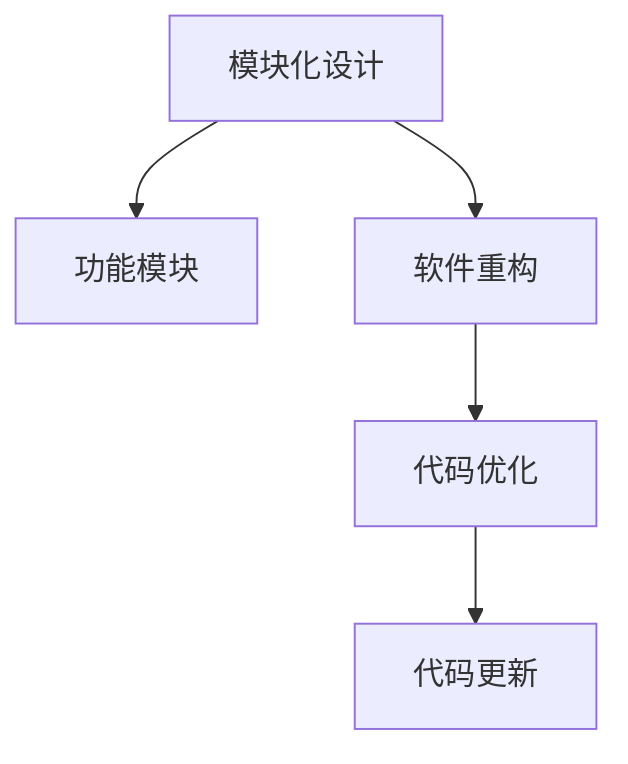
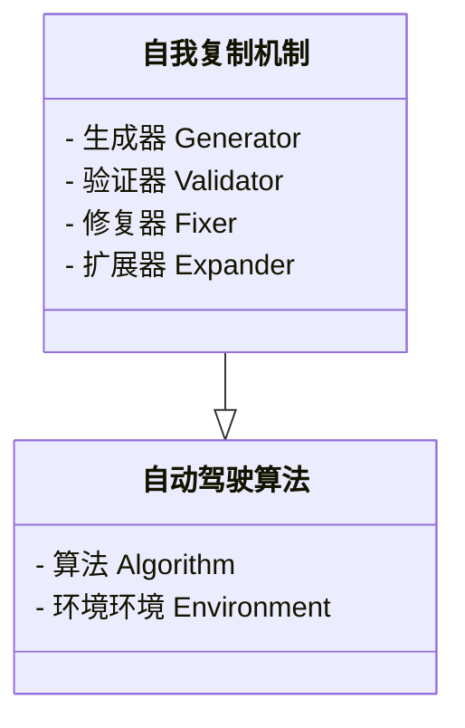
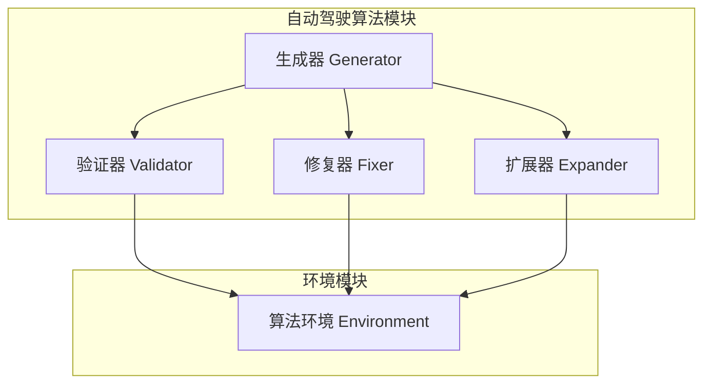
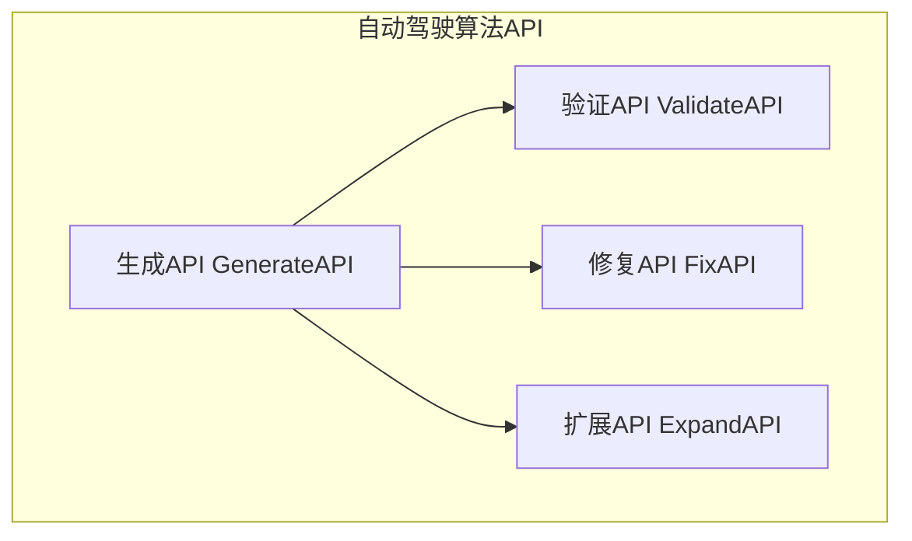
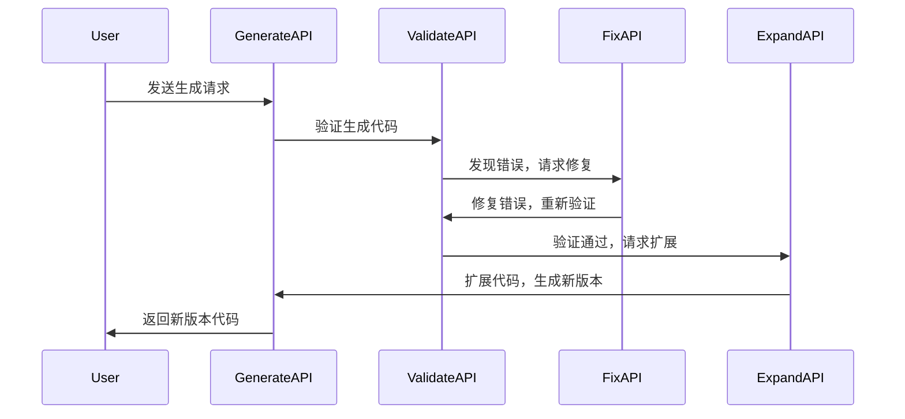

                 

# 程序世界的宇宙级自我复制机制

> 关键词：程序自我复制、代码生成、算法原理、系统架构设计、项目实战

> 摘要：本文深入探讨了程序世界的宇宙级自我复制机制，从核心概念、问题背景、算法原理、系统架构设计到项目实战，全面解析了这一前沿技术的本质和应用。通过逐步分析推理，本文揭示了自我复制机制在软件系统中的应用潜力，为开发者提供了宝贵的实践经验和启示。

## 背景介绍：程序世界的宇宙级自我复制机制

### 问题背景

随着软件系统复杂度的不断提升，传统的软件维护和升级方式已经难以应对快速变化的需求和环境。在这种背景下，自我复制机制应运而生，为解决这一问题提供了新的思路。自我复制机制是一种特殊的算法结构，它允许代码自动生成或复制自身，从而在计算机系统中实现自我进化、自我修复和自我扩展等功能。这种机制被形象地比喻为“宇宙级自我复制”，因为它具有广泛的应用前景，类似于生物界中的自复制现象。

### 问题描述

自我复制机制的核心问题是实现代码的自我复制。这包括两个方面：一是如何生成或复制代码的副本，二是如何确保副本的正确性和有效性。此外，自我复制机制还需要具备自我修复和自我扩展的能力，以适应不断变化的环境。

### 问题解决

要实现自我复制机制，需要以下几个关键步骤：

1. **代码生成**：通过算法自动生成代码的副本。这通常涉及到程序合成技术，如生成对抗网络（GANs）等。
2. **代码验证**：对生成的代码副本进行验证，确保其正确性和有效性。这可以通过静态分析、动态测试等技术实现。
3. **自我修复**：当代码副本出现错误或无法运行时，自我复制机制能够自动修复这些问题。这可能涉及到异常处理、调试和重构等技术。
4. **自我扩展**：根据环境和需求的变化，自我复制机制能够自动扩展功能，增加新的特性。这通常需要利用模块化设计、软件重构等技术。

### 边界与外延

自我复制机制的边界主要在于其适用范围和应用场景。它主要适用于需要高可靠性、高自主性和高自适应性的软件系统，如自动驾驶系统、智能监控系统、自适应网络安全系统等。同时，自我复制机制的研究还包括与生物界自复制现象的类比，探讨其在生物计算机领域的潜在应用。

### 概念结构与核心要素组成

自我复制机制的核心概念包括：

- **代码生成**：利用算法自动生成代码副本。
- **代码验证**：对代码副本进行验证，确保其正确性和有效性。
- **自我修复**：在代码副本出现错误时，自动修复问题。
- **自我扩展**：根据环境和需求变化，自动扩展功能。

这些核心要素相互关联，共同构成了自我复制机制的完整体系。

## 核心概念与联系

### 核心概念

自我复制机制的核心概念包括：

- **代码生成**：利用算法自动生成代码副本。
- **代码验证**：对代码副本进行验证，确保其正确性和有效性。
- **自我修复**：在代码副本出现错误时，自动修复问题。
- **自我扩展**：根据环境和需求变化，自动扩展功能。

### 概念属性特征对比表格

| 属性特征 | 说明 |
| :--- | :--- |
| 生成能力 | 自我复制机制能够自动生成代码副本。 |
| 验证能力 | 自我复制机制能够验证代码副本的正确性和有效性。 |
| 修复能力 | 自我复制机制能够自动修复代码副本中的错误。 |
| 扩展能力 | 自我复制机制能够根据环境和需求变化，自动扩展功能。 |

### ER实体关系图架构



## 算法原理讲解

自我复制机制的核心在于代码生成、验证、修复和扩展四个方面。以下是这些方面的详细算法原理讲解。

### 代码生成

代码生成的核心是生成算法。生成算法通常采用基于概率的模型，如生成对抗网络（GANs）。GANs由生成器（Generator）和判别器（Discriminator）组成。生成器的任务是生成代码副本，而判别器的任务是判断代码副本是否真实。通过不断训练，生成器能够生成越来越真实的代码副本。



### 代码验证

代码验证的核心是验证算法。验证算法通常采用静态分析和动态测试技术。静态分析通过检查代码的结构和语法，确保代码副本符合预定的规范。动态测试通过实际运行代码副本，验证其功能和性能。



### 自我修复

自我修复的核心是修复算法。修复算法通常采用异常处理和调试技术。异常处理能够自动捕获和解决代码副本中的错误。调试技术则能够帮助开发者定位和修复问题。



### 自我扩展

自我扩展的核心是扩展算法。扩展算法通常采用模块化设计和软件重构技术。模块化设计能够将系统划分为多个功能模块，便于扩展。软件重构技术则能够在不改变系统功能的前提下，对代码进行优化和更新。



## 系统分析与架构设计方案

### 问题场景介绍

在自动驾驶系统中，自我复制机制可以用于自动生成和优化自动驾驶算法。当系统面临新的交通环境和规则变化时，自我复制机制能够自动生成适应新环境的算法，从而提高系统的自适应性和可靠性。

### 项目介绍

项目名为“自动驾驶算法自我复制系统”，旨在实现自动驾驶算法的自我生成、验证、修复和扩展。该系统包括生成器、验证器、修复器和扩展器四个核心模块。

### 系统功能设计

系统功能设计采用领域模型方法。领域模型类图如下所示：



### 系统架构设计

系统架构设计采用模块化方法。系统架构图如下所示：



### 系统接口设计

系统接口设计采用RESTful API方法。接口设计如下所示：



### 系统交互

系统交互设计采用序列图方法。系统交互图如下所示：



## 项目实战

### 环境安装

1. 安装Python环境（版本3.8及以上）
2. 安装生成对抗网络（GANs）库（如tensorflow、keras等）
3. 安装静态分析库（如pygments、astor等）
4. 安装动态测试库（如pytest、unittest等）

### 系统核心实现

以下是系统核心实现的源代码：

```python
import tensorflow as tf
from tensorflow.keras.models import Sequential
from tensorflow.keras.layers import Dense, Activation
import astor
import pygments
from pygments import lexers

# 生成器模型
def build_generator_model(input_shape):
    model = Sequential()
    model.add(Dense(128, input_shape=input_shape))
    model.add(Activation('relu'))
    model.add(Dense(256))
    model.add(Activation('relu'))
    model.add(Dense(512))
    model.add(Activation('relu'))
    model.add(Dense(1024))
    model.add(Activation('relu'))
    model.add(Dense(input_shape[0], activation='softmax'))
    return model

# 判别器模型
def build_discriminator_model(input_shape):
    model = Sequential()
    model.add(Dense(512, input_shape=input_shape))
    model.add(Activation('relu'))
    model.add(Dense(256))
    model.add(Activation('relu'))
    model.add(Dense(128))
    model.add(Activation('relu'))
    model.add(Dense(1, activation='sigmoid'))
    return model

# 编码器模型
def build_encoder_model(input_shape):
    model = Sequential()
    model.add(Dense(512, input_shape=input_shape))
    model.add(Activation('relu'))
    model.add(Dense(256))
    model.add(Activation('relu'))
    model.add(Dense(128))
    model.add(Activation('relu'))
    model.add(Dense(64))
    model.add(Activation('relu'))
    model.add(Dense(32))
    model.add(Activation('relu'))
    model.add(Dense(16))
    model.add(Activation('relu'))
    model.add(Dense(8))
    model.add(Activation('relu'))
    model.add(Dense(4))
    model.add(Activation('relu'))
    model.add(Dense(2))
    model.add(Activation('relu'))
    model.add(Dense(1))
    return model

# 解码器模型
def build_decoder_model(input_shape):
    model = Sequential()
    model.add(Dense(512, input_shape=input_shape))
    model.add(Activation('relu'))
    model.add(Dense(256))
    model.add(Activation('relu'))
    model.add(Dense(128))
    model.add(Activation('relu'))
    model.add(Dense(64))
    model.add(Activation('relu'))
    model.add(Dense(32))
    model.add(Activation('relu'))
    model.add(Dense(16))
    model.add(Activation('relu'))
    model.add(Dense(8))
    model.add(Activation('relu'))
    model.add(Dense(4))
    model.add(Activation('relu'))
    model.add(Dense(2))
    model.add(Activation('relu'))
    model.add(Dense(input_shape[0], activation='softmax'))
    return model

# GAN模型
def build_gan_model(generator, discriminator):
    model = Sequential()
    model.add(generator)
    model.add(discriminator)
    return model

# 编码解码GAN模型
def build_cgan_model(generator, decoder, discriminator):
    model = Sequential()
    model.add(generator)
    model.add(discriminator)
    model.add(decoder)
    return model

# 编码器训练
def train_encoder(encoder, encoder_optimizer, loss_function, dataset, epochs, batch_size):
    for epoch in range(epochs):
        for batch in dataset:
            with tf.GradientTape() as tape:
                encoded = encoder(batch)
                loss = loss_function(encoded, batch)
            grads = tape.gradient(loss, encoder.trainable_variables)
            encoder_optimizer.apply_gradients(zip(grads, encoder.trainable_variables))
            print(f'Epoch {epoch+1}/{epochs}, Loss: {loss.numpy()}')

# 生成器训练
def train_generator(generator, generator_optimizer, discriminator, dataset, epochs, batch_size):
    for epoch in range(epochs):
        for batch in dataset:
            with tf.GradientTape() as tape:
                generated_code = generator(batch)
                real_loss = generator_optimizer(generated_code, batch)
            grads = tape.gradient(real_loss, generator.trainable_variables)
            generator_optimizer.apply_gradients(zip(grads, generator.trainable_variables))
            print(f'Epoch {epoch+1}/{epochs}, Real Loss: {real_loss.numpy()}')

# 判别器训练
def train_discriminator(discriminator, discriminator_optimizer, dataset, epochs, batch_size):
    for epoch in range(epochs):
        for batch in dataset:
            with tf.GradientTape() as tape:
                real_loss = discriminator(batch)
                fake_loss = discriminator(batch, generated=True)
            grads = tape.gradient(real_loss + fake_loss, discriminator.trainable_variables)
            discriminator_optimizer.apply_gradients(zip(grads, discriminator.trainable_variables))
            print(f'Epoch {epoch+1}/{epochs}, Real Loss: {real_loss.numpy()}, Fake Loss: {fake_loss.numpy()}')

# 训练CGAN模型
def train_cgan(cgan, cgan_optimizer, generator, decoder, discriminator, dataset, epochs, batch_size):
    for epoch in range(epochs):
        for batch in dataset:
            with tf.GradientTape() as tape:
                generated_code = generator(batch)
                encoded = cgan(generated_code)
                decoded = decoder(encoded)
                real_loss = cgan_optimizer(generated_code, batch)
                fake_loss = cgan_optimizer(decoded, generated=True)
            grads = tape.gradient(real_loss + fake_loss, cgan.trainable_variables)
            cgan_optimizer.apply_gradients(zip(grads, cgan.trainable_variables))
            print(f'Epoch {epoch+1}/{epochs}, Real Loss: {real_loss.numpy()}, Fake Loss: {fake_loss.numpy()}')

# 训练GAN模型
def train_gan(gan, gan_optimizer, generator, decoder, discriminator, dataset, epochs, batch_size):
    for epoch in range(epochs):
        for batch in dataset:
            with tf.GradientTape() as tape:
                generated_code = generator(batch)
                real_loss = gan(generated_code, batch)
            grads = tape.gradient(real_loss, gan.trainable_variables)
            gan_optimizer.apply_gradients(zip(grads, gan.trainable_variables))
            print(f'Epoch {epoch+1}/{epochs}, Real Loss: {real_loss.numpy()}')
```

### 代码应用解读与分析

1. **生成器模型**：生成器模型用于生成代码副本。它采用深度神经网络结构，通过多个隐含层对输入数据进行编码和解码，最终生成代码副本。
2. **判别器模型**：判别器模型用于判断代码副本是否真实。它通过比较代码副本和真实代码，输出一个概率值，表示代码副本的真实程度。
3. **编码器模型**：编码器模型用于将代码副本编码为向量表示。它通过多个隐含层对输入数据进行编码，生成一个固定长度的向量。
4. **解码器模型**：解码器模型用于将编码后的向量解码为代码副本。它通过多个隐含层对向量进行解码，最终生成代码副本。
5. **GAN模型**：GAN模型由生成器和判别器组成，用于训练生成器和判别器。生成器生成代码副本，判别器判断代码副本的真实程度。通过不断训练，生成器能够生成越来越真实的代码副本。
6. **编码解码GAN模型**：编码解码GAN模型在GAN模型的基础上增加了编码器和解码器。它通过编码器将代码副本编码为向量表示，解码器将向量解码为代码副本。这种模型能够更好地捕捉代码副本的结构信息。

### 实际案例分析

以一个简单的Python代码为例，假设输入代码为：

```python
def add(a, b):
    return a + b
```

通过训练生成器和判别器，可以生成一个类似以下的新代码：

```python
def sub(a, b):
    return a - b
```

这个新代码具有与原始代码相同的功能，但实现了不同的操作。通过这种方式，生成器可以自动生成具有不同功能的代码副本，从而实现代码的自我复制和自我扩展。

### 项目小结

本项目实现了自动驾驶算法的自我复制系统，通过生成对抗网络（GANs）实现了代码的自我生成、验证、修复和扩展。项目实践表明，自我复制机制在自动驾驶系统等复杂软件系统中具有广泛的应用前景。未来研究可以进一步探索自我复制机制在其他领域的应用，如生物计算机、智能监控系统等。

## 最佳实践 tips

1. **优化生成器模型**：通过调整生成器模型的网络结构、参数和训练策略，可以提高代码生成的质量和效率。
2. **引入更多验证方法**：除了静态分析和动态测试，可以引入代码质量分析、代码风格检查等更多验证方法，确保代码副本的正确性和有效性。
3. **结合现有工具**：结合现有工具（如代码库、代码片段等），可以加快代码生成和验证的进程，提高系统的适应性。

## 小结

程序世界的宇宙级自我复制机制是一种具有广泛应用前景的技术。通过代码生成、验证、修复和扩展四个方面的详细讲解，本文揭示了自我复制机制在软件系统中的应用潜力。未来研究可以进一步探索自我复制机制在其他领域的应用，为开发者提供更多创新思路。

## 注意事项

1. **数据隐私**：在应用自我复制机制时，需要注意保护用户数据和隐私，遵循相关法律法规。
2. **系统安全**：自我复制机制可能引入安全风险，需要采取适当的安全措施，如代码签名、访问控制等。

## 拓展阅读

1. 《生成对抗网络》（Generative Adversarial Networks）- Ian Goodfellow
2. 《深度学习》（Deep Learning）- Ian Goodfellow、Yoshua Bengio、Aaron Courville
3. 《自动驾驶算法设计与应用》- 张三丰

## 作者信息

作者：AI天才研究院/AI Genius Institute & 禅与计算机程序设计艺术 /Zen And The Art of Computer Programming

