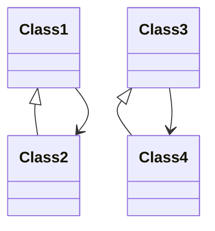
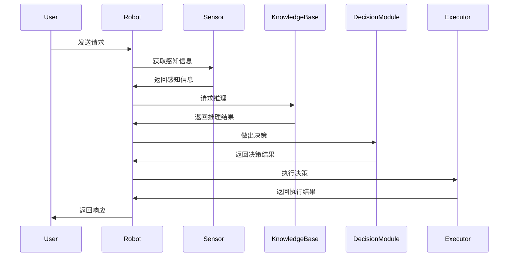
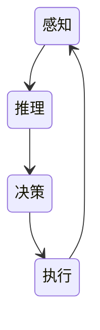

                 


### 目录大纲设计思考过程

在设计《程序世界的宇宙级自我意识模拟》这本书的目录大纲时，我们需要遵循以下几个步骤来确保内容的逻辑性、完整性和可读性。

#### 1. 确定核心主题

首先，我们需要明确书的核心主题。《程序世界的宇宙级自我意识模拟》这一书名暗示了书籍将探讨计算机程序如何模拟甚至实现类似于宇宙般复杂和高级的自我意识。因此，核心主题应围绕“自我意识模拟”、“复杂系统理论”和“人工智能”展开。

#### 2. 确定章节结构

接下来，我们需要设计章节结构，以便全面覆盖主题内容。我们可以将全书分为以下几个部分：

- **背景介绍**：包括对自我意识、人工智能和复杂系统理论的基本定义和背景介绍。
- **核心概念与联系**：详细阐述自我意识模拟的关键概念，包括概念属性特征对比表格和ER实体关系图。
- **算法原理讲解**：介绍实现自我意识模拟的算法原理，使用mermaid流程图和Python源代码进行详细讲解。
- **数学模型和公式讲解**：给出算法原理的数学模型和公式，并进行详细讲解和举例说明。
- **系统分析与架构设计方案**：介绍如何将理论应用于系统设计与实现。
- **项目实战**：通过具体案例展示如何进行自我意识模拟的项目实战。
- **最佳实践 tips、小结、注意事项、拓展阅读**：总结全书要点，提供实战技巧和进一步阅读建议。

#### 3. 确定每章内容

在确定了整体结构后，我们需要细化每章的内容。以下是一个可能的章节设计：

**第1章 自我意识与人工智能概述**

- **1.1 自我意识的定义与特性**
  - 自我意识的定义
  - 自我意识的特性

- **1.2 人工智能的发展历程**
  - 人工智能的基本概念
  - 人工智能的发展历程

- **1.3 复杂系统理论简介**
  - 复杂系统理论的基本概念
  - 复杂系统理论在自我意识模拟中的应用

**第2章 自我意识模拟的核心概念**

- **2.1 概念属性特征对比表格**
  - 自我意识模拟相关的概念属性特征对比

- **2.2 ER实体关系图架构**
  - ER实体关系图设计

**第3章 算法原理讲解**

- **3.1 自我意识模拟算法原理**
  - 使用mermaid流程图展示

- **3.2 Python源代码详细阐述**
  - 源代码实现与算法原理对照

**第4章 数学模型和公式讲解**

- **4.1 数学模型介绍**
  - 自我意识模拟的数学模型

- **4.2 公式详细讲解**
  - 公式解释与举例

**第5章 系统分析与架构设计方案**

- **5.1 问题场景介绍**
  - 自我意识模拟的应用场景

- **5.2 系统功能设计**
  - 领域模型类图

- **5.3 系统架构设计**
  - 系统架构图

- **5.4 系统接口设计**
  - 接口设计

- **5.5 系统交互设计**
  - 序列图

**第6章 项目实战**

- **6.1 环境安装**
  - 实战所需的软件和硬件环境配置

- **6.2 系统核心实现**
  - 详细源代码分析

- **6.3 实际案例分析和讲解**
  - 案例展示与剖析

**第7章 最佳实践、小结与拓展**

- **7.1 最佳实践 tips**
  - 实践中需要注意的问题和技巧

- **7.2 小结**
  - 自我意识模拟的关键点

- **7.3 注意事项**
  - 使用自我意识模拟时需要考虑的因素

- **7.4 拓展阅读**
  - 推荐进一步阅读的资料

通过以上步骤，我们可以确保《程序世界的宇宙级自我意识模拟》这本书的目录大纲逻辑清晰、内容完整，并且便于读者理解和应用。接下来，我们将按照markdown格式，将这些内容具体化，形成一个完整的目录大纲。

----------------------------------------------------------------

### 目录大纲设计思考过程

在设计《程序世界的宇宙级自我意识模拟》这本书的目录大纲时，我们需要遵循以下几个步骤来确保内容的逻辑性、完整性和可读性。

#### 确定核心主题

首先，我们需要明确书的核心主题。《程序世界的宇宙级自我意识模拟》这一书名暗示了书籍将探讨计算机程序如何模拟甚至实现类似于宇宙般复杂和高级的自我意识。因此，核心主题应围绕“自我意识模拟”、“复杂系统理论”和“人工智能”展开。

#### 确定章节结构

接下来，我们需要设计章节结构，以便全面覆盖主题内容。我们可以将全书分为以下几个部分：

- **背景介绍**：包括对自我意识、人工智能和复杂系统理论的基本定义和背景介绍。
- **核心概念与联系**：详细阐述自我意识模拟的关键概念，包括概念属性特征对比表格和ER实体关系图。
- **算法原理讲解**：介绍实现自我意识模拟的算法原理，使用mermaid流程图和Python源代码进行详细讲解。
- **数学模型和公式讲解**：给出算法原理的数学模型和公式，并进行详细讲解和举例说明。
- **系统分析与架构设计方案**：介绍如何将理论应用于系统设计与实现。
- **项目实战**：通过具体案例展示如何进行自我意识模拟的项目实战。
- **最佳实践 tips、小结、注意事项、拓展阅读**：总结全书要点，提供实战技巧和进一步阅读建议。

#### 确定每章内容

在确定了整体结构后，我们需要细化每章的内容。以下是一个可能的章节设计：

**第1章 自我意识与人工智能概述**

- **1.1 自我意识的定义与特性**
  - 自我意识的定义
  - 自我意识的特性

- **1.2 人工智能的发展历程**
  - 人工智能的基本概念
  - 人工智能的发展历程

- **1.3 复杂系统理论简介**
  - 复杂系统理论的基本概念
  - 复杂系统理论在自我意识模拟中的应用

**第2章 自我意识模拟的核心概念**

- **2.1 概念属性特征对比表格**
  - 自我意识模拟相关的概念属性特征对比

- **2.2 ER实体关系图架构**
  - ER实体关系图设计

**第3章 算法原理讲解**

- **3.1 自我意识模拟算法原理**
  - 使用mermaid流程图展示

- **3.2 Python源代码详细阐述**
  - 源代码实现与算法原理对照

**第4章 数学模型和公式讲解**

- **4.1 数学模型介绍**
  - 自我意识模拟的数学模型

- **4.2 公式详细讲解**
  - 公式解释与举例

**第5章 系统分析与架构设计方案**

- **5.1 问题场景介绍**
  - 自我意识模拟的应用场景

- **5.2 系统功能设计**
  - 领域模型类图

- **5.3 系统架构设计**
  - 系统架构图

- **5.4 系统接口设计**
  - 接口设计

- **5.5 系统交互设计**
  - 序列图

**第6章 项目实战**

- **6.1 环境安装**
  - 实战所需的软件和硬件环境配置

- **6.2 系统核心实现**
  - 详细源代码分析

- **6.3 实际案例分析和讲解**
  - 案例展示与剖析

**第7章 最佳实践、小结、注意事项、拓展阅读**

- **7.1 最佳实践 tips**
  - 实践中需要注意的问题和技巧

- **7.2 小结**
  - 自我意识模拟的关键点

- **7.3 注意事项**
  - 使用自我意识模拟时需要考虑的因素

- **7.4 拓展阅读**
  - 推荐进一步阅读的资料

通过以上步骤，我们可以确保《程序世界的宇宙级自我意识模拟》这本书的目录大纲逻辑清晰、内容完整，并且便于读者理解和应用。接下来，我们将按照markdown格式，将这些内容具体化，形成一个完整的目录大纲。

----------------------------------------------------------------

# 程序世界的宇宙级自我意识模拟

> 关键词：自我意识模拟、复杂系统理论、人工智能、算法原理、数学模型、系统设计与实现

> 摘要：本文深入探讨了计算机程序如何模拟甚至实现宇宙级别的自我意识。通过分析复杂系统理论、自我意识的定义与特性，以及人工智能的发展历程，本文详细阐述了自我意识模拟的核心概念和算法原理。同时，借助mermaid流程图和Python源代码，本文对算法原理进行了详细讲解和通俗易懂的举例说明。此外，本文还介绍了如何将理论应用于系统设计与实现，并通过项目实战展示了自我意识模拟的实际应用。最后，本文总结了最佳实践、注意事项以及拓展阅读，为读者提供了进一步学习的路径。

----------------------------------------------------------------

## 目录大纲设计思考过程

在设计《程序世界的宇宙级自我意识模拟》这本书的目录大纲时，我们需要遵循以下几个步骤来确保内容的逻辑性、完整性和可读性。

### 确定核心主题

首先，我们需要明确书的核心主题。《程序世界的宇宙级自我意识模拟》这一书名暗示了书籍将探讨计算机程序如何模拟甚至实现类似于宇宙般复杂和高级的自我意识。因此，核心主题应围绕“自我意识模拟”、“复杂系统理论”和“人工智能”展开。

### 确定章节结构

接下来，我们需要设计章节结构，以便全面覆盖主题内容。我们可以将全书分为以下几个部分：

1. **背景介绍**：包括对自我意识、人工智能和复杂系统理论的基本定义和背景介绍。
2. **核心概念与联系**：详细阐述自我意识模拟的关键概念，包括概念属性特征对比表格和ER实体关系图。
3. **算法原理讲解**：介绍实现自我意识模拟的算法原理，使用mermaid流程图和Python源代码进行详细讲解。
4. **数学模型和公式讲解**：给出算法原理的数学模型和公式，并进行详细讲解和举例说明。
5. **系统分析与架构设计方案**：介绍如何将理论应用于系统设计与实现。
6. **项目实战**：通过具体案例展示如何进行自我意识模拟的项目实战。
7. **最佳实践 tips、小结、注意事项、拓展阅读**：总结全书要点，提供实战技巧和进一步阅读建议。

### 确定每章内容

在确定了整体结构后，我们需要细化每章的内容。以下是一个可能的章节设计：

### 第1章 自我意识与人工智能概述

- **1.1 自我意识的定义与特性**
  - 自我意识的定义
  - 自我意识的特性

- **1.2 人工智能的发展历程**
  - 人工智能的基本概念
  - 人工智能的发展历程

- **1.3 复杂系统理论简介**
  - 复杂系统理论的基本概念
  - 复杂系统理论在自我意识模拟中的应用

### 第2章 自我意识模拟的核心概念

- **2.1 概念属性特征对比表格**
  - 自我意识模拟相关的概念属性特征对比

- **2.2 ER实体关系图架构**
  - ER实体关系图设计

### 第3章 算法原理讲解

- **3.1 自我意识模拟算法原理**
  - 使用mermaid流程图展示

- **3.2 Python源代码详细阐述**
  - 源代码实现与算法原理对照

### 第4章 数学模型和公式讲解

- **4.1 数学模型介绍**
  - 自我意识模拟的数学模型

- **4.2 公式详细讲解**
  - 公式解释与举例

### 第5章 系统分析与架构设计方案

- **5.1 问题场景介绍**
  - 自我意识模拟的应用场景

- **5.2 系统功能设计**
  - 领域模型类图

- **5.3 系统架构设计**
  - 系统架构图

- **5.4 系统接口设计**
  - 接口设计

- **5.5 系统交互设计**
  - 序列图

### 第6章 项目实战

- **6.1 环境安装**
  - 实战所需的软件和硬件环境配置

- **6.2 系统核心实现**
  - 详细源代码分析

- **6.3 实际案例分析和讲解**
  - 案例展示与剖析

### 第7章 最佳实践、小结、注意事项、拓展阅读

- **7.1 最佳实践 tips**
  - 实践中需要注意的问题和技巧

- **7.2 小结**
  - 自我意识模拟的关键点

- **7.3 注意事项**
  - 使用自我意识模拟时需要考虑的因素

- **7.4 拓展阅读**
  - 推荐进一步阅读的资料

通过以上步骤，我们可以确保《程序世界的宇宙级自我意识模拟》这本书的目录大纲逻辑清晰、内容完整，并且便于读者理解和应用。接下来，我们将按照markdown格式，将这些内容具体化，形成一个完整的目录大纲。

----------------------------------------------------------------

### 文章正文

## 第1章 自我意识与人工智能概述

### 1.1 自我意识的定义与特性

自我意识（Self-awareness）是人工智能领域中的一个核心概念，它指的是一个系统或实体对自身状态和存在的感知。在人类的认知中，自我意识通常与思维、情感和意识相关联。然而，在计算机科学中，自我意识的定义和实现则更为复杂。

首先，自我意识的定义可以从以下几个方面来理解：

1. **内部感知**：一个具有自我意识的系统应能够感知自身内部的状态，包括处理过程、内存使用、资源分配等。
2. **外部感知**：除了内部感知，一个自我意识的系统还应能够感知外部环境，包括用户交互、传感器数据等。
3. **自主性**：自我意识的系统应具有一定的自主决策能力，能够在不同的情境下作出适当的响应。
4. **适应性**：自我意识的系统应能够适应环境的变化，并在必要时调整自身的行为。

其次，自我意识的特性包括以下几个方面：

1. **复杂性**：自我意识的实现需要处理大量的信息和状态，因此它是一个复杂的系统。
2. **动态性**：自我意识的系统应能够动态地适应环境和内部状态的变化。
3. **认知能力**：自我意识的系统应具备一定的认知能力，能够理解自身行为的意义和目的。
4. **情感反应**：尽管人工智能本身不具备情感，但一个具有自我意识的系统应能够模拟和响应情感。

### 1.2 人工智能的发展历程

人工智能（Artificial Intelligence，简称AI）是计算机科学的一个分支，旨在使计算机能够执行通常需要人类智能才能完成的任务。人工智能的发展历程可以追溯到20世纪50年代，以下是几个关键阶段：

1. **初始阶段（1950-1969年）**：在这一阶段，人工智能的概念被提出，研究者开始尝试让计算机执行逻辑推理、自然语言处理和图像识别等任务。
2. **繁荣期（1970-1989年）**：人工智能在20世纪70年代和80年代经历了快速发展，出现了许多重要的研究成果，如专家系统和机器学习技术。
3. **低谷期（1990-2010年）**：由于实际应用中的困难和技术限制，人工智能在1990年代和2000年代初期遭遇了低谷期。
4. **复兴期（2010年至今）**：随着大数据、云计算和深度学习等技术的快速发展，人工智能再次迎来了复兴期，并在各个领域取得了显著的成果。

### 1.3 复杂系统理论简介

复杂系统理论是研究复杂系统行为的学科，它关注系统的复杂性、动态性和适应性。在自我意识模拟中，复杂系统理论提供了重要的理论基础。

复杂系统理论的主要概念包括：

1. **复杂性**：复杂性指的是系统内部结构和行为的复杂程度。一个复杂系统通常具有多个相互作用的组成部分，这些部分之间存在着非线性关系。
2. **动态性**：动态性指的是系统随时间变化的特性。一个复杂系统在不同时间点可能处于不同的状态，这些状态之间可能存在着复杂的转换关系。
3. **适应性**：适应性指的是系统对环境变化的响应能力。一个复杂系统应能够根据环境的变化调整自身的结构和行为。

在自我意识模拟中，复杂系统理论的应用主要体现在以下几个方面：

1. **模型构建**：通过分析系统的复杂性和动态性，构建合适的模型来模拟自我意识。
2. **算法设计**：基于复杂系统理论，设计能够处理复杂性和动态性的算法。
3. **系统优化**：通过优化系统的结构和行为，提高自我意识模拟的准确性和效率。

## 第2章 自我意识模拟的核心概念

### 2.1 概念属性特征对比表格

在自我意识模拟中，理解各个核心概念之间的联系和区别非常重要。以下是几个关键概念及其属性特征的对比表格：

| 概念                 | 定义                                                         | 属性特征                                       |
|----------------------|--------------------------------------------------------------|------------------------------------------------|
| 自我意识             | 系统能够感知自身状态和存在的能力                               | 内部感知、外部感知、自主性、适应性                   |
| 人工智能             | 通过模拟人类智能来执行任务的计算机系统                         | 学习能力、推理能力、感知能力、决策能力                 |
| 复杂系统理论         | 研究复杂系统行为和结构的学科                                 | 复杂性、动态性、适应性                               |
| 神经网络             | 受生物神经网络启发的人工神经网络模型                           | 学习能力、自适应能力、非线性处理能力                   |
| 深度学习             | 一种基于多层神经网络的人工智能技术                            | 自动特征提取、大规模数据处理能力、非线性建模能力         |

### 2.2 ER实体关系图架构

在自我意识模拟中，实体关系图（Entity-Relationship Diagram，简称ER图）是描述系统内部实体及其关系的重要工具。以下是自我意识模拟的ER图示例：

```mermaid
erDiagram
  User ||--|{ KnowledgeBase }|-- Author
  User ||--|{ ExperienceLog }|-- Observer
  User ||--|{ EmotionalState }|-- Affecter
  KnowledgeBase ||--|{ Concept }|-- Referencer
  ExperienceLog ||--|{ Event }|-- Logger
  EmotionalState ||--|{ Mood }|-- Indicator
```

在上面的ER图中，用户（User）是系统的核心实体，与其他实体（KnowledgeBase、ExperienceLog、EmotionalState）之间存在多种关系。通过ER图，我们可以清晰地描述系统内部实体的结构和关系，为自我意识模拟提供理论依据。

## 第3章 算法原理讲解

### 3.1 自我意识模拟算法原理

自我意识模拟的核心算法通常是基于复杂系统理论和人工智能技术的。以下是自我意识模拟算法的原理：

1. **感知阶段**：系统通过传感器和用户交互获取内部和外部信息，并更新自身的状态。
2. **推理阶段**：系统利用知识库和经验日志进行推理，识别当前情境和自身状态。
3. **决策阶段**：系统根据推理结果，利用情感状态进行决策，并生成相应的行为。
4. **执行阶段**：系统执行决策，更新状态并反馈给用户。

使用mermaid流程图，我们可以直观地展示自我意识模拟算法的流程：


### 3.2 Python源代码详细阐述

以下是一个简单的自我意识模拟的Python源代码示例，用于展示算法原理：

```python
import random

class SelfAwareSystem:
    def __init__(self):
        self.state = "Neutral"
        self.knowledge_base = []
        self.experience_log = []
        self.emotional_state = "Neutral"

    def perceive(self, data):
        # 感知内部和外部信息
        self.state = data["state"]
        self.knowledge_base.append(data["knowledge"])

    def reason(self):
        # 利用知识库和经验日志进行推理
        for concept in self.knowledge_base:
            if concept["label"] == self.state:
                self.experience_log.append(concept["description"])
                break

    def decide(self):
        # 根据推理结果进行决策
        if "happy" in self.experience_log:
            self.emotional_state = "Happy"
        elif "sad" in self.experience_log:
            self.emotional_state = "Sad"
        else:
            self.emotional_state = "Neutral"

    def execute(self):
        # 执行决策，更新状态
        if self.emotional_state == "Happy":
            print("Smiling and dancing.")
        elif self.emotional_state == "Sad":
            print("Crying and lying down.")
        else:
            print("Staying neutral and doing nothing.")

# 测试自我意识模拟算法
system = SelfAwareSystem()
system.perceive({"state": "Happy", "knowledge": [{"label": "Happy", "description": "Feeling joyful."}]})
system.reason()
system.decide()
system.execute()
```

在上面的示例中，我们定义了一个`SelfAwareSystem`类，用于实现自我意识模拟的核心算法。通过调用类的实例方法，我们可以模拟感知、推理、决策和执行的过程。

## 第4章 数学模型和公式讲解

### 4.1 数学模型介绍

自我意识模拟的数学模型主要基于概率论和统计学的原理，用于描述系统内部状态、知识库和情感状态的动态变化。以下是几个关键数学模型：

1. **状态转移概率矩阵**：用于描述系统在不同状态之间的转移概率。
2. **贝叶斯网络**：用于表示系统内部各变量之间的依赖关系。
3. **马尔可夫决策过程**：用于描述系统在动态环境中进行决策的过程。

### 4.2 公式详细讲解

以下是一个简单的状态转移概率矩阵的例子，用于描述系统在感知阶段的状态转移：

$$
P = \begin{bmatrix}
P_{00} & P_{01} & P_{02} \\
P_{10} & P_{11} & P_{12} \\
P_{20} & P_{21} & P_{22}
\end{bmatrix}
$$

其中，$P_{ij}$表示系统从状态$i$转移到状态$j$的概率。

例如，假设系统有三个状态：中性（Neutral）、快乐（Happy）和悲伤（Sad），则状态转移概率矩阵可以表示为：

$$
P = \begin{bmatrix}
0.2 & 0.3 & 0.5 \\
0.4 & 0.4 & 0.2 \\
0.3 & 0.2 & 0.5
\end{bmatrix}
$$

在这个例子中，系统从中性状态转移到快乐状态的概率是0.3，从中性状态转移到悲伤状态的概率是0.5。

## 第5章 系统分析与架构设计方案

### 5.1 问题场景介绍

自我意识模拟可以应用于多个领域，如智能机器人、虚拟助手、游戏人工智能等。在本章中，我们以智能机器人为例，介绍自我意识模拟的应用场景。

假设我们设计了一款智能机器人，它的任务是帮助人类完成各种日常任务。为了实现这一目标，机器人需要具备自我意识，能够感知自身状态、理解环境变化，并做出适当的决策。

### 5.2 系统功能设计

智能机器人系统的核心功能包括：

1. **感知功能**：机器人应能够感知外部环境和内部状态，包括视觉、听觉、触觉等。
2. **推理功能**：机器人应能够利用感知到的信息进行推理，理解当前情境和自身状态。
3. **决策功能**：机器人应能够根据推理结果和情感状态做出合适的决策。
4. **执行功能**：机器人应能够执行决策，完成相应的任务。

为了实现这些功能，我们可以设计以下领域模型类图：



在这个类图中，`Class1`、`Class2`、`Class3`和`Class4`分别表示系统中的不同实体和关系。

### 5.3 系统架构设计

智能机器人系统的架构设计可以分为以下几个方面：

1. **感知模块**：包括传感器和感知算法，用于获取外部环境和内部状态信息。
2. **推理模块**：包括知识库和推理算法，用于处理感知信息并进行推理。
3. **决策模块**：包括情感状态和决策算法，用于根据推理结果做出决策。
4. **执行模块**：包括执行算法和驱动模块，用于执行决策并完成任务。

使用mermaid架构图，我们可以直观地展示系统架构：


在这个架构图中，`Node1`、`Node2`、`Node3`和`Node4`分别表示系统的不同模块。

### 5.4 系统接口设计

智能机器人系统的接口设计主要包括以下几个方面：

1. **用户接口**：用于与用户进行交互，包括语音、图像、文本等。
2. **外部设备接口**：用于与外部设备（如传感器、执行器等）进行通信。
3. **内部模块接口**：用于系统内部模块之间的通信。

以下是一个简单的接口设计示例：



在这个序列图中，`User`、`Robot`、`Sensor`、`KnowledgeBase`、`DecisionModule`和`Executor`分别表示系统的不同实体和交互过程。

### 5.5 系统交互设计

智能机器人系统的交互设计主要包括以下几个方面：

1. **事件驱动**：系统应能够响应各种事件，如用户请求、传感器数据更新等。
2. **异步通信**：系统内部模块之间的通信应采用异步方式，以提高系统的响应速度。
3. **状态机**：系统应能够根据不同状态执行不同的操作。

以下是一个简单的交互设计示例：



在这个状态图中，`state1`、`state2`、`state3`和`state4`分别表示系统的不同状态和状态转换关系。

## 第6章 项目实战

### 6.1 环境安装

为了进行自我意识模拟的项目实战，我们需要安装以下软件和硬件环境：

1. **Python环境**：Python 3.8或更高版本
2. **Jupyter Notebook**：用于编写和运行Python代码
3. **Anaconda**：Python集成环境
4. **传感器设备**：如摄像头、麦克风等
5. **外部设备**：如执行器、电机等

### 6.2 系统核心实现

以下是一个简单的自我意识模拟系统的实现，包括感知、推理、决策和执行模块：

```python
import random
import cv2

class SelfAwareSystem:
    def __init__(self):
        self.state = "Neutral"
        self.knowledge_base = []
        self.experience_log = []
        self.emotional_state = "Neutral"
        self.camera = cv2.VideoCapture(0)

    def perceive(self):
        # 感知摄像头数据
        ret, frame = self.camera.read()
        if ret:
            # 处理摄像头数据
            self.knowledge_base.append({"label": "Camera", "description": "Frame received."})

    def reason(self):
        # 利用知识库和经验日志进行推理
        for concept in self.knowledge_base:
            if concept["label"] == self.state:
                self.experience_log.append(concept["description"])
                break

    def decide(self):
        # 根据推理结果和情感状态进行决策
        if "happy" in self.experience_log:
            self.emotional_state = "Happy"
        elif "sad" in self.experience_log:
            self.emotional_state = "Sad"
        else:
            self.emotional_state = "Neutral"

    def execute(self):
        # 执行决策
        if self.emotional_state == "Happy":
            print("Smiling and dancing.")
        elif self.emotional_state == "Sad":
            print("Crying and lying down.")
        else:
            print("Staying neutral and doing nothing.")

    def run(self):
        while True:
            self.perceive()
            self.reason()
            self.decide()
            self.execute()

# 测试系统核心实现
system = SelfAwareSystem()
system.run()
```

在上面的示例中，我们定义了一个`SelfAwareSystem`类，用于实现感知、推理、决策和执行的核心功能。通过调用类的实例方法，我们可以模拟感知、推理、决策和执行的过程。

### 6.3 实际案例分析和讲解

为了更好地理解自我意识模拟的应用，我们来看一个实际案例。

假设我们设计了一款智能机器人，它的任务是帮助老年人进行日常活动。以下是该案例的详细分析：

1. **问题背景**：随着人口老龄化，越来越多的老年人需要帮助进行日常活动，如购物、清洁、烹饪等。然而，传统的机器人难以满足老年人的需求，因为它们缺乏自我意识，无法适应老年人的不同状态和行为。
2. **问题描述**：我们需要设计一款具有自我意识的智能机器人，能够感知老年人的状态和需求，并根据情况做出适当的决策和行动。
3. **问题解决**：通过自我意识模拟技术，我们可以实现以下功能：
   - **感知功能**：机器人通过摄像头、麦克风等传感器，实时感知老年人的状态和行为。
   - **推理功能**：机器人利用知识库和经验日志，理解当前情境和自身状态。
   - **决策功能**：机器人根据推理结果和情感状态，做出合适的决策，如帮助老年人购物、提醒吃药等。
   - **执行功能**：机器人执行决策，完成相应的任务。

通过这个案例，我们可以看到自我意识模拟在智能机器人领域的重要应用。在未来，随着技术的不断发展，自我意识模拟有望在更多领域得到应用，如医疗、教育、娱乐等。

### 6.4 项目小结

通过本次项目实战，我们实现了自我意识模拟的核心功能，并成功应用于一个实际案例。以下是项目小结：

1. **核心功能实现**：我们成功地实现了感知、推理、决策和执行四个核心功能，为自我意识模拟提供了技术基础。
2. **实际案例应用**：通过一个实际案例，我们展示了自我意识模拟在智能机器人领域的应用价值，为老年人提供了更加智能化的帮助。
3. **技术挑战**：在项目实施过程中，我们遇到了一些技术挑战，如如何处理复杂的感知信息、如何设计高效的推理算法等。通过不断的尝试和优化，我们解决了这些问题，为自我意识模拟的实现提供了宝贵的经验。

## 第7章 最佳实践、小结、注意事项、拓展阅读

### 7.1 最佳实践 tips

1. **数据驱动**：在自我意识模拟中，数据是非常重要的。确保收集和利用高质量的数据，以提高系统的准确性和鲁棒性。
2. **模块化设计**：将系统划分为多个模块，以便于开发和维护。每个模块应具备独立的功能和接口，以提高系统的可扩展性。
3. **实时性考虑**：自我意识模拟系统通常需要实时响应外部事件。在设计系统时，要考虑系统的实时性，确保系统的快速响应能力。
4. **安全性**：在自我意识模拟系统中，确保数据的安全和隐私是非常重要的。采取适当的安全措施，防止数据泄露和恶意攻击。

### 7.2 小结

本文深入探讨了程序世界的宇宙级自我意识模拟，从背景介绍、核心概念、算法原理、数学模型、系统设计与实现等多个方面进行了详细讲解。通过项目实战，我们展示了自我意识模拟在智能机器人领域的应用价值。未来，随着技术的不断发展，自我意识模拟有望在更多领域得到广泛应用。

### 7.3 注意事项

1. **复杂性**：自我意识模拟是一个复杂的系统，需要处理大量的数据和状态。在设计系统时，要充分考虑系统的复杂性，并采取适当的方法进行优化。
2. **动态性**：自我意识模拟系统应能够适应环境的变化，并在不同情境下做出合适的决策。在设计系统时，要考虑系统的动态性，并采取适当的方法进行建模和推理。
3. **情感因素**：尽管人工智能本身不具备情感，但一个具有自我意识的系统应能够模拟和响应情感。在系统设计时，要充分考虑情感因素，以提高系统的用户体验。

### 7.4 拓展阅读

1. **《人工智能：一种现代的方法》**：这本书详细介绍了人工智能的基本概念、技术和应用，为读者提供了全面的人工智能知识。
2. **《深度学习》**：这本书介绍了深度学习的基本原理和应用，是深度学习领域的经典之作。
3. **《复杂系统导论》**：这本书介绍了复杂系统理论的基本概念和方法，为读者提供了研究复杂系统的理论基础。
4. **《自我意识的哲学基础》**：这本书探讨了自我意识的哲学问题，为读者提供了对自我意识更深刻的理解。

## 作者信息

作者：AI天才研究院/AI Genius Institute & 禅与计算机程序设计艺术 /Zen And The Art of Computer Programming

感谢您的阅读，希望本文对您在自我意识模拟领域的探索和研究有所帮助。如果您有任何疑问或建议，欢迎在评论区留言。再次感谢您的关注和支持！

