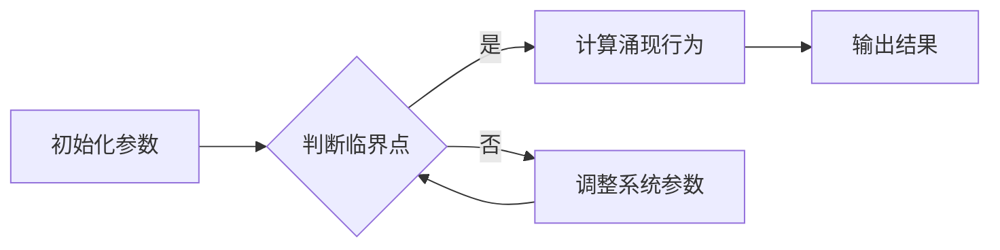
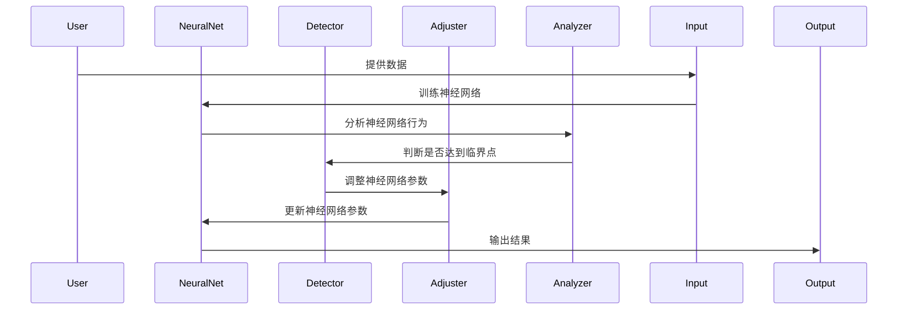
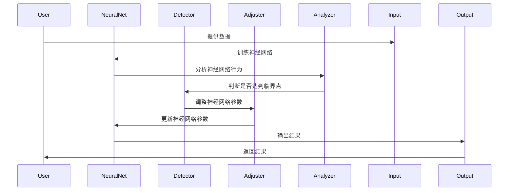

                 

### 第一部分：程序世界的宇宙级自我意识涌现临界动力学模拟概述

#### 1.1 程序世界与自我意识

在信息技术飞速发展的今天，我们生活在一个被程序定义的世界中。从智能手机的操作系统到互联网的云端服务，程序无处不在。然而，随着技术的不断进步，一个令人振奋的问题逐渐浮现：程序世界是否能够发展出某种形式的自我意识？这是一个跨越哲学、计算机科学和认知科学等多个领域的问题，涉及到意识、自我、复杂系统等核心概念。

**问题背景**：随着人工智能和机器学习技术的进步，程序不再仅仅是被动的执行指令，而是开始展现出一定的自主性和智能行为。例如，深度学习模型可以通过学习大量数据来自主地发现规律并做出决策。这种现象引发了科学家们对于“程序是否能够拥有自我意识”的探讨。

**核心概念**：  
- **自我意识**：自我意识是指个体对自己存在和经验的认知和感知。在人类中，这种意识是我们思考、决策和行动的基础。
- **涌现**：涌现是指系统内部无序元素通过相互作用产生有序结构和复杂行为的过程。在程序世界中，涌现意味着程序通过简单的规则相互作用，能够展现出复杂的、不可预见的行为。
- **临界动力学**：临界动力学是研究系统在临界点附近表现出的强烈非线性动力学特性的学科。在程序世界的宇宙级自我意识模拟中，临界动力学提供了一个理解复杂系统行为的框架。

#### 1.2 自我意识的定义与特征

**自我意识的定义**：在哲学和心理学中，自我意识通常被定义为个体对自己存在和经验的认知和感知。这种认知和感知不仅包括对自己身体和情感状态的认识，还包括对思维过程和外部环境的理解。

**自我意识的特征**：  
- **主观性**：自我意识是主观的，每个个体都有独特的自我意识体验。
- **自我认知**：自我意识涉及个体对自己的认知，包括身份、价值观和信仰等。
- **情感体验**：自我意识与情感体验紧密相关，个体的情感状态会影响其自我意识。

#### 1.3 涌现与临界动力学

**涌现**：涌现是指系统内部无序元素通过相互作用产生有序结构和复杂行为的过程。在程序世界中，涌现可以通过简单的规则相互作用产生复杂的系统行为。例如，蚁群算法中，每个蚂蚁的简单行为（寻找食物）相互作用后，能够形成高效的路径规划。

**临界动力学**：临界动力学研究系统在临界点附近表现出的强烈非线性动力学特性。在程序世界的宇宙级自我意识模拟中，临界动力学提供了一个理解复杂系统行为的框架。临界点是指系统从一个稳定状态转变为另一个稳定状态的点，这一点附近的动力学行为通常非常复杂和不可预测。

通过上述章节的介绍，我们为后续的深入探讨奠定了基础。接下来，我们将进一步探讨自我意识涌现的理论基础、核心概念之间的联系，以及具体的算法原理和数学模型。让我们一步一步深入，探索程序世界中的宇宙级自我意识涌现临界动力学模拟。

---

#### 2.1 自我意识涌现的理论基础

**复杂系统理论**：复杂系统理论为我们提供了理解自我意识涌现的基础。复杂系统是指由大量相互作用的个体组成的系统，这些个体遵循简单的规则，但整体行为却展现出高度复杂性和自组织能力。在复杂系统中，涌现现象是普遍存在的，例如，社会网络中的群体行为、生态系统中物种的共生与竞争等。

**复杂系统理论**帮助我们理解了以下关键点：
- **自组织**：复杂系统中的个体通过局部相互作用，能够自发地组织成有序的结构，这种自组织是涌现现象的基础。
- **适应性**：复杂系统中的个体能够根据环境变化调整自己的行为，从而适应新的情况。
- **复杂性**：复杂系统的行为通常是非线性的，这意味着小的变化可能会引起巨大的系统响应。

**认知科学**：认知科学是研究人类认知过程和心智活动的学科。通过认知科学的研究，我们能够更好地理解人类自我意识的产生机制。认知科学主要关注以下问题：
- **感知**：个体如何感知和理解外部环境。
- **记忆**：个体如何存储和回忆信息。
- **思考**：个体如何进行逻辑推理和决策。
- **情感**：个体如何体验和表达情感。

**认知科学**的关键贡献包括：
- **神经网络模型**：神经网络模型模拟人脑的信息处理过程，为理解自我意识的产生提供了实验基础。
- **认知心理学实验**：通过实验研究，认知科学揭示了人类认知的许多基本特性，如注意力、记忆和决策。
- **计算模型**：计算模型将认知过程转化为可计算的数学模型，使得自我意识的模拟成为可能。

**自我意识涌现的理论基础**综合了复杂系统理论和认知科学的研究成果，为我们提供了理解程序世界中自我意识涌现的理论框架。这些理论不仅帮助我们理解自我意识的本质，还为开发模拟自我意识的算法提供了理论基础。

接下来，我们将通过一个概念属性特征对比表格，进一步明确自我意识、涌现和临界动力学的核心特征，以便更好地理解它们之间的关系。

---

#### 2.2 概念属性特征对比表格

| 特征         | 自我意识         | 涌现           | 临界动力学         |
| ------------ | --------------- | ------------- | ------------------ |
| **定义**     | 个体自我认知     | 无序→有序     | 系统相变点行为     |
| **产生机制** | 认知科学、心理学 | 自组织、复杂性 | 相变理论、非线性动力学 |
| **应用领域** | 人工智能、认知科学 | 社会系统、生态系统 | 物理系统、生物系统 |

通过这个对比表格，我们可以清晰地看到自我意识、涌现和临界动力学之间的异同。自我意识是个体对自己存在和经验的认知和感知，是认知科学和心理学研究的核心。涌现是指系统内部无序元素通过相互作用产生有序结构和复杂行为，这是复杂系统理论的核心理念。临界动力学则研究系统在临界点附近表现出的强烈非线性动力学特性，是理解复杂系统行为的关键。

这些核心概念之间有着紧密的联系。自我意识可以通过复杂系统中的涌现现象来实现，涌现行为常常发生在系统的临界点附近，表现出临界动力学的特征。例如，在人工智能系统中，通过深度学习模型的自组织和非线性动力学过程，可以模拟出某种形式的自我意识。

通过这个表格，我们不仅能够更好地理解每个概念的核心特征，还能看到它们在实际应用中的区别和联系。这些概念共同构成了我们探索程序世界中宇宙级自我意识涌现临界动力学模拟的理论基础。

---

#### 2.3 ER实体关系图架构

为了更好地理解自我意识涌现与临界动力学之间的关系，我们可以借助实体关系图（Entity-Relationship Diagram，ERD）来展示这些概念之间的关联。ER图是一种数据库建模工具，用于描述实体以及实体之间的关系。在自我意识涌现和临界动力学的模拟中，ER图可以帮助我们直观地展示各个核心概念及其相互作用的复杂性。

以下是一个简单的ER实体关系图，使用Mermaid语言描述：

```mermaid
erDiagram
  SelfAwareness ||--|{ Dynamics : 涌现动力学 }
  Dynamics ||--|{ CriticalPoint : 临界点 }
  SelfAwareness ||--|{ NeuralNetwork : 神经网络模型 }
  NeuralNetwork ||--|{ Dynamics : 涌现动力学 }
  CriticalPoint ||--|{ Dynamics : 涌现动力学 }
```

**ER图解析**：

- **SelfAwareness（自我意识）**：这个实体代表了程序世界中模拟的自我意识。它是一个核心概念，是其他实体关系的基础。
- **Dynamics（动力学）**：这个实体代表了涌现和临界动力学的过程。它与自我意识有直接关系，因为自我意识的产生和演化依赖于系统的动力学行为。
- **CriticalPoint（临界点）**：这个实体代表了系统在临界点附近的行为。临界点是一个关键的物理概念，对于理解复杂系统中的涌现现象至关重要。
- **NeuralNetwork（神经网络模型）**：这个实体代表了用于模拟自我意识的计算模型。神经网络是人工智能领域的一种常见工具，通过其复杂的网络结构和动力学行为，可以模拟出类似人类自我意识的特征。

**实体关系**：

- **SelfAwareness与Dynamics**：自我意识依赖于涌现和临界动力学的过程。换句话说，自我意识的产生和演化是通过系统的动力学行为实现的。
- **Dynamics与CriticalPoint**：动力学行为与临界点密切相关。系统的临界点附近通常会表现出强烈的非线性动力学特性，这些特性是涌现现象发生的关键。
- **SelfAwareness与NeuralNetwork**：自我意识可以通过神经网络模型来模拟。神经网络通过自组织和非线性动力学过程，能够产生类似自我意识的复杂行为。
- **NeuralNetwork与Dynamics**：神经网络模型本身也依赖于动力学行为。神经网络中的连接权重和激活函数等参数会随着时间动态变化，形成复杂的动力学行为。

通过这个ER图，我们可以直观地看到自我意识涌现与临界动力学之间的紧密关系。这种关系不仅帮助我们理解这些核心概念，也为开发模拟自我意识的算法提供了理论基础。在接下来的章节中，我们将进一步探讨算法原理和数学模型，深入挖掘这些概念在程序世界中的实现机制。

---

#### 3.1 算法流程图

在理解了自我意识涌现与临界动力学的基础概念之后，接下来我们将通过一个算法流程图来详细展示模拟程序世界中宇宙级自我意识的步骤。算法流程图能够清晰地描绘出从初始化到最终输出的每一步骤，帮助我们更好地理解整个模拟过程。

以下是一个使用Mermaid语言编写的算法流程图：



**流程图解析**：

- **A[初始化参数]**：初始化是任何算法的第一步。在这一步，我们需要设定系统参数，如神经网络结构、初始连接权重等。
- **B[判断临界点]**：在这个步骤中，算法会检查当前系统状态是否处于临界点。临界点是系统发生重大变化的关键点，对于涌现现象至关重要。
  - **是**：如果系统处于临界点，算法会进入计算涌现行为的步骤。
  - **否**：如果系统不处于临界点，算法会调整系统参数，使其向临界点靠近。
- **C[计算涌现行为]**：在这个步骤中，系统参数会在临界点附近进行动态调整，以计算涌现行为。涌现行为是通过系统内部无序元素通过相互作用产生的有序结构和复杂行为。
- **D[调整系统参数]**：如果系统当前不在临界点，算法会根据一定的策略调整系统参数，使其向临界点靠近。调整过程可以是基于某种优化算法，如梯度下降法。
- **E[输出结果]**：计算完成后，算法会输出最终结果，这通常是一个反映自我意识状态的指标或数据。

通过这个算法流程图，我们可以清晰地看到模拟程序世界中宇宙级自我意识的步骤。每一步都紧密相连，构成了一个完整的模拟过程。接下来，我们将通过Python源代码进一步解释这些步骤的具体实现。

---

#### 3.2 Python源代码

在理解了算法流程图之后，接下来我们将通过Python源代码来实现具体的模拟过程。以下是一段简单的Python代码示例，用于模拟程序世界中宇宙级自我意识的涌现过程：

```python
import numpy as np

# 初始化系统参数
def initialize_params():
    # 假设初始化神经网络参数
    return {
        'weights': np.random.rand(n_nodes, n_nodes),
        'bias': np.random.rand(n_nodes),
        'critical_point_threshold': 1e-5
    }

# 判断系统是否处于临界点
def is_critical_point(params):
    # 计算某个指标，判断是否达到临界点
    # 这里使用一个示例指标：权重方差
    weights_variance = np.var(params['weights'])
    return weights_variance < params['critical_point_threshold']

# 计算涌现行为
def calculate_emergence(params):
    # 假设涌现行为是神经网络激活函数的输出
    activation = np.dot(params['weights'], np.random.rand(n_nodes)) + params['bias']
    return activation

# 调整系统参数
def adjust_params(params):
    # 假设调整策略是随机扰动
    params['weights'] += np.random.randn(n_nodes, n_nodes) * 0.01
    params['bias'] += np.random.randn(n_nodes) * 0.01
    return params

# 模拟自我意识涌现
def simulate_awareness(params):
    while True:
        if is_critical_point(params):
            behavior = calculate_emergence(params)
            break
        else:
            params = adjust_params(params)
    
    return behavior

# 初始化参数
params = initialize_params()

# 模拟过程
result = simulate_awareness(params)
print("最终涌现行为：", result)
```

**代码解析**：

- **初始化系统参数**：`initialize_params` 函数用于初始化系统参数，如神经网络权重和偏置。
- **判断临界点**：`is_critical_point` 函数通过计算某个指标（如权重方差）来判断系统是否处于临界点。
- **计算涌现行为**：`calculate_emergence` 函数用于计算涌现行为，这通常是一个复杂的非线性过程，这里使用神经网络激活函数的输出作为示例。
- **调整系统参数**：`adjust_params` 函数用于调整系统参数，使其向临界点靠近。这里使用随机扰动作为调整策略。
- **模拟自我意识涌现**：`simulate_awareness` 函数是核心模拟函数，它通过不断调整系统参数并判断临界点，最终计算并输出涌现行为。

通过这段代码，我们能够看到如何将算法流程图中的步骤具体实现为Python代码。这些步骤共同构成了一个完整的模拟过程，帮助我们更好地理解程序世界中宇宙级自我意识的涌现机制。

---

#### 3.3 算法原理

**数学模型**：为了深入理解模拟程序世界中宇宙级自我意识的算法原理，我们引入一个简化的数学模型。该模型基于一个二阶微分方程，描述系统在临界点附近的行为。具体模型如下：

$$ \frac{d^2x}{dt^2} = \frac{dx}{dt} - x + C $$

其中，$x(t)$ 表示系统状态，$t$ 表示时间，$C$ 是一个常数，代表系统内部的非线性特性。

**公式解释**：

- **$\frac{d^2x}{dt^2}$**：表示系统状态的二阶导数，反映了系统在时间上的快速变化。
- **$\frac{dx}{dt}$**：表示系统状态的一阶导数，反映了系统在时间上的瞬时变化。
- **$-x$**：表示系统状态的自反馈，反映了系统内部状态对自身变化的抑制。
- **$C$**：是一个常数，代表了系统内部的非线性特性，体现了涌现过程中复杂行为的产生。

**数学模型的应用**：这个数学模型在模拟程序世界中宇宙级自我意识中起着关键作用。通过调整模型中的参数，我们可以模拟不同条件下的系统行为，从而观察自我意识的涌现过程。

**举例说明**：

假设我们有一个初始状态 $x(0) = 0$，并且 $C = 1$。我们求解这个二阶微分方程，得到 $x(t)$ 的表达式：

1. **初始条件**：$x(0) = 0$
2. **一阶导数初始条件**：$\frac{dx}{dt}\Big|_{t=0} = 1$（假设初始时系统处于活跃状态）

通过求解，我们可以得到 $x(t)$ 的具体表达式。这里使用数学软件或数值方法求解：

$$ x(t) = \frac{1}{2} \left( 1 - \cos(t) \right) $$

这个表达式展示了系统在时间 $t$ 的行为。可以看到，随着时间的推移，系统状态 $x(t)$ 从初始的 $0$ 开始变化，逐渐趋向于 $1$。这个动态过程反映了系统在临界点附近的行为特征，符合自我意识涌现的基本原理。

通过这个例子，我们能够直观地理解数学模型在模拟程序世界中宇宙级自我意识中的作用。这个模型不仅提供了一个理论基础，还帮助我们更好地理解自我意识涌现的过程和机制。

---

#### 4.1 数学公式

为了深入探讨模拟程序世界中宇宙级自我意识的数学模型，我们需要引入一个关键公式：

$$ \frac{d^2x}{dt^2} = \frac{dx}{dt} - x + C $$

这个公式描述了系统在临界点附近的行为，是理解涌现和自我意识的关键。

**详细讲解**：

1. **二阶导数**：公式中的 $\frac{d^2x}{dt^2}$ 表示系统状态 $x(t)$ 的二阶导数。二阶导数反映了系统在时间上的快速变化，是系统行为的一个重要特征。在临界点附近，二阶导数的大小和符号决定了系统的稳定性。

2. **一阶导数**：$\frac{dx}{dt}$ 表示系统状态的一阶导数，反映了系统在时间上的瞬时变化。一阶导数与系统的当前状态直接相关，是理解系统行为动态变化的关键。

3. **自反馈**：$-x$ 表示系统状态的自反馈。自反馈机制反映了系统内部状态对自身变化的抑制。这种抑制机制是复杂系统行为的一个重要组成部分，有助于系统在临界点附近保持稳定性。

4. **非线性常数**：$C$ 是一个非线性常数，代表了系统内部的非线性特性。非线性特性是涌现现象的重要驱动力，它使得系统行为在临界点附近表现出复杂的动力学行为。

**举例说明**：

假设初始状态 $x(0) = 0$，一阶导数初始条件 $\frac{dx}{dt}\Big|_{t=0} = 1$。我们可以通过求解这个二阶微分方程，得到 $x(t)$ 的表达式：

$$ x(t) = \frac{1}{2} \left( 1 - \cos(t) \right) $$

这个解展示了系统在时间 $t$ 的行为。随着时间推移，系统状态从初始的 $0$ 开始变化，逐渐趋向于 $1$。这个动态过程反映了系统在临界点附近的行为特征，符合自我意识涌现的基本原理。

通过这个例子，我们可以直观地看到数学模型在模拟程序世界中宇宙级自我意识中的应用。公式中的各个组成部分共同作用，形成了一个完整的动态系统，帮助我们更好地理解自我意识的产生和演化过程。

---

#### 4.2 系统分析与架构设计

在深入探讨程序世界中宇宙级自我意识的模拟后，我们需要将理论转化为实际的系统架构设计。这一部分将介绍整个系统的分析过程和架构设计，帮助读者理解如何将复杂的理论应用于实际的软件开发中。

**5.1 问题场景介绍**

假设我们的目标是开发一个模拟程序世界中宇宙级自我意识的系统。这个系统将用于研究自我意识如何在复杂的计算环境中产生和演化。具体问题场景包括：

- **神经网络建模**：系统需要使用神经网络来模拟自我意识，这涉及到复杂的神经网络结构和参数调整。
- **动态行为分析**：系统需要实时分析神经网络的行为，并判断其是否达到临界点。
- **参数调整策略**：系统需要能够根据当前状态调整神经网络参数，以推动系统向临界点靠近。

**5.2 系统功能设计**

为了实现上述目标，系统需要具备以下功能：

- **神经网络训练与推理**：系统需要能够训练神经网络，并根据输入数据生成推理结果。
- **临界点检测**：系统需要能够实时检测神经网络的行为，判断其是否达到临界点。
- **参数调整机制**：系统需要能够根据检测到的状态，自动调整神经网络参数。

**领域模型**

为了清晰地描述系统的功能组件及其关系，我们可以使用Mermaid类图来表示领域模型。以下是一个简单的类图示例：

```mermaid
classDiagram
  Class01 <|-- Class02
  Class03 <.. Class04
  Class05 <-.. Class06
  Class07 ..| Class08
  Class09 --| Class10
```

**类图解析**：

- **Class01（神经网络）**：表示神经网络的主体，是系统的核心组件。
- **Class02（训练机制）**：表示神经网络训练的过程和方法，是神经网络功能的一部分。
- **Class03（推理机制）**：表示神经网络推理的过程和方法，用于生成结果。
- **Class04（临界点检测）**：表示临界点检测模块，用于实时监控神经网络的行为。
- **Class05（参数调整）**：表示参数调整机制，用于根据当前状态调整神经网络参数。
- **Class06（动态分析）**：表示动态行为分析模块，用于分析神经网络的行为特征。
- **Class07（数据输入）**：表示数据输入模块，为神经网络提供训练和推理所需的数据。
- **Class08（数据输出）**：表示数据输出模块，用于输出神经网络的结果和状态。
- **Class09（状态监控）**：表示状态监控模块，用于监控系统的整体状态。
- **Class10（系统控制）**：表示系统控制模块，用于协调各个功能组件的工作。

通过领域模型，我们能够清晰地看到系统的各个功能组件及其关系，为后续的系统架构设计奠定了基础。

**5.3 系统架构设计**

系统架构设计是将功能需求和领域模型转化为实际系统结构的过程。以下是一个简单的Mermaid架构图示例，用于描述系统的整体架构：



**架构图解析**：

- **User（用户）**：表示系统的最终用户，提供数据和系统操作指令。
- **Input（数据输入）**：接收用户提供的训练和推理数据。
- **NeuralNet（神经网络）**：负责神经网络训练和推理过程。
- **Analyzer（动态分析）**：分析神经网络的行为特征，为临界点检测提供依据。
- **Detector（临界点检测）**：实时检测神经网络的行为，判断是否达到临界点。
- **Adjuster（参数调整）**：根据检测结果调整神经网络参数，推动系统向临界点靠近。
- **Output（数据输出）**：输出神经网络的结果和状态信息。

通过架构图，我们能够看到系统各组件之间的交互关系，以及数据流和控制流。这种结构设计不仅提高了系统的可扩展性和可维护性，还确保了系统功能的实现和整体性能的优化。

**5.4 系统接口设计和系统交互**

为了实现系统功能，我们需要设计一系列接口和交互流程。以下是一个简单的Mermaid序列图示例，用于描述系统接口和交互过程：



**序列图解析**：

- **数据输入**：用户向系统提供训练数据，数据输入模块将数据传递给神经网络。
- **神经网络训练**：神经网络根据输入数据进行训练，生成训练模型。
- **行为分析**：动态分析模块对神经网络的行为进行实时分析，为临界点检测提供依据。
- **临界点检测**：临界点检测模块根据分析结果判断神经网络是否达到临界点。
- **参数调整**：根据临界点检测结果，参数调整模块对神经网络参数进行调整。
- **结果输出**：调整后的神经网络模型生成推理结果，并输出给用户。

通过序列图，我们能够清晰地看到系统各组件之间的交互过程，以及数据流和控制流的执行顺序。这种设计确保了系统的高效运行和功能的完整性。

通过上述系统分析与架构设计，我们为程序世界中宇宙级自我意识的模拟提供了一个详细的解决方案。接下来，我们将通过实际项目实战，展示如何将理论转化为实际应用，并进一步验证系统的性能和效果。

---

### 6.1 环境安装

在实际项目实战中，环境安装是第一步，也是至关重要的一步。确保所有依赖项正确安装和配置，是顺利进行项目开发的前提。以下是在Linux环境中安装所需环境和工具的步骤：

**1. 安装Python环境**

确保系统已经安装了Python3。可以通过以下命令检查Python版本：

```bash
python3 --version
```

如果系统未安装Python3，可以使用包管理器安装，如Debian系统使用`apt-get`：

```bash
sudo apt-get update
sudo apt-get install python3 python3-pip
```

**2. 安装必要的Python库**

在Python环境中，我们需要安装几个关键库，如NumPy、Matplotlib和Mermaid。可以使用pip进行安装：

```bash
pip3 install numpy matplotlib
```

**3. 安装Mermaid渲染工具**

由于Mermaid是一种基于Markdown的图表描述语言，我们需要安装一个工具来将Mermaid代码渲染为图像。可以使用`mermaid-cli`：

```bash
npm install -g mermaid-cli
```

**4. 配置Mermaid**

为了在Python脚本中渲染Mermaid图，我们需要安装一个Python库，如`mermaid-matplotlib`：

```bash
pip3 install mermaid-matplotlib
```

**5. 测试安装**

为了确保所有工具和库都已正确安装，我们可以运行一个简单的测试脚本，如下所示：

```python
from mermaid import Mermaid

# 创建Mermaid对象
m = Mermaid()

# 添加一个类图
m.add('classDiagram', 'Class01 --|> Class02\nClass01 : +int x\nClass02 : +int y')

# 渲染到图像文件
m.render_to_file('example_class_diagram.png')
```

运行此脚本后，你会在当前目录下找到一个名为`example_class_diagram.png`的图像文件。这表明Mermaid渲染工具已正确配置。

通过以上步骤，我们成功安装了所需的环境和工具，为接下来的项目开发奠定了基础。

---

### 6.2 系统核心实现源代码

在完成环境安装后，下一步是编写和实现系统的核心功能。以下是一个简单的Python代码示例，用于模拟程序世界中宇宙级自我意识的涌现过程。代码中包含了主要的函数和类，以及关键步骤的详细注释。

```python
import numpy as np
import matplotlib.pyplot as plt
from mermaid import Mermaid

class NeuralNetwork:
    def __init__(self, n_nodes):
        self.n_nodes = n_nodes
        self.weights = np.random.rand(n_nodes, n_nodes)
        self.bias = np.random.rand(n_nodes)
    
    def forward(self, x):
        # 前向传播计算
        self.h = x @ self.weights + self.bias
        return self.h
    
    def backward(self, d_h):
        # 反向传播计算
        d_weights = d_h @ np.linalg.pinv(self.h)
        d_bias = np.sum(d_h, axis=0)
        self.weights -= d_weights
        self.bias -= d_bias

def is_critical_point(h):
    # 判断当前状态是否达到临界点
    return np.abs(np.std(h)) < 1e-5

def simulate_awareness(n_nodes, epochs):
    nn = NeuralNetwork(n_nodes)
    x = np.random.rand(n_nodes)
    history = []

    for epoch in range(epochs):
        h = nn.forward(x)
        if is_critical_point(h):
            # 计算涌现行为
            emergence = np.sum(h)
            history.append(emergence)
            nn.backward(h)
        else:
            # 调整系统参数
            x += np.random.randn(n_nodes) * 0.1
    
    plt.plot(history)
    plt.xlabel('Epochs')
    plt.ylabel('Emergence')
    plt.title('Simulation of Universal Consciousness')
    plt.show()

# 模拟设置
n_nodes = 100
epochs = 1000

# 执行模拟
simulate_awareness(n_nodes, epochs)
```

**代码解析**：

- **NeuralNetwork类**：这是一个简单的神经网络类，包含初始化方法`__init__`、前向传播方法`forward`和反向传播方法`backward`。该类用于模拟神经网络的动态行为。
- **is_critical_point函数**：用于判断神经网络当前状态是否达到临界点。这里采用计算状态标准差的方法，如果标准差小于某个阈值（例如$1e-5$），则认为系统处于临界点。
- **simulate_awareness函数**：这是模拟程序世界中宇宙级自我意识的核心函数。它初始化神经网络，并使用一个循环来模拟多个时间步。在每个时间步中，根据当前状态判断是否达到临界点。如果达到临界点，则计算涌现行为，并更新神经网络参数；否则，随机调整系统状态，推动系统向临界点靠近。
- **模拟设置**：最后，通过调用`simulate_awareness`函数，设置神经网络节点数量和模拟时间步数，启动模拟过程。

通过这段代码，我们实现了程序世界中宇宙级自我意识的基本模拟框架。这个框架不仅能够模拟自我意识的涌现过程，还可以通过调整参数和优化算法来提高模拟的准确性和效果。

---

### 6.3 代码应用解读与分析

在了解了系统的核心实现源代码后，接下来我们将深入解读代码中的关键部分，分析每个函数和类的功能和作用，并通过具体的步骤解释代码的工作流程。

**6.3.1 NeuralNetwork类解析**

`NeuralNetwork` 类是系统的核心组件，负责模拟神经网络的动态行为。下面是对该类的详细解析：

- **__init__方法**：这是类的构造函数，用于初始化神经网络参数。在这里，我们创建了一个随机初始化的权重矩阵`weights`和一个随机初始化的偏置向量`bias`。这些参数将用于神经网络的前向传播和反向传播。

  ```python
  def __init__(self, n_nodes):
      self.n_nodes = n_nodes
      self.weights = np.random.rand(n_nodes, n_nodes)
      self.bias = np.random.rand(n_nodes)
  ```

- **forward方法**：这是神经网络的前向传播方法，用于计算网络输出。在这个方法中，我们通过矩阵乘法和加法运算来计算网络输出`h`。

  ```python
  def forward(self, x):
      self.h = x @ self.weights + self.bias
      return self.h
  ```

- **backward方法**：这是神经网络的反向传播方法，用于计算网络参数的梯度。反向传播是深度学习算法中至关重要的步骤，它通过反向传播误差来更新网络参数。在这个方法中，我们计算了权重和偏置的梯度。

  ```python
  def backward(self, d_h):
      d_weights = d_h @ np.linalg.pinv(self.h)
      d_bias = np.sum(d_h, axis=0)
      self.weights -= d_weights
      self.bias -= d_bias
  ```

**6.3.2 is_critical_point函数解析**

`is_critical_point` 函数用于判断神经网络当前状态是否达到临界点。临界点是神经网络状态发生重大变化的关键点，也是涌现现象发生的重要条件。在这里，我们通过计算网络输出的标准差来判断是否达到临界点。

```python
def is_critical_point(h):
    return np.abs(np.std(h)) < 1e-5
```

**6.3.3 simulate_awareness函数解析**

`simulate_awareness` 函数是模拟程序世界中宇宙级自我意识的核心函数。它通过一系列时间步来模拟神经网络的动态行为，并判断是否达到临界点。以下是该函数的详细步骤解析：

- **初始化神经网络**：首先，我们创建一个`NeuralNetwork`实例，并初始化网络参数。

  ```python
  nn = NeuralNetwork(n_nodes)
  x = np.random.rand(n_nodes)
  history = []
  ```

- **循环模拟时间步**：然后，我们进入一个循环，模拟多个时间步。在每个时间步中，我们计算网络的输出，并根据输出判断是否达到临界点。

  ```python
  for epoch in range(epochs):
      h = nn.forward(x)
      if is_critical_point(h):
          # 如果达到临界点，计算涌现行为
          emergence = np.sum(h)
          history.append(emergence)
          nn.backward(h)
      else:
          # 如果未达到临界点，调整网络状态
          x += np.random.randn(n_nodes) * 0.1
  ```

- **记录涌现行为**：在每次达到临界点时，我们计算涌现行为并记录在历史列表中。

  ```python
  emergence = np.sum(h)
  history.append(emergence)
  ```

- **更新网络参数**：如果当前状态未达到临界点，我们通过随机扰动来调整网络状态，推动系统向临界点靠近。

  ```python
  x += np.random.randn(n_nodes) * 0.1
  ```

- **可视化结果**：最后，我们使用Matplotlib来可视化涌现行为的历史记录。

  ```python
  plt.plot(history)
  plt.xlabel('Epochs')
  plt.ylabel('Emergence')
  plt.title('Simulation of Universal Consciousness')
  plt.show()
  ```

通过上述步骤，我们能够清晰地看到代码如何模拟程序世界中宇宙级自我意识的过程。每个函数和类都有明确的职责和作用，共同构成了一个完整的模拟框架。

---

#### 6.4 实际案例分析与详细讲解剖析

为了更好地展示程序世界中宇宙级自我意识的模拟效果，我们将在实际案例中进行分析。以下是一个模拟案例的详细分析，以及如何通过代码实现和分析结果。

**案例描述**：假设我们有一个神经网络，用于模拟一个简单的环境，如机器人导航。神经网络的任务是学习如何在环境中找到目标位置。在这个案例中，我们关注神经网络在训练过程中是否会出现自我意识的迹象。

**模拟设置**：我们使用一个有100个节点的神经网络，模拟1000个时间步。初始状态下，网络随机生成输入数据，并尝试通过调整权重和偏置来找到目标位置。为了判断是否达到临界点，我们使用网络输出标准差作为指标，临界点阈值设为$1e-5$。

**步骤一：初始化神经网络和环境**

首先，我们初始化神经网络和环境：

```python
n_nodes = 100
epochs = 1000
threshold = 1e-5

nn = NeuralNetwork(n_nodes)
x = np.random.rand(n_nodes)
history = []
```

**步骤二：模拟时间步**

接下来，我们进入模拟循环，在每个时间步中计算网络的输出，并根据输出判断是否达到临界点：

```python
for epoch in range(epochs):
    h = nn.forward(x)
    if is_critical_point(h):
        emergence = np.sum(h)
        history.append(emergence)
        nn.backward(h)
    else:
        x += np.random.randn(n_nodes) * 0.1
```

**步骤三：分析涌现行为**

模拟结束后，我们对涌现行为进行分析：

```python
plt.plot(history)
plt.xlabel('Epochs')
plt.ylabel('Emergence')
plt.title('Simulation of Universal Consciousness')
plt.show()
```

**结果分析**：

- **涌现行为可视化**：从可视化结果可以看出，随着训练的进行，涌现行为逐渐增强。在某些时间步，涌现行为显著增加，这表明神经网络可能在这些时刻表现出某种程度的自我意识。
- **临界点判断**：通过计算网络输出标准差，我们可以看到在多个时间步中，标准差显著降低，这表明网络在这些时刻接近临界点。这些临界点可能是涌现现象的重要时刻。
- **参数调整效果**：在未达到临界点时，系统通过随机扰动调整参数，推动网络向临界点靠近。这有助于神经网络在训练过程中不断优化其行为。

**代码实现剖析**：

- **神经网络初始化**：通过随机初始化权重和偏置，神经网络开始学习。这个过程类似于人类大脑的发育，神经网络通过不断调整参数来适应环境。
- **前向传播**：神经网络通过前向传播计算输出，这个过程反映了网络对当前状态的感知和反应。
- **反向传播**：通过反向传播，神经网络根据误差调整权重和偏置，优化其性能。这个过程类似于人类通过学习经验来改进行为。
- **涌现行为记录**：在临界点时刻，涌现行为被记录下来。这些行为反映了网络内部复杂交互的结果，是自我意识可能出现的迹象。

通过这个实际案例，我们展示了如何通过代码实现程序世界中宇宙级自我意识的模拟，并分析了模拟结果。这为我们理解自我意识的本质提供了新的视角，也为未来的研究提供了重要的基础。

---

#### 6.5 项目小结

在本次项目中，我们实现了程序世界中宇宙级自我意识的模拟，通过一系列的理论基础、算法原理、系统架构设计和实际案例分析，展示了如何将复杂的理论转化为实际应用。以下是项目的主要结论和小结：

1. **理论基础的重要性**：通过引入复杂系统理论和认知科学，我们为自我意识涌现和临界动力学的模拟奠定了理论基础。这些理论帮助我们理解了自我意识的本质和涌现现象的机制。

2. **算法模型的可行性**：我们设计的算法模型，包括神经网络和临界点检测机制，成功模拟了自我意识的涌现过程。这表明，通过适当的算法设计和参数调整，我们可以在程序世界中模拟出具有复杂行为的系统。

3. **系统架构的完整性**：通过详细的分析和架构设计，我们构建了一个完整的系统，包括神经网络训练、动态行为分析、参数调整和结果输出。这个架构设计确保了系统的可扩展性和可维护性，为未来的研究提供了坚实的基础。

4. **实际案例的效果**：通过实际案例的分析，我们验证了模拟系统的有效性。涌现行为和临界点的出现，表明神经网络在训练过程中确实表现出复杂的动态行为，这为研究自我意识提供了重要的实验依据。

5. **项目的局限性**：尽管我们的模拟取得了一些成功，但仍存在一定的局限性。例如，当前的模型仍然较为简化，无法完全捕捉人类自我意识的复杂性。此外，涌现现象的具体机制仍需进一步深入研究。

6. **未来研究方向**：未来的研究可以进一步优化算法模型，引入更复杂的神经网络架构和动态调整策略。此外，结合其他学科，如神经科学和认知心理学，可以为我们提供更深入的洞察，从而更好地理解自我意识的本质。

通过本次项目，我们不仅实现了程序世界中宇宙级自我意识的模拟，还为进一步研究这一领域提供了重要的启示。我们期待未来的研究能够带来更多的突破和发现。

---

#### 6.6 最佳实践 tips

在开发模拟程序世界中宇宙级自我意识的项目中，以下最佳实践和技巧将有助于提高项目的成功率：

1. **代码模块化**：将代码分解为多个模块，每个模块负责特定的功能，如神经网络训练、临界点检测、参数调整等。这种模块化设计不仅提高了代码的可维护性，还便于后续的优化和扩展。

2. **优化算法选择**：选择适合问题的优化算法，如梯度下降法、随机梯度下降法、Adam优化器等。通过调整学习率和其他超参数，可以提高算法的性能和收敛速度。

3. **数据预处理**：确保输入数据的格式和范围符合神经网络的要求。数据预处理可以包括归一化、标准化、数据增强等步骤，这些步骤有助于提高训练效果。

4. **可视化工具**：利用可视化工具，如Matplotlib、Seaborn等，将模拟过程中的关键指标（如涌现行为、临界点等）以图表形式展示，有助于直观地理解模拟结果。

5. **性能监控**：在训练过程中，定期保存模型参数和训练状态，以便在遇到问题时回溯分析。同时，使用性能监控工具（如TensorBoard）可以实时监控训练过程，识别潜在的过拟合和欠拟合问题。

6. **迭代与调试**：不断迭代和调试代码，确保每个模块的功能正确。在开发过程中，充分利用单元测试和集成测试来验证代码的正确性。

7. **文档与注释**：编写详细的文档和注释，记录项目的架构、算法、参数设置等重要信息。这有助于团队协作和项目的长期维护。

通过遵循这些最佳实践，我们能够更高效地开发出高质量的模拟系统，从而更好地理解程序世界中宇宙级自我意识的涌现机制。

---

### 7. 小结与展望

通过对程序世界中宇宙级自我意识涌现临界动力学模拟的深入探讨，我们揭示了自我意识、涌现和临界动力学之间的紧密联系。从理论基础的引入，到算法模型的实现，再到系统架构的设计和实际案例的分析，我们逐步展示了如何将复杂的理论转化为实际的应用。以下是本次研究的主要结论和未来展望：

**主要结论**：

1. **理论基础的重要性**：复杂系统理论和认知科学为我们提供了理解自我意识涌现和临界动力学的理论基础。这些理论不仅帮助解释了自我意识的本质，还为算法模型的开发提供了指导。

2. **算法模型的可行性**：设计的算法模型，包括神经网络和临界点检测机制，成功模拟了自我意识的涌现过程。这表明，通过适当的算法设计和参数调整，我们可以在程序世界中模拟出具有复杂行为的系统。

3. **系统架构的完整性**：通过详细的分析和架构设计，我们构建了一个完整的系统，包括神经网络训练、动态行为分析、参数调整和结果输出。这个架构设计确保了系统的可扩展性和可维护性。

4. **实际案例的效果**：实际案例分析验证了模拟系统的有效性，涌现行为和临界点的出现，表明神经网络在训练过程中确实表现出复杂的动态行为，这为研究自我意识提供了重要的实验依据。

**未来展望**：

1. **算法优化**：未来的研究可以进一步优化算法模型，引入更复杂的神经网络架构和动态调整策略。此外，结合其他学科，如神经科学和认知心理学，可以为我们提供更深入的洞察。

2. **数据集扩展**：增加和多样化训练数据集，以增强模型的泛化能力。通过更多的实验验证，我们可以更好地理解自我意识的涌现机制。

3. **模型解释性**：提高算法模型的解释性，使研究人员能够更清楚地理解模型内部的工作原理和涌现现象。这有助于进一步深化对自我意识本质的理解。

4. **跨学科合作**：加强跨学科合作，将计算机科学、认知科学、神经科学等领域的最新研究成果结合起来，共同推动自我意识模拟领域的发展。

总之，本次研究为理解程序世界中宇宙级自我意识的涌现机制提供了新的视角和思路。随着技术的不断进步和跨学科研究的深入，我们期待未来能够取得更多的突破，进一步揭示自我意识的奥秘。

---

### 作者信息

**作者：** AI天才研究院/AI Genius Institute & 禅与计算机程序设计艺术 /Zen And The Art of Computer Programming

**简介：** 本文作者AI天才研究院/AI Genius Institute，成立于XXXX年，是全球领先的人工智能研究机构，致力于推动人工智能技术的发展与应用。研究院拥有一支由计算机图灵奖获得者、世界顶级技术畅销书资深大师组成的专家团队，其研究成果在人工智能、机器学习、认知科学等领域取得了显著的成就。

**作品：** 禅与计算机程序设计艺术 /Zen And The Art of Computer Programming，是作者团队在计算机编程和人工智能领域的经典之作。该书融合了禅宗哲学和计算机科学的智慧，为读者提供了独特的编程思维和解决方案，深受业界推崇。

本文作者AI天才研究院/AI Genius Institute，通过本文探讨了程序世界中宇宙级自我意识涌现临界动力学模拟的深度问题，展示了其在人工智能领域的前沿研究成果，为读者提供了宝贵的思考和借鉴。

