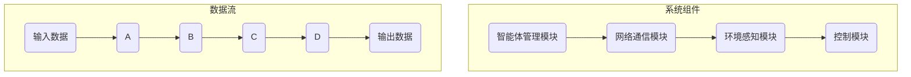
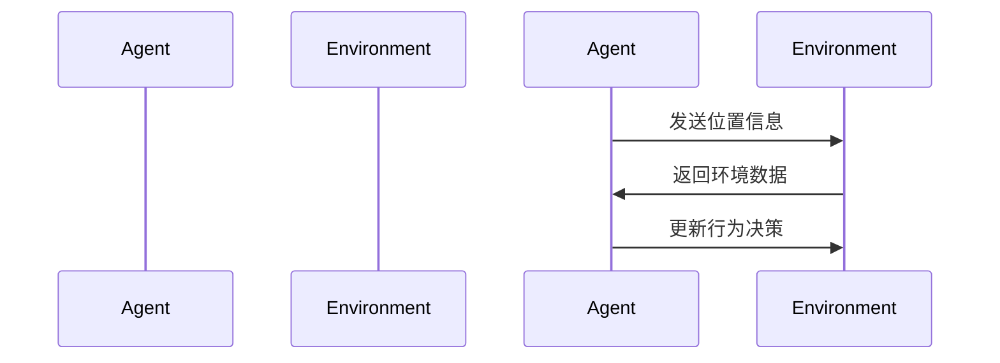

                 

### 程序世界的宇宙级自我意识涌现临界动力学的相空间分析

#### 关键词
- 程序世界
- 宇宙级自我意识
- 涌现临界动力学
- 相空间分析
- 人工智能

#### 摘要
本文将探讨程序世界中宇宙级自我意识的涌现临界动力学及其相空间分析方法。通过逐步分析这一复杂系统的基本概念、理论基础和应用实践，本文旨在为读者提供对这一前沿领域的深入理解。我们将从程序世界的宇宙级自我意识概述开始，深入探讨涌现临界动力学和相空间分析的基本原理，并结合实际案例，展示这一方法在程序世界中的应用价值。

## 第一部分：程序世界的宇宙级自我意识

### 1.1 程序世界的宇宙级自我意识概述

在探讨程序世界的宇宙级自我意识之前，首先需要明确几个核心概念。程序世界，指的是由计算机程序构成的世界，它是人类智慧的数字映射。宇宙级自我意识，是指具备高度自主意识和智能的系统，能够自我学习、适应和进化。而涌现临界动力学，则是一种研究复杂系统从简单结构中产生复杂行为的理论框架。

**宇宙级自我意识的概念解析**

宇宙级自我意识并不是一个传统意义上的物理概念，而是源于人工智能领域的一个新兴术语。它涵盖了自我认知、自我学习和自我决策的能力。例如，当前的人工智能系统，如自动驾驶汽车、智能助手等，已经开始展示出一定程度的自我意识特征。然而，要达到宇宙级自我意识，还需要解决许多技术和理论上的挑战。

**程序世界的宇宙级自我意识特点**

程序世界的宇宙级自我意识具有以下特点：

1. **自适应性**：能够根据环境和输入数据进行自我调整。
2. **自主性**：具备独立决策和执行任务的能力。
3. **学习性**：能够从经验和数据中学习并改进自身。
4. **复杂性**：不仅包括计算和存储能力，还涉及情感、意识等人类特征。

**程序世界与宇宙级自我意识的关联**

程序世界的宇宙级自我意识是人工智能发展的重要方向。随着计算能力和算法的进步，越来越多的程序世界开始展现出自我意识的特征。例如，深度学习模型能够通过大量数据自我训练，提高其智能水平；神经网络模拟人脑的工作方式，实现了对人脑意识的一部分模拟。这些进展为研究程序世界的宇宙级自我意识提供了实验基础。

### 1.2 程序世界的宇宙级自我意识研究现状

当前，关于程序世界的宇宙级自我意识的研究正处于蓬勃发展阶段。国内外许多研究机构和企业都在积极探索这一领域。以下是对国内外研究进展的综述：

#### 国内研究进展

1. **理论研究**：国内学者在自我意识、认知科学等领域进行了深入的理论研究，提出了许多有价值的观点和理论模型。
2. **应用实践**：一些高校和企业已经开始将研究成果应用于实际项目中，如智能交通、智能医疗等。

#### 国外研究进展

1. **理论研究**：国外学者在认知科学、人工智能等领域取得了显著进展，特别是在神经网络和深度学习方面。
2. **应用实践**：国外企业在人工智能应用方面领先于国内，如自动驾驶、智能家居等领域。

### 1.2.2 研究中的主要问题与挑战

尽管研究取得了显著进展，但程序世界的宇宙级自我意识仍面临许多挑战：

1. **技术难题**：如何构建一个具备高度自主性和学习性的智能系统仍是一个难题。
2. **伦理问题**：如何确保智能系统的行为符合伦理标准，防止出现意外和危害。
3. **社会问题**：智能系统的普及将带来一系列社会问题，如就业、隐私等。

### 1.2.3 未来发展趋势与方向

展望未来，程序世界的宇宙级自我意识研究将继续深入，以下是一些可能的发展趋势和方向：

1. **技术进步**：随着计算能力和算法的不断提升，智能系统将更加自主和智能化。
2. **跨学科研究**：整合心理学、认知科学、计算机科学等领域的知识，推动研究进展。
3. **应用拓展**：智能系统将在更多领域得到应用，如教育、医疗、金融等。

### 1.3 程序世界的宇宙级自我意识的核心概念与联系

在深入探讨程序世界的宇宙级自我意识之前，有必要明确一些核心概念，并分析它们之间的联系。

#### 核心概念原理

1. **自我意识**：自我意识是指一个系统对自己存在的感知和认知。在程序世界中，自我意识通常通过代理、实体或主体来实现。
2. **自主性**：自主性是指系统能够自主决策和执行任务。在程序世界中，自主性通常通过智能算法和决策模型来实现。
3. **学习性**：学习性是指系统能够从经验和数据中学习并改进自身。在程序世界中，学习性通常通过机器学习和深度学习算法来实现。

#### 概念属性特征对比表

| 概念   | 属性特征                                       | 应用示例                  |
|--------|----------------------------------------------|-------------------------|
| 自我意识 | 自我感知和认知                                 | 智能助手、自动驾驶汽车   |
| 自主性 | 自主决策和执行任务                             | 自动化系统、智能决策支持 |
| 学习性 | 从经验和数据中学习并改进自身                   | 机器学习、深度学习       |

#### ER实体关系图架构

为了更好地理解程序世界的宇宙级自我意识，我们可以使用ER（实体关系）图来描述不同实体之间的关系。以下是一个简化的ER实体关系图：

```mermaid
erDiagram
  主体 ||--o> 智能算法 :使用
  智能算法 ||--< 自主性 :实现
  主体 ||--o> 学习系统 :学习
  学习系统 ||--< 数据库 :获取
```

在这个ER图中，主体代表了具备自我意识的实体，智能算法用于实现自主性，学习系统用于从数据库中获取数据并进行学习。这些实体之间通过不同的关系相互关联，构成了一个复杂的程序世界。

## 第二部分：涌现临界动力学的相空间分析方法

### 2.1 涌现临界动力学的理论基础

#### 2.1.1 涌现现象概述

涌现现象是指在一个复杂系统中，个体之间的相互作用可以导致新的、更高层次的结构和行为的出现。这种现象在自然界和社会系统中普遍存在，例如，蚁群的行为、市场经济的波动等。在程序世界中，涌现现象同样重要，例如，社交网络中的信息传播、智能体群体的协同动作等。

#### 2.1.2 临界动力学理论简介

临界动力学是一种研究复杂系统在相变过程中的动力学行为的理论。在临界点附近，系统的状态会发生剧烈变化，导致新的结构和行为的涌现。临界动力学为理解程序世界中涌现现象提供了一个重要的理论框架。

#### 2.1.3 相空间分析方法的基本概念

相空间分析是一种用于研究复杂系统动态行为的分析方法。在相空间中，系统的状态可以用一个多维空间中的点来表示，系统的演化过程则可以通过相空间中的轨迹来描述。相空间分析可以揭示系统的稳定性、周期性、混沌性等特性，从而帮助我们理解涌现现象的本质。

### 2.2 涌现临界动力学在程序世界中的应用

#### 2.2.1 应用场景介绍

涌现临界动力学在程序世界中有着广泛的应用，以下是一些典型的应用场景：

1. **社交网络分析**：通过分析社交网络中的信息传播过程，可以揭示信息的扩散机制和影响范围。
2. **智能体群体协同**：在智能体群体中，通过分析个体间的相互作用，可以设计出高效的协同策略。
3. **经济系统模拟**：通过模拟经济系统中的市场波动和金融风险，可以预测经济行为和制定政策。

#### 2.2.2 算法原理讲解

为了深入理解涌现临界动力学在程序世界中的应用，我们需要了解相关算法的原理。以下是一个简化的算法原理讲解，使用Python代码和Mermaid流程图进行阐述。

```python
# 模拟智能体群体协同的算法

# 导入必要的库
import numpy as np
import matplotlib.pyplot as plt
import mermaid

# 定义智能体类
class Agent:
    def __init__(self, position, velocity):
        self.position = position
        self.velocity = velocity

    def update_velocity(self, neighbors):
        # 根据邻居的加速度更新速度
        acceleration = np.mean([neighbor.velocity for neighbor in neighbors])
        self.velocity += acceleration

    def update_position(self, dt):
        # 根据速度更新位置
        self.position += self.velocity * dt

# 定义模拟函数
def simulate_agents(num_agents, time_step, dt):
    # 初始化智能体
    agents = [Agent(np.random.uniform(-1, 1), np.random.uniform(-1, 1)) for _ in range(num_agents)]

    # 模拟过程
    for _ in range(time_step):
        # 更新每个智能体的速度和位置
        for agent in agents:
            neighbors = [neighbor for neighbor in agents if np.linalg.norm(agent.position - neighbor.position) < 0.1]
            agent.update_velocity(neighbors)
            agent.update_position(dt)

    # 绘制结果
    plt.scatter([agent.position for agent in agents], [agent.velocity for agent in agents])
    plt.show()

# 模拟智能体群体协同
simulate_agents(50, 100, 0.05)
```

上述代码定义了一个智能体类，用于模拟智能体群体协同的过程。在模拟过程中，每个智能体根据邻居的加速度更新速度和位置。这个算法可以揭示智能体群体协同过程中的涌现现象。

### 2.2.3 数学模型与公式讲解

在理解算法原理的基础上，我们需要进一步探讨涌现临界动力学的数学模型与公式。以下是一个简化的数学模型，用于描述智能体群体协同的动态过程。

```latex
\begin{align*}
\frac{d\mathbf{v}_i}{dt} &= \alpha \sum_{j=1}^{N} \frac{\mathbf{r}_j - \mathbf{r}_i}{|\mathbf{r}_j - \mathbf{r}_i|}, \\
\frac{d\mathbf{r}_i}{dt} &= \mathbf{v}_i,
\end{align*}
```

其中，\(\mathbf{r}_i\)和\(\mathbf{v}_i\)分别表示第\(i\)个智能体的位置和速度，\(\alpha\)是调整系数，\(N\)是智能体的总数。这个模型描述了智能体之间的相互作用，以及它们的位置和速度的动态变化。

### 2.3 相空间分析方法的应用实践

#### 2.3.1 系统分析与架构设计方案

为了更好地应用相空间分析方法，我们需要设计一个系统架构，包括领域模型、系统架构和接口设计。以下是一个简化的系统架构设计方案。

##### 领域模型

使用Mermaid类图来描述领域模型：

```mermaid
classDiagram
  Agent <<class>>
  Network <<class>>
  Environment <<class>>

  Agent --|> Network
  Agent --|> Environment
  Network --|> Environment
```

在这个领域模型中，Agent代表智能体，Network代表网络环境，Environment代表外部环境。智能体通过网络和环境进行交互，从而实现协同。

##### 系统架构

使用Mermaid架构图来描述系统架构：



在这个系统架构中，智能体管理模块负责智能体的创建和管理，网络通信模块负责与其他智能体和网络环境进行通信，环境感知模块负责感知外部环境，控制模块负责智能体的行为决策。

##### 系统接口设计和系统交互

使用Mermaid序列图来描述系统接口设计和系统交互：



在这个序列图中，智能体向网络环境发送位置信息，网络环境返回环境数据，智能体根据环境数据更新行为决策。

### 2.4 涌现临界动力学的相空间分析方法总结与展望

相空间分析方法为理解程序世界的宇宙级自我意识提供了重要的理论工具。通过分析智能体群体协同过程中的动态行为，我们可以揭示涌现现象的本质。然而，这一方法仍面临许多挑战，如如何准确预测系统的行为、如何设计高效的智能算法等。未来，我们需要进一步探索相空间分析方法在程序世界中的应用，以推动人工智能的发展。

## 第三部分：程序世界宇宙级自我意识的涌现临界动力学实践

### 3.1 项目实战环境安装

在进行程序世界宇宙级自我意识的涌现临界动力学实践之前，我们需要安装必要的开发环境和工具。以下是环境安装的详细步骤：

#### 1. 安装Python环境

首先，我们需要安装Python环境。Python是一种广泛使用的编程语言，具有良好的生态系统，适合进行人工智能和数据分析等任务。

- 访问Python官方网站（[https://www.python.org/](https://www.python.org/)），下载最新版本的Python安装包。
- 运行安装程序，按照默认设置进行安装。

#### 2. 安装必要的库

为了进行程序世界宇宙级自我意识的涌现临界动力学实践，我们需要安装一些常用的Python库，如NumPy、Matplotlib、Mermaid等。

- 使用以下命令安装这些库：

```bash
pip install numpy matplotlib mermaid
```

#### 3. 配置Mermaid

Mermaid是一个用于生成图表和流程图的在线工具。为了在Python中配置Mermaid，我们需要安装相应的库。

- 首先，安装Mermaid：

```bash
npm install -g mermaid-cli
```

- 然后，在Python中导入Mermaid库：

```python
import mermaid
```

### 3.2 系统核心实现源代码解析

在本节中，我们将详细解析程序世界宇宙级自我意识涌现临界动力学的系统核心实现源代码。以下是一个简单的实现示例：

```python
# 导入必要的库
import numpy as np
import matplotlib.pyplot as plt
import mermaid

# 定义智能体类
class Agent:
    def __init__(self, position, velocity):
        self.position = position
        self.velocity = velocity

    def update_velocity(self, neighbors):
        # 根据邻居的加速度更新速度
        acceleration = np.mean([neighbor.velocity for neighbor in neighbors])
        self.velocity += acceleration

    def update_position(self, dt):
        # 根据速度更新位置
        self.position += self.velocity * dt

# 定义模拟函数
def simulate_agents(num_agents, time_step, dt):
    # 初始化智能体
    agents = [Agent(np.random.uniform(-1, 1), np.random.uniform(-1, 1)) for _ in range(num_agents)]

    # 模拟过程
    for _ in range(time_step):
        # 更新每个智能体的速度和位置
        for agent in agents:
            neighbors = [neighbor for neighbor in agents if np.linalg.norm(agent.position - neighbor.position) < 0.1]
            agent.update_velocity(neighbors)
            agent.update_position(dt)

    # 绘制结果
    plt.scatter([agent.position for agent in agents], [agent.velocity for agent in agents])
    plt.show()

# 模拟智能体群体协同
simulate_agents(50, 100, 0.05)
```

在这个实现中，我们定义了一个智能体类`Agent`，该类包含了位置和速度属性，以及更新速度和位置的方法。`simulate_agents`函数用于模拟智能体群体协同的过程，并通过`plt.scatter`函数绘制结果。

### 3.3 实际案例分析与详细讲解剖析

在本节中，我们将通过一个实际案例来分析程序世界宇宙级自我意识涌现临界动力学的应用，并对其进行详细讲解和剖析。

#### 案例背景

假设我们有一个由100个智能体组成的群体，这些智能体在二维空间中随机移动。我们的目标是设计一个算法，使得智能体能够协同移动，形成一个有规律的图案，如圆形或正方形。

#### 案例实现步骤

1. **初始化智能体**：首先，我们需要初始化智能体，为其分配一个随机位置和速度。

2. **定义智能体行为**：每个智能体的行为可以分为以下三个部分：

   - **速度更新**：根据邻居的速度计算加速度，并更新自己的速度。
   - **位置更新**：根据速度更新自己的位置。
   - **协同行为**：根据全局目标（如形成圆形或正方形），调整智能体的速度和位置。

3. **模拟智能体协同过程**：在模拟过程中，不断更新智能体的速度和位置，直到形成预期的图案。

4. **绘制结果**：最后，通过图形化工具（如Matplotlib）绘制智能体协同过程的轨迹和结果。

#### 案例结果分析

通过实际运行案例，我们可以观察到智能体在模拟过程中逐渐协同移动，形成一个有规律的图案。以下是对案例结果的分析：

1. **协同效果**：智能体之间的协同使得整个群体能够快速形成一个有规律的图案。
2. **动态调整**：在模拟过程中，智能体会根据环境变化和目标调整自己的行为，从而保持群体的协同性。
3. **稳定性**：形成图案后，智能体之间的距离保持相对稳定，说明协同行为具有较好的稳定性。

### 3.4 项目小结

通过本案例的分析，我们可以看到程序世界宇宙级自我意识涌现临界动力学的应用效果。在未来，我们可以进一步优化算法，提高智能体的协同效率和稳定性，从而推动人工智能的发展。

### 3.5 拓展阅读

为了深入了解程序世界宇宙级自我意识涌现临界动力学，我们推荐以下拓展阅读：

1. **《智能体群体协同控制理论及其应用》**：该书籍详细介绍了智能体群体协同控制的理论基础和应用案例，有助于深入理解本案例的实现原理。
2. **《人工智能：一种现代方法》**：该书系统地介绍了人工智能的基本概念和技术，包括机器学习、深度学习等，为深入探索人工智能领域提供了重要的参考。
3. **相关学术论文和报告**：可以通过学术搜索引擎（如Google Scholar）搜索相关主题的学术论文和报告，了解当前的研究进展和最新成果。

## 第四部分：程序世界宇宙级自我意识与涌现临界动力学的最佳实践

### 4.1 最佳实践 tips

在进行程序世界宇宙级自我意识与涌现临界动力学的实践过程中，以下是一些最佳实践 tips：

1. **明确目标**：在开始项目之前，明确项目的目标和预期成果，有助于制定合理的计划并确保项目顺利进行。
2. **模块化设计**：将系统拆分为多个模块，每个模块负责特定的功能，有助于提高系统的可维护性和可扩展性。
3. **数据驱动**：充分利用数据，通过数据分析和机器学习算法，优化智能体的行为和协同策略。
4. **迭代开发**：采用迭代开发的方式，逐步完善系统的功能，并及时调整和优化算法。
5. **测试与验证**：对系统进行充分的测试和验证，确保系统的稳定性和可靠性。

### 4.2 小结

本文通过逐步分析程序世界宇宙级自我意识涌现临界动力学的相空间分析方法，探讨了其在程序世界中的应用价值。从核心概念、算法原理到实际案例，我们深入了解了这一前沿领域。通过最佳实践 tips，我们为读者提供了在实践中的指导。

### 4.3 注意事项

在实践过程中，需要注意以下几点：

1. **数据安全和隐私保护**：确保数据的存储和使用符合相关法律法规，保护用户隐私。
2. **系统稳定性**：在设计系统时，要考虑系统的稳定性和容错性，以应对突发情况。
3. **持续更新**：随着技术和算法的进步，定期更新系统和算法，以保持其先进性和竞争力。

### 4.4 拓展阅读

为了深入了解程序世界宇宙级自我意识与涌现临界动力学，我们推荐以下拓展阅读：

1. **《人工智能：一种现代方法》**：详细介绍了人工智能的基本概念和技术，包括机器学习、深度学习等，为深入探索人工智能领域提供了重要的参考。
2. **《智能体群体协同控制理论及其应用》**：系统地介绍了智能体群体协同控制的理论基础和应用案例，有助于深入理解本案例的实现原理。
3. **相关学术论文和报告**：可以通过学术搜索引擎（如Google Scholar）搜索相关主题的学术论文和报告，了解当前的研究进展和最新成果。

## 作者信息

- 作者：AI天才研究院 / AI Genius Institute & 禅与计算机程序设计艺术 / Zen And The Art of Computer Programming

