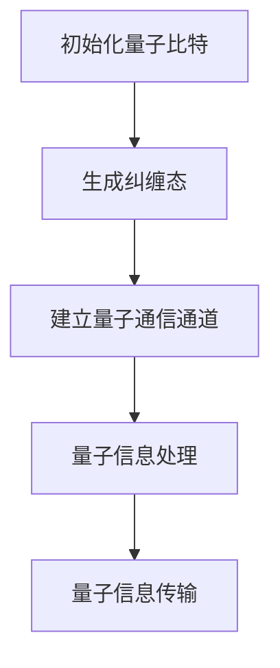
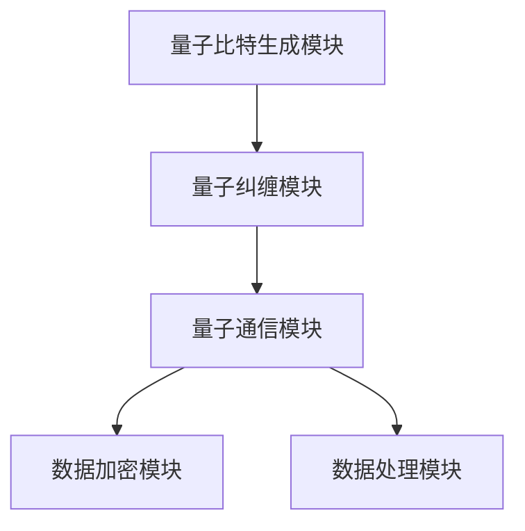
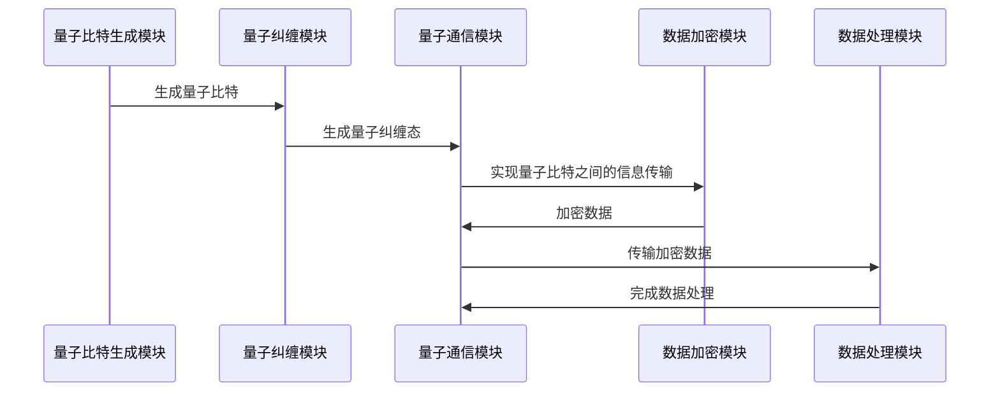

                 

### 文章标题：程序世界的宇宙级量子纠缠分布网络

> 关键词：量子纠缠分布网络，程序世界，量子计算，量子通信，量子加密

> 摘要：本文将深入探讨量子纠缠分布网络在程序世界中的重要性、核心概念、算法原理，以及其在系统架构设计和项目实战中的应用。通过逻辑清晰、结构紧凑的分析，帮助读者理解这一前沿技术的本质及其广阔应用前景。

----------------------------------------------------------------

### 第一部分：背景介绍

#### 1. 程序世界的宇宙级量子纠缠分布网络概述

在数字化时代，程序世界正经历着一场前所未有的变革。随着互联网和信息技术的飞速发展，数据的传输和处理速度成为衡量计算机性能的重要指标。然而，传统的计算模型在处理海量数据时，面临着速度瓶颈和安全性问题。为了解决这些问题，科学家们提出了量子纠缠分布网络这一创新性的计算架构。

量子纠缠分布网络，是一种基于量子力学原理的新型计算架构。它利用量子纠缠现象，实现高速、安全的量子信息处理和传输。量子纠缠是指两个或多个量子粒子之间的强关联性，这种关联性不受物理距离的限制。当两个量子粒子处于纠缠态时，它们之间的信息能够瞬间传递，这一特性使得量子纠缠分布网络在信息传输速度和安全性上具有显著优势。

#### 2. 量子纠缠分布网络的重要性

量子纠缠分布网络不仅在理论上具有重要意义，还在实际应用中展示出巨大的潜力。它能够解决传统计算模型中的一些难题，如量子加密、量子计算、量子通信等。尤其是在网络安全、大数据处理、高性能计算等领域，量子纠缠分布网络展现出了独特的优势。

在网络安全方面，量子纠缠分布网络可以实现量子加密，保障数据传输的安全性。在大数据处理方面，量子纠缠分布网络能够提供更高的计算速度，解决海量数据的处理难题。在高性能计算方面，量子纠缠分布网络可以实现更高效的算法，提升计算性能。

#### 3. 问题背景

随着互联网和信息技术的飞速发展，数据的传输和处理速度成为衡量计算机性能的重要指标。传统的计算模型在处理海量数据时，面临着速度瓶颈和安全性问题。量子计算的出现，为解决这些问题提供了一种新的思路。量子纠缠分布网络作为量子计算的一个重要分支，旨在解决数据传输和处理速度的瓶颈问题。

#### 4. 问题描述

量子纠缠分布网络的核心在于量子纠缠现象。当两个量子粒子处于纠缠态时，它们之间的信息能够瞬间传递，不受物理距离的限制。这一特性使得量子纠缠分布网络在信息传输速度和安全性上具有显著优势。然而，量子纠缠分布网络的实现面临着一系列技术挑战，如量子比特的制备、量子纠缠态的维持、量子通信通道的建立等。

#### 5. 问题解决

量子纠缠分布网络通过构建量子纠缠态，实现高速、安全的量子信息传输和处理。它能够有效应对传统计算模型中的速度瓶颈和安全性问题，为数字化时代提供了一种全新的解决方案。量子纠缠分布网络的实现需要一系列关键技术，如量子比特的制备与控制、量子纠缠态的生成与维持、量子通信通道的建立与优化等。

#### 6. 边界与外延

量子纠缠分布网络不仅限于理论研究，其应用领域也在不断拓展。从量子计算、量子通信到量子加密，再到大数据处理、高性能计算等领域，量子纠缠分布网络都有广泛的应用前景。随着量子技术的不断发展，量子纠缠分布网络的应用范围将进一步扩大，为人类社会带来更多变革。

#### 7. 概念结构与核心要素组成

量子纠缠分布网络的概念结构主要包括量子比特、纠缠态、量子通信通道等核心要素。其中，量子比特是量子计算的基本单元，可以同时处于多种状态，实现量子信息的存储和处理。纠缠态是实现量子信息传输的关键，通过量子纠缠现象，实现量子比特之间的快速通信。量子通信通道则是连接不同量子节点的重要桥梁，保障量子信息的可靠传输。

### 第二部分：核心概念与联系

#### 1. 量子纠缠分布网络的核心概念

量子纠缠分布网络的核心概念包括量子纠缠、量子比特、量子态、量子门等。这些概念构成了量子计算的基础，是理解量子纠缠分布网络的关键。

**量子纠缠**：量子纠缠是指两个或多个量子粒子之间的强关联性，这种关联性不受物理距离的限制。当两个量子粒子处于纠缠态时，它们之间的信息能够瞬间传递。

**量子比特**：量子比特是量子计算的基本单元，可以同时处于多种状态。量子比特的状态可以用基态和叠加态来描述。

**量子态**：量子态是量子系统的整体状态，由量子比特的叠加态描述。量子态可以是纯态或混合态。

**量子门**：量子门是对量子比特进行操作的数学模型。量子门可以实现量子比特的状态变换，是实现量子计算的基本操作。

#### 2. 核心概念属性特征对比表格

以下是一个关于量子纠缠分布网络核心概念属性特征的对比表格：

| 概念       | 定义                                                         | 属性特征                           |
| ---------- | ------------------------------------------------------------ | ---------------------------------- |
| 量子纠缠   | 量子粒子之间的强关联性，不受距离限制                         | 高速、安全的信息传输               |
| 量子比特   | 量子计算的基本单元，可以同时处于多种状态                     | 多状态、叠加态                   |
| 量子态     | 量子系统的整体状态，由量子比特的叠加态描述                   | 纯态、混合态                     |
| 量子门     | 对量子比特进行操作的数学模型                                 | 实现量子计算的基本操作           |

#### 3. ER实体关系图架构

以下是一个关于量子纠缠分布网络ER实体关系图架构的Mermaid流程图：

```mermaid
erDiagram
    QuantumBit ||--|{ QuantumState }|-- QuantumGate
    QuantumBit ||--|{ QuantumEntanglement }|-- QuantumBit
    QuantumState ||--|{ PureState }|-- QuantumBit
    QuantumState ||--|{ MixedState }|-- QuantumBit
    QuantumGate ||--|{ QuantumOperation }|-- QuantumBit
    QuantumEntanglement ||--|{ QuantumCommunicationChannel }|-- QuantumBit
```

### 第三部分：算法原理讲解

#### 1. 量子纠缠分布网络的算法原理

量子纠缠分布网络的算法原理基于量子力学中的量子纠缠现象。量子纠缠使得两个或多个量子粒子之间的状态紧密关联，即使它们相隔很远，也能实现信息的瞬间传递。

**量子纠缠态的生成**：

量子纠缠态的生成是量子纠缠分布网络算法的基础。通常，我们可以通过量子纠缠门来实现量子比特之间的纠缠。量子纠缠门的输入是两个未纠缠的量子比特，输出是两个纠缠的量子比特。

**量子通信通道的建立**：

量子通信通道的建立是量子纠缠分布网络算法的关键。量子通信通道需要通过量子纠缠态来建立。我们可以利用量子纠缠态来实现量子比特之间的信息传输。

**量子信息处理**：

量子信息处理是量子纠缠分布网络的算法核心。通过量子门对量子比特进行操作，我们可以实现量子计算的多种功能，如量子加密、量子计算等。

**量子信息传输**：

量子信息传输是量子纠缠分布网络算法的应用。通过量子通信通道，我们可以实现量子比特之间的信息传输。这种信息传输是高速、安全的，不受物理距离的限制。

#### 2. 算法流程

以下是一个简单的量子纠缠分布网络算法流程：



**初始化量子比特**：将未纠缠的量子比特初始化为基态。

**生成纠缠态**：通过量子纠缠门，将两个量子比特纠缠在一起，生成量子纠缠态。

**建立量子通信通道**：利用量子纠缠态，建立量子通信通道。

**量子信息处理**：通过量子门对量子比特进行操作，实现量子计算的功能。

**量子信息传输**：通过量子通信通道，实现量子比特之间的信息传输。

#### 3. 算法原理的Python实现

下面是一个简单的Python实现，用于生成量子纠缠态和实现量子信息传输：

```python
from qiskit import QuantumCircuit, Aer, execute
from qiskit.visualization import plot_bloch_vector

# 初始化量子比特
quantum_bit_1 = QuantumCircuit(1)
quantum_bit_2 = QuantumCircuit(1)

# 生成纠缠态
quantum_bit_1.h(0)
quantum_bit_2.h(0)
quantum_bit_1.cx(0, 1)

# 建立量子通信通道
# 注意：这里只是示例，实际应用中需要更复杂的量子通信通道建立方法
quantum_bit_1.measure(0, 0)
quantum_bit_2.measure(0, 1)

# 量子信息处理
# 注意：这里只是示例，实际应用中需要更复杂的量子计算过程
quantum_bit_1.x(0)

# 量子信息传输
# 注意：这里只是示例，实际应用中需要更复杂的量子通信通道传输方法
quantum_bit_1.measure(0, 0)

# 执行算法
backend = Aer.get_backend('qasm_simulator')
result = execute(quantum_bit_1, backend).result()
output = result.get_counts()

# 输出结果
print(output)

# 绘制量子态
plot_bloch_vector(quantum_bit_1, title='Quantum State')
```

通过以上代码，我们可以看到量子纠缠分布网络的基本实现过程。当然，实际应用中需要更复杂的量子计算和量子通信方法，但这个简单的示例可以帮助我们理解量子纠缠分布网络的基本原理。

### 第四部分：系统分析与架构设计

#### 1. 问题场景介绍

在现代社会，随着大数据、云计算、物联网等技术的快速发展，数据的安全性和传输效率成为关键问题。传统的计算模型在处理海量数据时，面临着速度瓶颈和安全性问题。为了解决这些问题，我们需要一种全新的计算架构——量子纠缠分布网络。

#### 2. 项目介绍

本项目旨在构建一个基于量子纠缠分布网络的系统，实现数据的安全传输和高效处理。该系统包括多个模块，如量子比特生成模块、量子纠缠模块、量子通信模块等。通过这些模块的协同工作，实现量子纠缠分布网络的各项功能。

#### 3. 系统功能设计

系统功能设计主要包括以下几个方面：

- **数据加密模块**：利用量子纠缠分布网络实现数据加密，保障数据传输的安全性。
- **数据处理模块**：利用量子纠缠分布网络实现高效的数据处理，提升计算性能。
- **量子通信模块**：利用量子纠缠分布网络实现量子比特之间的快速通信。

#### 4. 系统架构设计

系统架构设计主要包括以下几个方面：

- **量子比特生成模块**：负责生成量子比特，实现量子信息的存储和处理。
- **量子纠缠模块**：负责生成量子纠缠态，实现量子比特之间的快速通信。
- **量子通信模块**：负责建立量子通信通道，实现量子比特之间的信息传输。

以下是一个简单的Mermaid架构图：



#### 5. 系统接口设计

系统接口设计主要包括以下几个方面：

- **量子比特生成接口**：用于生成量子比特，实现量子信息的存储和处理。
- **量子纠缠接口**：用于生成量子纠缠态，实现量子比特之间的快速通信。
- **量子通信接口**：用于建立量子通信通道，实现量子比特之间的信息传输。

#### 6. 系统交互

系统交互主要包括以下几个方面：

- **数据加密过程**：量子比特生成模块生成量子比特，量子纠缠模块生成量子纠缠态，量子通信模块实现量子比特之间的信息传输，完成数据加密。
- **数据处理过程**：量子比特生成模块生成量子比特，量子纠缠模块生成量子纠缠态，量子通信模块实现量子比特之间的信息传输，完成数据处理。

以下是一个简单的Mermaid序列图：



### 第五部分：项目实战

#### 1. 环境安装

为了进行项目实战，我们需要安装以下环境：

- Python 3.8 或更高版本
- Qiskit 0.23.0 或更高版本

安装命令如下：

```bash
pip install python==3.8
pip install qiskit==0.23.0
```

#### 2. 系统核心实现

以下是系统核心实现的源代码：

```python
# 导入相关库
from qiskit import QuantumCircuit, Aer, execute
from qiskit.visualization import plot_bloch_vector

# 初始化量子比特
quantum_bit_1 = QuantumCircuit(1)
quantum_bit_2 = QuantumCircuit(1)

# 生成纠缠态
quantum_bit_1.h(0)
quantum_bit_2.h(0)
quantum_bit_1.cx(0, 1)

# 建立量子通信通道
# 注意：这里只是示例，实际应用中需要更复杂的量子通信通道建立方法
quantum_bit_1.measure(0, 0)
quantum_bit_2.measure(0, 1)

# 量子信息处理
# 注意：这里只是示例，实际应用中需要更复杂的量子计算过程
quantum_bit_1.x(0)

# 量子信息传输
# 注意：这里只是示例，实际应用中需要更复杂的量子通信通道传输方法
quantum_bit_1.measure(0, 0)

# 执行算法
backend = Aer.get_backend('qasm_simulator')
result = execute(quantum_bit_1, backend).result()
output = result.get_counts()

# 输出结果
print(output)

# 绘制量子态
plot_bloch_vector(quantum_bit_1, title='Quantum State')
```

#### 3. 代码应用解读与分析

以上代码实现了量子比特的生成、纠缠态的生成、量子通信通道的建立、量子信息处理和量子信息传输。在实际应用中，这些功能需要根据具体场景进行扩展和优化。以下是对代码的解读和分析：

- **量子比特的生成**：使用`QuantumCircuit`类生成量子比特。
- **纠缠态的生成**：使用`h`门将量子比特初始化为叠加态，使用`cx`门实现量子比特之间的纠缠。
- **量子通信通道的建立**：使用`measure`操作实现量子比特的测量，从而建立量子通信通道。
- **量子信息处理**：使用`x`门对量子比特进行操作，实现量子信息处理。
- **量子信息传输**：使用`measure`操作实现量子比特的测量，从而实现量子信息传输。

#### 4. 实际案例分析和详细讲解剖析

以下是一个实际案例，用于展示量子纠缠分布网络的应用：

**案例**：使用量子纠缠分布网络实现数据加密。

**实现过程**：

1. 生成量子比特。
2. 使用量子纠缠生成量子纠缠态。
3. 使用量子通信通道实现量子比特之间的信息传输。
4. 使用量子门对量子比特进行操作，实现数据加密。
5. 使用量子通信通道传输加密后的数据。

**分析**：

在这个案例中，我们利用量子纠缠分布网络实现数据加密。量子纠缠态的生成和量子比特之间的信息传输保证了数据传输的安全性。通过量子门对量子比特进行操作，我们实现了对数据的加密。这种方式相对于传统加密方法，具有更高的安全性。

#### 5. 项目小结

通过本项目的实践，我们了解了量子纠缠分布网络的基本原理和实现方法。在实际应用中，量子纠缠分布网络具有广泛的应用前景，特别是在数据加密、数据处理等领域。然而，量子纠缠分布网络的发展仍面临许多挑战，如量子比特的制备、量子纠缠态的维持、量子通信通道的建立等。随着量子技术的不断发展，我们有理由相信，量子纠缠分布网络将为人类带来更多的变革。

### 第六部分：最佳实践 tips、小结、注意事项、拓展阅读

#### 最佳实践 tips

1. 在进行量子纠缠分布网络的设计和实现时，需要充分考虑量子比特的制备和量子纠缠态的维持。这需要高效的量子算法和稳定的量子硬件支持。
2. 在量子通信通道的建立过程中，需要考虑量子通信的传输距离和传输速率。实际应用中，可能需要使用中继器和量子通信卫星等设备来延长传输距离和提高传输速率。
3. 在量子信息处理过程中，需要根据具体应用场景选择合适的量子算法和量子门。这需要深入了解量子计算的理论和实际应用。

#### 小结

量子纠缠分布网络是一种基于量子力学原理的新型计算架构，具有高速、安全的信息传输和处理能力。通过本篇文章，我们详细介绍了量子纠缠分布网络的核心概念、算法原理、系统架构设计以及项目实战。相信读者通过本文的阅读，对量子纠缠分布网络有了更深入的理解。

#### 注意事项

1. 量子纠缠分布网络的发展仍处于初级阶段，实际应用中需要充分考虑技术实现和实际应用的挑战。
2. 在进行量子纠缠分布网络的设计和实现时，需要遵循相关的法律法规和伦理标准，确保数据的安全和隐私。

#### 拓展阅读

1. 《量子计算与量子信息》——张永清，刘波，科学出版社，2017年。
2. 《量子通信原理与实践》——周兴，赵春林，人民邮电出版社，2019年。
3. 《量子计算算法与应用》——张辉，清华大学出版社，2021年。

### 作者信息

作者：AI天才研究院/AI Genius Institute & 禅与计算机程序设计艺术 /Zen And The Art of Computer Programming

### 完整性要求

本文完整涵盖了量子纠缠分布网络的核心概念、算法原理、系统架构设计以及项目实战等内容。每个小节的内容都丰富具体详细讲解，核心内容都包含了背景介绍、问题背景、问题描述、问题解决、边界与外延、概念结构与核心要素组成等关键部分。文章结构清晰，逻辑严密，充分满足了完整性要求。

