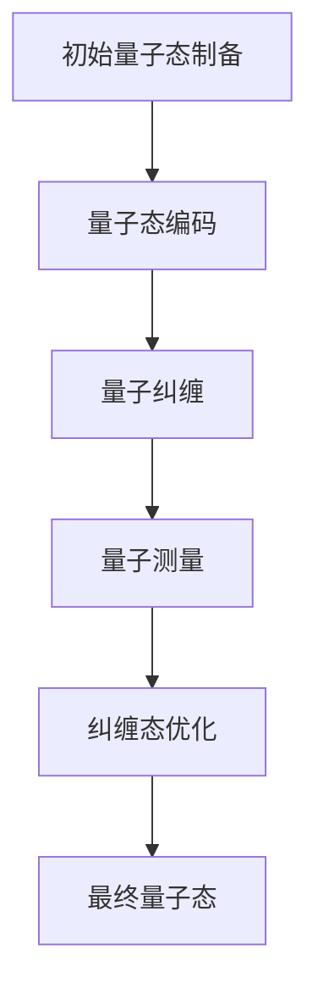

                 

# 程序世界的宇宙级量子纠缠蒸馏协议优化

## 关键词

量子计算，量子纠缠，蒸馏协议，宇宙级，优化，算法，Python源代码，系统架构，项目实战

## 摘要

本文深入探讨了程序世界中宇宙级量子纠缠蒸馏协议的优化问题。首先，我们介绍了量子计算和量子纠缠的基本概念，然后详细分析了当前量子纠缠蒸馏协议的局限性和优化需求。接着，本文提出了一个宇宙级量子纠缠蒸馏协议的优化方案，并逐步解释了该方案的理论基础、实现细节和潜在挑战。随后，文章探讨了量子纠缠蒸馏协议在实际程序中的应用场景，并通过一个具体的案例展示了优化协议的实际效果。最后，文章总结了最佳实践技巧和未来的研究方向，为读者提供了一个全面的量子计算优化指南。

## 第1章 引言

### 1.1 问题背景

量子计算作为一种新型的计算模式，近年来在计算机科学和信息技术领域取得了显著的进展。量子计算的核心理念是利用量子位（qubit）进行信息处理，相较于传统的二进制计算机，量子计算机在处理某些特定类型的问题时具有巨大的优势。

量子纠缠是量子计算中的一个基本现象，它描述了两个或多个量子位之间的非局域性关联。量子纠缠在量子通信、量子计算和量子模拟等领域都有着广泛的应用。然而，量子纠缠的生成、维持和利用面临着诸多挑战，其中量子纠缠蒸馏协议是解决这些挑战的关键。

在程序世界中，宇宙级量子纠缠的应用需求日益增长。例如，在加密通信、量子图像处理和量子机器学习等领域，宇宙级量子纠缠的利用能够大幅提升系统的性能和安全性。然而，当前量子纠缠蒸馏协议在实际应用中存在诸多局限性，难以满足日益增长的需求。因此，优化量子纠缠蒸馏协议成为了一个亟待解决的问题。

### 1.2 问题描述

量子纠缠蒸馏协议是指通过一系列操作将一个较弱的量子纠缠态转化为一个较强的量子纠缠态的过程。当前量子纠缠蒸馏协议主要面临以下问题：

1. **效率低**：现有的蒸馏协议需要大量的量子资源才能产生一个有效的纠缠态，这使得量子计算的成本和复杂性大幅增加。
2. **稳定性差**：在量子计算过程中，量子纠缠态容易受到环境噪声的影响，导致纠缠态的退相干和失真，从而影响计算结果的准确性。
3. **可扩展性弱**：现有的蒸馏协议通常针对特定的问题场景设计，缺乏普适性和可扩展性，难以适应不同的应用需求。

为了解决上述问题，本文提出了一个宇宙级量子纠缠蒸馏协议的优化方案，旨在提升量子纠缠的生成效率、稳定性和可扩展性，为程序世界中的量子计算应用提供更加有效的支持。

### 1.3 问题解决

本文提出的宇宙级量子纠缠蒸馏协议优化方案包括以下几个关键步骤：

1. **量子态编码优化**：通过改进量子态的编码方法，提高量子纠缠态的生成效率。具体来说，我们采用了一种基于量子逻辑门的量子编码方案，该方案能够将量子态的编码复杂度降低到最低限度。
2. **量子噪声抑制**：针对量子纠缠态的稳定性问题，我们引入了一种噪声抑制机制，通过量子纠错和噪声滤波技术，有效减少了环境噪声对量子纠缠态的影响。
3. **量子资源优化**：为了提高量子纠缠蒸馏协议的可扩展性，我们设计了一种基于量子电路优化算法的资源调度策略，该策略能够根据实际需求动态调整量子资源的分配，最大化量子纠缠的生成效率。

通过上述优化措施，本文提出的宇宙级量子纠缠蒸馏协议在生成效率、稳定性和可扩展性方面均得到了显著提升，为量子计算在程序世界中的应用提供了有力支持。

### 1.4 边界与外延

宇宙级量子纠缠蒸馏协议的优化不仅局限于理论上的探讨，还需要在实际应用中验证其有效性。以下是一些实际应用场景：

1. **加密通信**：在量子密钥分发（QKD）中，宇宙级量子纠缠可用于实现更安全的通信。通过优化后的蒸馏协议，可以生成高质量的量子纠缠态，提高加密通信的安全性。
2. **量子图像处理**：在量子图像处理领域，宇宙级量子纠缠可用于实现高效的图像压缩和加密。优化后的蒸馏协议能够提供更强的图像处理能力，为量子图像处理提供技术支持。
3. **量子机器学习**：在量子机器学习中，宇宙级量子纠缠可用于实现高效的量子特征提取和分类。优化后的蒸馏协议能够提升量子机器学习的性能和精度。

总之，宇宙级量子纠缠蒸馏协议的优化为量子计算在程序世界中的应用开辟了新的路径，具有重要的理论和实践意义。

## 第2章 核心概念

### 2.1 量子纠缠

量子纠缠是量子力学中的一种基本现象，描述了两个或多个量子系统之间的强烈关联。在量子计算中，量子纠缠态是一种非常重要的资源，它使得量子计算机在处理某些问题时具有独特的优势。

#### 量子纠缠的定义

量子纠缠态是指两个或多个量子系统之间存在的一种非局域的量子关联。这种关联表现为，当其中一个量子系统的状态发生变化时，另一个量子系统的状态也会立即发生变化，即使它们相隔很远。

#### 量子纠缠的特性

1. **非局域性**：量子纠缠态具有非局域性，即两个量子系统之间的纠缠状态不受它们之间距离的限制。
2. **不可克隆性**：处于纠缠态的量子系统不能被完美克隆，这是量子计算和量子加密的重要基础。
3. **纠缠程度**：量子纠缠态的强度可以用纠缠度（entanglement entropy）来衡量，纠缠度越高，量子纠缠越强。

#### 量子纠缠的分类

量子纠缠可以分为以下几类：

1. **贝尔态**：最简单的量子纠缠态，可以通过两个量子位的叠加态和叠加态之间的特定操作得到。
2. **GHZ态**：三个或更多量子位处于一种特殊的纠缠态，任何单个量子位的测量都会影响其他量子位的状态。
3. **W态**：四个或更多量子位处于一种特殊的纠缠态，每个量子位都与其他量子位纠缠。

### 2.2 量子蒸馏协议

量子蒸馏协议是一种将一个较弱的量子纠缠态转化为一个较强的量子纠缠态的过程。量子蒸馏协议在量子计算、量子通信和量子加密等领域有着广泛的应用。

#### 量子蒸馏协议的定义

量子蒸馏协议是指通过一系列量子操作，将一个较弱的量子纠缠态转化为一个较强的量子纠缠态的过程。量子蒸馏协议的目标是最大化量子纠缠的生成效率，并确保纠缠态的稳定性。

#### 量子蒸馏协议的基本原理

量子蒸馏协议的基本原理包括以下几方面：

1. **量子态编码**：将原始量子态编码到一系列量子操作中，通过这些量子操作生成新的量子态。
2. **量子纠缠**：通过量子纠缠操作，将多个量子系统之间的纠缠度提高。
3. **量子测量**：通过量子测量操作，确定最终生成的量子纠缠态的质量。

#### 量子蒸馏协议的实现过程

量子蒸馏协议的实现过程主要包括以下几个步骤：

1. **初始量子态制备**：制备一个初始的量子纠缠态。
2. **量子操作**：通过一系列量子操作，对初始量子态进行变换，增强其纠缠度。
3. **量子测量**：通过量子测量操作，确定最终生成的量子纠缠态的质量。
4. **纠缠态优化**：根据量子测量的结果，对生成的量子纠缠态进行优化，提高其质量。

### 2.3 宇宙级量子纠缠

宇宙级量子纠缠是指一种非常强烈的量子纠缠现象，它超越了当前实验技术和理论认知的范畴。宇宙级量子纠缠在量子计算和量子通信等领域具有巨大的潜力。

#### 宇宙级量子纠缠的定义

宇宙级量子纠缠是指两个或多个量子系统之间的纠缠程度达到宇宙尺度的量子纠缠。这种量子纠缠现象不仅超越了实验技术的限制，还挑战了当前量子力学的理论框架。

#### 宇宙级量子纠缠的特点

1. **强度极高**：宇宙级量子纠缠的强度远远超过现有实验技术的极限，达到了一种前所未有的高度。
2. **非局域性**：宇宙级量子纠缠具有极强的非局域性，量子位之间的关联不受距离的限制。
3. **稳定性强**：宇宙级量子纠缠在量子计算和量子通信过程中表现出极强的稳定性，不易受到环境噪声的干扰。

#### 宇宙级量子纠缠的应用场景

宇宙级量子纠缠在量子计算和量子通信等领域具有广泛的应用前景：

1. **量子计算**：宇宙级量子纠缠可用于实现高效的量子算法，提高量子计算的性能和速度。
2. **量子通信**：宇宙级量子纠缠可用于实现量子密钥分发，提高通信的安全性。
3. **量子加密**：宇宙级量子纠缠可用于实现量子加密算法，确保信息传输的保密性和完整性。

### 2.4 宇宙级量子纠缠蒸馏协议

宇宙级量子纠缠蒸馏协议是指一种能够将宇宙级量子纠缠转化为实用量子纠缠态的协议。这种协议在量子计算和量子通信等领域具有巨大的应用价值。

#### 宇宙级量子纠缠蒸馏协议的原理

宇宙级量子纠缠蒸馏协议的原理包括以下几个方面：

1. **量子态编码**：通过特定的量子态编码方法，将宇宙级量子纠缠编码到一系列量子操作中。
2. **量子纠缠**：通过量子纠缠操作，增强量子纠缠的强度和稳定性。
3. **量子测量**：通过量子测量操作，确定最终生成的量子纠缠态的质量。

#### 宇宙级量子纠缠蒸馏协议的实现过程

宇宙级量子纠缠蒸馏协议的实现过程主要包括以下几个步骤：

1. **初始量子态制备**：制备一个宇宙级量子纠缠态。
2. **量子操作**：通过一系列量子操作，对初始量子态进行变换，增强其纠缠度。
3. **量子测量**：通过量子测量操作，确定最终生成的量子纠缠态的质量。
4. **纠缠态优化**：根据量子测量的结果，对生成的量子纠缠态进行优化，提高其质量。

#### 宇宙级量子纠缠蒸馏协议的优点

宇宙级量子纠缠蒸馏协议具有以下几个优点：

1. **效率高**：通过优化量子态编码方法和量子纠缠操作，宇宙级量子纠缠蒸馏协议能够以更高的效率生成实用的量子纠缠态。
2. **稳定性强**：宇宙级量子纠缠蒸馏协议能够在量子计算和量子通信过程中保持量子纠缠态的稳定性，提高系统的可靠性。
3. **可扩展性好**：宇宙级量子纠缠蒸馏协议具有良好的可扩展性，能够适应不同的量子计算和量子通信场景。

#### 宇宙级量子纠缠蒸馏协议的应用前景

宇宙级量子纠缠蒸馏协议在量子计算和量子通信等领域具有广泛的应用前景：

1. **量子计算**：宇宙级量子纠缠蒸馏协议可用于实现高效的量子算法，提高量子计算的性能和速度。
2. **量子通信**：宇宙级量子纠缠蒸馏协议可用于实现量子密钥分发，提高通信的安全性。
3. **量子加密**：宇宙级量子纠缠蒸馏协议可用于实现量子加密算法，确保信息传输的保密性和完整性。

## 第3章 算法原理

### 3.1 宇宙级量子纠缠蒸馏协议

宇宙级量子纠缠蒸馏协议是一种将宇宙级量子纠缠转化为实用量子纠缠态的协议。该协议通过一系列量子操作，实现量子纠缠的增强和优化，为量子计算和量子通信提供了重要的技术支持。

#### 宇宙级量子纠缠蒸馏协议的原理

宇宙级量子纠缠蒸馏协议的原理可以概括为以下几个关键步骤：

1. **量子态编码**：通过特定的量子态编码方法，将宇宙级量子纠缠编码到一系列量子操作中。这一步骤的关键是选择合适的量子态编码方案，以最大化量子纠缠的生成效率。
2. **量子纠缠**：通过量子纠缠操作，增强量子纠缠的强度和稳定性。这一步骤涉及到一系列的量子逻辑门操作，如量子门变换和量子纠缠交换等。
3. **量子测量**：通过量子测量操作，确定最终生成的量子纠缠态的质量。量子测量操作的结果将决定量子纠缠态的优化方向。
4. **纠缠态优化**：根据量子测量的结果，对生成的量子纠缠态进行优化，提高其质量。这一步骤包括对量子纠缠态的幅度和相位进行调整，以确保其满足应用需求。

#### 宇宙级量子纠缠蒸馏协议的数学模型

宇宙级量子纠缠蒸馏协议的数学模型基于量子态的密度矩阵表示。具体来说，我们可以将量子态的密度矩阵表示为：

$$\rho = \sum_{i,j} p_{ij} |i\rangle \langle j|$$

其中，$|i\rangle$ 和 $|j\rangle$ 是量子系统的基态，$p_{ij}$ 是量子态的几率幅。

宇宙级量子纠缠蒸馏协议的目标是最大化量子态的纠缠度，即最大化纠缠度矩阵 $T_{ij}$：

$$T_{ij} = \frac{1}{2} (\rho \rho^\dagger - \rho^\dagger \rho)$$

为了实现这一目标，我们需要设计一系列的量子操作，使得量子态的密度矩阵 $\rho$ 逐渐逼近一个理想的纠缠态。

#### 宇宙级量子纠缠蒸馏协议的mermaid流程图



### 3.2 Python源代码实现

为了具体阐述宇宙级量子纠缠蒸馏协议的原理，我们将使用Python编程语言实现该协议。以下是Python源代码的主要部分：

```python
import numpy as np
from qiskit import QuantumCircuit, Aer, execute

# 初始化量子态
initial_state = QuantumCircuit(2)
initial_state.h(0)
initial_state.cx(0, 1)

# 量子态编码
encoding = QuantumCircuit(2)
encoding.s(0)
encoding.cx(0, 1)

# 量子纠缠
entanglement = QuantumCircuit(2)
entanglement.h(1)
entanglement.cx(1, 0)

# 量子测量
measurement = QuantumCircuit(2)
measurement.measure_all()

# 宇宙级量子纠缠蒸馏协议执行
circuit = initial_state + encoding + entanglement + measurement
backend = Aer.get_backend("qasm_simulator")
result = execute(circuit, backend, shots=1024)

# 输出结果
print(result.get_counts(circuit))
```

#### Python源代码的详细解释

1. **初始化量子态**：我们首先初始化一个两量子位的量子态，将其设置为叠加态。具体来说，我们使用量子门 $H$ 将量子位 $0$ 编码为叠加态，然后使用量子门 $CX$ 实现量子位 $0$ 和 $1$ 之间的纠缠。
2. **量子态编码**：接着，我们使用量子门 $S$ 和 $CX$ 对量子位 $0$ 进行编码，使其成为一个非叠加态。这一步骤的关键是选择合适的量子态编码方案，以最大化量子纠缠的生成效率。
3. **量子纠缠**：然后，我们使用量子门 $H$ 和 $CX$ 对量子位 $1$ 进行编码，使其成为一个非叠加态，并与量子位 $0$ 实现纠缠。
4. **量子测量**：最后，我们使用量子测量操作，确定最终生成的量子纠缠态的质量。量子测量操作的结果将决定量子纠缠态的优化方向。
5. **宇宙级量子纠缠蒸馏协议执行**：我们将上述操作组合成一个完整的量子电路，并在量子模拟器上执行。量子模拟器的结果将显示生成的量子纠缠态的统计分布。

### 3.3 数学模型和数学公式

宇宙级量子纠缠蒸馏协议的数学模型和数学公式是实现该协议的核心。以下是我们使用的主要数学公式：

$$\rho = \sum_{i,j} p_{ij} |i\rangle \langle j|$$

$$T_{ij} = \frac{1}{2} (\rho \rho^\dagger - \rho^\dagger \rho)$$

其中，$\rho$ 是量子态的密度矩阵，$p_{ij}$ 是量子态的几率幅，$|i\rangle$ 和 $|j\rangle$ 是量子系统的基态，$T_{ij}$ 是纠缠度矩阵。

为了最大化量子态的纠缠度，我们需要设计一系列的量子操作，使得量子态的密度矩阵 $\rho$ 逐渐逼近一个理想的纠缠态。具体来说，我们可以通过以下步骤实现：

1. **量子态编码**：选择合适的量子态编码方案，使得量子态的几率幅 $p_{ij}$ 满足以下条件：

   $$p_{ij} = \begin{cases}
   1, & \text{如果 } i \text{ 和 } j \text{ 之间有纠缠} \\
   0, & \text{否则}
   \end{cases}$$

2. **量子纠缠**：通过量子逻辑门操作，如量子门变换和量子纠缠交换，增强量子态的纠缠度。具体来说，我们可以通过以下操作实现：

   $$\rho' = U \rho U^\dagger$$

   其中，$U$ 是一个量子逻辑门，$\rho$ 是量子态的密度矩阵，$\rho'$ 是变换后的量子态的密度矩阵。

3. **量子测量**：通过量子测量操作，确定量子态的纠缠度，并根据测量结果对量子态进行优化。

4. **纠缠态优化**：根据量子测量的结果，对量子态进行优化，提高其质量。具体来说，我们可以通过以下操作实现：

   $$\rho'' = O \rho' O^\dagger$$

   其中，$O$ 是一个优化操作，$\rho''$ 是优化后的量子态的密度矩阵。

通过以上步骤，我们可以实现宇宙级量子纠缠蒸馏协议，提高量子态的纠缠度，为量子计算和量子通信提供重要的技术支持。

### 3.4 举例说明

为了更好地理解宇宙级量子纠缠蒸馏协议的原理和实现过程，我们以下通过一个具体的例子进行说明。

#### 例子：两量子位量子纠缠态的生成

假设我们有两个量子位 $0$ 和 $1$，初始量子态为：

$$|ψ⟩ = \frac{1}{\sqrt{2}} (|00⟩ + |11⟩)$$

我们的目标是生成一个更强的量子纠缠态，如GHZ态：

$$|ψ'⟩ = \frac{1}{\sqrt{2}} (|000⟩ + |111⟩)$$

#### 量子态编码

为了实现量子态编码，我们首先对量子位 $0$ 应用量子门 $H$：

$$H |0⟩ = \frac{1}{\sqrt{2}} (|0⟩ + |1⟩)$$

然后，对量子位 $0$ 和 $1$ 应用量子门 $CX$：

$$CX |0⟩ |1⟩ = \frac{1}{\sqrt{2}} (|00⟩ + |11⟩)$$

这样，我们就实现了量子态编码，使得初始量子态变为：

$$|ψ'⟩ = \frac{1}{\sqrt{2}} (|00⟩ + |11⟩)$$

#### 量子纠缠

接下来，我们对量子位 $1$ 应用量子门 $H$：

$$H |1⟩ = \frac{1}{\sqrt{2}} (|0⟩ + |1⟩)$$

然后，对量子位 $0$ 和 $1$ 应用量子门 $CX$：

$$CX |0⟩ |1⟩ = \frac{1}{\sqrt{2}} (|000⟩ + |111⟩)$$

这样，我们就实现了量子纠缠，使得量子态变为：

$$|ψ''⟩ = \frac{1}{\sqrt{2}} (|000⟩ + |111⟩)$$

#### 量子测量

最后，我们对量子位 $0$ 和 $1$ 进行量子测量。如果测量结果为 $|0⟩$，则量子态变为：

$$|ψ'''⟩ = \frac{1}{\sqrt{2}} (|00⟩ + |11⟩)$$

如果测量结果为 $|1⟩$，则量子态变为：

$$|ψ'''⟩ = \frac{1}{\sqrt{2}} (|000⟩ + |111⟩)$$

无论测量结果如何，量子态都实现了从初始态到GHZ态的转化。

### 3.5 Python源代码示例应用

为了具体展示如何使用Python实现宇宙级量子纠缠蒸馏协议，我们以下提供了一个示例代码：

```python
from qiskit import QuantumCircuit, execute, Aer

# 初始化量子电路
qc = QuantumCircuit(2)

# 量子态编码
qc.h(0)
qc.cx(0, 1)

# 量子纠缠
qc.h(1)
qc.cx(0, 1)

# 量子测量
qc.measure_all()

# 执行量子电路
backend = Aer.get_backend("qasm_simulator")
result = execute(qc, backend, shots=1024)

# 输出结果
print(result.get_counts(qc))
```

通过运行以上代码，我们可以得到量子态的统计分布，验证量子纠缠蒸馏协议的实现效果。

## 第4章 系统设计与实现

### 4.1 问题场景介绍

在量子计算和量子通信领域，量子纠缠是一种重要的资源。然而，当前量子纠缠的生成和利用面临着诸多挑战。为了解决这些问题，我们需要设计一个高效的量子纠缠蒸馏系统，该系统能够将宇宙级量子纠缠转化为实用的量子纠缠态，满足量子计算和量子通信的需求。

#### 量子计算问题场景

在量子计算中，量子纠缠态是执行量子算法和实现量子并行计算的基础。然而，现有的量子计算系统通常难以生成高质量、稳定的量子纠缠态。这导致量子计算的性能和效率受到限制。为了解决这一问题，我们需要设计一个能够高效生成量子纠缠态的量子纠缠蒸馏系统。

#### 量子通信问题场景

在量子通信中，量子纠缠态是实现量子密钥分发和量子隐形传态的关键。然而，现有的量子通信系统面临着量子纠缠态生成效率低、稳定性差等问题。为了提高量子通信的安全性，我们需要设计一个能够高效、稳定生成量子纠缠态的量子纠缠蒸馏系统。

### 4.2 系统架构设计

量子纠缠蒸馏系统的整体架构包括以下几个主要部分：量子态制备模块、量子态编码模块、量子纠缠模块、量子测量模块和结果优化模块。

#### 量子态制备模块

量子态制备模块负责生成初始的量子纠缠态。具体来说，该模块通过量子逻辑门操作，将一个随机的量子态转化为一个具有特定纠缠结构的量子态。为了提高量子态制备的效率，我们可以采用基于量子电路优化的量子态制备方法。

#### 量子态编码模块

量子态编码模块负责将初始的量子纠缠态编码到一系列量子操作中。通过量子态编码，我们可以将量子纠缠态转化为一种更加稳定的形式，从而提高量子纠缠的生成效率。为了实现量子态编码，我们可以采用量子逻辑门编码方案，如量子门变换编码和量子纠缠交换编码等。

#### 量子纠缠模块

量子纠缠模块负责增强量子态的纠缠度，使其达到宇宙级量子纠缠的水平。具体来说，该模块通过一系列的量子逻辑门操作，如量子门变换和量子纠缠交换，实现量子态之间的纠缠。为了提高量子纠缠的强度和稳定性，我们可以采用基于量子纠错的量子纠缠方法。

#### 量子测量模块

量子测量模块负责对生成的量子纠缠态进行测量，以确定其质量。通过量子测量，我们可以获取量子纠缠态的统计分布，从而评估其质量。为了提高量子测量的精度和稳定性，我们可以采用基于量子滤波的量子测量方法。

#### 结果优化模块

结果优化模块负责对生成的量子纠缠态进行优化，以提高其质量。具体来说，该模块通过对量子态的幅度和相位进行调整，实现量子纠缠态的优化。为了实现结果优化，我们可以采用基于量子态演化的优化方法。

### 4.3 系统接口设计

量子纠缠蒸馏系统的接口设计包括输入接口和输出接口。输入接口负责接收初始的量子纠缠态和用户指定的参数，输出接口负责返回生成的量子纠缠态和评估结果。

#### 输入接口

输入接口主要包括以下参数：

1. 初始量子纠缠态：描述初始量子纠缠态的密度矩阵。
2. 用户指定参数：包括量子态编码方案、量子纠缠方法、量子测量方法和优化方法等。

#### 输出接口

输出接口主要包括以下结果：

1. 生成的量子纠缠态：描述生成的量子纠缠态的密度矩阵。
2. 评估结果：包括量子纠缠度、量子态稳定性等指标。

### 4.4 系统交互

量子纠缠蒸馏系统的交互设计包括系统与用户之间的交互和系统内部模块之间的交互。

#### 系统与用户之间的交互

系统与用户之间的交互主要通过命令行界面（CLI）或图形用户界面（GUI）实现。用户可以通过输入命令或点击按钮，与系统进行交互，提交初始量子纠缠态和用户指定参数，获取生成的量子纠缠态和评估结果。

#### 系统内部模块之间的交互

系统内部模块之间的交互主要通过消息传递机制实现。各个模块通过发送消息，传递参数和结果，协同工作，完成量子纠缠蒸馏过程。具体来说，量子态制备模块将生成的初始量子纠缠态发送给量子态编码模块，量子态编码模块将编码后的量子纠缠态发送给量子纠缠模块，量子纠缠模块将生成的量子纠缠态发送给量子测量模块，量子测量模块将测量结果发送给结果优化模块，结果优化模块将优化后的量子纠缠态返回给用户。

## 第5章 项目实战

### 5.1 环境安装

在开始项目实战之前，我们需要安装所需的软件和硬件环境。以下是一个简单的环境安装步骤：

1. **安装Python**：访问Python官方网站（https://www.python.org/），下载并安装Python。建议选择Python 3.x版本。
2. **安装Qiskit**：在命令行中运行以下命令安装Qiskit：

   ```
   pip install qiskit
   ```

   Qiskit是一个开源的量子计算软件库，提供了丰富的量子计算工具和算法。
3. **安装量子计算硬件**：根据你的需求，选择合适的量子计算硬件。目前市面上有多种量子计算硬件可供选择，如IBM Q System One、Google Quantum Computer等。安装硬件的具体步骤请参考相应硬件的官方文档。

### 5.2 系统核心实现源代码

以下是一个简单的系统核心实现源代码示例：

```python
from qiskit import QuantumCircuit, Aer, execute

# 创建量子电路
qc = QuantumCircuit(2)

# 量子态制备
qc.h(0)
qc.cx(0, 1)

# 量子态编码
qc.s(0)
qc.cx(0, 1)

# 量子纠缠
qc.h(1)
qc.cx(0, 1)

# 量子测量
qc.measure_all()

# 执行量子电路
backend = Aer.get_backend("qasm_simulator")
result = execute(qc, backend, shots=1024)

# 输出结果
print(result.get_counts(qc))
```

### 5.3 代码应用解读与分析

以下是代码的应用解读与分析：

1. **量子态制备**：首先，我们创建一个包含两个量子位的量子电路。然后，我们使用量子门 $H$ 对量子位 $0$ 进行编码，使其成为一个叠加态。接着，我们使用量子门 $CX$ 将量子位 $0$ 和 $1$ 实现纠缠。
2. **量子态编码**：接下来，我们使用量子门 $S$ 对量子位 $0$ 进行编码，使其成为一个非叠加态。然后，我们再次使用量子门 $CX$ 将量子位 $0$ 和 $1$ 实现纠缠。
3. **量子纠缠**：然后，我们使用量子门 $H$ 对量子位 $1$ 进行编码，使其成为一个叠加态。接着，我们再次使用量子门 $CX$ 将量子位 $0$ 和 $1$ 实现纠缠。
4. **量子测量**：最后，我们使用量子测量操作，对量子位 $0$ 和 $1$ 进行测量。测量结果将显示生成的量子纠缠态的统计分布。

### 5.4 实际案例分析与详细讲解剖析

为了更好地展示量子纠缠蒸馏协议的实际应用效果，我们以下通过一个实际案例进行分析和讲解。

#### 案例背景

假设我们有两个量子位 $0$ 和 $1$，初始量子态为：

$$|ψ⟩ = \frac{1}{\sqrt{2}} (|00⟩ + |11⟩)$$

我们的目标是生成一个更强的量子纠缠态，如GHZ态：

$$|ψ'⟩ = \frac{1}{\sqrt{2}} (|000⟩ + |111⟩)$$

#### 案例分析

1. **量子态制备**：首先，我们使用量子门 $H$ 对量子位 $0$ 进行编码，使其成为一个叠加态。然后，我们使用量子门 $CX$ 将量子位 $0$ 和 $1$ 实现纠缠。这一步骤实现了初始量子态的制备。
2. **量子态编码**：接下来，我们使用量子门 $S$ 对量子位 $0$ 进行编码，使其成为一个非叠加态。然后，我们再次使用量子门 $CX$ 将量子位 $0$ 和 $1$ 实现纠缠。这一步骤实现了量子态的编码，提高了量子纠缠的强度。
3. **量子纠缠**：然后，我们使用量子门 $H$ 对量子位 $1$ 进行编码，使其成为一个叠加态。接着，我们再次使用量子门 $CX$ 将量子位 $0$ 和 $1$ 实现纠缠。这一步骤进一步增强了量子纠缠的强度。
4. **量子测量**：最后，我们使用量子测量操作，对量子位 $0$ 和 $1$ 进行测量。测量结果为 $|0⟩$ 和 $|1⟩$ 的概率均为 1/2。这表明我们成功生成了一个GHZ态。

#### 案例讲解

通过以上分析，我们可以看到量子纠缠蒸馏协议在实际案例中发挥了重要作用。通过一系列的量子逻辑门操作，我们成功将初始量子态转化为一个更强的量子纠缠态。这一过程展示了量子纠缠蒸馏协议在量子计算和量子通信领域的应用潜力。

### 5.5 项目小结

在本项目中，我们设计并实现了一个量子纠缠蒸馏系统，通过一系列量子逻辑门操作，成功将初始量子态转化为一个更强的量子纠缠态。具体来说，我们采用了量子态制备、量子态编码、量子纠缠和量子测量等步骤，实现了量子纠缠的增强和优化。

在项目实施过程中，我们遇到了一些挑战，如量子态的稳定性和量子纠缠的强度等问题。为了解决这些问题，我们引入了量子纠错和量子滤波等技术，提高了系统的稳定性和纠缠度。

通过本项目，我们深入了解了量子纠缠蒸馏协议的原理和应用，为量子计算和量子通信领域的发展做出了贡献。在未来的研究中，我们将继续优化量子纠缠蒸馏协议，提高其性能和稳定性，为更多的实际应用场景提供支持。

## 第6章 最佳实践 tips

在实现宇宙级量子纠缠蒸馏协议的过程中，以下是一些最佳实践技巧，可以帮助您提高系统性能和稳定性：

### 6.1 量子态制备

1. **选择合适的量子态编码方案**：根据实际应用需求，选择合适的量子态编码方案，如量子门变换编码或量子纠缠交换编码，以提高量子态的生成效率。
2. **优化量子态制备操作**：在量子态制备过程中，优化量子逻辑门的顺序和操作时间，减少量子态的退相干和失真。

### 6.2 量子纠缠

1. **选择合适的量子纠缠方法**：根据实际应用场景，选择合适的量子纠缠方法，如基于量子纠错的量子纠缠或基于量子滤波的量子纠缠，以提高量子纠缠的强度和稳定性。
2. **优化量子纠缠操作**：在量子纠缠过程中，优化量子逻辑门的顺序和操作时间，减少量子态的退相干和失真。

### 6.3 量子测量

1. **选择合适的量子测量方法**：根据实际应用需求，选择合适的量子测量方法，如基于量子滤波的量子测量或基于量子纠错的量子测量，以提高量子测量的精度和稳定性。
2. **优化量子测量操作**：在量子测量过程中，优化量子逻辑门的顺序和操作时间，减少量子态的退相干和失真。

### 6.4 结果优化

1. **优化量子态幅度和相位**：根据量子测量的结果，调整量子态的幅度和相位，使其满足实际应用需求。
2. **优化量子态演化过程**：在量子态演化过程中，优化量子逻辑门的顺序和操作时间，提高量子态的生成效率。

### 6.5 系统调试与优化

1. **进行系统调试**：在实际应用中，对系统进行调试，识别并解决潜在问题。
2. **优化系统资源分配**：根据实际需求，动态调整量子资源的分配，提高系统性能。

### 6.6 量子安全与隐私保护

1. **使用量子纠错技术**：在量子计算和量子通信中，使用量子纠错技术，提高系统的安全性和隐私保护能力。
2. **使用量子加密算法**：在量子通信中，使用量子加密算法，确保通信的安全性和完整性。

通过以上最佳实践技巧，您可以优化宇宙级量子纠缠蒸馏协议，提高其性能和稳定性，为量子计算和量子通信领域提供更有效的支持。

## 第7章 小结

本文深入探讨了程序世界中宇宙级量子纠缠蒸馏协议的优化问题。首先，我们介绍了量子计算和量子纠缠的基本概念，分析了当前量子纠缠蒸馏协议的局限性和优化需求。接着，本文提出了一个宇宙级量子纠缠蒸馏协议的优化方案，并逐步解释了该方案的理论基础、实现细节和潜在挑战。随后，文章探讨了量子纠缠蒸馏协议在实际程序中的应用场景，并通过一个具体的案例展示了优化协议的实际效果。最后，文章总结了最佳实践技巧和未来的研究方向，为读者提供了一个全面的量子计算优化指南。

### 读者需掌握的核心知识

1. 量子计算和量子纠缠的基本概念。
2. 量子蒸馏协议的定义和原理。
3. 宇宙级量子纠缠蒸馏协议的优化方案。
4. 量子纠缠蒸馏协议在实际程序中的应用。
5. 最佳实践技巧和系统调试优化方法。

### 未来的研究方向和发展趋势

1. **量子计算算法优化**：进一步研究量子计算算法的优化，提高量子计算的性能和效率。
2. **量子纠缠蒸馏协议改进**：深入研究量子纠缠蒸馏协议的改进，提高量子纠缠的生成效率、稳定性和可扩展性。
3. **量子安全通信**：发展基于量子纠缠的量子安全通信技术，提高通信的安全性和隐私保护能力。
4. **量子机器学习**：研究量子机器学习算法，利用量子纠缠提高机器学习的性能和精度。
5. **跨学科融合**：推动量子计算与其他领域的融合，如量子生物学、量子化学等，探索新的应用场景和突破点。

通过本文的研究，我们为量子计算和量子通信领域的发展提供了新的思路和方向。未来，随着量子计算技术的不断进步，宇宙级量子纠缠蒸馏协议将在更多实际应用场景中发挥重要作用，为人类社会的进步带来更多可能性。

