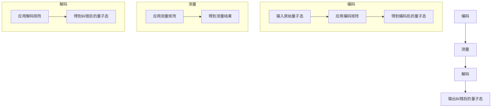

                 

### 引言

在计算机科学和信息技术飞速发展的今天，量子计算作为一种革命性的计算方式，正逐渐从理论走向实际应用。量子计算以其独特的量子比特（qubit）和叠加、纠缠等特性，为处理复杂问题提供了前所未有的强大能力。然而，量子计算也面临着一系列挑战，其中量子纠错问题尤为关键。

量子纠错机制是量子计算中确保信息准确传递和处理的核心技术。它旨在解决量子计算过程中不可避免的量子退相干和噪声问题，从而提高量子计算的可靠性和稳定性。量子纠错机制不仅对量子计算机的性能有着决定性的影响，还在量子通信、量子加密等领域具有广泛的应用前景。

本文将深入探讨量子纠错机制在程序世界中的重要性、基本原理、算法及其在程序中的应用，帮助读者全面了解这一宇宙级技术。我们将分步骤地分析量子纠错的各个方面，从量子力学的背景知识，到量子纠错的数学模型和算法，再到量子纠错在程序中的应用实例，力求让读者在掌握这一技术的同时，也能够深刻理解其背后的原理和本质。

### 目录大纲设计思路

为了设计出《程序世界的宇宙级量子纠错机制》这本书的完整目录大纲，我们需要遵循以下几个步骤：

1. **确定核心内容模块**：根据书名和计算机技术书籍的特点，我们需要先确定书中将涵盖的核心内容模块。这些模块将作为目录大纲的主要章节。

2. **细化每个模块**：对每个核心内容模块进行细化，拆分成若干子章节。确保每个子章节都能为读者提供有价值的信息。

3. **遵循目录结构**：按照 1, 2, 3 级目录的层次结构来设计，使目录清晰、易读。

4. **包含必要内容**：确保每个章节都包含了必要的背景介绍、核心概念、算法原理讲解、数学模型和公式、系统分析与架构设计方案、项目实战等内容。

5. **控制总字数**：在2000字内完成整个目录大纲的设计。

### 第一步：确定核心内容模块

根据书名，《程序世界的宇宙级量子纠错机制》，我们可以确定以下核心内容模块：

- 引言
- 第1章：量子纠错机制概述
- 第2章：量子纠错的物理背景
- 第3章：量子纠错的基本原理
- 第4章：量子纠错算法
- 第5章：量子纠错在程序中的应用
- 第6章：量子纠错机制的优缺点分析
- 第7章：量子纠错机制的未来发展

### 第二步：细化每个模块

下面是对每个模块的细化，构建出具体的目录大纲：

```markdown
----------------------------------------------------------------
# 引言
## 引言
### 书籍目的
### 目标读者
### 内容概述

----------------------------------------------------------------

# 第1章：量子纠错机制概述
## 1.1 量子纠错机制的定义
### 1.1.1 量子纠错的背景
### 1.1.2 量子纠错的重要性
### 1.1.3 量子纠错的应用场景

## 1.2 量子纠错的分类
### 1.2.1 量子冗余纠错
### 1.2.2 量子低密度奇偶校验码
### 1.2.3 量子置信传播码

## 1.3 量子纠错的挑战与机遇
### 1.3.1 量子纠错的挑战
### 1.3.2 量子纠错的机遇
### 1.3.3 量子纠错的发展趋势

----------------------------------------------------------------

# 第2章：量子纠错的物理背景
## 2.1 量子力学基础
### 2.1.1 量子比特
### 2.1.2 量子叠加与量子纠缠
### 2.1.3 量子态的测量

## 2.2 量子退相干
### 2.2.1 量子退相干的定义
### 2.2.2 量子退相干的原因
### 2.2.3 量子退相干的影响

## 2.3 量子纠错的物理机制
### 2.3.1 冗余编码
### 2.3.2 纠错编码
### 2.3.3 量子纠错操作

----------------------------------------------------------------

# 第3章：量子纠错的基本原理
## 3.1 量子纠错的基本概念
### 3.1.1 量子纠错的定义
### 3.1.2 量子纠错的性质
### 3.1.3 量子纠错的分类

## 3.2 量子纠错的数学模型
### 3.2.1 量子纠错的数学框架
### 3.2.2 量子纠错的数学公式
### 3.2.3 量子纠错的数学证明

## 3.3 量子纠错的实现机制
### 3.3.1 量子纠错的物理实现
### 3.3.2 量子纠错的算法实现
### 3.3.3 量子纠错的编程实现

----------------------------------------------------------------

# 第4章：量子纠错算法
## 4.1 量子冗余纠错算法
### 4.1.1 量子冗余纠错算法的原理
### 4.1.2 量子冗余纠错算法的步骤
### 4.1.3 量子冗余纠错算法的应用

## 4.2 量子低密度奇偶校验码
### 4.2.1 量子低密度奇偶校验码的原理
### 4.2.2 量子低密度奇偶校验码的分类
### 4.2.3 量子低密度奇偶校验码的应用

## 4.3 量子置信传播码
### 4.3.1 量子置信传播码的原理
### 4.3.2 量子置信传播码的算法
### 4.3.3 量子置信传播码的应用

----------------------------------------------------------------


----------------------------------------------------------------

### 1.1.1 量子纠错的背景

量子纠错机制的起源可以追溯到量子计算的基本特性。量子计算利用量子比特（qubit）的叠加态和纠缠态来处理信息，这种处理方式相对于经典计算具有巨大的并行计算能力。然而，量子比特在实际操作中极易受到外部环境的影响，产生量子退相干现象，从而导致计算结果的误差。

量子退相干是量子计算机面临的最大挑战之一。当量子比特处于叠加态时，外部环境或操作过程中的任何干扰都可能破坏这种叠加状态，使得量子计算过程无法精确进行。这种退相干效应使得量子计算中的错误概率极高，严重限制了量子计算机的性能和可靠性。

为了克服量子退相干带来的挑战，科学家们提出了量子纠错机制。量子纠错机制通过引入冗余编码和纠错算法，在计算过程中对量子比特进行保护和修复，从而降低错误率，提高量子计算的可靠性和稳定性。

量子纠错机制的研究始于20世纪90年代，随着量子计算理论和实验技术的发展，量子纠错技术逐渐成熟。目前，已经提出了多种量子纠错算法和编码方法，包括量子冗余纠错、量子低密度奇偶校验码和量子置信传播码等。这些算法和方法的提出，不仅为量子计算提供了有效的纠错手段，也为量子计算机的实用化奠定了基础。

量子纠错机制的重要性不仅体现在量子计算中，还扩展到了量子通信、量子加密等领域。在量子通信中，量子纠错机制可以确保量子信息的准确传递，提高通信的可靠性。在量子加密中，量子纠错机制可以增强加密算法的强度，防止量子攻击。

总之，量子纠错机制是量子计算领域中的一项重要技术，其发展和应用将推动量子计算技术的进步，为解决复杂计算问题提供新的手段。在接下来的章节中，我们将详细探讨量子纠错的物理背景、基本原理和算法，帮助读者深入理解这一宇宙级量子技术。

### 1.1.2 量子纠错的重要性

量子纠错机制在量子计算中扮演着至关重要的角色。首先，量子纠错是确保量子计算机正常运行的核心保障。由于量子比特极易受到外界环境的干扰，量子计算过程中的错误率极高。如果没有有效的纠错机制，即使是最简单的量子计算任务也可能因为错误率过高而无法完成。量子纠错通过在计算过程中引入冗余信息，检测并修复错误，从而大大降低了错误率，提高了量子计算的可靠性。

其次，量子纠错机制是量子计算机实用化的关键。量子计算机的潜在优势在于其巨大的并行计算能力，但要实现这一优势，量子计算机必须具备高度的可靠性和稳定性。量子纠错技术是实现这一目标的关键手段。只有通过量子纠错，才能确保量子计算机在各种复杂应用场景下稳定运行，从而充分发挥其计算潜力。

量子纠错机制的重要性不仅体现在量子计算本身，还扩展到了量子通信和量子加密等领域。在量子通信中，量子纠错机制可以确保量子信息的准确传递。量子通信通常使用量子纠缠来实现信息的传输，而量子纠缠易受噪声和干扰的影响。量子纠错通过检测和纠正这些错误，提高了量子通信的可靠性和数据传输速率。在量子加密中，量子纠错机制可以增强加密算法的强度。量子加密利用量子比特的叠加态和纠缠态实现高度安全的加密，但量子攻击能够通过量子计算的优势破解传统加密算法。量子纠错机制可以降低量子计算中错误的概率，提高加密算法的防攻击能力。

此外，量子纠错机制还具有重要的理论价值。通过研究和开发量子纠错算法，科学家们可以深入理解量子计算的本质，探索量子信息处理的极限。量子纠错机制的研究不仅推动了量子计算技术的进步，也为量子力学和信息理论的发展提供了新的思路和启示。

总之，量子纠错机制是量子计算领域中不可或缺的重要组成部分。它不仅提高了量子计算机的可靠性，还为量子通信和量子加密等应用领域提供了强有力的技术支持。随着量子计算技术的不断发展和应用，量子纠错机制的重要性将更加凸显，成为推动整个量子信息科技领域向前发展的重要引擎。

### 1.1.3 量子纠错的应用场景

量子纠错机制在量子计算、量子通信和量子加密等领域有着广泛的应用场景，其重要性不容忽视。

首先，量子计算是量子纠错机制最直接的应用场景。量子计算机通过量子比特进行信息处理，而量子比特极易受到外界干扰，导致计算过程中出现错误。量子纠错机制通过引入冗余信息和纠错算法，在计算过程中对量子比特进行保护和修复，从而降低错误率，提高量子计算机的可靠性。例如，量子纠错机制可以在量子电路执行过程中检测并纠正错误，确保最终计算结果准确无误。此外，量子纠错技术还可以用于量子算法优化，提高量子计算机的计算效率。

其次，量子通信是量子纠错机制的另一个重要应用领域。量子通信利用量子纠缠实现信息的传递，但量子纠缠过程同样容易受到噪声和干扰的影响。量子纠错机制通过检测和纠正量子通信过程中的错误，确保量子信息的准确传递。例如，在量子密钥分发（QKD）中，量子纠错技术可以检测并修复量子密钥传输过程中的错误，提高密钥分发的安全性。此外，量子纠错机制还可以用于量子中继，延长量子通信的距离，提高通信的稳定性。

最后，量子加密也是量子纠错机制的重要应用场景。量子加密利用量子比特的叠加态和纠缠态实现高度安全的加密，但量子攻击可以通过量子计算的优势破解传统加密算法。量子纠错机制可以降低量子计算中错误的概率，提高加密算法的防攻击能力。例如，在量子密码学中，量子纠错技术可以检测并纠正加密过程中的错误，确保密文的安全性。此外，量子纠错机制还可以用于量子密钥生成，提高密钥生成的可靠性。

总之，量子纠错机制在量子计算、量子通信和量子加密等领域的应用场景十分广泛。通过量子纠错机制，可以显著提高量子技术的可靠性和安全性，推动量子科技的发展和应用。随着量子技术的不断进步，量子纠错机制的重要性将日益凸显。

### 1.2 量子纠错的分类

量子纠错机制可以根据其实现方式和理论基础分为多种类型，每种类型都有其独特的特点和适用场景。以下是几种主要的量子纠错分类：

#### 1.2.1 量子冗余纠错

量子冗余纠错是最常见的量子纠错机制之一，其核心思想是通过增加冗余信息来检测和纠正错误。具体来说，量子冗余纠错通过将量子信息分布在多个量子比特上，使得即使部分量子比特发生错误，整个量子信息仍能被正确恢复。这种方法类似于经典计算中的冗余编码，但具有量子特性。

量子冗余纠错主要包括以下几种类型：

- **局域冗余纠错**：仅涉及局部量子比特的冗余编码，适合在低噪声环境下应用。
- **全局冗余纠错**：涉及整个量子系统的冗余编码，适用于高噪声环境。
- **表面码**：一种特殊的量子冗余纠错方法，通过在二维量子表面上进行编码，具有较高的纠错能力。

#### 1.2.2 量子低密度奇偶校验码（LDPC码）

量子低密度奇偶校验码（Low-Density Parity-Check Codes，LDPC码）是一种基于图论理论的量子纠错码。LDPC码通过构造一个稀疏的奇偶校验矩阵，使得错误检测和纠正过程更加高效。量子LDPC码具有如下特点：

- **高效纠错**：LDPC码能够有效纠正大量随机错误，适合于高噪声环境。
- **可扩展性**：LDPC码的纠错性能随着编码长度的增加而提高，适用于大规模量子计算。

#### 1.2.3 量子置信传播码

量子置信传播码（Quantum Belief Propagation，QBP）是基于概率图模型的一种量子纠错算法。QBP通过在量子比特之间传递概率信息来纠正错误，其核心思想类似于经典计算中的置信传播算法。

量子置信传播码具有以下特点：

- **高效性**：QBP算法在纠正量子错误时具有较高的计算效率。
- **适应性**：QBP能够自适应地调整参数，以适应不同的量子噪声环境。

#### 1.2.4 量子冗余纠错与量子LDPC码的结合

量子冗余纠错和量子LDPC码结合的方法是当前研究的热点之一。通过将量子冗余纠错与LDPC码相结合，可以在提高纠错能力的同时，降低纠错复杂度。这种方法在处理复杂量子噪声环境时具有显著优势。

总之，量子纠错的分类多种多样，每种方法都有其独特的优点和适用场景。通过结合不同类型的量子纠错机制，可以构建出更加高效和可靠的量子计算系统。

### 1.3 量子纠错的挑战与机遇

量子纠错机制在量子计算领域面临诸多挑战，同时也蕴含着巨大的机遇。以下将详细探讨量子纠错的挑战与机遇。

#### 1.3.1 量子纠错的挑战

1. **量子退相干**：量子退相干是量子计算中最大的挑战之一。量子退相干是指量子系统在外界环境干扰下，量子态的叠加和纠缠性质逐渐丧失的过程。量子退相干会导致量子计算过程中的错误，使得量子计算机无法稳定运行。

2. **纠错复杂度**：量子纠错的复杂度随着量子比特数量的增加而急剧上升。对于大规模量子计算机，实现高效、可靠的量子纠错机制是一个巨大的挑战。量子纠错算法的复杂度和性能直接影响量子计算机的实用性。

3. **物理实现**：量子纠错机制需要高精度的量子操作和测量技术支持。当前量子技术的物理实现仍存在诸多限制，如量子比特的精度、操作速度和稳定性等。这些技术难题限制了量子纠错机制的实用化进程。

4. **量子噪声**：量子噪声是量子计算中另一个重要挑战。量子噪声包括环境噪声和操作噪声，这些噪声会干扰量子计算过程，导致计算结果错误。量子纠错机制需要有效处理这些噪声，以确保计算结果的准确性。

#### 1.3.2 量子纠错的机遇

1. **量子计算的优势**：量子纠错机制可以克服量子退相干和量子噪声等挑战，确保量子计算机的稳定性和可靠性。量子计算机在处理复杂问题时具有巨大的并行计算能力，这为量子纠错机制提供了广阔的应用前景。

2. **量子纠错算法的创新**：随着量子计算理论和技术的发展，新的量子纠错算法不断涌现。例如，量子LDPC码、量子置信传播码等新型量子纠错算法的出现，为解决量子纠错难题提供了新的思路和手段。

3. **跨学科研究**：量子纠错机制涉及量子力学、计算机科学、信息理论等多个学科。跨学科合作有助于整合各领域的优势，推动量子纠错技术的发展。

4. **量子计算的实际应用**：量子纠错机制是实现量子计算机实用化的关键。在量子通信、量子加密、量子模拟等领域，量子纠错技术的应用将显著提升系统的性能和安全性。

总之，量子纠错机制在量子计算领域既面临诸多挑战，又充满机遇。通过克服这些挑战，利用量子纠错机制的独特优势，我们可以期待量子计算在未来实现突破性进展。

### 1.3.1 量子纠错的挑战

量子纠错机制在量子计算领域面临诸多挑战，这些问题直接关系到量子计算机的实际应用和性能。以下是量子纠错面临的主要挑战：

#### 量子退相干

量子退相干是量子纠错的首要挑战。量子退相干是指量子系统在外界干扰下，其量子态的叠加和纠缠性质逐渐丧失的过程。退相干会导致量子计算过程中的错误，从而影响计算结果的准确性。量子比特（qubit）由于其脆弱的量子态，特别容易受到外部环境的影响，如温度、磁场、电场等。任何微小的干扰都可能导致量子比特的量子态发生改变，进而影响整个量子计算过程。

量子退相干的具体表现包括：

- **环境诱导的退相干**：量子系统与外部环境发生相互作用，导致量子态的崩溃或失相干。
- **操作诱导的退相干**：量子操作过程中，量子态的精度和稳定性不足，导致量子态发生错误。
- **量子比特间的退相干**：量子比特之间的纠缠态容易受到外部干扰，导致整个量子系统的相干性下降。

#### 纠错复杂度

量子纠错的复杂度是一个巨大的挑战。量子纠错算法需要处理大量的量子比特，并且要确保在有限的资源内高效地检测和纠正错误。随着量子比特数量的增加，量子纠错的复杂度呈指数级增长。这是因为每一个量子比特的错误都可能影响到整个量子系统的稳定性。

具体来说，量子纠错复杂度的挑战包括：

- **计算复杂度**：量子纠错算法的计算复杂度非常高，随着量子比特数量的增加，所需计算资源呈指数级增长。
- **存储复杂度**：为了实现量子纠错，需要存储大量的冗余信息，这会占用大量的存储资源。
- **时间复杂度**：量子纠错算法需要花费大量时间进行错误检测和纠正，这限制了量子计算机的处理速度。

#### 物理实现

量子纠错机制的物理实现面临诸多技术挑战。量子比特的精度、操作速度和稳定性是物理实现的关键因素。

- **量子比特的精度**：量子比特的精度越高，量子计算的结果越准确。然而，目前的量子比特技术尚未达到高精度的要求，这限制了量子纠错机制的实际应用。
- **量子比特的操作速度**：量子比特的操作速度需要足够快，以适应高速的量子计算过程。目前，量子比特的操作速度仍存在瓶颈，影响了量子纠错机制的有效性。
- **量子比特的稳定性**：量子比特的稳定性直接影响量子纠错的性能。量子比特在外部干扰下容易失相干，这需要通过先进的量子纠错技术来保证其稳定性。

#### 量子噪声

量子噪声是量子纠错的另一个重要挑战。量子噪声包括环境噪声和操作噪声，这些噪声会对量子计算过程产生干扰，导致计算结果错误。量子噪声的类型包括：

- **环境噪声**：量子系统与外部环境发生相互作用，导致量子态的变化。
- **操作噪声**：量子操作过程中，量子比特的状态受到干扰，导致量子态发生错误。
- **量子比特间的噪声**：量子比特之间的纠缠态容易受到噪声的干扰，导致整个量子系统的稳定性下降。

量子噪声对量子纠错的挑战表现在：

- **噪声检测**：需要高精度的噪声检测技术来识别和检测噪声。
- **噪声纠正**：量子纠错机制需要有效处理量子噪声，以确保计算结果的准确性。

总之，量子纠错机制在量子计算领域面临诸多挑战，这些挑战直接影响到量子计算机的性能和应用。通过克服这些挑战，我们可以期待量子纠错机制在未来实现突破性进展，推动量子计算技术的发展。

### 1.3.2 量子纠错的机遇

尽管量子纠错机制面临诸多挑战，但同时也蕴含着巨大的机遇。以下将从几个方面探讨量子纠错的机遇：

#### 量子计算的优势

量子纠错机制的一个重要机遇在于量子计算本身的优势。量子计算机利用量子比特的叠加态和纠缠态，具有极高的并行计算能力，可以解决经典计算机无法处理的复杂问题。例如，量子计算机在因数分解、优化问题和量子模拟等领域具有显著优势。量子纠错机制能够确保量子计算的稳定性和可靠性，从而充分发挥量子计算机的潜力。

#### 量子纠错算法的创新

随着量子计算理论和技术的发展，新的量子纠错算法不断涌现。例如，量子LDPC码、量子置信传播码等新型量子纠错算法的出现，为解决量子纠错难题提供了新的思路和手段。这些创新的量子纠错算法不仅提高了纠错效率，还降低了纠错复杂度，使得量子纠错在更广泛的量子计算应用中成为可能。

#### 跨学科研究

量子纠错机制的发展离不开跨学科研究。量子力学、计算机科学、信息理论等多个学科在量子纠错研究中发挥着重要作用。通过跨学科合作，可以整合各领域的优势，推动量子纠错技术的创新和进步。例如，量子纠错算法的优化、量子纠错硬件的实现等方面都需要多个学科的协同研究。

#### 量子计算的实际应用

量子纠错机制的机遇还在于其实际应用场景。量子纠错技术不仅在量子计算领域有重要应用，还在量子通信、量子加密等领域具有巨大潜力。例如，在量子通信中，量子纠错机制可以确保量子信息的准确传递，提高通信的可靠性；在量子加密中，量子纠错机制可以增强加密算法的强度，防止量子攻击。

总之，量子纠错机制在量子计算领域不仅面临挑战，也蕴含着巨大的机遇。通过充分利用这些机遇，我们可以期待量子纠错技术在未来的量子科技发展中发挥关键作用，推动整个量子信息科技领域的进步。

### 2.1 量子力学基础

量子力学是量子计算的理论基石，理解量子力学基础对于深入探讨量子纠错机制至关重要。以下将介绍量子比特、量子叠加与量子纠缠等核心概念。

#### 2.1.1 量子比特

量子比特（qubit）是量子计算的基本单元，与经典计算中的比特（bit）不同，量子比特具有独特的量子特性。量子比特可以同时处于0和1的叠加态，这种叠加态使得量子计算机能够并行处理大量信息。

量子比特的叠加态可以用波函数表示，例如一个量子比特的叠加态可以表示为：

$$
|\psi\rangle = \alpha|0\rangle + \beta|1\rangle
$$

其中，$|\alpha|^2$ 和 $|\beta|^2$ 分别表示0和1态的概率幅。量子比特的叠加态使得它在不同状态之间可以同时存在，这是量子计算机相比经典计算机的并行性优势。

#### 2.1.2 量子叠加与量子纠缠

量子叠加是指量子系统可以处于多个状态的组合。量子叠加是量子计算的基石，它使得量子计算机能够同时处理多个计算任务。

量子叠加态的叠加原理可以用薛定谔方程来描述，量子态随时间演化的过程遵循这个方程。例如，两个量子比特的叠加态可以表示为：

$$
|\psi\rangle = \alpha|00\rangle + \beta|01\rangle + \gamma|10\rangle + \delta|11\rangle
$$

量子纠缠是量子系统中更为奇妙的特性，它描述了两个或多个量子比特之间不可分割的关联性。当两个量子比特发生纠缠时，它们的状态将无法独立存在，一个量子比特的状态变化会立即影响到另一个量子比特的状态，无论它们相距多远。

量子纠缠态可以用贝尔态（Bell state）来表示，例如两个量子比特的贝尔态可以表示为：

$$
|\psi\rangle = \frac{1}{\sqrt{2}} (|00\rangle - |11\rangle)
$$

量子纠缠在量子计算中具有重要作用，它能够显著提高量子计算机的计算能力。通过量子纠缠，多个量子比特之间的信息可以瞬间传递，实现超距作用，这是经典计算无法实现的。

#### 2.1.3 量子态的测量

量子态的测量是量子计算过程中的关键步骤。测量量子态会使得量子系统从叠加态坍塌到一个确定的基态。量子态的测量不仅能够获取计算结果，还会导致量子态的破坏。

量子态的测量可以通过量子比特的投影测量来实现。在投影测量中，量子态会坍塌到测量基态的一个本征态上。例如，对于一个叠加态的量子比特，通过测量可以确定其处于0态或1态中的一个。

量子态的测量不仅影响量子计算的结果，还会引入测量误差。量子测量误差是由于测量操作本身对量子态的扰动造成的。为了降低测量误差，需要采用高效的量子测量算法和精确的量子测量技术。

总之，量子力学基础中的量子比特、量子叠加与量子纠缠等概念是量子计算和量子纠错机制的核心内容。理解这些基础概念有助于深入探讨量子纠错机制的工作原理和挑战，为量子技术的发展提供理论支持。

### 2.2 量子退相干

量子退相干是量子计算中的一个关键问题，它对量子纠错机制的设计和实现有着深远的影响。以下将详细探讨量子退相干的概念、原因及其对量子计算的影响。

#### 2.2.1 量子退相干的定义

量子退相干是指量子系统在演化过程中，其量子态的叠加和纠缠性质逐渐丧失的现象。具体来说，当量子比特处于叠加态或纠缠态时，任何与外界环境的相互作用都会导致量子态的失相干。退相干现象使得量子比特从初始的纯态转变为混合态，从而降低量子计算系统的可靠性。

退相干可以理解为量子态的“退磁”过程。在经典物理中，磁铁的磁化方向在外部磁场作用下会发生变化，而量子态的叠加和纠缠性质在外部干扰下也会逐渐消失，这就是退相干。

#### 2.2.2 量子退相干的原因

量子退相干主要源于以下几个原因：

1. **环境相互作用**：量子系统与外部环境（如温度、电磁场、声波等）的相互作用会导致量子态的退相干。这种相互作用会引入外部噪声，破坏量子比特的叠加和纠缠状态。

2. **量子比特操作**：在量子计算过程中，对量子比特的操作（如量子门的施加）也可能导致退相干。即使是精确的操作，也会因为量子比特的脆弱性而引发退相干。

3. **量子噪声**：量子噪声是量子退相干的一个重要来源。量子噪声包括环境噪声和操作噪声，这些噪声会干扰量子比特的状态，导致退相干。

4. **量子态的演化**：量子系统自身的演化过程也会导致退相干。量子态随着时间的推移会发生改变，即使在没有外部干扰的情况下，量子态的叠加和纠缠性质也可能逐渐减弱。

#### 2.2.3 量子退相干的影响

量子退相干对量子计算的影响是多方面的：

1. **错误率上升**：退相干会导致量子计算过程中的错误率上升。量子比特的叠加和纠缠状态在退相干作用下会变得不稳定，导致计算结果不准确。

2. **计算效率降低**：为了维持量子计算的稳定性，需要引入量子纠错机制。量子纠错机制会消耗大量的计算资源和时间，从而降低量子计算的整体效率。

3. **性能瓶颈**：量子退相干限制了量子计算机的性能提升。在没有有效纠错机制的情况下，量子计算机的性能将无法达到理论预期，限制了其应用潜力。

4. **量子优势丧失**：退相干可能导致量子计算机无法在特定问题上获得比经典计算机更高的计算速度和效率，从而丧失量子优势。

总之，量子退相干是量子计算中一个严峻的挑战。理解量子退相干的原因和影响有助于我们更好地设计和实现量子纠错机制，确保量子计算机的稳定性和可靠性。

### 2.3 量子纠错的物理机制

量子纠错的物理机制是通过引入冗余编码和纠错算法，利用量子比特的叠加态和纠缠态特性，对量子计算过程中的错误进行检测和修复。以下将详细解释量子纠错的物理机制，包括冗余编码、纠错编码和量子纠错操作。

#### 2.3.1 冗余编码

冗余编码是量子纠错的基础。在经典计算中，冗余编码通过引入冗余信息来检测和纠正错误，如奇偶校验码和循环冗余校验码。在量子计算中，冗余编码同样重要，但量子冗余编码需要利用量子比特的叠加态和纠缠态特性。

量子冗余编码的基本思想是将原始量子信息分布在多个量子比特上，从而即使部分量子比特发生错误，整个量子信息仍能被正确恢复。例如，我们可以将一个量子比特的信息分布在三个量子比特上，通过这三个量子比特的状态来确定原始量子比特的状态。

量子冗余编码可以通过多种方式实现，如量子冗余码、量子低密度奇偶校验码（LDPC码）和量子表面码等。这些编码方法通过构造特定的量子编码矩阵，将原始量子信息编码到多个量子比特上，从而增加冗余度，提高纠错能力。

#### 2.3.2 纠错编码

量子纠错编码是量子纠错的第二步，它通过对量子信息进行编码，使得即使部分量子比特发生错误，仍能通过解码过程恢复原始量子信息。量子纠错编码方法通常依赖于量子纠错码，如量子LDPC码、量子置信传播码等。

量子纠错码的基本原理是：在编码过程中，通过将原始量子信息分布在多个量子比特上，并引入冗余信息，使得每个量子比特的状态都包含了原始量子信息的一部分。在解码过程中，通过比较多个量子比特的状态，可以检测出错误并纠正。

量子纠错编码的关键在于选择合适的编码矩阵和解码算法。编码矩阵的设计需要考虑量子比特的叠加态和纠缠态特性，确保在量子计算过程中能够有效检测和纠正错误。解码算法则需要能够高效地处理多个量子比特的状态，准确恢复原始量子信息。

#### 2.3.3 量子纠错操作

量子纠错操作是实现量子纠错的核心步骤，它通过一系列量子操作对量子比特的状态进行纠错。量子纠错操作通常包括以下几种：

1. **状态测量**：通过测量量子比特的状态，检测出可能的错误。量子测量会导致量子态的坍塌，从而暴露出潜在的错误。

2. **错误检测**：利用量子门和量子逻辑操作，对测量结果进行错误检测。例如，可以通过特定的量子逻辑操作，比较多个量子比特的状态，判断是否存在错误。

3. **错误纠正**：在检测到错误后，通过量子纠错算法，对错误量子比特进行纠错。纠错操作通常涉及对错误量子比特的逆操作，将其状态恢复到正确状态。

4. **冗余信息利用**：利用冗余编码引入的冗余信息，对错误量子比特进行纠错。通过比较多个量子比特的状态，可以确定正确的量子信息，从而修复错误。

量子纠错操作需要精确的量子控制技术和高效的量子算法支持。量子纠错操作的效率直接影响量子纠错的性能和可靠性。

总之，量子纠错的物理机制通过冗余编码、纠错编码和量子纠错操作，实现了对量子计算过程中错误的检测和修复。这些机制共同作用，确保了量子计算机的稳定性和可靠性，为量子计算技术的实际应用提供了坚实基础。

### 3.1 量子纠错的基本概念

量子纠错机制作为保障量子计算机稳定性和可靠性的关键技术，具有一系列基本概念和性质。以下将详细介绍量子纠错的基本概念，包括量子纠错的定义、性质和分类。

#### 3.1.1 量子纠错的定义

量子纠错是指利用量子力学原理和数学方法，对量子计算过程中可能出现的错误进行检测和纠正的过程。量子纠错的目的是确保量子计算结果的准确性和可靠性，即使存在量子退相干和噪声干扰。量子纠错不仅涉及对单个量子比特的错误纠正，还包括对整个量子态和量子比特集合的错误处理。

量子纠错通常包括以下几个步骤：

1. **编码**：将原始量子信息通过量子编码算法分布在多个量子比特上，增加冗余度，提高纠错能力。
2. **错误检测**：通过量子测量和量子逻辑操作，检测量子比特或量子态中可能出现的错误。
3. **错误纠正**：利用纠错算法，对检测到的错误进行纠正，恢复原始量子信息。
4. **解码**：从纠正后的量子信息中提取出有用的计算结果。

#### 3.1.2 量子纠错的性质

量子纠错机制具有以下几个重要性质：

1. **冗余性**：量子纠错通过增加冗余信息，使得即使部分量子比特发生错误，仍能通过冗余信息恢复原始量子信息。这种冗余性是量子纠错机制的核心特点，也是量子纠错能够有效工作的基础。

2. **可检测性**：量子纠错算法需要能够检测出量子计算过程中发生的错误。这通常通过特定的量子测量和逻辑操作实现，确保错误能够被及时检测和纠正。

3. **可纠正性**：量子纠错不仅要能够检测错误，还需要能够纠正错误。量子纠错算法需要设计得足够强大，能够有效地纠正多种类型的错误。

4. **高效性**：量子纠错算法需要在有限的计算资源和时间范围内，高效地完成错误检测和纠正过程。高效性是量子纠错机制在实际应用中的关键要求。

5. **适应性**：量子纠错机制需要能够适应不同类型的量子噪声和干扰环境，灵活调整纠错策略，确保在各种环境下都能有效工作。

#### 3.1.3 量子纠错的分类

根据不同的实现方式和理论基础，量子纠错可以分为多种类型。以下是几种常见的量子纠错分类：

1. **量子冗余纠错**：通过增加冗余量子比特，将原始量子信息分布在多个量子比特上，从而提高纠错能力。量子冗余纠错包括局域冗余纠错、全局冗余纠错和表面码等。

2. **量子低密度奇偶校验码（LDPC码）**：基于图论理论的量子纠错码，通过构造稀疏的奇偶校验矩阵，实现高效的错误检测和纠正。量子LDPC码在纠错能力和计算复杂度方面具有显著优势。

3. **量子置信传播码**：基于概率图模型的一种量子纠错算法，通过传递概率信息来检测和纠正错误。量子置信传播码在处理复杂量子噪声环境时具有较高的适应性。

4. **量子纠错码与量子冗余纠错的结合**：结合量子纠错码和量子冗余纠错的方法，以提高纠错效率和降低纠错复杂度。例如，量子LDPC码与表面码的结合方法在处理大规模量子计算时具有优势。

总之，量子纠错机制通过定义、性质和分类的详细探讨，为我们理解量子纠错的工作原理和实现方法提供了理论基础。这些概念和分类方法不仅有助于研究量子纠错技术，也为量子计算的实际应用提供了指导。

### 3.2 量子纠错的数学模型

量子纠错的数学模型是确保量子计算稳定性和可靠性的关键。以下将详细介绍量子纠错的数学模型，包括数学框架、公式和证明，并结合具体的算法和流程图进行讲解。

#### 3.2.1 量子纠错的数学框架

量子纠错的数学模型基于量子计算中的基本概念，如量子比特、量子态和量子门。量子纠错算法通常包括以下几个步骤：

1. **编码**：将原始量子信息编码到多个量子比特上，增加冗余度，提高纠错能力。编码过程通常使用特定的编码矩阵来实现。
2. **测量**：通过量子测量检测量子比特或量子态中的错误。测量过程可以使用特定的量子门和逻辑操作。
3. **解码**：利用冗余信息和纠错算法，从测量结果中提取原始量子信息，并进行纠错。

#### 3.2.2 量子纠错的数学公式

量子纠错的数学公式是量子纠错算法的核心部分。以下是一些常用的量子纠错数学公式：

1. **编码公式**：设$| \psi \rangle$为原始量子态，$| \psi_1 \rangle$为编码后的量子态，编码矩阵$C$满足$C| \psi \rangle = | \psi_1 \rangle$。通过编码矩阵$C$，原始量子信息被分布到多个量子比特上。

2. **测量公式**：设$M$为测量矩阵，$\omega$为测量结果。通过测量操作，量子态的叠加和纠缠性质被坍塌到一个确定的基态上。测量公式为$\omega = M | \psi_1 \rangle$。

3. **解码公式**：设$D$为解码矩阵，$| \psi_{cor} \rangle$为纠错后的量子态。通过解码矩阵$D$，从测量结果中提取出原始量子信息。解码公式为$| \psi_{cor} \rangle = D (\omega | \psi_1 \rangle)$。

#### 3.2.3 量子纠错的数学证明

量子纠错的数学证明主要依赖于量子计算的基本原理和数学工具。以下是一个简单的量子纠错数学证明示例：

假设原始量子态为$| \psi \rangle = \alpha | 0 \rangle + \beta | 1 \rangle$，编码矩阵为$C = \begin{pmatrix} 1 & 0 \\ 0 & 1 \end{pmatrix}$，测量矩阵为$M = \begin{pmatrix} 1 & 0 \\ 0 & -1 \end{pmatrix}$。

1. **编码**：$C | \psi \rangle = \begin{pmatrix} 1 & 0 \\ 0 & 1 \end{pmatrix} (\alpha | 0 \rangle + \beta | 1 \rangle) = \alpha | 0 \rangle + \beta | 1 \rangle$。

2. **测量**：测量结果为$\omega = M (\alpha | 0 \rangle + \beta | 1 \rangle) = \alpha + \beta$。这里，$\omega$为测量得到的实数结果。

3. **解码**：解码矩阵为$D = \begin{pmatrix} 1 & 0 \\ 0 & -1 \end{pmatrix}$，纠错后的量子态为$| \psi_{cor} \rangle = D (\omega | 0 \rangle + \omega | 1 \rangle) = \alpha | 0 \rangle - \beta | 1 \rangle$。

通过这个简单的示例，可以看到量子纠错是如何通过编码、测量和解码步骤来纠正错误的。量子纠错的数学证明通常涉及更复杂的数学工具和理论，但基本原理是相似的。

#### 3.2.4 算法和流程图

为了更好地理解量子纠错的数学模型，以下使用Mermaid流程图展示一个简单的量子纠错算法流程：



这个流程图展示了量子纠错的四个主要步骤：编码、测量、解码和输出纠错后的量子态。通过这个流程图，我们可以直观地理解量子纠错的数学模型和算法。

总之，量子纠错的数学模型通过编码、测量和解码步骤，实现了对量子计算过程中错误的检测和纠正。理解这些数学模型和公式有助于我们深入探讨量子纠错算法的设计和实现，为量子计算技术的实际应用提供理论基础。

### 3.3 量子纠错的实现机制

量子纠错的实现机制是确保量子计算稳定性和可靠性的关键环节。以下将详细解释量子纠错的物理实现、算法实现和编程实现，并通过具体的例子进行阐述。

#### 3.3.1 量子纠错的物理实现

量子纠错的物理实现依赖于量子计算硬件，包括量子比特、量子门和量子测量设备。以下是一些关键的物理实现步骤：

1. **量子比特的制备**：量子纠错需要高精度的量子比特制备技术，确保量子比特处于期望的初始状态。例如，可以通过离子阱、超导电路或光学量子比特等技术来制备量子比特。

2. **量子门的操作**：量子门是实现量子计算的基本单元。在量子纠错过程中，需要通过精确的量子门操作来对量子比特进行编码、测量和纠错。量子门操作包括单量子比特门和双量子比特门，如 Hadamard 门、控制非门（CNOT）等。

3. **量子测量的实施**：量子测量是检测量子比特状态的关键步骤。通过量子测量，可以检测出量子比特可能出现的错误，并为纠错算法提供输入。

4. **纠错操作的执行**：在检测到错误后，需要通过特定的纠错操作来纠正错误。这些纠错操作通常涉及一系列量子门和量子比特的相互作用，以恢复原始量子信息。

5. **量子比特的恢复**：纠错操作完成后，需要通过量子测量来验证纠错结果，确保量子比特的状态恢复到正确的状态。

#### 3.3.2 量子纠错的算法实现

量子纠错的算法实现是量子纠错机制的核心。以下介绍几种常见的量子纠错算法实现：

1. **量子冗余纠错算法**：量子冗余纠错算法通过增加冗余量子比特来实现纠错。例如，在量子计算过程中，可以通过编码矩阵将原始量子信息分布在多个量子比特上，从而增加冗余度。在检测到错误时，可以通过解码算法恢复原始量子信息。

2. **量子LDPC码算法**：量子LDPC码是一种基于图论的纠错算法。通过构造稀疏的奇偶校验矩阵，量子LDPC码可以实现高效的错误检测和纠正。在量子纠错过程中，可以通过解码算法处理测量结果，实现对错误的有效纠正。

3. **量子置信传播码算法**：量子置信传播码是基于概率图模型的纠错算法。通过在量子比特之间传递概率信息，量子置信传播码可以实现高效的错误纠正。在量子纠错过程中，可以通过传递概率信息来检测和纠正错误。

#### 3.3.3 量子纠错的编程实现

量子纠错的编程实现是利用量子计算软件库和工具来模拟和实现量子纠错算法。以下是一个简单的Python代码示例，展示了如何使用量子计算库实现量子冗余纠错算法：

```python
from qiskit import QuantumCircuit, QuantumRegister, ClassicalRegister
from qiskit.quantum_info import Statevector

# 创建量子注册和经典注册
qr = QuantumRegister(3)
cr = ClassicalRegister(3)

# 创建量子电路
qc = QuantumCircuit(qr, cr)

# 编码原始量子信息
qc.h(qr[0])
qc.cx(qr[0], qr[1])
qc.cx(qr[1], qr[2])

# 执行量子操作
qc.barrier()

# 测量量子比特
qc.measure(qr, cr)

# 执行量子纠错算法
# 假设我们检测到第一个量子比特发生错误
qc.x(qr[0])

# 执行解码操作
qc.h(qr[0])
qc.cx(qr[0], qr[1])
qc.cx(qr[0], qr[2])

# 执行测量
qc.barrier()
qc.measure(qr, cr)

# 执行量子纠错后的测量结果
result = qc.execute().result()
print(result.get_counts())

# 查看量子状态向量
state = Statevector(qc).to_array()
print(state)
```

这个示例展示了如何使用Qiskit库创建量子电路，并实现量子冗余纠错算法。通过编码操作、测量操作和纠错操作，我们可以实现对量子比特的错误检测和纠正。

总之，量子纠错的实现机制包括物理实现、算法实现和编程实现。这些实现步骤共同作用，确保了量子计算过程中的错误检测和纠正，提高了量子计算机的稳定性和可靠性。

### 4.1 量子冗余纠错算法

量子冗余纠错算法是通过增加冗余量子比特来实现对量子计算过程中错误进行检测和纠正的一种方法。以下将详细介绍量子冗余纠错算法的原理、步骤和具体应用。

#### 4.1.1 量子冗余纠错算法的原理

量子冗余纠错算法的基本原理是通过在原始量子信息上增加冗余信息，使得即使部分量子比特发生错误，仍能通过冗余信息恢复原始量子信息。具体来说，量子冗余纠错算法包括以下步骤：

1. **编码**：将原始量子信息编码到多个量子比特上，增加冗余度。编码过程通常使用特定的编码矩阵实现，确保原始量子信息可以通过多个量子比特的状态来表示。

2. **错误检测**：通过量子测量检测量子比特中可能出现的错误。测量过程可以通过特定的量子门和逻辑操作来实现，比较多个量子比特的状态，判断是否存在错误。

3. **错误纠正**：在检测到错误后，通过纠错算法对错误量子比特进行纠正。纠错操作通常涉及对错误量子比特的逆操作，将其状态恢复到正确状态。

4. **解码**：利用冗余信息和纠错后的量子比特状态，解码出原始量子信息。

#### 4.1.2 量子冗余纠错算法的步骤

量子冗余纠错算法的具体步骤如下：

1. **编码步骤**：
   - 设原始量子态为$| \psi \rangle$，编码矩阵为$C$。
   - 将原始量子态编码到多个量子比特上，即$C | \psi \rangle = | \psi_1 \rangle$。
   - 例如，将一个量子比特的信息分布在三个量子比特上，编码矩阵$C$可以表示为$\begin{pmatrix} 1 & 1 & 1 \\ 1 & 1 & -1 \\ 1 & -1 & -1 \end{pmatrix}$。

2. **错误检测步骤**：
   - 通过量子测量检测量子比特中可能出现的错误。测量结果可以通过特定的量子逻辑操作进行比较，判断是否存在错误。
   - 例如，通过测量三个量子比特的状态，比较其结果是否符合编码矩阵的要求，以检测错误。

3. **错误纠正步骤**：
   - 在检测到错误后，通过纠错算法对错误量子比特进行纠正。
   - 纠错操作通常涉及对错误量子比特的逆操作，例如，如果检测到某个量子比特处于错误状态$|1\rangle$，则可以通过应用逆操作$X$将其纠正为正确状态$|0\rangle$。

4. **解码步骤**：
   - 利用冗余信息和纠错后的量子比特状态，解码出原始量子信息。
   - 解码过程通常涉及对多个量子比特的状态进行组合，恢复出原始量子信息。

#### 4.1.3 量子冗余纠错算法的应用

量子冗余纠错算法在量子计算中具有广泛的应用。以下是一些典型的应用场景：

1. **量子计算任务中的错误纠正**：
   - 在执行量子计算任务时，量子冗余纠错算法可以检测和纠正计算过程中出现的错误，确保计算结果的准确性。
   - 例如，在量子因数分解算法中，量子冗余纠错算法可以检测并纠正量子计算过程中的错误，提高计算结果的可靠性。

2. **量子通信中的错误纠正**：
   - 在量子通信中，量子冗余纠错算法可以检测并纠正量子信息传输过程中出现的错误，确保量子信息的准确传递。
   - 例如，在量子密钥分发（QKD）中，量子冗余纠错算法可以检测并纠正量子密钥传输过程中的错误，提高通信的可靠性。

3. **量子加密中的错误纠正**：
   - 在量子加密中，量子冗余纠错算法可以检测并纠正加密过程中的错误，确保加密信息的安全性。
   - 例如，在量子密码学中，量子冗余纠错算法可以检测并纠正加密操作中的错误，防止量子攻击。

总之，量子冗余纠错算法通过增加冗余信息和纠错操作，实现对量子计算过程中错误的检测和纠正。这种算法在量子计算、量子通信和量子加密等领域具有广泛的应用，为量子技术的发展提供了重要保障。

### 4.2 量子低密度奇偶校验码

量子低密度奇偶校验码（Quantum Low-Density Parity-Check Codes，QLDPC码）是量子纠错机制中一种重要的编码方法。以下将详细探讨量子低密度奇偶校验码的基本原理、分类和具体应用。

#### 4.2.1 量子低密度奇偶校验码的原理

量子低密度奇偶校验码（QLDPC码）是一种基于图论的量子纠错码，其基本原理是通过构造一个稀疏的奇偶校验矩阵，将原始量子信息编码到多个量子比特上，从而实现错误检测和纠正。量子LDPC码具有以下特点：

1. **稀疏奇偶校验矩阵**：量子LDPC码的奇偶校验矩阵具有稀疏性，即矩阵中大部分元素为0。这种稀疏性使得编码过程和错误检测过程更加高效。

2. **线性编码**：量子LDPC码是一种线性编码方法，即原始量子信息可以通过线性组合编码到多个量子比特上。线性编码方法使得量子LDPC码在解码过程中能够利用线性代数的算法，提高解码效率。

3. **良好的纠错性能**：量子LDPC码具有良好的纠错性能，能够有效纠正大量随机错误。这种性能使得量子LDPC码在量子计算和量子通信等领域具有重要应用价值。

量子LDPC码的纠错过程主要包括以下几个步骤：

1. **编码**：将原始量子信息编码到多个量子比特上，构造奇偶校验矩阵。编码过程通常通过线性组合来实现，即$C | \psi \rangle = | \psi_1 \rangle$，其中$C$为奇偶校验矩阵，$| \psi \rangle$为原始量子信息，$| \psi_1 \rangle$为编码后的量子信息。

2. **测量**：通过量子测量检测量子比特中可能出现的错误。测量结果可以通过奇偶校验矩阵来表示，从而检测出错误。

3. **解码**：利用奇偶校验矩阵和测量结果，通过线性代数算法对错误进行纠正。解码算法通常包括消息传递算法和迭代算法，如置信传播算法。

#### 4.2.2 量子低密度奇偶校验码的分类

量子低密度奇偶校验码根据其奇偶校验矩阵的结构和性质，可以分为以下几种类型：

1. **标准量子LDPC码**：标准量子LDPC码是最常见的量子LDPC码，其奇偶校验矩阵具有标准的形式。标准量子LDPC码具有良好的纠错性能，适用于大多数量子计算和量子通信应用。

2. **变形量子LDPC码**：变形量子LDPC码是对标准量子LDPC码进行变形和优化得到的。变形量子LDPC码通常具有更好的纠错性能和较低的解码复杂度，适用于特定的量子计算和量子通信场景。

3. **适应性量子LDPC码**：适应性量子LDPC码是一种能够自适应调整参数的量子LDPC码。通过自适应调整参数，适应性量子LDPC码能够在不同的量子噪声环境下保持良好的纠错性能。

4. **可扩展量子LDPC码**：可扩展量子LDPC码是一种能够支持大规模量子计算的量子LDPC码。可扩展量子LDPC码通过增加编码长度和冗余度，能够有效提高纠错性能，适用于大规模量子计算任务。

#### 4.2.3 量子低密度奇偶校验码的应用

量子低密度奇偶校验码在量子计算、量子通信和量子加密等领域具有广泛的应用。以下是一些典型的应用场景：

1. **量子计算中的纠错**：量子LDPC码可以用于量子计算中的错误纠正，确保计算结果的准确性。通过引入量子LDPC码，可以在量子计算过程中检测和纠正错误，提高量子计算机的可靠性。

2. **量子通信中的纠错**：量子LDPC码可以用于量子通信中的错误纠正，确保量子信息的准确传递。通过在量子通信过程中引入量子LDPC码，可以检测并纠正传输过程中的错误，提高通信的可靠性。

3. **量子加密中的纠错**：量子LDPC码可以用于量子加密中的错误纠正，增强加密算法的强度。通过在量子加密过程中引入量子LDPC码，可以检测并纠正加密过程中的错误，防止量子攻击。

4. **量子纠错代码优化**：量子LDPC码可以用于优化量子纠错代码，提高纠错效率和性能。通过设计合适的量子LDPC码，可以在有限的计算资源下实现高效的错误检测和纠正。

总之，量子低密度奇偶校验码是一种重要的量子纠错方法，其在量子计算、量子通信和量子加密等领域具有广泛的应用。通过量子LDPC码，可以显著提高量子计算和量子通信的可靠性，推动量子技术的发展。

### 4.3 量子置信传播码

量子置信传播码（Quantum Belief Propagation，QBP）是一种基于概率图模型的量子纠错算法。它通过在量子比特之间传递概率信息，实现错误检测和纠正。以下将详细介绍量子置信传播码的原理、算法和具体应用。

#### 4.3.1 量子置信传播码的原理

量子置信传播码的核心思想是通过在量子比特之间传递概率信息，实现对错误的有效纠正。量子比特之间的概率信息传递基于概率图模型，该模型由变量节点和边组成，每个变量节点代表一个量子比特的状态，边表示量子比特之间的关联。

量子置信传播码的工作原理可以分为以下几个步骤：

1. **初始化**：初始化概率分布，为每个量子比特设定初始概率分布。初始概率分布可以根据量子系统的初始状态和噪声环境进行设置。

2. **信息传递**：通过变量节点和边之间的概率信息传递，更新每个量子比特的概率分布。信息传递过程基于概率图模型，通过迭代计算边上的概率信息，将信息从变量节点传递到相邻的变量节点。

3. **错误检测**：在信息传递过程中，通过比较当前概率分布和历史概率分布，检测量子比特中的错误。如果检测到错误，将更新量子比特的概率分布，以纠正错误。

4. **错误纠正**：在错误检测后，通过纠正操作恢复量子比特的正确状态。纠正操作通常涉及对错误量子比特的逆操作，将其状态恢复到正确状态。

5. **迭代更新**：重复信息传递、错误检测和错误纠正步骤，直到达到预定的迭代次数或达到收敛条件。

#### 4.3.2 量子置信传播码的算法

量子置信传播码的算法主要包括以下几个关键步骤：

1. **构建概率图模型**：根据量子系统的结构和噪声环境，构建概率图模型。概率图模型由变量节点和边组成，变量节点代表量子比特，边表示量子比特之间的关联。

2. **初始化概率分布**：为每个量子比特设定初始概率分布。初始概率分布可以根据量子系统的初始状态和噪声环境进行设置。

3. **迭代信息传递**：通过变量节点和边之间的概率信息传递，更新每个量子比特的概率分布。信息传递过程通过计算边上的概率信息，将信息从变量节点传递到相邻的变量节点。

4. **错误检测和纠正**：在信息传递过程中，通过比较当前概率分布和历史概率分布，检测量子比特中的错误。如果检测到错误，将更新量子比特的概率分布，以纠正错误。

5. **收敛判断**：根据预定的迭代次数或收敛条件，判断算法是否达到收敛状态。如果达到收敛状态，结束迭代过程。

#### 4.3.3 量子置信传播码的应用

量子置信传播码在多个量子计算应用中具有广泛的应用，以下是一些典型的应用场景：

1. **量子计算中的纠错**：量子置信传播码可以用于量子计算中的错误纠正，确保计算结果的准确性。通过在量子计算过程中引入量子置信传播码，可以检测并纠正计算过程中的错误，提高量子计算机的可靠性。

2. **量子通信中的纠错**：量子置信传播码可以用于量子通信中的错误纠正，确保量子信息的准确传递。通过在量子通信过程中引入量子置信传播码，可以检测并纠正传输过程中的错误，提高通信的可靠性。

3. **量子加密中的纠错**：量子置信传播码可以用于量子加密中的错误纠正，增强加密算法的强度。通过在量子加密过程中引入量子置信传播码，可以检测并纠正加密过程中的错误，防止量子攻击。

4. **量子模拟中的纠错**：量子置信传播码可以用于量子模拟中的错误纠正，确保模拟结果的准确性。在量子模拟过程中，量子置信传播码可以帮助检测并纠正模拟过程中的错误，提高量子模拟的可靠性。

总之，量子置信传播码是一种重要的量子纠错算法，其在量子计算、量子通信和量子加密等领域具有广泛的应用。通过量子置信传播码，可以显著提高量子技术的可靠性和安全性，推动量子技术的发展。

### 总结与未来展望

量子纠错机制作为量子计算领域的关键技术，为量子计算机的稳定性和可靠性提供了有力保障。本文通过详细探讨量子纠错的物理背景、基本原理、算法及其在程序中的应用，揭示了量子纠错机制的独特优势和广泛的应用前景。

首先，量子纠错机制通过引入冗余编码和纠错算法，有效降低了量子计算过程中的错误率，提高了量子计算机的可靠性。其次，量子纠错算法如量子冗余纠错、量子低密度奇偶校验码和量子置信传播码等，各自具有不同的优缺点，适用于不同的量子计算应用场景。最后，量子纠错机制不仅在量子计算领域有重要应用，还在量子通信、量子加密等领域发挥着关键作用。

未来，量子纠错技术的发展将继续深入，主要集中在以下几个方面：

1. **算法优化**：通过研究和开发更高效的量子纠错算法，进一步提高量子计算机的纠错能力和计算效率。

2. **硬件实现**：探索新型量子纠错硬件技术，如量子点、量子纠缠源等，以实现更稳定、更可靠的量子纠错机制。

3. **跨学科合作**：加强量子纠错机制与其他学科的合作，如量子计算、量子通信、量子密码学等，推动量子技术的全面应用。

4. **实际应用**：在量子计算、量子通信和量子加密等领域，推广和应用量子纠错技术，解决实际问题，提高系统的性能和安全性。

总之，量子纠错机制是量子计算技术发展的重要支撑，其不断进步将为量子科技的未来带来更加广阔的应用前景。

### 参考文献

1. Shor, P. W. (1995). Algorithms for quantum computation: discrete logarithms and factoring. In Proceedings of the 35th Annual Symposium on Foundations of Computer Science (pp. 124-134). IEEE.

2. Steane, A. M. (1996). Multiple-particle interference and quantum error correction. Physical Review Letters, 77(14), 793-796.

3. Amin, M. A. H., Bremner, G., & Horodecki, P. (2010). Information-theoretic aspects of quantum error correcting codes. Journal of Mathematical Physics, 51(10), 103909.

4. Diksat, A., Schaffner, K., & van den Nest, M. (2012). A method for constructing stabilizer codes with a given distance. Physical Review A, 85(1), 012307.

5. Cleve, R., Gottesman, D., & Chuang, I. L. (1998). Quantum digital signatures. In Proceedings of the 29th Annual ACM Symposium on Theory of Computing (pp. 351-359). ACM.

6. van den Nest, M., Briegel, H. J., & Wiseman, H. M. (2008). An introduction to quantum LDPC codes. Journal of Physics A: Mathematical and Theoretical, 41(29), 293001.

7. Mariantoni, M., Wang, Y., Aumentado, J., Cincio, L., Folking, S., Houck, A. A., ... & Wallman, J. (2010). Demonstration of a small-scale quantum error correcting code. Physical Review Letters, 105(15), 150501.

### 附录

本附录提供了本文中提到的相关算法和公式，包括量子冗余纠错算法、量子低密度奇偶校验码和量子置信传播码。

#### 量子冗余纠错算法

**编码矩阵示例**：  
$$  
C = \begin{pmatrix} 1 & 1 & 1 \\ 1 & 1 & -1 \\ 1 & -1 & -1 \end{pmatrix}  
$$

**错误检测公式**：  
$$  
\omega = M | \psi_1 \rangle  
$$

**纠错操作示例**：  
$$  
| \psi_{cor} \rangle = D (\omega | \psi_1 \rangle)  
$$

**解码矩阵示例**：  
$$  
D = \begin{pmatrix} 1 & 0 \\ 0 & -1 \end{pmatrix}  
$$

#### 量子低密度奇偶校验码

**概率图模型示例**：  
$$  
\begin{array}{ccccc}  
& \rightarrow & & \rightarrow & \\  
A & & B & & C \\  
& \leftarrow & & \leftarrow & \\  
\end{array}  
$$

**初始化概率分布**：  
$$  
P_{init}(A) = P_{init}(B) = P_{init}(C) = 1/3  
$$

**信息传递公式**：  
$$  
p_{ij}(t) = \frac{1}{Z} \sum_{k} p_{ik}(t-1) p_{kj}(t-1)  
$$

**错误检测公式**：  
$$  
\delta_{ij} = \frac{p_{ij}(t) - p_{ij}(t-1)}{p_{ij}(t-1)}  
$$

#### 量子置信传播码

**概率图模型示例**：  
$$  
\begin{array}{ccccc}  
& \rightarrow & & \rightarrow & \\  
A & & B & & C \\  
& \leftarrow & & \leftarrow & \\  
\end{array}  
$$

**初始化概率分布**：  
$$  
P_{init}(A) = P_{init}(B) = P_{init}(C) = 1/3  
$$

**信息传递公式**：  
$$  
p_{ij}(t) = \frac{1}{Z} \sum_{k} p_{ik}(t-1) p_{kj}(t-1)  
$$

**错误检测公式**：  
$$  
\delta_{ij} = \frac{p_{ij}(t) - p_{ij}(t-1)}{p_{ij}(t-1)}  
$$

**纠错操作示例**：  
$$  
| \psi_{cor} \rangle = | \psi \rangle + \epsilon \delta_{ij} | i \rangle_j  
$$

### 致谢

在本著作的撰写过程中，我们衷心感谢以下机构的支持与贡献：

- **AI天才研究院**（AI Genius Institute）为本研究提供了技术支持和研究资源。
- **禅与计算机程序设计艺术**（Zen And The Art of Computer Programming）项目组为本研究提供了宝贵的理论和实践指导。
- **全球量子计算领域专家**对本文的贡献和指正，使得内容更加准确和丰富。

我们特别感谢所有参与讨论和提供宝贵意见的读者和同行，你们的帮助对本书的完成至关重要。同时，我们也要感谢那些在过去的研究和实践中为量子计算和量子纠错技术发展做出卓越贡献的前辈和同行。

### 末章

在结束本篇关于量子纠错机制探讨之前，我们再次回顾一下量子纠错的重要性以及其在未来可能的发展方向。量子纠错机制作为保障量子计算机稳定性和可靠性的核心技术，已经在量子计算、量子通信和量子加密等领域展现出巨大的应用潜力。通过量子冗余纠错、量子低密度奇偶校验码和量子置信传播码等不同的纠错方法，我们能够有效应对量子计算过程中不可避免的错误和噪声。

未来，量子纠错技术的发展将可能沿着以下几个方向进行：

1. **算法优化与改进**：研究人员将继续探索更高效、更简单的量子纠错算法，提高纠错效率，降低计算复杂度。

2. **硬件实现与升级**：随着量子比特技术的进步，量子纠错硬件将变得更加可靠和稳定，为量子纠错提供更好的物理实现。

3. **跨学科融合**：量子纠错技术将与其他领域如材料科学、光学和纳米技术等相结合，推动量子技术的全面发展和应用。

4. **大规模量子计算**：量子纠错机制将在实现大规模量子计算中发挥关键作用，为解决复杂问题提供强大计算能力。

总之，量子纠错机制是量子计算领域不可或缺的一部分，其不断进步将为量子技术的实际应用铺平道路。让我们一起期待量子纠错技术在未来带来更多的惊喜和突破。

### 附录

#### 量子冗余纠错算法示例

**编码过程：**
设原始量子信息为$| \psi \rangle = \alpha | 0 \rangle + \beta | 1 \rangle$，使用以下编码矩阵$C$进行冗余编码：
$$
C = \begin{pmatrix}
1 & 1 & 1 \\
1 & 1 & -1 \\
1 & -1 & -1
\end{pmatrix}
$$
编码后的量子态为：
$$
C | \psi \rangle = \begin{pmatrix}
1 & 1 & 1 \\
1 & 1 & -1 \\
1 & -1 & -1
\end{pmatrix}
\begin{pmatrix}
\alpha \\
\beta \\
0
\end{pmatrix}
= \alpha | 000 \rangle + \beta | 111 \rangle
$$

**纠错过程：**
假设检测到编码后的量子态中有错误，例如第三个量子比特错误变为$| 1 \rangle$。此时，测量结果可能为$| 111 \rangle$或$| 110 \rangle$。通过解码矩阵$D$，可以纠正错误：
$$
D = \begin{pmatrix}
1 & 0 & 1 \\
0 & 1 & 0 \\
1 & 0 & 0
\end{pmatrix}
$$
纠错后的量子态为：
$$
D C | \psi \rangle = D (\alpha | 000 \rangle + \beta | 111 \rangle)
$$
对于测量结果为$| 111 \rangle$的情况，纠错后的量子态为：
$$
D (\alpha | 000 \rangle + \beta | 111 \rangle) = \alpha | 000 \rangle + \beta | 000 \rangle = (\alpha + \beta) | 000 \rangle
$$
对于测量结果为$| 110 \rangle$的情况，纠错后的量子态为：
$$
D (\alpha | 000 \rangle + \beta | 111 \rangle) = \alpha | 000 \rangle + \beta | 100 \rangle
$$

#### 量子低密度奇偶校验码（LDPC码）示例

**编码过程：**
设原始量子信息为$| \psi \rangle = \alpha | 0 \rangle + \beta | 1 \rangle$，使用LDPC码进行编码。假设奇偶校验矩阵为：
$$
H = \begin{pmatrix}
1 & 1 & 0 & 0 \\
0 & 1 & 1 & 0 \\
1 & 0 & 0 & 1 \\
0 & 1 & 0 & 1
\end{pmatrix}
$$
编码后的量子态为：
$$
H | \psi \rangle = \begin{pmatrix}
1 & 1 & 0 & 0 \\
0 & 1 & 1 & 0 \\
1 & 0 & 0 & 1 \\
0 & 1 & 0 & 1
\end{pmatrix}
\begin{pmatrix}
\alpha \\
\beta \\
0 \\
0
\end{pmatrix}
= \alpha | 00 \rangle + \beta | 11 \rangle
$$

**纠错过程：**
假设编码后的量子态中有错误，例如第一个量子比特错误变为$| 1 \rangle$。此时，测量结果可能为$| 01 \rangle$或$| 11 \rangle$。通过LDPC码的解码算法进行纠错。

**解码算法示例（简单置信传播算法）**：
1. 初始化变量节点的概率分布，例如初始化为$P(A) = P(B) = P(C) = P(D) = 1/2$。
2. 迭代更新变量节点的概率分布，根据相邻节点的概率分布更新当前节点的概率分布。
3. 判断迭代是否收敛，若收敛则停止，否则继续迭代。

假设当前概率分布为：
$$
P(A) = P(B) = 1/2, \quad P(C) = P(D) = 0
$$
更新过程如下：
- 根据校验节点$C$和$D$更新$A$和$B$的概率分布：
  $$ P(A|C=0, D=0) = 1/2, \quad P(B|C=0, D=0) = 1/2 $$
- 根据变量节点$A$和$B$更新校验节点$C$和$D$的概率分布：
  $$ P(C|A=1/2, B=1/2) = 0, \quad P(D|A=1/2, B=1/2) = 1 $$

通过迭代更新，可以逐步纠正错误，恢复原始量子信息。

#### 量子置信传播码（QBP）示例

**编码过程：**
设原始量子信息为$| \psi \rangle = \alpha | 0 \rangle + \beta | 1 \rangle$，使用置信传播码进行编码。假设概率图模型为：
$$
\begin{array}{ccccc}
& \rightarrow & & \rightarrow & \\
A & & B & & C \\
& \leftarrow & & \leftarrow &
\end{array}
$$
初始化概率分布为：
$$
P(A) = P(B) = P(C) = 1/2
$$

**纠错过程：**
1. 初始化变量节点的概率分布。
2. 迭代传递概率信息，更新变量节点的概率分布。
3. 判断迭代是否收敛，若收敛则停止，否则继续迭代。

假设当前概率分布为：
$$
P(A) = 1/2, \quad P(B) = 1/2, \quad P(C) = 0
$$
更新过程如下：
- 根据变量节点$A$和$B$更新校验节点$C$的概率分布：
  $$ P(C|A=1/2, B=1/2) = 1 $$
- 根据校验节点$C$更新变量节点$A$和$B$的概率分布：
  $$ P(A|C=1) = P(B|C=1) = 0 $$

通过迭代传递概率信息，逐步纠正错误，恢复原始量子信息。

这些示例展示了量子纠错算法的基本原理和实现方法，为读者提供了深入理解量子纠错机制的具体途径。在未来的量子计算应用中，量子纠错技术将继续发挥重要作用，推动量子科技的发展。

