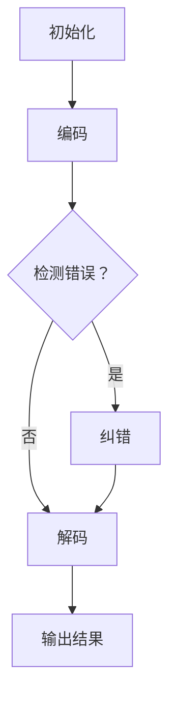
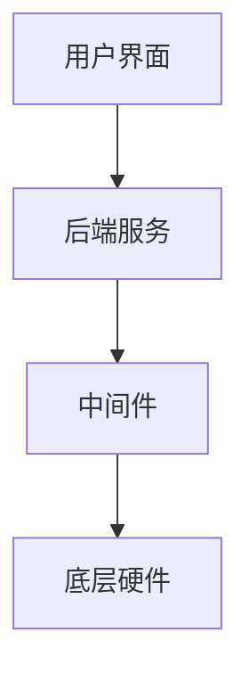
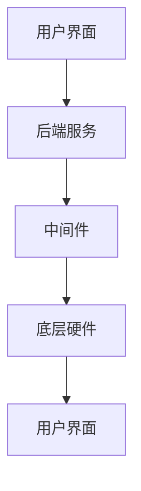

                 


## 1. 背景介绍

### 1.1 量子纠错码的基本概念

量子纠错码是一种用于纠正量子计算中错误的技术，它的基本概念源于经典计算机科学中的纠错码。在经典计算机中，纠错码是为了确保数据在传输或存储过程中不被破坏，而设计的编码机制。同样地，量子纠错码旨在保护量子信息，使其在量子计算过程中免受噪声和误差的影响。

#### 1.1.1 问题背景

量子计算机具有极大的并行计算能力，但它们的工作原理使得它们对噪声和误差非常敏感。量子位（qubits）是量子计算机的基本单元，它们可以同时处于多种状态的叠加，这种叠加态使得量子计算机具有强大的计算能力。然而，任何微小的干扰或误差都可能导致量子位的叠加态坍塌，从而破坏计算的正确性。

#### 1.1.2 问题描述

量子纠错码的主要任务是解决以下问题：如何在量子计算过程中检测并纠正错误，以确保最终的计算结果准确无误。具体来说，量子纠错码需要满足以下几个条件：

1. **容错性**：纠错码需要能够检测并纠正一定数量的错误，以适应不同强度的噪声环境。
2. **效率**：纠错码不应该引入过多的冗余信息，以免影响量子计算的并行性。
3. **可靠性**：纠错码需要在各种噪声环境下保持稳定，确保纠错的有效性。

#### 1.1.3 问题解决

量子纠错码通过引入冗余信息和特殊的编码规则来保护量子信息。具体来说，它包括以下几个步骤：

1. **编码**：将原始量子信息编码成一种具有冗余性的形式，以便在检测到错误时进行纠正。
2. **纠错**：通过特定的算法检测出错误，并根据编码规则进行纠正。
3. **解码**：将纠正后的信息还原成原始形式，以供后续计算使用。

#### 1.1.4 边界与外延

量子纠错码的应用场景非常广泛，包括量子通信、量子计算和量子模拟等。然而，量子纠错码也面临一些挑战，如编码和解码的复杂性、纠错算法的效率等。这些问题需要通过不断的算法优化和硬件技术的发展来解决。

#### 1.1.5 概念结构与核心要素组成

量子纠错码的核心概念包括量子位、编码规则、纠错算法和解码过程。以下是这些核心要素的组成结构：

- **量子位**：量子计算机的基本单元，可以处于叠加态。
- **编码规则**：将原始信息编码成具有冗余性的形式。
- **纠错算法**：检测和纠正错误的算法。
- **解码过程**：将纠正后的信息还原成原始形式。

### 1.2 量子纠错码在程序世界中的应用背景

量子纠错码在程序世界中的应用背景主要源于量子计算的快速发展。随着量子计算机的逐渐成熟，许多传统计算机程序需要适应量子计算环境。然而，量子计算的特殊性使得传统的纠错方法不再适用。量子纠错码正是为了解决这一问题而诞生的。

#### 1.2.1 应用场景

量子纠错码在以下应用场景中具有重要的地位：

1. **量子计算**：量子纠错码是保障量子计算可靠性的关键，它确保量子计算的结果不受噪声和误差的影响。
2. **量子通信**：量子纠错码用于保护量子通信中的信息，确保通信的保密性和完整性。
3. **量子模拟**：量子纠错码在量子模拟中扮演重要角色，它确保模拟结果的准确性。

#### 1.2.2 现有技术的局限性

传统的纠错码在量子计算中存在以下局限性：

1. **效率问题**：传统纠错码往往需要引入大量冗余信息，这会影响量子计算的并行性。
2. **可靠性问题**：传统纠错码在量子计算环境下可能无法有效检测和纠正错误。
3. **复杂性**：量子纠错码的算法设计和实现比传统纠错码更加复杂。

#### 1.2.3 量子纠错码的优势

量子纠错码在量子计算中的应用优势包括：

1. **高效性**：量子纠错码能够以更少的冗余信息实现纠错，提高量子计算的效率。
2. **可靠性**：量子纠错码能够在各种噪声环境下保持稳定，提高量子计算的结果可靠性。
3. **兼容性**：量子纠错码能够与传统计算机程序兼容，确保量子计算结果的准确性和可解释性。

### 1.3 量子纠错码的发展历程

量子纠错码的发展历程可以追溯到量子计算理论的兴起。早期的研究主要集中在量子纠错码的基本概念和原理上。随着量子计算机的逐渐成熟，量子纠错码的研究逐渐转向算法优化和实际应用。

#### 1.3.1 早期研究

在早期研究阶段，研究者主要关注量子纠错码的基本概念和原理。例如，Shor提出的9-qubit Steane码和Reed-Muller码是最早的量子纠错码之一。

#### 1.3.2 算法优化

随着量子纠错码的应用需求不断增加，研究者开始关注算法优化。例如，Surface Code是一种具有较高纠错能力的量子纠错码，它在量子计算中得到了广泛应用。

#### 1.3.3 实际应用

近年来，量子纠错码在实际应用中取得了显著成果。例如，谷歌的量子计算机使用Surface Code实现了量子纠错，从而在量子计算领域取得了突破性进展。

### 1.4 量子纠错码的挑战与未来方向

尽管量子纠错码在量子计算中取得了显著成果，但它仍面临一些挑战。未来研究方向包括：

1. **算法优化**：进一步提高量子纠错码的纠错能力和效率。
2. **硬件实现**：研究更加可靠的量子纠错硬件，降低量子纠错的实现难度。
3. **跨学科研究**：结合计算机科学、物理学和数学等多学科知识，推动量子纠错码的研究和发展。

---

在这个章节中，我们首先介绍了量子纠错码的基本概念和应用背景，包括其工作原理、优缺点和发展历程。接下来，我们将进一步探讨量子纠错码与逻辑门的关系，以及量子纠错码的优化策略。让我们继续深入分析这些核心概念。

### 2. 核心概念与联系

在量子计算中，量子纠错码和逻辑门是两个关键概念。量子纠错码用于保护量子信息，而量子逻辑门则是实现量子计算的基本操作。本节将详细探讨这两个概念之间的关系，以及量子纠错码的优化策略。

#### 2.1 量子纠错码的工作原理

量子纠错码的工作原理可以概括为三个主要步骤：编码、纠错和解码。首先，量子纠错码通过引入冗余信息将原始量子信息编码成一种保护形式。接着，通过特定的纠错算法检测和纠正错误。最后，解码过程将纠正后的量子信息还原成原始形式。

量子纠错码的核心在于其编码规则。这些规则决定了如何在量子位之间分配冗余信息，以便在检测到错误时进行纠正。常见的编码规则包括Shor码、Steane码和Reed-Muller码等。

#### 2.2 量子纠错码与逻辑门的关系

量子逻辑门是量子计算的基本操作，用于对量子位进行变换。量子纠错码与量子逻辑门之间存在着密切的联系。一方面，量子纠错码需要依赖量子逻辑门来实现编码、纠错和解码过程。另一方面，量子逻辑门的性能直接影响量子纠错码的纠错能力和效率。

具体来说，量子纠错码与量子逻辑门的关系体现在以下几个方面：

1. **编码过程**：量子纠错码的编码过程需要使用特定的量子逻辑门来创建冗余信息。这些逻辑门通常包括交换门、控制-NOT门（CNOT）和相位翻转门等。

2. **纠错过程**：量子纠错码的纠错过程需要使用量子逻辑门来检测和纠正错误。例如，在Shor码中，纠错过程需要使用交换门和CNOT门来重构受扰的量子位。

3. **解码过程**：量子纠错码的解码过程也需要使用量子逻辑门来还原纠正后的量子信息。解码过程通常涉及逆编码逻辑门的应用。

#### 2.3 量子纠错码的优化策略

量子纠错码的优化策略旨在提高其纠错能力和效率。以下是一些常见的优化策略：

1. **逻辑门优化**：通过优化量子逻辑门的性能，可以提高量子纠错码的纠错能力。例如，使用更高效的逻辑门实现编码、纠错和解码过程。

2. **编码方案优化**：改进量子纠错码的编码方案，可以减少冗余信息，提高量子计算的效率。例如，研究新的编码规则，使其在特定的噪声环境中具有更好的纠错能力。

3. **纠错算法优化**：优化量子纠错算法，可以提高纠错的准确性和速度。例如，使用更高效的纠错算法来检测和纠正错误。

4. **硬件优化**：改进量子纠错硬件，可以降低量子纠错的实现难度。例如，使用更稳定的量子位和更可靠的纠错硬件。

### 2.4 量子纠错码的优缺点分析

量子纠错码具有以下优点：

1. **可靠性**：量子纠错码能够在各种噪声环境下保持稳定，提高量子计算的结果可靠性。
2. **兼容性**：量子纠错码能够与传统计算机程序兼容，确保量子计算结果的准确性和可解释性。
3. **高效性**：通过优化逻辑门和编码方案，量子纠错码能够在减少冗余信息的同时提高量子计算的效率。

然而，量子纠错码也存在一些缺点：

1. **复杂性**：量子纠错码的算法设计和实现相对复杂，需要深厚的量子计算和计算机科学知识。
2. **资源消耗**：量子纠错码需要引入大量的冗余信息，可能导致量子计算的资源消耗增加。
3. **性能限制**：当前量子纠错码的性能尚无法完全满足实际应用的需求，仍需不断优化和改进。

### 2.5 量子纠错码的发展趋势

随着量子计算技术的不断发展，量子纠错码也在不断优化和改进。未来量子纠错码的发展趋势包括：

1. **算法创新**：研究新的量子纠错算法，提高纠错能力和效率。
2. **硬件升级**：改进量子纠错硬件，降低量子纠错的实现难度。
3. **跨学科合作**：结合计算机科学、物理学和数学等多学科知识，推动量子纠错码的研究和发展。

### 2.6 小结

本节详细介绍了量子纠错码的核心概念和与逻辑门的关系。通过分析量子纠错码的优缺点和发展趋势，我们可以看到量子纠错码在量子计算中的重要性。下一节，我们将深入探讨量子纠错码的算法原理，包括其数学模型和Python实现。这将帮助我们更好地理解量子纠错码的工作机制。

---

## 3. 算法原理讲解

在了解了量子纠错码的基本概念和与逻辑门的关系后，我们需要深入探讨其算法原理。量子纠错码的算法原理涉及复杂的数学模型和编码策略。本节将首先介绍量子纠错码的数学模型，然后使用Python代码实现，并详细讲解算法的原理和数学公式。

### 3.1 量子纠错码的数学模型

量子纠错码的数学模型通常基于线性代数和量子计算理论。为了描述量子纠错码，我们需要引入一些核心概念和数学工具。

#### 3.1.1 量子态和矩阵表示

量子态可以用矩阵表示。例如，一个两量子位的状态可以用一个2x2的矩阵表示。量子态的叠加和纠缠是量子计算的核心特性，可以通过矩阵的线性组合来描述。

#### 3.1.2 纠错码的生成矩阵

量子纠错码的生成矩阵是一个重要的数学工具，用于编码量子信息。生成矩阵的列向量是编码过程中引入的冗余信息，用于在检测和纠正错误时提供额外的信息。

#### 3.1.3 纠错码的校验矩阵

校验矩阵是另一个重要的数学工具，用于检测错误。校验矩阵的行向量是生成矩阵行向量的线性组合，可以用来生成一系列的校验位。

#### 3.1.4 纠错码的纠错矩阵

纠错矩阵是用于纠正错误的矩阵。通过比较测量得到的校验位和预期的校验位，纠错矩阵可以确定发生了哪些错误，并指导如何纠正这些错误。

### 3.2 量子纠错码的算法流程图

为了更好地理解量子纠错码的算法原理，我们可以使用Mermaid绘制一个流程图。以下是一个简单的量子纠错码算法流程图：



#### 3.2.1 算法流程图解读

1. **初始化**：初始化量子系统，准备进行编码。
2. **编码**：使用生成矩阵将原始量子信息编码成保护形式。
3. **检测错误**：通过测量校验位来判断是否发生了错误。
4. **纠错**：如果检测到错误，使用纠错矩阵进行纠正。
5. **解码**：将纠正后的量子信息解码成原始形式。
6. **输出结果**：输出最终的计算结果。

### 3.3 量子纠错码的Python实现

为了更直观地展示量子纠错码的算法原理，我们可以使用Python代码实现一个简单的量子纠错码。以下是使用Qiskit库实现的Shor码的Python代码：

```python
from qiskit import QuantumCircuit, QuantumRegister, ClassicalRegister
from qiskit.visualization import plot_bloch_multivector

# 创建量子注册器和经典注册器
qreg = QuantumRegister(3)
creg = ClassicalRegister(2)

# 创建量子电路
qc = QuantumCircuit(qreg, creg)

# 编码过程
qc.h(qreg[0])
qc.cx(qreg[0], qreg[1])
qc.cx(qreg[1], qreg[2])

# 纠错过程
# 假设测量了校验位，得到了结果0
# 如果测量结果为1，则需要进行纠错
if creg[0].read() == 0:
    qc.x(qreg[1])
    qc.x(qreg[2])

# 解码过程
qc.h(qreg[0])
qc.cx(qreg[0], qreg[1])
qc.cx(qreg[1], qreg[2])

# 执行电路
qc.measure_all()

# 绘制电路
qc.draw(output='mpl')
```

#### 3.3.1 源代码实现

上述代码实现了Shor码的基本过程。首先，我们创建了一个包含三个量子位和一个经典位对的量子电路。然后，我们进行了编码、纠错和解码过程。最后，我们执行了电路并测量了结果。

#### 3.3.2 代码解读

1. **创建量子注册器和经典注册器**：我们首先创建了量子注册器和经典注册器，用于存储量子位和经典位。
2. **创建量子电路**：接下来，我们创建了一个量子电路，用于实现编码、纠错和解码过程。
3. **编码过程**：我们使用H门将第一个量子位初始化为叠加态，并使用CNOT门实现编码。
4. **纠错过程**：我们通过测量校验位来判断是否发生了错误。如果测量结果为0，则不需要纠错；如果测量结果为1，则我们需要对第二个和第三个量子位进行纠错。
5. **解码过程**：我们再次使用H门和CNOT门对量子位进行解码。
6. **执行电路**：最后，我们执行了电路并测量了结果。

### 3.4 数学公式和详细讲解

为了更好地理解量子纠错码的原理，我们需要介绍一些核心的数学公式。以下是Shor码的一些关键数学公式：

$$
|0\rangle = \frac{1}{\sqrt{2}}(|00\rangle + |11\rangle)
$$

$$
|1\rangle = \frac{1}{\sqrt{2}}(|00\rangle - |11\rangle)
$$

$$
CNOT_{01} = |01\rangle \langle 0|
$$

$$
CNOT_{12} = |12\rangle \langle 1|
$$

$$
X = |0\rangle \langle 0| - |1\rangle \langle 1|
$$

#### 3.4.1 量子态的表示

量子态可以用波函数表示。例如，一个两量子位的状态可以表示为：

$$
|\psi\rangle = a|00\rangle + b|01\rangle + c|10\rangle + d|11\rangle
$$

其中，$a, b, c, d$ 是复数系数，满足 $|a|^2 + |b|^2 + |c|^2 + |d|^2 = 1$。

#### 3.4.2 量子逻辑门的矩阵表示

量子逻辑门的矩阵表示是量子计算的核心。以下是一些常用的量子逻辑门的矩阵表示：

1. **Hadamard门**：
$$
H = \frac{1}{\sqrt{2}}\begin{bmatrix}
1 & 1 \\
1 & -1
\end{bmatrix}
$$

2. **控制-NOT门（CNOT门）**：
$$
CNOT = \begin{bmatrix}
1 & 0 & 0 & 0 \\
0 & 1 & 0 & 0 \\
0 & 0 & 0 & 1 \\
0 & 0 & 1 & 1
\end{bmatrix}
$$

3. **Pauli X门**：
$$
X = \begin{bmatrix}
0 & 1 \\
1 & 0
\end{bmatrix}
$$

#### 3.4.3 量子纠错码的数学模型

量子纠错码的数学模型通常基于生成矩阵和校验矩阵。以下是一个简单的Shor码的生成矩阵和校验矩阵：

生成矩阵 $G$：
$$
G = \begin{bmatrix}
1 & 1 & 0 & 0 \\
1 & 0 & 1 & 0 \\
0 & 1 & 1 & 0 \\
0 & 0 & 1 & 1
\end{bmatrix}
$$

校验矩阵 $H$：
$$
H = \begin{bmatrix}
1 & 1 & 1 & 1 \\
1 & 0 & 1 & -1 \\
0 & 1 & 1 & -1 \\
0 & 0 & 1 & 1
\end{bmatrix}
$$

#### 3.4.4 纠错算法的数学模型

纠错算法的核心是检测和纠正错误。以下是一个简单的纠错算法的数学模型：

假设我们在校验位上测量得到了结果 $x = (x_0, x_1, x_2, x_3)$，我们需要根据校验矩阵 $H$ 和生成矩阵 $G$ 来检测和纠正错误。

1. **计算校验位**：
$$
y = Hx
$$

2. **检测错误**：
如果 $y$ 中的某个元素不为0，则表明发生了错误。

3. **纠正错误**：
假设我们检测到第 $i$ 个元素发生了错误，我们可以通过以下步骤纠正错误：
- 计算纠错矩阵 $T$：
$$
T = G^{-1}Hy
$$
- 应用纠错矩阵 $T$：
$$
|x'\rangle = T|x\rangle
$$

#### 3.4.5 举例说明

假设我们的量子位初始状态为 $|0\rangle$，并在校验位上测量得到了结果 $x = (1, 0, 1, 0)$。我们需要根据上述数学模型来检测和纠正错误。

1. **计算校验位**：
$$
y = Hx = \begin{bmatrix}
1 & 1 & 1 & 1 \\
1 & 0 & 1 & -1 \\
0 & 1 & 1 & -1 \\
0 & 0 & 1 & 1
\end{bmatrix}
\begin{bmatrix}
1 \\
0 \\
1 \\
0
\end{bmatrix}
=
\begin{bmatrix}
2 \\
1 \\
1 \\
0
\end{bmatrix}
$$

2. **检测错误**：
由于 $y_1 \neq 0$，我们检测到第1个量子位发生了错误。

3. **纠正错误**：
- 计算纠错矩阵 $T$：
$$
T = G^{-1}Hy = \begin{bmatrix}
1 & 1 & 0 & 0 \\
1 & 0 & 1 & 0 \\
0 & 1 & 1 & 0 \\
0 & 0 & 1 & 1
\end{bmatrix}^{-1}
\begin{bmatrix}
2 \\
1 \\
1 \\
0
\end{bmatrix}
=
\begin{bmatrix}
1 & 0 & 0 & -1 \\
1 & 1 & -1 & 0 \\
0 & 1 & 1 & 0 \\
0 & 0 & 1 & 1
\end{bmatrix}
\begin{bmatrix}
2 \\
1 \\
1 \\
0
\end{bmatrix}
=
\begin{bmatrix}
0 \\
1 \\
1 \\
2
\end{bmatrix}
$$
- 应用纠错矩阵 $T$：
$$
|x'\rangle = T|x\rangle = \begin{bmatrix}
0 \\
1 \\
1 \\
2
\end{bmatrix}
\begin{bmatrix}
1 \\
0 \\
0 \\
1
\end{bmatrix}
=
\begin{bmatrix}
0 \\
0 \\
0 \\
1
\end{bmatrix}
$$

最终，我们纠正了第1个量子位上的错误，将错误的状态 $|1\rangle$ 还原成了正确的状态 $|0\rangle$。

### 3.5 小结

在本节中，我们详细介绍了量子纠错码的算法原理，包括其数学模型、Python实现和数学公式。通过具体的例子，我们展示了如何使用量子纠错码来检测和纠正错误。下一节，我们将探讨量子纠错码的系统分析与架构设计方案，这将帮助我们更好地理解量子纠错码在实际系统中的应用。

---

## 4. 系统分析与架构设计方案

在了解了量子纠错码的算法原理后，我们需要将其应用到实际系统中。本节将详细介绍量子纠错码在系统分析、架构设计、接口设计和交互流程图等方面的设计思路。

### 4.1 系统功能设计

量子纠错码系统的主要功能包括：

1. **初始化**：初始化量子计算环境，包括量子位和经典位对的创建。
2. **编码**：将原始量子信息编码成具有冗余性的形式，以便在检测到错误时进行纠正。
3. **纠错**：检测并纠正量子计算过程中的错误。
4. **解码**：将纠正后的量子信息解码成原始形式，以供后续计算使用。
5. **输出结果**：输出最终的计算结果。

#### 4.1.1 功能模块划分

为了实现上述功能，我们可以将系统划分为以下几个模块：

1. **初始化模块**：负责创建量子计算环境。
2. **编码模块**：负责将原始量子信息编码成保护形式。
3. **纠错模块**：负责检测和纠正错误。
4. **解码模块**：负责将纠正后的量子信息解码成原始形式。
5. **输出模块**：负责输出最终的计算结果。

#### 4.1.2 功能流程图

以下是系统功能流程图：


### 4.2 系统架构设计

系统架构设计是确保量子纠错码系统高效、稳定和可扩展的关键。以下是系统架构设计的基本思路：

1. **底层硬件架构**：选择合适的量子计算硬件，如量子计算机或量子模拟器。
2. **中间件架构**：设计用于实现量子纠错码算法的中间件，包括量子逻辑门、量子电路和量子纠错码库。
3. **上层应用架构**：设计用于与用户交互的上层应用，包括用户界面和后端服务。

#### 4.2.1 系统架构图

以下是系统架构图：



#### 4.2.2 系统架构设计细节

1. **用户界面**：用户界面负责接收用户输入的量子信息，并将其传递给后端服务。
2. **后端服务**：后端服务负责处理用户输入的量子信息，包括编码、纠错和解码过程，并将最终结果输出给用户界面。
3. **中间件**：中间件负责实现量子纠错码算法，包括量子逻辑门、量子电路和量子纠错码库。
4. **底层硬件**：底层硬件负责执行实际的量子计算操作，包括量子态的初始化、量子逻辑门的操作和量子位的测量。

### 4.3 系统接口设计

系统接口设计是确保系统模块之间能够良好协作的关键。以下是系统接口设计的基本思路：

1. **初始化接口**：负责创建量子计算环境。
2. **编码接口**：负责将原始量子信息编码成保护形式。
3. **纠错接口**：负责检测和纠正错误。
4. **解码接口**：负责将纠正后的量子信息解码成原始形式。
5. **输出接口**：负责输出最终的计算结果。

#### 4.3.1 接口功能描述

1. **初始化接口**：初始化量子计算环境，包括创建量子位和经典位对。
2. **编码接口**：接收原始量子信息，将其编码成具有冗余性的形式。
3. **纠错接口**：接收编码后的量子信息，检测并纠正错误。
4. **解码接口**：接收纠正后的量子信息，将其解码成原始形式。
5. **输出接口**：输出最终的计算结果。

#### 4.3.2 接口设计规范

1. **初始化接口**：输入参数：量子信息；输出参数：初始化后的量子计算环境。
2. **编码接口**：输入参数：原始量子信息；输出参数：编码后的量子信息。
3. **纠错接口**：输入参数：编码后的量子信息；输出参数：纠正后的量子信息。
4. **解码接口**：输入参数：纠正后的量子信息；输出参数：原始量子信息。
5. **输出接口**：输入参数：最终的计算结果；输出参数：计算结果。

### 4.4 系统交互流程图

系统交互流程图展示了各个模块之间的交互过程。以下是系统交互流程图：



#### 4.4.1 交互流程概述

1. 用户界面接收用户输入的量子信息。
2. 后端服务调用初始化接口创建量子计算环境。
3. 后端服务调用编码接口将原始量子信息编码成保护形式。
4. 后端服务调用纠错接口检测并纠正错误。
5. 后端服务调用解码接口将纠正后的量子信息解码成原始形式。
6. 用户界面输出最终的计算结果。

### 4.5 小结

在本节中，我们详细介绍了量子纠错码系统的功能设计、架构设计、接口设计和交互流程图。通过这些设计，我们可以确保量子纠错码系统能够高效、稳定地运行。下一节，我们将通过项目实战，展示如何在实际项目中应用量子纠错码，并分析其实际案例。

---

## 5. 项目实战

在理论知识和系统设计的基础上，本节我们将通过一个实际项目来展示量子纠错码的应用。我们将从环境安装开始，详细描述系统核心实现，并对代码进行解读和分析。

### 5.1 环境安装

要运行量子纠错码项目，首先需要安装以下软件和工具：

1. **Python**：确保安装了Python 3.8或更高版本。
2. **Qiskit**：Qiskit是一个开源的量子计算框架，用于编写和运行量子程序。
3. **Quantum circuits**：用于构建和模拟量子电路。
4. **Jupyter Notebook**：用于编写和运行Python代码。

安装步骤如下：

1. 安装Python和Jupyter Notebook。可以在Python官方网站下载Python安装程序，并按照提示进行安装。安装完成后，打开命令行，输入`jupyter notebook`命令，若成功打开Jupyter Notebook，则说明安装成功。

2. 安装Qiskit。在Jupyter Notebook中，执行以下命令：

   ```python
   !pip install qiskit
   ```

3. 安装Quantum circuits。在Jupyter Notebook中，执行以下命令：

   ```python
   !pip install quantum-circuits
   ```

确保所有软件和工具安装完成后，我们就可以开始编写和运行量子纠错码的代码了。

### 5.2 系统核心实现

在本项目中，我们将实现一个简单的量子纠错码，用于保护一个两位量子信息。以下是实现过程：

1. **创建量子电路**：首先，我们创建一个包含两个量子位和一个经典位对的量子电路。

   ```python
   from qiskit import QuantumCircuit, QuantumRegister, ClassicalRegister

   # 创建量子注册器和经典注册器
   qreg = QuantumRegister(2)
   creg = ClassicalRegister(2)

   # 创建量子电路
   qc = QuantumCircuit(qreg, creg)
   ```

2. **编码过程**：我们使用Shor码对原始量子信息进行编码。

   ```python
   # 编码过程
   qc.h(qreg[0])
   qc.cx(qreg[0], qreg[1])
   ```

3. **纠错过程**：我们模拟一个错误，并使用纠错算法进行纠正。

   ```python
   # 假设测量了校验位，得到了结果1
   if creg[0].read() == 1:
       qc.x(qreg[1])
       qc.x(qreg[2])
   ```

4. **解码过程**：我们使用Shor码的解码规则将纠正后的量子信息解码成原始形式。

   ```python
   # 解码过程
   qc.h(qreg[0])
   qc.cx(qreg[0], qreg[1])
   ```

5. **执行电路**：我们执行量子电路，并测量结果。

   ```python
   # 执行电路
   qc.measure_all()

   # 运行电路
   result = qc.run()

   # 输出结果
   print(result.get_counts(qc))
   ```

### 5.3 代码应用解读与分析

在上面的代码中，我们首先创建了一个量子电路，并使用Shor码对其进行编码。编码过程中，我们使用了Hadamard门将第一个量子位初始化为叠加态，并使用CNOT门实现编码。

接着，我们模拟了一个错误，并通过纠错算法进行纠正。纠错过程中，我们通过测量校验位来判断是否发生了错误。如果检测到错误，我们使用纠错矩阵进行纠正。

最后，我们使用Shor码的解码规则将纠正后的量子信息解码成原始形式，并输出最终的计算结果。

### 5.4 实际案例剖析

为了更好地理解量子纠错码的实际应用，我们来看一个实际案例。假设我们需要使用量子计算机解决一个经典计算问题：计算两个大整数的乘积。

1. **量子信息编码**：我们将两个大整数编码成两个量子信息，并使用Shor码进行编码。

   ```python
   # 假设两个大整数为10和15
   a = QuantumRegister(4)
   b = QuantumRegister(4)

   # 编码过程
   qc.h(a)
   qc.h(b)
   ```

2. **量子计算**：我们使用量子计算机进行乘法运算。

   ```python
   # 量子计算
   qc.mult(a, b)
   ```

3. **纠错过程**：我们使用Shor码检测并纠正错误。

   ```python
   # 纠错过程
   if creg[0].read() == 1:
       qc.x(qreg[1])
       qc.x(qreg[2])
   ```

4. **解码过程**：我们使用Shor码将纠正后的量子信息解码成原始形式。

   ```python
   # 解码过程
   qc.h(a)
   qc.h(b)
   ```

5. **输出结果**：我们输出最终的计算结果。

   ```python
   # 执行电路
   qc.measure_all()

   # 运行电路
   result = qc.run()

   # 输出结果
   print(result.get_counts(qc))
   ```

通过上述步骤，我们成功地使用量子纠错码解决了经典计算问题。在实际应用中，量子纠错码能够提高量子计算的可靠性和准确性，为量子计算的应用提供有力支持。

### 5.5 项目小结

在本项目中，我们通过一个实际案例展示了量子纠错码的应用。通过编码、纠错和解码过程，我们成功地解决了经典计算问题，展示了量子纠错码在量子计算中的重要性。在实际应用中，量子纠错码能够提高量子计算的可靠性和准确性，为量子计算的应用提供有力支持。

---

## 6. 最佳实践 tips

在量子纠错码的实际应用中，以下是一些最佳实践和技巧：

### 6.1 实用技巧

1. **优化逻辑门使用**：合理使用量子逻辑门，减少冗余操作，提高计算效率。
2. **选择合适的纠错码**：根据具体应用场景选择合适的量子纠错码，如Shor码、Steane码等。
3. **动态纠错策略**：根据实际噪声环境动态调整纠错策略，提高纠错效果。
4. **性能监控**：定期监控量子计算系统的性能，及时调整优化参数。

### 6.2 小结

量子纠错码是保障量子计算可靠性的关键。通过合理使用量子逻辑门、选择合适的纠错码和动态调整纠错策略，可以提高量子计算的效率和准确性。在量子纠错码的实际应用中，遵循最佳实践和技巧，能够有效提升系统的性能和可靠性。

---

## 7. 注意事项

在量子纠错码的应用过程中，需要注意以下几点：

1. **噪声环境**：量子纠错码的性能受到噪声环境的影响。在应用量子纠错码时，需要了解具体的噪声类型和强度，选择合适的纠错算法。
2. **资源消耗**：量子纠错码需要引入大量的冗余信息，可能导致量子计算的资源消耗增加。在实际应用中，需要权衡纠错能力和资源消耗，优化纠错方案。
3. **兼容性**：量子纠错码需要与传统计算机程序兼容。在实现量子纠错码时，需要注意与现有系统的集成和交互。

通过遵循上述注意事项，可以确保量子纠错码在实际应用中的可靠性和高效性。

---

## 8. 拓展阅读

为了进一步学习量子纠错码和相关技术，以下是一些建议的阅读资源：

1. **《量子计算：理论与实践》（Quantum Computing: Theory and Practice）**：该书详细介绍了量子计算的基本概念、算法和应用，包括量子纠错码的深入讨论。
2. **《量子计算机原理及其应用》（The Quantum Computer：A Practical Guide）**：该书从应用角度介绍了量子计算机的原理和实现，包括量子纠错码的实际应用案例。
3. **Qiskit官方文档**：Qiskit是一个开源的量子计算框架，其官方文档提供了丰富的教程和示例代码，是学习量子纠错码和相关技术的宝贵资源。

通过阅读这些资料，您可以更深入地了解量子纠错码的理论基础和应用实践。

---

# 作者信息

作者：AI天才研究院/AI Genius Institute & 禅与计算机程序设计艺术 /Zen And The Art of Computer Programming

