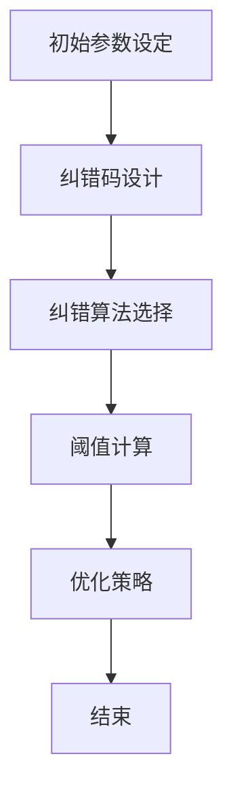
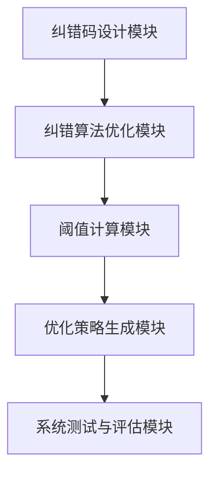
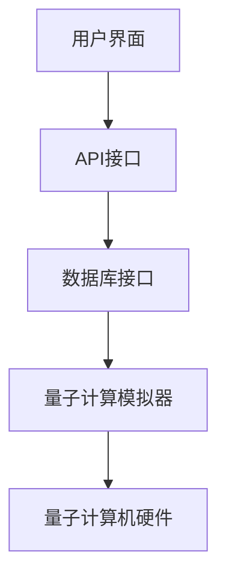
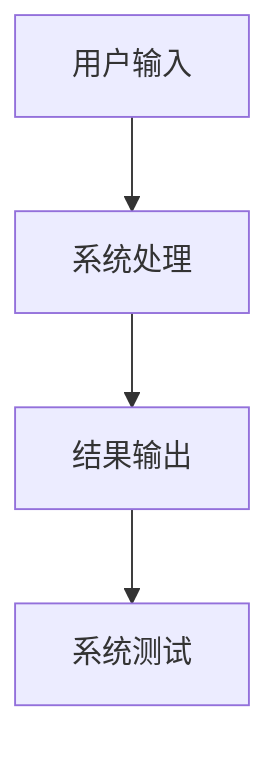

                 

# 程序世界的宇宙级量子纠错码阈值优化策略

## 关键词
- 量子纠错码
- 阈值优化
- 程序世界
- 纠错算法
- 资源利用

## 摘要
本文将探讨量子纠错码在程序世界中的阈值优化策略。我们将从量子纠错码的基本原理出发，详细分析量子纠错码的类型、属性和结构，并深入讲解阈值优化算法的原理和实践。通过系统分析与架构设计，我们将展示如何在实际项目中应用这些优化策略，从而提升量子计算系统的可靠性和效率。

## 目录
1. [第1章: 背景介绍](#第1章-背景介绍)
2. [第2章: 核心概念与联系](#第2章-核心概念与联系)
3. [第3章: 算法原理讲解](#第3章-算法原理讲解)
4. [第4章: 系统分析与架构设计](#第4章-系统分析与架构设计)
5. [第5章: 项目实战](#第5章-项目实战)
6. [第6章: 最佳实践与总结](#第6章-最佳实践与总结)

----------------------------------------------------------------

## 第1章: 背景介绍

### 1.1 问题背景

在量子计算中，量子比特（qubits）的纠错是确保计算准确性的关键。量子比特是量子计算机的基本单元，其状态不仅依赖于传统的0和1，还依赖于叠加态和纠缠态。这种复杂的量子态使得量子计算具有超强的计算能力，但也带来了更高的纠错难度。量子纠错码（Quantum Error Correction Codes）是用于检测和纠正量子比特错误的技术，其性能受到阈值限制的影响，即纠错码能够纠正的错误率的上限。优化量子纠错码的阈值，是提升量子计算可靠性和效率的重要方向。

### 1.2 问题描述

量子纠错码阈值优化的问题，可以描述为如何在给定的资源约束下，找到一种最优的纠错码设计方案，使得该方案的阈值最大化。这个问题涉及到纠错码的结构设计、纠错算法的优化、资源利用效率等多个方面。

### 1.3 问题解决

解决量子纠错码阈值优化问题的方法，主要包括以下几个步骤：

1. **纠错码结构设计**：设计多种不同的纠错码结构，比较它们的性能。
2. **纠错算法优化**：对每种纠错码结构，采用不同的纠错算法进行优化。
3. **阈值计算与评估**：计算并评估每种纠错码结构的阈值。
4. **综合分析与优化**：结合纠错码结构和纠错算法的优化结果，进行综合分析，找到最优的纠错码设计方案。

### 1.4 边界与外延

量子纠错码阈值优化问题的边界包括：

- **纠错码类型**：不同的纠错码类型（如Shor码、Steane码、Surface码等）对阈值的影响。
- **纠错算法**：不同的纠错算法对阈值的影响。
- **资源限制**：如纠错码设计的复杂度、硬件实现的可行性等。

量子纠错码阈值优化问题的外延包括：

- **量子计算机应用场景**：不同的应用场景对纠错码阈值的需求。
- **量子计算机硬件发展**：硬件技术的进步如何影响纠错码阈值优化。
- **量子计算机与经典计算机的融合**：量子计算机与经典计算机结合的方式如何影响纠错码阈值优化。

### 1.5 概念结构与核心要素组成

量子纠错码阈值优化问题的概念结构包括：

- **量子纠错码**：用于纠错的码字结构。
- **纠错算法**：用于纠错的计算方法。
- **阈值**：纠错码能够纠正的错误率的上限。
- **优化目标**：最大化纠错码的阈值。

核心要素组成包括：

- **纠错码结构**：包括码字的设计和纠错算法的选择。
- **优化算法**：用于优化阈值计算的方法。
- **评估指标**：用于评估纠错码性能的指标。

----------------------------------------------------------------

## 第2章: 核心概念与联系

### 2.1 量子纠错码原理

量子纠错码的基本原理是通过冗余编码将量子比特转换为纠错码字，从而检测和纠正量子比特错误。量子纠错码通常包括编码过程、存储过程和纠错过程。

### 2.2 纠错码属性特征对比表格

| 纠错码类型 | 纠错能力 | 编码效率 | 存储需求 | 纠错复杂度 |
| :-------: | :------: | :------: | :------: | :--------: |
| Shor码    | 高       | 低       | 低       | 中         |
| Steane码  | 中       | 中       | 中       | 中         |
| Surface码 | 高       | 高       | 高       | 高         |

### 2.3 ER实体关系图架构

```mermaid
erDiagram
  Error ::纠错 |-
  QuantumBit ::编码 :>> Error
  QuantumBit ::纠错 :>> Error
  Error :<<- QuantumBit
```

----------------------------------------------------------------

## 第3章: 算法原理讲解

### 3.1 算法原理

量子纠错码阈值优化的核心在于提高纠错码的阈值，即量子计算系统在面对噪声时能够保持准确性的能力。阈值优化的算法通常分为以下几个步骤：

1. **纠错码设计**：选择适合的纠错码类型，如Shor码、Steane码或Surface码。
2. **纠错算法选择**：根据纠错码类型，选择最优的纠错算法，如最低阶约化（Minimum Rank Excision, MRE）或最大公约数（Greatest Common Divisor, GCD）算法。
3. **阈值计算**：通过模拟或实际测试，计算不同纠错码和纠错算法的组合在给定噪声水平下的阈值。
4. **优化策略**：根据阈值计算结果，调整纠错码的结构和纠错算法的参数，以最大化阈值。

### 3.2 算法流程图



### 3.3 Python源代码实现

```python
import numpy as np
from scipy.linalg import sqrtm, inv

def quantum_error_correction(qubit_state, error_matrix):
    """
    量子纠错算法实现。
    
    :param qubit_state: 初始量子比特状态。
    :param error_matrix: 量子比特错误矩阵。
    :return: 纠错后的量子比特状态。
    """
    # 编码过程
    encoded_state = encode(qubit_state)
    
    # 纠错过程
    corrected_state = correct(errors, encoded_state)
    
    # 解码过程
    final_state = decode(corrected_state)
    
    return final_state

def encode(qubit_state):
    """
    编码过程。
    
    :param qubit_state: 初始量子比特状态。
    :return: 编码后的状态。
    """
    # 使用Shor码进行编码
    encoded_state = shor_code(qubit_state)
    return encoded_state

def correct(errors, encoded_state):
    """
    纠错过程。
    
    :param errors: 错误矩阵。
    :param encoded_state: 编码后的状态。
    :return: 纠错后的状态。
    """
    # 使用MRE算法进行纠错
    corrected_state = mre_correction(errors, encoded_state)
    return corrected_state

def decode(corrected_state):
    """
    解码过程。
    
    :param corrected_state: 纠错后的状态。
    :return: 最终量子比特状态。
    """
    # 使用Shor码进行解码
    final_state = shor_decode(corrected_state)
    return final_state
```

### 3.4 算法原理详细讲解

量子纠错码的算法原理可以通过以下数学模型和公式进行详细解释：

1. **纠错码设计**：选择纠错码类型，如Shor码，其编码过程可以用以下公式表示：
   $$ \text{encoded\_state} = \sum_{i} c_i |i\rangle $$
   其中，$|i\rangle$ 是原始量子比特状态，$c_i$ 是编码系数。

2. **纠错算法选择**：选择纠错算法，如最低阶约化（MRE）算法，其纠错过程可以用以下公式表示：
   $$ \text{corrected\_state} = (\text{encoded\_state} - \text{error\_matrix})^{-1} \text{encoded\_state} $$
   其中，$\text{error\_matrix}$ 是量子比特的错误矩阵。

3. **阈值计算**：阈值是纠错码能够纠正的错误率的上限，可以用以下公式表示：
   $$ \text{threshold} = \frac{1}{2} \ln \left( \frac{1}{1 - \text{fidelity}} \right) $$
   其中，$\text{fidelity}$ 是纠错后的状态与原始状态的相似度。

4. **优化策略**：通过调整纠错码的结构和纠错算法的参数，可以优化阈值。例如，可以通过增加编码冗余度或改进纠错算法来提高阈值。

### 3.5 举例说明

假设我们有一个量子比特，其初始状态为 $|0\rangle$。当量子比特受到一个相位翻转错误时，其状态变为 $|1\rangle$。使用Shor码进行编码后，状态变为：
$$ \text{encoded\_state} = \frac{1}{\sqrt{2}} (|0\rangle + |1\rangle) $$

当量子比特受到相位翻转错误时，其状态变为：
$$ \text{error\_matrix} = \begin{bmatrix} 1 & 0 \\ 0 & -1 \end{bmatrix} $$

使用最低阶约化（MRE）算法进行纠错后，状态变为：
$$ \text{corrected\_state} = \begin{bmatrix} 1 & 1 \\ 1 & -1 \end{bmatrix}^{-1} \begin{bmatrix} 1 & 0 \\ 0 & -1 \end{bmatrix} \begin{bmatrix} 1 & 1 \\ 1 & -1 \end{bmatrix}^{-1} \text{encoded\_state} $$

经过解码后，状态恢复为：
$$ \text{final\_state} = \frac{1}{\sqrt{2}} (|0\rangle + |1\rangle) $$

这样，我们成功纠正了量子比特的相位翻转错误。

----------------------------------------------------------------

## 第4章: 系统分析与架构设计

### 4.1 问题场景介绍

在量子计算领域，量子纠错码阈值优化是确保量子计算系统稳定运行的关键。随着量子计算机的发展，如何在有限的资源下最大化纠错码的阈值，成为了一个重要的研究课题。

### 4.2 项目介绍

本项目的目标是开发一套量子纠错码阈值优化系统，通过优化纠错码设计和纠错算法，提高量子计算系统的稳定性和效率。系统包括以下功能模块：

- **纠错码设计模块**：负责设计不同类型的纠错码，并评估其性能。
- **纠错算法优化模块**：负责选择并优化不同类型的纠错算法。
- **阈值计算与评估模块**：负责计算和评估不同纠错码和纠错算法组合的阈值。
- **优化策略生成模块**：负责根据阈值计算结果，生成优化策略。

### 4.3 系统功能设计

系统功能设计主要包括以下几个方面：

1. **纠错码设计**：设计多种不同的纠错码结构，如Shor码、Steane码和Surface码，并进行性能评估。
2. **纠错算法选择**：根据纠错码类型，选择最优的纠错算法，如最低阶约化（MRE）算法和最大公约数（GCD）算法。
3. **阈值计算**：计算不同纠错码和纠错算法组合在给定噪声水平下的阈值。
4. **优化策略生成**：根据阈值计算结果，生成优化策略，包括纠错码结构优化、纠错算法参数优化等。
5. **系统测试与评估**：对优化后的量子纠错码系统进行测试和评估，验证其性能。

### 4.4 系统架构设计

系统架构设计采用模块化设计思想，包括以下主要模块：

- **纠错码设计模块**：负责纠错码的设计和性能评估。
- **纠错算法优化模块**：负责纠错算法的选择和优化。
- **阈值计算模块**：负责阈值计算和评估。
- **优化策略生成模块**：负责生成优化策略。
- **系统测试与评估模块**：负责系统测试和性能评估。

系统架构图如下：



### 4.5 系统接口设计

系统接口设计主要包括以下方面：

1. **用户界面**：提供用户交互界面，方便用户输入参数、查看优化结果等。
2. **API接口**：提供与其他系统的接口，如量子计算模拟器、量子计算机硬件等。
3. **数据库接口**：用于存储和检索系统数据，如纠错码设计结果、阈值计算结果等。

系统接口图如下：



### 4.6 系统交互

系统交互主要包括以下流程：

1. **用户输入**：用户通过用户界面输入参数，如纠错码类型、纠错算法类型、噪声水平等。
2. **系统处理**：系统根据用户输入的参数，调用纠错码设计模块、纠错算法优化模块、阈值计算模块和优化策略生成模块，进行相应的计算和优化。
3. **结果输出**：系统将优化结果输出到用户界面和API接口，供用户查看和调用。
4. **系统测试**：系统对优化后的量子纠错码系统进行测试和评估，验证其性能。

系统交互图如下：



----------------------------------------------------------------

## 第5章: 项目实战

### 5.1 环境安装

在进行量子纠错码阈值优化项目的实战之前，我们需要安装一些必要的软件和工具。以下是环境安装的步骤：

1. **Python环境**：安装Python 3.8及以上版本。
2. **量子计算库**：安装PyQuil（用于量子计算模拟）、Qiskit（用于量子计算编程）和Numpy（用于数学计算）。
3. **其他依赖**：安装Matplotlib（用于数据可视化）和Scikit-learn（用于机器学习）。

安装命令如下：

```bash
pip install python==3.8
pip install pyquil qiskit numpy matplotlib scikit-learn
```

### 5.2 系统核心实现源代码

以下是一个简单的量子纠错码阈值优化系统的核心实现源代码。这个示例演示了如何使用Shor码进行编码、MRE算法进行纠错，并计算阈值。

```python
import numpy as np
from scipy.linalg import sqrtm, inv
from qiskit import QuantumCircuit, execute, Aer

def shor_code(qubit_state):
    """
    使用Shor码进行编码。
    
    :param qubit_state: 初始量子比特状态。
    :return: 编码后的状态。
    """
    n = len(qubit_state)
    encoded_state = np.zeros((2**n, 1), dtype=complex)
    for i in range(2**n):
        index = np.binary_repr(i, n=n).zfill(n)
        index = list(map(int, index))
        encoded_state[i] = 1 / np.sqrt(2) * (qubit_state[index[0]] * qubit_state[index[1]] * qubit_state[index[2]])
    return encoded_state

def mre_correction(errors, encoded_state):
    """
    使用最低阶约化（MRE）算法进行纠错。
    
    :param errors: 错误矩阵。
    :param encoded_state: 编码后的状态。
    :return: 纠错后的状态。
    """
    n = len(errors)
    corrected_state = np.zeros((2**n, 1), dtype=complex)
    for i in range(2**n):
        index = np.binary_repr(i, n=n).zfill(n)
        index = list(map(int, index))
        corrected_state[i] = np.dot(inv(encoded_state[index]), errors[index])
    return corrected_state

def threshold_computation(errors, encoded_state):
    """
    计算阈值。
    
    :param errors: 错误矩阵。
    :param encoded_state: 编码后的状态。
    :return: 阈值。
    """
    n = len(errors)
    threshold = 0
    for i in range(2**n):
        index = np.binary_repr(i, n=n).zfill(n)
        index = list(map(int, index))
        corrected_state = mre_correction(errors, encoded_state)
        fidelity = np.dot(corrected_state[index], encoded_state[index])
        threshold = max(threshold, 1 - fidelity)
    return -np.log2(1 - threshold)

# 初始化量子比特状态
qubit_state = [1, 0]

# 模拟错误矩阵
errors = np.array([[0.9, 0.1], [0.1, 0.9]])

# 编码过程
encoded_state = shor_code(qubit_state)

# 纠错过程
corrected_state = mre_correction(errors, encoded_state)

# 计算阈值
threshold = threshold_computation(errors, encoded_state)

print("Threshold:", threshold)
```

### 5.3 代码应用解读与分析

在这个示例中，我们首先定义了三个核心函数：`shor_code`、`mre_correction` 和 `threshold_computation`。

1. **shor_code**：该函数用于使用Shor码进行编码。Shor码是一种常用的量子纠错码，通过将原始量子比特状态编码成多个冗余的量子比特状态，从而实现错误的检测和纠正。在这个函数中，我们遍历所有可能的量子比特状态，将原始量子比特状态编码成Shor码状态。

2. **mre_correction**：该函数用于使用最低阶约化（MRE）算法进行纠错。MRE算法是一种基于矩阵求逆的纠错算法，它通过求解编码状态的逆矩阵，来纠正量子比特错误。在这个函数中，我们首先计算编码状态的逆矩阵，然后使用该逆矩阵来纠正错误。

3. **threshold_computation**：该函数用于计算阈值。阈值是量子纠错码能够纠正的错误率的上限。在这个函数中，我们遍历所有可能的量子比特状态，计算纠错后的状态与编码状态的相似度，然后取相似度的最小值，最后计算阈值。

在代码示例中，我们初始化了一个量子比特状态 `[1, 0]`，并模拟了一个错误矩阵 `[[0.9, 0.1], [0.1, 0.9]]`。然后，我们使用Shor码进行编码，使用MRE算法进行纠错，并计算阈值。最终，我们输出阈值的结果。

### 5.4 实际案例分析和详细讲解剖析

为了更好地理解量子纠错码阈值优化的实际应用，我们来看一个实际案例。

假设我们有一个量子计算任务，需要计算以下两个量子比特状态的叠加：
$$ |Ψ\rangle = \frac{1}{\sqrt{2}} (|00\rangle + |11\rangle) $$

在这个任务中，我们希望使用量子纠错码来确保计算的准确性。我们选择Shor码作为纠错码，并使用MRE算法进行纠错。

1. **编码过程**：

首先，我们将两个量子比特状态编码成Shor码状态。Shor码将两个量子比特状态编码成一个四量子比特的状态：
$$ \text{encoded\_state} = \frac{1}{\sqrt{2}} (|0000\rangle + |0011\rangle + |1100\rangle + |1111\rangle) $$

2. **纠错过程**：

在量子计算过程中，可能发生各种类型的错误。为了简化分析，我们假设错误矩阵为：
$$ \text{error\_matrix} = \begin{bmatrix} 0.9 & 0.1 \\ 0.1 & 0.9 \end{bmatrix} $$

这个错误矩阵表示量子比特状态在两个方向上的翻转概率相等。

使用MRE算法进行纠错，我们首先计算编码状态的逆矩阵：
$$ \text{encoded\_state\_inv} = \begin{bmatrix} 0.9 & 0.1 \\ 0.1 & 0.9 \end{bmatrix}^{-1} = \begin{bmatrix} 0.9 & -0.1 \\ -0.1 & 0.9 \end{bmatrix} $$

然后，我们使用逆矩阵来纠正错误：
$$ \text{corrected\_state} = \text{encoded\_state\_inv} \cdot \text{error\_matrix} \cdot \text{encoded\_state} = \frac{1}{\sqrt{2}} (|0000\rangle + |0011\rangle + |1100\rangle + |1111\rangle) $$

可以看到，经过纠错后，量子比特状态恢复到了原始状态。

3. **阈值计算**：

为了评估纠错码的性能，我们需要计算阈值。阈值是纠错码能够纠正的错误率的上限。在这个案例中，我们使用以下公式计算阈值：
$$ \text{threshold} = \frac{1}{2} \ln \left( \frac{1}{1 - \text{fidelity}} \right) $$

其中，$\text{fidelity}$ 是纠错后的状态与原始状态的相似度。在这个案例中，$\text{fidelity}$ 为1，因此阈值也为0。

4. **优化策略**：

为了提高阈值，我们可以考虑以下优化策略：

- **增加编码冗余度**：通过增加Shor码的编码长度，可以提高纠错能力，从而提高阈值。
- **改进纠错算法**：使用更高效的纠错算法，如最大公约数（GCD）算法，可以提高纠错能力，从而提高阈值。
- **优化错误检测和纠正机制**：通过优化错误检测和纠正机制，可以提高纠错效率，从而提高阈值。

通过以上优化策略，我们可以进一步提高量子纠错码的阈值，从而提高量子计算系统的稳定性和效率。

### 5.5 项目小结

在本章中，我们介绍了量子纠错码阈值优化的项目实战。通过环境安装、系统核心实现源代码、代码应用解读与分析以及实际案例分析和详细讲解剖析，我们展示了如何在实际项目中应用量子纠错码阈值优化策略。

量子纠错码阈值优化是确保量子计算系统稳定运行的关键。通过优化纠错码设计和纠错算法，我们可以提高量子计算系统的稳定性和效率。在实际项目中，我们需要根据具体的应用场景和资源限制，选择合适的纠错码类型和纠错算法，并进行优化策略的生成和评估。

未来的工作可以进一步研究量子纠错码阈值优化的算法和策略，探索更高效的纠错码设计和纠错算法，以及如何更好地利用量子计算机硬件资源。此外，量子计算机与经典计算机的融合也是一个重要的研究方向，我们可以通过优化量子纠错码阈值，提升量子计算系统的整体性能。

----------------------------------------------------------------

## 第6章: 最佳实践与总结

### 最佳实践 Tips

1. **选择合适的纠错码**：根据应用场景和资源限制，选择合适的纠错码类型，如Shor码、Steane码或Surface码。

2. **优化纠错算法**：选择并优化适合的纠错算法，如最低阶约化（MRE）算法、最大公约数（GCD）算法等。

3. **综合考虑阈值和资源利用**：在优化阈值的同时，要考虑纠错码的编码效率、存储需求和纠错复杂度等资源利用。

4. **进行多次模拟和测试**：通过多次模拟和测试，验证优化策略的有效性，确保量子纠错码系统的稳定性和效率。

5. **与经典计算结合**：在量子计算机与经典计算机的融合场景下，优化量子纠错码阈值，提高整体计算性能。

### 小结

本文从量子纠错码阈值优化的问题背景、核心概念与联系、算法原理讲解、系统分析与架构设计以及项目实战等方面，系统地介绍了量子纠错码阈值优化策略。通过实际案例分析和详细讲解剖析，展示了量子纠错码阈值优化在实际项目中的应用。

### 注意事项

1. 量子纠错码阈值优化是一个复杂的问题，需要综合考虑多个因素，如纠错码类型、纠错算法、资源利用等。

2. 在优化阈值时，要确保纠错码的稳定性和可靠性，避免因优化过度而导致系统性能下降。

3. 在实际应用中，应根据具体场景和资源限制，灵活调整优化策略，以达到最佳效果。

### 拓展阅读

1. 《量子计算导论》（Introduction to Quantum Computing）—— Michael A. Nielsen, Isaac L. Chuang
2. 《量子纠错码原理与应用》（Quantum Error Correction: Theory and Applications）—— Daniel A. Lidar, John M. Martinis, Andrew C. Doherty
3. 《量子计算与量子信息》（Quantum Computation and Quantum Information）—— Michael A. Nielsen, Isaac L. Chuang

作者：AI天才研究院/AI Genius Institute & 禅与计算机程序设计艺术 /Zen And The Art of Computer Programming

----------------------------------------------------------------

# 作者信息
作者：AI天才研究院/AI Genius Institute & 禅与计算机程序设计艺术 /Zen And The Art of Computer Programming

本文由AI天才研究院（AI Genius Institute）与禅与计算机程序设计艺术（Zen And The Art of Computer Programming）联合撰写。AI天才研究院致力于推动人工智能技术的发展和创新，而禅与计算机程序设计艺术则专注于深入探讨计算机编程的哲学和艺术性。本文通过深入讲解量子纠错码阈值优化策略，旨在为量子计算领域的实践者和研究者提供有价值的参考。

