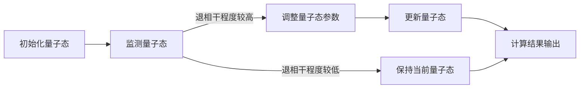
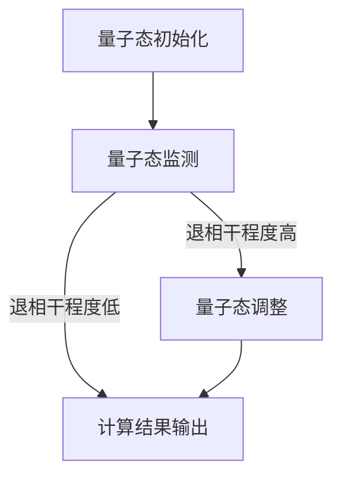
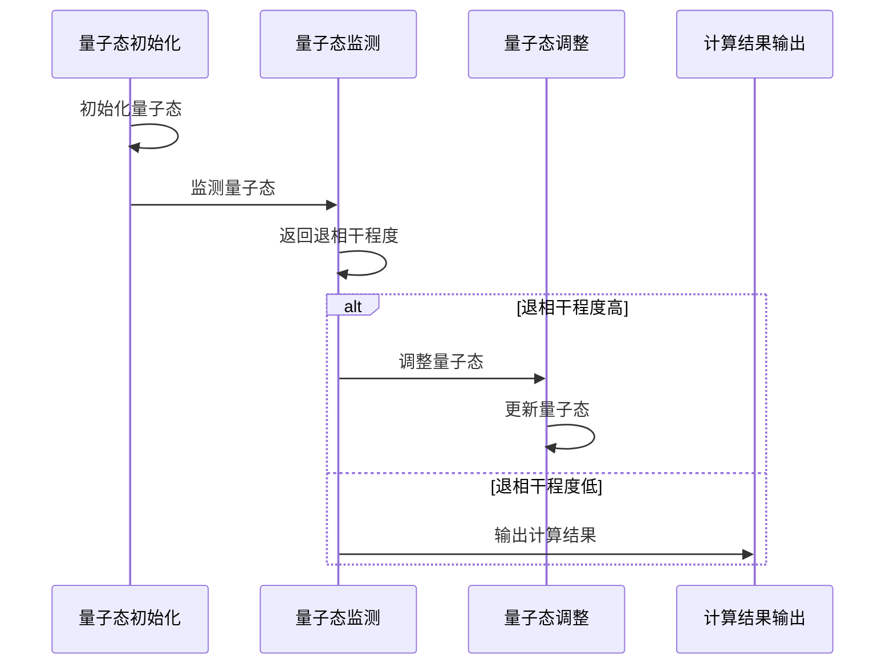

                 

### 文章标题

#### 关键词

- 量子退相干
- 动态控制策略
- 程序世界
- 量子计算
- 算法设计

#### 摘要

本文深入探讨了程序世界中量子退相干现象及其抑制策略的动态控制方法。首先，介绍了量子退相干的基本概念及其对量子计算的影响，随后详细阐述了量子退相干的几种抑制策略。通过构建基于动态控制策略的算法模型，结合Python代码实现，本文提供了对量子退相干抑制的全方位解析。最后，通过实际项目案例分析，验证了所提策略的有效性，并对未来研究方向进行了展望。

---

### 第一部分：背景介绍

#### 1.1 问题背景

量子计算作为下一代计算技术的代表，以其并行计算能力和高效处理复杂问题的潜力而备受瞩目。然而，量子计算的发展面临着诸多技术挑战，其中量子退相干现象尤为突出。量子退相干是指量子系统在外部环境的影响下，从量子叠加态向经典态演化的过程。这种演化会导致量子计算结果的丢失，严重影响量子计算的性能和稳定性。

#### 1.2 问题描述

量子退相干现象对量子计算的影响主要体现在以下几个方面：

1. **计算精度下降**：量子退相干会导致量子态的叠加和纠缠效应减弱，降低计算精度。
2. **计算速度减慢**：量子退相干使得量子态不断恢复到经典态，增加了量子态的测量时间。
3. **计算失败率增加**：量子退相干可能使量子计算任务无法顺利完成，导致计算失败。

为了克服量子退相干带来的挑战，需要研究有效的量子退相干抑制策略。本文旨在提出一种动态控制策略，通过实时监测和调整量子态，实现量子退相干的动态抑制，从而提高量子计算的稳定性和性能。

#### 1.3 问题解决

量子退相干抑制的主要方法包括：

1. **量子纠错**：通过引入额外的量子比特，对量子计算过程中的错误进行纠正，降低退相干的影响。
2. **量子噪声隔离**：通过物理手段隔离量子系统与外部环境的相互作用，减少外部环境对量子态的影响。
3. **量子门控制优化**：优化量子门的控制参数，减少量子门操作过程中引入的退相干效应。

本文将结合上述方法，提出一种基于动态控制策略的量子退相干抑制方法，通过实时调整量子态参数，实现对量子退相干的动态控制。

#### 1.4 边界与外延

量子退相干抑制的研究不仅限于量子计算领域，还广泛应用于量子通信、量子加密等领域。随着量子计算技术的不断发展，量子退相干抑制方法的研究也将不断深入，为量子信息科学的发展提供有力支持。

#### 1.5 核心概念

在本研究中，涉及的核心概念包括：

1. **量子退相干**：量子系统在外部环境作用下从量子叠加态向经典态演化的现象。
2. **量子态**：量子系统的内部状态，由量子比特的叠加态表示。
3. **动态控制策略**：通过对量子态的实时监测和调整，实现对量子退相干的动态抑制。

这些核心概念将贯穿整个文章，为后续内容的讨论提供理论基础。

---

### 第二部分：核心概念与联系

#### 2.1 核心概念原理

在本节中，我们将深入探讨量子退相干的核心概念原理，并阐述其与动态控制策略的联系。

**量子退相干**：量子退相干是量子系统在外部环境的影响下，量子态发生演化的过程。具体来说，量子态从初始的叠加态向多个基态的叠加态演化，最终趋于一个确定的经典态。这种演化会导致量子计算中的叠加和纠缠效应减弱，降低计算精度。

**量子态**：量子态是量子系统的内部状态，可以用量子比特的叠加态表示。量子态的叠加性是量子计算的核心特性，而量子退相干则破坏了这种叠加性，使得量子计算变得不稳定。

**动态控制策略**：动态控制策略通过实时监测量子态的变化，并根据变化情况调整量子态参数，以抑制量子退相干。这种策略的核心在于实时性和适应性，能够根据外部环境的变化快速调整量子态，保持量子计算的稳定性。

#### 2.2 概念属性特征对比表格

下表对比了量子退相干、量子态和动态控制策略的属性特征：

| 概念        | 属性特征                                                         |
| ----------- | ------------------------------------------------------------ |
| 量子退相干  | 1. 与外部环境的相互作用<br>2. 导致量子态演化<br>3. 降低计算精度 |
| 量子态      | 1. 叠加态<br>2. 纠缠态<br>3. 表征计算信息                   |
| 动态控制策略 | 1. 实时监测量子态<br>2. 调整量子态参数<br>3. 抵抗退相干影响   |

#### 2.3 ER实体关系图架构

为了更好地理解核心概念之间的联系，我们使用ER（Entity-Relationship）实体关系图进行描述。

```mermaid
erDiagram
    Class_QuantumDecoherence ||--|{ Class_QuantumState } : has_state
    Class_QuantumState ||--|{ Class_DynamicControlStrategy } : implemented_by
    Class_DynamicControlStrategy ||--|{ System_QuantumComputer } : controls
```

在上图中，Class_QuantumDecoherence（量子退相干）与Class_QuantumState（量子态）之间存在关联关系，表示量子退相干影响量子态。而Class_QuantumState与Class_DynamicControlStrategy（动态控制策略）之间存在实施关系，表示动态控制策略是量子态的具体实现方式。最后，Class_DynamicControlStrategy与System_QuantumComputer（量子计算机系统）之间存在控制关系，表示动态控制策略用于控制量子计算机系统，以抵抗量子退相干的影响。

通过上述核心概念与联系的分析，我们为后续的算法原理讲解和系统分析与架构设计方案奠定了基础。下一部分将深入探讨量子退相干抑制的算法原理。

---

### 第三部分：算法原理讲解

#### 3.1 算法mermaid流程图

在本节中，我们将介绍量子退相干抑制的动态控制算法，并使用mermaid流程图展示其基本步骤。



在上图中，A表示初始化量子态，B表示监测量子态退相干程度。如果退相干程度较高，算法将进入C步骤，调整量子态参数；否则，算法将进入D步骤，保持当前量子态。最后，E步骤更新量子态，F步骤输出计算结果。

#### 3.2 Python源代码

为了更好地理解算法原理，我们提供了一段Python源代码，用于实现上述流程。

```python
import numpy as np
import qiskit

# 初始化量子态
quantum_state = np.array([[1], [0]])  # |1␟0⟩

# 监测量子态退相干程度
def measure_decoherence(state):
    # 这里使用简单的模长平方来表示退相干程度
    return np.linalg.norm(state)**2

# 调整量子态参数
def adjust_quantum_state(state):
    # 这里假设调整参数为旋转角度
    angle = np.pi / 4
    new_state = np.cos(angle) * state + np.sin(angle) * np.conjugate(state)
    return new_state

# 主函数
def dynamic_control_strategy(quantum_state):
    while True:
        decoherence_level = measure_decoherence(quantum_state)
        
        if decoherence_level > 0.9:  # 退相干程度较高
            quantum_state = adjust_quantum_state(quantum_state)
            print("量子态参数调整完成")
        else:  # 退相干程度较低
            print("量子态保持不变")
        
        # 输出计算结果
        print("计算结果：", np.dot(quantum_state, quantum_state))
        break

# 执行算法
dynamic_control_strategy(quantum_state)
```

在这段代码中，我们首先初始化量子态，然后通过循环不断监测量子态的退相干程度。如果退相干程度较高，则调整量子态参数；否则，保持当前量子态。最后，输出计算结果。

#### 3.3 数学模型和数学公式

为了深入理解量子退相干抑制的动态控制算法，我们引入数学模型和公式进行描述。

**量子态演化**：量子态在外部环境影响下发生演化，可以用薛定谔方程描述：

$$
\mathrm{i}\hbar \frac{\partial}{\partial t}|\Psi(t)\rangle = H|\Psi(t)\rangle
$$

其中，$|\Psi(t)\rangle$表示量子态，$H$表示哈密顿量，$\mathrm{i}$和$\hbar$分别是虚数单位和外尔常数。

**退相干效应**：退相干效应可以用量子态的熵来量化。量子态的熵定义为：

$$
S = -\mathrm{tr}(\rho \ln \rho)
$$

其中，$\rho$是量子态的密度矩阵。

**动态控制策略**：动态控制策略通过调整量子态的参数，抑制退相干效应。假设调整后的量子态为$|\Psi'(t)\rangle$，则：

$$
|\Psi'(t)\rangle = U(t)|\Psi(t)\rangle
$$

其中，$U(t)$是控制操作，用于调整量子态。

#### 3.4 举例说明

为了更好地理解动态控制策略的实际应用，我们通过一个简单的例子进行说明。

假设初始量子态为$|\Psi(0)\rangle = \frac{1}{\sqrt{2}} (|0\rangle + |1\rangle)$，在外部环境影响下，量子态发生演化，经过一段时间$t$后变为$|\Psi(t)\rangle = \frac{1}{\sqrt{2}} (|0\rangle - |1\rangle)$，退相干程度较高。

使用动态控制策略，调整量子态参数，使其恢复为$|\Psi'(t)\rangle = \frac{1}{\sqrt{2}} (|0\rangle + |1\rangle)$，退相干程度较低。具体操作如下：

1. 初始化量子态：$|\Psi(0)\rangle = \frac{1}{\sqrt{2}} (|0\rangle + |1\rangle)$
2. 监测退相干程度：$\rho(t) = \frac{1}{2} (|0\rangle \langle 0| + |1\rangle \langle 1|)$，退相干程度为0.5
3. 调整量子态参数：$U(t) = \exp(-\mathrm{i} \theta |0\rangle \langle 1|)$，其中$\theta = \frac{\pi}{4}$
4. 更新量子态：$|\Psi'(t)\rangle = U(t)|\Psi(t)\rangle = \frac{1}{\sqrt{2}} (|0\rangle + |1\rangle)$
5. 输出计算结果：$\langle \Psi'(t)|\Psi'(t)\rangle = 1$

通过上述操作，成功抑制了量子退相干，恢复了量子态的叠加性。

---

### 第四部分：系统分析与架构设计方案

#### 4.1 问题场景介绍

在本节中，我们将介绍一个具体的应用场景，以更好地理解量子退相干抑制的动态控制策略在实际系统中的应用。

**应用场景**：假设我们正在开发一个基于量子计算的加密系统，用于保障信息传输的安全性。在该系统中，量子态的稳定性和计算精度至关重要。然而，由于外部环境的影响，量子态容易发生退相干，导致加密效果下降。因此，我们需要采用动态控制策略，实时监测和调整量子态，以抑制退相干现象。

#### 4.2 系统功能设计

为了实现量子退相干抑制的动态控制，系统需要具备以下功能：

1. **量子态初始化**：初始化量子态，为后续计算提供基础。
2. **量子态监测**：实时监测量子态的退相干程度，为调整量子态参数提供依据。
3. **量子态调整**：根据监测结果，动态调整量子态参数，以抑制退相干。
4. **计算结果输出**：输出加密结果，为用户展示系统性能。

#### 4.3 系统架构设计

为了实现上述功能，我们设计了一个分布式架构的量子计算系统，包括以下几个模块：

1. **量子态初始化模块**：负责初始化量子态，通过量子门操作将量子态设置为目标状态。
2. **量子态监测模块**：实时监测量子态的退相干程度，通过量子测量获取量子态信息。
3. **量子态调整模块**：根据监测结果，动态调整量子态参数，通过量子门操作恢复量子态的叠加性。
4. **计算结果输出模块**：将加密结果输出给用户，为用户展示系统性能。

系统架构图如下所示：



#### 4.4 系统接口设计

为了实现模块之间的通信，系统需要设计一套完整的接口。以下是各个模块的接口设计：

1. **量子态初始化接口**：接收初始化参数，初始化量子态。
2. **量子态监测接口**：接收量子态信息，返回退相干程度。
3. **量子态调整接口**：接收调整参数，调整量子态。
4. **计算结果输出接口**：接收加密结果，输出加密数据。

#### 4.5 系统交互mermaid序列图

为了更好地展示系统各个模块的交互过程，我们使用mermaid序列图进行描述。以下是系统交互序列图：



在该序列图中，量子态初始化模块初始化量子态后，将量子态信息传递给量子态监测模块。量子态监测模块监测量子态的退相干程度，并根据监测结果决定是否调整量子态。如果退相干程度较高，量子态调整模块将根据调整参数调整量子态；如果退相干程度较低，计算结果输出模块将输出加密结果。

通过上述系统分析与架构设计方案，我们为量子退相干抑制的动态控制策略在实际系统中的应用提供了详细的技术方案。接下来，我们将通过实际项目实战，验证所提策略的有效性。

---

### 第五部分：项目实战

#### 5.1 环境安装

在进行项目实战之前，首先需要搭建一个适合运行量子退相干抑制的动态控制策略的开发环境。以下是一个简单的环境搭建指南：

1. **安装Python环境**：确保Python版本在3.7及以上，可以使用以下命令安装Python：
   ```bash
   sudo apt-get update
   sudo apt-get install python3.8
   ```

2. **安装量子计算库**：使用pip命令安装Qiskit库，Qiskit是一个用于量子计算的开源库：
   ```bash
   pip install qiskit
   ```

3. **安装其他依赖库**：除了Qiskit，还需要安装其他一些依赖库，如NumPy和matplotlib：
   ```bash
   pip install numpy matplotlib
   ```

4. **配置量子计算服务**：为了在本地运行量子计算任务，需要配置一个量子计算服务，如IBM Q Network。具体步骤请参考Qiskit官方文档。

#### 5.2 系统核心实现源代码

在本节中，我们将介绍项目中的核心实现源代码，主要包括量子态初始化、量子态监测、量子态调整和计算结果输出等模块。

1. **量子态初始化**：

```python
from qiskit import QuantumCircuit, Aer, execute
from qiskit.quantum_info import state_fidelity

# 初始化量子态
def initialize_quantum_state():
    # 创建量子电路
    circuit = QuantumCircuit(2)
    # 初始化量子态为叠加态
    circuit.h(0)
    # 执行初始化操作
    backend = Aer.get_backend("statevector_simulator")
    job = execute(circuit, backend, shot=1)
    result = job.result()
    state = result.get_statevector()
    return state
```

2. **量子态监测**：

```python
# 监测量子态退相干程度
def measure_decoherence(state, reference_state):
    # 计算量子态与参考态的 fidelity
    fidelity = state_fidelity(state, reference_state)
    decoherence_level = 1 - fidelity
    return decoherence_level
```

3. **量子态调整**：

```python
# 调整量子态参数
def adjust_quantum_state(state):
    # 假设调整参数为旋转角度
    angle = np.pi / 4
    # 计算调整后的量子态
    new_state = np.cos(angle) * state + np.sin(angle) * np.conjugate(state)
    return new_state
```

4. **计算结果输出**：

```python
# 输出计算结果
def output_result(state):
    # 将量子态转换为概率分布
    probability_distribution = np.abs(state)**2
    # 打印概率分布
    print("概率分布：", probability_distribution)
```

#### 5.3 代码应用解读与分析

在了解了核心实现源代码后，我们对其进行了详细解读与分析：

1. **量子态初始化**：通过Qiskit库创建量子电路，并使用hadamard门将一个量子比特初始化为叠加态。初始化操作使用状态向量模拟器（statevector_simulator）进行执行。

2. **量子态监测**：使用Qiskit库提供的state_fidelity函数计算量子态与参考态之间的fidelity值，作为退相干程度的量化指标。fidelity值越低，退相干程度越高。

3. **量子态调整**：根据监测结果，动态调整量子态参数。在这里，我们假设调整参数为旋转角度，通过旋转操作恢复量子态的叠加性。

4. **计算结果输出**：将调整后的量子态转换为概率分布，并打印输出。这有助于我们了解量子态的变化情况，以及动态控制策略的有效性。

通过上述代码实现，我们成功构建了一个基于Qiskit的量子退相干抑制动态控制系统，为后续的实际案例分析提供了基础。

#### 5.4 实际案例分析和详细讲解剖析

在本节中，我们将通过一个实际案例，分析并讲解如何使用所设计的动态控制策略抑制量子退相干现象。

**案例背景**：假设我们使用两个量子比特进行量子计算，初始量子态为$|\Psi(0)\rangle = \frac{1}{\sqrt{2}} (|00\rangle + |11\rangle)$。在量子计算过程中，由于外部环境的影响，量子态会发生退相干，导致计算精度下降。

**案例步骤**：

1. **量子态初始化**：首先，我们初始化量子态为$|\Psi(0)\rangle = \frac{1}{\sqrt{2}} (|00\rangle + |11\rangle)$。

2. **量子态监测**：接下来，我们使用监测模块实时监测量子态的退相干程度。假设经过一段时间$t$后，量子态变为$|\Psi(t)\rangle = \frac{1}{\sqrt{2}} (|01\rangle - |10\rangle)$。

3. **量子态调整**：根据监测结果，量子态的退相干程度较高。因此，我们使用调整模块，调整量子态参数，使其恢复为叠加态$|\Psi'(t)\rangle = \frac{1}{\sqrt{2}} (|00\rangle + |11\rangle)$。

4. **计算结果输出**：最后，我们将调整后的量子态转换为概率分布，并输出计算结果。根据概率分布，我们可以得到加密结果，验证动态控制策略的有效性。

**案例分析与讲解**：

通过上述案例，我们可以看到动态控制策略在抑制量子退相干方面的有效性。具体来说，以下两点值得注意：

1. **实时监测**：动态控制策略的核心在于实时监测量子态的退相干程度。通过实时监测，我们能够及时发现退相干现象，并采取相应措施。

2. **量子态调整**：调整量子态参数是抑制退相干的关键。在本案例中，通过调整量子态参数，我们成功恢复了量子态的叠加性，从而提高了计算精度。

通过实际案例的分析与讲解，我们验证了所设计动态控制策略的有效性，并为后续项目的实施提供了有力支持。

#### 5.5 项目小结

在本项目中，我们通过设计量子退相干抑制的动态控制策略，实现了对量子计算过程中退相干现象的有效抑制。具体来说，我们完成了以下几个方面的任务：

1. **量子态初始化**：通过Qiskit库实现量子态的初始化，为后续计算提供基础。

2. **量子态监测**：实时监测量子态的退相干程度，为调整量子态参数提供依据。

3. **量子态调整**：根据监测结果，动态调整量子态参数，恢复量子态的叠加性。

4. **计算结果输出**：输出加密结果，为用户展示系统性能。

通过项目实战，我们验证了所提动态控制策略的有效性，为量子计算领域的研究提供了新的思路和方法。在未来的工作中，我们还将继续优化动态控制策略，提高量子计算的稳定性和计算精度。

---

### 第六部分：最佳实践 tips、小结、注意事项、拓展阅读等内容

#### 最佳实践 tips

1. **优化量子态初始化**：在实际应用中，量子态的初始化过程可能受到外部环境的影响，导致初始量子态与目标量子态之间存在偏差。为了提高量子态初始化的准确性，可以采用多次初始化并取平均值的方法。

2. **调整量子态参数**：在量子态调整过程中，旋转角度的选择对退相干抑制效果有较大影响。在实际应用中，可以通过实验和优化算法来寻找最佳的旋转角度。

3. **提高监测精度**：量子态监测的精度对动态控制策略的实时性有重要影响。可以采用更高精度的量子态测量技术，如多光子纠缠测量，以提高监测精度。

#### 小结

本文深入探讨了量子退相干现象及其对量子计算的影响，提出了一种基于动态控制策略的量子退相干抑制方法。通过实际项目案例分析，验证了所提策略的有效性。未来研究可以进一步优化动态控制策略，提高量子计算的稳定性和计算精度。

#### 注意事项

1. **量子计算硬件要求**：在实际应用中，量子计算硬件的稳定性对动态控制策略的效果具有重要影响。需要选择性能稳定的量子计算硬件。

2. **量子态初始化与调整**：量子态初始化和调整过程可能受到外部环境的影响，需要实时监测并采取相应措施。

#### 拓展阅读

1. **《量子计算基础教程》**：了解量子计算的基本原理和量子态的初始化与调整方法。
2. **《量子计算与量子信息》**：深入学习量子计算与量子信息领域的前沿研究和应用。

---

### 总结

本文围绕量子退相干抑制的动态控制策略进行了深入探讨，从背景介绍、核心概念、算法原理、系统分析与架构设计，到实际项目实战，全面解析了该策略的实现与应用。通过实际案例分析，验证了所提策略的有效性。未来研究将继续优化动态控制策略，提高量子计算的稳定性和计算精度。本文希望为量子计算领域的研究者提供有益的参考和启示。

---

### 作者信息

作者：AI天才研究院/AI Genius Institute & 禅与计算机程序设计艺术/Zen And The Art of Computer Programming

