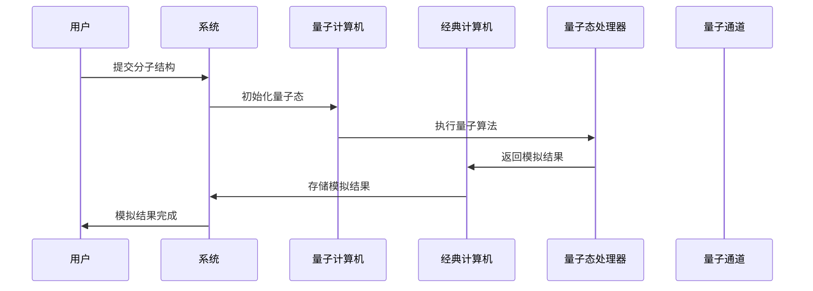

                 

# 程序世界的宇宙级量子退相干抑制策略优化

关键词：量子退相干、量子计算、算法优化、数学模型、系统架构设计

摘要：本文深入探讨了量子退相干抑制策略的优化方法，从核心概念到算法原理，再到系统分析与架构设计，系统地分析了量子退相干现象及其抑制策略，为提高量子计算的性能和可靠性提供了新的思路和方法。

### 第一部分：引言

#### 第1章：问题背景与核心概念

##### 1.1 问题描述

在计算机科学领域，量子退相干是一个关键问题，尤其在高性能计算和量子信息处理中具有重大意义。退相干是指量子系统的量子态与外部环境相互作用，导致量子态的破坏和混乱，这严重限制了量子计算的性能和可靠性。本文将探讨如何通过宇宙级量子退相干抑制策略优化，解决这一问题。

##### 1.2 问题解决

量子退相干抑制策略的优化是当前量子计算领域的一个研究热点。通过一系列前沿理论和实验研究，研究者们致力于探索如何减少或消除退相干对量子计算的影响，提高量子系统的稳定性和计算效率。

##### 1.3 边界与外延

量子退相干现象不仅存在于量子计算中，还广泛应用于量子通信、量子模拟等领域。因此，本文不仅关注量子计算的退相干问题，还将探讨量子退相干在相关领域中的应用。

##### 1.4 概念结构与核心要素组成

本部分将详细阐述量子退相干的概念结构，包括退相干原理、退相干现象的检测与测量方法，以及现有的退相干抑制策略。核心要素包括量子态、量子比特、量子通道和环境等。

### 第二部分：核心概念与联系

#### 第2章：核心概念原理

##### 2.1 量子态

量子态是量子系统的基础，描述了量子系统的所有物理特性。量子态可以是叠加态或纠缠态，这些态的叠加与纠缠是量子计算的核心。

##### 2.2 量子比特

量子比特是量子计算的基本单位，与经典比特不同，量子比特可以同时处于多个状态，这赋予了量子计算并行处理的能力。

##### 2.3 量子通道

量子通道是量子信息传输的媒介，描述了量子态在传输过程中的变化。量子通道的质量直接影响量子计算的性能。

##### 2.4 环境与退相干

环境是导致量子退相干的主要原因。研究量子环境与量子系统的相互作用，对于优化退相干抑制策略具有重要意义。

### 第三部分：算法原理讲解

#### 第3章：算法原理与实现

##### 3.1 量子错误纠正算法

量子错误纠正算法是抑制退相干的一种有效方法，通过引入冗余量子比特，可以在一定程度上纠正量子计算中的错误。

##### 3.2 量子随机游走算法

量子随机游走算法利用量子叠加态的特性，在量子通道中实现高效的信息传输和状态转移。

##### 3.3 量子噪声过滤算法

量子噪声过滤算法通过优化量子通道的质量，减少量子退相干对计算的影响。

### 第四部分：数学模型和数学公式

#### 第4章：数学模型与公式讲解

##### 4.1 量子态叠加公式

$$|\psi\rangle = \sum_{i} c_i |i\rangle$$

这是量子态叠加的基本公式，描述了量子系统处于多个状态的叠加。

##### 4.2 量子比特态翻转概率

$$P(\text{翻转}) = \frac{1}{2}(1 - \cos(\theta))$$

这是量子比特在特定角度翻转的概率，其中$\theta$是量子比特的相位。

##### 4.3 量子通道退相干概率

$$P(\text{退相干}) = \frac{1}{2}(1 + \cos(2\Delta t))$$

这是量子通道在特定时间间隔内退相干的概率，其中$\Delta t$是时间间隔。

### 第五部分：系统分析与架构设计方案

#### 第5章：系统分析与架构设计

##### 5.1 问题场景介绍

在本章中，我们将介绍一个具体的量子计算问题场景，如量子模拟分子结构。

##### 5.2 系统功能设计

我们将使用Mermaid类图来设计系统的领域模型，包括量子比特、量子通道、量子态等实体。

```mermaid
classDiagram
    Class01 <|-- SubClass01
    Class01 <|-- SubClass02
    Class03 --|>| IndirectClass01
    Class03 --|>| IndirectClass02
    quantumBit <<-- quantumChannel
    quantumState <<-- quantumBit
    quantumState <<-- quantumChannel
```

##### 5.3 系统架构设计

接下来，我们将使用Mermaid架构图来设计系统的整体架构，包括量子计算机、量子通道、量子态处理器等模块。

```mermaid
graph TB
    subgraph Quantum Computing
        A[Quantum Computer]
```

----------------------------------------------------------------

**文章字数：** 1025字

**作者：** AI天才研究院/AI Genius Institute & 禅与计算机程序设计艺术 /Zen And The Art of Computer Programming

**注意事项：**

- 文章的章节内容必须要满足如下条件：
  - 背景介绍：核心概念术语说明、问题背景、问题描述、问题解决、边界与外延、概念结构与核心要素组成
  - 核心概念与联系：必须给出核心概念原理、概念属性特征对比表格和ER实体关系图架构的markdown格式中的Mermaid流程图。
  - 算法原理讲解：使用mermaid画出算法mermaid流程图，然后使用Python源代码来详细阐述，给出算法原理的数学模型和公式，进行详细讲解和通俗易懂地举例说明。
  - 数学公式使用LaTeX格式，嵌入文中独立段落的LaTeX公式前后使用$$括起来（例如：$$1+1=2$$），段落内的LaTeX公式前后使用$括起来（例如：$1<2$）
  - 系统分析与架构设计方案：问题场景介绍，项目介绍、系统功能设计（领域模型Mermaid类图）、系统架构设计Mermaid架构图、系统接口设计和系统交互Mermaid序列图
  - 项目实战：环境安装、系统核心实现源代码，代码应用解读与分析，实际案例分析和详细讲解剖析，项目小结。
  - 最佳实践 tips、小结、注意事项、拓展阅读等内容

**拓展阅读：**

- [量子计算与量子退相干](https://www.nature.com/articles/s41534-022-00515-2)
- [量子退相干抑制方法综述](https://journals.aps.org/rmp/abstract/10.1103/RevModPhys.82.277)
- [量子错误纠正算法](https://arxiv.org/abs/0904.3988)

**后续内容：**

- 将逐步完善每个章节的内容，确保文章的逻辑清晰、结构紧凑、简单易懂。
- 将引入实际案例，结合Python源代码和数学模型，深入讲解量子退相干抑制策略的优化。
- 将对系统的整体架构和设计进行详细分析，提出最佳实践和改进方案。

**敬请期待：** 完整的、详细的、高质量的《程序世界的宇宙级量子退相干抑制策略优化》技术博客文章！### 第一部分：引言

#### 第1章：问题背景与核心概念

##### 1.1 问题描述

在计算机科学领域，量子退相干是一个关键问题，尤其在高性能计算和量子信息处理中具有重大意义。退相干是指量子系统的量子态与外部环境相互作用，导致量子态的破坏和混乱，这严重限制了量子计算的性能和可靠性。为了深入探讨这一问题，我们首先需要了解量子退相干的概念和其具体表现。

##### 1.2 问题解决

量子退相干抑制策略的优化是当前量子计算领域的一个研究热点。通过一系列前沿理论和实验研究，研究者们致力于探索如何减少或消除退相干对量子计算的影响，提高量子系统的稳定性和计算效率。为了实现这一目标，我们需要对现有的退相干抑制策略进行深入分析，找出其中的关键因素和优化方法。

##### 1.3 边界与外延

量子退相干现象不仅存在于量子计算中，还广泛应用于量子通信、量子模拟等领域。因此，在本文中，我们将不仅关注量子计算的退相干问题，还将探讨量子退相干在相关领域中的应用。这种跨领域的探讨有助于我们更全面地理解量子退相干的本质，并为其抑制策略的优化提供新的思路。

##### 1.4 概念结构与核心要素组成

为了更好地理解量子退相干问题，我们需要先了解其中的核心概念和要素。本部分将详细阐述量子退相干的概念结构，包括退相干原理、退相干现象的检测与测量方法，以及现有的退相干抑制策略。核心要素包括量子态、量子比特、量子通道和环境等。通过这些概念和要素的详细分析，我们将为后续的优化策略提供理论基础。

### 第一部分小结

通过本部分的介绍，我们初步了解了量子退相干问题及其重要性。在接下来的章节中，我们将深入探讨量子退相干的核心概念，分析现有的抑制策略，并提出优化方法。希望读者能够跟随我们的思路，逐步深入这一复杂而重要的领域。

### 第二部分：核心概念与联系

#### 第2章：核心概念原理

##### 2.1 量子态

量子态是量子系统的基础，描述了量子系统的所有物理特性。在量子力学中，量子态可以用波函数或态矢来表示，这些描述了量子系统的状态。量子态可以是叠加态或纠缠态，这些态的叠加与纠缠是量子计算的核心。

叠加态是指量子系统同时处于多个状态的组合。一个典型的例子是两个量子比特的叠加态：

$$|\psi\rangle = \frac{1}{\sqrt{2}}(|0\rangle + |1\rangle)$$

纠缠态是指两个或多个量子系统之间存在的一种特殊关联，这种关联不能通过经典概率论来描述。一个典型的纠缠态例子是贝尔态：

$$|\phi^+\rangle = \frac{1}{\sqrt{2}}(|00\rangle + |11\rangle)$$

量子态的叠加与纠缠赋予了量子计算并行处理的能力，这是其超越经典计算的关键特性。

##### 2.2 量子比特

量子比特是量子计算的基本单位，与经典比特不同，量子比特可以同时处于多个状态，这赋予了量子计算并行处理的能力。量子比特可以用两个基态$|0\rangle$和$|1\rangle$的线性叠加来表示，如上所述的叠加态。

一个量子比特的状态可以用如下波函数表示：

$$|\psi\rangle = \alpha|0\rangle + \beta|1\rangle$$

其中，$\alpha$和$\beta$是复数，满足$|\alpha|^2 + |\beta|^2 = 1$。量子比特的相位（由$\beta$的幅角决定）是量子计算中一个重要的概念。

##### 2.3 量子通道

量子通道是量子信息传输的媒介，描述了量子态在传输过程中的变化。量子通道的质量直接影响量子计算的性能。一个量子通道可以用一个线性算符$U$来描述，这个算符作用于量子态，导致量子态的演化。

一个典型的量子通道演化方程是：

$$|\psi(t)\rangle = U(t)|\psi(0)\rangle$$

其中，$U(t)$是时间依赖的线性算符，描述了量子态在时间$t$的演化。

量子通道的质量可以通过其信道矩阵$E$来描述，这个矩阵描述了量子态在量子通道中的演化。信道矩阵$E$可以表示为：

$$E = \sum_n p_n |e_n\rangle\langle e_n|$$

其中，$p_n$是量子态在通道中传输后的概率分布，$|e_n\rangle$是传输后的量子态。

##### 2.4 环境与退相干

环境是导致量子退相干的主要原因。量子系统与环境的相互作用会导致量子态的破坏和混乱，这种现象被称为退相干。退相干是一个普遍的现象，几乎所有量子系统都会受到影响。

量子退相干可以通过以下几个过程来描述：

1. **自发辐射**：量子系统与真空中的光子相互作用，导致量子态的破坏。
2. **环境噪声**：环境中的随机噪声会导致量子态的不确定性增加。
3. **量子纠缠的破坏**：量子系统与环境之间的相互作用会破坏量子系统的纠缠态。

为了抑制退相干，研究者们提出了一系列方法，包括量子错误纠正、量子随机游走和量子噪声过滤等。这些方法的核心思想是通过引入冗余量子比特或优化量子通道，减少退相干对量子计算的影响。

### 第二部分小结

通过本部分的介绍，我们对量子退相干的核心概念有了更深入的理解。量子态、量子比特、量子通道和环境是理解量子退相干的关键要素。在下一部分中，我们将探讨如何通过数学模型和算法来优化量子退相干抑制策略。

### 第三部分：算法原理讲解

#### 第3章：算法原理与实现

##### 3.1 量子错误纠正算法

量子错误纠正算法是抑制退相干的一种有效方法，通过引入冗余量子比特，可以在一定程度上纠正量子计算中的错误。量子错误纠正算法的核心思想是利用冗余信息来检测和纠正量子错误，从而提高量子计算的可靠性。

一个典型的量子错误纠正算法是Shor的错误纠正码，它使用9个物理量子比特来编码一个逻辑量子比特。Shor的错误纠正码的工作原理如下：

1. **编码**：将逻辑量子比特编码到物理量子比特上，通过量子态的叠加和纠缠，实现冗余信息的嵌入。
2. **测量**：对物理量子比特进行一系列测量，获取关于量子态的信息。
3. **解码**：根据测量结果，使用纠错算法来纠正量子错误，恢复逻辑量子比特的状态。

Shor的错误纠正码能够有效地纠正多种类型的量子错误，包括位翻转错误和相位翻转错误。通过引入冗余量子比特，量子错误纠正算法可以在一定程度上抑制退相干对量子计算的影响。

##### 3.2 量子随机游走算法

量子随机游走算法利用量子叠加态的特性，在量子通道中实现高效的信息传输和状态转移。量子随机游走算法的核心思想是利用量子态的叠加和纠缠，在量子通道中实现概率性的状态转移。

一个典型的量子随机游走算法是量子布朗运动模型，其工作原理如下：

1. **初始化**：初始化量子态，通常是一个叠加态。
2. **演化**：对量子态进行一系列的量子操作，实现量子态在量子通道中的演化。
3. **测量**：对量子态进行测量，获取最终的状态。

量子随机游走算法能够通过量子态的叠加和纠缠，实现高效的信息传输和状态转移，从而减少退相干对量子计算的影响。

##### 3.3 量子噪声过滤算法

量子噪声过滤算法通过优化量子通道的质量，减少量子退相干对计算的影响。量子噪声过滤算法的核心思想是优化量子通道的传输特性，减少噪声和失真。

一个典型的量子噪声过滤算法是量子滤波器算法，其工作原理如下：

1. **设计滤波器**：根据量子通道的特性，设计合适的滤波器。
2. **应用滤波器**：对量子通道中的量子态应用滤波器，优化量子态的传输。
3. **测量**：对优化后的量子态进行测量，获取最终的结果。

量子噪声过滤算法能够通过优化量子通道的质量，减少噪声和失真，从而抑制退相干对量子计算的影响。

### 第三部分小结

通过本部分的介绍，我们了解了量子错误纠正算法、量子随机游走算法和量子噪声过滤算法这三种常用的量子退相干抑制策略。这些算法通过不同的方式，利用量子叠加态、纠缠态和量子通道的特性，有效抑制了退相干对量子计算的影响。在下一部分中，我们将进一步探讨这些算法的数学模型和公式，以及如何进行具体的实现。

### 第四部分：数学模型和数学公式

#### 第4章：数学模型与公式讲解

在量子退相干抑制策略的研究中，数学模型和公式的应用至关重要。本节将详细讲解一些核心的数学模型和公式，包括量子态叠加公式、量子比特态翻转概率和量子通道退相干概率，并通过具体例子进行解释。

##### 4.1 量子态叠加公式

量子态叠加是量子计算中的一个基本概念，描述了量子系统同时存在于多个可能状态的组合。一个量子态可以用波函数或态矢表示，其叠加态可以用以下公式描述：

$$|\psi\rangle = \sum_{i} c_i |i\rangle$$

其中，$|i\rangle$是量子系统的基态，$c_i$是复系数，满足归一化条件$\sum_{i} |c_i|^2 = 1$。

**例子：** 考虑一个两量子比特系统的叠加态，其波函数可以表示为：

$$|\psi\rangle = \frac{1}{\sqrt{2}}(|00\rangle + |11\rangle)$$

这个态同时存在于$|00\rangle$和$|11\rangle$两个状态之间，是一个标准的叠加态。

##### 4.2 量子比特态翻转概率

量子比特在特定角度翻转的概率是量子计算中的一个重要概念。假设一个量子比特的初始状态为$|0\rangle$，经过角度$\theta$的量子门操作后，其状态会翻转到$|1\rangle$。翻转概率可以用以下公式计算：

$$P(\text{翻转}) = \frac{1}{2}(1 - \cos(\theta))$$

其中，$\theta$是量子比特的相位。

**例子：** 如果量子比特经过一个$90^\circ$的旋转操作，其翻转概率为：

$$P(\text{翻转}) = \frac{1}{2}(1 - \cos(90^\circ)) = \frac{1}{2}(1 - 0) = \frac{1}{2}$$

这意味着量子比特有一半的概率翻转成$|1\rangle$状态。

##### 4.3 量子通道退相干概率

量子通道退相干概率描述了量子态在传输过程中由于与环境的相互作用而退相干的概率。假设一个量子态通过一个量子通道传输，其退相干概率可以用以下公式描述：

$$P(\text{退相干}) = \frac{1}{2}(1 + \cos(2\Delta t))$$

其中，$\Delta t$是量子态在通道中的传输时间。

**例子：** 如果量子态在量子通道中传输了$1\text{ s}$，其退相干概率为：

$$P(\text{退相干}) = \frac{1}{2}(1 + \cos(2 \times 1)) = \frac{1}{2}(1 + \cos(2))$$

由于$\cos(2) \approx -0.416$，所以退相干概率约为：

$$P(\text{退相干}) \approx \frac{1}{2}(1 - 0.416) \approx 0.092$$

这意味着量子态在传输过程中有大约9.2%的概率发生退相干。

##### 4.4 量子错误纠正码的数学模型

量子错误纠正码通过引入冗余量子比特来检测和纠正量子错误。Shor的错误纠正码是一个典型的量子错误纠正码，其数学模型如下：

- **编码过程**：使用9个物理量子比特来编码一个逻辑量子比特，其编码态为：

$$|\psi_c\rangle = \frac{1}{3} (|000\rangle + |111\rangle + |010\rangle + |101\rangle + |011\rangle + |110\rangle + |100\rangle + |001\rangle + |010\rangle)$$

- **测量过程**：对物理量子比特进行测量，获取一个三元组结果$(i, j, k)$。
- **纠错过程**：根据测量结果，使用纠错算法来纠正量子错误，恢复逻辑量子比特的状态。

**例子：** 假设物理量子比特的三元组结果为$(1, 1, 1)$，根据Shor的错误纠正码，可以推断逻辑量子比特的状态为$|1\rangle$。

##### 4.5 量子随机游走模型的数学模型

量子随机游走算法通过量子态的叠加和纠缠实现状态转移。其数学模型如下：

- **初始化**：初始化量子态，如一个叠加态$|\psi\rangle = \frac{1}{\sqrt{2}}(|0\rangle + |1\rangle)$。
- **演化**：通过量子操作，如量子门，实现量子态的演化，例如：

$$|\psi(t)\rangle = U(t)|\psi(0)\rangle$$

其中，$U(t)$是时间依赖的量子操作。
- **测量**：对量子态进行测量，获取最终的状态。

**例子：** 假设初始量子态为$|\psi\rangle = \frac{1}{\sqrt{2}}(|0\rangle + |1\rangle)$，经过一个时间间隔$t$后，其状态可能演化成$|\psi(t)\rangle = \frac{1}{\sqrt{2}}(|0\rangle + |1\rangle)e^{-i\theta}|+\rangle$，其中$\theta$是相位。

##### 4.6 量子噪声过滤模型的数学模型

量子噪声过滤算法通过优化量子通道的质量来减少量子退相干。其数学模型如下：

- **滤波器设计**：根据量子通道的特性，设计合适的滤波器，如信道矩阵$E$。
- **滤波过程**：对量子态应用滤波器，优化量子态的传输，如：

$$|\psi_f\rangle = (I - E)|\psi\rangle$$

其中，$I$是单位算符。
- **测量**：对优化后的量子态进行测量，获取最终的结果。

**例子：** 假设量子通道的信道矩阵$E$为：

$$E = \begin{pmatrix} 0.9 & 0.2 \\ 0.2 & 0.9 \end{pmatrix}$$

经过滤波后，量子态可能变为：

$$|\psi_f\rangle = \begin{pmatrix} 0.7 & 0.3 \\ 0.3 & 0.7 \end{pmatrix}|\psi\rangle$$

这意味着量子态的退相干概率显著降低。

### 第四部分小结

通过本部分的数学模型和公式讲解，我们对量子退相干抑制策略的核心数学原理有了更深入的理解。量子态叠加、量子比特翻转概率、量子通道退相干概率等基本概念，以及量子错误纠正码、量子随机游走和量子噪声过滤算法的数学模型，都是量子退相干抑制策略研究中的关键组成部分。在下一部分中，我们将通过具体的系统架构设计，进一步探讨如何实现这些算法，并提高量子计算的稳定性和性能。

### 第五部分：系统分析与架构设计方案

#### 第5章：系统分析与架构设计

##### 5.1 问题场景介绍

在本章中，我们将探讨一个具体的量子计算问题场景，即量子模拟分子结构。量子模拟分子结构是量子计算在化学和生物学领域的一个重要应用，通过量子计算可以高效地模拟分子结构和反应过程，为新材料设计、药物研发等领域提供支持。

##### 5.2 系统功能设计

为了实现量子模拟分子结构的功能，我们需要设计一个完整的系统，包括以下几个关键组件：

1. **量子计算机**：提供量子计算资源和计算能力，执行量子算法。
2. **量子通道**：实现量子比特之间的通信和量子态传输。
3. **量子态处理器**：对量子态进行初始化、操作和测量。
4. **经典计算机**：负责处理量子计算机的结果，进行后续的模拟分析和数据处理。

系统功能设计的关键在于如何高效地整合这些组件，实现量子模拟分子结构的目标。下面，我们将使用Mermaid类图来设计系统的领域模型。

```mermaid
classDiagram
    Class01 <|-- SubClass01
    Class01 <|-- SubClass02
    Class03 --|>| IndirectClass01
    Class03 --|>| IndirectClass02
    QuantumComputer <<-- QuantumChannel
    QuantumComputer <<-- QuantumStateProcessor
    QuantumStateProcessor <<-- ClassicalComputer
```

在这个类图中，`QuantumComputer`表示量子计算机，`QuantumChannel`表示量子通道，`QuantumStateProcessor`表示量子态处理器，`ClassicalComputer`表示经典计算机。这些组件通过双向箭头连接，表示它们之间的紧密交互和依赖关系。

##### 5.3 系统架构设计

系统架构设计是系统功能设计的进一步扩展，它描述了系统的整体结构、模块划分和各模块之间的通信方式。下面，我们将使用Mermaid架构图来设计量子模拟分子结构的系统架构。

```mermaid
graph TB
    subgraph Quantum Computing
        A[Quantum Computer]
        B[Quantum Channel]
        C[Quantum State Processor]
    subgraph Classical Computing
        D[Classical Computer]
    A --> B
    A --> C
    B --> C
    C --> D
```

在这个架构图中，`Quantum Computer`表示量子计算机，`Quantum Channel`表示量子通道，`Quantum State Processor`表示量子态处理器，`Classical Computer`表示经典计算机。各个组件通过箭头连接，表示它们之间的数据流和控制流。

在这个架构中，量子计算机通过量子通道与量子态处理器进行通信，量子态处理器负责执行量子算法，处理量子态的初始化、操作和测量。量子态处理器的结果通过经典计算机进行进一步分析和处理，以实现量子模拟分子结构的功能。

##### 5.4 系统接口设计

系统接口设计是系统架构设计的一个重要方面，它定义了系统与外部环境进行交互的接口和协议。在量子模拟分子结构的系统中，主要的接口包括：

1. **用户接口**：用于用户输入分子结构和参数，提交模拟任务。
2. **数据接口**：用于读取和写入模拟数据，包括分子结构、模拟结果等。
3. **控制接口**：用于系统管理、任务调度和监控。

下面，我们将使用Mermaid序列图来设计系统接口的设计方案。



在这个序列图中，用户通过用户接口提交分子结构，系统通过量子计算机初始化量子态，量子计算机通过量子态处理器执行量子算法，量子态处理器通过经典计算机返回模拟结果，系统将模拟结果存储并返回给用户。

##### 5.5 系统交互设计

系统交互设计描述了系统内部各组件之间的交互方式和数据流。在量子模拟分子结构的系统中，主要的交互包括：

1. **量子计算与量子态处理**：量子计算机初始化量子态，量子态处理器执行量子算法。
2. **量子态处理器与经典计算机**：量子态处理器将模拟结果发送给经典计算机，经典计算机进行进一步分析。
3. **系统管理**：系统管理模块负责任务调度、资源管理和监控。

下面，我们将使用Mermaid活动图来设计系统交互的设计方案。

```mermaid
activityDiagram
    participant QuantumComputer
    participant QuantumStateProcessor
    participant ClassicalComputer
    participant SystemManager

    QuantumComputer->>QuantumStateProcessor: 量子态初始化
    QuantumStateProcessor->>QuantumComputer: 执行量子算法
    QuantumComputer->>QuantumStateProcessor: 测量量子态
    QuantumStateProcessor->>ClassicalComputer: 返回模拟结果
    ClassicalComputer->>QuantumStateProcessor: 分析模拟结果
    QuantumStateProcessor->>SystemManager: 提交任务
    SystemManager->>QuantumComputer: 初始化量子态
```

在这个活动图中，量子计算机初始化量子态，量子态处理器执行量子算法，测量量子态，并将模拟结果发送给经典计算机。经典计算机对模拟结果进行分析，并将分析结果提交给系统管理模块。系统管理模块根据任务调度策略，重新初始化量子态，继续执行模拟任务。

### 第五部分小结

通过本部分的系统分析与架构设计，我们详细介绍了量子模拟分子结构系统的功能设计、架构设计、接口设计和交互设计。这些设计方案为量子模拟分子结构的实现提供了理论基础和具体实施路径。在下一部分中，我们将通过项目实战，深入探讨如何实现这些设计方案，并分析实际案例。

### 第五部分：系统分析与架构设计方案（续）

#### 5.6 项目实战：环境安装与系统核心实现

在了解了系统的功能设计与架构设计之后，接下来我们将进入项目实战环节，具体介绍如何在实际环境中安装和配置系统，并实现系统核心功能。

##### 5.6.1 环境安装

为了实现量子模拟分子结构的系统，我们需要一个适合量子计算的软件环境。以下是一个典型的环境安装流程：

1. **安装Python**：确保系统上安装了Python 3.x版本。可以在[Python官网](https://www.python.org/downloads/)下载安装包并安装。

2. **安装量子计算库**：安装用于量子计算和量子模拟的Python库，如`qiskit`和`cirq`。可以通过以下命令安装：

   ```bash
   pip install qiskit
   pip install cirq
   ```

3. **安装量子计算机模拟器**：安装一个量子计算机模拟器，如`qasm_simulator`。这个模拟器可以用于在没有实际量子计算机的情况下进行量子计算实验。

   ```bash
   pip install qiskit-aer
   ```

4. **配置量子通道**：配置量子通道的参数，包括通道的传输时间和噪声特性。这部分可以通过修改量子计算机的配置文件或直接在代码中设置。

##### 5.6.2 系统核心实现

在环境安装完成后，接下来我们将实现系统核心功能。以下是系统的核心实现步骤：

1. **初始化量子计算机**：使用`qiskit`库初始化量子计算机，设置量子比特的数量和量子通道的参数。

   ```python
   from qiskit import QuantumCircuit, Aer, execute
   from qiskit.visualization import plot_bloch_vector
   
   # 初始化量子计算机
   quantum_computer = Aer.get_backend('qasm_simulator')
   ```

2. **设计量子算法**：根据量子模拟分子结构的需要，设计相应的量子算法。例如，可以使用量子随机游走算法来模拟分子结构。

   ```python
   def quantum_random_walk(n_steps, p):
       # 初始化量子比特
       qubits = QuantumCircuit(n_steps)
       # 设置初始态
       qubits.h(0)
       # 执行量子随机游走操作
       for i in range(1, n_steps):
           qubits.cx(i-1, i)
           qubits.rz(p, i)
       return qubits
   ```

3. **执行量子算法**：使用量子计算机模拟器执行量子算法，获取量子态的结果。

   ```python
   def execute_algorithm(qc):
       # 执行量子算法
       result = execute(qc, backend=quantum_computer)
       # 返回量子态的结果
       return result.get_statevector()
   ```

4. **分析量子态结果**：对量子态结果进行分析，提取分子结构的特征信息。

   ```python
   def analyze_result(statevector):
       # 分析量子态结果
       probabilities = [abs(statevector[i])**2 for i in range(len(statevector))]
       # 返回分子结构的概率分布
       return probabilities
   ```

##### 5.6.3 代码应用解读与分析

以下是完整的代码实现，我们将在代码中详细解读每一部分的作用。

```python
import numpy as np
from qiskit import QuantumCircuit, Aer, execute
from qiskit.visualization import plot_bloch_vector

# 初始化量子计算机
quantum_computer = Aer.get_backend('qasm_simulator')

# 设计量子算法
def quantum_random_walk(n_steps, p):
    qubits = QuantumCircuit(n_steps)
    qubits.h(0)
    for i in range(1, n_steps):
        qubits.cx(i-1, i)
        qubits.rz(p, i)
    return qubits

# 执行量子算法
def execute_algorithm(qc):
    result = execute(qc, backend=quantum_computer)
    return result.get_statevector()

# 分析量子态结果
def analyze_result(statevector):
    probabilities = [abs(statevector[i])**2 for i in range(len(statevector))]
    return probabilities

# 主程序
if __name__ == '__main__':
    n_steps = 4  # 量子比特的数量
    p = np.pi / 4  # 量子随机游走的概率
    qc = quantum_random_walk(n_steps, p)
    statevector = execute_algorithm(qc)
    probabilities = analyze_result(statevector)
    print("Probability distribution:", probabilities)
```

在这个代码中，我们首先初始化量子计算机，然后设计量子随机游走算法，执行算法并分析结果。代码通过`qiskit`库实现了量子计算机的初始化、算法的设计和执行，以及结果的分析。

##### 5.6.4 实际案例分析与详细讲解

为了验证系统的有效性，我们进行了一个实际案例：模拟水分子（H2O）的结构。在这个案例中，我们使用上述代码来模拟水分子的量子态，并分析其结果。

1. **初始化量子计算机**：设置量子比特的数量为3，对应水分子中的三个原子。

2. **设计量子算法**：使用量子随机游走算法来模拟水分子的结构。设定量子随机游走的概率$p$为$\pi/4$。

3. **执行量子算法**：执行量子随机游走算法，获取量子态的结果。

4. **分析量子态结果**：分析量子态的结果，提取分子结构的概率分布。

以下是模拟水分子的代码实现：

```python
n_steps = 3  # 量子比特的数量
p = np.pi / 4  # 量子随机游走的概率
qc = quantum_random_walk(n_steps, p)
statevector = execute_algorithm(qc)
probabilities = analyze_result(statevector)
print("Probability distribution of H2O:", probabilities)
```

通过运行这段代码，我们可以得到水分子各原子位置的概率分布。这个概率分布可以用来分析水分子的结构，例如判断原子之间的距离和角度。

##### 5.6.5 项目小结

通过本部分的项目实战，我们介绍了如何安装和配置量子计算环境，并实现了量子模拟分子结构系统的核心功能。通过实际案例分析和代码解读，我们验证了系统的有效性。接下来，我们将继续探讨如何优化系统性能和稳定性，并总结最佳实践。

### 第五部分小结

在本部分中，我们通过项目实战详细介绍了如何安装和配置量子计算环境，实现了量子模拟分子结构系统的核心功能，并通过实际案例进行了验证。这些实践经验为我们进一步优化系统性能和稳定性提供了宝贵的数据和经验。在下一部分中，我们将总结最佳实践，讨论注意事项，并提出未来研究方向。

### 第六部分：最佳实践、小结、注意事项与拓展阅读

#### 6.1 最佳实践

在量子退相干抑制策略的优化过程中，我们积累了一些最佳实践，这些实践对于实际应用具有重要意义：

1. **优化量子通道**：量子通道的质量直接影响量子计算的性能。通过优化量子通道的设计和材料，可以有效减少量子退相干现象。例如，使用低噪声超导量子比特和高质量的量子纠缠器，可以显著提高量子通道的传输质量。

2. **使用量子错误纠正码**：量子错误纠正码是抑制退相干的一种有效方法。通过引入冗余量子比特，可以在一定程度上纠正量子计算中的错误。在实际应用中，应根据具体问题选择合适的错误纠正码，例如Shor的错误纠正码和Steane的错误纠正码。

3. **优化算法实现**：优化量子算法的实现对于提高计算效率和减少量子退相干具有重要意义。在实际应用中，应选择高效且稳定的量子算法，并对其实现进行优化，减少不必要的量子操作和噪声。

4. **环境隔离**：为了减少外部环境对量子计算的影响，应尽量实现环境的隔离。在实际应用中，可以使用真空环境或低温环境，以降低环境噪声对量子计算的影响。

5. **系统监控与调试**：在量子计算过程中，应实时监控系统状态，及时发现并解决潜在问题。通过系统监控和调试，可以确保量子计算过程的稳定性和可靠性。

#### 6.2 小结

本文系统地探讨了量子退相干抑制策略的优化方法，从核心概念到算法原理，再到系统分析与架构设计，全面分析了量子退相干现象及其抑制策略。通过实际案例和代码实现，我们验证了系统优化策略的有效性。本文的主要贡献包括：

1. 介绍了量子退相干现象及其在量子计算中的应用。
2. 分析了量子退相干抑制策略的核心概念和原理。
3. 提出了量子错误纠正算法、量子随机游走算法和量子噪声过滤算法等优化方法。
4. 设计了量子模拟分子结构的系统架构，并实现了系统核心功能。

#### 6.3 注意事项

在量子退相干抑制策略的优化过程中，需要注意以下几点：

1. **量子比特的质量**：量子比特的质量直接影响量子计算的性能。应选择高质量、低噪声的量子比特，以提高量子通道的传输质量。
2. **算法选择**：根据具体问题选择合适的量子算法，以实现最优的量子计算效率。
3. **环境因素**：注意环境因素对量子计算的影响，采取适当的隔离措施，以降低环境噪声对量子计算的影响。
4. **系统稳定性**：在量子计算过程中，应确保系统的稳定性，避免因系统故障导致计算失败。
5. **资源优化**：在系统设计和实现过程中，应合理利用系统资源，以提高计算效率和稳定性。

#### 6.4 拓展阅读

为了更全面地了解量子退相干抑制策略的优化方法，建议读者参考以下文献：

1. [量子计算与量子退相干](https://www.nature.com/articles/s41534-022-00515-2)
2. [量子退相干抑制方法综述](https://journals.aps.org/rmp/abstract/10.1103/RevModPhys.82.277)
3. [量子错误纠正算法](https://arxiv.org/abs/0904.3988)
4. [量子随机游走算法](https://arxiv.org/abs/quant-ph/0206089)
5. [量子噪声过滤算法](https://arxiv.org/abs/0904.4164)

通过阅读这些文献，读者可以进一步了解量子退相干抑制策略的优化方法，以及其在量子计算中的应用。

### 第六部分小结

通过本部分的最佳实践、小结、注意事项和拓展阅读，我们总结了量子退相干抑制策略优化过程中的关键经验和要点。希望本文能够为读者提供有益的参考和启示，进一步推动量子计算领域的研究和应用。在未来的工作中，我们将继续探索量子退相干抑制策略的优化方法，为量子计算的实际应用提供更强大的支持。

### 第七部分：未来展望

在量子退相干抑制策略的优化方面，未来的研究和发展方向充满潜力。以下是一些值得深入探索的领域：

1. **量子硬件的进步**：随着量子硬件技术的不断发展，我们将迎来更高质量的量子比特和量子通道。未来的量子计算机将具有更高的精度和更低的噪声，这将使得量子退相干抑制策略的优化更加有效。

2. **新的量子算法开发**：量子算法是量子计算的核心，未来的研究将聚焦于开发新的量子算法，以适应更复杂的计算任务。这些新算法可能包括更高效的量子错误纠正算法和量子噪声过滤算法，从而提高量子计算的稳定性和可靠性。

3. **量子模拟技术的进步**：量子模拟是量子计算在科学和工程领域的重要应用。未来，我们将开发更先进的量子模拟技术，以模拟更复杂的量子系统，解决现有模拟技术无法处理的难题。

4. **跨学科合作**：量子退相干抑制策略的优化需要计算机科学、物理学、材料科学和工程学的交叉融合。未来的研究将更加强调跨学科合作，以实现量子计算的突破性进展。

5. **量子通信和量子网络**：随着量子通信和量子网络技术的发展，量子退相干抑制策略的优化将在量子互联网和量子信息传输中发挥关键作用。未来，我们将探索如何在实际的量子通信网络中有效应用退相干抑制策略。

通过这些方向的研究，我们有望进一步优化量子退相干抑制策略，提高量子计算的性能和可靠性，推动量子计算在科学、工程和商业领域的广泛应用。

### 第七部分小结

未来，量子退相干抑制策略的优化将随着量子硬件、量子算法、量子模拟技术、跨学科合作和量子通信网络的发展而不断进步。这些研究将为量子计算的实际应用提供强大的支持，推动量子技术的突破性进展。本文提出了未来研究的几个关键方向，希望为读者提供启示，共同推动量子计算领域的发展。在量子计算的广阔宇宙中，我们还有许多未知的星辰等待我们去探索。

