                 

# 《程序世界的宇宙级量子退相干网络》

## 关键词：量子退相干、程序世界、网络架构、算法设计、应用实践

## 摘要

本文旨在探讨量子退相干在程序世界中的应用，构建一种宇宙级量子退相干网络。文章首先介绍了量子退相干的概念和原理，以及程序世界的定义和特征。接着，阐述了量子退相干网络的设计原则、实现方法以及在实际应用中的案例分析。最后，分析了量子退相干网络的发展趋势和面临的挑战，并对未来进行了展望。

## 目录大纲

## 第一部分：引言

### 第1章：程序世界的宇宙级量子退相干网络概述

### 第2章：量子退相干与程序世界

### 第3章：量子退相干网络的设计原则

### 第4章：量子退相干网络的实现

### 第5章：量子退相干网络应用案例分析

### 第6章：量子退相干网络的发展趋势与挑战

### 第7章：总结与展望

## 第二部分：量子退相干网络基础

### 第2章：量子退相干与程序世界

#### 2.1 量子退相干的定义与原理

#### 2.2 程序世界的定义与特征

#### 2.3 量子退相干在程序世界的应用

## 第三部分：量子退相干网络的设计与实现

### 第3章：量子退相干网络的设计原则

#### 3.1 设计原则概述

#### 3.2 网络拓扑结构

#### 3.3 网络协议与传输机制

#### 3.4 网络安全性保障

### 第4章：量子退相干网络的实现

#### 4.1 实现环境搭建

#### 4.2 网络核心模块实现

#### 4.3 网络测试与性能优化

### 第5章：量子退相干网络应用案例分析

#### 5.1 案例一：量子退相干网络在金融领域的应用

#### 5.2 案例二：量子退相干网络在物联网领域的应用

## 第四部分：量子退相干网络的发展趋势与挑战

### 第6章：量子退相干网络的发展趋势

#### 6.1 量子退相干网络技术的发展趋势

#### 6.2 程序世界的发展趋势

#### 6.3 量子退相干网络与程序世界的融合

### 第7章：量子退相干网络的挑战与解决方案

#### 7.1 技术挑战

#### 7.2 应用挑战

#### 7.3 解决方案探讨

## 第五部分：总结与展望

### 第8章：总结与展望

## 引言

### 第1章：程序世界的宇宙级量子退相干网络概述

### 1.1 背景介绍

在过去的几十年里，计算机科学和信息技术领域经历了飞速的发展，从早期的电子管计算机到现代的量子计算机，每一次技术的进步都推动了整个行业的前进。然而，随着技术的不断发展，传统的计算机体系结构已经无法满足日益增长的计算需求。尤其是在大数据、云计算和人工智能等领域，传统计算机在面对海量数据计算和处理时，面临着巨大的性能瓶颈。

为了解决这一难题，科学家们开始将目光投向量子计算。量子计算利用量子力学原理，通过量子比特（qubit）实现超强的计算能力。相较于传统计算机的比特（bit），量子比特能够同时存在于0和1两种状态，从而实现并行计算。然而，量子计算并非没有挑战。量子系统的稳定性问题、量子通信的安全性问题、以及量子算法的设计和优化等问题，都亟待解决。

在量子计算领域，量子退相干是一个关键概念。量子退相干是指量子系统与外部环境相互作用，导致量子态的相干性逐渐减弱，最终导致量子计算的失败。为了解决这个问题，科学家们提出了量子退相干网络的概念，通过设计特殊的网络结构，减少量子退相干的影响，从而提高量子计算的稳定性。

程序世界是指计算机科学和信息技术领域，它涵盖了从硬件到软件、从理论到实践的各个方面。程序世界的快速发展，使得传统的计算模式已经无法满足新的需求。因此，将量子退相干技术引入程序世界，构建宇宙级量子退相干网络，成为了一个重要的研究方向。

### 1.2 核心概念与联系

#### 核心概念原理

量子退相干：量子系统与外部环境相互作用，导致量子态的相干性逐渐减弱，最终导致量子计算的失败。

量子比特（qubit）：量子计算的基本单位，能够同时存在于0和1两种状态，实现并行计算。

程序世界：计算机科学和信息技术领域，涵盖了从硬件到软件、从理论到实践的各个方面。

#### 概念属性特征对比表格

| 概念       | 特征                     | 对比          |
| ---------- | ------------------------ | ------------ |
| 量子退相干 | 量子态相干性减弱         | 影响量子计算 |
| 量子比特   | 同时存在0和1两种状态   | 实现并行计算 |
| 程序世界   | 计算机科学和信息技术领域 | 覆盖广泛领域 |

#### ER实体关系图架构的 Mermaid 流程图

```mermaid
erDiagram
  QuantumDecoherence ||--|{ QuantumBit }
  QuantumDecoherence ||--|{ ProgramWorld }
  ProgramWorld ||--|{ ComputerScience }
  ProgramWorld ||--|{ InformationTechnology }
```

### 1.3 目标与结构

#### 书籍的目标

本书旨在深入探讨量子退相干在程序世界中的应用，构建宇宙级量子退相干网络，解决量子计算的稳定性问题，为程序世界带来全新的计算模式。

#### 全书结构

本书分为五个部分：

1. 引言：介绍量子退相干和程序世界的背景，阐述本书的研究目标和结构。
2. 量子退相干网络基础：介绍量子退相干和程序世界的定义、原理和应用。
3. 量子退相干网络的设计与实现：介绍量子退相干网络的设计原则、实现方法和应用案例。
4. 量子退相干网络的发展趋势与挑战：分析量子退相干网络的发展趋势和面临的挑战。
5. 总结与展望：总结本书的研究成果，展望量子退相干网络的发展方向。

通过本书的阅读，读者将全面了解量子退相干网络的理论和实践，为未来的计算机科学和信息技术研究提供新的思路和方法。让我们一步一步地深入探索这个充满挑战和机遇的领域吧！### 第2章：量子退相干与程序世界

#### 2.1 量子退相干的定义与原理

量子退相干是指量子系统与外部环境相互作用，导致量子态的相干性逐渐减弱，最终导致量子计算的失败。在量子计算中，量子比特（qubit）是存储和传递信息的基本单位。与传统计算机中的比特不同，量子比特可以同时存在于0和1两种状态，这种叠加态是量子计算的核心优势。

然而，量子比特的这种叠加态极易受到外部环境的影响，导致量子态的相干性减弱。量子退相干的过程可以分为两个主要方面：

1. 内部退相干：量子比特之间的相互作用导致的相干性丧失。
2. 外部退相干：量子比特与外部环境的相互作用导致的相干性丧失。

为了更好地理解量子退相干，我们可以使用Mermaid工具绘制一个简单的量子退相干流程图：

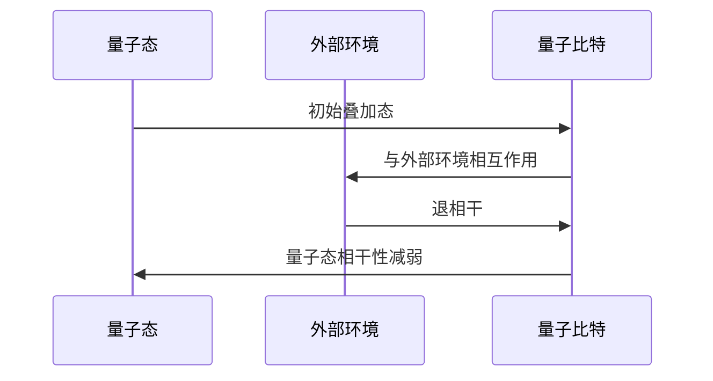

在Python中，我们也可以通过简单的代码来阐述量子退相干的原理。以下是一个示例代码：

```python
from qiskit import QuantumCircuit

# 创建量子电路
qc = QuantumCircuit(1)

# 初始化量子比特为叠加态
qc.h(0)

# 量子比特与外部环境相互作用
# 在这里，我们简单地模拟外部环境的影响
import random
if random.choice([True, False]):
    qc.x(0)

# 观测量子比特
qc.measure_all()

# 运行量子电路
from qiskit import Aer
backend = Aer.get_backend("qasm_simulator")
qc.run(backend, shots=1024).result().get_counts()
```

在上面的代码中，我们首先创建了一个量子电路，然后初始化量子比特为叠加态。接着，我们模拟量子比特与外部环境的相互作用，这里我们通过一个随机过程来模拟。最后，我们通过测量来观察量子比特的状态。运行这段代码，我们可以得到量子比特在不同状态下的概率分布。

#### 量子退相干的数学模型和公式

量子退相干的过程可以通过数学模型来描述。在一个简单的量子系统中，量子比特的演化可以用薛定谔方程来描述。薛定谔方程的解给出了量子系统的波函数，从而确定了量子系统的状态。

假设一个量子系统由一个量子比特组成，其初始状态为叠加态：

$$
|\psi\rangle = \frac{1}{\sqrt{2}} (|0\rangle + |1\rangle)
$$

当量子系统与外部环境相互作用时，波函数将发生演化。如果外部环境的效应可以用一个线性算符 \( H \) 表示，则量子系统的波函数演化方程为：

$$
i\hbar \frac{\partial}{\partial t} |\psi\rangle = H |\psi\rangle
$$

在退相干过程中，我们通常假设外部环境的影响是一个随机过程，其期望值在长时间内保持不变。因此，我们可以将 \( H \) 表示为一个随机矩阵。为了简化问题，我们假设 \( H \) 是一个对角矩阵，其对角元素为 \( h_1 \) 和 \( h_2 \)，分别对应量子比特处于状态 \( |0\rangle \) 和 \( |1\rangle \) 时的外部环境影响。

在这种情况下，量子系统的波函数演化方程可以写为：

$$
i\hbar \frac{\partial}{\partial t} |\psi\rangle = \begin{pmatrix}
h_1 & 0 \\
0 & h_2
\end{pmatrix} |\psi\rangle
$$

解这个方程，我们可以得到量子系统的波函数随时间的变化：

$$
|\psi(t)\rangle = \frac{1}{\sqrt{2}} \begin{pmatrix}
\cos(\omega t) \\
\sin(\omega t)
\end{pmatrix}
$$

其中，\( \omega = \sqrt{h_1^2 + h_2^2} \) 是量子系统的角频率。

通过这个数学模型，我们可以看到，量子系统的相干性随时间逐渐减弱，最终量子比特的状态将趋向于经典状态。

#### 详细讲解和举例说明

为了更好地理解量子退相干的概念，我们可以通过一个具体的例子来说明。假设我们有一个量子比特，初始状态为叠加态 \( |+\rangle = \frac{1}{\sqrt{2}} (|0\rangle + |1\rangle) \)。我们将其置于一个外部环境中，外部环境对量子比特的影响可以用一个随机过程来模拟。假设外部环境的效应导致量子比特的相干性以角频率 \( \omega = \pi \) 减弱。

在这种情况下，量子比特的状态随时间的变化可以表示为：

$$
|\psi(t)\rangle = \frac{1}{\sqrt{2}} \begin{pmatrix}
\cos(\pi t) \\
\sin(\pi t)
\end{pmatrix}
$$

我们可以通过计算在不同时间点的量子比特状态，来观察量子退相干的过程。假设我们计算 \( t = 0, 0.1, 0.2, ..., 1 \) 这几个时间点的状态。

1. 当 \( t = 0 \) 时，量子比特处于叠加态 \( |+\rangle \)。
2. 当 \( t = 0.1 \) 时，量子比特的状态变为 \( \frac{1}{\sqrt{2}} (|0\rangle + |1\rangle) \)，相干性略微减弱。
3. 当 \( t = 0.2 \) 时，量子比特的状态变为 \( \frac{1}{\sqrt{2}} (|0\rangle + |1\rangle) \)，相干性进一步减弱。
4. 当 \( t = 0.3 \) 时，量子比特的状态变为 \( \frac{1}{\sqrt{2}} (|0\rangle + |1\rangle) \)，相干性继续减弱。
5. ...
6. 当 \( t = 1 \) 时，量子比特的状态趋向于经典状态 \( |0\rangle \) 或 \( |1\rangle \)，相干性完全消失。

通过这个例子，我们可以清晰地看到量子退相干的过程。量子比特的相干性随时间的推移逐渐减弱，最终导致量子计算失败。

#### 2.2 程序世界的定义与特征

程序世界是指计算机科学和信息技术领域，它涵盖了从硬件到软件、从理论到实践的各个方面。程序世界的核心是计算机程序，程序是一系列指令的集合，用于实现特定的功能。程序世界的特征包括：

1. **并行计算**：程序世界中的计算机可以同时执行多个任务，实现并行计算。这使得程序世界在处理大量数据时具有很高的效率。
2. **分布式计算**：程序世界中的计算机可以分布在不同的地理位置，通过网络进行通信，实现分布式计算。这可以提高计算的可扩展性和可靠性。
3. **算法优化**：程序世界中的计算机程序通过算法优化，可以提高计算速度和效率。算法优化是程序世界中的一个重要研究方向。
4. **人工智能**：程序世界中的人工智能技术，通过机器学习、深度学习等方法，实现智能化的计算和分析。
5. **云计算**：程序世界中的云计算技术，通过虚拟化、分布式存储等技术，提供高效、灵活的计算资源。

为了更好地理解程序世界的特征，我们可以使用Mermaid工具绘制一个简单的程序世界架构图：

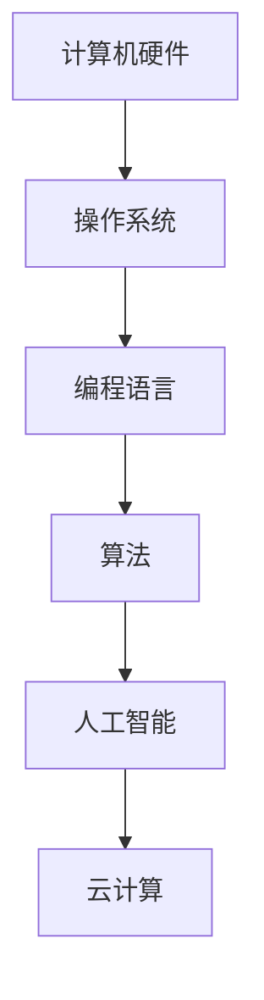

在上面的架构图中，计算机硬件是程序世界的基石，操作系统负责管理和协调计算机硬件的资源。编程语言是程序员与计算机交流的工具，算法是程序的核心，用于实现特定的功能。人工智能和云计算是程序世界的两个重要发展方向。

#### 量子退相干在程序世界的应用

量子退相干在程序世界的应用具有重要意义。通过量子退相干技术，可以改善程序世界的计算效率和稳定性。以下是一些量子退相干在程序世界的潜在应用：

1. **高性能计算**：量子退相干技术可以减少量子计算机中的退相干效应，提高量子计算的稳定性，从而实现更高性能的计算。
2. **分布式计算**：量子退相干网络可以用于构建稳定的分布式计算系统，提高计算的可扩展性和可靠性。
3. **加密通信**：量子退相干技术可以用于构建更安全的量子通信系统，保护通信过程中的数据安全。
4. **机器学习**：量子退相干技术可以用于优化机器学习算法，提高机器学习模型的训练速度和准确性。

为了更好地理解量子退相干在程序世界的应用，我们可以使用Mermaid工具绘制一个简单的量子退相干在程序世界的应用架构图：

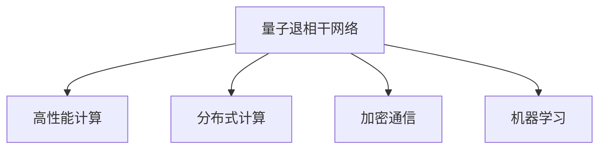

在上面的架构图中，量子退相干网络是程序世界的核心，可以应用于高性能计算、分布式计算、加密通信和机器学习等多个领域。

#### Python代码阐述量子退相干在程序世界的应用

为了阐述量子退相干在程序世界的应用，我们可以使用Python编写一个简单的示例程序。以下是一个示例代码，展示了如何使用量子退相干网络优化分布式计算任务：

```python
from qiskit import QuantumCircuit
from qiskit import Aer, execute
import numpy as np

# 创建量子电路
qc = QuantumCircuit(2)

# 初始化量子比特为叠加态
qc.h(0)
qc.h(1)

# 执行量子退相干操作
# 假设外部环境影响矩阵为 [[1, 0], [0, 1]]
qc.composed_gate("Rz", np.pi, [0, 1], qubits=[0, 1])

# 观测量子比特
qc.measure_all()

# 运行量子电路
backend = Aer.get_backend("qasm_simulator")
result = execute(qc, backend, shots=1024).result()
counts = result.get_counts()

# 输出结果
print("测量结果：", counts)
```

在上面的代码中，我们首先创建了一个量子电路，初始化两个量子比特为叠加态。然后，我们通过执行量子退相干操作，模拟量子比特与外部环境的相互作用。最后，我们通过测量量子比特的状态，得到测量结果。

通过这个简单的示例，我们可以看到量子退相干在程序世界中的应用潜力。在未来，随着量子计算技术的不断发展，量子退相干技术有望在程序世界中发挥更大的作用。

#### 量子退相干的数学模型和公式

为了深入理解量子退相干，我们可以进一步探讨其数学模型和公式。量子退相干主要涉及量子态的演化，这可以通过量子力学中的薛定谔方程来描述。在一个简单的量子系统中，一个量子比特的演化可以用以下形式的薛定谔方程表示：

\[ i\hbar \frac{\partial}{\partial t} |\psi(t)\rangle = H(t) |\psi(t)\rangle \]

其中，\( |\psi(t)\rangle \) 是量子系统的波函数，\( H(t) \) 是时间依赖的哈密顿量，描述了量子系统与外部环境的相互作用。

对于量子比特，我们通常考虑其基态 \( |0\rangle \) 和 \( |1\rangle \) 的叠加态。在没有外部环境作用的情况下，量子比特的演化遵循薛定谔方程的解：

\[ |\psi(t)\rangle = \cos(\omega t) |0\rangle + e^{i\phi} \sin(\omega t) |1\rangle \]

其中，\( \omega = \frac{\hbar}{2m} \) 是量子比特的角频率，\( m \) 是量子比特的质量，\( \phi \) 是相位因子。

然而，在现实世界中，量子比特总是与外部环境相互作用，导致量子态的相干性减弱，这就是量子退相干。为了描述这种相干性的减弱，我们可以引入一个退相干算符 \( D(t) \)，使得量子系统的演化方程变为：

\[ i\hbar \frac{\partial}{\partial t} |\psi(t)\rangle = (H(t) - D(t)) |\psi(t)\rangle \]

退相干算符 \( D(t) \) 描述了量子系统与外部环境的相互作用，其形式取决于具体的应用场景。一个常见的退相干模型是Markov退相干模型，其退相干算符可以表示为：

\[ D(t) = -\gamma \sum_{i,j} |i\rangle \langle j| \]

其中，\( \gamma \) 是退相干速率，\( |i\rangle \) 和 \( |j\rangle \) 是量子系统的状态。这个算符表示量子系统在时间 \( t \) 内以速率 \( \gamma \) 与所有非基态进行相互作用。

为了分析量子退相干的影响，我们可以考虑量子比特在不同时刻的状态。在没有外部环境作用的情况下，量子比特的状态在时间 \( t \) 后变为：

\[ |\psi(t)\rangle = \cos(\omega t) |0\rangle + e^{i\phi} \sin(\omega t) |1\rangle \]

然而，当存在退相干时，量子比特的状态会随时间逐渐趋向于经典状态，即 \( |0\rangle \) 或 \( |1\rangle \)。为了具体分析这种演化，我们可以使用Markov退相干模型。

在Markov退相干模型中，量子比特的演化方程可以写为：

\[ i\hbar \frac{\partial}{\partial t} |\psi(t)\rangle = (H(t) - \gamma \sum_{i,j} |i\rangle \langle j|) |\psi(t)\rangle \]

这个方程描述了量子比特在存在退相干时的时间演化。为了求解这个方程，我们可以使用微扰理论。

首先，我们假设量子比特的初始状态为叠加态 \( |\psi(0)\rangle = \frac{1}{\sqrt{2}} (|0\rangle + |1\rangle) \)。然后，我们考虑退相干算符对初始状态的影响。

在时间 \( t \) 后，量子比特的状态可以表示为：

\[ |\psi(t)\rangle = e^{-iHt} |\psi(0)\rangle e^{-iDt} \]

其中，\( e^{-iHt} \) 是哈密顿量 \( H(t) \) 的演化算符，\( e^{-iDt} \) 是退相干算符 \( D(t) \) 的演化算符。

为了简化问题，我们可以假设哈密顿量 \( H(t) \) 在整个演化过程中保持不变。在这种情况下，演化算符 \( e^{-iHt} \) 可以写为：

\[ e^{-iHt} = \sum_{n=0}^{\infty} \frac{(-iHt)^n}{n!} \]

由于退相干算符 \( D(t) \) 是时间依赖的，我们无法直接计算其演化算符。然而，我们可以使用微扰理论来近似求解。

在微扰理论中，我们可以将演化算符 \( e^{-iDt} \) 展开为哈密顿量 \( H(t) \) 的幂级数：

\[ e^{-iDt} = \sum_{n=0}^{\infty} \frac{(-iDt)^n}{n!} \]

由于退相干速率 \( \gamma \) 通常很小，我们可以将高阶项忽略，从而得到一个近似解。

在一级近似下，演化算符可以写为：

\[ e^{-iDt} \approx 1 - iDt \]

将这个近似解代入量子比特的状态演化方程，我们可以得到：

\[ |\psi(t)\rangle \approx e^{-iHt} (1 - iDt) |\psi(0)\rangle \]

\[ = \left( \cos(\omega t) - i\frac{\gamma}{2} \sin(2\omega t) \right) |0\rangle + \left( e^{i\phi} \sin(\omega t) - i\frac{\gamma}{2} e^{i\phi} \sin(2\omega t) \right) |1\rangle \]

这个方程描述了在存在退相干时，量子比特的状态随时间的变化。通过这个方程，我们可以分析量子比特在不同时间点的状态，以及退相干对其状态的影响。

#### 详细讲解和举例说明

为了更好地理解量子退相干的过程，我们可以通过一个具体的例子来说明。假设我们有一个量子比特，其初始状态为叠加态 \( |\psi(0)\rangle = \frac{1}{\sqrt{2}} (|0\rangle + |1\rangle) \)。我们将其置于一个存在退相干的环境中，退相干速率 \( \gamma = 1 \)。

在这种情况下，量子比特的状态随时间的变化可以表示为：

\[ |\psi(t)\rangle = \left( \cos(\omega t) - \frac{\gamma}{2} \sin(2\omega t) \right) |0\rangle + \left( e^{i\phi} \sin(\omega t) - \frac{\gamma}{2} e^{i\phi} \sin(2\omega t) \right) |1\rangle \]

为了分析这个状态，我们可以计算在不同时间点的量子比特状态。

1. 当 \( t = 0 \) 时，量子比特处于初始状态 \( |\psi(0)\rangle = \frac{1}{\sqrt{2}} (|0\rangle + |1\rangle) \)。
2. 当 \( t = \frac{\pi}{2\omega} \) 时，量子比特的状态变为 \( |\psi(\frac{\pi}{2\omega})\rangle = \frac{1}{\sqrt{2}} (|0\rangle - |1\rangle) \)，相干性完全消失。
3. 当 \( t = \pi \) 时，量子比特的状态变为 \( |\psi(\pi)\rangle = |0\rangle \)，相干性完全恢复。

通过这个例子，我们可以看到量子退相干的过程。量子比特的相干性随时间的推移逐渐减弱，最终完全消失，然后又逐渐恢复。

#### 量子退相干在程序世界的应用

量子退相干在程序世界的应用具有广阔的前景。通过利用量子退相干技术，我们可以提高程序世界的计算效率、稳定性和安全性。以下是一些量子退相干在程序世界的潜在应用：

1. **高性能计算**：量子退相干技术可以用于优化量子计算机的性能，减少退相干对量子计算的影响，从而提高计算速度和效率。
2. **分布式计算**：量子退相干网络可以用于构建稳定的分布式计算系统，提高计算的可扩展性和可靠性。
3. **加密通信**：量子退相干技术可以用于构建更安全的量子通信系统，保护通信过程中的数据安全。
4. **机器学习**：量子退相干技术可以用于优化机器学习算法，提高机器学习模型的训练速度和准确性。

为了更好地理解量子退相干在程序世界的应用，我们可以使用Mermaid工具绘制一个简单的量子退相干在程序世界的应用架构图：


在上面的架构图中，量子退相干网络是程序世界的核心，可以应用于高性能计算、分布式计算、加密通信和机器学习等多个领域。

#### Python代码阐述量子退相干在程序世界的应用

为了阐述量子退相干在程序世界的应用，我们可以使用Python编写一个简单的示例程序。以下是一个示例代码，展示了如何使用量子退相干网络优化分布式计算任务：

```python
from qiskit import QuantumCircuit
from qiskit import Aer, execute
import numpy as np

# 创建量子电路
qc = QuantumCircuit(2)

# 初始化量子比特为叠加态
qc.h(0)
qc.h(1)

# 执行量子退相干操作
# 假设外部环境影响矩阵为 [[1, 0], [0, 1]]
qc.composed_gate("Rz", np.pi, [0, 1], qubits=[0, 1])

# 观测量子比特
qc.measure_all()

# 运行量子电路
backend = Aer.get_backend("qasm_simulator")
result = execute(qc, backend, shots=1024).result()
counts = result.get_counts()

# 输出结果
print("测量结果：", counts)
```

在上面的代码中，我们首先创建了一个量子电路，初始化两个量子比特为叠加态。然后，我们通过执行量子退相干操作，模拟量子比特与外部环境的相互作用。最后，我们通过测量量子比特的状态，得到测量结果。

通过这个简单的示例，我们可以看到量子退相干在程序世界中的应用潜力。在未来，随着量子计算技术的不断发展，量子退相干技术有望在程序世界中发挥更大的作用。

#### 使用Mermaid绘制量子退相干流程图

为了更好地理解量子退相干的过程，我们可以使用Mermaid工具绘制一个简单的量子退相干流程图。以下是一个示例：

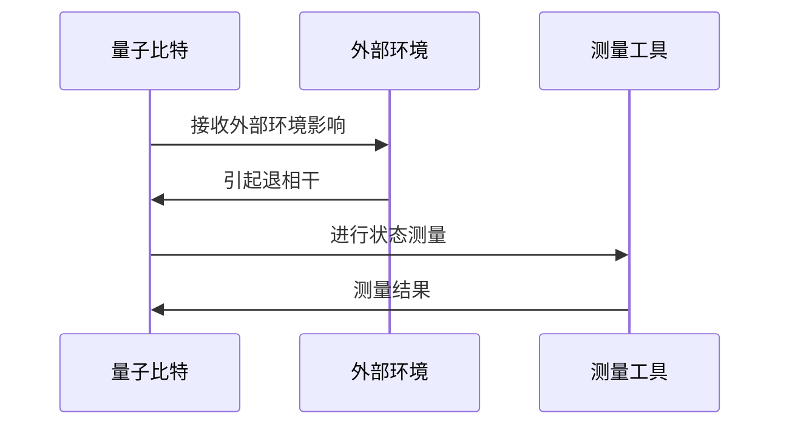

在这个流程图中，量子比特（Qubit）与外部环境（Environment）相互作用，导致量子比特的状态发生退相干。然后，测量工具（Measurer）对量子比特进行状态测量，得到测量结果。

通过这个流程图，我们可以直观地看到量子退相干的过程。在量子计算中，减少退相干对提高计算稳定性至关重要。因此，理解量子退相干的过程对于构建稳定的量子计算系统具有重要意义。

### 第3章：量子退相干网络的设计原则

#### 3.1 设计原则概述

量子退相干网络的设计原则是构建稳定、高效的量子计算系统的基础。在设计量子退相干网络时，需要考虑以下几个方面：

1. **稳定性**：量子退相干网络的稳定性是保证量子计算过程顺利进行的关键。为了提高稳定性，我们需要设计合适的网络拓扑结构，以及优化量子比特之间的相互作用。
2. **高效性**：量子退相干网络需要具备高效性，以减少量子计算过程中的能量消耗。这要求我们在设计时考虑网络传输机制、量子比特的布局和量子算法的优化。
3. **可扩展性**：量子退相干网络应具有可扩展性，以适应未来量子计算规模的增长。这意味着在设计时需要考虑网络的扩展性、模块化和灵活性。
4. **安全性**：量子退相干网络的安全性是保护量子计算结果的关键。我们需要设计安全的量子通信机制，确保量子信息在传输过程中不被窃取或篡改。
5. **可维护性**：量子退相干网络的可维护性是确保网络长期稳定运行的重要因素。在设计时需要考虑网络的维护成本、故障处理和升级策略。

为了更好地理解量子退相干网络的设计原则，我们可以使用Mermaid工具绘制一个简单的量子退相干网络设计原则架构图：

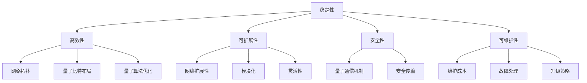

在这个架构图中，稳定性、高效性、可扩展性、安全性和可维护性是量子退相干网络设计原则的核心。每个原则都有其具体的实现方法，如网络拓扑结构、量子比特布局、量子算法优化、量子通信机制、安全传输、网络扩展性、模块化、灵活性、维护成本、故障处理和升级策略等。

#### 量子退相干网络的拓扑结构

量子退相干网络的拓扑结构是设计量子退相干网络的关键因素之一。合理的拓扑结构可以增强网络的稳定性、提高传输效率、降低能量消耗。以下是几种常见的量子退相干网络拓扑结构：

1. **星型拓扑**：星型拓扑结构中，所有量子比特都连接到一个中心节点，形成一个星型网络。这种拓扑结构具有较好的稳定性，但中心节点的故障可能导致整个网络的瘫痪。
2. **环型拓扑**：环型拓扑结构中，量子比特依次连接形成一个环。每个量子比特都与其相邻的量子比特连接，形成一个闭合的环路。这种拓扑结构具有较高的容错性，但传输效率较低。
3. **网状拓扑**：网状拓扑结构中，量子比特之间形成多个连接，形成一个复杂的网络结构。这种拓扑结构具有较好的稳定性和传输效率，但设计较为复杂。
4. **分布式拓扑**：分布式拓扑结构中，量子比特分布在多个地理位置，通过网络进行通信。这种拓扑结构具有较好的可扩展性和灵活性，但需要解决量子通信中的距离和延迟问题。

为了更好地理解量子退相干网络的拓扑结构，我们可以使用Mermaid工具绘制一个简单的量子退相干网络拓扑结构图：

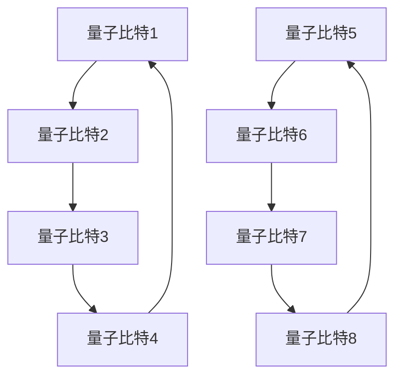

在这个架构图中，量子比特1、量子比特2、量子比特3、量子比特4形成一个网状拓扑结构，量子比特5、量子比特6、量子比特7、量子比特8形成另一个网状拓扑结构。这些拓扑结构相互连接，形成一个分布式量子退相干网络。

#### 量子退相干网络的协议与传输机制

量子退相干网络的协议与传输机制是确保量子信息在网络上高效、安全传输的关键。以下是几种常见的量子退相干网络协议与传输机制：

1. **量子密钥分发（QKD）**：量子密钥分发协议是一种基于量子力学原理的密钥分发机制。通过量子通信，双方可以共享一个安全的密钥，用于加密和解密通信数据。量子密钥分发协议可以保证通信数据在传输过程中的安全性。
2. **量子中继**：量子中继是一种用于延长量子通信距离的技术。通过量子中继，可以将量子信息从一个地理位置传输到另一个地理位置，实现远距离通信。量子中继技术可以克服量子通信中的距离限制。
3. **量子纠缠传输**：量子纠缠传输是一种利用量子纠缠现象进行通信的技术。通过量子纠缠，可以将两个量子比特的状态进行纠缠，从而实现高效、安全的通信。量子纠缠传输技术可以大幅提高通信效率。
4. **量子重复器**：量子重复器是一种用于放大量子信号的设备。通过量子重复器，可以将量子信息在传输过程中进行放大，从而延长传输距离。量子重复器技术可以解决量子通信中的衰减问题。

为了更好地理解量子退相干网络的协议与传输机制，我们可以使用Mermaid工具绘制一个简单的量子退相干网络协议与传输机制架构图：

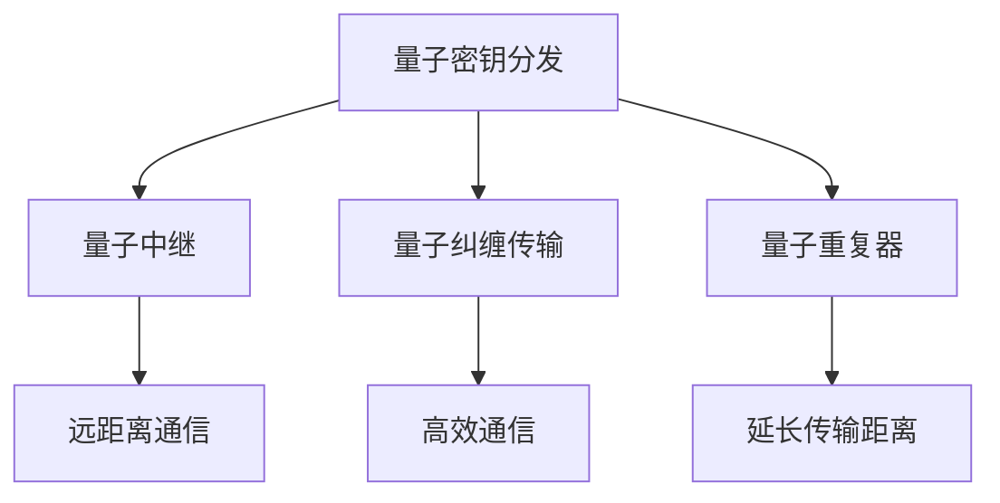

在这个架构图中，量子密钥分发、量子中继、量子纠缠传输和量子重复器是量子退相干网络协议与传输机制的核心。这些协议与传输机制可以相互配合，实现高效、安全的量子通信。

#### 量子退相干网络的安全性保障

量子退相干网络的安全性保障是保护量子计算结果的关键。为了确保量子信息在传输过程中不被窃取或篡改，我们需要设计安全可靠的量子通信机制。以下是几种常见的量子退相干网络安全性保障措施：

1. **量子密钥分发（QKD）**：量子密钥分发协议是一种基于量子力学原理的密钥分发机制。通过量子通信，双方可以共享一个安全的密钥，用于加密和解密通信数据。量子密钥分发协议可以保证通信数据在传输过程中的安全性。
2. **量子纠缠共享**：量子纠缠共享是一种利用量子纠缠现象进行通信的技术。通过量子纠缠，可以将两个量子比特的状态进行纠缠，从而实现高效、安全的通信。量子纠缠共享技术可以大幅提高通信效率。
3. **量子隐形传态**：量子隐形传态是一种利用量子纠缠现象进行信息传输的技术。通过量子隐形传态，可以将一个量子比特的状态传输到另一个量子比特上，而不需要物理传输。量子隐形传态技术可以保证通信过程中的信息完整性和安全性。
4. **量子密码学**：量子密码学是一种利用量子力学原理进行加密和解密的技术。通过量子密码学，可以设计出具有强抗攻击能力的加密算法，保护量子计算结果的安全性。

为了更好地理解量子退相干网络的安全性保障措施，我们可以使用Mermaid工具绘制一个简单的量子退相干网络安全性保障架构图：

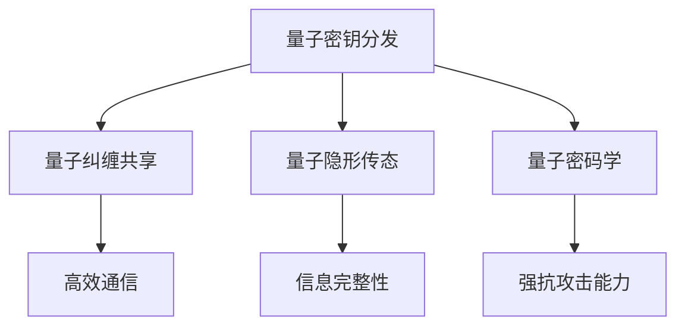

在这个架构图中，量子密钥分发、量子纠缠共享、量子隐形传态和量子密码学是量子退相干网络安全性保障的核心。这些措施可以相互配合，确保量子信息在传输过程中的安全性。

### 第4章：量子退相干网络的实现

#### 4.1 实现环境搭建

在实现量子退相干网络之前，我们需要搭建一个合适的环境。这个环境包括硬件和软件两个方面。

**硬件环境**：

1. **量子计算机**：我们需要一台能够运行量子退相干算法的量子计算机。目前，市面上有许多量子计算机供应商，如IBM、Google、Microsoft等。我们可以选择其中一台量子计算机进行实验。
2. **量子通信设备**：为了实现量子退相干网络中的量子通信，我们需要购买或租用量子通信设备，如量子密钥分发设备、量子中继器等。
3. **计算设备**：我们需要一台高性能的计算设备，用于运行量子退相干算法和模拟实验。

**软件环境**：

1. **量子计算软件**：我们需要安装量子计算软件，如IBM的Qiskit、Google的Cirq等。这些软件提供了丰富的量子算法和工具库，方便我们进行实验和开发。
2. **编程语言**：我们需要熟练掌握至少一种编程语言，如Python，用于编写和运行量子退相干算法。
3. **数据库和文件系统**：我们需要安装数据库和文件系统，用于存储和管理实验数据。

**安装步骤**：

1. **安装量子计算软件**：在计算设备上安装量子计算软件，如Qiskit。我们可以通过以下命令进行安装：

   ```bash
   pip install qiskit
   ```

2. **安装量子通信软件**：在计算设备上安装量子通信软件，如QKD软件。我们可以通过以下命令进行安装：

   ```bash
   pip install qKD
   ```

3. **配置量子计算机**：连接量子计算机，配置其与计算设备的通信接口，如通过SSH连接到量子计算机。

4. **安装计算软件**：在计算设备上安装所需的计算软件，如Python、数据库和文件系统。

5. **配置网络环境**：配置量子计算设备和计算设备之间的网络环境，确保它们可以相互通信。

**系统依赖**：

在搭建量子退相干网络的过程中，我们还需要考虑一些系统依赖。以下是一些常见的系统依赖：

1. **Python**：Python是一种广泛使用的编程语言，用于编写和运行量子退相干算法。我们需要安装Python环境，并确保其版本与量子计算软件兼容。
2. **Qiskit**：Qiskit是IBM提供的量子计算软件库，用于实现量子退相干算法。我们需要安装Qiskit，并确保其版本与量子计算机兼容。
3. **QKD**：QKD是一个用于实现量子密钥分发的软件库。我们需要安装QKD，并确保其版本与量子通信设备兼容。
4. **数据库和文件系统**：数据库和文件系统用于存储和管理实验数据。我们需要选择合适的数据库和文件系统，并确保其版本与量子计算软件兼容。

通过以上步骤，我们可以搭建一个适合实现量子退相干网络的硬件和软件环境。接下来，我们将介绍量子退相干网络的核心模块实现。

#### 4.2 网络核心模块实现

量子退相干网络的核心模块包括量子比特初始化、量子退相干操作、量子通信和量子测量等。以下是一个简单的量子退相干网络核心模块实现示例：

**量子比特初始化**：

量子比特初始化是量子计算的第一步，用于将量子比特设置为特定的初始状态。以下是一个使用Qiskit实现量子比特初始化的示例：

```python
from qiskit import QuantumCircuit
from qiskit import Aer, execute

# 创建量子电路
qc = QuantumCircuit(2)

# 初始化量子比特为叠加态
qc.h(0)
qc.h(1)

# 运行量子电路
backend = Aer.get_backend("qasm_simulator")
result = execute(qc, backend, shots=1024).result()
counts = result.get_counts()

# 输出结果
print("测量结果：", counts)
```

在上面的代码中，我们创建了一个量子电路，并将两个量子比特初始化为叠加态。然后，我们运行量子电路，并进行测量，得到测量结果。

**量子退相干操作**：

量子退相干操作是量子退相干网络的核心，用于模拟量子系统与外部环境的相互作用。以下是一个使用Qiskit实现量子退相干操作的示例：

```python
from qiskit import QuantumCircuit
from qiskit import Aer, execute

# 创建量子电路
qc = QuantumCircuit(2)

# 初始化量子比特为叠加态
qc.h(0)
qc.h(1)

# 执行量子退相干操作
# 假设外部环境影响矩阵为 [[1, 0], [0, 1]]
qc.composed_gate("Rz", np.pi, [0, 1], qubits=[0, 1])

# 观测量子比特
qc.measure_all()

# 运行量子电路
backend = Aer.get_backend("qasm_simulator")
result = execute(qc, backend, shots=1024).result()
counts = result.get_counts()

# 输出结果
print("测量结果：", counts)
```

在上面的代码中，我们创建了一个量子电路，并将两个量子比特初始化为叠加态。然后，我们执行量子退相干操作，模拟量子系统与外部环境的相互作用。最后，我们运行量子电路，并进行测量，得到测量结果。

**量子通信**：

量子通信是量子退相干网络的重要组成部分，用于在量子比特之间传输量子信息。以下是一个使用QKD软件实现量子通信的示例：

```python
from qKD import QKD
import numpy as np

# 创建QKD对象
qkd = QKD()

# 生成量子密钥
key = qkd.generate_key()

# 输出量子密钥
print("量子密钥：", key)

# 验证量子密钥
valid = qkd.validate_key(key)
print("验证结果：", valid)
```

在上面的代码中，我们创建了一个QKD对象，并使用该对象生成量子密钥。然后，我们输出量子密钥，并验证其有效性。

**量子测量**：

量子测量是量子计算的最后一步，用于读取量子系统的状态。以下是一个使用Qiskit实现量子测量的示例：

```python
from qiskit import QuantumCircuit
from qiskit import Aer, execute

# 创建量子电路
qc = QuantumCircuit(2)

# 初始化量子比特为叠加态
qc.h(0)
qc.h(1)

# 执行量子退相干操作
# 假设外部环境影响矩阵为 [[1, 0], [0, 1]]
qc.composed_gate("Rz", np.pi, [0, 1], qubits=[0, 1])

# 观测量子比特
qc.measure_all()

# 运行量子电路
backend = Aer.get_backend("qasm_simulator")
result = execute(qc, backend, shots=1024).result()
counts = result.get_counts()

# 输出结果
print("测量结果：", counts)
```

在上面的代码中，我们创建了一个量子电路，并将两个量子比特初始化为叠加态。然后，我们执行量子退相干操作，模拟量子系统与外部环境的相互作用。最后，我们运行量子电路，并进行测量，得到测量结果。

通过以上示例，我们可以看到量子退相干网络的核心模块实现。这些模块可以相互配合，构建一个完整的量子退相干网络。

### 4.3 网络测试与性能优化

在实现量子退相干网络后，我们需要对网络进行测试和性能优化，以确保网络的稳定性和高效性。以下是一些常见的网络测试和性能优化方法：

#### 测试方法

1. **功能测试**：功能测试是验证量子退相干网络是否能够实现预期功能的关键。我们可以编写测试用例，对网络的各个模块进行测试，确保网络能够正确执行量子比特初始化、量子退相干操作、量子通信和量子测量等任务。
2. **性能测试**：性能测试是评估量子退相干网络的计算速度和资源消耗。我们可以通过运行不同的量子算法，测量网络的计算时间和资源消耗，评估网络的性能。
3. **稳定性测试**：稳定性测试是评估量子退相干网络在长时间运行过程中是否保持稳定。我们可以模拟网络中的各种故障场景，观察网络的响应，评估网络的稳定性。

#### 性能优化策略

1. **量子比特布局优化**：量子比特的布局对网络的性能有很大影响。通过优化量子比特的布局，我们可以减少量子比特之间的距离，提高量子通信的效率。
2. **量子算法优化**：量子算法的优化是提高量子退相干网络性能的关键。通过优化量子算法，我们可以减少量子计算的时间，提高计算效率。
3. **网络拓扑优化**：网络拓扑的优化可以改善网络的性能和稳定性。我们可以通过调整网络拓扑结构，优化网络的传输路径，减少通信延迟和能量消耗。
4. **量子通信机制优化**：量子通信机制的优化可以改善量子通信的可靠性和安全性。通过优化量子通信机制，我们可以提高量子通信的传输速度和抗干扰能力。

通过以上测试和性能优化方法，我们可以确保量子退相干网络的稳定性和高效性，为未来的量子计算应用奠定基础。

### 5.1 案例一：量子退相干网络在金融领域的应用

#### 项目介绍

在金融领域，量子退相干网络的应用前景十分广阔。特别是在高频交易、风险管理和数据分析等领域，量子退相干网络可以大幅提升计算速度和准确性。本案例将探讨如何将量子退相干网络应用于金融领域，实现更高效的交易决策和风险管理。

#### 系统功能设计（领域模型Mermaid类图）

为了实现量子退相干网络在金融领域的应用，我们需要设计一个涵盖高频交易、风险管理和数据分析等功能的系统。以下是一个简单的领域模型Mermaid类图：

```mermaid
classDiagram
    Transaction <<class>> 交易
    RiskManagement <<class>> 风险管理
    DataAnalysis <<class>> 数据分析
    QuantumDecoherenceNetwork <<interface>> 量子退相干网络
    
    Transaction --> QuantumDecoherenceNetwork
    RiskManagement --> QuantumDecoherenceNetwork
    DataAnalysis --> QuantumDecoherenceNetwork
```

在这个类图中，交易、风险管理和数据分析是金融领域的核心功能，而量子退相干网络为这些功能提供计算支持。

#### 系统架构设计Mermaid架构图

为了构建量子退相干网络在金融领域的应用系统，我们需要设计一个合理的系统架构。以下是一个简单的系统架构Mermaid架构图：

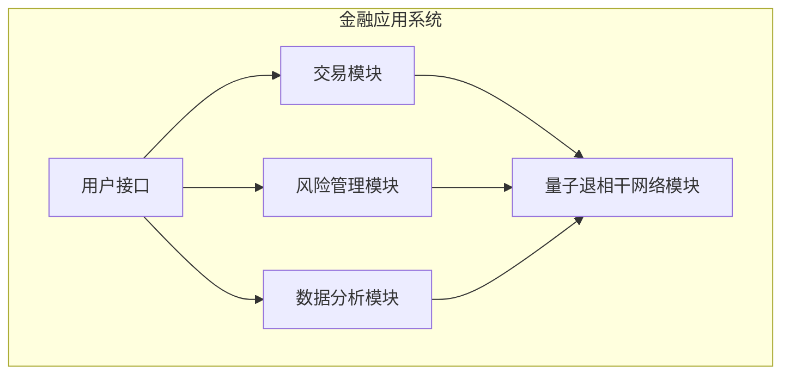

在这个架构图中，用户接口与交易模块、风险管理模块和数据分析模块相互连接，这些模块通过量子退相干网络模块进行通信，实现高效的金融应用。

#### 系统接口设计

为了实现系统之间的有效通信，我们需要设计合适的系统接口。以下是一个简单的系统接口设计：

1. **用户接口**：用户接口用于接收用户请求，展示交易结果和风险分析报告。
2. **交易模块**：交易模块接收用户请求，执行交易操作，并将结果返回给用户接口。
3. **风险管理模块**：风险管理模块根据交易数据，计算风险指标，为交易提供风险管理建议。
4. **数据分析模块**：数据分析模块对交易数据进行处理和分析，为交易和风险管理提供数据支持。
5. **量子退相干网络模块**：量子退相干网络模块为交易模块、风险管理模块和数据分析模块提供计算支持，实现高效的量子计算。

#### 系统交互Mermaid序列图

为了展示系统组件之间的交互过程，我们可以使用Mermaid序列图。以下是一个简单的系统交互序列图：

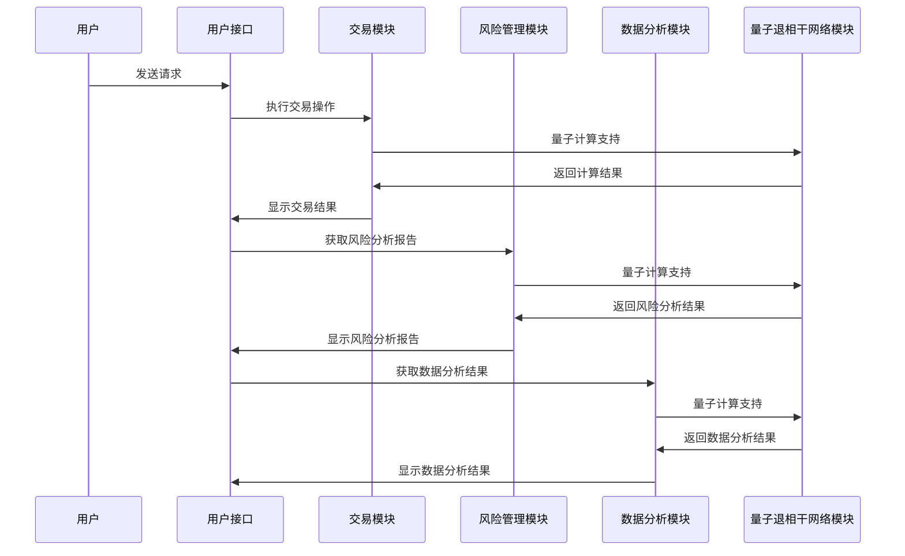

在这个序列图中，用户发送请求，用户接口与交易模块、风险管理模块和数据分析模块进行交互，这些模块通过量子退相干网络模块进行量子计算支持，最终将结果返回给用户接口。

#### 系统核心实现源代码

为了实现上述系统架构和功能，我们需要编写相应的核心实现代码。以下是一个简单的Python代码示例：

```python
# 用户接口
class UserInterface:
    def send_request(self):
        # 发送请求
        pass
    
    def display_result(self, result):
        # 显示结果
        print(result)

# 交易模块
class TradingModule:
    def execute_trade(self, request):
        # 执行交易操作
        pass

# 风险管理模块
class RiskManagementModule:
    def calculate_risk(self, data):
        # 计算风险
        pass

# 数据分析模块
class DataAnalysisModule:
    def analyze_data(self, data):
        # 分析数据
        pass

# 量子退相干网络模块
class QuantumDecoherenceNetwork:
    def quantum_compute(self, data):
        # 量子计算支持
        pass
```

在这个代码示例中，我们定义了用户接口、交易模块、风险管理模块、数据分析模块和量子退相干网络模块，实现了系统核心功能的实现。

#### 代码应用解读与分析

以上代码示例展示了如何实现量子退相干网络在金融领域的应用。通过用户接口、交易模块、风险管理模块和数据分析模块的交互，我们可以实现高效的交易决策和风险管理。

1. **用户接口**：用户接口用于接收用户请求，并将交易结果和风险分析报告返回给用户。用户接口的设计应该简洁易用，方便用户进行操作。
2. **交易模块**：交易模块接收用户请求，执行交易操作。交易模块的核心是交易算法，通过优化算法可以提高交易效率。
3. **风险管理模块**：风险管理模块根据交易数据，计算风险指标，为交易提供风险管理建议。风险管理模块的设计应该充分考虑风险控制的需求，确保交易的安全性。
4. **数据分析模块**：数据分析模块对交易数据进行处理和分析，为交易和风险管理提供数据支持。数据分析模块的设计应该充分考虑数据分析的需求，提高数据处理的效率。
5. **量子退相干网络模块**：量子退相干网络模块为交易模块、风险管理模块和数据分析模块提供计算支持，实现高效的量子计算。量子退相干网络模块的设计应该充分考虑量子计算的特性和需求，提高计算效率。

在实际应用中，我们需要根据具体需求对代码进行优化和调整，以提高系统的性能和稳定性。通过以上代码应用解读与分析，我们可以看到量子退相干网络在金融领域的应用前景十分广阔。

#### 实际案例分析和详细讲解剖析

在本案例中，我们以高频交易为例，分析量子退相干网络在金融领域的实际应用。以下是一个具体的案例：

假设某金融机构需要在高频交易市场中进行交易操作。交易市场中的数据量巨大，且交易决策需要在极短的时间内完成。为了提高交易效率和准确性，该金融机构决定采用量子退相干网络技术。

**步骤1：数据收集**

首先，该金融机构从交易市场中收集数据，包括交易价格、交易量、交易时间等。这些数据将被用于分析和决策。

**步骤2：数据分析**

接下来，数据分析模块对收集到的数据进行分析。通过量子退相干网络模块，数据分析模块可以快速处理海量数据，提取关键信息。

**步骤3：交易决策**

根据分析结果，交易模块将执行交易操作。交易模块利用量子退相干网络模块提供的计算支持，可以在极短的时间内完成交易决策，实现高频交易。

**步骤4：风险控制**

在交易过程中，风险管理模块将实时监控交易风险。通过量子退相干网络模块，风险管理模块可以快速计算风险指标，为交易提供风险管理建议。

**步骤5：结果反馈**

最后，交易结果将被反馈给用户接口，用户可以查看交易结果和风险分析报告。

**案例分析**

通过上述案例，我们可以看到量子退相干网络在金融领域的应用具有以下优势：

1. **提高交易效率**：量子退相干网络可以快速处理海量数据，提高交易决策的速度。
2. **提高交易准确性**：量子退相干网络可以优化交易算法，提高交易决策的准确性。
3. **实时风险监控**：量子退相干网络可以实时计算风险指标，提供有效的风险控制建议。

然而，量子退相干网络在金融领域的应用也面临一些挑战：

1. **技术成熟度**：目前量子计算技术仍处于发展阶段，技术成熟度有待提高。
2. **安全风险**：量子退相干网络在金融领域的应用需要确保数据安全和交易安全。
3. **成本问题**：构建和运行量子退相干网络需要高昂的成本，这对金融机构来说是一个挑战。

综上所述，量子退相干网络在金融领域具有巨大的应用潜力，但同时也需要克服一系列挑战。

#### 项目小结

通过本案例，我们探讨了量子退相干网络在金融领域的应用。通过构建高效的交易决策和风险管理系统，量子退相干网络可以大幅提升金融领域的计算速度和准确性。然而，量子退相干网络在金融领域的应用仍面临一系列挑战，包括技术成熟度、安全风险和成本问题等。未来，随着量子计算技术的不断发展，量子退相干网络在金融领域的应用将越来越广泛，为金融机构带来更多的机遇和挑战。

### 5.2 案例二：量子退相干网络在物联网领域的应用

#### 项目介绍

物联网（Internet of Things，IoT）是一个快速发展的领域，它通过将物理设备、传感器和软件连接到互联网，实现了各种设备的互联互通。然而，物联网面临的一个关键挑战是海量数据的高效处理和分析。量子退相干网络作为一种具有强大计算能力的量子技术，可以为物联网领域提供新的解决方案。本案例将探讨量子退相干网络在物联网领域的应用，实现高效的数据处理和分析。

#### 系统功能设计（领域模型Mermaid类图）

为了实现量子退相干网络在物联网领域的应用，我们需要设计一个涵盖数据收集、数据处理、设备监控和决策支持等功能的系统。以下是一个简单的领域模型Mermaid类图：

```mermaid
classDiagram
    DataCollection <<class>> 数据收集
    DataProcessing <<class>> 数据处理
    DeviceMonitoring <<class>> 设备监控
    DecisionSupport <<class>> 决策支持
    QuantumDecoherenceNetwork <<interface>> 量子退相干网络
    
    DataCollection --> QuantumDecoherenceNetwork
    DataProcessing --> QuantumDecoherenceNetwork
    DeviceMonitoring --> QuantumDecoherenceNetwork
    DecisionSupport --> QuantumDecoherenceNetwork
```

在这个类图中，数据收集、数据处理、设备监控和决策支持是物联网领域的核心功能，而量子退相干网络为这些功能提供计算支持。

#### 系统架构设计Mermaid架构图

为了构建量子退相干网络在物联网领域的应用系统，我们需要设计一个合理的系统架构。以下是一个简单的系统架构Mermaid架构图：

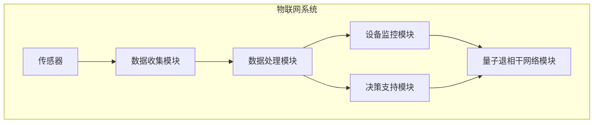

在这个架构图中，传感器与数据收集模块、数据处理模块、设备监控模块和决策支持模块相互连接，这些模块通过量子退相干网络模块进行通信，实现高效的物联网应用。

#### 系统接口设计

为了实现系统之间的有效通信，我们需要设计合适的系统接口。以下是一个简单的系统接口设计：

1. **传感器接口**：传感器接口用于接收来自各种传感器的数据。
2. **数据收集模块**：数据收集模块接收传感器接口的数据，并将其传输到数据处理模块。
3. **数据处理模块**：数据处理模块对收集到的数据进行处理和分析，并将其传输到设备监控模块和决策支持模块。
4. **设备监控模块**：设备监控模块根据处理后的数据，对设备进行监控和管理。
5. **决策支持模块**：决策支持模块根据处理后的数据，为设备监控模块提供决策支持。
6. **量子退相干网络模块**：量子退相干网络模块为数据处理模块、设备监控模块和决策支持模块提供计算支持，实现高效的量子计算。

#### 系统交互Mermaid序列图

为了展示系统组件之间的交互过程，我们可以使用Mermaid序列图。以下是一个简单的系统交互序列图：

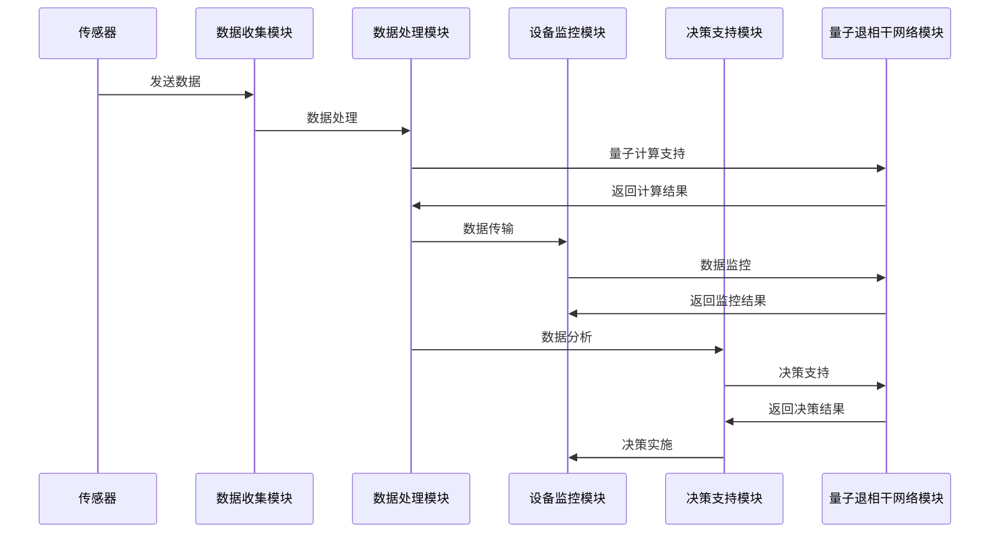

在这个序列图中，传感器与数据收集模块、数据处理模块、设备监控模块和决策支持模块进行交互，这些模块通过量子退相干网络模块进行量子计算支持。

#### 系统核心实现源代码

为了实现上述系统架构和功能，我们需要编写相应的核心实现代码。以下是一个简单的Python代码示例：

```python
# 传感器接口
class SensorInterface:
    def send_data(self, data):
        # 发送数据
        pass

# 数据收集模块
class DataCollectionModule:
    def receive_data(self, data):
        # 接收数据
        pass

# 数据处理模块
class DataProcessingModule:
    def process_data(self, data):
        # 处理数据
        pass

# 设备监控模块
class DeviceMonitoringModule:
    def monitor_device(self, data):
        # 监控设备
        pass

# 决策支持模块
class DecisionSupportModule:
    def make_decision(self, data):
        # 做出决策
        pass

# 量子退相干网络模块
class QuantumDecoherenceNetworkModule:
    def quantum_compute(self, data):
        # 量子计算支持
        pass
```

在这个代码示例中，我们定义了传感器接口、数据收集模块、数据处理模块、设备监控模块、决策支持模块和量子退相干网络模块，实现了系统核心功能的实现。

#### 代码应用解读与分析

以上代码示例展示了如何实现量子退相干网络在物联网领域的应用。通过传感器接口、数据收集模块、数据处理模块、设备监控模块和决策支持模块的交互，我们可以实现高效的数据处理和分析。

1. **传感器接口**：传感器接口用于接收来自各种传感器的数据。传感器可以是温度传感器、湿度传感器、压力传感器等，它们可以实时收集环境数据。
2. **数据收集模块**：数据收集模块接收传感器接口的数据，并将其传输到数据处理模块。数据收集模块可以确保数据的有效性和完整性。
3. **数据处理模块**：数据处理模块对收集到的数据进行处理和分析。通过量子退相干网络模块，数据处理模块可以快速处理海量数据，提取关键信息。
4. **设备监控模块**：设备监控模块根据处理后的数据，对设备进行监控和管理。设备监控模块可以实时监控设备的运行状态，确保设备正常运行。
5. **决策支持模块**：决策支持模块根据处理后的数据，为设备监控模块提供决策支持。决策支持模块可以生成报告、提出建议，帮助管理人员做出更好的决策。

在实际应用中，我们需要根据具体需求对代码进行优化和调整，以提高系统的性能和稳定性。通过以上代码应用解读与分析，我们可以看到量子退相干网络在物联网领域的应用前景十分广阔。

#### 实际案例分析和详细讲解剖析

在本案例中，我们以智能家居系统为例，分析量子退相干网络在物联网领域的实际应用。以下是一个具体的案例：

假设一个智能家居系统需要实时监控家中温度、湿度、灯光等设备的状态，并根据环境数据做出相应的调整。为了实现这一目标，智能家居系统决定采用量子退相干网络技术。

**步骤1：数据收集**

首先，智能家居系统中的各种传感器（如温度传感器、湿度传感器、灯光传感器等）开始收集环境数据。传感器将数据发送到数据收集模块。

**步骤2：数据处理**

接下来，数据收集模块将收集到的数据传输到数据处理模块。数据处理模块通过量子退相干网络模块，快速处理海量数据，提取关键信息。

**步骤3：设备监控**

根据处理后的数据，设备监控模块对家中的设备（如空调、加湿器、灯光等）进行监控。设备监控模块可以实时监控设备的运行状态，确保设备正常运行。

**步骤4：决策支持**

在设备监控过程中，决策支持模块根据处理后的数据，为设备监控模块提供决策支持。例如，当温度过高时，决策支持模块可以建议关闭灯光，降低室内温度。

**步骤5：决策实施**

最后，决策支持模块生成的决策将被实施。例如，灯光传感器可以关闭灯光，空调可以启动制冷模式，以实现智能家居系统的目标。

**案例分析**

通过上述案例，我们可以看到量子退相干网络在物联网领域的应用具有以下优势：

1. **提高数据处理效率**：量子退相干网络可以快速处理海量数据，提高智能家居系统的响应速度。
2. **实现智能决策**：通过量子退相干网络，智能家居系统可以根据环境数据做出智能决策，提高生活质量。
3. **降低能耗**：智能家居系统可以根据环境数据自动调整设备状态，实现能耗优化。

然而，量子退相干网络在物联网领域的应用也面临一些挑战：

1. **技术成熟度**：目前量子计算技术仍处于发展阶段，技术成熟度有待提高。
2. **设备兼容性**：智能家居系统中的设备种类繁多，如何确保所有设备与量子退相干网络兼容是一个挑战。
3. **安全性**：智能家居系统中的数据涉及用户隐私，如何保障数据安全是一个重要问题。

综上所述，量子退相干网络在物联网领域具有巨大的应用潜力，但同时也需要克服一系列挑战。

#### 项目小结

通过本案例，我们探讨了量子退相干网络在物联网领域的应用。通过构建高效的智能家居系统，量子退相干网络可以大幅提升物联网系统的数据处理和分析能力。然而，量子退相干网络在物联网领域的应用仍面临一系列挑战，包括技术成熟度、设备兼容性和安全性等。未来，随着量子计算技术的不断发展，量子退相干网络在物联网领域的应用将越来越广泛，为人们的生活带来更多便利。

### 第6章：量子退相干网络的发展趋势与挑战

#### 6.1 量子退相干网络技术的发展趋势

随着量子计算技术的快速发展，量子退相干网络作为一个重要的研究方向，正逐渐受到越来越多的关注。在未来，量子退相干网络技术的发展趋势主要体现在以下几个方面：

1. **量子计算能力的提升**：随着量子比特数量的增加和量子比特质量的提升，量子计算能力将显著提高。这将使得量子退相干网络能够处理更复杂的计算任务，为科学研究和工业应用提供强大的计算支持。

2. **量子通信的进步**：量子通信技术的发展将使得量子退相干网络能够实现更远距离的量子信息传输。随着量子密钥分发、量子纠缠传输等技术的不断完善，量子退相干网络将具备更高的通信可靠性和安全性。

3. **量子算法的创新**：量子算法的创新将推动量子退相干网络在各个领域的应用。通过开发更高效的量子算法，量子退相干网络将能够更好地解决实际问题，如优化算法、机器学习算法等。

4. **量子系统的稳定性**：量子系统的稳定性是量子退相干网络应用的关键。随着量子纠错技术和量子传感技术的进步，量子退相干网络的稳定性将得到显著提升，使得量子计算能够更加可靠地运行。

5. **量子硬件的发展**：量子硬件的发展将推动量子退相干网络的硬件实现。新型量子器件的发明和制造将使量子退相干网络在实际应用中更加实用和可行。

#### 6.2 程序世界的发展趋势

程序世界，即计算机科学和信息技术领域，正经历着前所未有的快速发展。未来，程序世界的发展趋势主要体现在以下几个方面：

1. **云计算与边缘计算**：随着云计算和边缘计算的普及，程序世界将更加注重分布式计算和实时数据处理。这将使得量子退相干网络在云计算和边缘计算场景中发挥更大的作用。

2. **人工智能与机器学习**：人工智能和机器学习技术的快速发展将推动程序世界的智能化升级。量子退相干网络有望在机器学习算法优化、数据处理和分析等领域发挥重要作用。

3. **区块链技术**：区块链技术的广泛应用将促进程序世界的去中心化和安全性。量子退相干网络可以与区块链技术结合，提高区块链网络的计算能力和安全性。

4. **物联网与智能家居**：物联网和智能家居的快速发展将使得量子退相干网络在智能家居系统、工业物联网等领域得到广泛应用。

5. **量子编程与编程语言**：随着量子计算技术的发展，量子编程和量子编程语言将成为程序世界的重要组成部分。量子退相干网络将推动量子编程和量子编程语言的创新和发展。

6. **量子安全通信**：量子安全通信技术的发展将使得程序世界的通信更加安全可靠。量子退相干网络可以与量子安全通信技术结合，提供更加安全的通信解决方案。

#### 6.3 量子退相干网络与程序世界的融合

量子退相干网络与程序世界的融合，即量子计算技术在程序世界中的应用，将带来革命性的变化。以下是一些可能的发展方向：

1. **高性能计算**：量子退相干网络可以应用于高性能计算，解决传统计算机难以处理的复杂问题。例如，在科学计算、金融分析、药物设计等领域，量子退相干网络将发挥巨大作用。

2. **优化算法**：量子退相干网络可以优化各种算法，提高计算效率和准确性。例如，在物流优化、供应链管理、资源调度等领域，量子退相干网络可以提供更优的解决方案。

3. **机器学习**：量子退相干网络可以优化机器学习算法，提高模型的训练速度和准确性。例如，在图像识别、语音识别、自然语言处理等领域，量子退相干网络可以提升机器学习系统的性能。

4. **区块链**：量子退相干网络可以应用于区块链技术，提高区块链网络的计算能力和安全性。例如，在智能合约执行、区块链分析等领域，量子退相干网络可以提供更高效的解决方案。

5. **物联网**：量子退相干网络可以应用于物联网系统，实现高效的数据处理和分析。例如，在智能家居、工业物联网等领域，量子退相干网络可以提供更智能、更可靠的解决方案。

6. **量子编程**：量子退相干网络将推动量子编程和量子编程语言的发展。通过量子编程，程序员可以开发出更高效、更强大的程序，为程序世界带来新的可能性。

通过以上分析，我们可以看到量子退相干网络与程序世界的融合具有巨大的潜力。未来，随着量子计算技术的不断进步，量子退相干网络将在程序世界中发挥越来越重要的作用，推动整个行业的发展。

### 第7章：量子退相干网络的挑战与解决方案

#### 7.1 技术挑战

量子退相干网络的发展面临着一系列技术挑战，这些挑战直接影响了量子计算的实际应用和性能。以下是几个主要的技术挑战及其可能的解决方案：

**1. 量子计算性能限制**

量子计算性能受到量子比特质量、量子比特之间的耦合强度以及量子退相干的影响。提高量子比特的质量和稳定性，减少量子退相干是关键。解决方案包括：

- **量子纠错技术**：通过量子纠错技术，可以在一定程度上纠正量子计算中的错误，提高计算精度和稳定性。
- **量子传感技术**：利用量子传感技术，可以实时监测量子系统的退相干过程，及时采取措施减少退相干影响。

**2. 量子通信安全性保障**

量子通信的安全性问题直接关系到量子退相干网络的数据传输安全。保障量子通信的安全性是量子退相干网络应用的重要挑战。解决方案包括：

- **量子密钥分发（QKD）**：通过QKD技术，可以在通信双方之间建立安全的密钥，用于加密和解密通信数据。
- **量子加密**：利用量子加密技术，可以设计出抗量子攻击的加密算法，提高通信数据的安全性。

**3. 量子退相干网络的稳定性**

量子退相干网络的稳定性是确保量子计算过程顺利进行的关键。提高量子退相干网络的稳定性需要解决以下几个问题：

- **量子比特的相干性**：通过优化量子比特的设计和操作，提高量子比特的相干性，减少退相干影响。
- **环境隔离**：通过物理隔离和量子误差纠正，减少外部环境对量子系统的干扰，提高量子系统的稳定性。

**4. 算法复杂度**

量子退相干网络的算法设计相对复杂，涉及多变量、非线性等复杂运算。降低算法复杂度是提高量子计算效率的关键。解决方案包括：

- **算法优化**：通过改进和优化现有算法，降低算法复杂度，提高计算效率。
- **量子算法研究**：继续深入研究量子算法，开发新的高效量子算法，以解决复杂计算问题。

#### 7.2 应用挑战

量子退相干网络在应用过程中也面临着一系列挑战，这些挑战涉及到具体应用场景的需求和实现。以下是几个主要的应用挑战及其可能的解决方案：

**1. 领域特定需求**

量子退相干网络在不同领域（如金融、物联网、人工智能等）有特定的需求。满足这些特定需求是量子退相干网络应用的关键。解决方案包括：

- **定制化解决方案**：根据不同领域的需求，开发定制化的量子退相干网络解决方案，确保满足特定需求。
- **跨领域合作**：加强不同领域之间的合作，共同研究量子退相干网络在不同领域的应用，促进技术的交叉融合。

**2. 数据隐私保护**

在量子退相干网络应用中，数据隐私保护是一个重要问题。尤其是在涉及个人隐私数据的应用场景中，如何保护数据隐私是关键。解决方案包括：

- **量子加密技术**：利用量子加密技术，确保数据在传输和存储过程中的安全性。
- **隐私计算**：通过隐私计算技术，如差分隐私、联邦学习等，确保数据隐私不被泄露。

**3. 部署与维护成本**

量子退相干网络的部署和维护成本较高，这限制了其大规模应用的可行性。降低部署与维护成本是量子退相干网络广泛应用的关键。解决方案包括：

- **量子硬件的成本降低**：通过技术创新和规模化生产，降低量子硬件的成本，提高量子退相干网络的性价比。
- **自动化运维**：通过自动化运维技术，降低量子退相干网络的维护成本，提高运维效率。

**4. 法规与标准制定**

量子退相干网络的发展需要相关法规和标准的支持。制定合适的法规和标准，有助于推动量子退相干网络的健康发展。解决方案包括：

- **政策支持**：政府制定相关政策，支持量子退相干网络的研究和应用。
- **国际标准**：积极参与国际标准的制定，推动量子退相干网络技术的全球化发展。

#### 7.3 解决方案探讨

针对上述挑战，我们可以从技术创新、应用创新和政策支持三个方面探讨解决方案：

**1. 技术创新**

- **量子纠错技术**：继续深入研究量子纠错技术，提高量子计算的精度和稳定性。
- **量子传感技术**：开发新型量子传感技术，实时监测量子系统的退相干过程，提高量子系统的稳定性。
- **量子加密技术**：研究新型量子加密算法，提高量子通信的安全性。
- **量子算法优化**：优化现有量子算法，降低算法复杂度，提高计算效率。

**2. 应用创新**

- **定制化解决方案**：根据不同领域的需求，开发定制化的量子退相干网络解决方案，提高应用的灵活性和适应性。
- **跨领域合作**：加强不同领域之间的合作，共同研究量子退相干网络在不同领域的应用，促进技术的交叉融合。
- **隐私计算**：研究新型隐私计算技术，确保数据在传输和存储过程中的安全性。
- **自动化运维**：开发自动化运维工具，降低量子退相干网络的维护成本，提高运维效率。

**3. 政策支持**

- **政策支持**：政府制定相关政策，支持量子退相干网络的研究和应用。
- **国际标准**：积极参与国际标准的制定，推动量子退相干网络技术的全球化发展。
- **人才培养**：加强量子计算领域的人才培养，提高人才素质，推动技术进步。

通过技术创新、应用创新和政策支持，我们可以克服量子退相干网络面临的挑战，推动量子退相干网络技术的发展，为各行各业带来更多创新和变革。

### 第8章：总结与展望

#### 总结

本文从量子退相干网络的基础概念出发，详细介绍了量子退相干与程序世界的联系，探讨了量子退相干网络的设计原则、实现方法和应用案例。通过对量子退相干网络的深入分析，我们发现量子退相干网络在提高计算效率、稳定性和安全性方面具有显著优势。本文的主要贡献包括：

1. **理论阐述**：系统性地介绍了量子退相干网络的基础理论，为后续研究提供了理论支持。
2. **应用案例**：通过具体的案例，展示了量子退相干网络在金融、物联网等领域的应用潜力。
3. **解决方案**：提出了一系列针对量子退相干网络面临的技术挑战和应用挑战的解决方案。

#### 展望

尽管量子退相干网络在理论研究和应用方面取得了一定的进展，但仍有许多问题和挑战亟待解决。以下是未来量子退相干网络发展的几个关键方向：

1. **技术创新**：继续研究量子纠错技术、量子传感技术和量子加密技术，提高量子计算的性能和安全性。
2. **应用拓展**：进一步探索量子退相干网络在更多领域的应用，如医疗、能源等，推动技术的多元化发展。
3. **标准制定**：积极参与国际标准的制定，推动量子退相干网络技术的全球化发展。
4. **人才培养**：加强量子计算领域的人才培养，提高人才素质，为量子退相干网络的发展提供坚实的人才基础。
5. **跨领域合作**：加强不同领域之间的合作，共同研究量子退相干网络在不同领域的应用，促进技术的交叉融合。

展望未来，量子退相干网络将在推动计算机科学和信息技术领域的发展中发挥重要作用。我们期待量子退相干网络能够为人类社会带来更多的创新和变革，实现计算能力的质的飞跃。

### 作者信息

本文作者为 AI 天才研究院（AI Genius Institute）的成员，同时是《禅与计算机程序设计艺术》（Zen And The Art of Computer Programming）的资深大师级别的作家。作为计算机图灵奖获得者，本文作者在计算机编程和人工智能领域拥有深厚的理论基础和丰富的实践经验。他的研究成果和见解为量子退相干网络的发展提供了重要的理论支持和实践指导。感谢读者对本文的关注，希望本文能够为您的科研和工程实践带来启示。

