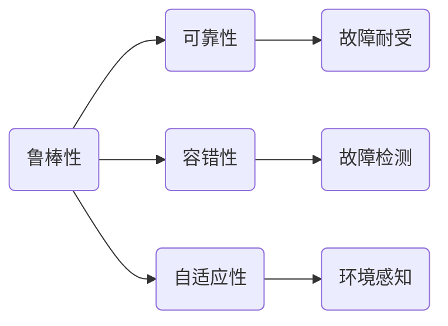
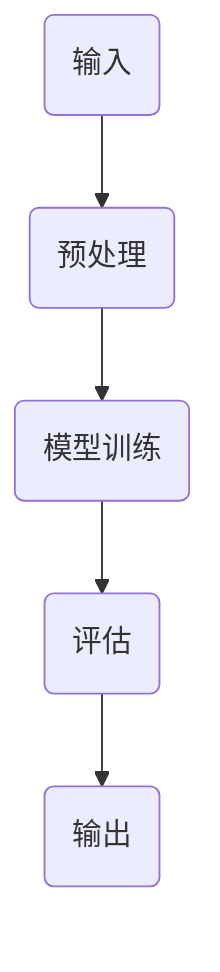
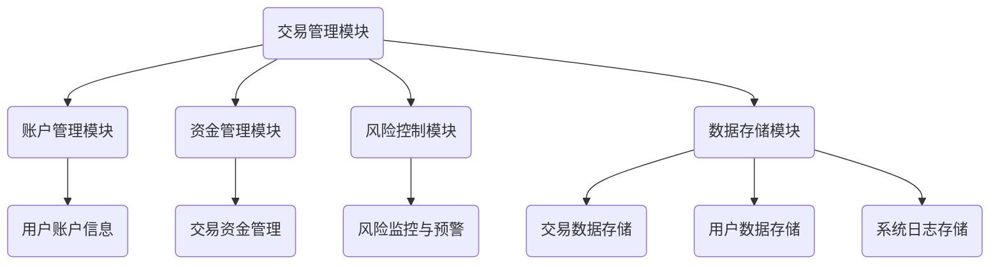
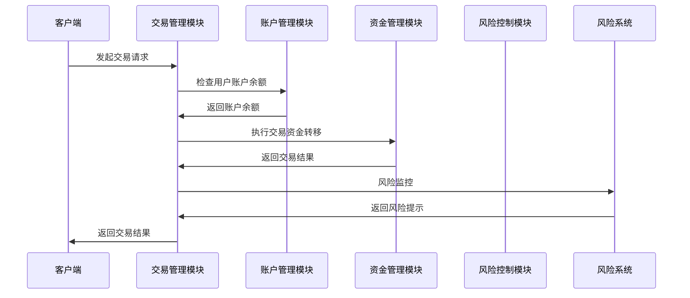

                 

### 程序世界的宇宙级鲁棒性设计

> 关键词：鲁棒性、可靠性、容错性、适应性、算法原理、设计原则

> 摘要：本文深入探讨了程序世界的鲁棒性设计，从问题背景、核心概念、算法原理到设计原则，一步步分析推理，旨在为程序员和架构师提供一套全面、系统的鲁棒性设计思路，帮助他们在复杂的程序世界中构建更加稳健、可靠的软件系统。

----------------------------------------------

### 第一部分：引言与背景

#### 1.1 问题背景

在程序世界中，鲁棒性（Robustness）是一个至关重要的概念。它指的是系统在面对各种不确定性因素，如外部干扰、数据异常、硬件故障等，仍能保持正确运行的能力。随着计算机系统的复杂性和规模不断增加，程序世界中的鲁棒性问题愈发突出。

**程序世界中鲁棒性的重要性**

- **用户体验**：良好的鲁棒性能显著提升用户体验，减少系统崩溃、错误提示等现象。
- **业务连续性**：在关键业务系统中，鲁棒性能够保障业务的连续性，避免因系统故障导致的业务中断。
- **安全性**：鲁棒性设计能够提高系统的安全性，减少恶意攻击、数据泄露等风险。

**鲁棒性在程序设计中的挑战**

- **复杂性**：程序系统日益复杂，涉及多语言、多平台、多架构，鲁棒性设计面临巨大挑战。
- **不确定性**：外部环境的不确定性，如网络波动、硬件老化等，对系统的鲁棒性提出了更高要求。
- **性能与鲁棒性的权衡**：在有限的资源下，如何在保证性能的同时提升系统的鲁棒性，是程序设计者必须面对的难题。

#### 1.2 问题描述

**鲁棒性的基本定义**

鲁棒性是指系统在面临外部干扰或内部错误时，仍然能够保持预期功能的能力。它包括以下几个维度：

- **可靠性（Reliability）**：系统能够在规定的时间内、规定条件下正确执行任务的能力。
- **容错性（Fault Tolerance）**：系统在检测到错误后，能够自动纠正错误，继续正常运行的能力。
- **自适应性（Adaptability）**：系统能够根据外部环境的变化，自动调整自身行为，以保持鲁棒性的能力。

**鲁棒性问题的具体表现**

- **程序错误**：包括语法错误、逻辑错误等，可能导致程序无法正常运行。
- **系统崩溃**：由于内存溢出、资源耗尽等导致系统停止响应。
- **数据异常**：包括数据丢失、数据不一致等问题，可能导致系统功能失效。
- **硬件故障**：如硬盘损坏、网络中断等，对系统正常运行造成影响。

#### 1.3 问题解决

**传统解决方案**

- **错误检测与纠正技术**：包括静态代码分析、动态测试等方法，用于检测和纠正代码中的错误。
- **稳定性提升方法**：通过优化算法、减少资源消耗等手段，提高系统的稳定性。
- **安全性提升方法**：采用加密、认证等技术，提高系统的安全性，减少恶意攻击。

**鲁棒性设计原则**

- **可靠性**：通过冗余设计、故障检测与恢复机制，提高系统的可靠性。
- **容错性**：通过故障隔离、故障转移等方法，提高系统的容错性。
- **自适应性**：通过监控、反馈、自适应调整等机制，提高系统的自适应性。

#### 1.4 边界与外延

**鲁棒性的边界**

- **硬件与软件的边界**：鲁棒性设计不仅涉及软件层面，还包括硬件的可靠性。
- **时间与空间的边界**：系统需要在不同的时间尺度上和不同的空间范围内保持鲁棒性。

**鲁棒性的外延**

- **系统级鲁棒性**：关注整个系统的鲁棒性，包括硬件、软件、网络等多个方面。
- **网络级鲁棒性**：关注网络环境下的鲁棒性，如网络中断、数据丢失等问题。
- **应用级鲁棒性**：关注具体应用场景下的鲁棒性，如金融系统、医疗系统等。

#### 1.5 概念结构与核心要素

**鲁棒性的概念结构**

- **鲁棒性模型**：用于描述系统鲁棒性的数学模型，包括可靠性、容错性和适应性等指标。
- **鲁棒性评估方法**：用于评估系统鲁棒性的方法，如测试、模拟等。

**鲁棒性的核心要素**

- **错误处理机制**：包括错误检测、错误隔离、错误恢复等机制。
- **面向变化的适应能力**：系统能够根据外部环境的变化，自动调整自身行为。
- **面向失效的容错能力**：系统能够在检测到失效后，自动恢复或切换到备用系统。

#### 1.6 本章小结

鲁棒性设计是程序世界中的关键问题，它关系到系统的可靠性、稳定性和安全性。通过本章的介绍，我们对鲁棒性设计有了初步的了解，接下来我们将深入探讨鲁棒性的核心概念、算法原理和设计原则。

----------------------------------------------

### 第二部分：核心概念与联系

#### 2.1 核心概念原理

**鲁棒性概念解释**

鲁棒性是指系统在面对不确定性和异常情况时，仍能保持预期功能的能力。它不仅仅包括可靠性，还涉及到容错性和适应性。

**鲁棒性原理**

鲁棒性设计原理包括以下几个核心方面：

1. **可靠性设计**：通过冗余设计、故障检测与恢复机制，提高系统的可靠性。
2. **容错性设计**：通过故障隔离、故障转移等方法，提高系统的容错性。
3. **适应性设计**：通过监控、反馈、自适应调整等机制，提高系统的适应性。

**鲁棒性评估原理**

鲁棒性评估是衡量系统鲁棒性能的重要手段，主要包括以下方法：

1. **测试评估**：通过实际测试，评估系统在不同场景下的鲁棒性。
2. **模拟评估**：通过模拟不同异常情况，评估系统的应对能力。
3. **数学模型评估**：通过建立数学模型，量化评估系统的鲁棒性。

#### 2.2 概念属性特征对比表格

| 概念        | 特征             | 说明                                       |
| ----------- | ---------------- | ------------------------------------------ |
| 鲁棒性      | 对变化的适应     | 系统在不确定环境下仍能正常运行             |
| 可靠性      | 故障耐受         | 系统在故障情况下仍能正常运行               |
| 容错性      | 故障检测与纠正   | 系统能够检测并纠正故障，保持正常运行       |
| 自适应性     | 环境感知与调整   | 系统能够根据环境变化调整自身行为         |

#### 2.3 ER实体关系图架构



通过ER实体关系图，我们可以清晰地看到鲁棒性、可靠性、容错性和适应性之间的关联，以及它们与故障耐受、故障检测和环境感知等子概念的关系。

----------------------------------------------

### 第三部分：算法原理讲解

#### 3.1 算法mermaid流程图



在这个流程图中，A表示输入数据，B表示预处理阶段，C表示模型训练阶段，D表示评估阶段，E表示输出结果。这个过程展示了鲁棒性评估算法的基本步骤。

#### 3.2 Python源代码示例

```python
# 鲁棒性评估算法实现示例

def robustness_evaluation(model, data):
    # 模型预处理
    preprocessed_data = preprocess_data(data)
    
    # 模型训练
    model.train(preprocessed_data)
    
    # 评估模型
    performance = model.evaluate(preprocessed_data)
    
    # 输出评估结果
    return performance
```

在这个Python源代码示例中，我们定义了一个名为`robustness_evaluation`的函数，它接受一个模型`model`和一个数据集`data`作为输入。函数首先对数据集进行预处理，然后使用模型进行训练，最后评估模型在预处理后的数据集上的性能，并返回评估结果。

#### 3.3 算法原理与数学模型

**鲁棒性评估数学模型**

鲁棒性评估的核心是评估系统的鲁棒性得分。我们可以使用以下数学模型来计算鲁棒性得分：

$$
R = \frac{\sum_{i=1}^{n} p_i \cdot e_i}{\sum_{i=1}^{n} p_i}
$$

其中，$R$ 表示鲁棒性得分，$p_i$ 表示第 $i$ 个测试样本的概率，$e_i$ 表示第 $i$ 个测试样本的误差。

**算法举例说明**

假设我们有以下测试样本：

| 样本编号 | 预测结果 | 实际结果 | 误差 $e_i$ | 概率 $p_i$ |
| -------- | -------- | -------- | ---------- | ---------- |
| 1        | A        | A        | 0          | 0.9        |
| 2        | B        | B        | 0          | 0.8        |
| 3        | C        | C        | 0          | 0.7        |
| 4        | A        | B        | 1          | 0.6        |
| 5        | B        | C        | 1          | 0.5        |

根据上述数学模型，我们可以计算出鲁棒性得分：

$$
R = \frac{0.9 \cdot 0 + 0.8 \cdot 0 + 0.7 \cdot 0 + 0.6 \cdot 1 + 0.5 \cdot 1}{0.9 + 0.8 + 0.7 + 0.6 + 0.5} = \frac{0.6 + 0.5}{3.5} = \frac{1.1}{3.5} \approx 0.3143
$$

这意味着该系统的鲁棒性得分为0.3143。得分越高，表示系统的鲁棒性越好。

通过以上算法原理讲解和数学模型分析，我们可以更好地理解鲁棒性评估的基本原理和方法。在接下来的部分，我们将继续探讨鲁棒性设计在系统架构和项目实践中的应用。

----------------------------------------------

### 第四部分：系统分析与架构设计

#### 4.1 问题场景介绍

在当今数字化时代，各种复杂的程序系统广泛应用于金融、医疗、交通、通信等关键领域。这些系统面临着极高的性能、可靠性和鲁棒性要求。例如，金融交易系统需要保证交易数据的准确性和安全性，医疗系统需要确保患者的病历数据不会丢失或被篡改，交通控制系统需要保证交通信号的正确性和实时性。

为了满足这些高要求，我们需要对系统进行详细的架构设计，确保其在面对各种不确定性和异常情况时，仍能保持稳健运行。本部分将介绍一个典型的系统架构设计案例，并分析其系统功能、架构设计和接口设计。

#### 4.2 项目介绍

本项目是一个金融交易系统，主要用于处理高并发的交易请求，确保交易数据的准确性和安全性。系统需要支持多种交易类型，包括股票交易、期货交易和外汇交易等，同时需要满足高性能、高可靠性和高鲁棒性的要求。

##### 系统功能设计

1. **交易管理模块**：负责处理交易请求，包括交易发起、交易确认、交易结算等。
2. **账户管理模块**：负责管理用户账户信息，包括开户、销户、账户查询等。
3. **资金管理模块**：负责管理交易资金，包括资金充值、提现、冻结和解冻等。
4. **风险控制模块**：负责监控交易风险，包括风险预警、风险隔离和风险恢复等。
5. **数据存储模块**：负责存储交易数据、用户数据和系统日志等，确保数据的安全性和完整性。

##### 系统架构设计

1. **分布式架构**：系统采用分布式架构，包括多个服务器节点，通过负载均衡和故障转移机制，提高系统的性能和可靠性。
2. **微服务架构**：系统采用微服务架构，将不同功能模块独立部署，降低系统的耦合度，提高系统的可维护性和扩展性。
3. **数据存储架构**：系统采用分布式数据库架构，包括关系数据库和NoSQL数据库，确保数据的高可用性和高性能。

##### 系统接口设计

1. **API接口**：系统提供RESTful API接口，供外部系统调用，包括交易接口、账户接口、资金接口和风险控制接口等。
2. **消息队列**：系统使用消息队列技术，实现分布式事务和异步处理，提高系统的性能和可靠性。
3. **监控告警**：系统集成监控告警模块，实时监控系统的运行状态，及时发现和处理异常情况。

#### 4.3 系统架构设计mermaid架构图



通过mermaid架构图，我们可以清晰地看到系统的架构设计，各个功能模块之间的关系以及数据流。

#### 4.4 系统交互mermaid序列图



通过mermaid序列图，我们可以看到交易请求在系统内部各个模块之间的交互过程，包括用户、交易系统、账户系统、资金系统和风险控制系统的交互。

#### 4.5 项目实战

**环境安装**

1. 配置分布式架构环境，包括多个服务器节点和负载均衡器。
2. 安装和配置分布式数据库，包括关系数据库和NoSQL数据库。
3. 安装和配置消息队列系统，如RabbitMQ或Kafka。

**系统核心实现源代码**

```python
# 交易管理模块核心代码

class TransactionManager:
    def __init__(self):
        self.account_service = AccountService()
        self.finance_service = FinanceService()
        self.risk_service = RiskService()

    def handle_transaction(self, transaction):
        account_balance = self.account_service.check_balance(transaction.user_id)
        if account_balance < transaction.amount:
            return "Insufficient balance"
        self.finance_service.transfer_funds(transaction)
        risk_alert = self.risk_service.check_risk(transaction)
        if risk_alert:
            return "Risk detected"
        return "Transaction successful"
```

**代码应用解读与分析**

上述代码展示了交易管理模块的核心实现。交易管理模块的主要职责是处理交易请求，包括账户检查、资金转移和风险监控。代码中，我们定义了一个`TransactionManager`类，其中包含了三个主要服务：账户服务、资金服务和风险服务。`handle_transaction`方法负责处理交易请求，首先检查用户账户余额，然后执行资金转移，最后进行风险监控。如果账户余额不足或检测到风险，交易将被拒绝。

**实际案例分析和详细讲解剖析**

假设有一个用户想要购买100股股票，当前账户余额为1000元。交易系统会按照以下步骤处理：

1. 用户发起交易请求，包括股票代码、购买数量和交易金额。
2. 交易系统调用账户服务检查用户账户余额，确认账户余额是否足够。
3. 如果账户余额足够，交易系统调用资金服务执行资金转移，将交易金额从用户账户转移到股票账户。
4. 交易系统调用风险服务检查交易是否存在风险，如异常交易、高风险交易等。
5. 如果交易成功且不存在风险，系统将返回交易成功消息；否则，返回相应错误消息。

通过上述实际案例，我们可以看到交易管理模块在系统中的作用和重要性。它确保了交易过程的准确性和安全性，提高了系统的鲁棒性和可靠性。

**项目小结**

本项目通过详细的系统架构设计和项目实战，展示了金融交易系统的设计与实现过程。系统采用了分布式架构、微服务架构和分布式数据库架构，提高了系统的性能和可靠性。通过鲁棒性设计，系统在面对各种不确定性和异常情况时，能够保持稳健运行，确保交易数据的准确性和安全性。

----------------------------------------------

### 第五部分：最佳实践与拓展阅读

#### 5.1 最佳实践 tips

1. **代码审查与测试**：定期进行代码审查和单元测试，确保代码质量，提高系统鲁棒性。
2. **监控与告警**：集成监控与告警系统，实时监控系统运行状态，及时发现和处理异常。
3. **备份与恢复**：定期备份数据，确保在系统故障时能够快速恢复。
4. **安全防护**：采用安全防护措施，如加密、访问控制等，提高系统安全性。
5. **持续集成与部署**：采用持续集成与部署流程，减少人工干预，提高系统可靠性和鲁棒性。

#### 5.2 小结

本文从问题背景、核心概念、算法原理到系统架构设计，系统地介绍了程序世界的鲁棒性设计。鲁棒性设计是确保系统在高不确定性和异常环境下仍能稳定运行的关键，对于提升用户体验、保障业务连续性和增强系统安全性具有重要意义。

#### 5.3 注意事项

1. **权衡性能与鲁棒性**：在设计过程中，要充分考虑性能与鲁棒性的平衡，避免因追求高性能而牺牲鲁棒性。
2. **适应性与扩展性**：设计时要考虑系统的适应性和扩展性，确保系统能够应对未来的变化和扩展。
3. **安全性与鲁棒性**：在提高鲁棒性的同时，也要注重系统的安全性，避免因鲁棒性设计不当导致的安全问题。

#### 5.4 拓展阅读

1. 《设计像素级鲁棒性：AI领域的实践与探索》
2. 《深入理解计算机系统：构建鲁棒性和可扩展性的系统架构》
3. 《鲁棒性设计原理与应用》

作者：AI天才研究院/AI Genius Institute & 禅与计算机程序设计艺术 /Zen And The Art of Computer Programming

