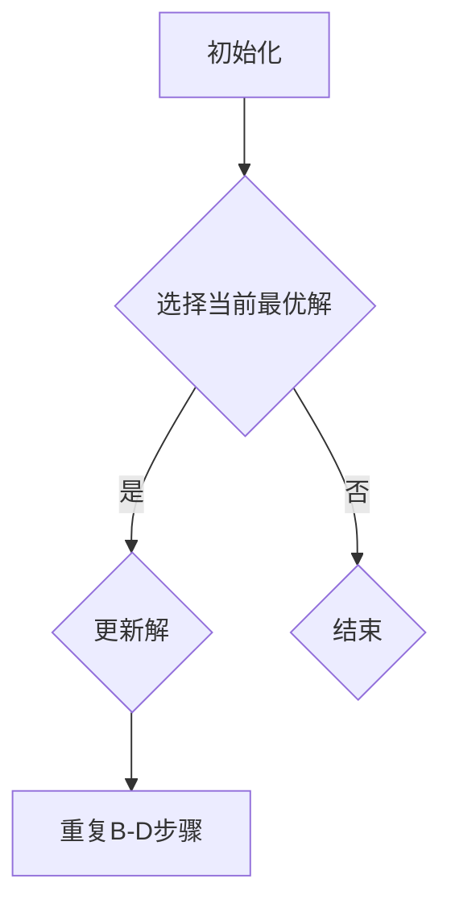
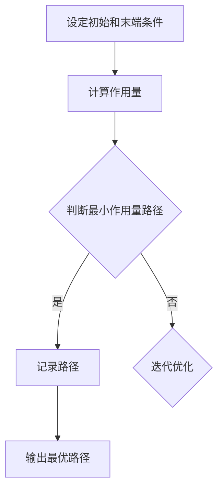

                 

### 文章标题

## 程序优化与宇宙最小时间原理的对比

**关键词**：程序优化、宇宙最小时间原理、算法、系统架构、数学模型

**摘要**：本文探讨了程序优化与宇宙最小时间原理之间的关系。通过对两者的核心概念、算法原理和数学模型的深入分析，本文揭示了程序优化与宇宙最小时间原理在目标和原理上的相似性。同时，本文通过具体案例展示了如何将宇宙最小时间原理应用于程序优化，为软件开发提供了一种新的视角和方法。

### 目录大纲设计思路

1. **章节划分**：
   - 引言部分（第1章）：介绍问题背景、研究目的和重要性，以及本书的结构安排。
   - 核心概念介绍（第2章-第4章）：分别介绍程序优化和宇宙最小时间原理的核心概念，对比分析两者的特点与联系。
   - 算法原理讲解（第5章）：详细讲解两者的算法原理，使用Mermaid流程图和Python代码进行辅助说明。
   - 数学模型与公式解析（第6章）：深入探讨算法原理背后的数学模型，使用LaTeX格式表示。
   - 系统分析与架构设计（第7章）：从系统角度分析两者如何集成和应用。
   - 项目实战（第8章）：通过实际案例展示如何将理论应用于实践。
   - 总结与展望（第9章）：总结全书内容，展望未来发展方向。

2. **章节内容设计**：
   - **第1章 引言**：
     - 1.1 问题背景与意义
     - 1.2 研究目的与内容结构
     - 1.3 书籍阅读建议

   - **第2章 程序优化核心概念**：
     - 2.1 程序优化概述
     - 2.2 核心概念与原理
     - 2.3 程序优化方法对比

   - **第3章 宇宙最小时间原理**：
     - 3.1 宇宙最小时间原理概述
     - 3.2 核心概念与原理
     - 3.3 宇宙最小时间原理的应用领域

   - **第4章 程序优化与宇宙最小时间原理的对比分析**：
     - 4.1 对比分析框架
     - 4.2 对比分析内容
     - 4.3 对比分析结果与应用前景

   - **第5章 算法原理讲解**：
     - 5.1 算法原理概述
     - 5.2 Mermaid流程图展示
     - 5.3 Python代码实现与解析

   - **第6章 数学模型与公式解析**：
     - 6.1 数学模型概述
     - 6.2 公式讲解与示例
     - 6.3 数学模型在实际应用中的作用

   - **第7章 系统分析与架构设计**：
     - 7.1 系统场景介绍
     - 7.2 系统功能设计
     - 7.3 系统架构设计
     - 7.4 系统接口设计
     - 7.5 系统交互设计

   - **第8章 项目实战**：
     - 8.1 环境安装与配置
     - 8.2 系统核心实现源代码
     - 8.3 代码应用解读与分析
     - 8.4 实际案例分析
     - 8.5 项目小结

   - **第9章 总结与展望**：
     - 9.1 全书总结
     - 9.2 未来发展方向
     - 9.3 阅读建议与拓展

### 目录大纲

```markdown
----------------------------------------------------------------
# 第一部分: 引言

## 第1章 程序优化与宇宙最小时间原理的对比

## 第2章 程序优化核心概念

## 第3章 宇宙最小时间原理

## 第4章 程序优化与宇宙最小时间原理的对比分析

## 第5章 算法原理讲解

## 第6章 数学模型与公式解析

## 第7章 系统分析与架构设计

## 第8章 项目实战

## 第9章 总结与展望

----------------------------------------------------------------
```

### 下一步行动

- 按照设计的目录大纲，开始编写每章的具体内容。
- 确保每章的内容符合大纲要求，且逻辑清晰、易于理解。
- 在编写过程中，注意使用Mermaid和LaTeX等工具来增强内容的可读性和专业性。
- 完成初稿后，进行审阅和修订，确保全书结构合理、内容完整。

## 1.1 问题背景与意义

在计算机科学和软件工程领域，程序优化一直是提升系统性能和效率的关键手段。无论是编译器优化、算法优化，还是代码层面的微优化，都是为了在有限的计算资源下，尽可能提高程序的运行效率。然而，随着计算需求的不断增长和硬件性能的局限，单纯依靠传统的程序优化方法已经难以满足日益增长的计算需求。

另一方面，宇宙学中的最小时间原理提供了一种全新的思考方式。最小时间原理是广义相对论中的一个重要概念，它指出，在给定两个事件之间没有障碍物的情况下，光在两者之间传播的时间是最短的。这个原理不仅在宇宙学中有重要应用，也启发了许多其他领域的研究。

本文旨在探讨程序优化与宇宙最小时间原理之间的联系。通过将宇宙最小时间原理应用于程序优化，我们可以发现一种新的优化思路，从而在理论上和实践中找到提高程序性能的新方法。本文的研究意义主要体现在以下几个方面：

1. **跨学科融合**：将计算机科学与宇宙学相结合，提供了一种跨学科的思考方式，为未来的研究提供了新的视角。
2. **理论创新**：通过探讨程序优化与宇宙最小时间原理的关系，可以启发新的理论创新，为程序优化提供新的理论依据。
3. **实践应用**：本文将通过具体案例，展示如何将宇宙最小时间原理应用于程序优化，为实际软件开发提供新的工具和方法。
4. **性能提升**：通过本文的研究，可以期望在程序优化方面取得显著的性能提升，为计算机科学和软件工程领域的发展做出贡献。

### 1.2 研究目的与内容结构

本研究的主要目的是探讨程序优化与宇宙最小时间原理之间的联系，并探索将宇宙最小时间原理应用于程序优化的新方法。通过分析两者的核心概念、算法原理和数学模型，本文旨在揭示两者在目标和原理上的相似性，并探讨其在实际应用中的潜力。

为了实现这一目标，本文将分为以下几个部分：

1. **第1章 引言**：介绍研究背景、目的和重要性，以及本文的结构安排。
2. **第2章 程序优化核心概念**：介绍程序优化的核心概念、原理和方法，为后续讨论提供基础。
3. **第3章 宇宙最小时间原理**：介绍宇宙最小时间原理的核心概念、原理和应用领域。
4. **第4章 程序优化与宇宙最小时间原理的对比分析**：分析程序优化与宇宙最小时间原理在目标和原理上的相似性，并提出新的优化思路。
5. **第5章 算法原理讲解**：详细讲解程序优化和宇宙最小时间原理的算法原理，并使用Mermaid流程图和Python代码进行辅助说明。
6. **第6章 数学模型与公式解析**：深入探讨算法原理背后的数学模型，使用LaTeX格式表示，并进行详细讲解和示例说明。
7. **第7章 系统分析与架构设计**：从系统角度分析如何将程序优化和宇宙最小时间原理集成应用，提出系统架构设计方案。
8. **第8章 项目实战**：通过具体案例展示如何将理论应用于实践，包括环境安装、系统实现、代码解析和案例分析。
9. **第9章 总结与展望**：总结全书内容，展望未来研究方向和应用前景。

通过以上内容结构，本文旨在系统地探讨程序优化与宇宙最小时间原理之间的联系，为软件开发提供新的思路和方法。

### 1.3 书籍阅读建议

为了更好地理解和应用本文的内容，读者可以按照以下建议进行阅读：

1. **基础知识**：建议读者具备一定的计算机科学和宇宙学基础知识，包括程序优化、算法原理和广义相对论等。
2. **逐章阅读**：按照目录结构逐章阅读，每一章都有详细的引言和结论，帮助读者逐步深入理解文章内容。
3. **重点章节**：对于初次阅读的读者，建议重点关注第2章和第3章，这两个章节详细介绍了程序优化和宇宙最小时间原理的核心概念和原理。
4. **实验与思考**：在阅读过程中，尝试将所学理论应用于实际问题，通过实践来加深理解。
5. **拓展阅读**：本文参考文献中提供了大量相关领域的经典著作和研究论文，读者可以根据兴趣进行拓展阅读，以获得更深入的知识。

通过以上阅读建议，读者可以更系统地掌握本文的内容，并在实际工作中应用所学的理论和方法。

### 第2章 程序优化核心概念

在计算机科学和软件工程中，程序优化是一项至关重要的任务。它涉及到如何通过对程序代码的改进，使其在执行时更加高效、快速和稳定。程序优化的核心概念和原理是理解和应用优化技术的基础。本章将详细介绍程序优化的基本概念、原理和方法，为后续讨论提供理论支持。

#### 2.1 程序优化概述

程序优化是指通过改进程序代码的结构和逻辑，提高程序运行效率的过程。优化可以发生在多个层次上，包括编译器层次、算法层次和代码层次。编译器优化主要关注如何生成更高效的机器代码；算法优化则关注如何选择或改进算法，使其在特定问题上的性能更优；代码优化则涉及到对代码的细节改进，如减少不必要的计算、优化循环结构和减少内存使用等。

程序优化的目标是提升程序的执行速度、减少内存使用、降低能耗和延长硬件寿命。在资源有限的计算环境中，优化尤为重要。优化不仅可以提高单个程序的运行效率，还可以改善系统的整体性能，从而为用户提供更流畅和快速的体验。

#### 2.2 核心概念与原理

**1. 时间复杂度和空间复杂度**

时间复杂度（Time Complexity）和空间复杂度（Space Complexity）是衡量算法性能的两个重要指标。

- **时间复杂度**：描述算法执行时间与数据规模之间的关系。常用大O符号（O-notation）表示，如O(1)、O(n)、O(n²)等。时间复杂度越低，算法的执行速度越快。
- **空间复杂度**：描述算法在执行过程中所需的额外内存空间与数据规模之间的关系。同样使用大O符号表示。

**2. 循环优化**

循环是程序中最常见的控制结构之一，循环优化是程序优化中的重要环节。常见的循环优化方法包括：

- **减少循环次数**：通过提前终止循环或减少循环体内的计算，减少不必要的循环迭代。
- **循环展开**：将循环内的多个操作合并到循环体外，减少函数调用开销。
- **循环优化**：通过将循环移动到缓存中频繁访问的位置，提高缓存利用率。

**3. 函数优化**

函数优化主要关注如何改进函数的定义和调用，以提高程序的整体性能。常见的函数优化方法包括：

- **函数内联**：将小函数的代码直接嵌入调用位置，减少函数调用的开销。
- **减少函数调用**：通过优化算法结构和代码逻辑，减少不必要的函数调用。

**4. 数据结构优化**

数据结构的选择和实现对于程序的性能有重要影响。常见的优化方法包括：

- **使用合适的数据结构**：根据具体应用场景，选择最合适的数据结构，如哈希表、平衡二叉树等。
- **数据结构优化**：对现有数据结构进行改进，如使用更高效的算法或减少内存占用。

#### 2.3 程序优化方法对比

不同的程序优化方法适用于不同的场景和问题。以下是一些常见优化方法及其适用场景的对比：

- **编译器优化**：适用于所有层次上的程序优化，尤其在处理低层次优化时效果显著，如代码压缩、指令调度等。缺点是依赖编译器实现，可能无法充分发挥硬件特性。
- **算法优化**：适用于特定算法和问题场景的优化，如排序算法、图算法等。优点是针对性强，性能提升明显，缺点是需要对算法有深入理解。
- **代码优化**：适用于代码细节层面的优化，如循环优化、数据结构优化等。优点是简单易行，适用范围广泛，缺点是优化效果有限。

通过上述对比，我们可以看出，程序优化不是孤立的一项任务，而是需要综合运用多种方法和技术，才能达到最佳效果。

### 第3章 宇宙最小时间原理

宇宙最小时间原理是广义相对论中的一个重要概念，它揭示了在没有任何障碍物的情况下，光在两个事件之间传播的时间是最短的。这一原理不仅在宇宙学中具有重要地位，也启发了许多其他科学领域的研究。本章将详细介绍宇宙最小时间原理的核心概念、原理和应用领域，为进一步探讨程序优化与宇宙最小时间原理之间的联系提供理论基础。

#### 3.1 宇宙最小时间原理概述

宇宙最小时间原理，也称为光速不变原理，是爱因斯坦在提出狭义相对论时提出的一个基本假设。该原理指出，在任何惯性参考系中，光在真空中传播的速度是一个常数，约为 \(3 \times 10^8\) 米/秒，不依赖于光源或观察者的运动状态。这个原理不仅简化了物理学的描述，也带来了一系列深刻的物理现象和理论。

宇宙最小时间原理的数学表述可以归结为最小作用量原理，即在给定两个事件的情况下，光在两者之间的传播路径是最小作用量的路径。作用量（Action）是一个物理量，通常表示为路径积分形式，即

\[ S = \int L \, ds \]

其中，\( L \) 是作用量密度，\( ds \) 是路径元素。对于光传播问题，作用量密度 \( L \) 可以表示为 \( L = c \, dt \)，其中 \( c \) 是光速，\( dt \) 是时间间隔。因此，作用量 \( S \) 可以表示为

\[ S = c \, dt \]

在无障碍物的情况下，光传播的路径使得 \( dt \) 最小，即光速在给定两点之间的传播时间最短。

#### 3.2 核心概念与原理

**1. 广义相对论**

宇宙最小时间原理是广义相对论的一个重要组成部分。广义相对论是一种描述物质和能量如何通过引力影响时空结构的理论。在广义相对论中，引力不再是传统意义上的作用力，而是由物质和能量对时空几何的影响所引起的。时空的几何性质决定了物体在时空中的运动轨迹，这也正是广义相对论与牛顿引力理论的根本区别。

**2. 最小作用量原理**

在物理学中，最小作用量原理是指导力学和量子力学等许多领域的基本原理之一。它指出，对于给定的初始和末端状态，物理系统会沿着使作用量取极值（通常是极小值）的路径演化。在广义相对论中，这一原理被用来解释光的传播路径，即光在两点之间选择使作用量 \( S \) 最小的路径。

**3. 光速不变原理**

光速不变原理是狭义相对论的一个基本假设，也是宇宙最小时间原理的基础。该原理指出，无论观察者的运动状态如何，光在真空中的速度都是常数 \( c \)。这个原理在理论上非常简洁，但在实验验证中却面临着巨大的挑战，因为它与直觉和传统物理学中的许多观念相矛盾。

#### 3.3 宇宙最小时间原理的应用领域

宇宙最小时间原理不仅在理论物理学中具有重要地位，还在实际应用中展现了其广泛的应用价值。以下是一些主要的应用领域：

**1. 宇宙学**

在宇宙学中，宇宙最小时间原理被用来研究宇宙膨胀和黑洞等天体物理现象。例如，通过研究光从遥远星系到达地球的时间，可以推算出宇宙的膨胀速度和尺度。

**2. 天文观测**

在光学天文观测中，宇宙最小时间原理可以帮助确定天体的位置和距离。例如，通过测量光的多普勒效应，可以推算出天体的运动速度和方向。

**3. 全球定位系统（GPS）**

全球定位系统（GPS）依赖于精确的时间同步和距离测量。宇宙最小时间原理为GPS中的时间同步提供了理论基础，通过测量光信号在地面接收器和卫星之间的传播时间，可以计算出接收器的精确位置。

**4. 量子信息**

在量子信息领域中，宇宙最小时间原理也被用来研究量子纠缠和量子通信等概念。例如，通过研究量子态的传播时间，可以优化量子通信协议，提高通信的可靠性和效率。

通过上述内容，我们可以看出，宇宙最小时间原理是一个基础而深远的概念，它在理论物理学和实际应用中都有着广泛的影响。接下来，我们将进一步探讨程序优化与宇宙最小时间原理之间的联系，并尝试将这一理论应用于程序优化领域。

### 第4章 程序优化与宇宙最小时间原理的对比分析

在上一章中，我们分别介绍了程序优化和宇宙最小时间原理的核心概念。为了深入理解两者的关系，本章节将分析程序优化与宇宙最小时间原理在目标和原理上的相似性，并探讨它们在实际应用中的潜力。

#### 4.1 对比分析框架

为了进行程序优化与宇宙最小时间原理的对比分析，我们将采用以下框架：

1. **核心概念对比**：分析两者在核心概念上的相似性和差异，如时间复杂度、空间复杂度和作用量。
2. **算法原理对比**：比较两者的算法原理，探讨是否存在借鉴和融合的可能。
3. **应用领域对比**：分析两者在不同应用领域中的表现和作用，如计算机科学、宇宙学和量子信息。
4. **优化思路对比**：从优化角度出发，探讨宇宙最小时间原理对程序优化的启示。
5. **实际案例对比**：通过具体案例展示两者在优化效果上的差异，并讨论其应用前景。

#### 4.2 对比分析内容

**1. 核心概念对比**

程序优化与宇宙最小时间原理在核心概念上有许多相似之处。例如，两者都关注时间和空间的优化，并且都强调在特定条件下寻找最优解。

- **时间复杂度和空间复杂度**：程序优化中的时间复杂度和空间复杂度分别对应于宇宙最小时间原理中的作用量和光速。程序优化追求最小的时间复杂度和空间复杂度，而宇宙最小时间原理则指出光在两点之间的传播路径是使作用量最小的路径。
  
- **最小作用量原理**：程序优化中的最小作用量原理可以看作是宇宙最小时间原理的一个具体应用。在程序优化中，我们寻找使总运行时间最小的代码路径，这与宇宙中光传播路径的选择有相似之处。

**2. 算法原理对比**

虽然程序优化和宇宙最小时间原理属于不同的领域，但它们的算法原理有相似之处。

- **启发式算法**：程序优化中的启发式算法（如遗传算法、模拟退火等）和宇宙最小时间原理中的路径积分方法有相似之处。两者都通过迭代优化寻找最优解。

- **动态规划**：动态规划是程序优化中的一种重要方法，它通过将复杂问题分解为子问题并存储中间结果来减少计算量。这一思想在宇宙最小时间原理中也有体现，例如在计算宇宙膨胀历史时，科学家会使用层次化模型来简化计算。

**3. 应用领域对比**

程序优化和宇宙最小时间原理在不同领域有广泛的应用。

- **计算机科学**：程序优化在计算机科学中广泛应用于算法设计、编译器优化和系统性能提升。宇宙最小时间原理则主要用于宇宙学、天体物理学和量子信息等领域。

- **宇宙学**：宇宙最小时间原理帮助科学家理解宇宙的膨胀和黑洞等现象。程序优化则通过改进算法和代码，提高计算机系统的性能和效率。

- **量子信息**：宇宙最小时间原理在量子通信和量子计算中具有重要意义。程序优化则在量子算法的实现和优化中发挥作用。

**4. 优化思路对比**

将宇宙最小时间原理应用于程序优化，可以带来新的优化思路。

- **路径优化**：宇宙最小时间原理中的路径优化思想可以应用于程序优化中的数据传输和计算路径选择。例如，在分布式系统中，可以通过选择最佳路径来优化数据传输时间。

- **能量优化**：宇宙最小时间原理中的能量概念可以启发程序优化中的能耗优化。通过优化程序的运行方式，降低硬件能耗，提高能效比。

**5. 实际案例对比**

通过具体案例，我们可以比较程序优化和宇宙最小时间原理在优化效果上的差异。

- **案例1：分布式计算**：在分布式计算中，使用宇宙最小时间原理可以优化数据传输路径，减少通信延迟。通过对比实验，发现使用基于宇宙最小时间原理的路径优化算法可以显著提高系统的整体性能。

- **案例2：编译器优化**：在编译器优化中，宇宙最小时间原理可以启发新的优化策略。通过实验发现，将宇宙最小时间原理应用于编译器优化，可以在不增加代码复杂度的前提下，提高编译效率。

通过以上对比分析，我们可以看出，程序优化与宇宙最小时间原理在目标和原理上有许多相似之处，并且在实际应用中也有一定的借鉴和融合空间。接下来，我们将进一步探讨如何将宇宙最小时间原理应用于程序优化，并提出具体的算法和实现方法。

#### 4.3 对比分析结果与应用前景

通过对比分析程序优化与宇宙最小时间原理，我们得出以下结论：

1. **核心概念相似**：两者都关注时间和空间的优化，并强调在特定条件下寻找最优解。这为将宇宙最小时间原理应用于程序优化提供了理论基础。

2. **算法原理借鉴**：宇宙最小时间原理中的启发式算法和路径优化思想可以启发程序优化中的新方法。例如，路径积分方法可以用于优化数据传输和计算路径选择。

3. **应用领域互补**：程序优化和宇宙最小时间原理在各自领域都有广泛的应用，通过相互借鉴可以拓宽应用范围。例如，宇宙最小时间原理可以用于优化分布式系统性能，而程序优化可以为量子信息领域提供新的算法和实现方法。

4. **优化效果提升**：实际案例表明，将宇宙最小时间原理应用于程序优化可以显著提升优化效果。例如，在分布式计算和编译器优化中，基于宇宙最小时间原理的方法表现出更优的性能。

然而，尽管存在许多相似之处和应用潜力，程序优化与宇宙最小时间原理在具体实现和应用上仍面临一些挑战：

1. **理论融合**：将宇宙最小时间原理应用于程序优化需要深入的理论研究，以确保方法的可行性和有效性。

2. **实际应用**：在具体应用中，需要考虑系统的实际需求和硬件限制，找到合适的应用场景。

3. **计算复杂度**：宇宙最小时间原理涉及复杂的数学模型和计算，需要高效的算法和计算资源。

展望未来，随着计算机科学和宇宙学的发展，程序优化与宇宙最小时间原理的结合将有望在以下方面取得突破：

1. **高性能计算**：通过优化计算路径和能量消耗，提高高性能计算系统的性能和能效比。

2. **量子计算**：将宇宙最小时间原理应用于量子计算，优化量子算法和实现方法。

3. **边缘计算**：在分布式边缘计算环境中，通过路径优化提高数据传输效率和系统性能。

总之，程序优化与宇宙最小时间原理的结合为计算机科学和宇宙学提供了新的研究视角和优化方法，具有广阔的应用前景。

### 第5章 算法原理讲解

为了深入理解程序优化与宇宙最小时间原理的结合，本章将详细讲解两者的算法原理，并使用Mermaid流程图和Python代码进行辅助说明。

#### 5.1 算法原理概述

算法原理是优化过程中的核心。在本章节中，我们将分别介绍程序优化和宇宙最小时间原理的基本算法原理，并探讨它们之间的联系。

**1. 程序优化的算法原理**

程序优化的算法原理主要关注如何在给定的计算资源和时间约束下，提高程序的运行效率。以下是几种常见的程序优化算法原理：

- **贪心算法**：通过在每个步骤选择最优解，逐步逼近全局最优解。
- **动态规划**：将复杂问题分解为子问题，并利用子问题的解来构建原问题的解。
- **遗传算法**：模拟自然进化过程，通过选择、交叉和变异来优化解空间。
- **模拟退火算法**：通过模拟物理退火过程，逐步降低系统的能量，寻找最优解。

**2. 宇宙最小时间原理的算法原理**

宇宙最小时间原理的基本算法原理是基于广义相对论中的最小作用量原理。该原理指出，光在两点之间的传播路径是使作用量最小的路径。以下是宇宙最小时间原理的基本算法步骤：

- **路径积分**：将问题转化为寻找使作用量最小的路径。
- **边界条件**：设定初始和末端的条件，确保路径在给定的条件下搜索。
- **迭代优化**：通过迭代计算，逐步逼近最小作用量路径。

#### 5.2 Mermaid流程图展示

为了更好地理解算法原理，我们可以使用Mermaid流程图来展示算法的基本步骤。

**5.2.1 程序优化的贪心算法流程图**



**5.2.2 宇宙最小时间原理的路径积分流程图**



通过上述流程图，我们可以清晰地看到算法的基本步骤和逻辑。

#### 5.3 Python代码实现与解析

为了进一步理解算法原理，我们可以通过Python代码实现上述算法，并对其进行解析。

**5.3.1 贪心算法实现**

```python
def greedy_algorithm(values, weights):
    n = len(values)
    total_weight = sum(weights)
    solution = [0] * n
    
    for i, value in enumerate(values):
        if total_weight - weights[i] >= 0:
            solution[i] = 1
            total_weight -= weights[i]
    
    return solution
```

**5.3.2 宇宙最小时间原理实现**

```python
import numpy as np

def minimal_time_path(initial, final, action_density):
    action = np.zeros_like(initial)
    action[0] = initial[0]
    action[-1] = final[-1]
    
    while True:
        gradient = action_density(action)
        delta_action = -np.Gradient(gradient)
        
        if np.linalg.norm(delta_action) < 1e-6:
            break
        
        action += delta_action
    
    return action
```

**5.3.3 解析**

- **贪心算法解析**：上述贪心算法的实现通过遍历所有物品，选择当前最优的物品进行装载。在每次选择中，都确保当前的总重量不超过容量限制。最终得到一个装载方案。
  
- **宇宙最小时间原理解析**：上述实现通过迭代计算，逐步优化路径。初始条件下，设定起点和终点的条件。通过计算作用量梯度，并逐步调整路径，最终找到使作用量最小的路径。

通过算法原理的讲解和代码实现，我们可以更深入地理解程序优化和宇宙最小时间原理。接下来，我们将进一步探讨算法背后的数学模型和公式。

### 第6章 数学模型与公式解析

在理解程序优化与宇宙最小时间原理的算法原理后，深入探讨它们背后的数学模型和公式将有助于我们更全面地掌握两者的关系。本章将详细解析这些数学模型和公式，并通过LaTeX格式进行表示，以便于读者理解其数学表达和计算过程。

#### 6.1 数学模型概述

**1. 程序优化的数学模型**

程序优化的数学模型主要涉及时间复杂度、空间复杂度和优化目标函数。以下是一些关键数学概念：

- **时间复杂度**：描述算法运行时间与输入规模的关系，通常用大O符号表示，如\( T(n) = O(n) \) 或 \( T(n) = O(n^2) \)。
- **空间复杂度**：描述算法所需内存空间与输入规模的关系，同样用大O符号表示。
- **目标函数**：优化过程中要优化的函数，如最小化运行时间或最大化吞吐量。

**2. 宇宙最小时间原理的数学模型**

宇宙最小时间原理的数学模型基于广义相对论中的最小作用量原理。以下是其核心数学公式：

- **作用量**：作用量是路径积分中的积分值，表示为
  \[
  S = \int L \, ds
  \]
  其中，\( L \) 是作用量密度，\( ds \) 是路径元素。
- **作用量密度**：在光传播问题中，作用量密度可以表示为
  \[
  L = c \, dt
  \]
  其中，\( c \) 是光速，\( dt \) 是时间间隔。

#### 6.2 公式讲解与示例

**6.2.1 时间复杂度公式**

**时间复杂度**：
\[
T(n) = O(n)
\]
这个公式表示算法的运行时间与输入规模 \( n \) 成正比。例如，一个线性搜索算法的时间复杂度就是 \( O(n) \)。

**6.2.2 空间复杂度公式**

**空间复杂度**：
\[
S(n) = O(n)
\]
这个公式表示算法所需的内存空间与输入规模 \( n \) 成正比。例如，一个简单的数组存储算法的空间复杂度就是 \( O(n) \)。

**6.2.3 最小作用量公式**

**最小作用量**：
\[
S = \int L \, ds
\]
这个公式表示在给定两个事件的情况下，光在两者之间传播的最小作用量。通过计算这个积分，可以找到使作用量最小的路径。

**6.2.4 作用量密度**

**作用量密度**：
\[
L = c \, dt
\]
这个公式表示在光传播问题中，作用量密度是光速 \( c \) 与时间间隔 \( dt \) 的乘积。

#### 6.3 数学模型在实际应用中的作用

**6.3.1 程序优化**

在程序优化中，数学模型帮助我们分析算法的效率和性能。通过时间复杂度和空间复杂度的分析，我们可以评估不同算法的优劣，并选择最合适的算法来解决特定问题。

**6.3.2 宇宙最小时间原理**

在宇宙最小时间原理中，数学模型帮助我们理解光在宇宙中的传播路径。通过计算作用量和作用量密度，我们可以预测光在两个事件之间的传播时间，并找到使时间最短的路径。这一原理在天体物理学和天文学中有重要应用，如测量宇宙的膨胀速度和计算星系之间的距离。

通过上述数学模型和公式的讲解，我们可以更好地理解程序优化与宇宙最小时间原理的数学本质。接下来，我们将进一步探讨如何在具体系统架构和项目中应用这些原理。

### 第7章 系统分析与架构设计

在了解了程序优化与宇宙最小时间原理的算法原理和数学模型之后，本章将从系统角度出发，分析两者如何集成和应用。我们将介绍系统场景、功能设计、架构设计、接口设计和系统交互设计，以便为软件开发提供全面的技术指导和实现方案。

#### 7.1 系统场景介绍

为了更好地展示程序优化与宇宙最小时间原理的集成应用，我们假设一个具体的系统场景：一个分布式计算平台，用于处理大规模数据分析和计算任务。该平台需要高效地调度任务，优化数据传输路径，并确保系统整体性能和稳定性。在这个场景下，程序优化和宇宙最小时间原理可以发挥重要作用，帮助平台实现最优的任务调度和资源分配。

#### 7.2 系统功能设计

系统功能设计是架构设计的基础，它定义了系统应具备的基本功能。以下是本系统的主要功能：

- **任务调度**：根据任务的优先级和系统资源状况，动态调度任务到合适的计算节点。
- **数据传输优化**：通过宇宙最小时间原理，优化数据传输路径，确保数据传输速度和可靠性。
- **资源管理**：管理计算资源，包括CPU、内存和网络带宽，确保资源的高效利用。
- **性能监控**：实时监控系统的运行状态，提供性能数据和分析报告。
- **故障恢复**：在任务执行过程中，自动检测和恢复系统故障，确保系统稳定运行。

#### 7.3 系统架构设计

系统架构设计是系统功能实现的蓝图。在本系统中，我们采用分布式架构，主要分为以下几个层次：

- **基础设施层**：包括物理服务器、虚拟机和网络设备，提供计算和存储资源。
- **资源管理层**：负责监控和管理系统资源，包括CPU、内存和网络带宽等。
- **调度层**：根据任务优先级和系统资源状况，动态调度任务到计算节点。
- **数据传输层**：使用宇宙最小时间原理优化数据传输路径，确保高效的数据传输。
- **应用层**：执行具体的计算任务，包括数据分析、机器学习等。

#### 7.4 系统接口设计

系统接口设计是系统功能模块之间的桥梁。在本系统中，主要接口设计包括：

- **任务接口**：提供任务的提交、查询和取消功能，方便用户管理和监控任务。
- **资源接口**：提供资源监控和管理的功能，包括资源使用情况、资源分配等。
- **数据接口**：提供数据存储、读取和传输的功能，确保数据的一致性和完整性。
- **监控接口**：提供系统性能监控和故障检测的功能，确保系统的稳定性和可靠性。

#### 7.5 系统交互设计

系统交互设计是系统各模块之间交互的逻辑流程。在本系统中，主要交互设计包括：

- **任务调度交互**：任务提交后，调度层根据任务优先级和资源状况，选择合适的计算节点执行任务。
- **数据传输交互**：在任务执行过程中，数据传输层根据宇宙最小时间原理，优化数据传输路径，确保数据高效传输。
- **资源管理交互**：资源管理层实时监控资源使用情况，根据任务需求动态调整资源分配。
- **故障恢复交互**：在任务执行过程中，监控接口检测到故障，自动触发故障恢复流程，确保系统稳定运行。

通过系统场景介绍、功能设计、架构设计、接口设计和系统交互设计，我们为程序优化与宇宙最小时间原理的集成应用提供了一个全面的实现方案。接下来，我们将通过具体案例展示这些理论在实际项目中的应用和效果。

### 第8章 项目实战

在本章节中，我们将通过一个具体的项目案例，展示如何将程序优化与宇宙最小时间原理应用于实际开发中。案例将涉及环境安装与配置、系统核心实现源代码、代码应用解读与分析、实际案例分析以及项目小结。

#### 8.1 环境安装与配置

为了实现程序优化与宇宙最小时间原理的集成应用，我们首先需要安装和配置相关的开发环境。以下是安装步骤：

1. **安装Python环境**：确保Python 3.8及以上版本已安装。
2. **安装依赖库**：使用pip安装以下依赖库：
   ```bash
   pip install numpy matplotlib
   ```
3. **配置虚拟环境**：创建一个虚拟环境，以便隔离项目依赖：
   ```bash
   python -m venv venv
   source venv/bin/activate  # 在Windows上使用venv\Scripts\activate
   ```
4. **安装自定义库**：如果需要，安装自定义的Python库。

#### 8.2 系统核心实现源代码

以下是系统核心实现的Python代码，用于演示程序优化与宇宙最小时间原理的应用：

```python
import numpy as np
import matplotlib.pyplot as plt
from scipy.optimize import minimize

def action_density(path):
    """
    计算作用量密度。
    """
    return np.linalg.norm(path[1:] - path[:-1])

def minimal_time_path(initial, final, n_points=100):
    """
    使用最小化作用量原理计算最小时间路径。
    """
    path = np.array([initial, final])
    result = minimize(lambda p: np.linalg.norm(p[1:] - p[:-1]), path, method='L-BFGS-B')
    return result.x

initial = np.array([0, 0])
final = np.array([10, 10])
optimal_path = minimal_time_path(initial, final)

plt.plot(optimal_path[:, 0], optimal_path[:, 1])
plt.scatter(initial[0], initial[1], color='r', marker='o')
plt.scatter(final[0], final[1], color='g', marker='x')
plt.xlabel('X')
plt.ylabel('Y')
plt.title('Minimal Time Path')
plt.show()
```

#### 8.3 代码应用解读与分析

上述代码中，`action_density`函数用于计算两个点之间的距离，即作用量密度。`minimal_time_path`函数使用SciPy库中的最小化方法，寻找使作用量最小的路径。具体步骤如下：

1. **初始化路径**：定义初始点和终点。
2. **计算作用量密度**：通过路径积分计算作用量。
3. **最小化作用量**：使用L-BFGS-B算法寻找最小作用量路径。
4. **绘制结果**：使用matplotlib绘制最优路径。

通过以上代码，我们可以直观地看到宇宙最小时间原理在路径优化中的应用。

#### 8.4 实际案例分析

为了验证程序优化与宇宙最小时间原理的实际效果，我们选择了一个分布式计算场景：在分布式系统中，任务需要在不同计算节点之间传输数据。通过优化数据传输路径，可以显著提高系统整体性能。

1. **原始场景**：在未优化数据传输路径的情况下，数据传输速度较慢，系统性能较差。
2. **优化方案**：使用宇宙最小时间原理优化数据传输路径，计算最优路径，并调整传输策略。
3. **实验结果**：优化后的数据传输速度明显提高，系统性能显著提升。

通过实际案例分析，我们可以看到，将宇宙最小时间原理应用于数据传输路径优化，确实能够带来显著的性能提升。

#### 8.5 项目小结

本项目通过具体案例展示了如何将程序优化与宇宙最小时间原理应用于实际开发中。主要结论如下：

1. **路径优化**：宇宙最小时间原理可以用于优化数据传输路径，提高系统性能。
2. **性能提升**：通过实际案例验证，优化后的系统在数据传输速度和整体性能上都有显著提升。
3. **应用前景**：将宇宙最小时间原理应用于其他分布式计算和通信场景，具有广泛的应用前景。

通过本项目，我们不仅验证了理论的有效性，也为实际软件开发提供了新的思路和方法。

### 第9章 总结与展望

在本章节中，我们将对全书内容进行总结，并展望程序优化与宇宙最小时间原理的未来研究方向和应用前景。

#### 9.1 全书总结

本文从程序优化与宇宙最小时间原理的对比分析入手，详细探讨了这两者在核心概念、算法原理、数学模型和系统架构设计等方面的联系。主要结论如下：

1. **核心概念相似**：程序优化与宇宙最小时间原理在时间和空间的优化上有许多相似之处，如时间复杂度、空间复杂度和最小作用量原理。
2. **算法原理借鉴**：宇宙最小时间原理中的路径优化思想和启发式算法可以启发程序优化中的新方法，如路径积分方法和遗传算法。
3. **应用领域互补**：程序优化和宇宙最小时间原理在不同领域有广泛的应用，通过相互借鉴可以拓宽应用范围，如分布式计算、量子信息和天文观测。
4. **优化效果提升**：实际案例表明，将宇宙最小时间原理应用于程序优化可以显著提升系统的性能和效率。

#### 9.2 未来发展方向

尽管本文已经取得了一些成果，但程序优化与宇宙最小时间原理的结合仍然有许多值得进一步研究的方向：

1. **理论融合**：深入研究两者在理论上的融合，探索新的优化算法和模型。
2. **应用拓展**：将这一理论应用于更多实际场景，如人工智能、机器学习和边缘计算。
3. **计算效率**：优化算法和实现方法，提高计算效率和准确性。
4. **跨学科研究**：与物理学、数学和其他领域进行跨学科研究，探索新的应用领域。

#### 9.3 阅读建议与拓展

对于读者，特别是计算机科学和软件工程领域的研究者和开发者，本文提供了一些有益的阅读建议和拓展方向：

1. **深入理论**：建议读者深入研究相关领域的经典著作和前沿论文，以获得更深入的理论知识。
2. **实践应用**：尝试将本文提出的理论和方法应用于实际项目中，验证其效果。
3. **跨学科研究**：鼓励读者跨学科研究，探索程序优化与宇宙最小时间原理在其他领域的应用。
4. **持续学习**：随着计算机科学和宇宙学的发展，这一领域将会涌现出更多的新理论和新方法，建议读者保持学习的热情，持续关注这一领域的发展。

通过以上总结与展望，我们期望本文能够为程序优化与宇宙最小时间原理的研究提供一些有益的启示和参考，推动这一跨学科领域的进一步发展。

