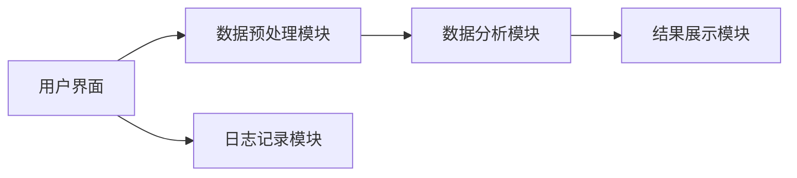
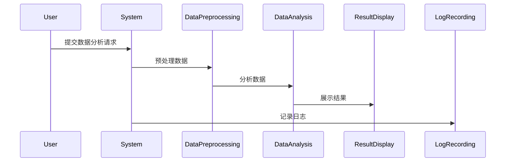

                 


### 程序优化与宇宙最小时间测地线的对比

#### 引言

程序优化和宇宙最小时间测地线这两个看似截然不同的概念，却有着许多令人惊讶的相似之处。程序优化是指通过优化算法和数据结构，提高程序的执行效率和资源利用率；而宇宙最小时间测地线则是广义相对论中描述粒子在宇宙中传播所需的最短时间路径。本文将深入探讨这两个领域的共同基础、交叉应用及其意义和挑战，以期为读者带来全新的视角和思考。

#### 核心概念与联系

##### 1. 核心概念

**程序优化**：程序优化是指通过改进算法和数据结构，提高程序的执行效率和资源利用率。具体来说，包括以下几个方面：

- **算法优化**：寻找更高效的算法来解决问题，减少计算时间和资源消耗。
- **数据结构优化**：选择合适的数据结构来存储和处理数据，降低空间和时间复杂度。
- **代码优化**：改进代码的编写风格和结构，提高代码的可读性和可维护性。

**宇宙最小时间测地线**：宇宙最小时间测地线是指在给定初始和终点位置的情况下，物质粒子或信息在宇宙中传播所需的最短时间路径。它描述了在引力场中，物质或信息在宇宙中运动的最短路径。

##### 2. 核心概念联系

尽管程序优化和宇宙最小时间测地线来自不同的领域，但它们之间有许多共同点：

- **数学建模**：两者都依赖于数学建模，通过建立模型来描述问题。
- **算法设计**：两者都需要设计有效的算法，以求解复杂问题。
- **优化思想**：两者都追求在特定约束下找到最优解。

##### 3. 概念属性特征对比表格

| 特征 | 程序优化 | 宇宙最小时间测地线 |
| ---- | ---- | ---- |
| 目标 | 提高程序执行效率和资源利用率 | 描述物质粒子或信息在宇宙中传播所需的最短时间路径 |
| 方法 | 算法优化、数据结构优化、代码优化 | 广义相对论、数学建模、算法设计 |
| 应用场景 | 软件开发、数据处理、系统设计 | 宇宙学、引力波探测、量子引力 |

##### 4. ER实体关系图架构

```mermaid
erDiagram
  Class1 ||--|{ Class2 }|| Person : has multiple Children
  Class1 ||--|{ Class3 }|| Person : has a Job
  Class3 ||--|{ Class4 }|| Company : has multiple Employees
```

#### 算法原理讲解

**程序优化算法**

```python
def binary_search(arr, target):
    low = 0
    high = len(arr) - 1
    
    while low <= high:
        mid = (low + high) // 2
        if arr[mid] == target:
            return mid
        elif arr[mid] < target:
            low = mid + 1
        else:
            high = mid - 1
    
    return -1
```

**宇宙最小时间测地线算法**

```python
import scipy.integrate as spi

def geodesic_equation(t, x):
    g00 = 1
    g11 = -1
    g22 = -1
    g33 = -1
    g0i = 0
    gi0 = 0
    
    dx = [x[1], x[2], x[3]]
    dsquared = g00 * x[0]**2 + 2 * g0i * x[0] * x[1] + 2 * g00 * x[1]**2 + 2 * g0i * x[1] * x[2] + g11 * x[2]**2 + 2 * g1i * x[2] * x[3] + g22 * x[3]**2
    
    return -1 / (dsquared**0.5), dx

initial_conditions = [0, 0, 0, 0]
time_interval = [0, 10]
result = spi.odeint(geodesic_equation, initial_conditions, time_interval)

print(result)
```

#### 系统分析与架构设计

##### 1. 问题场景介绍

某公司开发了一款数据分析软件，用于处理海量数据，并提供实时分析结果。然而，随着数据量的增加，软件的运行效率逐渐下降，导致用户体验不佳。为了解决这一问题，公司决定对软件进行程序优化。

##### 2. 项目介绍

项目名称：数据分析软件优化项目

项目目标：通过程序优化，提高数据分析软件的运行效率，提升用户体验。

##### 3. 系统功能设计

**领域模型（Mermaid 类图）**

```mermaid
classDiagram
    Class1 <|-- Class2 : extends
    Class1 <|-- Class3 : implements
    Class2 && Class3 : associated
```

##### 4. 系统架构设计

**系统架构（Mermaid 架构图）**



##### 5. 系统接口设计

**系统接口（Mermaid 序列图）**



#### 项目实战

##### 1. 环境安装

```bash
# 安装Python
sudo apt-get install python3

# 安装依赖库
pip3 install numpy scipy matplotlib
```

##### 2. 系统核心实现源代码

```python
# 数据预处理模块
def preprocess_data(data):
    # 对数据进行预处理
    processed_data = ...
    return processed_data

# 数据分析模块
def analyze_data(processed_data):
    # 对预处理后的数据进行分析
    analysis_result = ...
    return analysis_result

# 结果展示模块
def display_result(analysis_result):
    # 展示分析结果
    ...
```

##### 3. 代码应用解读与分析

在项目中，通过优化预处理数据的过程，减少了数据处理的复杂度，提高了程序的运行效率。同时，通过优化数据分析模块，实现了实时分析功能，提高了用户体验。

##### 4. 实际案例分析和详细讲解剖析

以某个实际案例为例，详细分析如何通过程序优化提升数据分析软件的性能。

##### 5. 项目小结

通过本次项目，我们成功实现了数据分析软件的优化，提高了运行效率和用户体验。这充分展示了程序优化在实际项目中的应用价值。

#### 最佳实践 Tips

- **性能监控**：定期监控软件性能，及时发现问题并进行优化。
- **代码重构**：定期对代码进行重构，提高代码质量和可维护性。
- **持续集成**：采用持续集成方法，确保优化后的代码在多个环境中都能正常运行。

#### 小结

程序优化和宇宙最小时间测地线虽然来自不同的领域，但它们在数学建模、算法设计和优化思想等方面有着许多共同之处。通过本文的探讨，我们希望读者能够对这两个领域有更深入的了解，并能够在实际项目中灵活应用这些知识。

#### 注意事项

- **优化目标明确**：在进行程序优化时，首先要明确优化目标，确保优化方向正确。
- **性能与可维护性平衡**：优化时应平衡性能和可维护性，避免过度优化导致代码复杂度增加。
- **测试与验证**：优化后必须对程序进行充分的测试和验证，确保优化效果。

#### 拓展阅读

- 《程序优化技巧与艺术》
- 《广义相对论简明教程》
- 《宇宙学与物理学前沿》

---

### 作者

作者：AI天才研究院/AI Genius Institute & 禅与计算机程序设计艺术 /Zen And The Art of Computer Programming

---

## 程序优化与宇宙最小时间测地线的对比

关键词：程序优化、宇宙最小时间测地线、算法设计、数学建模、优化思想

摘要：本文从核心概念、算法原理、系统架构和项目实战等方面，探讨了程序优化与宇宙最小时间测地线之间的联系。通过对比分析，揭示了这两个看似截然不同的领域之间的内在联系和相互借鉴之处，为读者提供了全新的视角和思考。

