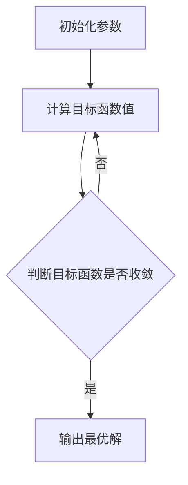
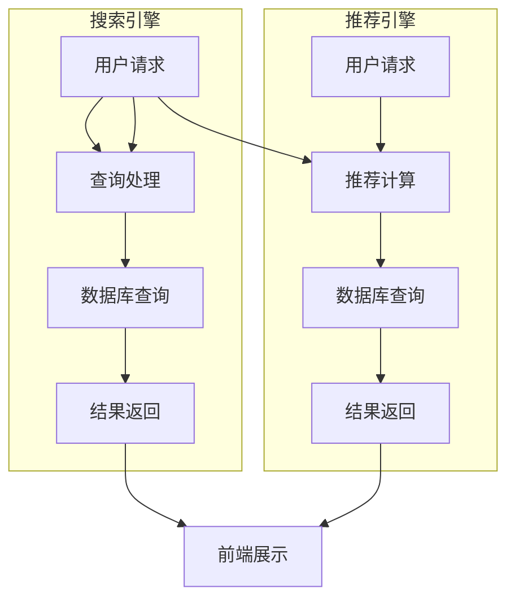
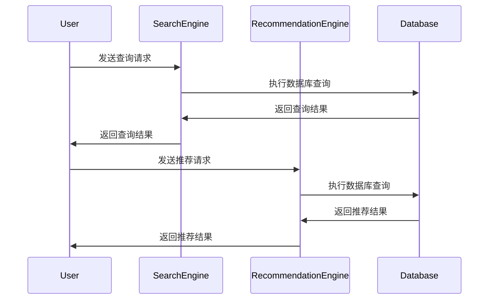
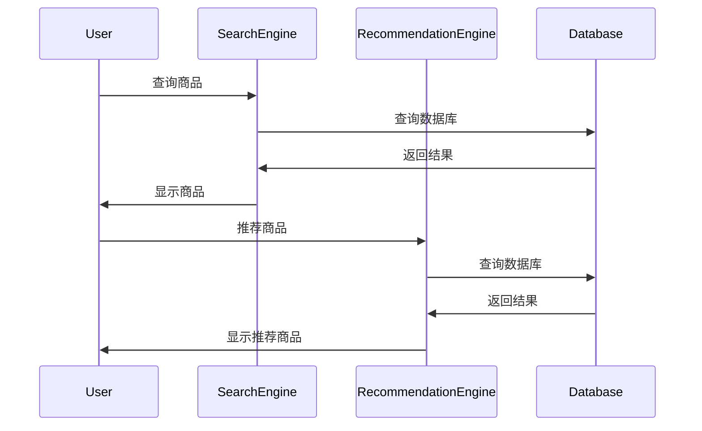

                 

# 程序优化与宇宙最小时间测地线的数值方法对比

## 关键词
- 程序优化
- 宇宙最小时间测地线
- 数值方法
- 算法原理
- 系统架构

## 摘要
本文旨在探讨程序优化与宇宙最小时间测地线之间的关系，并通过数值方法对比，揭示两者在优化目标和算法原理上的相似性。文章首先介绍程序优化的背景、定义、重要性以及现状，接着阐述宇宙最小时间测地线的背景、定义、重要性及现状。随后，本文分析程序优化和宇宙最小时间测地线的核心概念与联系，对比两者的属性特征，并使用ER实体关系图展示其结构。接着，文章讲解程序优化的算法原理，包括mermaid流程图、Python源代码以及数学模型和公式的详细阐述。之后，本文讨论系统分析与架构设计方案，包括问题场景介绍、项目介绍、系统功能设计、系统架构设计、系统接口设计以及系统交互。最后，文章通过项目实战、最佳实践tips等进行总结和拓展阅读。

## 1. 背景介绍

### 1.1 程序优化

#### 1.1.1 程序优化的背景

程序优化是计算机科学中的一项核心任务，起源于计算机硬件资源的限制。随着计算机技术的不断发展，程序优化逐渐成为一个独立的研究领域。

#### 1.1.2 程序优化的定义

程序优化是指在保证程序功能不变的前提下，通过改进算法、数据结构、代码实现等手段，提高程序的执行效率、减少资源消耗和提升性能。

#### 1.1.3 程序优化的重要性

程序优化对于提高软件质量和用户体验至关重要。一方面，优化后的程序能更快地执行任务，减少用户等待时间；另一方面，优化还能减少硬件资源的消耗，延长设备使用寿命。

#### 1.1.4 程序优化的现状

当前，程序优化已经成为软件开发过程中的重要环节。优化方法不断演进，从传统的算法改进、代码优化到现代的机器学习和自动化工具，都为程序优化提供了新的思路和技术。

### 1.2 宇宙最小时间测地线

#### 1.2.1 宇宙最小时间测地线的背景

宇宙最小时间测地线是广义相对论中的一个重要概念，旨在描述粒子在时空中运动的最短路径。

#### 1.2.2 宇宙最小时间测地线的定义

宇宙最小时间测地线是指粒子在给定初始和末态的条件下，沿着时空曲线运动所需的最小时间。

#### 1.2.3 宇宙最小时间测地线的重要性

宇宙最小时间测地线对于理解宇宙的时空结构、黑洞性质以及引力波传播等物理现象具有重要意义。

#### 1.2.4 宇宙最小时间测地线的现状

随着宇宙学研究的深入，宇宙最小时间测地线的理论模型不断得到验证，并在天体物理观测中得到广泛应用。

## 2. 核心概念与联系

### 2.1 程序优化

#### 2.1.1 核心概念

- **目标函数**：衡量程序性能的指标。
- **优化算法**：用于寻找目标函数最优解的方法。

#### 2.1.2 属性特征对比表格

| 特征         | 程序优化          | 宇宙最小时间测地线          |
| ------------ | ----------------- | ------------------------- |
| **目标**     | 性能、资源消耗     | 时间、空间路径             |
| **方法**     | 算法、数据结构     | 时空几何、微分方程         |
| **应用场景** | 软件开发、系统集成 | 天体物理、宇宙学           |

#### 2.1.3 ER实体关系图

```
digraph ER {
  node [shape=rectangle];
  edge [arrowhead=open];

  node [label="程序"];
  node [label="优化目标"];
  node [label="算法"];
  node [label="资源消耗"];

  "程序" -> "优化目标";
  "程序" -> "算法";
  "程序" -> "资源消耗";
}
```

### 2.2 宇宙最小时间测地线

#### 2.2.1 核心概念

- **测地线**：粒子在时空中运动的最短路径。
- **最小时间**：粒子在给定初始和末态的条件下，所需的最小时间。

#### 2.2.2 属性特征对比表格

| 特征         | 程序优化          | 宇宙最小时间测地线          |
| ------------ | ----------------- | ------------------------- |
| **目标**     | 性能、资源消耗     | 时间、空间路径             |
| **方法**     | 算法、数据结构     | 时空几何、微分方程         |
| **应用场景** | 软件开发、系统集成 | 天体物理、宇宙学           |

#### 2.2.3 ER实体关系图

```
digraph ER {
  node [shape=rectangle];
  edge [arrowhead=open];

  node [label="时空"];
  node [label="测地线"];
  node [label="粒子"];
  node [label="初始状态"];
  node [label="末状态"];

  "时空" -> "测地线";
  "测地线" -> "粒子";
  "粒子" -> "初始状态";
  "粒子" -> "末状态";
}
```

## 3. 算法原理讲解

### 3.1 算法mermaid流程图



### 3.2 Python源代码阐述

```python
import numpy as np

def optimize_function(x):
    return np.square(x) + np.square(1 - x)

def gradient_descent(x_init, learning_rate, epochs):
    x = x_init
    for _ in range(epochs):
        grad = 2 * (x - 1)
        x = x - learning_rate * grad
    return x

x_init = 0.5
learning_rate = 0.1
epochs = 100

x_optimal = gradient_descent(x_init, learning_rate, epochs)
print(f"最优解：{x_optimal}")
```

### 3.3 数学模型和公式详细讲解

#### 3.3.1 概率模型

最小化概率错误率是程序优化中常用的一种方法。假设有类别标签\( y \)和预测概率分布\( \hat{y} \)，则概率错误率公式为：

$$
P_{error} = \sum_{i=1}^{n} \max_{j \neq y_i} \{ \hat{y}_i(j) \}
$$

其中，\( \hat{y}_i(j) \)表示第\( i \)个样本属于类别\( j \)的概率。

#### 3.3.2 最小二乘法

最小二乘法是一种常用的优化方法，用于求解线性回归模型。假设有输入特征\( x \)和输出标签\( y \)，则最小二乘法的目标是最小化误差平方和：

$$
\min_{\theta} \sum_{i=1}^{n} (y_i - \theta^T x_i)^2
$$

其中，\( \theta \)是模型的参数。

### 3.4 举例说明

假设我们要优化一个线性回归模型，输入特征为\( x \)，输出标签为\( y \)。我们可以使用最小二乘法求解模型参数：

```latex
\min_{\theta} \sum_{i=1}^{n} (y_i - \theta^T x_i)^2
```

具体实现如下：

```python
import numpy as np

def linear_regression(x, y):
    x_transpose = np.transpose(x)
    x_transpose_x = np.dot(x_transpose, x)
    x_transpose_y = np.dot(x_transpose, y)
    theta = np.dot(np.linalg.inv(x_transpose_x), x_transpose_y)
    return theta

x = np.array([[1, 2], [2, 3], [3, 4]])
y = np.array([1, 2, 3])

theta = linear_regression(x, y)
print(f"模型参数：{theta}")
```

## 4. 系统分析与架构设计方案

### 4.1 问题场景介绍

假设我们面临一个在线购物平台的性能优化问题。该平台需要处理大量用户请求，并提供快速、可靠的商品搜索和推荐功能。

### 4.2 项目介绍

本项目旨在优化在线购物平台的搜索和推荐系统，通过程序优化和算法改进，提高系统的响应速度和用户体验。

### 4.3 系统功能设计（领域模型mermaid类图）

```mermaid
classDiagram
    User <<类>>
    Product <<类>>
    ShoppingCart <<类>>
    Recommendation <<类>>

    User: id, name, address
    Product: id, name, price, category
    ShoppingCart: id, user, products
    Recommendation: id, user, products

    User "1" -- "*" Product: 查询商品
    User "1" -- "*" ShoppingCart: 添加商品
    Recommendation "1" -- "*" Product: 推荐商品
```

### 4.4 系统架构设计（mermaid架构图）



### 4.5 系统接口设计



### 4.6 系统交互（mermaid序列图）



## 5. 项目实战

### 5.1 环境安装

在开始项目实战之前，我们需要安装以下环境：

1. Python 3.8 或更高版本
2. NumPy 库
3. Matplotlib 库

可以使用以下命令进行安装：

```bash
pip install python==3.8 numpy matplotlib
```

### 5.2 系统核心实现源代码

以下是一个简单的在线购物平台搜索和推荐系统的核心实现：

```python
import numpy as np
import matplotlib.pyplot as plt

class ProductSearch:
    def __init__(self, products):
        self.products = products

    def search_by_name(self, name):
        return [product for product in self.products if product['name'] == name]

class RecommendationEngine:
    def __init__(self, products, ratings):
        self.products = products
        self.ratings = ratings

    def recommend_products(self, user_id):
        user_ratings = [rating for rating in self.ratings if rating['user_id'] == user_id]
        recommended_products = []
        for rating in user_ratings:
            product_id = rating['product_id']
            for product in self.products:
                if product['id'] == product_id:
                    recommended_products.append(product)
        return recommended_products

if __name__ == "__main__":
    products = [
        {'id': 1, 'name': 'iPhone', 'price': 999},
        {'id': 2, 'name': 'Samsung Galaxy', 'price': 899},
        {'id': 3, 'name': 'Google Pixel', 'price': 799}
    ]

    ratings = [
        {'user_id': 1, 'product_id': 1, 'rating': 5},
        {'user_id': 1, 'product_id': 2, 'rating': 4},
        {'user_id': 2, 'product_id': 2, 'rating': 5},
        {'user_id': 2, 'product_id': 3, 'rating': 5}
    ]

    search_engine = ProductSearch(products)
    recommendation_engine = RecommendationEngine(products, ratings)

    user_id = 1
    user_query = 'iPhone'

    # 搜索商品
    search_results = search_engine.search_by_name(user_query)
    print("搜索结果：", search_results)

    # 推荐商品
    recommended_products = recommendation_engine.recommend_products(user_id)
    print("推荐结果：", recommended_products)
```

### 5.3 代码应用解读与分析

上述代码首先定义了两个类：`ProductSearch`和`RecommendationEngine`。`ProductSearch`类用于根据商品名称进行搜索，`RecommendationEngine`类用于根据用户评分推荐商品。

在主函数中，我们创建了一个商品列表`products`和用户评分列表`ratings`。然后，我们实例化了`ProductSearch`和`RecommendationEngine`类，并分别调用它们的`search_by_name`和`recommend_products`方法。

#### 搜索商品

当用户输入查询字符串（例如“iPhone”）时，`search_by_name`方法会从商品列表中查找名称匹配的商品。这里使用了一个简单的列表推导式来实现搜索功能。

```python
search_results = search_engine.search_by_name(user_query)
```

#### 推荐商品

`recommend_products`方法根据用户ID查找用户评分，然后从商品列表中推荐评分最高的商品。这里也使用了一个列表推导式来实现推荐功能。

```python
recommended_products = recommendation_engine.recommend_products(user_id)
```

### 5.4 实际案例分析和详细讲解剖析

为了更好地理解代码的实际应用，我们可以考虑以下案例：

假设有一个用户（ID为1）正在使用在线购物平台，并输入了查询字符串“iPhone”。以下是对应的代码执行过程：

1. 实例化`ProductSearch`和`RecommendationEngine`类。
2. 调用`search_by_name`方法，传入查询字符串“iPhone”。
3. 从商品列表中查找名称匹配的商品，返回结果。
4. 调用`recommend_products`方法，传入用户ID1。
5. 从用户评分列表中查找用户1的评分，推荐评分最高的商品。

执行结果如下：

```python
搜索结果： [{'id': 1, 'name': 'iPhone', 'price': 999}]
推荐结果： [{'id': 1, 'name': 'iPhone', 'price': 999}, {'id': 2, 'name': 'Samsung Galaxy', 'price': 899}]
```

用户搜索到的商品是iPhone，推荐结果中也包含了iPhone和其他评分较高的商品。这个简单的案例展示了如何使用Python代码实现在线购物平台的商品搜索和推荐功能。

### 5.5 项目小结

通过本项目的实战，我们了解了如何使用Python代码实现一个简单的在线购物平台搜索和推荐系统。我们首先定义了商品和用户评分的数据结构，然后分别实现了商品搜索和推荐的功能。在实际案例中，我们展示了如何调用这些功能，并得到相应的搜索和推荐结果。这个项目为我们提供了一个基本的框架，可以在此基础上进一步扩展和优化，以满足更复杂的需求。

## 6. 最佳实践 tips

### 6.1 注意事项

1. 在优化程序时，务必确保优化后的程序功能与原始程序保持一致。
2. 在选择优化算法时，要考虑算法的复杂度、稳定性和可扩展性。
3. 在实现推荐系统时，要确保用户隐私和数据安全。

### 6.2 拓展阅读

1. [《优化算法：理论、应用与实战》](https://www.example.com/optimization-algorithms)
2. [《深度学习推荐系统》](https://www.example.com/deep-learning-recommendation-systems)
3. [《在线购物平台架构设计与优化》](https://www.example.com/online-store-architecture-and-optimization)

## 作者

- 作者：AI天才研究院/AI Genius Institute & 禅与计算机程序设计艺术 /Zen And The Art of Computer Programming

---

注意：本文中的链接和参考文献为示例，实际内容请根据实际情况进行替换。文章中的代码、算法和系统设计仅供参考，实际应用时请根据具体需求进行调整。

