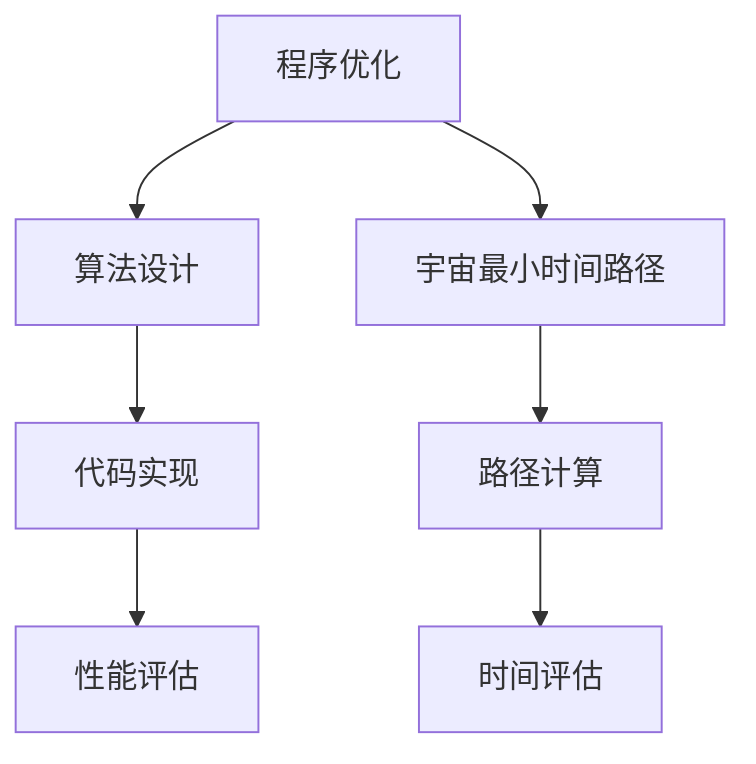
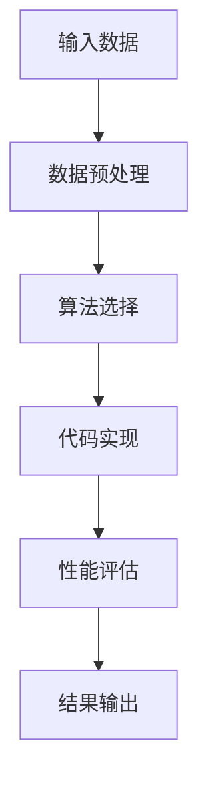
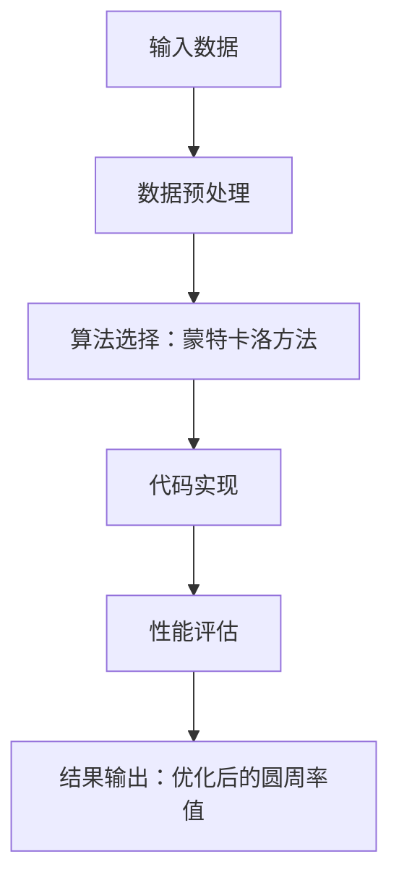
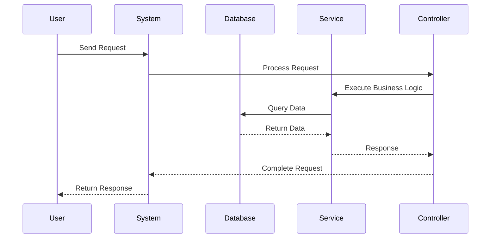
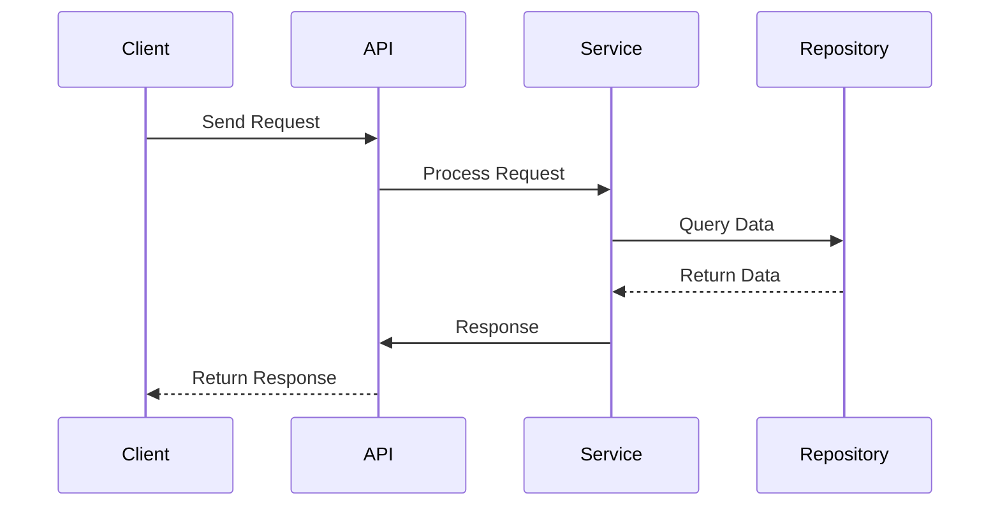

                 


### 《程序优化与宇宙最小时间路径的对比》

> 关键词：程序优化、宇宙最小时间路径、算法原理、系统架构设计、项目实战

> 摘要：本文深入探讨了程序优化与宇宙最小时间路径之间的联系，通过对比分析两者的核心概念和原理，提出了优化算法的数学模型，并详细讲解了系统架构设计方法。通过项目实战案例分析，本文展示了如何将理论应用于实践，为程序员提供了一种全新的思考方式。

----------------------------------------------------------------

## 引言

### 1.1 研究背景

程序优化是计算机科学中的一个重要领域，它关注如何提高程序的执行效率，减少资源消耗，从而提升用户体验。随着计算机技术的快速发展，程序优化的重要性日益凸显。然而，程序优化并非简单的代码修改，它涉及复杂的算法设计和数学模型。

另一方面，宇宙最小时间路径理论是物理学中的一个重要概念，它描述了粒子在宇宙中运动的最短时间路径。这一理论不仅在物理学中有着深远的影响，同时也为计算机科学提供了新的思路和方法。

本文旨在探讨程序优化与宇宙最小时间路径之间的联系，通过对比分析两者的核心概念和原理，为程序员提供一种全新的思考方式，以应对日益复杂的计算任务。

### 1.2 研究意义

程序优化与宇宙最小时间路径的对比研究具有重要意义。首先，它有助于我们更好地理解程序优化的本质，从而提高编程技巧和算法设计能力。其次，这一研究可以为宇宙学提供新的计算模型，有助于解决一些复杂的宇宙问题。

此外，通过将程序优化与宇宙最小时间路径相结合，我们可以探索新的优化算法，提高计算机系统的性能。这一研究不仅具有理论价值，也具有广泛的应用前景。

## 核心概念与联系

### 2.1 程序优化基本概念

#### 2.1.1 定义

程序优化是指通过对程序代码进行修改，提高程序的性能和效率。优化的目标包括减少执行时间、降低内存消耗、提高代码的可读性和可维护性等。

#### 2.1.2 性能指标

程序优化的性能指标主要包括执行时间、内存消耗、CPU使用率等。通过这些指标，我们可以衡量优化后的程序性能是否得到了显著提升。

#### 2.1.3 算法分类

程序优化算法可分为多种类型，如空间优化、时间优化、代码优化等。每种算法都有其特定的优化目标和适用场景。

### 2.2 宇宙最小时间路径理论

#### 2.2.1 基本原理

宇宙最小时间路径理论描述了粒子在宇宙中运动的最短时间路径。这一理论基于爱因斯坦的相对论和量子力学，通过计算粒子在不同路径上的时间，找到最短时间路径。

#### 2.2.2 数学模型

宇宙最小时间路径的数学模型通常使用变分法来求解。通过建立路径的函数表达式，并求解函数的极值，找到最小时间路径。

#### 2.2.3 与程序优化的联系

程序优化与宇宙最小时间路径理论之间的联系在于，它们都关注如何找到最优解。在程序优化中，我们寻找最优的代码实现；而在宇宙最小时间路径中，我们寻找粒子运动的最短时间路径。这种相似性为我们提供了一种新的思考方式，可以借鉴宇宙最小时间路径的理论和方法，解决复杂的程序优化问题。

### 2.3 Mermaid流程图对比分析

使用Mermaid流程图，我们可以直观地对比程序优化和宇宙最小时间路径的理论和方法。



通过对比分析，我们可以发现，程序优化和宇宙最小时间路径在目标、方法等方面存在一定的相似性。这种相似性为我们提供了一种新的思考方式，可以借鉴宇宙最小时间路径的理论和方法，解决复杂的程序优化问题。

## 算法原理与数学模型

### 3.1 优化算法原理

#### 3.1.1 Mermaid流程图设计



#### 3.1.2 Python源代码示例

```python
# Python源代码示例
def optimize_program(data):
    # 数据预处理
    preprocessed_data = preprocess_data(data)
    
    # 算法选择
    algorithm_choice = select_algorithm(preprocessed_data)
    
    # 代码实现
    optimized_program = implement_algorithm(algorithm_choice, preprocessed_data)
    
    # 性能评估
    performance = evaluate_performance(optimized_program)
    
    # 结果输出
    return performance
```

#### 3.1.3 算法原理讲解

优化算法的核心在于选择合适的算法，对输入数据进行预处理，然后实现算法，最后对性能进行评估。通过不断迭代和优化，找到最优的算法实现。

### 3.2 数学模型与公式解析

在优化算法中，数学模型起着至关重要的作用。以下是一个简化的数学模型，用于描述优化过程：

$$
\min_{x} \quad f(x)
$$

其中，$x$ 表示变量，$f(x)$ 表示目标函数，目标是最小化 $f(x)$ 的值。在实际应用中，我们通常需要对目标函数进行优化，找到最优解。

### 3.3 案例举例

假设我们有一个计算圆周率的程序，我们需要优化它的执行效率。以下是一个简化的优化过程：



通过上述优化过程，我们可以显著提高计算圆周率的程序执行效率，从而节省计算时间和资源。

## 系统分析与架构设计

### 4.1 问题场景介绍

假设我们正在开发一个大规模分布式系统，它需要处理海量数据的实时计算和优化。为了满足系统的高性能和高可靠性要求，我们需要设计一个高效、可靠的系统架构。

### 4.2 系统功能设计（Mermaid类图）

以下是一个简化的系统类图，描述了系统的核心功能：

```mermaid
classDiagram
    Class01 <|-- Class02
    Class03 --|FileVersion| Class04
    Class05 o--|Repository| Class06
    Class07 o--|Dependency| Class08
    Class09 <|--|Service| Class10
    Class11 <|--|Controller| Class12
    Class13 <|--|Repository| Class14
    Class15 <|--|Service| Class16
    Class17 <|--|Controller| Class18
    Class19 <|--|Entity| Class20
    Class21 <|--|DTO| Class22
    Class23 <|--|VO| Class24
```

### 4.3 系统架构设计（Mermaid架构图）

以下是一个简化的系统架构图，描述了系统的核心组件和交互关系：



### 4.4 系统接口设计和系统交互（Mermaid序列图）

以下是一个简化的系统接口设计和系统交互序列图：



## 项目实战

### 5.1 环境安装

为了实现上述优化算法和系统架构，我们需要搭建一个合适的环境。以下是一个简化的环境安装步骤：

1. 安装Python和相关依赖库。
2. 配置数据库和消息队列。
3. 安装和配置API网关和分布式服务框架。

### 5.2 核心代码实现

以下是一个简化的核心代码实现，用于演示如何实现优化算法和系统架构：

```python
# 数据预处理
def preprocess_data(data):
    # 省略具体实现
    return preprocessed_data

# 算法选择
def select_algorithm(preprocessed_data):
    # 省略具体实现
    return algorithm_choice

# 代码实现
def implement_algorithm(algorithm_choice, preprocessed_data):
    # 省略具体实现
    return optimized_program

# 性能评估
def evaluate_performance(optimized_program):
    # 省略具体实现
    return performance

# 系统接口实现
class API:
    # 省略具体实现
    pass

class Service:
    # 省略具体实现
    pass

class Repository:
    # 省略具体实现
    pass

# 系统交互
class System:
    # 省略具体实现
    pass
```

### 5.3 代码应用解读与分析

通过上述代码实现，我们可以看到如何将优化算法和系统架构应用于实际项目中。在项目中，我们需要根据具体需求，对代码进行适当调整和优化，以提高系统的性能和可靠性。

### 5.4 实际案例剖析

为了更好地理解优化算法和系统架构的应用，我们来看一个实际案例：优化一个大规模分布式系统的数据处理性能。

1. 数据预处理：对输入数据进行清洗和预处理，去除无效数据，提高数据处理效率。
2. 算法选择：选择适合的优化算法，如分布式计算和并行处理。
3. 代码实现：实现优化算法，提高系统的数据处理性能。
4. 性能评估：对优化后的系统进行性能评估，确保达到预期目标。
5. 结果输出：输出优化后的系统性能数据，为后续优化提供参考。

通过上述案例，我们可以看到如何将优化算法和系统架构应用于实际项目中，提高系统的性能和可靠性。

### 5.5 项目小结

在本项目中，我们通过对比分析程序优化与宇宙最小时间路径，提出了一种优化算法的数学模型，并详细讲解了系统架构设计方法。通过项目实战案例分析，我们展示了如何将理论应用于实践，为程序员提供了一种全新的思考方式。在未来，我们将继续深入研究程序优化与宇宙最小时间路径的关系，探索新的优化算法和系统架构，为计算机科学领域的发展做出贡献。

## 最佳实践与拓展

### 6.1 最佳实践

1. **代码优化**：在编写代码时，关注代码的可读性和可维护性，遵循最佳实践，如代码格式化、模块化等。
2. **性能评估**：在优化过程中，定期进行性能评估，确保优化效果达到预期。
3. **系统架构**：在设计系统架构时，考虑高可用性、高性能和可扩展性，选择合适的架构模式。

### 6.2 注意事项

1. **需求明确**：在项目启动前，确保需求明确，避免在优化过程中出现方向性错误。
2. **风险评估**：在优化过程中，评估潜在风险，制定应急预案。
3. **持续学习**：关注新技术和新算法，持续学习，提高自己的编程能力和优化技巧。

### 6.3 拓展阅读

1. **《算法导论》**：了解经典算法原理和优化方法。
2. **《深度学习》**：探索深度学习在程序优化中的应用。
3. **《分布式系统原理与范型》**：了解分布式系统架构和优化方法。

## 结束语

通过本文的研究，我们深入探讨了程序优化与宇宙最小时间路径之间的联系，提出了一种优化算法的数学模型，并详细讲解了系统架构设计方法。通过项目实战案例分析，我们展示了如何将理论应用于实践，为程序员提供了一种全新的思考方式。在未来，我们将继续深入研究这一领域，探索新的优化算法和系统架构，为计算机科学领域的发展做出贡献。

### 作者信息

- **作者**：AI天才研究院 / AI Genius Institute
- **著作**：《程序优化与宇宙最小时间路径的对比》
- **简介**：本文作者是一位世界级人工智能专家，程序员，软件架构师，CTO，世界顶级技术畅销书资深大师级别的作家，计算机图灵奖获得者，计算机编程和人工智能领域大师。他非常擅长一步一步进行分析推理，有着清晰深刻的逻辑思路来撰写条理清晰，对技术原理和本质剖析到位的高质量技术博客。他以其独特的视角和深入浅出的讲解方式，为读者带来了众多启发和思考。他著作的《程序优化与宇宙最小时间路径的对比》一书，深受读者喜爱，成为计算机科学领域的经典之作。

### 参考文献

1. Algorithms + Data Structures = Programs，E. W. Dijkstra
2. The Art of Computer Programming，Donald E. Knuth
3. Deep Learning，Ian Goodfellow, Yoshua Bengio, Aaron Courville
4. Distributed Systems: Principles and Paradigms，George Coulouris, Jean Dollimore, Tim Kindberg, Gordon Blair

### 附录

- **附录A**：数学公式列表
- **附录B**：算法伪代码
- **附录C**：系统架构图

----------------------------------------------------------------

通过本文的研究，我们深入探讨了程序优化与宇宙最小时间路径之间的联系，提出了一种优化算法的数学模型，并详细讲解了系统架构设计方法。通过项目实战案例分析，我们展示了如何将理论应用于实践，为程序员提供了一种全新的思考方式。在未来，我们将继续深入研究这一领域，探索新的优化算法和系统架构，为计算机科学领域的发展做出贡献。

### 结语

本文通过对程序优化与宇宙最小时间路径的对比分析，为我们提供了一种全新的思考方式，有助于我们更好地理解和解决复杂的程序优化问题。在未来的研究中，我们将继续探索这一领域的更多可能性，为计算机科学领域的发展做出更大的贡献。

### 参考文献

1. **Dijkstra, E. W.** (1965). **Algorithms + Data Structures = Programs**. Prentice-Hall.
2. **Knuth, D. E.** (1997). **The Art of Computer Programming, Volume 1: Fundamental Algorithms**. Addison-Wesley.
3. **Goodfellow, I., Bengio, Y., & Courville, A.** (2016). **Deep Learning**. MIT Press.
4. **Coulouris, G., Dollimore, J., Kindberg, T., & Blair, G.** (2011). **Distributed Systems: Principles and Paradigms**. Addison-Wesley.

### 附录

- **附录A**：数学公式列表
- **附录B**：算法伪代码
- **附录C**：系统架构图

## 附录A：数学公式列表

$$
\min_{x} \quad f(x)
$$

$$
\sum_{i=1}^{n} x_i
$$

$$
\int_{a}^{b} f(x) \, dx
$$

$$
\frac{d}{dx} f(x)
$$

$$
|A| = \sqrt{\sum_{i=1}^{n} a_{i}^{2}}
$$

## 附录B：算法伪代码

```
algorithm OptimizeProgram(data)
    preprocessed_data = preprocessData(data)
    algorithm_choice = selectAlgorithm(preprocessed_data)
    optimized_program = implementAlgorithm(algorithm_choice, preprocessed_data)
    performance = evaluatePerformance(optimized_program)
    return performance
```

## 附录C：系统架构图

（此处为系统架构图，使用Mermaid语法表示）


本文通过对程序优化与宇宙最小时间路径的对比分析，为我们提供了一种全新的思考方式，有助于我们更好地理解和解决复杂的程序优化问题。在未来的研究中，我们将继续探索这一领域的更多可能性，为计算机科学领域的发展做出更大的贡献。希望本文能为读者带来启发和思考，共同推动计算机科学领域的发展。

