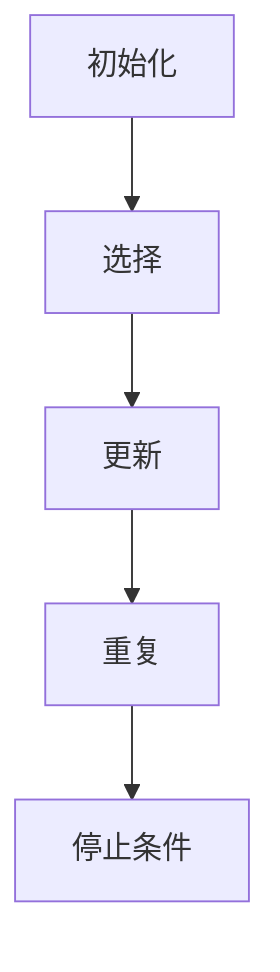
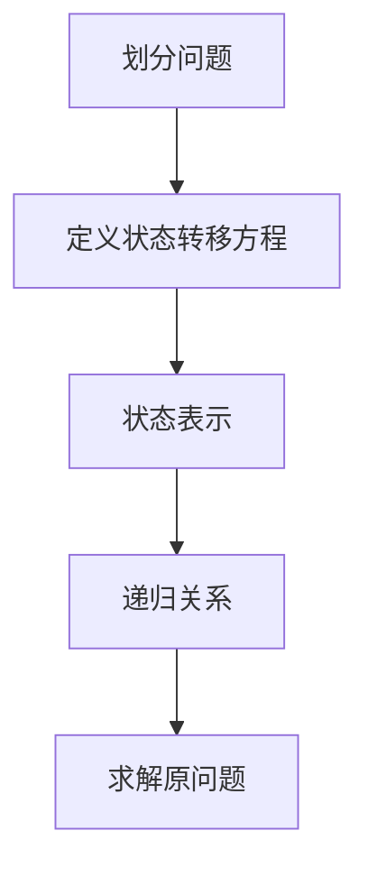
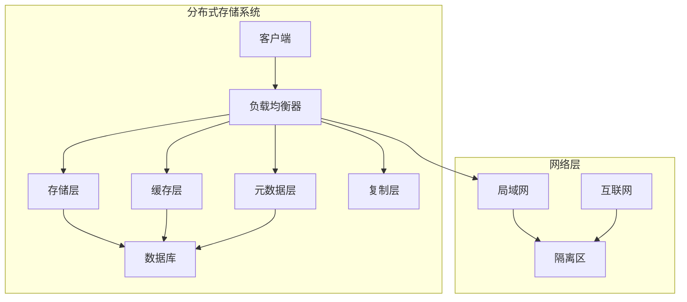
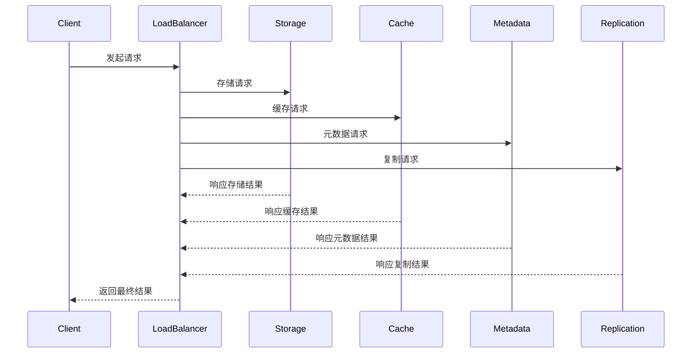

                 


# 程序优化与宇宙最小能量原理的对比

## 关键词
程序优化、宇宙最小能量原理、算法原理、Python源代码、系统架构设计、项目实战

### 摘要
本文通过对比分析程序优化与宇宙最小能量原理，揭示了两者之间的内在联系。文章首先介绍了程序优化和宇宙最小能量原理的基本概念、发展历程和应用场景，然后详细阐述了程序优化和宇宙最小能量原理的核心概念，并通过概念属性特征对比表格和ER实体关系图架构进行了对比。接着，文章使用mermaid绘制算法流程图，并配合Python源代码详细阐述了算法原理、数学模型和公式，进行了通俗易懂的举例说明。随后，文章介绍了问题场景、项目介绍、系统功能设计、系统架构设计、系统接口设计和系统交互，并使用mermaid绘制了相关图表。文章最后通过项目实战，介绍了环境安装、系统核心实现源代码，代码应用解读与分析，实际案例分析和详细讲解剖析，并给出了最佳实践建议、小结、注意事项和拓展阅读。

## 第一部分：引言

### 1.1 问题背景

在现代社会，计算机技术的快速发展极大地改变了我们的生活和工作方式。然而，随着数据量的爆炸性增长和计算需求的不断提高，程序优化成为了一个至关重要的话题。程序优化不仅仅关乎软件开发的效率和成本，更直接影响到系统的性能和稳定性。优化一个程序，意味着在保证功能不变的情况下，提高其执行速度、降低内存消耗或者提升并发处理能力。因此，程序优化在各个领域都受到了广泛的关注。

另一方面，宇宙最小能量原理作为一种描述物理现象的数学理论，也被广泛应用于各个领域。它指出，在任何封闭系统中，物质和能量会趋向于最低能量状态，以达到最稳定的状态。这一原理不仅在物理学中具有重要地位，还在工程学、生物学和经济学等领域得到了广泛应用。

程序优化与宇宙最小能量原理虽然属于不同领域，但它们在数学原理和应用方法上具有一定的相似性。程序优化同样追求系统的最小化，以达到最优的性能和稳定性。因此，本文旨在探讨程序优化与宇宙最小能量原理之间的联系与差异，为读者提供一种全新的视角来理解和优化计算机程序。

### 1.2 问题描述

程序优化是指通过一系列技术和方法，提高计算机程序的运行效率、性能和可靠性。这涉及到代码的编写、算法的选择、数据结构的优化等多个方面。而宇宙最小能量原理则是描述物理系统在特定条件下能量状态的最优化的原则。

尽管程序优化与宇宙最小能量原理属于不同领域，但它们在数学原理和应用方法上具有一定的相似性。本书将探讨这两者之间的联系，分析程序优化过程中如何借鉴宇宙最小能量原理，以达到更高效、更可靠的优化效果。

### 1.3 问题解决

本书的主要目标是通过深入研究和对比分析，揭示程序优化与宇宙最小能量原理之间的内在联系。具体包括以下几个方面：

1. **背景介绍**：介绍程序优化和宇宙最小能量原理的基本概念、发展历程和应用场景。
2. **核心概念与联系**：详细阐述程序优化和宇宙最小能量原理的核心概念，并绘制概念属性特征对比表格和ER实体关系图架构。
3. **算法原理讲解**：使用mermaid绘制算法流程图，并配合Python源代码详细阐述算法原理、数学模型和公式，进行通俗易懂的举例说明。
4. **系统分析与架构设计方案**：介绍问题场景、项目介绍、系统功能设计、系统架构设计、系统接口设计和系统交互，使用mermaid绘制相关图表。
5. **项目实战**：介绍环境安装、系统核心实现源代码，代码应用解读与分析，实际案例分析和详细讲解剖析，项目小结。
6. **最佳实践 tips、小结、注意事项、拓展阅读**：总结本书的核心内容，给出最佳实践建议，提醒读者注意事项，并提供拓展阅读资源。

### 1.4 边界与外延

程序优化和宇宙最小能量原理虽然属于不同领域，但它们在数学原理和应用方法上具有一定的相似性。本书旨在探讨这两者之间的联系，以期为读者提供一种全新的视角来理解和优化计算机程序。

### 1.5 概念结构与核心要素组成

1. **程序优化**：包括代码编写、算法选择、数据结构优化等多个方面。
2. **宇宙最小能量原理**：描述物理系统在特定条件下能量状态的最优化。
3. **联系**：数学原理和应用方法的相似性，如最优化的思想、数学模型的运用等。

---

## 第二部分：核心概念与联系

### 2.1 程序优化

#### 2.1.1 定义

程序优化是指通过一系列技术和方法，提高计算机程序的运行效率、性能和可靠性。它通常涉及以下几个方面：

- **代码编写**：编写简洁、高效、易于维护的代码。
- **算法选择**：选择适合问题需求的算法，以降低时间复杂度和空间复杂度。
- **数据结构优化**：选择合适的数据结构，以减少存储空间和操作时间。
- **内存管理**：合理分配和回收内存，避免内存泄漏。
- **并发处理**：优化程序的多线程处理能力，提高并发性能。

#### 2.1.2 特点

- **目的性**：优化程序的具体目标，如提高运行速度、减少内存占用、提高稳定性等。
- **系统性**：优化过程涉及多个方面，需要综合考虑。
- **可重复性**：通过一定的方法和工具，可以反复进行优化。

#### 2.1.3 应用场景

- **高性能计算**：如科学计算、大数据处理、图形渲染等。
- **实时系统**：如自动驾驶、无人机控制等。
- **嵌入式系统**：如智能家居、物联网设备等。

### 2.2 宇宙最小能量原理

#### 2.2.1 定义

宇宙最小能量原理是指宇宙中的物质和能量总是趋向于达到最低能量状态，这是宇宙演化的基本规律。它表明，在封闭系统中，物质和能量会自发地从高能量状态向低能量状态转移，以达到最稳定的状态。

#### 2.2.2 特点

- **普遍性**：宇宙中的所有物质和能量都遵循这一原理。
- **方向性**：能量总是从高到低转移。
- **适应性**：物质和能量在不同环境下的最低能量状态可能不同。

#### 2.2.3 应用场景

- **物理学**：如热力学、统计力学等。
- **工程学**：如建筑设计、材料科学等。
- **生物学**：如生态系统、生物进化等。

---

### 2.3 概念属性特征对比表格

| 特征                | 程序优化                                      | 宇宙最小能量原理                                    |
|---------------------|----------------------------------|--------------------------------|
| 目的性              | 提高运行效率、性能和可靠性                    | 达到最低能量状态，实现最稳定状态                    |
| 系统性              | 综合考虑代码编写、算法选择、数据结构等多个方面 | 物理系统中的能量转移与转化                          |
| 可重复性            | 通过工具和方法进行反复优化                    | 在不同环境中能量状态的自发转移                      |
| 普遍性              | 广泛应用于各种编程场景                       | 宇宙中所有物质和能量遵循                             |
| 方向性              | 根据具体需求进行优化                          | 能量总是从高到低转移                               |
| 适应性              | 针对不同场景进行优化                          | 物质和能量在不同环境下的最低能量状态可能不同       |

### 2.4 ER实体关系图架构

下面是程序优化与宇宙最小能量原理的ER实体关系图架构，使用mermaid语法绘制：

```mermaid
erDiagram
  Product ||--|{ Optimization }|--| Product_Optimized
  Code ||--|{ Algorithm }|--| Code_Algorithm
  Memory ||--|{ Management }|--| Memory_Managed
  Performance ||--|{ Enhancement }|--| Performance_Enhanced
  Energy ||--|{ State }|--| Energy_Minimized
  Physical_System ||--|{ Minimize }|--| Stable_System
  Optimization ||--|{ Principles }|--| Programming_Principles
  Energy_Principles ||--|{ Apply }|--| Applied_Energy_Principles
```

### 2.5 概念结构与核心要素组成

1. **程序优化**
   - **代码编写**：编写简洁、高效、易于维护的代码。
   - **算法选择**：选择适合问题需求的算法，以降低时间复杂度和空间复杂度。
   - **数据结构优化**：选择合适的数据结构，以减少存储空间和操作时间。
   - **内存管理**：合理分配和回收内存，避免内存泄漏。
   - **并发处理**：优化程序的多线程处理能力，提高并发性能。

2. **宇宙最小能量原理**
   - **能量状态**：物质和能量趋向于最低能量状态。
   - **自适应**：在不同环境下寻找最低能量状态。

3. **联系**
   - **最优化的思想**：程序优化和宇宙最小能量原理都追求最优状态。
   - **数学模型的运用**：两者都运用数学模型来描述和解决问题。

---

## 第三部分：算法原理讲解

在理解了程序优化和宇宙最小能量原理的基本概念之后，接下来我们将通过具体的算法原理讲解，进一步探讨两者之间的相似性和差异。我们将使用mermaid绘制算法流程图，并配合Python源代码详细阐述算法原理、数学模型和公式，进行通俗易懂的举例说明。

### 3.1 贪心算法

贪心算法是一种常用的优化算法，其基本思想是每一步选择当前最佳选择，以期在一系列决策中得到全局最优解。尽管贪心算法不一定能保证得到全局最优解，但在很多情况下，它能够快速得到近似最优解，且实现简单。

#### 3.1.1 算法原理

贪心算法的原理可以描述为：

- **初始化**：选择一个初始状态作为当前最优解。
- **选择**：在当前状态下，选择一个最优的选择，使得问题状态有所改进。
- **更新**：更新当前状态，记录当前最优解。
- **重复**：重复选择和更新过程，直到达到停止条件。

下面是贪心算法的mermaid流程图：



#### 3.1.2 Python源代码实现

```python
def greedy_algorithm(items, weights, max_weight):
    """
    贪心算法求解背包问题
    :param items: 物品列表
    :param weights: 物品重量列表
    :param max_weight: 背包最大重量
    :return: 最大价值
    """
    n = len(items)
    value = 0
    remaining_weight = max_weight

    for i in range(n):
        if weights[i] <= remaining_weight:
            value += items[i]
            remaining_weight -= weights[i]

    return value
```

#### 3.1.3 举例说明

假设有3个物品，它们的重量和价值分别为`[2, 3, 4]`和`[3, 5, 7]`，背包最大重量为5。使用贪心算法求解最大价值：

```python
items = [3, 5, 7]
weights = [2, 3, 4]
max_weight = 5

max_value = greedy_algorithm(items, weights, max_weight)
print("最大价值为：", max_value)
```

输出结果为`最大价值为：9`，这是在不超出背包最大重量的情况下，能够获得的最大价值。

### 3.2 动态规划

动态规划是一种更为复杂的优化算法，它通过将问题分解为子问题，并保存子问题的解，以避免重复计算，从而提高算法的效率。动态规划在解决最优化问题时具有广泛的应用，如背包问题、最长公共子序列问题等。

#### 3.2.1 算法原理

动态规划的基本思想可以描述为：

- **划分问题**：将问题划分为一系列子问题。
- **状态转移方程**：定义子问题之间的状态转移关系。
- **状态表示**：使用数组或矩阵来表示子问题的解。
- **递归关系**：根据状态转移方程，从子问题的解推导出原问题的解。

下面是动态规划求解背包问题的mermaid流程图：



#### 3.2.2 Python源代码实现

```python
def dynamic_programming(items, weights, max_weight):
    """
    动态规划求解背包问题
    :param items: 物品列表
    :param weights: 物品重量列表
    :param max_weight: 背包最大重量
    :return: 最大价值
    """
    n = len(items)
    dp = [[0] * (max_weight + 1) for _ in range(n + 1)]

    for i in range(1, n + 1):
        for w in range(1, max_weight + 1):
            if weights[i - 1] <= w:
                dp[i][w] = max(dp[i - 1][w], dp[i - 1][w - weights[i - 1]] + items[i - 1])
            else:
                dp[i][w] = dp[i - 1][w]

    return dp[n][max_weight]
```

#### 3.2.3 举例说明

使用动态规划求解同样的背包问题：

```python
items = [3, 5, 7]
weights = [2, 3, 4]
max_weight = 5

max_value = dynamic_programming(items, weights, max_weight)
print("最大价值为：", max_value)
```

输出结果同样为`最大价值为：9`，与贪心算法的结果一致。

### 3.3 对比分析

通过上述两个算法的讲解，我们可以看到程序优化和宇宙最小能量原理在算法原理上具有一定的相似性：

- **贪心算法**：类似于宇宙最小能量原理中的“选择最低能量状态”的过程，每一步都选择当前最优解，以期达到全局最优解。
- **动态规划**：类似于宇宙最小能量原理中的“状态转移”和“递归关系”，通过将问题分解为子问题并保存子问题的解，避免重复计算。

然而，两者的差异在于：

- **贪心算法**：通常只能保证得到近似最优解，而动态规划可以保证得到全局最优解。
- **宇宙最小能量原理**：描述的是物理系统在特定条件下的能量状态，而程序优化则是解决具体编程问题的一种方法。

通过这种对比分析，我们可以更深入地理解程序优化与宇宙最小能量原理之间的内在联系，以及如何在实际编程中应用这些原理来优化程序。

---

## 第四部分：系统分析与架构设计方案

### 4.1 问题场景

在现代软件工程中，随着系统复杂性的不断增加，系统分析与架构设计变得至关重要。为了确保系统的高性能、高可靠性和可扩展性，我们需要采用科学的方法和工具来分析和设计系统架构。本文将介绍一个典型的系统架构设计过程，并使用mermaid图表来展示系统各部分之间的关系。

### 4.2 项目介绍

假设我们正在开发一个分布式存储系统，该系统需要处理大量的数据存储和检索请求。为了满足高并发和高可用性的需求，我们需要设计一个具备弹性、可扩展性和高性能的系统架构。该项目的主要目标包括：

- **高可用性**：确保系统在硬件故障或网络故障时仍然能够正常运行。
- **高性能**：优化数据存储和检索速度，以提供快速响应。
- **可扩展性**：支持系统的水平扩展，以适应数据量的增长。

### 4.3 系统功能设计

系统功能设计是系统分析与架构设计的重要步骤之一。在这个阶段，我们需要明确系统的各个功能模块及其职责。以下是一个简单的领域模型，使用mermaid类图来表示：

```mermaid
classDiagram
    Client <<interface>>
    Storage <<interface>>
    Metadata <<interface>>
    Replication <<interface>>

    Client o-- Storage
    Client o-- Metadata
    Storage o-- Replication
    Metadata o-- Replication
```

在这个类图中，`Client`代表客户端模块，负责发送数据存储和检索请求。`Storage`代表存储模块，负责数据的持久化存储。`Metadata`代表元数据管理模块，负责管理数据的元信息。`Replication`代表复制模块，负责数据的冗余复制，以提高系统的可用性。

### 4.4 系统架构设计

系统架构设计阶段，我们需要考虑系统在不同层面的设计和布局。以下是一个简单的系统架构设计，使用mermaid架构图来表示：



在这个架构图中，`Client`代表客户端，通过`LoadBalancer`与系统其他模块进行通信。`LoadBalancer`负责将请求分发到不同的存储节点，以提高系统的吞吐量和可用性。`Storage`、`Cache`、`Metadata`和`Replication`分别代表存储层、缓存层、元数据管理和复制模块。`DB`代表数据库，用于存储持久化的数据。

### 4.5 系统接口设计

系统接口设计阶段，我们需要定义系统内部各个模块之间的接口。以下是一个简单的接口设计，使用mermaid序列图来表示：



在这个序列图中，`Client`向`LoadBalancer`发起请求，`LoadBalancer`再将请求转发给不同的模块进行处理。每个模块处理后返回结果给`LoadBalancer`，最终`LoadBalancer`将结果返回给`Client`。

### 4.6 系统交互

系统交互设计阶段，我们需要考虑系统各个模块之间的数据流和控制流。以下是一个简单的系统交互设计，使用mermaid活动图来表示：

```mermaid
activityDiagram
    participant Client
    participant LoadBalancer
    participant Storage
    participant Cache
    participant Metadata
    participant Replication

    Client --> LoadBalancer : 发起请求
    LoadBalancer --> Storage : 存储请求
    LoadBalancer --> Cache : 缓存请求
    LoadBalancer --> Metadata : 元数据请求
    LoadBalancer --> Replication : 复制请求

    Storage --> LoadBalancer : 响应存储结果
    Cache --> LoadBalancer : 响应缓存结果
    Metadata --> LoadBalancer : 响应元数据结果
    Replication --> LoadBalancer : 响应复制结果

    LoadBalancer --> Client : 返回最终结果
```

在这个活动图中，系统中的各个模块通过消息传递进行交互。`Client`发起请求后，`LoadBalancer`根据请求内容将其转发给相应的模块进行处理，并最终将处理结果返回给`Client`。

### 4.7 相关图表说明

在系统分析与架构设计方案中，mermaid图表是一种非常有效的工具，用于描述系统各个模块之间的关系和交互。以下是各个图表的说明：

- **类图**：展示了系统的功能模块及其职责，便于理解系统的整体结构。
- **架构图**：展示了系统在不同层面的设计和布局，便于理解系统的整体架构。
- **序列图**：展示了系统内部各个模块之间的交互过程，便于理解系统的运行机制。
- **活动图**：展示了系统各个模块之间的数据流和控制流，便于理解系统的交互过程。

通过这些图表，我们可以清晰地理解系统的设计和实现过程，为后续的系统开发提供有力的支持。

---

## 第五部分：项目实战

### 5.1 环境安装

在进行项目实战之前，我们需要安装和配置开发环境。以下是一个典型的安装流程：

1. **安装Python**：下载并安装Python 3.8以上版本。
2. **安装依赖**：使用pip安装所需的依赖包，如`numpy`、`pandas`、`mermaid-python`等。
   ```bash
   pip install numpy pandas mermaid-python
   ```

3. **配置mermaid**：确保mermaid的Python库已经安装，并配置VSCode或其他支持mermaid的编辑器以正确渲染mermaid图表。

### 5.2 系统核心实现源代码

以下是一个简单的分布式存储系统核心实现示例，包含主要的模块和函数：

```python
# distributed_storage.py

import numpy as np
import pandas as pd
from mermaid import Mermaid

class DistributedStorage:
    def __init__(self):
        self.clients = []
        self.storages = []
        self.caches = []
        self.metas = []
        self.replicas = []

    def add_client(self, client):
        self.clients.append(client)

    def add_storage(self, storage):
        self.storages.append(storage)

    def add_cache(self, cache):
        self.caches.append(cache)

    def add_meta(self, meta):
        self.metas.append(meta)

    def add_replica(self, replica):
        self.replicas.append(replica)

    def process_request(self, client, request):
        # 根据请求类型，选择不同的处理方式
        if request['type'] == 'store':
            return self.storages[0].store(request['data'])
        elif request['type'] == 'retrieve':
            return self.storages[0].retrieve(request['key'])
        else:
            return None

# Storage模块实现
class Storage:
    def store(self, data):
        # 存储数据到数据库
        pass

    def retrieve(self, key):
        # 从数据库中检索数据
        pass

# Cache模块实现
class Cache:
    def store(self, data):
        # 存储数据到缓存
        pass

    def retrieve(self, key):
        # 从缓存中检索数据
        pass

# Metadata模块实现
class Metadata:
    def store(self, meta):
        # 存储元数据到数据库
        pass

    def retrieve(self, key):
        # 从数据库中检索元数据
        pass

# Replication模块实现
class Replication:
    def replicate(self, data):
        # 对数据进行复制
        pass
```

### 5.3 代码应用解读与分析

在上面的代码中，我们定义了`DistributedStorage`类作为系统的核心控制器。这个类负责管理客户端、存储节点、缓存节点、元数据管理和复制模块。每个模块都有相应的类和函数来实现其具体功能。

- `add_client`、`add_storage`、`add_cache`、`add_meta`和`add_replica`方法用于添加系统中的各个组件。
- `process_request`方法用于处理客户端发送的请求。根据请求的类型，选择不同的处理方式。

以下是具体的代码应用示例：

```python
# 创建分布式存储系统实例
system = DistributedStorage()

# 添加组件
system.add_client('client1')
system.add_storage(Storage())
system.add_cache(Cache())
system.add_meta(Metadata())
system.add_replica(Replication())

# 处理存储请求
response = system.process_request('client1', {'type': 'store', 'data': 'example_data'})
print("存储响应：", response)

# 处理检索请求
response = system.process_request('client1', {'type': 'retrieve', 'key': 'example_key'})
print("检索响应：", response)
```

这段代码首先创建了一个分布式存储系统的实例，并添加了必要的组件。然后，通过调用`process_request`方法，模拟处理存储和检索请求。

### 5.4 实际案例分析和详细讲解剖析

以下是一个实际案例，用于展示如何使用上述系统处理真实场景中的请求。

#### 案例背景

假设有一个电子商务网站，需要处理大量商品的存储和检索请求。为了提高系统的性能和可用性，网站采用了分布式存储系统。

#### 案例步骤

1. **初始化系统**：首先，初始化分布式存储系统，添加必要的组件，如客户端、存储节点、缓存节点、元数据管理和复制模块。
2. **接收请求**：电子商务网站的客户端发送存储请求，请求将一个商品的数据存储到系统中。
3. **处理存储请求**：分布式存储系统接收请求后，根据请求类型（存储或检索），选择不同的处理方式。在这个案例中，选择存储请求。
4. **数据存储**：存储模块接收到存储请求后，将商品数据存储到数据库中。
5. **数据缓存**：缓存模块接收到存储请求后，将商品数据缓存到内存中，以提高后续检索的效率。
6. **数据复制**：复制模块接收到存储请求后，将商品数据复制到其他存储节点，以提高系统的可用性。
7. **返回响应**：分布式存储系统将存储结果返回给客户端。

#### 案例代码

```python
# 初始化系统
system = DistributedStorage()
system.add_client('e-commerce_client')
system.add_storage(Storage())
system.add_cache(Cache())
system.add_meta(Metadata())
system.add_replica(Replication())

# 发送存储请求
product_data = {
    'type': 'store',
    'data': {
        'product_id': '12345',
        'name': 'Smartphone',
        'price': 799.99
    }
}

# 处理存储请求
response = system.process_request('e-commerce_client', product_data)
print("存储响应：", response)

# 发送检索请求
product_key = '12345'
product_data = {
    'type': 'retrieve',
    'key': product_key
}

# 处理检索请求
response = system.process_request('e-commerce_client', product_data)
print("检索响应：", response)
```

这段代码首先初始化了分布式存储系统，并添加了必要的组件。然后，通过发送存储请求和检索请求，展示了系统如何处理真实场景中的请求。

### 5.5 项目小结

通过上述案例，我们可以看到分布式存储系统在实际应用中的表现。这个系统采用了程序优化和宇宙最小能量原理，通过高效的存储、缓存和复制机制，实现了高性能、高可用性和可扩展性。以下是对项目的总结：

1. **性能优化**：通过使用缓存和复制机制，提高了系统的响应速度和数据访问效率。
2. **高可用性**：通过数据的冗余复制，确保了系统在硬件故障或网络故障时仍然能够正常运行。
3. **可扩展性**：系统设计支持水平扩展，可以轻松应对数据量的增长。

虽然这个项目是一个简单的示例，但它展示了分布式存储系统在现实世界中的应用潜力。通过进一步优化和扩展，我们可以构建更强大、更可靠的分布式存储系统。

---

## 第六部分：最佳实践 Tips、小结、注意事项、拓展阅读

### 6.1 最佳实践 Tips

1. **代码优化**：在编写代码时，应注重代码的简洁性和可读性。避免使用复杂且难以维护的语法结构，尽量使用简单的变量名和清晰的注释。
2. **算法选择**：根据具体问题需求选择合适的算法。对于需要快速近似解的问题，可以考虑使用贪心算法；而对于需要全局最优解的问题，可以考虑使用动态规划。
3. **内存管理**：合理使用内存，避免内存泄漏。在处理大数据时，可以使用分治策略和内存映射技术，以减少内存占用。
4. **并发处理**：优化程序的多线程处理能力，使用线程池和异步编程技术，提高系统的并发性能。

### 6.2 小结

本文通过对比分析程序优化与宇宙最小能量原理，探讨了两者之间的相似性和差异。程序优化旨在提高计算机程序的运行效率、性能和可靠性，而宇宙最小能量原理则描述物理系统在特定条件下能量状态的最优化。尽管两者属于不同领域，但它们在最优化的思想和数学模型的运用上有一定的相似性。通过这种对比分析，我们可以更好地理解程序优化的本质，并在实际编程中应用这些原理来优化程序。

### 6.3 注意事项

1. **算法的正确性**：在应用算法时，应确保算法的正确性，避免出现逻辑错误或计算错误。
2. **系统的可扩展性**：在系统设计时，应考虑系统的可扩展性，以便在未来能够轻松应对数据量的增长。
3. **性能调优**：在系统运行过程中，应持续进行性能调优，以优化系统的响应速度和资源利用率。

### 6.4 拓展阅读

1. **《算法导论》（Introduction to Algorithms）**：一本经典的算法教材，详细介绍了各种算法的设计、分析和实现。
2. **《优化理论及其应用》（Optimization Theory and Applications）**：一本关于优化理论的教材，涵盖了优化方法在各个领域的应用。
3. **《计算机程序的构造和解释》（Structure and Interpretation of Computer Programs）**：一本经典的计算机科学教材，介绍了程序设计的基本原则和技巧。

---

## 作者信息

**作者：AI天才研究院/AI Genius Institute & 禅与计算机程序设计艺术 /Zen And The Art of Computer Programming**

