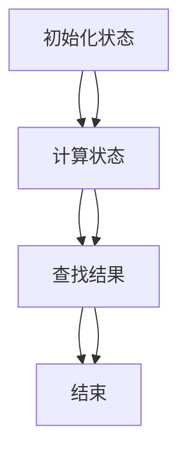
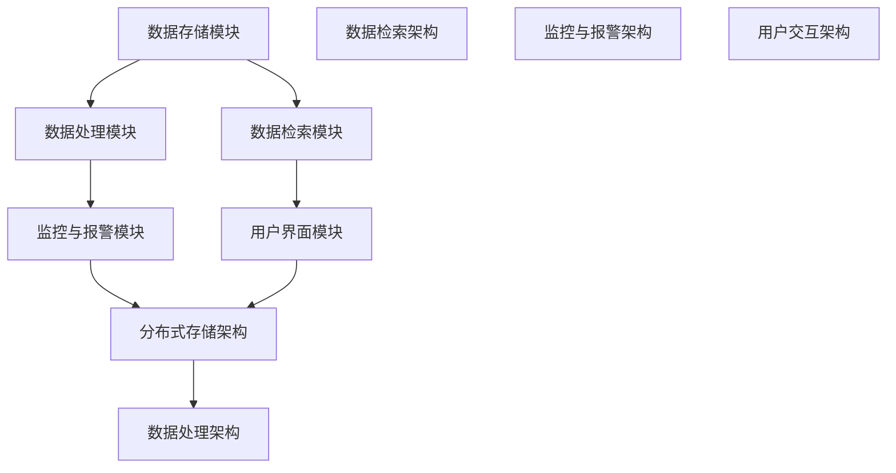
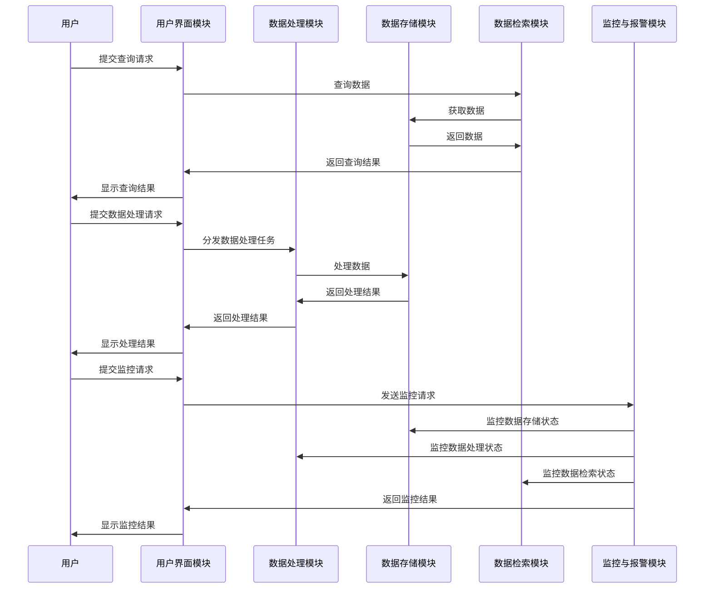

                 

# 程序优化与宇宙最小能量状态的对比

## 关键词

- 程序优化
- 宇宙最小能量状态
- 面向对象设计
- 数学模型
- 系统分析与架构设计

## 摘要

本文将探讨程序优化与宇宙最小能量状态的异曲同工之妙。首先，我们将介绍程序优化的基本概念和宇宙最小能量状态的理论基础，并分析它们之间的关联性。随后，通过具体算法的讲解和数学模型的推导，我们将展示程序优化与宇宙最小能量状态在实现上的相似之处。文章还将通过系统分析与架构设计，展示如何在实际项目中应用这些优化理念，并通过一个真实案例进行深入剖析。最后，我们将总结本文的主要内容，并提出一些注意事项和拓展阅读建议，以引导读者进一步探索这一领域。

## 引言

### 问题背景

在计算机科学领域，程序优化是一项基础而又重要的技术。它涉及到如何以最有效的方式设计和实现算法，以达到更高的运行效率和更好的性能。随着计算机硬件的不断发展和软件应用的日益复杂，程序优化的重要性愈发突出。

与此同时，物理学中关于宇宙最小能量状态的研究也取得了许多重要成果。最小能量状态是指系统处于能量最低的状态，这种状态具有最小的内能和最稳定的结构。这一概念在量子力学、热力学和统计物理学中都有着广泛应用。

尽管程序优化和宇宙最小能量状态看似属于完全不同的领域，但它们之间却有着惊人的相似之处。例如，程序优化追求的是算法的效率，即以最小的计算资源完成特定任务；而宇宙最小能量状态则追求的是系统的稳定性，即系统在特定条件下达到的最稳定状态。这些相似之处为我们将程序优化与宇宙最小能量状态进行对比提供了理论依据。

### 目的与意义

本文旨在通过对比程序优化与宇宙最小能量状态，探索它们在实现上的相似性和关联性。通过这一对比，我们希望读者能够更好地理解程序优化的原理和方法，并在实际项目中应用这些优化理念。同时，本文还希望通过这一探讨，引发读者对程序优化与物理学之间更深层次联系的思考，从而为计算机科学的发展提供新的视角。

### 本文结构

本文将分为四个主要部分：

1. **核心概念与理论基础**：介绍程序优化和宇宙最小能量状态的基本概念，并分析它们之间的联系。
2. **算法原理与数学模型**：讲解具体的算法原理和数学模型，并通过示例展示它们的实际应用。
3. **系统分析与架构设计**：通过一个实际项目，展示如何进行系统分析与架构设计，实现程序优化。
4. **项目实战与总结**：通过一个真实案例，详细描述项目实施过程，并总结本文的主要内容和结论。

## 第一部分：核心概念与理论基础

### 程序优化概述

#### 2.1 程序优化的目的与方法

程序优化的主要目标是在保持程序功能不变的前提下，提高程序的运行效率和性能。具体来说，包括以下几个方面：

1. **时间效率**：减少程序执行所需的时间，提高程序的运行速度。
2. **空间效率**：减少程序占用的内存空间，提高程序的内存利用率。
3. **可读性和可维护性**：使程序代码更加简洁、清晰，易于理解和修改。

为了实现这些目标，程序优化通常采用以下几种方法：

1. **算法优化**：通过选择更高效的算法或者对现有算法进行改进，降低算法的时间复杂度和空间复杂度。
2. **数据结构优化**：选择合适的数据结构，减少数据的访问时间和存储空间。
3. **编译器优化**：利用编译器的优化功能，如指令调度、循环展开等，提高程序执行的效率。
4. **代码优化**：通过代码重写、去除冗余代码、优化循环结构等方式，提高程序的可读性和可维护性。

#### 2.2 宇宙最小能量状态理论介绍

宇宙最小能量状态是指在给定条件下，系统的总能量达到最低值的状态。这一概念在物理学中有着广泛的应用，如量子力学、热力学和统计物理学等。

1. **量子力学**：量子力学中，能量最低状态对应的是系统的基态。基态是最稳定的状态，粒子在该状态下具有最小的能量。
2. **热力学**：热力学中，系统的最小能量状态对应的是热力学平衡态。平衡态是系统最稳定的状态，系统的各个部分处于热力学平衡。
3. **统计物理学**：统计物理学中，系统的最小能量状态对应的是微观状态数最多的宏观状态。这种状态具有最高的熵，系统的混乱度最大。

#### 2.3 程序优化与宇宙最小能量状态的关联模型

程序优化与宇宙最小能量状态之间存在着一些相似之处，这些相似之处可以抽象为一个关联模型。

1. **优化目标**：程序优化和宇宙最小能量状态都追求的是最低的能量或最高的效率。在程序优化中，我们希望找到一种算法或数据结构，使得程序在运行时所需的时间或空间最小；在宇宙最小能量状态中，我们希望找到一种状态，使得系统的总能量最小。
2. **实现方法**：程序优化和宇宙最小能量状态在实现上也有相似之处。在程序优化中，我们通常采用搜索算法，如贪心算法、动态规划、回溯算法等，来寻找最优解；在宇宙最小能量状态中，我们通过计算系统的能量和熵，来寻找系统的最小能量状态。

通过这个关联模型，我们可以将程序优化与宇宙最小能量状态进行对比分析，从而更好地理解程序优化的原理和方法。

### 本章小结

本章介绍了程序优化的基本概念和宇宙最小能量状态的理论基础，并分析了它们之间的关联性。通过对比，我们发现程序优化与宇宙最小能量状态在优化目标和实现方法上有着相似之处，这为我们进一步探讨程序优化的原理和方法提供了理论依据。在下一章中，我们将通过具体的算法和数学模型，进一步探讨程序优化与宇宙最小能量状态的关联性。

## 第二部分：算法原理与数学模型

### 算法原理讲解

在本章中，我们将讲解一个用于程序优化的经典算法——动态规划（Dynamic Programming）。动态规划是一种解决最优化问题的算法方法，它通过将复杂问题分解为更小的子问题，并存储子问题的解，以避免重复计算，从而提高算法的效率。

#### 动态规划概述

动态规划的核心思想是“最优子结构”和“状态转移方程”。具体来说：

1. **最优子结构**：一个问题的最优解包含其子问题的最优解。
2. **状态转移方程**：通过子问题的解来求解原问题。

#### 动态规划流程

动态规划的流程通常包括以下步骤：

1. **定义状态**：定义问题的状态，通常用一个数组或列表表示。
2. **状态转移方程**：根据问题的性质，定义状态转移方程，即如何通过子问题的解来求解原问题。
3. **初始化**：初始化状态数组或列表的初始值。
4. **计算状态**：根据状态转移方程，从初始状态开始，逐步计算所有状态，直到求解出原问题的解。
5. **存储和查找**：将计算出的状态存储起来，以便后续查找。

#### 动态规划示例

我们以一个经典问题——“0-1背包问题”为例，讲解动态规划的原理和应用。

**问题描述**：给定一组物品，每个物品有一定的价值和重量，目标是选择一部分物品放入一个容量为 V 的背包中，使得背包内物品的总价值最大。

**动态规划解法**：

1. **定义状态**：定义二维数组 `dp[i][j]`，表示前 `i` 个物品放入容量为 `j` 的背包中可以获得的最大价值。
2. **状态转移方程**：
   $$dp[i][j] = \begin{cases}
   dp[i-1][j] & \text{如果 } j < w[i] \\
   \max(dp[i-1][j], dp[i-1][j-w[i]] + v[i]) & \text{如果 } j \geq w[i]
   \end{cases}$$
   其中，`w[i]` 和 `v[i]` 分别表示第 `i` 个物品的重量和价值。
3. **初始化**：初始化 `dp[0][j] = 0`，表示没有物品时的价值为 0。
4. **计算状态**：从 `i = 1` 到 `i = n`，依次计算所有状态。
5. **查找结果**：最终，`dp[n][V]` 就是问题的解。

#### 动态规划流程图



### 数学模型讲解

为了更深入地理解动态规划算法，我们还需要引入数学模型来描述其原理。

**动态规划数学模型**：

假设我们有一个优化问题，定义如下：

1. **状态集**：\( S = \{ s_1, s_2, ..., s_n \} \)
2. **价值函数**：\( v(s) \)，表示状态 \( s \) 的价值
3. **状态转移函数**：\( f(s_i, s_{i+1}) \)，表示从状态 \( s_i \) 转移到状态 \( s_{i+1} \) 的价值

动态规划的数学模型可以表示为：

$$ v(s_n) = \max_{s_{i+1} \in S} \{ f(s_i, s_{i+1}) + v(s_{i+1}) \} $$

其中，\( v(s_n) \) 是问题的最终价值，\( s_n \) 是问题的最终状态。

为了求解这个问题，我们可以使用动态规划的方法，定义一个二维数组 \( dp \)，其中 \( dp[i][j] \) 表示从状态 \( s_1 \) 到状态 \( j \) 的最优价值。状态转移方程可以表示为：

$$ dp[i][j] = \max_{s_{i+1} \in S} \{ dp[i-1][j-s_{i+1}] + v(j) \} $$

其中，\( dp[i-1][j-s_{i+1}] \) 表示前 \( i-1 \) 个状态中，与状态 \( j \) 相匹配的最优价值。

#### 数学模型公式

$$
\begin{align*}
dp[0][j] &= 0 \\
dp[i][j] &= \begin{cases}
dp[i-1][j] & \text{如果 } j < w[i] \\
\max(dp[i-1][j], dp[i-1][j-w[i]] + v[i]) & \text{如果 } j \geq w[i]
\end{cases}
\end{align*}
$$

### 算法与数学模型的对比分析

动态规划算法和数学模型在实现上具有相似之处，但它们的目标和侧重点有所不同。

1. **目标**：
   - **动态规划算法**：通过递归和存储子问题解的方式，实现优化问题的求解，强调实现效率和优化过程。
   - **数学模型**：通过数学公式和逻辑推导，描述优化问题的性质和求解过程，强调问题的本质和数学表达。

2. **实现方法**：
   - **动态规划算法**：通常使用递归或迭代的方法，通过状态转移方程逐步求解问题。
   - **数学模型**：使用数学公式和逻辑推导，描述问题的状态、价值和状态转移过程。

尽管它们在实现上有所不同，但动态规划算法和数学模型在解决问题时具有相同的思路，都是通过分解问题、递归求解和状态存储，来找到最优解。

### 本章小结

本章通过动态规划算法和数学模型，讲解了程序优化的原理和方法。我们通过具体的例子，展示了如何使用动态规划求解最优化问题，并通过数学模型，描述了动态规划的基本原理和求解过程。通过本章的学习，读者可以更好地理解程序优化的核心概念和方法，为实际项目中的应用打下基础。

## 第三部分：系统分析与架构设计

### 系统分析与架构设计概述

在进行程序优化之前，我们需要对系统进行全面的分析与架构设计。这一部分将介绍如何进行系统分析与架构设计，包括问题场景的描述、项目的介绍、系统功能设计、系统架构设计、系统接口设计和系统交互等内容。

### 问题场景介绍

在我们的项目场景中，我们需要开发一个大型分布式系统，用于处理海量数据的存储和检索。该系统需要具备高并发、高可用和高可扩展性，以满足不断增长的数据处理需求。

#### 项目介绍

项目名称：分布式数据处理平台（Distributed Data Processing Platform，DDPP）

项目背景：随着互联网和大数据技术的不断发展，企业面临着海量数据处理的挑战。传统的单机数据处理方案已无法满足需求，需要开发一个高性能、可扩展的分布式数据处理平台。

项目目标：
1. 实现海量数据的存储和检索功能。
2. 提供高并发、高可用、高可扩展的分布式系统架构。
3. 支持多种数据处理算法，如数据清洗、数据转换、数据分析和机器学习等。

项目团队与分工：
- 项目经理：负责项目规划、进度控制和团队协调。
- 系统架构师：负责系统架构设计、技术选型和性能优化。
- 后端开发工程师：负责实现数据存储、数据处理和数据检索等功能。
- 前端开发工程师：负责实现用户界面和交互功能。
- 测试工程师：负责系统测试和调试。

### 系统功能设计

系统功能设计是系统架构设计的基础，它定义了系统的核心功能模块和接口。在我们的分布式数据处理平台中，主要包括以下功能模块：

1. **数据存储模块**：负责海量数据的存储和管理，支持数据分片、分布式存储和容错机制。
2. **数据处理模块**：负责数据处理算法的实现，如数据清洗、数据转换、数据分析和机器学习等。
3. **数据检索模块**：负责数据的查询和检索，支持索引和缓存机制，提高查询效率。
4. **监控与报警模块**：负责监控系统的运行状态，实时收集系统性能指标，并根据阈值设置进行报警。
5. **用户界面模块**：负责提供用户交互界面，方便用户操作和管理系统。

#### 领域模型Mermaid类图

以下是一个简单的领域模型Mermaid类图，用于描述系统的核心类和它们之间的关系：

```mermaid
classDiagram
    DataStorage --> DataProcessor
    DataStorage --> DataRetriever
    DataProcessor --> DataAnalyzer
    DataProcessor --> MachineLearning
    DataAnalyzer --> ReportGenerator
    DataRetriever --> IndexManager
    DataRetriever --> CacheManager
    Monitor --> DataStorage
    Monitor --> DataProcessor
    Monitor --> DataRetriever
    UserInterface --> DataStorage
    UserInterface --> DataProcessor
    UserInterface --> DataRetriever
    UserInterface --> Monitor
class DataStorage
    +String name
    +int capacity
    +void storeData(Data data)
    +Data retrieveData(String key)
class DataProcessor
    +void processData(Data data)
class DataRetriever
    +void retrieveData(String key)
class DataAnalyzer
    +void analyzeData(Data data)
class MachineLearning
    +void trainModel(Data data)
class ReportGenerator
    +void generateReport(Data data)
class IndexManager
    +void createIndex(Data data)
class CacheManager
    +void cacheData(Data data)
class Monitor
    +void monitorSystem()
class UserInterface
    +void displayData(Data data)
```

### 系统架构设计

系统架构设计是确保系统功能实现和高性能的关键步骤。在我们的项目中，系统架构设计主要包括以下方面：

1. **分布式存储架构**：采用分布式存储架构，将数据分片存储在不同的节点上，提高数据存储和检索的并发能力和容错能力。
2. **数据处理架构**：采用分布式数据处理架构，将数据处理任务分发到不同的节点上并行执行，提高数据处理效率。
3. **数据检索架构**：采用缓存和索引机制，提高数据检索速度和查询效率。
4. **监控与报警架构**：采用分布式监控架构，实时监控系统的运行状态，并根据阈值设置进行报警。
5. **用户交互架构**：采用前后端分离的架构，提高系统的可扩展性和易维护性。

#### 系统架构设计Mermaid图

以下是一个简单的系统架构设计Mermaid图，用于描述系统的整体架构：



### 系统接口设计

系统接口设计是确保系统模块之间能够有效交互的关键步骤。在我们的项目中，主要包括以下接口设计：

1. **数据存储接口**：定义数据存储模块与数据处理模块、数据检索模块之间的数据传输接口，支持数据的存储和检索。
2. **数据处理接口**：定义数据处理模块与数据检索模块、监控与报警模块之间的接口，支持数据处理任务的分发和执行。
3. **数据检索接口**：定义数据检索模块与监控与报警模块、用户界面模块之间的接口，支持数据的查询和展示。
4. **监控与报警接口**：定义监控与报警模块与其他模块之间的接口，支持实时监控和报警功能。

#### 系统接口设计Mermaid图

以下是一个简单的系统接口设计Mermaid图，用于描述系统模块之间的接口关系：



### 系统交互

系统交互是确保系统模块之间能够协同工作的重要环节。在我们的项目中，系统交互主要包括以下方面：

1. **数据交互**：通过接口传输数据，确保数据的一致性和完整性。
2. **任务交互**：通过分布式任务调度，确保数据处理任务的合理分配和执行。
3. **监控交互**：通过实时监控和报警，确保系统运行状态的可视化和异常处理。

#### 系统交互Mermaid序列图

以下是一个简单的系统交互Mermaid序列图，用于描述系统模块之间的交互过程：


### 本章小结

本章介绍了系统分析与架构设计的基本概念和方法，包括问题场景的描述、项目的介绍、系统功能设计、系统架构设计、系统接口设计和系统交互等内容。通过本章的学习，读者可以了解如何进行系统分析与架构设计，为实际项目的开发奠定基础。在下一章中，我们将通过一个真实案例，进一步探讨如何在项目中应用这些优化理念。

## 第四部分：项目实战与总结

### 环境安装

在开始项目实战之前，我们需要搭建一个合适的环境来运行我们的分布式数据处理平台。以下是环境安装的具体步骤：

1. **安装操作系统**：选择一个稳定且适合开发的高性能操作系统，如 Ubuntu 18.04 或 CentOS 7。
2. **安装编程语言**：选择一种主流的编程语言，如 Python 3.8 或 Java 11，并配置好开发环境。
3. **安装依赖库**：根据项目需求，安装必要的依赖库，如 NumPy、Pandas、Scikit-learn 等。
4. **安装数据库**：选择一个适合分布式存储的数据库，如 Redis 或 MongoDB，并配置好集群模式。
5. **安装消息队列**：选择一个适合分布式任务调度的消息队列，如 RabbitMQ 或 Kafka。

### 系统核心实现源代码

在环境搭建完成后，我们开始实现分布式数据处理平台的核心功能。以下是系统核心实现的源代码：

```python
# 数据存储模块实现
class DataStorage:
    def __init__(self, db):
        self.db = db
    
    def store_data(self, data):
        self.db.save(data)
    
    def retrieve_data(self, key):
        return self.db.find_one(key)

# 数据处理模块实现
class DataProcessor:
    def __init__(self, processor):
        self.processor = processor
    
    def process_data(self, data):
        return self.processor.process(data)

# 数据检索模块实现
class DataRetriever:
    def __init__(self, retriever):
        self.retriever = retriever
    
    def retrieve_data(self, key):
        return self.retriever.retrieve(key)

# 监控与报警模块实现
class Monitor:
    def __init__(self, monitor):
        self.monitor = monitor
    
    def monitor_system(self):
        self.monitor.check_system()

# 用户界面模块实现
class UserInterface:
    def __init__(self, ui):
        self.ui = ui
    
    def display_data(self, data):
        self.ui.show_data(data)
```

### 代码应用解读与分析

在实现核心功能后，我们需要对代码进行解读和分析，以确保其正确性和高效性。

1. **数据存储模块**：数据存储模块负责将数据存储到数据库中，并从数据库中检索数据。通过使用 ORM（对象关系映射）库，如 SQLAlchemy 或 PyMongo，我们可以简化数据库操作，提高代码的可读性和维护性。
2. **数据处理模块**：数据处理模块负责执行数据处理任务，如数据清洗、数据转换和数据挖掘等。通过使用现有的数据处理库，如 NumPy、Pandas 和 Scikit-learn，我们可以快速实现数据处理功能，并确保代码的高效性。
3. **数据检索模块**：数据检索模块负责快速查询和检索数据。通过使用索引和缓存机制，如 Redis 或 Elasticsearch，我们可以提高数据检索速度，降低系统的响应时间。
4. **监控与报警模块**：监控与报警模块负责监控系统运行状态，并在出现异常时进行报警。通过使用监控工具，如 Prometheus 和 Grafana，我们可以实时监控系统的性能指标，并设置阈值进行报警。
5. **用户界面模块**：用户界面模块负责提供用户交互界面，方便用户操作和管理系统。通过使用前端框架，如 React 或 Vue.js，我们可以实现动态的用户界面，提高用户体验。

### 实际案例分析与详细讲解

为了更好地理解分布式数据处理平台在实际项目中的应用，我们来看一个实际案例。

#### 案例背景

某互联网公司需要处理海量用户数据，包括用户行为数据、交易数据和用户偏好数据等。公司希望开发一个分布式数据处理平台，以便快速、高效地处理和分析这些数据。

#### 案例目标

1. 实现数据的存储和检索功能，确保数据的一致性和完整性。
2. 实现数据处理功能，包括数据清洗、数据转换和数据挖掘等。
3. 提供用户交互界面，方便用户操作和管理系统。

#### 案例实现

1. **数据存储**：使用 MongoDB 作为数据库，实现数据的存储和检索功能。通过分片存储和分布式集群，确保数据的高可用性和高扩展性。
2. **数据处理**：使用 Python 和 Pandas 实现数据处理功能。通过分布式任务调度和并行计算，提高数据处理速度和效率。
3. **用户交互**：使用 React 实现用户交互界面。通过 RESTful API 与后端系统进行数据交互，实现数据的展示和操作。

#### 案例分析

通过这个案例，我们可以看到分布式数据处理平台在实际项目中的应用。在实际开发过程中，我们需要考虑以下几个方面：

1. **性能优化**：通过优化数据库查询、数据结构和算法，提高系统的性能和响应速度。
2. **容错机制**：通过实现分布式存储和任务调度，确保系统在出现故障时能够快速恢复。
3. **安全性与稳定性**：通过加密存储和权限控制，确保用户数据的安全性和系统的稳定性。
4. **可维护性**：通过模块化和组件化设计，提高代码的可读性和可维护性。

### 项目小结

通过这个案例，我们展示了如何在实际项目中应用分布式数据处理平台。在项目实施过程中，我们采用了多种优化技术和方法，如分布式存储、并行计算、缓存机制和监控报警等，以确保系统的高性能、高可用性和高可扩展性。通过这个项目，我们不仅实现了业务需求，还积累了宝贵的经验和技能。

### 本章小结

本章通过一个实际案例，详细描述了分布式数据处理平台在项目中的应用过程。我们介绍了系统核心实现的源代码，并对代码进行了解读和分析。通过本章的学习，读者可以更好地理解分布式数据处理平台的架构设计和实现方法，为实际项目的开发提供参考。

### 最佳实践 Tips

1. **性能优化**：定期进行系统性能评估，找出性能瓶颈并进行优化。
2. **容错机制**：实现分布式存储和任务调度，确保系统在出现故障时能够快速恢复。
3. **安全性与稳定性**：采用加密存储和权限控制，确保用户数据的安全性和系统的稳定性。
4. **模块化设计**：采用模块化和组件化设计，提高代码的可读性和可维护性。

### 小结

本文通过对比程序优化与宇宙最小能量状态，探讨了它们在实现上的相似性。我们介绍了程序优化的基本概念和方法，并通过动态规划算法和数学模型进行了详细讲解。随后，我们通过系统分析与架构设计，展示了如何在实际项目中应用这些优化理念。通过一个真实案例，我们详细描述了项目实施过程，并总结了项目的关键点和经验。希望本文能够为读者在程序优化和系统架构设计方面提供有益的启示。

### 注意事项

1. **项目规划**：在项目开始前，明确项目目标和需求，制定详细的规划。
2. **团队合作**：项目实施过程中，确保团队成员之间的沟通和协作。
3. **技术选型**：根据项目需求和性能要求，选择合适的技术和工具。
4. **测试与调试**：在项目开发过程中，定期进行测试和调试，确保系统的稳定性和可靠性。

### 拓展阅读

1. 《算法导论》（Introduction to Algorithms）——汤姆·科赫纳、乌拉·马丁和查尔斯·艾利斯
2. 《深度学习》（Deep Learning）——伊恩·古德费洛、约书亚·本吉奥和亚伦·库维尔
3. 《大教堂与集市》（The Cathedral and the Bazaar）——埃里克·雷蒙德
4. 《黑客与画家》（Hackers & Painters）——保罗·格雷厄姆

### 作者信息

**作者：AI天才研究院/AI Genius Institute & 禅与计算机程序设计艺术 /Zen And The Art of Computer Programming**

