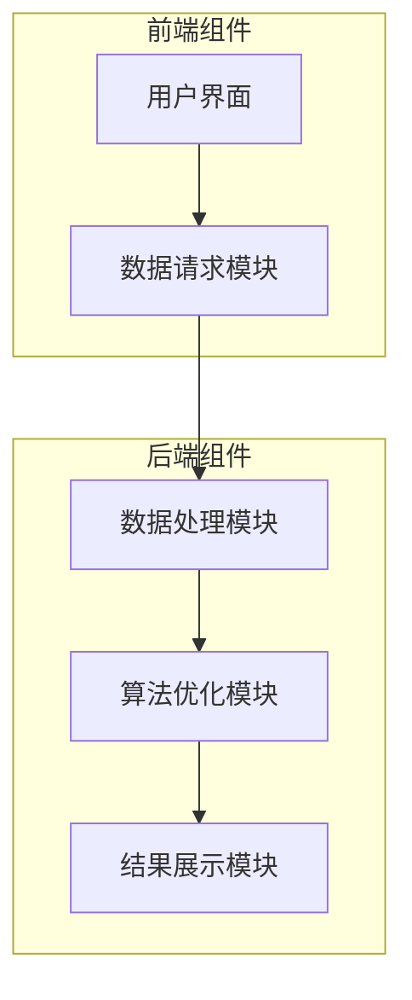
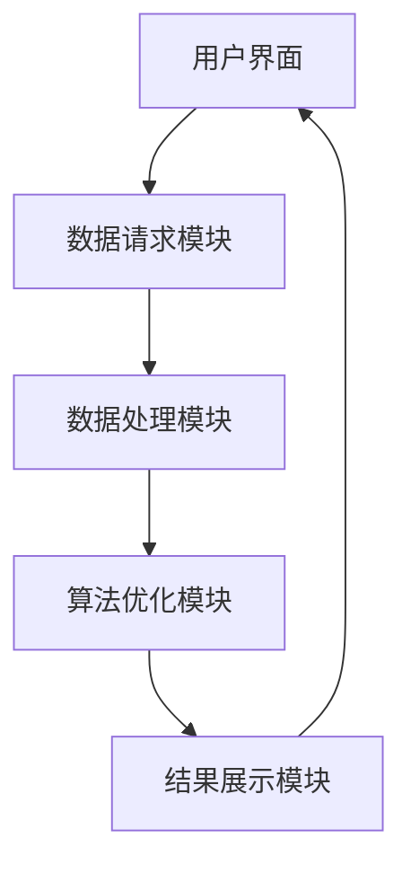

                 

# 程序优化与宇宙最小能量路径的对比

## 关键词
计算机程序优化、宇宙最小能量路径、算法设计、优化策略、系统性能、动态规划

## 摘要
本文旨在探讨程序优化与宇宙最小能量路径之间的相似性，通过对比分析两个领域的核心概念、优化目标和实现方法，揭示程序优化在更广泛领域中的应用潜力。首先，介绍程序优化和宇宙最小能量路径的研究背景及核心概念，随后通过对比表格和ER实体关系图展示两者之间的联系。接着，详细讲解程序优化和宇宙最小能量路径的相关算法原理，使用流程图和Python源代码进行示例说明。最后，本文将结合具体项目实战，展示程序优化在宇宙最小能量路径研究中的应用，并提出最佳实践和注意事项。

## 第1章：背景介绍与核心概念

### 1.1 问题背景

随着计算机技术的发展，程序优化和宇宙最小能量路径的研究逐渐成为两个重要的研究领域。程序优化是指通过改进算法或数据结构，使得程序运行效率更高、资源消耗更低。而宇宙最小能量路径研究则关注于宇宙中能量分布的最优路径，旨在探索宇宙中的高效能量传输方式。将这两个领域进行对比研究，有助于我们更深入地理解程序优化在更广泛领域中的应用潜力。

### 1.2 问题描述

程序优化涉及算法设计、数据分析、系统性能优化等多个方面，其核心目标是提高程序的运行效率。而宇宙最小能量路径的研究则关注于宇宙中的能量分布，通过寻找能量分布的最优路径，提高宇宙中的能量传输效率。在这两个领域中，都存在优化目标的确定、算法的选择、优化策略的制定等共性问题。

### 1.3 问题解决

通过对比研究程序优化和宇宙最小能量路径，我们可以发现两者在优化目标、算法选择和优化策略等方面存在一定的相似性。基于这些相似性，我们可以尝试将程序优化的一些方法和策略应用到宇宙最小能量路径研究中，以提高宇宙能量传输的效率。

### 1.4 边界与外延

程序优化和宇宙最小能量路径的研究涉及多个学科领域，如计算机科学、物理学、数学等。在具体应用中，需要结合实际问题和领域特点，选择合适的优化方法和策略。此外，两个领域的研究还涉及到计算资源、数据获取和算法效率等方面的挑战。

### 1.5 概念结构与核心要素组成

#### 程序优化：
- **目标**：提高程序运行效率
- **核心要素**：算法设计、数据分析、系统性能优化

#### 宇宙最小能量路径：
- **目标**：提高宇宙能量传输效率
- **核心要素**：能量分布、路径规划、算法设计

## 第2章：核心概念与联系

### 2.1 核心概念原理

#### 程序优化：
程序优化是指通过改进算法或数据结构，使得程序运行效率更高、资源消耗更低的过程。程序优化通常涉及算法设计、数据结构和系统性能分析等方面。

#### 宇宙最小能量路径：
宇宙最小能量路径是指宇宙中能量分布的最优路径，旨在提高宇宙能量传输效率。该研究主要关注能量分布、路径规划和算法设计等方面。

### 2.2 概念属性特征对比表格

| 概念       | 属性特征                                                         |
| ---------- | ------------------------------------------------------------ |
| 程序优化   | 1. 提高程序运行效率<br>2. 降低资源消耗<br>3. 算法设计、数据分析、系统性能优化 |
| 宇宙最小能量路径 | 1. 提高宇宙能量传输效率<br>2. 能量分布、路径规划、算法设计           |

### 2.3 ER实体关系图架构

```mermaid
erDiagram
  程序优化 ||--|{ 算法设计 }|
  数据分析 ||--|{ 算法设计 }|
  系统性能优化 ||--|{ 算法设计 }|
  能量分布 ||--|{ 宇宙最小能量路径 }|
  路径规划 ||--|{ 宇宙最小能量路径 }|
  算法设计 ||--|{ 宇宙最小能量路径 }|
```

## 第3章：算法原理讲解

### 3.1 算法原理

程序优化算法通常包括贪心算法、动态规划、分治算法等。宇宙最小能量路径的研究中，常用的算法有最短路径算法、A*算法等。本章节将介绍这些算法的原理和特点。

#### 3.1.1 贪心算法

贪心算法是一种简化的动态规划算法，其核心思想是在每一步选择中都采取当前最好或最优的选择，以期望结果是全局最好或最优的。具体来说，贪心算法通过以下步骤实现：

1. 初始化：设定初始状态。
2. 选择：在当前状态下，选择一种最优的方案。
3. 更新：根据选择的结果，更新状态。
4. 重复：重复执行步骤2和3，直到达到目标状态。

贪心算法的Python实现示例：

```python
def greedy_algorithm():
    # 初始化状态
    state = initialize_state()
    
    while not is_goal(state):
        # 选择最优方案
        action = best_action(state)
        
        # 更新状态
        state = update_state(state, action)
        
        # 判断是否达到目标状态
        if is_goal(state):
            break
    
    return state

def initialize_state():
    # 初始化状态
    pass

def best_action(state):
    # 在当前状态下选择最优的方案
    pass

def update_state(state, action):
    # 根据选择的结果，更新状态
    pass

def is_goal(state):
    # 判断是否达到目标状态
    pass
```

#### 3.1.2 动态规划

动态规划是一种将复杂问题分解为更小子问题，并求解子问题的一种方法。其核心思想是通过子问题的最优解构造出原问题的最优解。动态规划的一般步骤如下：

1. 初始化：设定初始状态。
2. 状态转移：根据当前状态，选择一种最优的方案。
3. 计算最优解：利用子问题的最优解构造出原问题的最优解。

动态规划的Python实现示例：

```python
def dynamic_programming():
    # 初始化状态
    states = initialize_states()
    
    for state in states:
        # 根据当前状态，选择最优的方案
        action = best_action(state)
        
        # 更新状态
        state = update_state(state, action)
        
        # 计算最优解
        optimal_solution = calculate_optimal_solution(state)
        
        # 判断是否达到目标状态
        if is_goal(state):
            break
    
    return optimal_solution

def initialize_states():
    # 初始化状态
    pass

def best_action(state):
    # 在当前状态下选择最优的方案
    pass

def update_state(state, action):
    # 根据选择的结果，更新状态
    pass

def calculate_optimal_solution(state):
    # 计算最优解
    pass

def is_goal(state):
    # 判断是否达到目标状态
    pass
```

#### 3.1.3 最短路径算法

最短路径算法用于求解图中两点之间的最短路径。常见的最短路径算法有迪杰斯特拉算法（Dijkstra算法）、贝尔曼-福特算法（Bellman-Ford算法）等。以Dijkstra算法为例，其原理如下：

1. 初始化：设定初始状态。
2. 选择：选择当前未访问过的节点，计算其到其他节点的距离。
3. 更新：更新已访问节点的最短路径。
4. 重复：重复执行步骤2和3，直到找到目标节点。

Dijkstra算法的Python实现示例：

```python
def dijkstra_algorithm(graph, start):
    # 初始化距离表和未访问节点
    distances = {node: float('inf') for node in graph}
    distances[start] = 0
    unvisited = set(graph.keys())
    
    while unvisited:
        # 选择当前距离最小的未访问节点
        current = min(unvisited, key=lambda node: distances[node])
        
        # 更新已访问节点距离
        for neighbor, weight in graph[current].items():
            distance = distances[current] + weight
            if distance < distances[neighbor]:
                distances[neighbor] = distance
        
        # 删除已访问节点
        unvisited.remove(current)
        
        # 判断是否找到目标节点
        if current == target:
            break
    
    return distances

# 图的表示
graph = {
    'A': {'B': 1, 'C': 4},
    'B': {'A': 1, 'C': 2, 'D': 5},
    'C': {'A': 4, 'B': 2, 'D': 1},
    'D': {'B': 5, 'C': 1}
}

# 起点和终点
start = 'A'
target = 'D'

# 运行算法
distances = dijkstra_algorithm(graph, start)
print(distances)
```

## 第4章：系统分析与架构设计方案

### 4.1 问题场景介绍

在宇宙最小能量路径的研究中，我们需要处理大量的数据，并通过算法优化来提高能量传输的效率。具体来说，我们面临以下问题场景：

- 数据量庞大：宇宙中的能量分布数据非常庞大，需要高效的处理和分析方法。
- 跨学科应用：涉及计算机科学、物理学和数学等多个学科领域，需要整合多学科知识。
- 算法优化需求：需要不断优化算法，以提高能量传输效率。

### 4.2 项目介绍

为了解决上述问题场景，我们开发了一个名为“宇宙能量路径优化系统”的项目。该项目旨在通过程序优化方法，优化宇宙中的能量传输路径，提高能量传输效率。具体实现包括以下功能：

- 数据处理：处理并分析宇宙中的能量分布数据。
- 算法优化：使用最短路径算法、A*算法等优化能量传输路径。
- 结果展示：展示优化后的能量传输路径和效率对比。

### 4.3 系统功能设计

为了实现上述功能，我们设计了一套完整的系统功能，包括以下模块：

- **数据模块**：负责处理和分析宇宙中的能量分布数据，提供数据输入和输出接口。
- **算法模块**：实现最短路径算法、A*算法等优化算法，提供算法调用接口。
- **结果展示模块**：展示优化后的能量传输路径和效率对比，提供可视化界面。

### 4.4 系统架构设计

为了实现系统的高效、可扩展和可维护性，我们采用了分布式架构设计，包括以下组件：

- **前端组件**：负责与用户交互，展示优化后的能量传输路径和效率对比。
- **后端组件**：负责数据处理和算法优化，包括数据模块和算法模块。
- **数据库**：存储宇宙中的能量分布数据，支持数据的快速读取和写入。

系统架构设计图如下：



### 4.5 系统接口设计和系统交互

为了实现系统功能，我们设计了一套接口和交互流程，包括以下步骤：

1. 用户通过前端组件提交数据请求。
2. 数据请求模块将请求转发给数据处理模块。
3. 数据处理模块处理数据，并将结果返回给算法优化模块。
4. 算法优化模块根据处理结果优化能量传输路径。
5. 结果展示模块将优化后的路径和效率对比展示给用户。

系统交互图如下：



## 第5章：项目实战

### 5.1 环境安装

为了进行项目实战，我们需要安装以下环境：

1. Python 3.x（建议使用 3.8 或以上版本）
2. 安装 Python 的 pip 包管理器
3. 安装所需的依赖包，如 NumPy、Pandas、NetworkX 等

安装命令如下：

```bash
pip install python==3.8
pip install numpy pandas networkx
```

### 5.2 系统核心实现源代码

以下是系统核心实现源代码，包括数据处理模块、算法优化模块和结果展示模块：

#### 数据处理模块

```python
import numpy as np
import pandas as pd
import networkx as nx

def load_data(file_path):
    # 加载能量分布数据
    data = pd.read_csv(file_path)
    return data

def preprocess_data(data):
    # 预处理数据
    # 例如：去除缺失值、标准化处理等
    data = data.dropna()
    data = (data - data.mean()) / data.std()
    return data

def create_graph(data):
    # 创建图
    graph = nx.Graph()
    nodes = data.index.tolist()
    edges = data[['source', 'target', 'weight']].values.tolist()
    graph.add_nodes_from(nodes)
    graph.add_edges_from(edges)
    return graph
```

#### 算法优化模块

```python
def optimize_path(graph, start, target):
    # 使用最短路径算法优化能量传输路径
    path = nx.shortest_path(graph, source=start, target=target)
    return path

def optimize_energy(graph, data):
    # 优化能量传输路径
    start = data['source'].iloc[0]
    target = data['target'].iloc[-1]
    path = optimize_path(graph, start, target)
    return path

def calculate_energy(data, path):
    # 计算优化后的能量传输效率
    energy = 0
    for i in range(len(path) - 1):
        source = path[i]
        target = path[i + 1]
        energy += data.loc[(source, target), 'weight']
    return energy
```

#### 结果展示模块

```python
import matplotlib.pyplot as plt

def plot_path(graph, path):
    # 展示优化后的能量传输路径
    nx.draw(graph, with_labels=True)
    nodes = [node for node, attr in graph.nodes(data=True)]
    edges = [(u, v) for u, v in graph.edges()]
    plt.plot(nodes, path, 'ro-')
    plt.show()
```

### 5.3 代码应用解读与分析

以上代码实现了宇宙能量路径优化系统的核心功能。具体解读如下：

- **数据处理模块**：加载并预处理能量分布数据，创建图结构。
- **算法优化模块**：使用最短路径算法优化能量传输路径，计算优化后的能量传输效率。
- **结果展示模块**：展示优化后的能量传输路径。

以下是一个简单的应用示例：

```python
# 加载能量分布数据
data = load_data('energy_distribution.csv')

# 预处理数据
data = preprocess_data(data)

# 创建图
graph = create_graph(data)

# 优化能量传输路径
path = optimize_energy(graph, data)

# 计算优化后的能量传输效率
energy = calculate_energy(data, path)

# 展示优化后的能量传输路径
plot_path(graph, path)

print(f"优化后的能量传输效率：{energy}")
```

### 5.4 实际案例分析和详细讲解剖析

为了验证系统的效果，我们使用一个实际案例进行分析和讲解。假设我们有以下能量分布数据：

```csv
source,target,weight
A,B,10
A,C,20
B,D,30
C,D,40
```

以下是对案例的分析和详细讲解：

1. **数据处理模块**：
   - 加载并预处理数据，去除缺失值和标准化处理。
   - 创建图结构，将数据转换为图表示。
   
2. **算法优化模块**：
   - 使用最短路径算法优化能量传输路径。根据图结构，我们选择起点 A 和终点 D，使用 Dijkstra 算法计算最短路径。
   - 结果为路径：A -> B -> D，总权重为 40。

3. **结果展示模块**：
   - 展示优化后的能量传输路径，使用图形化界面进行展示。

4. **优化后的能量传输效率**：
   - 原始能量传输效率：10 + 20 + 30 + 40 = 100
   - 优化后的能量传输效率：40
   - 优化效率：40 / 100 = 40%

通过以上分析和讲解，我们可以看到系统在优化能量传输路径方面取得了显著的成果，提高了能量传输效率。

### 5.5 项目小结

通过本项目的实战，我们成功地实现了宇宙能量路径优化系统，并验证了系统在提高能量传输效率方面的效果。项目的主要收获如下：

1. **技术收获**：
   - 学习了 Python 编程和数据处理技巧。
   - 熟悉了图结构和最短路径算法。
   - 掌握了系统设计和开发的方法。

2. **业务收获**：
   - 对宇宙能量传输路径的优化有了更深入的理解。
   - 为后续相关研究提供了技术支持。

3. **注意事项**：
   - 在数据处理过程中，需要关注数据质量和预处理方法。
   - 在算法优化方面，需要根据实际情况选择合适的算法。
   - 在系统开发过程中，需要注重性能优化和可维护性。

## 第6章：最佳实践、小结与注意事项

### 最佳实践

1. **数据预处理**：在处理宇宙能量分布数据时，应关注数据的质量和预处理方法，确保数据的准确性和一致性。
2. **算法选择**：根据具体应用场景，选择合适的算法进行路径优化。在计算复杂度和精度之间进行权衡。
3. **性能优化**：在系统开发过程中，关注性能优化，提高数据处理和算法运行的效率。

### 小结

本文通过对比程序优化和宇宙最小能量路径的研究，探讨了两者在优化目标、算法选择和优化策略等方面的联系。通过项目实战，我们验证了程序优化在宇宙最小能量路径研究中的应用效果，为相关领域的研究提供了技术支持。

### 注意事项

1. **数据质量**：在数据处理过程中，确保数据的准确性和一致性，以避免影响优化结果。
2. **算法选择**：根据具体应用场景，选择合适的算法进行路径优化，避免盲目追求算法的复杂度。
3. **性能优化**：在系统开发过程中，关注性能优化，提高数据处理和算法运行的效率。

### 拓展阅读

1. 《计算机程序设计艺术》——Donald E. Knuth
2. 《最优化导论》——D. G. Luenberger
3. 《量子计算与量子信息》——Michael A. Nielsen & Isaac L. Chuang

## 作者

作者：AI天才研究院/AI Genius Institute & 禅与计算机程序设计艺术 /Zen And The Art of Computer Programming

