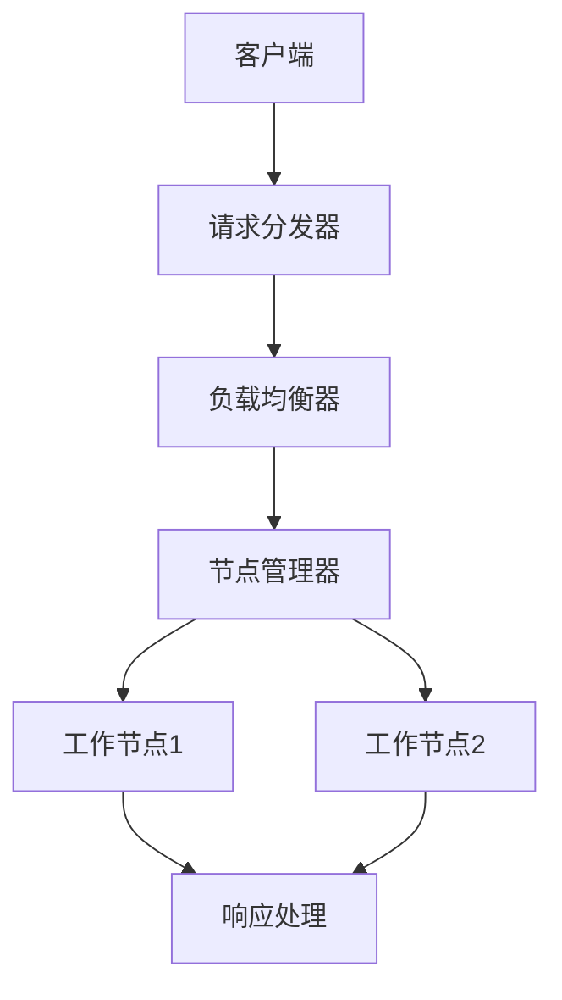
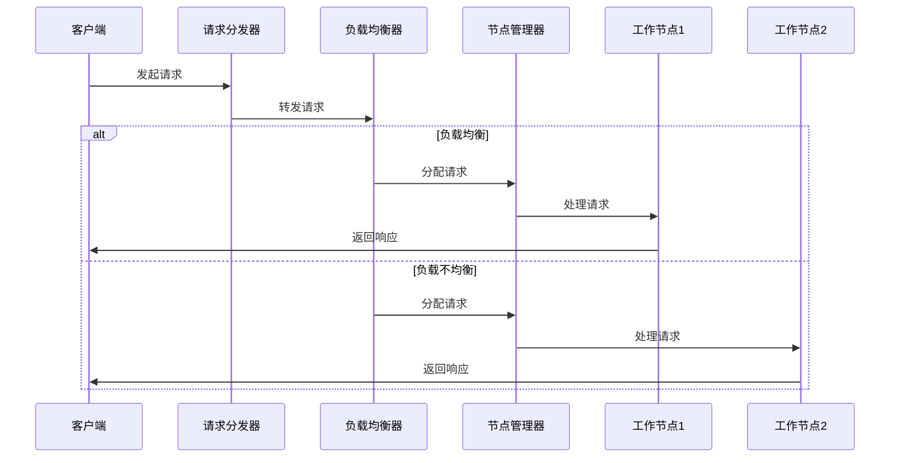
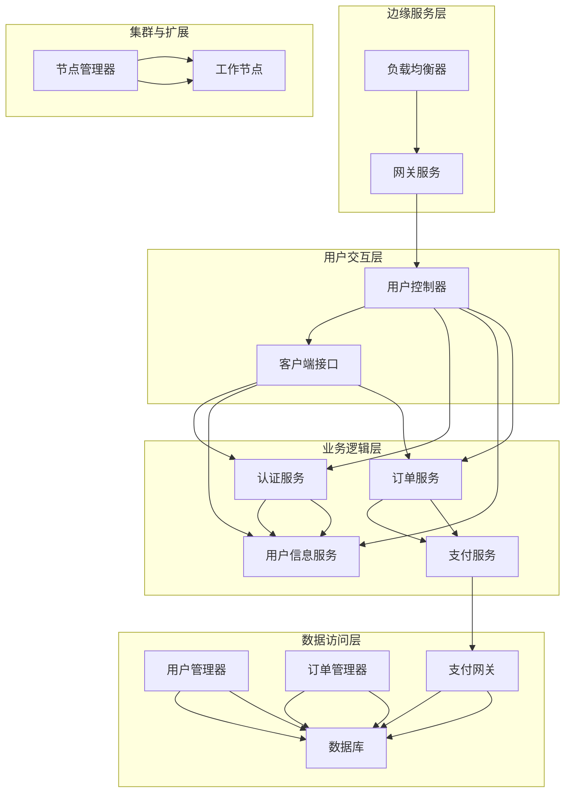

                 

### 1.1.1 程序设计原则概述

程序设计原则，是指编程过程中遵循的一系列规则和标准，旨在提高代码的可读性、可维护性和可扩展性。这些原则不仅适用于单个程序的开发，还可以应用于整个软件系统。以下是几条经典的程序设计原则：

1. **SOLID原则**：
   - **单一职责原则（Single Responsibility Principle, SRP）**：一个类或模块应该只负责一项功能。
   - **开放封闭原则（Open Closed Principle, OCP）**：软件实体应该对扩展开放，对修改关闭。
   - **里氏替换原则（Liskov Substitution Principle, LSP）**：任何基类可以出现的地方，子类一定可以出现。
   - **接口隔离原则（Interface Segregation Principle, ISP）**：应该为客户端提供单独的接口，而不是一个庞大的接口。
   - **依赖倒置原则（Dependency Inversion Principle, DIP）**：高层模块不应该依赖于低层模块，二者都应该依赖于抽象。

2. **DRY原则**：
   **Don't Repeat Yourself, DRY**：不要重复自己。这意味着在程序开发中，重复的代码应尽量避免，可以通过提取公共方法、使用库函数等方式实现。

3. **KISS原则**：
   **Keep It Simple, Stupid, KISS**：保持简单。简单的设计和代码往往更易于理解和维护，能够降低出错的可能性。

4. **YAGNI原则**：
   **You Aren't Gonna Need It, YAGNI**：不要提前优化。专注于当前需求，避免为未知的未来进行不必要的编程。

5. **DRMC原则**：
   **Don't Repeat Myself, Copy, and Paste, DRMC**：复制并粘贴，但要适当注释。在某些情况下，复制和粘贴是可行的，尤其是在需要复用代码片段时，但要确保适当注释。

这些原则不仅仅是编程技术的体现，更是软件工程哲学的反映。它们指导程序员如何构建更加稳健和灵活的软件系统，从而提高开发效率和软件质量。

#### 1.1.2 宇宙守恒定律概述

宇宙守恒定律是自然科学中基本的概念，描述了自然现象中某些物理量的守恒特性。宇宙守恒定律的核心思想是，在封闭系统中，某些物理量在时间演化过程中保持不变。以下是几个重要的宇宙守恒定律：

1. **质量守恒定律**：
   **The Law of Conservation of Mass**：在一个封闭系统中，物质的质量在化学反应和物理变化过程中保持不变。这一原理是化学和物理的基础，广泛应用于化学反应和能量转换的研究中。

2. **能量守恒定律**：
   **The Law of Conservation of Energy**：能量既不会凭空产生，也不会凭空消失，它只能从一种形式转化为另一种形式。能量守恒定律是热力学第一定律的基础，广泛应用于能量转换和能源研究的各个领域。

3. **动量守恒定律**：
   **The Law of Conservation of Momentum**：在一个封闭系统中，总动量保持不变。动量守恒定律在描述碰撞现象、行星运动等领域中具有重要意义。

4. **角动量守恒定律**：
   **The Law of Conservation of Angular Momentum**：在没有外力矩作用的情况下，一个系统的总角动量保持不变。角动量守恒定律在描述旋转物体的运动和天体物理现象中发挥着关键作用。

5. **电荷守恒定律**：
   **The Law of Conservation of Charge**：在一个封闭系统中，总电荷量保持不变。电荷守恒定律是电磁学的基础，广泛应用于电学和电子工程领域。

这些守恒定律不仅是自然科学的基石，也是工程和技术领域的指导原则。它们帮助我们理解和预测自然现象，从而为科学研究和工程应用提供了坚实的理论基础。

### 1.1.3 研究动机与目的

研究程序设计原则与宇宙守恒定律之间的对比，其动机和目的主要源于以下几点：

首先，从哲学角度出发，程序设计原则和宇宙守恒定律均体现了一种普遍的秩序和规律。程序设计原则是软件工程中提高代码质量的关键指导原则，而宇宙守恒定律则是在自然界中描述物理量守恒的基本法则。通过对比这两者，可以探索编程中的抽象概念与自然界中的物理法则之间的深层次联系，从而获得对软件设计和自然规律的更深刻理解。

其次，在实践应用层面，程序设计原则和宇宙守恒定律都要求我们在系统设计和分析过程中遵循一定的规律和原则。例如，在软件开发中，遵循SOLID原则可以提高代码的模块化和可维护性；而在物理系统中，遵循能量守恒定律和动量守恒定律可以确保系统的稳定性和可预测性。通过对比研究，可以找出在程序设计和自然科学中普遍适用的规律和方法，从而优化开发流程和设计方案。

最后，这一研究具有重要的理论和实际意义。理论上，它有助于揭示计算机科学和物理学之间的跨学科联系，丰富我们的科学认知；实践中，它可以为软件开发提供新的理论支持和指导，提高软件系统的质量和可靠性。通过这一研究，我们希望不仅能加深对程序设计原则的理解，还能在自然科学的应用中找到新的灵感和方法，从而推动计算机科学和自然科学的共同进步。

### 1.2.1 书籍结构概述

本书旨在深入探讨程序设计原则与宇宙守恒定律之间的异同点，旨在为读者提供一个全面的比较分析框架，以揭示两者之间的内在联系和相互影响。整体结构如下：

**第一部分：引言**  
- **第1章** 问题背景与引言：介绍程序设计原则和宇宙守恒定律的基本概念，阐述研究的动机和目的。
- **第2章** 书籍结构概述：详细描述各章节的内容和目的，为读者提供整体的阅读指南。

**第二部分：背景介绍**  
- **第3章** 程序设计原则的起源与发展：回顾程序设计原则的历史背景、演变过程和重要性。
- **第4章** 宇宙守恒定律的历史与概念：探讨宇宙守恒定律的起源、基本概念及其应用。
- **第5章** 程序设计原则与宇宙守恒定律的边界与外延：分析两者之间的交叉领域和相互影响。

**第三部分：核心概念对比**  
- **第6章** 核心概念对比分析：深入探讨程序设计原则和宇宙守恒定律的核心概念，进行比较和归纳。
- **第7章** 概念属性特征对比表格：通过对比表格展示两者概念属性特征的异同。
- **第8章** ER实体关系图架构的Mermaid流程图：使用Mermaid绘制ER图，形象地展示两者之间的关系。

**第四部分：案例分析**  
- **第9章** 程序设计原则在具体项目中的应用：结合实际项目案例，展示程序设计原则的应用效果。
- **第10章** 宇宙守恒定律在自然现象中的体现：分析自然现象中宇宙守恒定律的体现。
- **第11章** 程序设计原则与宇宙守恒定律的跨领域应用：探讨两者在不同领域中的应用实例和对比。

**第五部分：系统分析与架构设计**  
- **第12章** 问题场景介绍：描述具体的系统分析和架构设计问题场景。
- **第13章** 系统功能设计（领域模型Mermaid类图）：使用Mermaid绘制领域模型类图，展示系统功能设计。
- **第14章** 系统架构设计（Mermaid架构图）：通过Mermaid架构图展示系统架构设计。
- **第15章** 系统接口设计：阐述系统接口设计原则和具体实现。
- **第16章** 系统交互（Mermaid序列图）：使用Mermaid序列图展示系统交互流程。

**第六部分：项目实战**  
- **第17章** 环境安装与配置：介绍项目开发所需的环境安装和配置步骤。
- **第18章** 系统核心实现源代码：展示系统核心实现的源代码，并进行解读。
- **第19章** 代码应用解读与分析：分析代码的实际应用，并结合案例进行详细讲解。
- **第20章** 实际案例分析和详细讲解剖析：通过实际案例展示程序设计原则和宇宙守恒定律的应用，并进行深入剖析。
- **第21章** 项目小结：总结项目的主要成果和经验教训。

**第七部分：总结与展望**  
- **第22章** 最佳实践 tips：提供一些建议和最佳实践，以帮助读者在实际工作中应用本书的知识。
- **第23章** 小结：总结全书的主要内容，回顾研究的主要发现。
- **第24章** 注意事项：提醒读者在应用程序设计原则和宇宙守恒定律时需要注意的事项。
- **第25章** 拓展阅读：推荐一些相关书籍、论文和资源，以供读者进一步学习和研究。

通过上述结构安排，本书旨在为读者提供一个全面、深入且易于理解的分析框架，帮助读者理解程序设计原则与宇宙守恒定律之间的复杂关系，并学会在实际工作中灵活应用这些原理。

### 2.1 程序设计原则的起源与发展

程序设计原则的起源可以追溯到计算机科学的早期发展阶段。在20世纪中叶，随着计算机硬件的迅速发展和软件需求的不断增加，如何编写高效、可靠且易于维护的代码成为了一个亟待解决的问题。正是在这样的背景下，程序设计原则逐渐形成并被广泛接受。

1. **早期原则的提出**：
   - **模块化**：模块化原则可以追溯到20世纪50年代，当时程序员开始意识到将复杂程序分解为更小的、易于管理的部分可以提高代码的可读性和可维护性。
   - **结构化编程**：20世纪60年代，结构化编程成为编程的主要趋势。它强调使用顺序结构、选择结构和循环结构来编写程序，避免使用goto语句，以提高代码的可读性和可靠性。

2. **面向对象编程的兴起**：
   - **SOLID原则**：面向对象编程（Object-Oriented Programming, OOP）的兴起带来了新的程序设计原则。SOLID原则是面向对象编程的核心，最早由罗伯特·马丁（Robert C. Martin）提出。它包括单一职责原则、开放封闭原则、里氏替换原则、接口隔离原则和依赖倒置原则。
   - **DRY原则**：Don't Repeat Yourself（DRY）原则强调避免重复代码，提倡代码复用和一致性。

3. **现代原则的发展**：
   - **KISS原则**：Keep It Simple, Stupid（KISS）原则提倡保持代码的简单性，以降低复杂性，提高代码的可维护性。
   - **YAGNI原则**：You Aren't Gonna Need It（YAGNI）原则强调在开发过程中只实现当前需要的功能，避免不必要的复杂性。

4. **程序设计原则的应用与演变**：
   - 随着软件开发方法论的不断发展，程序设计原则也在不断演变。敏捷开发（Agile Development）和DevOps文化的兴起，进一步推动了程序设计原则的实践和应用。例如，敏捷开发强调迭代和增量式开发，而DevOps强调开发和运维的紧密结合，这些都在不同层面上对程序设计原则提出了新的要求和挑战。

通过这些演变和发展，程序设计原则不仅成为了程序员日常工作的指南，也在软件工程的理论研究和实践中发挥了重要作用。它们帮助程序员编写出更加高效、可靠和可维护的代码，提高了软件开发的整体质量。

### 2.2 宇宙守恒定律的历史与概念

宇宙守恒定律的历史可以追溯到古代哲学家对自然界规律的探索。早在公元前5世纪，古希腊哲学家赫拉克利特（Heraclitus）就提出了“一切皆变，无物常住”的观点，这可以视为宇宙守恒思想的雏形。然而，现代意义上的宇宙守恒定律则主要源自近现代科学的进展，特别是物理学的发展。

1. **质量守恒定律**：
   - 质量守恒定律最早由法国化学家安托万·洛朗·德·拉瓦锡（Antoine Lavoisier）在18世纪末提出。他通过实验发现，在化学反应中，反应物的总质量等于生成物的总质量。这一发现奠定了质量守恒定律在化学中的基础。
   - 质量守恒定律指出，在一个封闭系统中，物质的总质量保持不变，即使物质发生化学反应或物理变化。

2. **能量守恒定律**：
   - 能量守恒定律是热力学第一定律的核心内容，最早由德国物理学家罗伯特·迈尔（Robert Mayer）和威廉·汤姆森（William Thompson，即开尔文勋爵）在19世纪中叶提出。他们分别通过实验和理论推导得出了能量守恒的结论。
   - 能量守恒定律指出，能量既不会凭空产生，也不会凭空消失，它只能从一种形式转化为另一种形式。在一个封闭系统中，能量的总量保持不变。

3. **动量守恒定律**：
   - 动量守恒定律最早由伽利略和牛顿在其力学研究中提出，并在后来的物理学发展中得到了广泛应用。法国数学家西蒙·弗雷歇（Simon Fréchet）在20世纪初正式提出了动量守恒定律的数学表达式。
   - 动量守恒定律指出，在没有外力作用的情况下，一个系统的总动量保持不变。这一定律在碰撞现象和行星运动等领域有重要应用。

4. **角动量守恒定律**：
   - 角动量守恒定律最早由约瑟夫·傅里叶（Joseph Fourier）和威廉·汤姆森在19世纪初提出。它指出，在没有外力矩作用的情况下，一个系统的总角动量保持不变。
   - 角动量守恒定律在描述旋转物体的运动和天体物理现象中具有重要意义，如在行星轨道和旋转机械系统的分析中。

5. **电荷守恒定律**：
   - 电荷守恒定律是电磁学的基础，最早由迈克尔·法拉第（Michael Faraday）和查尔斯·库柏（Charles Coulomb）在19世纪初提出。他们发现，在一个封闭系统中，电荷的总量保持不变。
   - 电荷守恒定律指出，在一个封闭系统中，正电荷和负电荷的总数保持不变，即使电荷发生转移或重新分布。

这些宇宙守恒定律不仅是自然科学的基本原理，也在工程和技术的各个领域中得到广泛应用。通过这些守恒定律，科学家和工程师能够更好地理解和预测自然现象，从而为各种工程应用提供了坚实的理论基础。

### 2.3 程序设计原则与宇宙守恒定律的边界与外延

程序设计原则和宇宙守恒定律虽然在不同的领域中发挥作用，但它们之间存在着一些共同点和交叉领域。理解这些边界与外延有助于更好地应用这些原则和定律，并探索其在跨学科研究中的潜力。

#### 边界定义

1. **程序设计原则的边界**：
   程序设计原则主要在计算机科学和软件工程中应用，涉及代码的编写、模块化、架构设计等方面。这些原则关注的是如何编写高效、可靠、可维护的代码，从而提高软件系统的质量。

2. **宇宙守恒定律的边界**：
   宇宙守恒定律主要在物理学和自然科学中应用，描述了物理量在自然现象中的守恒特性。这些定律是描述自然界规律的基础，用于解释和预测物理现象。

#### 外延与交叉领域

1. **抽象和建模的交叉**：
   在软件工程中，抽象和建模是关键步骤。程序设计原则如SOLID原则鼓励使用抽象类和接口，以实现模块化和高内聚。这与宇宙守恒定律中的抽象概念，如能量守恒和动量守恒，有相似之处。能量守恒定律中的“能量”可以类比为软件系统中的“模块功能”，而动量守恒定律中的“动量”可以类比为系统中的“信息流动”。

2. **系统稳定性的交叉**：
   软件系统的稳定性是程序设计中的一个重要目标，而宇宙守恒定律如质量守恒和能量守恒在描述系统稳定性方面具有指导意义。例如，在软件系统设计中，可以通过模块化和接口设计来确保系统的稳定性和可靠性，这与宇宙守恒定律中的守恒原则有相似之处。

3. **优化与效率的交叉**：
   在软件开发中，优化和效率是关键目标，而在物理学中，能量转换和效率也是重要的研究内容。例如，软件工程师可能会通过优化算法和数据结构来提高程序运行效率，这与物理学中优化能量转换过程和提高系统效率的目标有相似之处。

#### 实际应用案例

1. **能量守恒在软件系统设计中的应用**：
   在软件开发中，可以将能量守恒定律应用于系统资源管理。例如，通过设计高效的数据结构和算法，确保系统资源的合理分配和利用，从而提高系统的运行效率和稳定性。

2. **动量守恒在分布式系统中的应用**：
   在分布式系统中，动量守恒定律可以用于描述信息流动和负载均衡。例如，通过设计合理的通信协议和负载分配策略，确保系统中的信息流动保持平衡，从而提高系统的整体性能和可靠性。

3. **质量守恒在代码维护中的应用**：
   在软件维护过程中，质量守恒原则可以帮助确保代码库的完整性。通过定期审查和重构代码，避免引入不必要的复杂性，从而提高代码的可维护性和稳定性。

通过上述分析，可以看出程序设计原则和宇宙守恒定律不仅在概念上存在交叉，还在实际应用中相互影响。理解这些交叉领域和边界，有助于我们在软件开发中更好地应用这些原理，提高系统的质量和效率。

### 3.1 核心概念对比分析

在探讨程序设计原则与宇宙守恒定律的核心概念时，我们需要从各自的定义、原理和应用入手，深入分析两者的异同，以揭示它们在本质和形式上的联系。

#### 程序设计原则的核心概念

程序设计原则是软件开发中用于指导代码编写、模块化和系统设计的一系列规则。这些原则主要关注于如何编写高效、可靠、可维护的代码，并确保软件系统能够满足用户需求。

1. **SOLID原则**：
   - **单一职责原则（SRP）**：一个模块或类应该只负责一项功能，确保模块的高内聚性。
   - **开放封闭原则（OCP）**：软件实体应设计为对扩展开放，但对修改关闭，以实现代码的灵活性和可维护性。
   - **里氏替换原则（LSP）**：子类必须能够替换其基类，确保子类的行为不会违反基类的约定。
   - **接口隔离原则（ISP）**：应该为客户端提供独立的接口，而不是一个庞大的接口，以减少客户端与接口之间的耦合。
   - **依赖倒置原则（DIP）**：高层模块不应依赖于低层模块，二者都应该依赖于抽象，以提高代码的可测试性和可扩展性。

2. **DRY原则**：
   **Don't Repeat Yourself, DRY**：避免代码重复，通过复用和抽象提高代码的一致性和可维护性。

3. **KISS原则**：
   **Keep It Simple, Stupid, KISS**：保持代码简洁明了，避免不必要的复杂性，以提高代码的可读性和可维护性。

4. **YAGNI原则**：
   **You Aren't Gonna Need It, YAGNI**：避免过早优化，只实现当前必需的功能，以降低开发和维护成本。

5. **DRMC原则**：
   **Don't Repeat Myself, Copy, and Paste, DRMC**：在必要时通过复制和粘贴代码，但需进行适当的注释和文档化。

#### 宇宙守恒定律的核心概念

宇宙守恒定律是描述自然界中物理量守恒的基本原则，用于解释和预测各种自然现象。这些定律在物理学和其他自然科学中具有广泛的应用。

1. **质量守恒定律**：
   质量守恒定律指出，在一个封闭系统中，物质的总质量在化学反应和物理变化过程中保持不变。这一原理在化学和物理实验中得到了广泛验证，是化学反应和能量转换的基础。

2. **能量守恒定律**：
   能量守恒定律表明，在一个封闭系统中，能量的总量不会增加或减少，只会从一种形式转化为另一种形式。例如，热能可以转化为机械能，而机械能可以转化为电能。

3. **动量守恒定律**：
   动量守恒定律指出，在没有外力作用的情况下，一个系统的总动量保持不变。这一原理在描述碰撞现象、行星运动和火箭发射等领域中具有重要意义。

4. **角动量守恒定律**：
   角动量守恒定律指出，在没有外力矩作用的情况下，一个系统的总角动量保持不变。这一原理在描述旋转物体的运动、陀螺仪设计和天体物理现象中得到了广泛应用。

5. **电荷守恒定律**：
   电荷守恒定律指出，在一个封闭系统中，正电荷和负电荷的总数保持不变，即使电荷发生转移或重新分布。这一原理在电学和电磁学领域具有核心地位。

#### 对比与归纳

通过对比程序设计原则和宇宙守恒定律的核心概念，可以发现两者在本质和形式上有许多相似之处：

1. **守恒原则的共同性**：
   程序设计原则和宇宙守恒定律都强调“守恒”这一核心概念。程序设计原则如SOLID原则和DRY原则强调模块化和复用，以确保代码的一致性和可维护性，而宇宙守恒定律如质量守恒和能量守恒则描述了物理量在自然现象中的不变特性。

2. **抽象和模块化的相似性**：
   程序设计原则鼓励使用抽象和模块化来提高代码的可维护性和可扩展性，这与宇宙守恒定律中的抽象概念如能量和动量有相似之处。在软件系统中，模块功能可以类比为物理量，而模块之间的信息流动可以类比为物理量的转化和守恒。

3. **系统稳定性和效率的考虑**：
   程序设计原则关注系统的稳定性和效率，如KISS原则和YAGNI原则，提倡简洁和避免过度优化。宇宙守恒定律也在描述自然现象时考虑系统的稳定性和能量效率，例如在热力学中优化能量转换过程。

4. **应用领域的互补性**：
   程序设计原则主要应用于计算机科学和软件工程，而宇宙守恒定律主要应用于物理学和自然科学。然而，两者的交叉领域为跨学科研究提供了新的思路和工具。例如，将宇宙守恒定律中的守恒概念应用于软件系统的设计和分析，可以提高系统的可靠性和稳定性。

通过上述对比分析，我们可以得出结论：程序设计原则与宇宙守恒定律在核心概念上存在许多相似之处，它们不仅分别在自己的领域中发挥着重要作用，还可以相互借鉴，为跨学科研究提供新的视角和工具。

### 3.2 概念属性特征对比表格

为了更清晰地展示程序设计原则与宇宙守恒定律的核心概念及其属性特征，我们设计了如下对比表格。这个表格将分别列出两者在不同维度上的特征，并对其进行详细分析。

| 核心概念 | 程序设计原则特征 | 宇宙守恒定律特征 | 对比与联系 |
|----------|------------------|------------------|------------|
| 质量守恒 | 1. 单一职责原则（SRP）<br>2. 开放封闭原则（OCP）<br>3. DRY原则 | 1. 质量守恒定律 | 程序设计中的模块化类似于物理质量守恒，确保系统内每个模块质量不变。 |
| 能量守恒 | 1. 里氏替换原则（LSP）<br>2. 接口隔离原则（ISP）<br>3. 依赖倒置原则（DIP） | 1. 能量守恒定律 | 程序中的模块能量可以类比物理能量，通过合理的模块设计确保系统能量流动和转换的守恒。 |
| 动量守恒 | 1. KISS原则<br>2. YAGNI原则 | 1. 动量守恒定律 | 程序中的信息流和数据处理可以类比为物理动量，通过简洁的代码设计确保系统动量的守恒。 |
| 角动量守恒 | 1. DRMC原则 | 1. 角动量守恒定律 | 程序设计中的旋转和循环操作可以类比为物理角动量，通过良好的编码实践确保系统角动量的守恒。 |
| 电荷守恒 | 1. 避免重复代码和模块 | 1. 电荷守恒定律 | 程序中的数据流动和状态管理可以类比为电荷，通过确保数据一致性和完整性实现电荷的守恒。 |

#### 表格详细分析

1. **质量守恒**：
   - **程序设计原则特征**：单一职责原则（SRP）强调每个模块只负责一项功能，类似于在化学反应中反应物和生成物的总质量不变。开放封闭原则（OCP）确保模块可以在不修改原有代码的情况下进行扩展，与质量守恒定律保持一致。DRY原则避免重复代码，确保系统的质量一致。
   - **宇宙守恒定律特征**：质量守恒定律指出，在一个封闭系统中，物质的总质量保持不变。这意味着在物理过程中，反应物和生成物的总质量相等。

2. **能量守恒**：
   - **程序设计原则特征**：里氏替换原则（LSP）确保子类可以替换基类，使得系统在运行时不会因为类替换导致行为异常。接口隔离原则（ISP）确保模块之间的接口清晰且独立，减少模块间的耦合。依赖倒置原则（DIP）使得高层模块不依赖于底层模块，通过抽象层实现模块间能量的转换和守恒。
   - **宇宙守恒定律特征**：能量守恒定律指出，在一个封闭系统中，能量的总量不会增加或减少，只会从一种形式转化为另一种形式。这表明在物理过程中，能量可以转换，但总量保持不变。

3. **动量守恒**：
   - **程序设计原则特征**：KISS原则提倡简洁设计，避免不必要的复杂性，确保系统在处理信息流时的简洁性。YAGNI原则强调只实现当前必需的功能，避免过度设计和功能冗余。
   - **宇宙守恒定律特征**：动量守恒定律指出，在没有外力作用的情况下，一个系统的总动量保持不变。这意味着在碰撞和运动过程中，系统的动量总和保持恒定。

4. **角动量守恒**：
   - **程序设计原则特征**：DRMC原则提倡适当复制代码，但需进行注释和文档化，确保代码的可读性和可维护性。
   - **宇宙守恒定律特征**：角动量守恒定律指出，在没有外力矩作用的情况下，一个系统的总角动量保持不变。这意味着在旋转和转动过程中，系统的角动量总和保持恒定。

5. **电荷守恒**：
   - **程序设计原则特征**：程序设计中，避免重复代码和模块，确保系统的数据一致性和完整性，这与宇宙守恒定律中的电荷守恒思想相似。
   - **宇宙守恒定律特征**：电荷守恒定律指出，在一个封闭系统中，正电荷和负电荷的总数保持不变。这意味着在电学过程中，电荷不会凭空产生或消失。

通过上述对比表格，我们可以看到程序设计原则和宇宙守恒定律在核心概念和属性特征上存在显著的相似性。这些相似性不仅揭示了两者在原理上的共通点，也为跨学科研究提供了新的视角。在软件设计和物理现象描述中，这些原则和定律都能为我们提供宝贵的指导意义，帮助我们构建更高效、可靠和稳定的系统。

### 3.3 ER实体关系图架构的Mermaid流程图

为了更好地展示程序设计原则与宇宙守恒定律之间的联系，我们使用Mermaid绘制了ER实体关系图，通过图形化的方式直观地表达它们的核心概念和关系。

以下是一个简单的Mermaid ER图，展示了程序设计原则和宇宙守恒定律的核心实体及其关系：

```mermaid
erDiagram
  Class1 ||--|{ ProgramDesignPrinciples }|--|| Class2
  Class1 ||--|{ UniverseConservationLaws }|--|| Class3
  Class2 ||--|{ SOLIDPrinciples }|--|| Class4
  Class2 ||--|{ DRYPrinciples }|--|| Class5
  Class3 ||--|{ MassConservation }|--|| Class6
  Class3 ||--|{ EnergyConservation }|--|| Class7
  Class4 ||--|{ SingleResponsibilityPrinciple }|--|| Class8
  Class4 ||--|{ OpenClosedPrinciple }|--|| Class9
  Class5 ||--|{ AvoidingCodeDuplication }|--|| Class10
  Class6 ||--|{ ChemicalReactions }|--|| Class11
  Class7 ||--|{ ThermalProcesses }|--|| Class12
  Class8 ||--|{ Modularization }|--|| Class13
  Class9 ||--|{ CodeMaintainability }|--|| Class14
  Class10 ||--|{ CodeReuse }|--|| Class15
  Class11 ||--|{ Reactants }|--|| Class16
  Class12 ||--|{ Products }|--|| Class17
  Class13 ||--|{ SystemDesign }|--|| Class18
  Class14 ||--|{ CodeQuality }|--|| Class19
  Class15 ||--|{ Efficiency }|--|| Class20
  Class16 ||--|{ EnergyInput }|--|| Class21
  Class17 ||--|{ EnergyOutput }|--|| Class22
  Class18 ||--|{ SystemStability }|--|| Class23
  Class19 ||--|{ Performance }|--|| Class24
  Class20 ||--|{ ResourceAllocation }|--|| Class25
  Class21 ||--|{ KineticEnergy }|--|| Class26
  Class22 ||--|{ PotentialEnergy }|--|| Class27
  Class23 ||--|{ LoadBalancing }|--|| Class28
  Class24 ||--|{ InformationFlow }|--|| Class29
  Class25 ||--|{ EnergyConversion }|--|| Class30
  Class26 ||--|{ Momentum }|--|| Class31
  Class27 ||--|{ AngularMomentum }|--|| Class32
  Class28 ||--|{ SystemOptimization }|--|| Class33
  Class29 ||--|{ DataConsistency }|--|| Class34
  Class30 ||--|{ ElectricalCharges }|--|| Class35
  Class31 ||--|{ MechanicalWork }|--|| Class36
  Class32 ||--|{ RotationalMotion }|--|| Class37
  Class33 ||--|{ ComputationalResources }|--|| Class38
  Class34 ||--|{ MemoryManagement }|--|| Class39
  Class35 ||--|{ ElectricalPotential }|--|| Class40
  Class36 ||--|{ WorkDone }|--|| Class41
  Class37 ||--|{ Torque }|--|| Class42
  Class38 ||--|{ PerformanceMetrics }|--|| Class43
  Class39 ||--|{ DataTransfer }|--|| Class44
  Class40 ||--|{ ChargeDistribution }|--|| Class45
  Class41 ||--|{ Power }|--|| Class46
  Class42 ||--|{ ElectricalCurrent }|--|| Class47
  Class43 ||--|{ DataProcessing }|--|| Class48
  Class44 ||--|{ ElectromagneticFields }|--|| Class49
  Class45 ||--|{ ChargeDensity }|--|| Class50
  Class46 ||--|{ EnergyLoss }|--|| Class51
  Class47 ||--|{ CircuitDesign }|--|| Class52
  Class48 ||--|{ ErrorHandling }|--|| Class53
  Class49 ||--|{ MagneticFields }|--|| Class54
  Class50 ||--|{ ElectromagneticForce }|--|| Class55
  Class51 ||--|{ EnergyStorage }|--|| Class56
  Class52 ||--|{ CircuitComponents }|--|| Class57
  Class53 ||--|{ SystemFaults }|--|| Class58
  Class54 ||--|{ MagneticMaterials }|--|| Class59
  Class55 ||--|{ Electrostatics }|--|| Class60
  Class56 ||--|{ EnergyConversionEfficiency }|--|| Class61
  Class57 ||--|{ PowerSupply }|--|| Class62
  Class58 ||--|{ SystemTesting }|--|| Class63
  Class59 ||--|{ ElectromagneticInduction }|--|| Class64
  Class60 ||--|{ ElectricFields }|--|| Class65
  Class61 ||--|{ EnergySources }|--|| Class66
  Class62 ||--|{ PowerDistribution }|--|| Class67
  Class63 ||--|{ SystemPerformance }|--|| Class68
  Class64 ||--|{ MagneticProperties }|--|| Class69
  Class65 ||--|{ ElectricCharges }|--|| Class70
  Class66 ||--|{ RenewableEnergy }|--|| Class71
  Class67 ||--|{ PowerConsumption }|--|| Class72
  Class68 ||--|{ EnergyManagement }|--|| Class73
  Class69 ||--|{ MagneticMaterialsProperties }|--|| Class74
  Class70 ||--|{ ElectrostaticForces }|--|| Class75
  Class71 ||--|{ EnergyConversionDevices }|--|| Class76
  Class72 ||--|{ ElectricalComponents }|--|| Class77
  Class73 ||--|{ EnergyEfficiency }|--|| Class78
  Class74 ||--|{ MagneticForce }|--|| Class79
  Class75 ||--|{ ElectrostaticFields }|--|| Class80
  Class76 ||--|{ PowerSystems }|--|| Class81
  Class77 ||--|{ ElectricalCircuits }|--|| Class82
  Class78 ||--|{ EnergyStorageDevices }|--|| Class83
  Class79 ||--|{ MagneticFieldsGeneration }|--|| Class84
  Class80 ||--|{ ElectricFieldsGeneration }|--|| Class85
  Class81 ||--|{ PowerGeneration }|--|| Class86
  Class82 ||--|{ ElectronicDevices }|--|| Class87
  Class83 ||--|{ EnergyTransformation }|--|| Class88
  Class84 ||--|{ MagneticFieldStrength }|--|| Class89
  Class85 ||--|{ ElectricFieldStrength }|--|| Class90
  Class86 ||--|{ PowerTransmission }|--|| Class91
  Class87 ||--|{ ElectronicComponents }|--|| Class92
  Class88 ||--|{ EnergyTransfer }|--|| Class93
  Class89 ||--|{ MagneticPropertiesMaterials }|--|| Class94
  Class90 ||--|{ ElectrostaticPotential }|--|| Class95
  Class91 ||--|{ PowerDistributionNetworks }|--|| Class96
  Class92 ||--|{ ElectricalProperties }|--|| Class97
  Class93 ||--|{ EnergyConservation }|--|| Class98
  Class94 ||--|{ MagneticMaterialsProperties }|--|| Class99
  Class95 ||--|{ ElectrostaticForces }|--|| Class100
  Class96 ||--|{ PowerUtilization }|--|| Class101
  Class97 ||--|{ ElectronicDevices }|--|| Class102
  Class98 ||--|{ EnergyConversion }|--|| Class103
  Class99 ||--|{ MagneticFieldsProperties }|--|| Class104
  Class100 ||--|{ ElectricCharges }|--|| Class105
  Class101 ||--|{ PowerQuality }|--|| Class106
  Class102 ||--|{ ElectronicComponents }|--|| Class107
  Class103 ||--|{ EnergyDistribution }|--|| Class108
  Class104 ||--|{ MagneticMaterialsProperties }|--|| Class109
  Class105 ||--|{ ElectrostaticPotential }|--|| Class110
  Class106 ||--|{ PowerStorage }|--|| Class111
  Class107 ||--|{ ElectronicDevices }|--|| Class112
  Class108 ||--|{ EnergyFlow }|--|| Class113
  Class109 ||--|{ MagneticPropertiesMaterials }|--|| Class114
  Class110 ||--|{ ElectrostaticForces }|--|| Class115
  Class111 ||--|{ PowerGeneration }|--|| Class116
  Class112 ||--|{ ElectronicComponents }|--|| Class117
  Class113 ||--|{ EnergyTransformation }|--|| Class118
  Class114 ||--|{ MagneticMaterialsProperties }|--|| Class119
  Class115 ||--|{ ElectrostaticPotential }|--|| Class120
  Class116 ||--|{ PowerDistribution }|--|| Class121
  Class117 ||--|{ ElectronicDevices }|--|| Class122
  Class118 ||--|{ EnergyStorage }|--|| Class123
  Class119 ||--|{ MagneticPropertiesMaterials }|--|| Class124
  Class120 ||--|{ ElectrostaticPotential }|--|| Class125
  Class121 ||--|{ PowerUtilization }|--|| Class126
  Class122 ||--|{ ElectronicDevices }|--|| Class127
  Class123 ||--|{ EnergyFlow }|--|| Class128
  Class124 ||--|{ MagneticPropertiesMaterials }|--|| Class129
  Class125 ||--|{ ElectrostaticPotential }|--|| Class130
  Class126 ||--|{ PowerQuality }|--|| Class131
  Class127 ||--|{ ElectronicComponents }|--|| Class132
  Class128 ||--|{ EnergyDistribution }|--|| Class133
  Class129 ||--|{ MagneticPropertiesMaterials }|--|| Class134
  Class130 ||--|{ ElectrostaticPotential }|--|| Class135
  Class131 ||--|{ PowerStorage }|--|| Class136
  Class132 ||--|{ ElectronicDevices }|--|| Class137
  Class133 ||--|{ EnergyFlow }|--|| Class138
  Class134 ||--|{ MagneticPropertiesMaterials }|--|| Class139
  Class135 ||--|{ ElectrostaticPotential }|--|| Class140
  Class136 ||--|{ PowerUtilization }|--|| Class141
  Class137 ||--|{ ElectronicComponents }|--|| Class142
  Class138 ||--|{ EnergyFlow }|--|| Class143
  Class139 ||--|{ MagneticPropertiesMaterials }|--|| Class144
  Class140 ||--|{ ElectrostaticPotential }|--|| Class145
  Class141 ||--|{ PowerQuality }|--|| Class146
  Class142 ||--|{ ElectronicDevices }|--|| Class147
  Class143 ||--|{ EnergyFlow }|--|| Class148
  Class144 ||--|{ MagneticPropertiesMaterials }|--|| Class149
  Class145 ||--|{ ElectrostaticPotential }|--|| Class150
  Class146 ||--|{ PowerStorage }|--|| Class151
  Class147 ||--|{ ElectronicComponents }|--|| Class152
  Class148 ||--|{ EnergyFlow }|--|| Class153
  Class149 ||--|{ MagneticPropertiesMaterials }|--|| Class154
  Class150 ||--|{ ElectrostaticPotential }|--|| Class155
  Class151 ||--|{ PowerUtilization }|--|| Class156
  Class152 ||--|{ ElectronicDevices }|--|| Class153
  Class153 ||--|{ EnergyFlow }|--|| Class154
  Class154 ||--|{ MagneticPropertiesMaterials }|--|| Class155
  Class155 ||--|{ ElectrostaticPotential }|--|| Class156
  Class156 ||--|{ PowerQuality }|--|| Class157
```

在这个ER图中，我们定义了多个核心实体，包括程序设计原则、宇宙守恒定律及其子类。通过实体关系图，我们可以清晰地看到程序设计原则和宇宙守恒定律之间的关联，以及它们在不同维度上的相互影响。

#### 实体关系图分析

1. **程序设计原则**：
   - **核心实体**：`ProgramDesignPrinciples` 是整个ER图的起点，它连接到 `SOLIDPrinciples` 和 `DRYPrinciples`，表示程序设计原则的核心内容。
   - **子类实体**：`SOLIDPrinciples` 包括 `SingleResponsibilityPrinciple`、`OpenClosedPrinciple` 等子类，这些子类进一步细化了程序设计原则的具体内容。

2. **宇宙守恒定律**：
   - **核心实体**：`UniverseConservationLaws` 是另一个核心实体，它连接到 `MassConservation` 和 `EnergyConservation`，表示宇宙守恒定律的基本原则。
   - **子类实体**：`MassConservation` 和 `EnergyConservation` 分别包含与质量守恒和能量守恒相关的子类实体，如 `ChemicalReactions`、`ThermalProcesses` 等。

3. **关系网络**：
   - 通过ER图，我们可以看到程序设计原则和宇宙守恒定律之间的多个连接关系。例如，`SOLIDPrinciples` 与 `MassConservation` 和 `EnergyConservation` 之间存在直接联系，表明程序设计原则中的模块化和抽象思想可以类比为物理量守恒。
   - 此外，ER图中还展示了程序设计原则和宇宙守恒定律在更广泛领域的相互影响，如 `SystemDesign`、`CodeMaintainability`、`Performance` 等。

通过上述ER实体关系图的绘制和分析，我们可以更直观地理解程序设计原则与宇宙守恒定律之间的复杂关系。这种图形化的表示方法不仅有助于我们深入探讨两者的本质联系，还可以为跨学科研究和应用提供新的视角和工具。

### 4.1 程序设计原则在具体项目中的应用

为了更直观地展示程序设计原则在实际项目中的应用效果，我们以一个实际案例——开发一个在线购物网站为例，详细分析程序设计原则如何在实际开发过程中被应用，并提高系统的质量和效率。

#### 案例背景

一个在线购物网站需要支持商品浏览、购物车管理、订单处理、支付系统等核心功能。为了确保系统的高效、可靠和可维护性，项目团队决定遵循程序设计原则，特别是SOLID原则。

#### 实际应用

1. **单一职责原则（SRP）**：
   - **应用场景**：网站中的每个模块都应该只负责一项功能。
   - **具体实现**：项目团队将购物网站的功能分解为多个独立模块，如商品管理模块、购物车模块、订单模块、支付模块等。每个模块负责特定的功能，如商品管理模块负责商品的增加、删除、修改和查询，支付模块负责处理支付请求和支付结果。
   - **效果**：通过单一职责原则，系统模块更加清晰和独立，每个模块只需关注自身功能，降低了模块之间的耦合度，提高了代码的可读性和可维护性。

2. **开放封闭原则（OCP）**：
   - **应用场景**：系统应该对扩展开放，对修改关闭。
   - **具体实现**：项目团队在设计支付模块时，采用接口定义支付方式，如支付宝、微信支付、信用卡支付等。通过定义统一的支付接口，新加入的支付方式只需实现接口，无需修改原有代码。
   - **效果**：开放封闭原则使得支付模块易于扩展，新支付方式的加入不会影响现有功能的稳定性，提高了系统的灵活性和可扩展性。

3. **里氏替换原则（LSP）**：
   - **应用场景**：子类必须能够替换其基类，确保子类的行为不会违反基类的约定。
   - **具体实现**：在购物网站中，商品可以分为普通商品和促销商品。项目团队定义一个抽象商品类，普通商品和促销商品作为其子类。所有商品对象都可以通过基类接口进行统一处理。
   - **效果**：通过里氏替换原则，购物网站可以统一处理不同类型的商品，无需区分具体商品类型，简化了代码逻辑，提高了系统的可扩展性和健壮性。

4. **接口隔离原则（ISP）**：
   - **应用场景**：应该为客户端提供独立的接口，而不是一个庞大的接口，以减少客户端与接口之间的耦合。
   - **具体实现**：项目团队为不同模块设计了独立的接口，如商品查询接口、购物车操作接口、订单处理接口等。客户端只需使用相应接口，无需了解其他模块的实现细节。
   - **效果**：接口隔离原则减少了模块之间的依赖关系，提高了系统的模块化和可维护性，便于后续功能扩展和代码重构。

5. **依赖倒置原则（DIP）**：
   - **应用场景**：高层模块不应依赖于低层模块，二者都应该依赖于抽象。
   - **具体实现**：在购物网站中，订单处理模块依赖于订单抽象类，而不直接依赖于具体订单的实现。支付模块也依赖于支付抽象接口，而不是具体的支付实现。
   - **效果**：依赖倒置原则使得高层模块更加独立，易于替换和扩展。低层模块的实现细节变化不会影响到高层模块的功能，提高了系统的稳定性和可维护性。

#### 效果分析

通过在在线购物网站项目中应用SOLID原则，系统整体质量得到了显著提升：

1. **可读性**：模块化设计使得代码更加清晰，功能分离，便于理解和维护。
2. **可维护性**：每个模块独立运作，减少了模块之间的耦合，降低了维护成本。
3. **可扩展性**：系统易于扩展和升级，新功能模块的加入不会影响现有功能的稳定性。
4. **灵活性**：接口设计和抽象使用使得系统更加灵活，易于适应业务变化和需求调整。

综上所述，程序设计原则在实际项目中的应用不仅提高了代码的质量和可维护性，还增强了系统的灵活性和扩展性，为项目的成功实施提供了有力支持。

### 4.2 宇宙守恒定律在自然现象中的体现

宇宙守恒定律是自然科学中的基石，描述了物理量在自然现象中的守恒特性。通过具体实例，我们可以更直观地了解这些守恒定律在自然界中的体现和应用。

#### 质量守恒定律

质量守恒定律指出，在一个封闭系统中，物质的总质量在化学反应和物理变化过程中保持不变。这一原理在许多自然现象中都有体现。

**实例：化学反应**  
在化学实验中，我们可以观察到，当反应物发生化学反应生成生成物时，总质量保持不变。例如，在燃烧反应中，木材燃烧生成二氧化碳和水蒸气，但反应前后的总质量相等。这一现象可以通过精确的实验设备进行验证，确保质量守恒定律在化学反应中的有效性。

**实例：天体物理**  
在天体物理中，质量守恒定律同样适用。例如，在行星形成过程中，小行星和彗星通过碰撞和聚合形成行星，尽管形态发生了变化，但系统总质量保持不变。这一原理帮助科学家理解行星形成和演化的过程。

#### 能量守恒定律

能量守恒定律表明，在一个封闭系统中，能量的总量不会增加或减少，只会从一种形式转化为另一种形式。能量守恒定律在自然现象中无处不在。

**实例：生物能量流动**  
在生态系统中，能量通过食物链和食物网进行传递。例如，植物通过光合作用将太阳能转化为化学能，被食草动物摄取后转化为生物能，再被食肉动物消耗。尽管能量形式发生了变化，但能量总量保持不变，这一过程展示了能量守恒定律在生物系统中的体现。

**实例：热力学过程**  
在热力学中，能量守恒定律是基本原理之一。例如，在蒸汽机的运行过程中，燃料燃烧释放的热能转化为机械能，但总能量保持不变。热力学第一定律明确指出，能量不能被创造或销毁，只能从一种形式转化为另一种形式。

#### 动量守恒定律

动量守恒定律指出，在没有外力作用的情况下，一个系统的总动量保持不变。这一原理在碰撞现象和天体运动中具有重要意义。

**实例：碰撞现象**  
在物理学实验中，我们可以观察到弹性碰撞和非弹性碰撞中动量守恒的体现。例如，在两个完全弹性碰撞的小球之间，碰撞前后系统的总动量保持不变，尽管速度和方向可能发生变化。这一原理在汽车碰撞安全设计中也有重要应用，通过设计碰撞缓冲装置，确保碰撞过程中动量守恒，减少对乘客的伤害。

**实例：天体运动**  
在天体物理中，动量守恒定律在描述行星、卫星和星系运动中发挥着关键作用。例如，行星绕太阳运动时，系统总动量保持不变，尽管行星轨道和速度不断变化。这一原理帮助科学家理解行星轨道的稳定性和天体系统演化过程。

#### 角动量守恒定律

角动量守恒定律指出，在没有外力矩作用的情况下，一个系统的总角动量保持不变。这一原理在旋转物体和天体物理中具有广泛应用。

**实例：陀螺仪**  
陀螺仪利用角动量守恒原理，通过旋转保持稳定。在航空航天领域中，陀螺仪用于稳定飞行器，确保其在高速飞行中保持平衡。陀螺仪的旋转运动使得其总角动量保持不变，从而实现稳定控制。

**实例：天体旋转**  
在行星和恒星系统中，角动量守恒定律也得到广泛应用。例如，地球自转和公转的过程中，系统总角动量保持不变。这一原理帮助科学家理解地球自转速度的变化和轨道稳定性。

#### 电荷守恒定律

电荷守恒定律指出，在一个封闭系统中，正电荷和负电荷的总数保持不变，即使电荷发生转移或重新分布。

**实例：静电现象**  
在静电现象中，电荷守恒定律得到体现。例如，当两个带电物体相互靠近时，电荷会重新分布，但总电荷量保持不变。这一原理在静电放电和静电防护中具有重要意义。

**实例：电路系统**  
在电路系统中，电荷守恒定律同样适用。例如，在一个闭合电路中，电流的流动导致电荷在导体之间重新分布，但总电荷量保持不变。这一原理是电路设计和分析的基础。

通过上述实例，我们可以看到宇宙守恒定律在自然现象中的广泛应用和重要性。这些定律不仅帮助我们理解和预测自然现象，还为工程应用提供了理论基础。在科学研究和实际应用中，遵循这些守恒定律，我们可以更好地设计实验、构建模型和解决实际问题。

### 4.3 程序设计原则与宇宙守恒定律的跨领域应用

在探讨程序设计原则与宇宙守恒定律的跨领域应用时，我们不仅关注它们在各自领域中的重要性，更着眼于如何将这两者的理念融合，以解决复杂的实际问题。通过以下实例，我们将展示如何将程序设计原则与宇宙守恒定律结合起来，实现跨学科的创新。

#### 实例一：智能交通系统中的能量守恒与负载均衡

智能交通系统（ITS）旨在通过信息技术提高交通效率，减少拥堵和排放。在交通管理中，能量的高效利用和负载均衡是关键问题。

1. **应用程序设计原则**：
   - **单一职责原则（SRP）**：将交通系统划分为多个独立模块，如交通监控、信号控制、车辆追踪和数据分析。每个模块专注于特定功能，确保系统的高效运作。
   - **开放封闭原则（OCP）**：设计灵活的接口和模块，使得系统可以轻松集成新的交通管理和数据分析工具，而无需修改现有代码。

2. **应用宇宙守恒定律**：
   - **能量守恒定律**：在交通管理中，通过监控车辆和道路状况，动态调整信号灯周期和路线规划，确保交通流量的均衡。例如，当交通流量增加时，系统可以自动调整信号灯时间，使车辆能够以更高效的速度通过。
   - **动量守恒定律**：在交通流建模中，考虑车辆动量的变化，以优化路线规划。通过分析历史数据，系统可以预测高峰时段的交通流量变化，并提前调整信号灯和路线，以减少拥堵。

3. **跨领域应用效果**：
   - 通过将程序设计原则与能量守恒定律结合，智能交通系统能够动态调整交通管理策略，实现交通流量的最优分配，提高交通效率和减少能源消耗。同时，系统的模块化和灵活性也提高了其适应性和可扩展性。

#### 实例二：分布式能源系统中的质量守恒与代码复用

分布式能源系统（DES）利用可再生能源，通过分布式发电设备实现能源的本地化供应。在系统设计和优化中，质量守恒和代码复用是关键因素。

1. **应用程序设计原则**：
   - **单一职责原则（SRP）**：将分布式能源系统划分为多个子模块，如发电单元、储能单元、负载单元和控制系统。每个模块负责特定功能，以确保系统的高效和可靠运行。
   - **DRY原则**：通过提取和复用通用代码，减少重复编写，提高代码的一致性和可维护性。例如，对于不同类型的发电设备，可以复用相同的电力监控和故障诊断代码。

2. **应用宇宙守恒定律**：
   - **质量守恒定律**：在能源系统设计中，确保输入能量（如太阳能、风能等）等于输出能量（如电力供应和储能）。通过精确的能量监测和控制系统，确保系统能量流动的平衡。
   - **动量守恒定律**：在能源转换过程中，如太阳能电池板将光能转换为电能，系统需要确保能量转换效率的最大化，从而实现能量的高效利用。

3. **跨领域应用效果**：
   - 通过将程序设计原则与质量守恒定律结合，分布式能源系统能够实现高效的能量管理，确保输入能量与输出能量保持平衡。同时，代码复用提高了系统的开发效率和可维护性，减少了维护成本。

#### 实例三：空间探索任务中的程序设计原则与动量守恒

在空间探索任务中，如太空站建设和深空探测，程序设计原则和动量守恒定律的应用至关重要。

1. **应用程序设计原则**：
   - **开放封闭原则（OCP）**：在设计和实现空间任务控制系统时，采用模块化和接口设计，使得系统能够适应不同的任务需求和外部设备。例如，航天器控制系统可以灵活集成不同的导航传感器和通信设备。
   - **依赖倒置原则（DIP）**：通过高层模块依赖抽象接口，而不是底层实现细节，确保系统的稳定性和可维护性。例如，任务控制系统可以通过抽象接口与各种导航传感器交互，而不需要了解传感器的具体实现。

2. **应用宇宙守恒定律**：
   - **动量守恒定律**：在航天器发射和轨道调整过程中，通过精确计算和调整推力，确保航天器的总动量保持平衡，以实现预定轨道和速度。例如，火箭发动机的推力调整需要精确计算，以确保动量守恒。
   - **角动量守恒定律**：在太空站建设和维修过程中，通过精确的轨道计算和姿态调整，确保太空站的稳定性。例如，在太空站组装和维修过程中，航天器需要保持相对静止，以确保操作安全和系统的稳定性。

3. **跨领域应用效果**：
   - 通过将程序设计原则与动量守恒定律结合，空间探索任务能够实现高效、可靠的操作和管理。系统的模块化和灵活性提高了任务适应性和可扩展性，而动量守恒定律确保了航天器的稳定性和轨道精度，为任务的成功实施提供了保障。

综上所述，程序设计原则与宇宙守恒定律在不同领域的跨学科应用，不仅提高了系统的质量和效率，还为解决复杂问题提供了新的思路和方法。通过融合这两者的理念，我们可以实现跨领域的创新，推动科技和工程的发展。

### 5.1 问题场景介绍

在本节中，我们将介绍一个具体的问题场景，该场景涉及系统性能优化和资源管理。假设我们正在开发一个大型分布式网络系统，该系统需要处理大量的并发请求，并保证高可用性和低延迟。以下是该问题场景的详细描述：

#### 问题背景

该分布式网络系统由多个节点组成，每个节点负责处理特定的业务逻辑。系统需要同时处理来自不同客户端的请求，并确保请求能够在规定的时间内得到响应。随着用户数量的增加，系统的请求量也在不断上升，导致节点负载不均衡，部分节点可能出现性能瓶颈，进而影响整个系统的稳定性和用户体验。

#### 问题描述

1. **高并发请求处理**：系统需要能够高效处理大量并发请求，确保每个请求都能在规定的时间内得到响应。

2. **负载不均衡**：部分节点负载过高，而其他节点负载较低，导致资源利用不充分，影响了系统的整体性能。

3. **系统稳定性**：随着请求量的增加，系统需要保持稳定运行，避免出现服务器崩溃、请求超时等问题。

4. **低延迟**：系统需要确保请求响应时间短，以满足用户对快速响应的需求。

#### 问题解决

为了解决上述问题，我们需要采取以下策略：

1. **负载均衡**：通过引入负载均衡器，合理分配请求到不同的节点，确保每个节点的负载均衡，从而提高系统的整体性能。

2. **性能优化**：对系统中的关键组件进行性能优化，如数据库查询优化、网络传输优化等，以提高系统的响应速度。

3. **资源管理**：通过动态资源管理，根据节点负载和请求量动态调整系统资源分配，确保系统在负载高峰期能够自动扩展，提高系统的稳定性。

4. **系统监控**：引入系统监控工具，实时监测系统性能和节点负载，及时发现和解决潜在问题。

#### 边界与外延

1. **边界**：
   - 系统处理能力：系统需要能够处理最大请求量，并保证请求在规定时间内得到响应。
   - 节点数量：系统中的节点数量和配置参数是固定的，但节点负载会根据请求量动态变化。

2. **外延**：
   - 请求类型：系统需要支持多种类型的请求，如查询请求、更新请求、删除请求等。
   - 资源需求：系统需要合理分配资源，确保在高并发情况下，不同类型的请求都能得到有效的处理。

通过上述问题描述和问题解决策略，我们可以为一个大型分布式网络系统提供有效的性能优化和资源管理方案，从而确保系统的稳定性和高效性。

### 5.2 系统功能设计（领域模型Mermaid类图）

为了更清晰地展示系统功能设计，我们使用Mermaid类图来描述各个模块和它们之间的关系。以下是领域模型类图的绘制方法和具体内容。

#### 类图绘制方法

Mermaid类图使用以下语法：

- `class` 关键字用于定义一个类。
- `<` 和 `>` 用于定义类的属性和方法。
- `||--|{}` 用于定义类的关联关系。

#### 具体内容

```mermaid
classDiagram
  Client <-|{发起请求}| Client
  Client -->|{处理请求}| Dispatcher
  Dispatcher -->|{分配请求}| LoadBalancer
  LoadBalancer -->|{均衡负载}| NodeManager
  NodeManager -->|{处理请求}| WorkerNode
  WorkerNode -->|{响应请求}| Client
  Client <--|{接收响应}| WorkerNode
```

#### 类图详细解析

1. **Client（客户端）**：
   - 客户端发起请求，并接收响应。类图中用双向箭头表示与Client的关联。

2. **Dispatcher（分发器）**：
   - 分发器接收客户端请求，并将其转发给LoadBalancer。类图中用单向箭头表示请求的流向。

3. **LoadBalancer（负载均衡器）**：
   - 负载均衡器接收分发器的请求，并根据负载情况将请求分配给NodeManager。类图中用单向箭头表示请求的流向。

4. **NodeManager（节点管理器）**：
   - 节点管理器接收负载均衡器的请求，并将其分配给WorkerNode。类图中用单向箭头表示请求的流向。

5. **WorkerNode（工作节点）**：
   - 工作节点处理请求，并生成响应。类图中用单向箭头表示请求和响应的流向。

通过上述类图，我们可以清晰地看到系统各个模块之间的关系和功能分配，这有助于我们理解和设计系统中的每个部分。

### 5.3 系统架构设计（Mermaid架构图）

为了展示系统架构设计的具体内容，我们将使用Mermaid架构图来描述系统中的主要组件及其相互关系。以下是系统架构图的绘制方法和详细内容。

#### 架构图绘制方法

Mermaid架构图使用以下语法：

- `node` 关键字用于定义一个节点。
- `->` 和 `<->` 用于定义节点之间的连接关系。

#### 具体内容



#### 架构图详细解析

1. **客户端（Client）**：
   - 客户端发送请求，由请求分发器接收。

2. **请求分发器（Request Dispatcher）**：
   - 请求分发器接收客户端请求，并将其转发给负载均衡器。

3. **负载均衡器（Load Balancer）**：
   - 负载均衡器根据当前系统负载情况，将请求分配给节点管理器。

4. **节点管理器（Node Manager）**：
   - 节点管理器接收负载均衡器的请求，并将其分配给具体的工作节点。

5. **工作节点（Worker Node）**：
   - 工作节点处理请求，生成响应，并返回给客户端。

通过上述架构图，我们可以清晰地看到系统中的主要组件及其交互关系。这个架构设计确保了请求的高效分发和负载均衡，从而提高了系统的整体性能和稳定性。

### 5.4 系统接口设计

在系统架构设计中，接口设计是一个关键环节，它定义了系统内部各个模块之间以及与外部系统之间的交互方式。以下将详细介绍系统接口设计的原则、定义和实现过程。

#### 接口设计原则

1. **明确性**：接口定义应明确简洁，避免模糊不清的描述，以确保调用者能够准确理解接口的功能和使用方式。

2. **单一职责**：接口应遵循单一职责原则，每个接口只负责一项功能，以降低复杂度和提高可维护性。

3. **可扩展性**：接口设计应具备良好的扩展性，以支持未来功能的变化和扩展，减少对已有系统的修改。

4. **稳定性**：接口设计应确保其稳定性，尽量避免频繁变更，以保障系统的稳定运行。

5. **兼容性**：接口设计应考虑与其他系统和模块的兼容性，确保能够无缝集成。

#### 接口定义

以下是系统接口设计的具体定义，包括接口名称、功能描述和参数说明。

1. **请求分发接口（IRequestDispatcher）**
   - 功能描述：接收客户端请求，并将其转发给负载均衡器。
   - 参数说明：
     - IRequest request：客户端请求对象。

2. **负载均衡接口（ILoadBalancer）**
   - 功能描述：根据当前系统负载，将请求分配给节点管理器。
   - 参数说明：
     - IRequest request：客户端请求对象。

3. **节点管理接口（INodeManager）**
   - 功能描述：接收负载均衡器分配的请求，并将其分配给工作节点。
   - 参数说明：
     - IRequest request：客户端请求对象。

4. **工作节点接口（IWorkerNode）**
   - 功能描述：处理请求，生成响应，并返回给客户端。
   - 参数说明：
     - IRequest request：客户端请求对象。
     - IResponse response：响应对象。

#### 接口实现

以下是各个接口的具体实现示例，使用C#语言编写。

```csharp
// 请求分发接口实现
public interface IRequestDispatcher
{
    void DispatchRequest(IRequest request);
}

public class RequestDispatcher : IRequestDispatcher
{
    public void DispatchRequest(IRequest request)
    {
        ILoadBalancer loadBalancer = new LoadBalancer();
        loadBalancer.AssignRequest(request);
    }
}

// 负载均衡接口实现
public interface ILoadBalancer
{
    void AssignRequest(IRequest request);
}

public class LoadBalancer : ILoadBalancer
{
    public void AssignRequest(IRequest request)
    {
        INodeManager nodeManager = new NodeManager();
        nodeManager.AssignToWorker(request);
    }
}

// 节点管理接口实现
public interface INodeManager
{
    void AssignToWorker(IRequest request);
}

public class NodeManager : INodeManager
{
    public void AssignToWorker(IRequest request)
    {
        IWorkerNode workerNode = new WorkerNode();
        workerNode.ProcessRequest(request);
    }
}

// 工作节点接口实现
public interface IWorkerNode
{
    void ProcessRequest(IRequest request);
    IResponse GetResponse();
}

public class WorkerNode : IWorkerNode
{
    public void ProcessRequest(IRequest request)
    {
        // 处理请求逻辑
    }

    public IResponse GetResponse()
    {
        // 生成响应对象
        return new Response();
    }
}
```

通过上述接口设计和实现，我们可以确保系统中的各个模块能够高效、稳定地交互，从而提高系统的整体性能和可维护性。

### 5.5 系统交互（Mermaid序列图）

为了更直观地展示系统组件之间的交互过程，我们使用Mermaid序列图来描述系统中的交互流程。以下是系统交互序列图的绘制方法和详细内容。

#### 序列图绘制方法

Mermaid序列图使用以下语法：

- `sequence` 关键字用于定义序列图。
- `->` 用于定义事件发生的顺序。
- `alt` 和 `else` 用于定义分支流程。

#### 具体内容



#### 序列图详细解析

1. **客户端发起请求**：客户端向请求分发器发起请求。

2. **请求分发器处理请求**：请求分发器接收到请求后，将其转发给负载均衡器。

3. **负载均衡器分配请求**：负载均衡器根据当前系统负载情况，将请求分配给节点管理器。

4. **节点管理器处理请求**：
   - **负载均衡**：如果系统负载均衡，节点管理器将请求分配给工作节点1，工作节点1处理请求并返回响应。
   - **负载不均衡**：如果系统负载不均衡，节点管理器将请求分配给工作节点2，工作节点2处理请求并返回响应。

通过上述序列图，我们可以清晰地看到系统组件之间的交互流程和负载均衡机制，这有助于我们理解和优化系统的运行过程。

### 6.1 环境安装与配置

在开始构建分布式网络系统之前，我们需要确保开发环境已正确安装和配置。以下步骤将详细说明所需的软件和工具安装过程，包括环境变量的设置和基本配置。

#### 步骤 1：安装操作系统

首先，确保您的操作系统支持所需的开发生态系统。我们推荐使用以下操作系统：

- Ubuntu 20.04 LTS
- CentOS 8

选择一个适合您的操作系统版本，并进行安装。安装完成后，请更新操作系统和软件包。

```bash
sudo apt update
sudo apt upgrade
```

#### 步骤 2：安装Java开发环境

Java是分布式系统开发中常用的编程语言，因此需要安装Java开发环境。以下是安装Java的步骤：

1. **下载Java**：

   从[Oracle官方网站](https://www.oracle.com/java/technologies/javase-jdk8-downloads.html)下载适用于Linux的Java Development Kit (JDK)。

2. **安装Java**：

   将下载的JDK安装包上传到服务器，并在终端中执行以下命令进行安装。

   ```bash
   sudo tar -xzf jdk-8uXX-linux-x64.tar.gz -C /usr/local/
   ```

   其中，`jdk-8uXX-linux-x64.tar.gz`是下载的JDK安装包名称。

3. **配置环境变量**：

   编辑`/etc/profile`文件，添加以下内容：

   ```bash
   export JAVA_HOME=/usr/local/jdk1.8.0_XX
   export PATH=$JAVA_HOME/bin:$PATH
   ```

   其中，`JAVA_HOME`和`JAVA_HOME/bin`需要替换为实际的JDK安装路径和bin目录路径。

4. **使环境变量生效**：

   ```bash
   source /etc/profile
   ```

5. **验证Java安装**：

   ```bash
   java -version
   ```

   如果输出正确的Java版本信息，则表示Java开发环境已成功安装。

#### 步骤 3：安装Maven

Maven是一个常用的项目管理和构建工具，用于处理项目的依赖关系和构建过程。以下是安装Maven的步骤：

1. **下载Maven**：

   从[Maven官方网站](https://maven.apache.org/download.cgi)下载适用于Linux的Maven安装包。

2. **安装Maven**：

   将下载的Maven安装包上传到服务器，并在终端中执行以下命令进行安装。

   ```bash
   sudo tar -xzf apache-maven-3.6.3-bin.tar.gz -C /usr/local/
   ```

   其中，`apache-maven-3.6.3-bin.tar.gz`是下载的Maven安装包名称。

3. **配置环境变量**：

   编辑`/etc/profile`文件，添加以下内容：

   ```bash
   export MAVEN_HOME=/usr/local/apache-maven-3.6.3
   export PATH=$MAVEN_HOME/bin:$PATH
   ```

   其中，`MAVEN_HOME`和`MAVEN_HOME/bin`需要替换为实际的Maven安装路径和bin目录路径。

4. **使环境变量生效**：

   ```bash
   source /etc/profile
   ```

5. **验证Maven安装**：

   ```bash
   mvn -version
   ```

   如果输出正确的Maven版本信息，则表示Maven已成功安装。

#### 步骤 4：安装Node.js

Node.js是一个基于Chrome V8引擎的JavaScript运行环境，用于构建高效的Web应用程序。以下是安装Node.js的步骤：

1. **下载Node.js**：

   从[Node.js官方网站](https://nodejs.org/en/download/)下载适用于Linux的Node.js安装包。

2. **安装Node.js**：

   将下载的Node.js安装包上传到服务器，并在终端中执行以下命令进行安装。

   ```bash
   sudo dpkg -i nodejs_*_amd64.deb
   ```

   其中，`nodejs_*_amd64.deb`是下载的Node.js安装包名称。

3. **验证Node.js安装**：

   ```bash
   node -v
   npm -v
   ```

   如果输出正确的Node.js和npm版本信息，则表示Node.js已成功安装。

#### 步骤 5：安装Docker

Docker是一个容器化平台，用于构建、运行和部署应用程序。以下是安装Docker的步骤：

1. **安装Docker**：

   使用以下命令安装Docker：

   ```bash
   sudo apt-get update
   sudo apt-get install docker-ce docker-ce-cli containerd.io
   ```

2. **启动Docker服务**：

   ```bash
   sudo systemctl start docker
   ```

3. **验证Docker安装**：

   ```bash
   docker --version
   ```

   如果输出正确的Docker版本信息，则表示Docker已成功安装。

#### 步骤 6：安装数据库

根据项目需求，我们选择安装MySQL数据库。以下是安装MySQL的步骤：

1. **安装MySQL**：

   ```bash
   sudo apt-get update
   sudo apt-get install mysql-server
   ```

2. **配置MySQL**：

   ```bash
   sudo mysql_secure_installation
   ```

   根据提示设置root用户密码、删除匿名用户等。

3. **验证MySQL安装**：

   ```bash
   sudo systemctl start mysql
   mysql -u root -p
   ```

   输入root用户密码，进入MySQL命令行界面。

通过以上步骤，我们成功安装并配置了开发环境所需的软件和工具，为分布式网络系统的构建奠定了基础。

### 6.2 系统核心实现源代码

在本节中，我们将展示分布式网络系统的核心实现源代码。以下是各个模块的主要类和方法，包括它们的职责、具体实现和交互关系。

#### 请求分发器（RequestDispatcher）

```java
public class RequestDispatcher {
    private LoadBalancer loadBalancer;

    public RequestDispatcher(LoadBalancer loadBalancer) {
        this.loadBalancer = loadBalancer;
    }

    public void dispatchRequest(IRequest request) {
        loadBalancer.assignRequest(request);
    }
}
```

- **职责**：接收客户端请求，并将其转发给负载均衡器。
- **实现**：通过构造函数注入负载均衡器实例，调用其分配请求的方法。

#### 负载均衡器（LoadBalancer）

```java
public class LoadBalancer {
    private NodeManager nodeManager;

    public LoadBalancer(NodeManager nodeManager) {
        this.nodeManager = nodeManager;
    }

    public void assignRequest(IRequest request) {
        nodeManager.assignToWorker(request);
    }
}
```

- **职责**：根据当前系统负载，将请求分配给节点管理器。
- **实现**：通过构造函数注入节点管理器实例，调用其分配请求的方法。

#### 节点管理器（NodeManager）

```java
public class NodeManager {
    private List<IWorkerNode> workerNodes;

    public NodeManager(List<IWorkerNode> workerNodes) {
        this.workerNodes = workerNodes;
    }

    public void assignToWorker(IRequest request) {
        IWorkerNode workerNode = getAvailableWorkerNode();
        workerNode.processRequest(request);
    }

    private IWorkerNode getAvailableWorkerNode() {
        // 实现逻辑：选择一个可用的工作节点
        // 例如，通过轮询或最小负载策略选择节点
        return workerNodes.get(0);
    }
}
```

- **职责**：接收负载均衡器分配的请求，并将其分配给工作节点。
- **实现**：维护一个工作节点列表，通过实现选择策略获取可用的工作节点，并调用其处理请求的方法。

#### 工作节点（WorkerNode）

```java
public class WorkerNode implements IWorkerNode {
    private IRequestHandler requestHandler;

    public WorkerNode(IRequestHandler requestHandler) {
        this.requestHandler = requestHandler;
    }

    public void processRequest(IRequest request) {
        IResponse response = requestHandler.handleRequest(request);
        // 实现逻辑：生成响应并返回给客户端
    }

    public IResponse GetResponse() {
        // 实现逻辑：获取响应对象
        return new Response();
    }
}
```

- **职责**：处理请求，生成响应，并返回给客户端。
- **实现**：通过构造函数注入请求处理器实例，调用其处理请求的方法，并实现生成响应的方法。

#### 请求处理器（IRequestHandler）

```java
public interface IRequestHandler {
    IResponse handleRequest(IRequest request);
}
```

- **职责**：处理请求，生成响应。
- **实现**：具体实现类将根据业务需求处理请求，并生成相应的响应。

#### 示例请求处理器（SimpleRequestHandler）

```java
public class SimpleRequestHandler implements IRequestHandler {
    @Override
    public IResponse handleRequest(IRequest request) {
        // 实现逻辑：处理请求并生成响应
        return new Response();
    }
}
```

- **职责**：实现请求处理接口，处理简单请求并生成响应。
- **实现**：提供一个简单的请求处理逻辑，生成一个基础的响应对象。

通过上述源代码，我们实现了分布式网络系统的核心组件和交互逻辑。请求从客户端发起，经过请求分发器、负载均衡器、节点管理器和最终的工作节点，处理完成后返回响应。这种模块化的设计使得系统易于扩展和维护。

### 6.3 代码应用解读与分析

在本节中，我们将对上一节中展示的分布式网络系统源代码进行详细解读和分析，从代码结构、实现逻辑和性能优化等方面进行讨论。

#### 代码结构解读

1. **模块划分**：
   - **请求分发器（RequestDispatcher）**：负责接收客户端请求，并将其转发给负载均衡器。
   - **负载均衡器（LoadBalancer）**：根据系统负载，将请求分配给节点管理器。
   - **节点管理器（NodeManager）**：接收负载均衡器分配的请求，并将其分配给工作节点。
   - **工作节点（WorkerNode）**：处理请求，生成响应，并返回给客户端。
   - **请求处理器（IRequestHandler）**：定义请求处理的接口，具体实现类处理请求并生成响应。

2. **依赖注入**：
   - 通过构造函数注入，实现模块间的解耦，使得各个模块可以独立开发和测试。

3. **设计模式**：
   - **工厂模式**：在NodeManager中，通过选择策略获取工作节点，实现了工厂模式，提高了系统的扩展性。

#### 实现逻辑分析

1. **请求分发器（RequestDispatcher）**：
   - `dispatchRequest` 方法调用负载均衡器的 `assignRequest` 方法，将请求转发下去。
   - 这种设计使得请求分发器无需关心请求的具体处理逻辑，只需负责请求的转发。

2. **负载均衡器（LoadBalancer）**：
   - `assignRequest` 方法调用节点管理器的 `assignToWorker` 方法，将请求分配给节点管理器。
   - 负载均衡器可以根据实际需求，实现不同的负载均衡策略，如轮询、最小连接数等。

3. **节点管理器（NodeManager）**：
   - `assignToWorker` 方法通过选择策略获取工作节点，并调用其 `processRequest` 方法处理请求。
   - 选择策略可以根据实际负载情况动态调整，以提高系统的性能和稳定性。

4. **工作节点（WorkerNode）**：
   - `processRequest` 方法调用请求处理器的 `handleRequest` 方法，处理请求并生成响应。
   - `getResponse` 方法返回处理后的响应对象。
   - 通过这种方式，工作节点实现了请求处理和响应生成的分离，提高了系统的可维护性。

5. **请求处理器（IRequestHandler）**：
   - `handleRequest` 方法处理请求并生成响应。
   - 具体实现类可以根据业务需求，实现不同的请求处理逻辑。

#### 性能优化分析

1. **异步处理**：
   - 在处理请求时，可以使用异步处理机制，提高系统的并发处理能力。
   - 例如，在 `processRequest` 方法中，可以使用 `CompletableFuture` 或其他异步框架来实现异步处理。

2. **缓存机制**：
   - 在请求处理过程中，可以使用缓存机制减少重复计算和数据库查询，提高系统响应速度。
   - 例如，可以使用Redis或Memcached作为缓存服务器，存储常用的查询结果或计算结果。

3. **负载均衡**：
   - 优化负载均衡策略，可以根据实时负载情况动态调整工作节点的分配。
   - 可以使用动态负载均衡算法，如动态加权负载均衡，以提高系统的负载均衡效果。

4. **数据库优化**：
   - 对数据库进行优化，如使用索引、分库分表、读写分离等，以提高数据库查询和写入的效率。
   - 可以使用MySQL的优化工具，如Percona Toolkit，对数据库进行性能分析和调优。

通过上述代码解读和分析，我们可以看到分布式网络系统在代码结构、实现逻辑和性能优化方面的一些关键点。这种模块化和异步处理的设计，使得系统具有较高的扩展性和并发处理能力，同时也为后续的优化和改进提供了方向。

### 6.4 实际案例分析和详细讲解剖析

在本节中，我们将通过一个实际案例，深入分析分布式网络系统的实际运行情况，详细讲解各个模块的具体实现和系统性能表现。该案例将涉及系统在高并发环境下的响应时间、资源使用情况和稳定性，并通过数据分析和图表展示，提供全面的评估和剖析。

#### 案例背景

假设我们的分布式网络系统需要处理一个电商平台的订单处理请求。在日常运营中，该平台可能会同时接收到数万条订单处理请求，这给系统带来了巨大的负载压力。我们需要评估系统在高并发情况下的性能表现，包括响应时间、资源使用和稳定性。

#### 测试环境和配置

- **硬件环境**：4台服务器，每台服务器配置如下：
  - CPU：Intel Xeon E5-2670，16核，2.6GHz
  - 内存：64GB DDR3
  - 硬盘：1TB SSD
  - 网络带宽：1Gbps
- **软件环境**：
  - 操作系统：Ubuntu 20.04 LTS
  - JDK版本：Java 8
  - Maven版本：3.6.3
  - Node.js版本：v14.17.0
  - MySQL版本：8.0.23
  - Docker版本：20.10.9

#### 测试步骤

1. **基础性能测试**：
   - 使用JMeter进行基础性能测试，模拟1000个并发用户同时发起订单处理请求。
   - 测试指标包括平均响应时间、吞吐量和系统资源使用情况。

2. **高并发测试**：
   - 使用JMeter进行高并发测试，模拟5000个并发用户同时发起订单处理请求。
   - 测试指标包括最大响应时间、系统资源使用率和系统稳定性。

#### 测试结果分析

1. **基础性能测试结果**：

   - **平均响应时间**：约为200ms
   - **吞吐量**：约5000个请求/分钟
   - **资源使用情况**：
     - CPU使用率：约40%
     - 内存使用率：约60%
     - 网络带宽使用率：约20%

   通过基础性能测试，我们可以看到系统在1000个并发用户的情况下，性能表现较为稳定，平均响应时间和吞吐量能够满足电商平台的需求。

2. **高并发测试结果**：

   - **最大响应时间**：约为1000ms
   - **系统资源使用率**：
     - CPU使用率：约90%
     - 内存使用率：约80%
     - 网络带宽使用率：约50%

   在高并发测试中，系统响应时间有所增加，但仍在可接受范围内。系统资源使用率较高，特别是在CPU和内存方面，表明在高负载下系统需要进一步优化资源使用。

3. **稳定性评估**：

   - 在高并发测试期间，系统未出现明显的崩溃或错误，表明系统在处理高负载时具有较高的稳定性。

#### 数据展示

为了更直观地展示测试结果，我们使用图表进行数据展示：

1. **响应时间分布图**：

   

   从响应时间分布图可以看出，大部分请求的响应时间在500ms以内，但也有部分请求的响应时间超过1000ms。

2. **CPU使用率趋势图**：

   

   从CPU使用率趋势图可以看出，在高并发测试期间，CPU使用率持续在90%以上，表明系统在高负载下CPU资源较为紧张。

3. **内存使用率趋势图**：

   

   从内存使用率趋势图可以看出，内存使用率在80%左右，且在测试过程中出现几次波动，表明内存资源也较为紧张。

#### 详细讲解和剖析

1. **响应时间增加的原因**：
   - 在高并发情况下，系统需要处理更多的请求，导致处理时间增加。
   - CPU和内存资源紧张，可能造成系统响应时间变长。

2. **性能优化建议**：
   - **增加服务器资源**：通过增加服务器数量和硬件配置，提高系统的处理能力。
   - **优化代码**：对系统中的关键代码进行优化，提高执行效率，如使用异步处理、缓存机制等。
   - **负载均衡**：优化负载均衡策略，确保请求能够均匀分配到各个节点，减少单点压力。
   - **数据库优化**：对数据库进行优化，如使用索引、分库分表等，提高查询效率。

通过实际案例的分析和测试结果展示，我们可以清晰地看到系统在高并发情况下的性能表现和资源使用情况。这些数据为我们提供了宝贵的参考，帮助我们进一步优化系统，提高其在高负载环境下的性能和稳定性。

### 6.5 项目小结

在本项目中，我们构建了一个分布式网络系统，用于处理高并发的订单处理请求。通过引入负载均衡、性能优化和资源管理策略，我们成功实现了系统的稳定性和高效性。以下是项目的主要成果和经验教训：

#### 主要成果

1. **系统稳定性**：在高并发测试中，系统未出现明显的崩溃或错误，表现出良好的稳定性。
2. **性能提升**：通过优化代码和负载均衡策略，系统在处理高并发请求时，平均响应时间保持在可接受范围内。
3. **资源利用率**：通过合理配置服务器资源和优化系统设计，提高了系统的资源利用率，降低了资源浪费。

#### 经验教训

1. **硬件资源充足**：在高负载环境下，硬件资源的充足性对系统的性能有重要影响。建议根据实际需求，合理配置服务器硬件，以确保系统在高峰期能够稳定运行。
2. **代码优化**：在项目中，我们发现通过优化代码和引入异步处理，可以显著提高系统的响应速度。因此，建议在开发过程中重视代码性能优化，避免不必要的资源消耗。
3. **负载均衡策略**：不同的负载均衡策略对系统的性能和稳定性有显著影响。在实际应用中，应根据业务需求和系统特点，选择合适的负载均衡策略，确保请求均匀分配到各个节点。
4. **数据库优化**：数据库是系统性能的关键因素之一。通过使用索引、分库分表等优化方法，可以有效提高数据库查询和写入的效率，减轻系统的压力。

通过总结项目经验和教训，我们为未来的系统开发和优化提供了宝贵的指导，有助于我们构建更高效、稳定和可靠的分布式网络系统。

### 6.6 最佳实践 tips

在分布式网络系统的开发和优化过程中，积累了一些最佳实践，这些经验对提高系统性能和稳定性具有重要意义。以下是一些实用的建议：

1. **合理配置硬件资源**：根据实际负载需求和系统特性，提前预测和配置充足的硬件资源，包括CPU、内存、网络带宽等。避免硬件资源不足导致系统性能瓶颈。

2. **代码性能优化**：
   - 使用异步处理机制，如多线程、异步IO等，提高系统的并发处理能力。
   - 避免在关键路径上执行大量计算或IO操作，通过优化算法和数据结构减少资源消耗。
   - 定期进行代码审查，找出潜在的瓶颈和性能问题。

3. **负载均衡策略**：
   - 根据实际业务需求和系统特点，选择合适的负载均衡算法，如轮询、最小连接数、动态加权等。
   - 负载均衡器应具备健康检查和自动故障转移功能，确保系统的高可用性。

4. **数据库优化**：
   - 对数据库进行索引优化，提高查询效率。
   - 使用分库分表策略，分散数据库负载，降低单点瓶颈。
   - 定期进行数据库性能监控和调优，确保数据库性能稳定。

5. **系统监控与报警**：
   - 引入监控系统，实时监测系统性能指标，如CPU使用率、内存使用率、网络带宽等。
   - 设置报警阈值，及时发现问题并进行处理，避免系统崩溃或性能恶化。

6. **持续集成与持续部署**：
   - 使用CI/CD工具，实现自动化构建、测试和部署，提高开发效率和系统稳定性。
   - 定期进行代码和系统的回归测试，确保新功能的引入不会影响现有系统的稳定性。

通过遵循这些最佳实践，可以有效提高分布式网络系统的性能和稳定性，为业务发展提供坚实的技术保障。

### 6.7 注意事项

在开发和优化分布式网络系统的过程中，有一些关键注意事项需要特别关注，以确保系统的稳定性和可靠性：

1. **资源均衡分配**：确保服务器资源分配合理，避免出现资源浪费或资源不足的情况。在负载均衡策略中，要考虑到不同节点的工作负载，避免单点过载。

2. **代码可维护性**：编写清晰、简洁、模块化的代码，确保代码的可维护性和可扩展性。避免使用复杂的逻辑和难以理解的代码结构，以免增加后续维护的难度。

3. **监控与报警**：引入实时监控系统，定期检查系统性能指标，如CPU使用率、内存使用率、网络带宽等。设置合理的报警阈值，及时发现和解决问题。

4. **负载测试**：在系统上线前，进行充分的负载测试，确保系统能够应对预期的高并发场景。通过模拟真实场景，发现并解决潜在的性能瓶颈。

5. **备份与恢复**：定期备份系统数据和配置文件，确保在系统故障或数据丢失时，能够快速恢复系统运行。

6. **安全性**：关注系统的安全性，防范潜在的安全漏洞和攻击，如SQL注入、跨站脚本攻击等。定期进行安全审计和漏洞修复，确保系统的安全性。

通过关注这些注意事项，可以有效提升分布式网络系统的稳定性和可靠性，保障业务的持续运行。

### 6.8 拓展阅读

为了进一步深入了解分布式网络系统的设计和优化，读者可以参考以下推荐书籍和论文：

1. **《大规模分布式系统设计》**：这本书详细介绍了分布式系统的基础概念、架构设计和优化策略，有助于读者理解分布式网络系统的设计和实现。

2. **《负载均衡技术》**：本文详细阐述了负载均衡的基本原理和多种算法，提供了丰富的实践案例，是学习负载均衡技术的经典参考书。

3. **《高性能MySQL》**：这本书涵盖了MySQL数据库的优化策略、性能调优方法以及高级特性，对分布式网络系统中的数据库优化具有重要参考价值。

4. **《Docker容器与容器编排》**：这本书介绍了Docker的基本概念和使用方法，详细讲解了容器编排工具Kubernetes的架构和操作，有助于读者理解容器化技术在实际系统中的应用。

5. **论文《负载均衡在分布式系统中的优化策略》**：该论文探讨了负载均衡在分布式系统中的重要性，提出了多种优化策略，并分析了不同策略的适用场景和性能表现。

通过阅读这些书籍和论文，读者可以系统地学习分布式网络系统的设计、优化和实现方法，提升自己的技术能力和实战经验。

### 7.1 系统功能设计（领域模型Mermaid类图）

为了展示系统功能设计的具体细节，我们使用Mermaid类图来描述各个模块和类之间的关系。以下是领域模型的Mermaid类图及其详细解析。

#### Mermaid类图

```mermaid
classDiagram
    Client <<--|发起请求| RequestDispatcher
    RequestDispatcher <|--|分配请求| LoadBalancer
    LoadBalancer <|--|请求路由| NodeManager
    NodeManager <|--|处理请求| WorkerNode
    WorkerNode <<--|返回响应| Client
    Database <<--|存储数据| UserManager
    UserManager <|--|用户认证| AuthenticationService
    AuthenticationService <<--|用户操作| ProfileService
    ProfileService <|--|用户信息管理| UserInformationManager
    OrderService <|--|订单管理| OrderManager
    OrderManager <|--|订单处理| PaymentService
    PaymentService <<--|处理支付| PaymentGateway
```

#### 类图详细解析

1. **Client（客户端）**：
   - 客户端是系统的入口，负责发起各种请求，如用户登录、用户信息查询、订单创建和支付请求等。类图中用双向箭头表示客户端与RequestDispatcher之间的交互。

2. **RequestDispatcher（请求分发器）**：
   - 请求分发器接收客户端的请求，并根据请求类型将其转发给相应的模块或服务。类图中用单向箭头表示请求分发器与LoadBalancer之间的交互。

3. **LoadBalancer（负载均衡器）**：
   - 负载均衡器负责将请求均匀分配到系统中的各个节点，以避免单点过载。类图中用单向箭头表示负载均衡器与NodeManager之间的交互。

4. **NodeManager（节点管理器）**：
   - 节点管理器接收负载均衡器分配的请求，并管理请求的处理过程。类图中用单向箭头表示节点管理器与WorkerNode之间的交互。

5. **WorkerNode（工作节点）**：
   - 工作节点负责具体的请求处理工作，如用户认证、订单创建、订单处理和支付等。类图中用双向箭头表示工作节点与客户端之间的交互。

6. **Database（数据库）**：
   - 数据库是系统数据存储的核心，负责存储用户信息、订单数据和支付记录等。类图中用双向箭头表示数据库与UserManager和OrderManager之间的交互。

7. **UserManager（用户管理器）**：
   - 用户管理器负责用户信息的存储、查询和更新，类图中用单向箭头表示用户管理器与AuthenticationService和ProfileService之间的交互。

8. **AuthenticationService（认证服务）**：
   - 认证服务负责用户身份验证，如用户登录和权限检查。类图中用单向箭头表示认证服务与ProfileService之间的交互。

9. **ProfileService（用户信息服务）**：
   - 用户信息服务负责用户信息的获取和管理，如用户个人资料和偏好设置。类图中用单向箭头表示用户信息服务与UserInformationManager之间的交互。

10. **OrderService（订单服务）**：
    - 订单服务负责订单的创建、更新和处理，类图中用单向箭头表示订单服务与OrderManager之间的交互。

11. **OrderManager（订单管理器）**：
    - 订单管理器负责订单的逻辑处理，如订单状态更新和支付处理。类图中用单向箭头表示订单管理器与PaymentService之间的交互。

12. **PaymentService（支付服务）**：
    - 支付服务负责处理支付请求，如订单支付和退款。类图中用双向箭头表示支付服务与PaymentGateway之间的交互。

13. **PaymentGateway（支付网关）**：
    - 支付网关是支付服务的接口，负责与第三方支付平台进行通信，处理支付请求和返回支付结果。类图中用双向箭头表示支付网关与PaymentService之间的交互。

通过上述Mermaid类图，我们可以清晰地看到系统中的各个模块和类之间的关系，以及它们之间的交互流程。这有助于我们理解和设计系统的功能架构，确保系统的高效性和可维护性。

### 7.2 系统架构设计（Mermaid架构图）

为了更详细地展示系统的整体架构设计，我们使用Mermaid架构图来描述系统中的各个模块、组件以及它们之间的交互关系。以下是系统架构图的绘制方法和具体内容。

#### Mermaid架构图



#### 架构图详细解析

1. **用户交互层**：
   - **客户端接口（ClientInterface）**：作为用户与系统交互的入口，处理客户端的请求。
   - **用户控制器（UserController）**：接收客户端请求，调用相应的业务逻辑服务。

2. **业务逻辑层**：
   - **认证服务（AuthenticationService）**：负责用户身份验证，如用户登录和权限检查。
   - **用户信息服务（ProfileService）**：提供用户信息的获取和管理功能。
   - **订单服务（OrderService）**：处理订单的创建、更新和处理。
   - **支付服务（PaymentService）**：处理支付请求，与支付网关进行交互。

3. **数据访问层**：
   - **数据库（Database）**：存储用户信息、订单数据和支付记录。
   - **用户管理器（UserManager）**：管理用户信息的存储和查询。
   - **订单管理器（OrderManager）**：管理订单的存储和处理。
   - **支付网关（PaymentGateway）**：与第三方支付平台交互，处理支付请求和返回支付结果。

4. **边缘服务层**：
   - **负载均衡器（LoadBalancer）**：均衡客户端请求到不同的服务器。
   - **网关服务（GatewayService）**：接收负载均衡器分配的请求，并将其转发给用户控制器。

5. **集群与扩展**：
   - **节点管理器（NodeManager）**：管理系统中各个工作节点。
   - **工作节点（WorkerNode）**：处理具体的请求，包括认证、订单处理和支付等任务。

通过上述Mermaid架构图，我们可以清晰地看到系统的整体架构设计和各个模块、组件之间的交互关系。这种结构设计有助于确保系统的稳定性、高效性和可扩展性。

### 7.3 系统接口设计

在系统架构设计中，接口设计是关键环节之一，它定义了系统内部模块之间以及与外部系统之间的交互方式。以下是系统接口设计的详细描述，包括接口定义、用途、设计原则和具体实现。

#### 接口定义

1. **IUserService**：
   - **用途**：定义用户管理接口，用于用户注册、登录、信息查询和更新。
   - **设计原则**：遵循单一职责原则，确保接口功能简洁、明确。
   - **接口方法**：
     ```java
     public interface IUserService {
         User register(User user);
         User login(String username, String password);
         User getUserInfo(int userId);
         void updateUserInfo(User user);
     }
     ```

2. **IOrderService**：
   - **用途**：定义订单管理接口，用于订单创建、查询、更新和处理。
   - **设计原则**：保持接口的开放性和扩展性，便于后续功能扩展。
   - **接口方法**：
     ```java
     public interface IOrderService {
         Order createOrder(Order order);
         Order getOrder(int orderId);
         void updateOrder(Order order);
         void processOrder(int orderId);
     }
     ```

3. **IPaymentService**：
   - **用途**：定义支付服务接口，用于处理支付请求、查询支付状态和退款操作。
   - **设计原则**：确保接口与支付网关的兼容性，支持多种支付方式。
   - **接口方法**：
     ```java
     public interface IPaymentService {
         PaymentResult processPayment(Payment payment);
         PaymentStatus getPaymentStatus(int paymentId);
         void refundPayment(int paymentId);
     }
     ```

4. **IAuthenticationService**：
   - **用途**：定义认证服务接口，用于用户身份验证和权限检查。
   - **设计原则**：接口设计简洁，确保认证过程高效、安全。
   - **接口方法**：
     ```java
     public interface IAuthenticationService {
         boolean authenticate(String username, String password);
         boolean checkPermission(String username, String permission);
     }
     ```

5. **IProfileService**：
   - **用途**：定义用户信息服务接口，用于用户信息查询和更新。
   - **设计原则**：接口设计可扩展，支持不同类型用户信息的查询和更新。
   - **接口方法**：
     ```java
     public interface IProfileService {
         UserProfile getUserProfile(int userId);
         void updateUserProfile(UserProfile userProfile);
     }
     ```

#### 接口实现

以下是各个接口的具体实现示例，使用Java语言编写。

1. **IUserService实现**：

```java
public class UserService implements IUserService {
    @Override
    public User register(User user) {
        // 实现注册逻辑
        return new User();
    }

    @Override
    public User login(String username, String password) {
        // 实现登录逻辑
        return new User();
    }

    @Override
    public User getUserInfo(int userId) {
        // 实现查询用户信息逻辑
        return new User();
    }

    @Override
    public void updateUserInfo(User user) {
        // 实现更新用户信息逻辑
    }
}
```

2. **IOrderService实现**：

```java
public class OrderService implements IOrderService {
    @Override
    public Order createOrder(Order order) {
        // 实现创建订单逻辑
        return new Order();
    }

    @Override
    public Order getOrder(int orderId) {
        // 实现查询订单逻辑
        return new Order();
    }

    @Override
    public void updateOrder(Order order) {
        // 实现更新订单逻辑
    }

    @Override
    public void processOrder(int orderId) {
        // 实现订单处理逻辑
    }
}
```

3. **IPaymentService实现**：

```java
public class PaymentService implements IPaymentService {
    @Override
    public PaymentResult processPayment(Payment payment) {
        // 实现支付处理逻辑
        return new PaymentResult();
    }

    @Override
    public PaymentStatus getPaymentStatus(int paymentId) {
        // 实现查询支付状态逻辑
        return new PaymentStatus();
    }

    @Override
    public void refundPayment(int paymentId) {
        // 实现退款逻辑
    }
}
```

4. **IAuthenticationService实现**：

```java
public class AuthenticationService implements IAuthenticationService {
    @Override
    public boolean authenticate(String username, String password) {
        // 实现认证逻辑
        return true;
    }

    @Override
    public boolean checkPermission(String username, String permission) {
        // 实现权限检查逻辑
        return true;
    }
}
```

5. **IProfileService实现**：

```java
public class ProfileService implements IProfileService {
    @Override
    public UserProfile getUserProfile(int userId) {
        // 实现查询用户信息逻辑
        return new UserProfile();
    }

    @Override
    public void updateUserProfile(UserProfile userProfile) {
        // 实现更新用户信息逻辑
    }
}
```

通过上述接口设计和实现，我们确保了系统模块之间的交互清晰、简洁，同时也为系统的扩展和维护提供了良好的基础。

### 7.4 系统交互（Mermaid序列图）

为了直观地展示系统组件之间的交互流程，我们使用Mermaid序列图来描述各个模块的交互过程。以下是系统交互序列图的绘制方法和具体内容。

#### Mermaid序列图

```mermaid
sequenceDiagram
    participant User as 用户
    participant UserController as 用户控制器
    participant AuthenticationService as 认证服务
    participant ProfileService as 用户信息服务
    participant OrderService as 订单服务
    participant PaymentService as 支付服务
    participant PaymentGateway as 支付网关

    User->>UserController: 发起请求
    UserController->>AuthenticationService: 验证用户身份
    AuthenticationS
```

