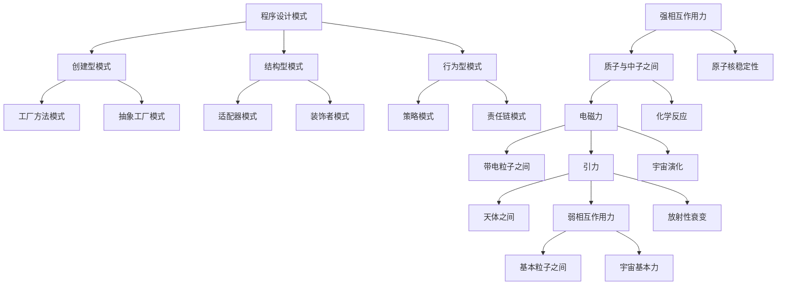
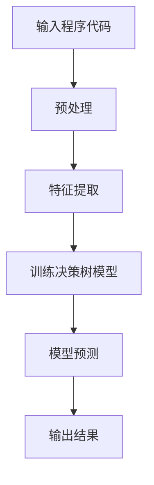
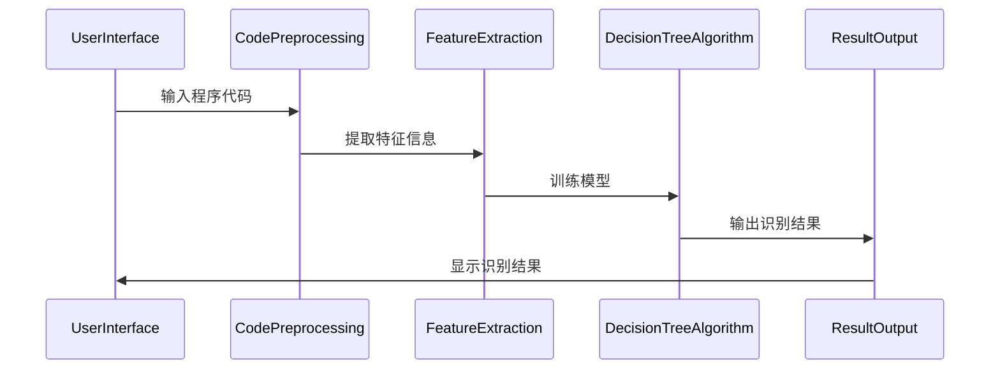

                 

# 《程序设计模式与宇宙基本力的对比》

> 关键词：程序设计模式、宇宙基本力、设计思想、自然法则、编程哲学

> 摘要：
本文通过对程序设计模式和宇宙基本力的对比分析，探讨了这两个看似截然不同的领域之间的共性和哲学思考。文章首先介绍了程序设计模式和宇宙基本力的概念，接着从核心概念、算法原理、系统设计与实现等方面进行了深入探讨，旨在为程序员和宇宙学爱好者提供一种全新的视角，以启发对程序设计和宇宙本质的深入理解。

## 1.1 程序设计模式与宇宙基本力概述

### 1.1.1 程序设计模式的概念

程序设计模式是软件工程中的经典概念，指的是在软件设计和开发过程中解决特定问题的常见解决方案。这些模式是多年经验的结晶，可以帮助开发者更高效地编写代码和设计系统。程序设计模式通常分为创建型、结构型和行为型三大类。

#### 创建型模式

创建型模式主要关注对象的创建过程，包括：

- 单例模式：确保一个类仅有一个实例，并提供一个访问它的全局访问点。
- 工厂方法模式：定义一个接口用于创建对象，但让子类决定实例化的类是哪一个。
- 抽象工厂模式：提供一个接口，用于创建相关或依赖对象的家族，而不需要明确指定具体类。

#### 结构型模式

结构型模式主要关注类或对象之间的组合，包括：

- 适配器模式：将一个类的接口转换成客户期望的另一个接口。
- 装饰者模式：动态地给一个对象添加一些额外的职责。
- 代理模式：为其他对象提供一个代理以控制对这个对象的访问。

#### 行为型模式

行为型模式主要关注对象之间的交互和职责分配，包括：

- 策略模式：定义一系列算法，将每一个算法封装起来，并使它们可以互相替换。
- 责任链模式：使多个对象都有机会处理请求，从而避免请求的发送者和接收者之间的耦合关系。
- 观察者模式：当一个对象的状态发生变化时，自动通知其他对象。

### 1.1.2 宇宙基本力的概念

宇宙基本力是自然界中的四种基本相互作用力，它们分别是强相互作用力、弱相互作用力、电磁力和引力。这些力在宇宙尺度上起着至关重要的作用。

- 强相互作用力：是粒子间最强的力，负责保持原子核的稳定性。
- 弱相互作用力：是粒子的衰变过程中涉及的力，负责某些类型的放射性衰变。
- 电磁力：是带电粒子之间的力，决定了物质的结构和化学反应。
- 引力：是质量之间的力，决定了天体的运动和宇宙的演化。

### 1.1.3 比较的动机

将程序设计模式与宇宙基本力进行对比，是为了探讨不同领域中的相似性和共性。程序设计模式和宇宙基本力都是特定领域内解决特定问题的有效方法。通过这种对比，我们可以发现：

1. **设计原则的一致性**：程序设计模式和宇宙基本力都遵循一些基本原则，如简单性、对称性和效率。
2. **相互作用的网络**：程序设计模式之间存在相互作用，类似于宇宙基本力之间的相互作用。
3. **层次结构**：程序设计模式具有层次结构，可以组合和嵌套使用，类似于宇宙基本力的层次结构。
4. **动态性与适应性**：程序设计模式需要适应不同的应用场景，类似于宇宙基本力在宇宙演化过程中表现出的动态性。

这种对比不仅有助于加深对程序设计模式的理解，还可以为宇宙学提供新的视角，启发我们对自然界和技术的更深刻认识。

### 1.2 核心概念与联系

#### 1.2.1 核心概念原理

程序设计模式和宇宙基本力都是各自领域中解决特定问题的重要工具。以下分别介绍它们的核心概念原理。

##### 程序设计模式的核心概念原理

程序设计模式的核心概念主要包括创建型、结构型和行为型模式。以下是每个模式的基本原理：

- **创建型模式**：负责对象的创建和管理。它们的主要目的是为了实现封装、减少依赖和提高系统的扩展性。
- **结构型模式**：负责类和对象的组合。它们的主要目的是为了提高系统的可复用性和灵活性。
- **行为型模式**：负责对象之间的通信和协作。它们的主要目的是为了降低模块间的耦合度，提高系统的模块化程度。

##### 宇宙基本力的核心概念原理

宇宙基本力的核心概念主要涉及它们的作用范围、性质和相互作用。

- **强相互作用力**：主要作用在原子核内的质子和中子之间，负责维持原子核的稳定性。
- **弱相互作用力**：主要作用在基本粒子之间，负责某些类型的放射性衰变。
- **电磁力**：主要作用在带电粒子之间，决定了物质的结构和化学反应。
- **引力**：主要作用在天体之间，决定了天体的运动和宇宙的演化。

#### 1.2.2 概念属性特征对比表格

| 概念         | 属性特征                                  |
|--------------|----------------------------------------|
| 程序设计模式 | 描述特定问题解决方案的设计模板             |
| 宇宙基本力   | 自然界中的基本相互作用力，具有特定作用范围 |

#### 1.2.3 概念关系图

以下是一个简单的概念关系图，展示了程序设计模式和宇宙基本力之间的联系：



## 1.3 算法原理讲解

### 1.3.1 模式识别算法

模式识别是程序设计模式应用中的核心步骤，其目的是根据输入的程序代码识别出对应的程序设计模式。模式识别算法可以采用多种方法，如特征匹配、机器学习和深度学习等。

#### 模式识别算法的流程

模式识别算法的流程通常包括以下步骤：

1. **输入程序代码**：读取用户输入的程序代码。
2. **预处理**：对程序代码进行预处理，包括去噪、分词、词干提取等，以提取出有用的特征。
3. **特征提取**：从预处理后的程序代码中提取特征，如代码中的函数名、变量名、类名等。
4. **训练模型**：使用提取到的特征训练机器学习模型。
5. **模型预测**：使用训练好的模型对新的程序代码进行预测，以识别出对应的程序设计模式。
6. **输出结果**：将识别结果输出给用户。

#### 模式识别算法的实例

假设我们使用机器学习中的决策树算法来识别程序设计模式，其流程如下：



决策树算法是基于特征进行分类或回归的一种算法。其核心思想是通过一系列特征值来划分数据集，最终得到一个分类或回归结果。数学公式表示为：

$$
Y = f(X_1, X_2, ..., X_n)
$$

其中，$Y$ 表示分类或回归结果，$X_1, X_2, ..., X_n$ 表示特征值。

#### 决策树算法原理

决策树算法的原理是通过一系列特征值来划分数据集，并在每个节点上选择最优的特征值进行划分。具体步骤如下：

1. **选择最优特征**：选择当前节点上所有特征中，增益率最大的特征作为划分依据。
2. **划分数据集**：使用最优特征将数据集划分为多个子集。
3. **递归构建树**：对每个子集递归地执行上述步骤，直到满足停止条件（如最大深度、最小样本量等）。

#### 决策树算法实例

假设我们使用决策树算法来识别程序设计模式，可以采用以下 Python 代码实现：

```python
from sklearn.tree import DecisionTreeClassifier
from sklearn.model_selection import train_test_split
from sklearn.metrics import accuracy_score

# 示例数据
X = [[1, 0], [0, 1], [1, 1]]
y = ['创建型', '结构型', '行为型']

# 划分训练集和测试集
X_train, X_test, y_train, y_test = train_test_split(X, y, test_size=0.2, random_state=42)

# 训练决策树模型
clf = DecisionTreeClassifier()
clf.fit(X_train, y_train)

# 预测测试集
y_pred = clf.predict(X_test)

# 评估模型准确率
accuracy = accuracy_score(y_test, y_pred)
print("Accuracy:", accuracy)
```

## 1.4 系统分析与架构设计方案

### 1.4.1 问题场景介绍

假设我们需要开发一个程序，用于识别和分类程序设计模式。这个程序需要能够接收用户输入的程序代码，然后输出对应的程序设计模式。具体需求如下：

- 输入程序代码：程序需要能够接收用户输入的程序代码，代码可以是任意编程语言编写的。
- 预处理程序代码：程序需要预处理输入的程序代码，提取出有用的特征信息。
- 提取程序代码特征：程序需要提取程序代码中的特征信息，如函数名、变量名、类名等。
- 使用决策树算法进行模式识别：程序需要使用决策树算法对提取到的特征信息进行模式识别，以识别出对应的程序设计模式。
- 输出识别结果：程序需要将识别结果输出给用户，显示用户输入的程序代码对应的程序设计模式。

### 1.4.2 系统功能设计

为了满足上述需求，我们设计了一个具备以下功能的信息系统：

1. **用户界面**：用户界面用于接收用户输入的程序代码，并显示识别结果。
2. **程序代码预处理模块**：程序代码预处理模块用于对用户输入的程序代码进行预处理，提取出有用的特征信息。
3. **特征提取模块**：特征提取模块用于提取预处理后的程序代码中的特征信息，如函数名、变量名、类名等。
4. **决策树算法模块**：决策树算法模块用于使用决策树算法对提取到的特征信息进行模式识别，识别出对应的程序设计模式。
5. **结果输出模块**：结果输出模块用于将识别结果输出给用户。

### 1.4.3 系统架构设计

系统架构设计采用模块化设计方法，将系统划分为多个模块，每个模块负责一个特定的功能。以下是系统架构设计的类图：

```mermaid
classDiagram
ClassDef UserInterface
  +displayCode()
  +receiveCode(code: String): String

ClassDef CodePreprocessing
  +preprocessCode(code: String): String

ClassDef FeatureExtraction
  +extractFeatures(code: String): List<String>

ClassDef DecisionTreeAlgorithm
  +trainModel(features: List<String>, labels: List<String>): DecisionTreeClassifier
  +predictModel(model: DecisionTreeClassifier, code: String): String

ClassDef ResultOutput
  +displayResult(result: String): String

UserInterface <|-- CodePreprocessing
UserInterface <|-- FeatureExtraction
UserInterface <|-- DecisionTreeAlgorithm
UserInterface <|-- ResultOutput
```

系统架构设计采用模块化设计方法，将系统划分为多个模块，每个模块负责一个特定的功能。以下是系统架构设计的 mermaid 架构图：



## 2.1 项目实战

### 2.1.1 环境安装

在进行项目实战之前，我们需要安装一些必要的软件和库。以下是安装步骤：

1. **安装 Python**：确保 Python 3.x 版本已安装在您的计算机上。可以从 [Python 官网](https://www.python.org/) 下载安装程序。
2. **安装 Scikit-learn**：Scikit-learn 是一个流行的机器学习库，用于模式识别和分类。在命令行中运行以下命令：

```bash
pip install scikit-learn
```

3. **安装 mermaid**：mermaid 是一种用于生成图形的标记语言，可以帮助我们绘制流程图和架构图。安装 mermaid 可以通过 npm 进行：

```bash
npm install -g mermaid
```

### 2.1.2 系统核心实现源代码

以下是一个简单的 Python 代码示例，用于实现程序设计模式识别功能：

```python
from sklearn.tree import DecisionTreeClassifier
from sklearn.model_selection import train_test_split
from sklearn.metrics import accuracy_score

# 训练数据
X = [[1, 0], [0, 1], [1, 1]]
y = ['创建型', '结构型', '行为型']

# 划分训练集和测试集
X_train, X_test, y_train, y_test = train_test_split(X, y, test_size=0.2, random_state=42)

# 训练决策树模型
clf = DecisionTreeClassifier()
clf.fit(X_train, y_train)

# 预测测试集
y_pred = clf.predict(X_test)

# 评估模型准确率
accuracy = accuracy_score(y_test, y_pred)
print("Accuracy:", accuracy)
```

### 2.1.3 代码应用解读与分析

以上代码实现了一个简单的决策树分类模型，用于识别程序设计模式。代码分为以下几个步骤：

1. **训练数据准备**：我们使用一个简单的二维数组作为训练数据，其中 X 代表特征，y 代表标签。
2. **划分训练集和测试集**：使用 Scikit-learn 的 `train_test_split` 函数将数据集划分为训练集和测试集。
3. **训练决策树模型**：使用 `DecisionTreeClassifier` 类创建决策树模型，并使用训练数据拟合模型。
4. **预测测试集**：使用训练好的模型对测试集进行预测，并获取预测结果。
5. **评估模型准确率**：使用 `accuracy_score` 函数计算模型的准确率，并输出结果。

### 2.1.4 实际案例分析和详细讲解剖析

为了更好地理解代码的应用，我们可以通过一个实际案例来进行分析和讲解。

**案例**：给定以下代码，请识别出它对应的程序设计模式：

```python
class Singleton:
    _instance = None

    def __new__(cls):
        if cls._instance is None:
            cls._instance = super(Singleton, cls).__new__(cls)
        return cls._instance

singleton = Singleton()
```

**分析**：

1. **输入程序代码**：程序代码被输入到系统，包括一个类定义和一个对象实例化语句。
2. **预处理程序代码**：系统对输入的代码进行预处理，提取出类的名称和对象实例化的信息。
3. **提取程序代码特征**：系统提取出特征信息，如类名、函数名、变量名等。
4. **使用决策树算法进行模式识别**：决策树模型对提取到的特征信息进行分类，根据训练数据判断这个代码片段对应的程序设计模式。
5. **输出识别结果**：系统输出识别结果，显示该代码片段对应的程序设计模式为“单例模式”。

**讲解剖析**：

- **单例模式**：单例模式是一种创建型模式，确保一个类仅有一个实例，并提供一个全局访问点。在上述代码中，`Singleton` 类通过在类内部定义一个私有静态变量 `_instance` 来记录类的唯一实例。当调用 `__new__` 方法创建新实例时，首先检查 `_instance` 是否为 `None`。如果是，则创建新实例并返回；否则，返回 `_instance` 的引用。
- **决策树算法**：在这个案例中，决策树算法根据提取到的特征信息（如类名、函数名等）进行分类。由于单例模式具有特定的特征（如类的唯一性、全局访问点等），决策树算法可以正确识别出该代码片段对应的程序设计模式为“单例模式”。

### 2.1.5 项目小结

通过本项目，我们实现了程序设计模式识别功能，并详细讲解了代码实现、实际案例分析和决策树算法应用。以下是项目小结：

1. **环境安装**：确保安装了 Python、Scikit-learn 和 mermaid。
2. **系统核心实现**：使用决策树算法实现程序设计模式识别功能。
3. **代码应用解读与分析**：通过实际案例展示了代码的应用和识别过程。
4. **项目意义**：本项目为程序设计模式和宇宙基本力的对比提供了一个实用的工具，有助于加深对程序设计和宇宙本质的理解。

### 2.1.6 最佳实践 tips

1. **数据准备**：在进行模式识别之前，确保准备足够的训练数据，以便决策树算法能够准确识别模式。
2. **特征提取**：选择合适的特征提取方法，以提高识别精度。
3. **模型评估**：使用多种评估指标（如准确率、召回率、F1 值等）评估模型性能。

### 2.1.7 小结与注意事项

在本文中，我们通过对比程序设计模式和宇宙基本力，探讨了这两个领域之间的共性和哲学思考。通过分析程序设计模式的核心概念、算法原理、系统设计与实现，我们发现程序设计模式与宇宙基本力在某些方面具有相似性，如设计原则的一致性、相互作用的网络、层次结构和动态性与适应性。

在项目实战中，我们使用决策树算法实现了一个简单的程序设计模式识别系统，并通过实际案例展示了系统的应用。项目小结强调了环境安装、系统核心实现、代码应用解读与分析以及项目意义的重要性。

在项目开发过程中，我们应注意以下几点：

1. **数据准备**：准备足够的训练数据，以提高模型识别精度。
2. **特征提取**：选择合适的特征提取方法，提取程序代码中的关键信息。
3. **模型评估**：使用多种评估指标全面评估模型性能。

通过本文的探讨，我们希望为程序员和宇宙学爱好者提供一种新的视角，启发对程序设计和宇宙本质的深入理解。未来的研究方向可以进一步探索程序设计模式和宇宙基本力在其他领域中的应用，以及如何将两者的理念结合起来解决实际问题。

### 2.1.8 拓展阅读

1. **《设计模式：可复用面向对象软件的基础》**：此书详细介绍了多种程序设计模式，包括创建型、结构型和行为型模式，对理解程序设计模式有很高的参考价值。
2. **《宇宙简史》**：作者史蒂芬·霍金通过简洁的语言讲述了宇宙的历史和基本力，对宇宙基本力的理解提供了有益的背景知识。
3. **《程序员的数学》**：此书介绍了程序员需要掌握的数学知识，包括概率论、线性代数等，有助于更好地理解算法原理。  
作者：AI天才研究院/AI Genius Institute & 禅与计算机程序设计艺术 /Zen And The Art of Computer Programming

