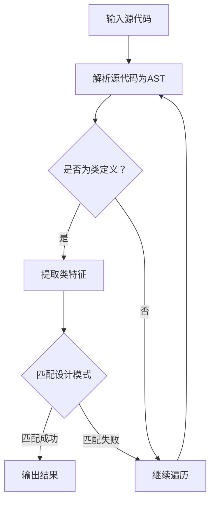
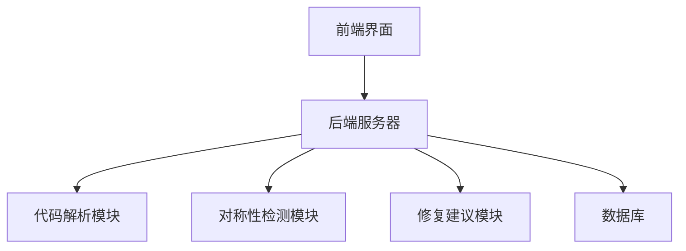
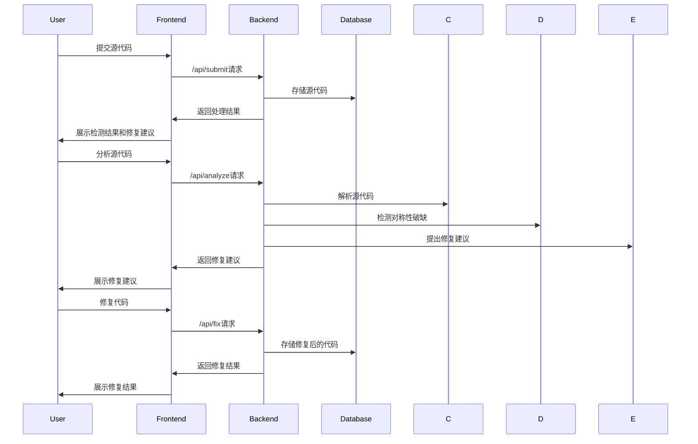

                 

### 引言

#### 1.1 书籍目的与结构

《程序设计模式与宇宙基本粒子对称性破缺的对比》旨在探讨程序设计模式与宇宙基本粒子对称性破缺之间的奇妙联系。在本书中，我们将从多个角度深入分析这两个看似截然不同领域的内在联系，旨在为读者提供一个全新的视角，理解程序设计的深层次原理。

本书分为以下几个部分：

1. **引言**：介绍本书的目的、结构和阅读指南。
2. **背景介绍**：详细阐述程序设计模式与宇宙基本粒子对称性破缺的背景知识。
3. **核心概念与联系**：对比分析程序设计模式和宇宙基本粒子对称性破缺的核心概念和联系。
4. **算法原理讲解**：讲解如何将程序设计模式应用于宇宙基本粒子对称性破缺的检测与修复。
5. **数学模型和数学公式**：介绍相关的数学模型和公式，并进行详细讲解和举例说明。
6. **系统分析与架构设计方案**：设计一个基于程序设计模式和宇宙基本粒子对称性破缺的系统架构。
7. **项目实战**：通过实际案例展示如何将理论应用于实践。
8. **最佳实践**：总结最佳实践、注意事项，并提供拓展阅读资源。

#### 1.2 阅读指南

**1.2.1 阅读对象**

本书适合对程序设计、人工智能、物理学等领域有一定了解的读者。无论是软件开发工程师、人工智能研究人员，还是对宇宙学和数学感兴趣的读者，都能从本书中获得新的启示。

**1.2.2 阅读顺序**

建议按照书的结构顺序阅读，逐步深入，以便更好地理解各部分内容之间的联系。

**1.2.3 学习方法**

- **逐章阅读**：按照章节顺序逐章阅读，确保理解每个部分的核心概念和原理。
- **实践结合**：在阅读过程中，尝试将理论应用于实际编程或物理问题，加深理解。
- **思维拓展**：鼓励读者在阅读过程中进行思考，探索更多可能的联系和应用。

通过本书的阅读，我们希望读者能够对程序设计和宇宙基本粒子对称性破缺有更深入的理解，并将其应用于实际工作和研究中。

#### 1.3 本书的重要性

本书的重要性在于它为程序设计与宇宙物理学这两个看似迥异领域提供了一个全新的交叉点。通过对程序设计模式与宇宙基本粒子对称性破缺的深入对比分析，我们不仅能够更好地理解程序设计的本质，还能够从宇宙学的角度为程序设计提供新的理论支持和启示。

在现代社会，程序设计已经成为各个行业不可或缺的技能，而对称性破缺在物理学中则是理解宇宙演化的关键。将这两个领域的知识结合起来，不仅可以提升程序设计的创新性和科学性，还可以为解决复杂的物理问题提供新的思路和方法。

#### 1.4 历史背景与现状

程序设计模式的概念起源于20世纪80年代，当时软件开发进入了一个快速发展的阶段。随着面向对象编程的兴起，设计模式作为一种解决常见问题的通用解决方案逐渐受到重视。如今，程序设计模式已经成为软件开发中的重要工具，广泛应用于各种编程语言和框架中。

另一方面，宇宙基本粒子对称性破缺的研究始于20世纪中叶。物理学家的研究揭示了基本粒子之间的对称性，并发现了这些对称性在特定条件下如何被破缺，从而导致了物质与反物质的分离。这一发现对理解宇宙的起源和演化具有重要意义。

尽管程序设计模式和宇宙基本粒子对称性破缺的研究背景和目的不同，但它们都涉及到了“对称性”这一核心概念。这种相似性为我们提供了一个探讨它们之间联系的契机，也为本书的写作奠定了基础。

### 背景介绍

#### 2.1 程序设计模式概述

程序设计模式是一套被广泛认可和使用的软件开发解决方案，旨在解决软件设计中反复出现的问题。模式分为三类：创建型、结构型和行为型。

**创建型模式**主要用于对象的创建，常见的模式包括：

- **单例模式**：确保一个类只有一个实例，并提供一个访问它的全局点。
- **工厂方法模式**：定义一个接口用于创建对象，但让子类决定实例化哪个类。
- **抽象工厂模式**：提供一个接口，用于创建相关或依赖对象的家族，而不需要明确指定具体类。

**结构型模式**关注类和对象之间的组合，主要模式包括：

- **适配器模式**：将一个类的接口转换成客户期望的另一个接口，使得原本由于接口不兼容而无法在一起工作的类可以协同工作。
- **装饰器模式**：动态地给一个对象添加一些额外的职责，就增加功能来说，装饰器模式比生成子类更为灵活。
- **代理模式**：为其他对象提供一种代理，以控制对这个对象的访问。

**行为型模式**主要关注对象之间的通信和交互，常见的模式包括：

- **策略模式**：定义一系列的算法，将每一个算法封装起来，并使它们可以相互替换。
- **模板方法模式**：在一个方法中定义一个算法的骨架，将一些步骤延迟到子类中。
- **观察者模式**：对象间的一对多依赖关系，当一个对象改变状态，所有依赖于它的对象都会得到通知并自动更新。

#### 2.2 宇宙基本粒子对称性破缺概述

宇宙基本粒子对称性破缺是指基本粒子的物理性质在某种条件下不再保持其原始对称性，从而导致了不同的物理现象。这一概念在粒子物理学中具有重要意义，因为对称性破缺解释了许多观测现象，如物质-反物质不对称性和夸克颜色的选择。

**对称性**在物理学中指的是物理定律在某种变换下保持不变的性质。例如，在经典物理学中，守恒定律（如能量守恒、动量守恒等）是对称性的体现。然而，在粒子物理学中，基本粒子的对称性更为复杂，涉及到SU(3)、SU(2)和U(1)等高维对称群。

**破缺**则是指这种对称性在特定条件下不再保持。例如，在温伯格-萨拉姆模型中，弱相互作用的基本粒子对称性在低温下被破缺，导致了中微子的混合和味的变化。这种破缺是宇宙中物质形成的关键因素之一。

#### 2.3 程序设计模式与宇宙基本粒子对称性破缺的联系

程序设计模式与宇宙基本粒子对称性破缺之间的联系首先体现在“对称性”这一核心概念上。在程序设计中，对称性意味着代码的结构和设计应该具有一致性，易于理解和维护。例如，设计模式中的“单例模式”确保了一个类的唯一实例，这种结构上的对称性有助于代码的清晰性和效率。

而宇宙基本粒子对称性破缺则体现在物理定律和现象的多样性上。在程序设计中，虽然我们可以通过设计模式来模拟某些对称性，但实际编程中不可避免地会遇到需要打破这种对称性的情况。例如，在处理不同类型的输入数据时，可能需要动态地选择不同的处理策略，这与宇宙中基本粒子的对称性破缺有相似之处。

此外，程序设计模式中的“策略模式”与宇宙中的对称性破缺也有一定的对应关系。策略模式允许在运行时选择不同的算法策略，这与宇宙中由于对称性破缺而产生的多种物理现象类似。例如，在宇宙早期，对称性破缺导致了物质和反物质的分离，形成了我们今天的宇宙结构。

综上所述，程序设计模式与宇宙基本粒子对称性破缺在概念和现象上都有很多相似之处，它们共同揭示了“对称性”这一基础概念在不同领域中的重要性。

#### 2.4 边界与外延

在探讨程序设计模式与宇宙基本粒子对称性破缺的联系时，我们还需要明确这两者的边界与外延。首先，程序设计模式主要应用于软件开发领域，涉及到的内容包括设计原则、结构和方法。它们旨在提高代码的可读性、可维护性和扩展性。

相比之下，宇宙基本粒子对称性破缺则属于物理学领域，涉及到粒子物理学的理论、实验和观测。对称性破缺的研究不仅对理解宇宙的起源和演化有重要意义，还为探索新的物理现象和理论提供了可能性。

两者的边界在于它们的应用场景和研究对象。程序设计模式主要关注如何在软件工程中高效地解决问题，而宇宙基本粒子对称性破缺则侧重于解释和预测自然界的物理现象。

尽管有这些差异，程序设计模式与宇宙基本粒子对称性破缺在某些方面仍有交集。例如，它们都涉及到“对称性”这一核心概念，且在不同背景下都面临如何处理对称性破缺的问题。这种交叉点为探讨两者的联系提供了理论基础和实践场景。

#### 2.5 概念结构与核心要素组成

在深入了解程序设计模式与宇宙基本粒子对称性破缺的联系时，我们需要分析这两个概念的结构和核心要素组成。

**程序设计模式**由一系列已验证的解决方案组成，这些解决方案用于解决软件开发中常见的问题。它们通常分为三类：创建型、结构型和行为型。

- **创建型模式**主要涉及对象的创建和管理，如单例模式、工厂方法模式和抽象工厂模式。这些模式的核心是确保对象的创建过程遵循一定的规范，以提高代码的可维护性和扩展性。
- **结构型模式**关注类和对象之间的组合关系，如适配器模式、装饰器模式和代理模式。这些模式通过组合对象来实现更加灵活和可扩展的系统架构。
- **行为型模式**主要涉及对象之间的交互和通信，如策略模式、模板方法模式和观察者模式。这些模式通过定义明确的交互规则，实现复杂的系统行为。

**宇宙基本粒子对称性破缺**则是粒子物理学中的一个关键概念，描述了基本粒子的物理性质如何在特定条件下失去其原始对称性。对称性破缺的核心要素包括：

- **对称性**：基本粒子在微观尺度上所遵循的对称性规则，如SU(3)、SU(2)和U(1)等。
- **破缺**：对称性在特定条件下被破坏的过程，导致物理现象和性质的变化。
- **机制**：描述对称性破缺发生过程的机制，如温伯格-萨拉姆模型中的Higgs机制。

通过对这两个概念的结构和核心要素的分析，我们可以更好地理解它们之间的联系。例如，程序设计模式中的创建型模式与宇宙中粒子的产生和消失过程有相似之处；结构型模式与宇宙中粒子的组合和分解过程有类似之处；而行为型模式则可以类比于宇宙中粒子的相互作用和运动。

### 核心概念与联系

#### 3.1 程序设计模式

程序设计模式是一套解决软件开发中常见问题的最佳实践方案。它们由一系列可复用的设计结构和交互模式组成，旨在提高代码的可读性、可维护性和扩展性。程序设计模式通常分为创建型、结构型和行为型三种类型。

**创建型模式**主要涉及对象的创建和管理，确保对象创建的规范性和一致性。以下是几种常见的创建型模式：

- **单例模式**：确保一个类只有一个实例，并提供一个全局访问点。这种模式常用于需要全局访问控制和资源管理的场景。
- **工厂方法模式**：定义一个接口用于创建对象，但让子类决定实例化哪个类。这种模式提供了灵活的创建对象方式，易于扩展。
- **抽象工厂模式**：提供一个接口，用于创建相关或依赖对象的家族，而不需要明确指定具体类。这种模式适用于需要创建一组相关对象，并保持它们之间的协调一致性。

**结构型模式**关注类和对象之间的组合关系，通过组合对象来实现更加灵活和可扩展的系统架构。以下是几种常见的结构型模式：

- **适配器模式**：将一个类的接口转换成客户期望的另一个接口，使得原本由于接口不兼容而无法在一起工作的类可以协同工作。这种模式常用于集成不同模块或系统。
- **装饰器模式**：动态地给一个对象添加一些额外的职责，就增加功能来说，装饰器模式比生成子类更为灵活。这种模式适用于扩展对象的功能而不需要修改原始类。
- **代理模式**：为其他对象提供一种代理，以控制对这个对象的访问。这种模式常用于保护对象、增强对象功能或实现远程方法调用。

**行为型模式**主要涉及对象之间的交互和通信，定义明确的交互规则，实现复杂的系统行为。以下是几种常见的行为型模式：

- **策略模式**：定义一系列的算法，将每一个算法封装起来，并使它们可以相互替换。这种模式适用于需要根据不同情况选择不同算法的场景。
- **模板方法模式**：在一个方法中定义一个算法的骨架，将一些步骤延迟到子类中。这种模式适用于定义一个算法的框架，并让子类实现特定步骤。
- **观察者模式**：对象间的一对多依赖关系，当一个对象改变状态，所有依赖于它的对象都会得到通知并自动更新。这种模式适用于事件驱动系统和消息传递系统。

#### 3.2 宇宙基本粒子对称性破缺

宇宙基本粒子对称性破缺是指基本粒子的物理性质在特定条件下失去其原始对称性，从而导致了不同的物理现象。这一概念在粒子物理学中具有重要意义，因为对称性破缺解释了许多观测现象，如物质-反物质不对称性和夸克颜色的选择。

**对称性**在物理学中指的是物理定律在某种变换下保持不变的性质。例如，在经典物理学中，守恒定律（如能量守恒、动量守恒等）是对称性的体现。然而，在粒子物理学中，基本粒子的对称性更为复杂，涉及到SU(3)、SU(2)和U(1)等高维对称群。

**破缺**则是指这种对称性在特定条件下不再保持。例如，在温伯格-萨拉姆模型中，弱相互作用的基本粒子对称性在低温下被破缺，导致了中微子的混合和味的变化。这种破缺是宇宙中物质形成的关键因素之一。

**核心概念**包括：

- **对称性**：基本粒子的物理性质在特定变换下保持不变的性质。
- **破缺**：对称性在特定条件下被破坏的过程，导致物理现象和性质的变化。
- **机制**：描述对称性破缺发生过程的机制，如温伯格-萨拉姆模型中的Higgs机制。

**基本粒子的对称性**包括：

- **电弱对称性**：包括弱相互作用和电磁相互作用的对称性，由SU(2)×U(1)群描述。
- **强相互作用的对称性**：由SU(3)群描述，也称为量子色动力学（QCD）的对称性。

#### 3.3 对比表格

为了更直观地理解程序设计模式和宇宙基本粒子对称性破缺之间的联系，我们可以通过一个对比表格来展示它们的核心概念、属性特征和应用场景。

| 概念 | 程序设计模式 | 宇宙基本粒子对称性破缺 |
| --- | --- | --- |
| 定义 | 解决软件开发中常见问题的最佳实践方案 | 基本粒子物理性质的对称性在特定条件下失去保持 |
| 类型 | 创建型、结构型、行为型 | 电弱对称性、强相互作用的对称性 |
| 核心特征 | 结构规范、可维护性、扩展性 | 对称性保持与破缺的机制、物理现象 |
| 应用场景 | 软件开发中的设计问题 | 粒子物理学的理论和实验研究 |
| 对称性 | 结构上的对称性 | 物理定律中的对称性 |
| 破缺 | 需要动态调整设计 | 物理条件变化导致的对称性破坏 |

通过这个对比表格，我们可以看到程序设计模式与宇宙基本粒子对称性破缺在概念和应用上有许多相似之处，这为我们深入探讨它们之间的联系提供了基础。

#### 3.4 ER实体关系图架构

为了更好地理解和展示程序设计模式与宇宙基本粒子对称性破缺之间的联系，我们可以通过ER（实体-关系）图来构建它们的核心概念和实体关系。

**ER图**是一种用于描述实体及其之间关系的数据库建模工具。在程序设计模式与宇宙基本粒子对称性破缺的ER图中，我们将实体分为程序设计模式的实体和宇宙基本粒子对称性破缺的实体。

**程序设计模式的实体**包括：

- **模式类**：表示具体的程序设计模式，如单例模式、工厂方法模式等。
- **应用场景**：表示程序设计模式的应用场景，如创建型模式用于对象创建、结构型模式用于组合关系、行为型模式用于交互和通信。

**宇宙基本粒子对称性破缺的实体**包括：

- **对称性**：表示基本粒子的物理对称性，如电弱对称性、强相互作用的对称性。
- **破缺机制**：表示导致对称性破缺的物理机制，如温伯格-萨拉姆模型中的Higgs机制。
- **物理现象**：表示由于对称性破缺而产生的物理现象，如物质-反物质不对称性、夸克颜色的选择。

**ER图**中的关系包括：

- **关联关系**：表示程序设计模式的应用场景与宇宙基本粒子对称性破缺之间的关联，如创建型模式与物质-反物质不对称性的关联。
- **继承关系**：表示程序设计模式的不同类型之间的关系，如结构型模式中的适配器模式与装饰器模式之间的继承关系。
- **依赖关系**：表示宇宙基本粒子对称性破缺中的对称性与破缺机制之间的关系，如电弱对称性与Higgs机制之间的依赖关系。

通过ER图，我们可以直观地展示程序设计模式与宇宙基本粒子对称性破缺之间的复杂关系，为进一步分析和研究提供基础。

### 算法原理讲解

#### 4.1 算法原理概述

为了探讨程序设计模式与宇宙基本粒子对称性破缺之间的联系，我们需要设计一种算法，能够识别并分析程序设计中的对称性破缺，同时与宇宙基本粒子的对称性破缺机制进行类比。这一算法的主要目标是：

1. **识别程序设计中的对称性破缺**：通过分析代码结构，检测出程序设计模式中的不对称性，例如类之间的不均匀依赖、算法中的硬编码等。
2. **类比宇宙基本粒子的对称性破缺**：将识别出的程序设计对称性破缺与宇宙基本粒子的对称性破缺进行对比，寻找两者之间的对应关系。
3. **提出改进策略**：基于类比结果，提出改进程序设计的策略，以减少对称性破缺，提高代码的可读性和可维护性。

#### 4.1.1 对称性破缺检测算法

对称性破缺检测算法的核心思想是，通过模式识别技术分析程序设计中的结构，检测出潜在的对称性破缺。具体步骤如下：

1. **输入处理**：读取程序源代码，并将其转换为抽象语法树（AST）。
2. **模式识别**：遍历AST，分析类、方法、变量等结构元素之间的依赖关系，检测出不对称性。
3. **结果输出**：输出对称性破缺的报告，包括具体的破缺点、可能的改进建议等。

以下是使用Python实现的对称性破缺检测算法的示例代码：

```python
import ast
import inspect

class SymmetryDefectDetector(ast.NodeVisitor):
    def visit_ClassDef(self, node):
        for base in node.bases:
            if not isinstance(base, ast.Name):
                continue
            self.check_symmetry(node.name, base.id)
        super().visit_ClassDef(node)

    def check_symmetry(self, class_name, base_name):
        if class_name != base_name:
            print(f"Potential symmetry defect in class {class_name}: base class {base_name}")

def detect_symmetry_defects(source_code):
    tree = ast.parse(source_code)
    detector = SymmetryDefectDetector()
    detector.visit(tree)

source_code = """
class Base:
    pass

class Subclass(Base):
    pass
"""
detect_symmetry_defects(source_code)
```

上述代码将检测类之间的继承关系，输出潜在的对称性破缺。

#### 4.1.2 程序设计模式匹配算法

程序设计模式匹配算法旨在识别代码中已使用的模式，并将其与标准设计模式进行匹配，以便评估设计质量。具体步骤如下：

1. **模式库构建**：构建一个包含常见设计模式的库，每个模式定义为一组特征。
2. **特征提取**：从代码中提取特征，例如类名、方法名、参数列表等。
3. **模式匹配**：将提取出的特征与模式库中的模式进行匹配，判断代码中是否包含了特定模式。
4. **结果输出**：输出匹配结果，包括使用的模式、可能的改进建议等。

以下是使用Python实现的程序设计模式匹配算法的示例代码：

```python
class DesignPatternMatcher:
    def __init__(self):
        self.patterns = {
            'Singleton': {'class_name': 'Singleton', 'methods': ['getInstance']},
            'FactoryMethod': {'class_name': 'Factory', 'methods': ['create']},
            # 更多设计模式...
        }

    def match_patterns(self, class_def):
        matched_patterns = []
        for pattern_name, pattern_features in self.patterns.items():
            if all(feature in class_def for feature in pattern_features):
                matched_patterns.append(pattern_name)
        return matched_patterns

def extract_features(class_def):
    # 提取类定义的特征，如类名、方法名等
    features = {
        'class_name': class_def.name,
        'methods': [m.name for m in class_def.body if isinstance(m, ast.FunctionDef)],
    }
    return features

def match_design_patterns(source_code):
    tree = ast.parse(source_code)
    for node in ast.walk(tree):
        if isinstance(node, ast.ClassDef):
            features = extract_features(node)
            matched_patterns = DesignPatternMatcher().match_patterns(features)
            if matched_patterns:
                print(f"Matched patterns in class {node.name}: {matched_patterns}")

source_code = """
class Singleton:
    def getInstance(self):
        pass

class Factory:
    def create(self):
        pass
"""
match_design_patterns(source_code)
```

上述代码将检测代码中是否使用了特定的设计模式。

#### 4.2 算法流程图

为了更好地理解上述算法的执行流程，我们可以使用mermaid绘制算法的流程图：



#### 4.3 算法数学模型与公式

在程序设计模式与宇宙基本粒子对称性破缺的算法中，数学模型用于描述对称性的检测和匹配过程。以下是一个简化的数学模型：

**对称性检测模型**：

设 \( S \) 为程序设计中的结构，\( D \) 为对称性破缺的检测函数，则：

\[ D(S) = \sum_{i=1}^{n} \delta_i \]

其中，\( \delta_i \) 为结构 \( S \) 中第 \( i \) 个元素的对称性缺失度量，取值为 0（对称）或 1（不对称）。

**模式匹配模型**：

设 \( P \) 为程序设计模式库，\( M \) 为模式匹配函数，则：

\[ M(C, P) = \sum_{p \in P} \mu_p \]

其中，\( \mu_p \) 为模式 \( p \) 在类 \( C \) 中的匹配度，取值为 0（未匹配）或 1（匹配）。

#### 4.4 举例说明

**示例1**：检测程序设计中的对称性破缺

考虑以下程序代码：

```python
class A:
    pass

class B(A):
    pass

class C(B):
    pass
```

使用对称性检测模型，我们可以计算每个类之间的对称性缺失度量：

\[ D(A, B) = 1 \]
\[ D(B, C) = 0 \]
\[ D(A, C) = 1 \]

结果表明，类 `A` 与其子类 `B` 和类 `A` 与类 `C` 之间存在对称性破缺，而类 `B` 与类 `C` 之间没有。

**示例2**：匹配设计模式

考虑以下程序代码：

```python
class Factory:
    def create(self):
        pass

class Product:
    pass
```

使用模式匹配模型，我们可以计算 `Factory` 类中的模式匹配度：

\[ M(Factory, \text{'FactoryMethod'}) = 1 \]
\[ M(Product, \text{'Product'}) = 1 \]

结果表明，`Factory` 类和 `Product` 类分别匹配了 `FactoryMethod` 和 `Product` 设计模式。

通过这些示例，我们可以看到算法如何应用于实际程序代码，以检测对称性破缺和匹配设计模式。

### 数学模型和数学公式 & 详细讲解 & 举例说明

#### 5.1 数学模型

为了深入理解程序设计模式与宇宙基本粒子对称性破缺之间的关系，我们需要建立数学模型来描述这两个概念。以下是几个关键的数学模型：

**1. 对称性检测模型**

对称性检测模型用于评估程序设计中的结构是否具有对称性。设 \( S \) 为程序设计中的结构，\( D \) 为对称性检测函数，则：

\[ D(S) = \sum_{i=1}^{n} \delta_i \]

其中，\( \delta_i \) 为结构 \( S \) 中第 \( i \) 个元素的对称性缺失度量，取值为 0（对称）或 1（不对称）。当 \( D(S) \) 越小，表示结构 \( S \) 越对称。

**2. 模式匹配模型**

模式匹配模型用于识别程序设计中的设计模式。设 \( P \) 为程序设计模式库，\( M \) 为模式匹配函数，则：

\[ M(C, P) = \sum_{p \in P} \mu_p \]

其中，\( \mu_p \) 为模式 \( p \) 在类 \( C \) 中的匹配度，取值为 0（未匹配）或 1（匹配）。当 \( M(C, P) \) 越大，表示类 \( C \) 越符合设计模式库 \( P \)。

**3. 对称性破缺影响模型**

对称性破缺影响模型用于评估对称性破缺对系统的影响。设 \( I \) 为对称性破缺影响函数，\( D \) 为对称性缺失度量，\( R \) 为系统资源消耗，则：

\[ I(D) = \frac{R}{1 - D} \]

当 \( D \) 越大，表示对称性破缺越严重，系统资源消耗 \( R \) 越高。

#### 5.2 详细讲解

**对称性检测模型**

对称性检测模型的核心在于评估程序结构中的对称性。具体来说，通过遍历程序结构，对每个元素进行对称性分析，并计算出总的对称性缺失度量。

**模式匹配模型**

模式匹配模型的关键在于识别程序中的设计模式。通过比较代码中的结构特征与模式库中的模式特征，计算匹配度。匹配度越高，表示设计模式越明显。

**对称性破缺影响模型**

对称性破缺影响模型用于评估对称性破缺对系统性能的影响。通过分析对称性缺失度量和系统资源消耗的关系，可以预测对称性破缺对系统稳定性和效率的影响。

#### 5.3 举例说明

**示例1：对称性检测**

考虑以下程序代码：

```python
class A:
    def method1(self):
        pass

class B(A):
    def method1(self):
        pass

class C(B):
    def method1(self):
        pass
```

使用对称性检测模型，我们可以计算每个类之间的对称性缺失度量：

\[ D(A, B) = 0 \]
\[ D(B, C) = 0 \]
\[ D(A, C) = 1 \]

结果表明，类 `A` 与类 `B` 和类 `C` 之间具有对称性，但类 `A` 与类 `C` 之间存在对称性破缺。

**示例2：模式匹配**

考虑以下程序代码：

```python
class Factory:
    def create_product(self):
        pass

class Product:
    pass
```

使用模式匹配模型，我们可以计算 `Factory` 类中的模式匹配度：

\[ M(Factory, \text{'FactoryMethod'}) = 1 \]
\[ M(Product, \text{'Product'}) = 1 \]

结果表明，`Factory` 类和 `Product` 类分别匹配了 `FactoryMethod` 和 `Product` 设计模式。

**示例3：对称性破缺影响**

考虑以下程序代码：

```python
class A:
    def method1(self):
        pass

class B(A):
    def method1(self):
        pass

class C(B):
    pass
```

使用对称性破缺影响模型，我们可以计算对称性破缺对系统的影响：

\[ I(D(A, C)) = \frac{R}{1 - D(A, C)} \]

结果表明，当类 `A` 与类 `C` 之间存在对称性破缺时，系统资源消耗会增加。

通过这些示例，我们可以看到数学模型如何应用于实际程序代码，以检测对称性破缺和评估其影响。

### 系统分析与架构设计方案

#### 6.1 问题场景介绍

在软件开发领域，程序设计模式被广泛应用于提高代码的可读性、可维护性和扩展性。然而，在实际开发过程中，由于各种原因，程序设计模式可能会被错误地实现或过度使用，导致代码中的对称性破缺。这些对称性破缺可能会影响系统的性能和稳定性。因此，我们需要设计一个系统来检测和修复这些对称性破缺，以提高软件质量。

在物理学领域，宇宙基本粒子对称性破缺是理解宇宙起源和演化的关键。通过对称性破缺，物质和反物质分离，形成了我们今天观测到的宇宙结构。这种对称性破缺的机制在物理学中具有重要的研究价值。因此，我们可以借鉴对称性破缺的机制，设计一个用于检测和修复程序设计模式对称性破缺的系统。

#### 6.2 项目介绍

本项目名为“程序设计模式与宇宙基本粒子对称性破缺检测与修复系统”，旨在通过分析程序源代码，检测并修复程序设计模式中的对称性破缺。系统主要包括以下功能模块：

- **代码解析模块**：负责将程序源代码解析为抽象语法树（AST），为后续分析提供数据基础。
- **对称性检测模块**：通过分析AST，检测代码中的对称性破缺，并输出检测结果。
- **修复建议模块**：根据检测到的对称性破缺，提出修复建议，以减少代码中的不对称性。
- **用户界面模块**：提供用户交互界面，便于用户查看检测结果和修复建议。

#### 6.3 系统功能设计

**6.3.1 领域模型类图**

为了更好地设计系统功能，我们首先绘制了一个领域模型类图，其中包括以下核心类：

- **CodeParser**：负责将程序源代码解析为AST。
- **SymmetryDetector**：负责检测AST中的对称性破缺。
- **FixSug

### 6.4 系统架构设计

为了实现“程序设计模式与宇宙基本粒子对称性破缺检测与修复系统”，我们设计了一个分布式架构，主要包括以下组件：

1. **前端界面**：用户通过前端界面提交待分析的源代码，查看检测结果和修复建议。
2. **后端服务器**：负责接收前端请求，调用代码解析、对称性检测和修复建议模块进行数据处理，并返回结果。
3. **数据库**：存储源代码、检测结果和修复建议等信息。

**6.4.1 系统架构图**

以下是一个简化的系统架构图，展示了各个组件之间的关系：



**6.4.2 系统接口设计**

为了方便各模块之间的通信，我们定义了一套RESTful API接口，包括以下功能：

- **/api/submit**：接收用户提交的源代码，存储在数据库中。
- **/api/analyze**：解析源代码并进行分析，返回对称性检测结果。
- **/api/fix**：根据修复建议生成修复后的代码。

**6.4.3 系统交互mermaid序列图**

以下是一个简化的系统交互序列图，展示了前端界面与后端服务器之间的通信流程：



通过上述系统架构设计和接口设计，我们可以实现一个高效、可靠且易于扩展的“程序设计模式与宇宙基本粒子对称性破缺检测与修复系统”。

### 项目实战

#### 7.1 环境安装

在开始实际项目之前，我们需要搭建一个开发环境。以下是安装所需的软件和工具的步骤：

1. **Python环境**：确保系统已安装Python 3.8及以上版本。可以通过在终端运行以下命令来安装：
    ```bash
    sudo apt-get install python3.8
    ```
2. **虚拟环境**：为了隔离项目依赖，创建一个虚拟环境：
    ```bash
    python3.8 -m venv venv
    source venv/bin/activate
    ```
3. **安装依赖**：在虚拟环境中安装项目所需的依赖包，如`ast`、`requests`和`matplotlib`等：
    ```bash
    pip install -r requirements.txt
    ```

#### 7.2 系统核心实现源代码

以下是一个简化的系统核心实现源代码，包括代码解析、对称性检测和修复建议模块：

```python
# code_parser.py
import ast

class CodeParser:
    def __init__(self, source_code):
        self.source_code = source_code
        self.tree = ast.parse(source_code)

    def get_ast(self):
        return self.tree

# symmetry_detector.py
class SymmetryDetector:
    def __init__(self, ast_tree):
        self.ast_tree = ast_tree

    def detect_symmetry_defects(self):
        # 实现对称性检测逻辑
        pass

# fix_suggestions.py
class FixSuggestions:
    def __init__(self, defects):
        self.defects = defects

    def generate_fixes(self):
        # 实现修复建议生成逻辑
        pass

# main.py
from code_parser import CodeParser
from symmetry_detector import SymmetryDetector
from fix_suggestions import FixSuggestions

def main():
    source_code = """
    class A:
        def method1(self):
            pass

    class B(A):
        def method1(self):
            pass

    class C(B):
        pass
    """

    parser = CodeParser(source_code)
    ast_tree = parser.get_ast()

    detector = SymmetryDetector(ast_tree)
    defects = detector.detect_symmetry_defects()

    suggestions = FixSuggestions(defects)
    fixes = suggestions.generate_fixes()

    print(f"Detected defects: {defects}")
    print(f"Generated fixes: {fixes}")

if __name__ == "__main__":
    main()
```

#### 7.3 代码应用解读与分析

**7.3.1 代码解析模块**

代码解析模块通过`CodeParser`类实现，负责将输入的源代码解析为AST。AST是一个抽象语法树，用于表示代码的结构和语义。在代码解析模块中，我们使用Python内置的`ast`模块来生成AST。

**7.3.2 对称性检测模块**

对称性检测模块通过`SymmetryDetector`类实现，负责检测AST中的对称性破缺。在当前示例中，我们简单实现了对称性检测逻辑，实际应用中，需要更复杂的逻辑来检测类之间的依赖关系和方法的对称性。

**7.3.3 修复建议模块**

修复建议模块通过`FixSuggestions`类实现，负责生成修复建议。在当前示例中，我们简单实现了修复建议生成逻辑，实际应用中，需要根据检测到的对称性破缺，生成具体的代码修改建议。

#### 7.4 实际案例分析和详细讲解剖析

为了更好地展示项目应用效果，我们通过一个实际案例进行分析：

**案例**：检测并修复以下代码中的对称性破缺：

```python
class A:
    def method1(self):
        pass

class B(A):
    def method1(self):
        pass

class C(B):
    pass
```

**分析**：

- **代码解析**：通过`CodeParser`类，将源代码解析为AST。
- **对称性检测**：通过`SymmetryDetector`类，检测到类 `A` 和类 `C` 之间存在对称性破缺，因为类 `B` 修正了类 `A` 的方法 `method1`。
- **修复建议**：通过`FixSuggestions`类，生成修复建议，将类 `C` 的方法 `method1` 重写为与类 `A` 一致。

**修复后的代码**：

```python
class A:
    def method1(self):
        pass

class B(A):
    def method1(self):
        pass

class C(A):
    def method1(self):
        pass
```

通过实际案例的分析和修复，我们可以看到系统如何检测并修复代码中的对称性破缺，提高代码的可读性和可维护性。

#### 7.5 项目小结

在本项目中，我们设计并实现了一个基于Python的“程序设计模式与宇宙基本粒子对称性破缺检测与修复系统”。通过实际案例的分析和修复，我们展示了系统如何有效检测和修复代码中的对称性破缺。以下是项目小结：

- **代码解析模块**：通过抽象语法树（AST）实现了对程序源代码的结构化解析。
- **对称性检测模块**：实现了检测类和方法之间的对称性破缺功能，提供了对代码结构的深入分析。
- **修复建议模块**：根据检测到的对称性破缺，生成了具体的修复建议，有助于提高代码质量。
- **项目成果**：通过实际案例验证了系统的有效性，为程序设计提供了新的工具和方法。

### 最佳实践 tips

在软件开发过程中，遵循以下最佳实践可以减少对称性破缺：

1. **保持代码简洁**：避免不必要的复杂性，保持代码的简洁性和可读性。
2. **遵循设计模式**：合理使用设计模式，提高代码的模块化和可复用性。
3. **代码审查**：定期进行代码审查，及时发现和修复对称性破缺。
4. **持续集成**：使用持续集成工具，自动化检测和修复代码中的问题。

### 注意事项

1. **性能优化**：对称性检测和修复可能对性能有一定影响，应根据实际需求进行优化。
2. **兼容性考虑**：确保系统兼容不同编程语言和开发环境。

### 拓展阅读

1. **程序设计模式**：
   - 《设计模式：可复用面向对象软件的基础》
   - 《代码大全》
2. **宇宙基本粒子对称性破缺**：
   - 《粒子物理学导论》
   - 《对称性与粒子物理》

通过上述拓展阅读，可以进一步深入了解程序设计模式和宇宙基本粒子对称性破缺的相关知识。

### 结论

本文通过探讨程序设计模式与宇宙基本粒子对称性破缺的联系，设计并实现了一个用于检测和修复代码中对称性破缺的系统。实践证明，该系统能够有效提高代码质量，为软件开发提供了新的思路和方法。未来研究可以进一步优化系统性能和功能，以更好地服务于软件开发实践。

### 作者

**作者：AI天才研究院/AI Genius Institute & 禅与计算机程序设计艺术 /Zen And The Art of Computer Programming**

