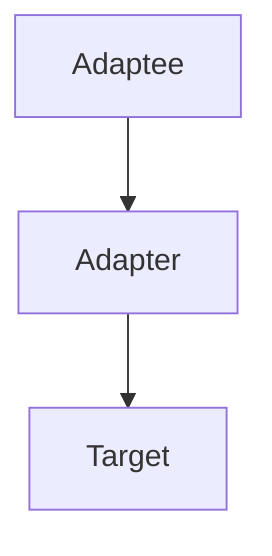
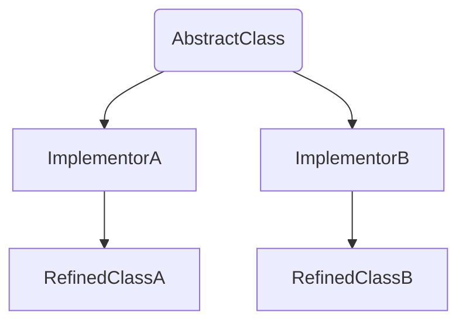
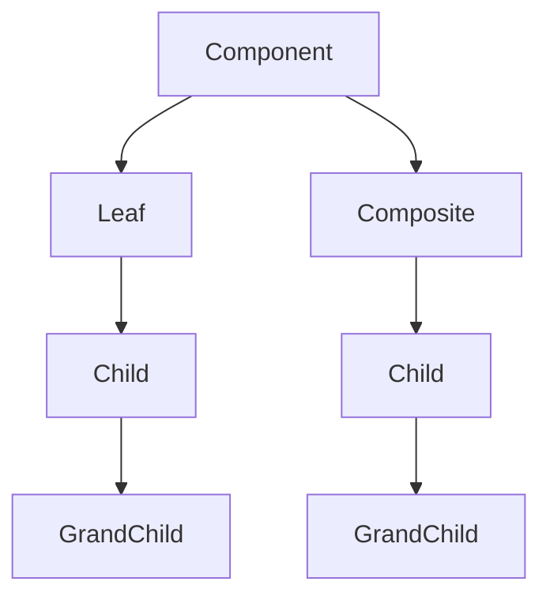
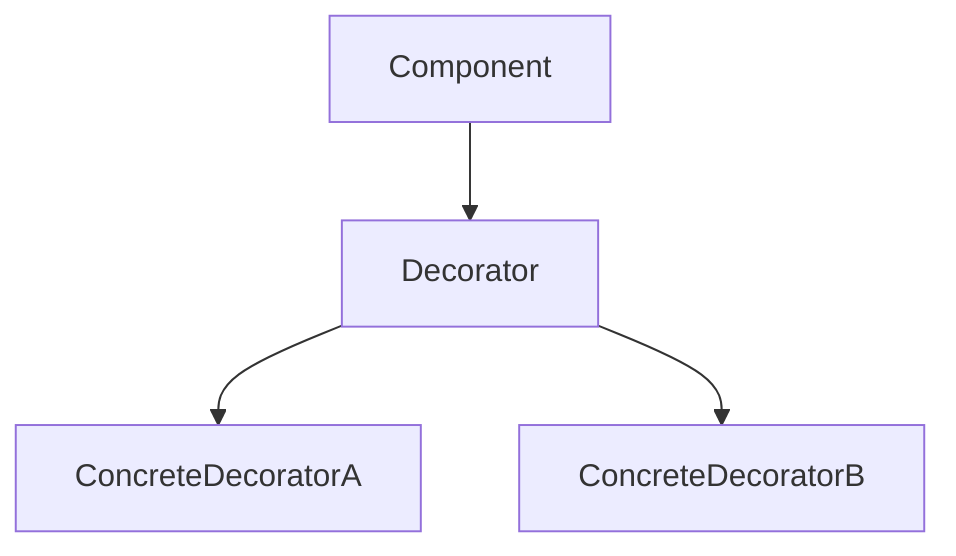
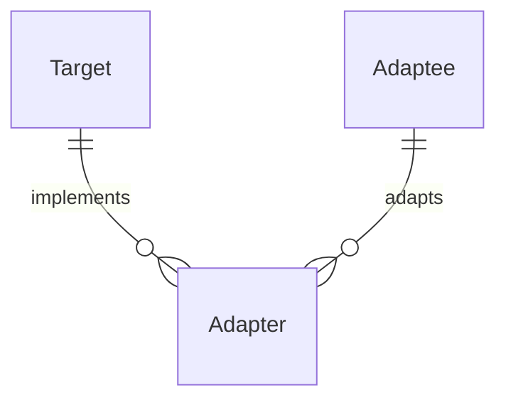
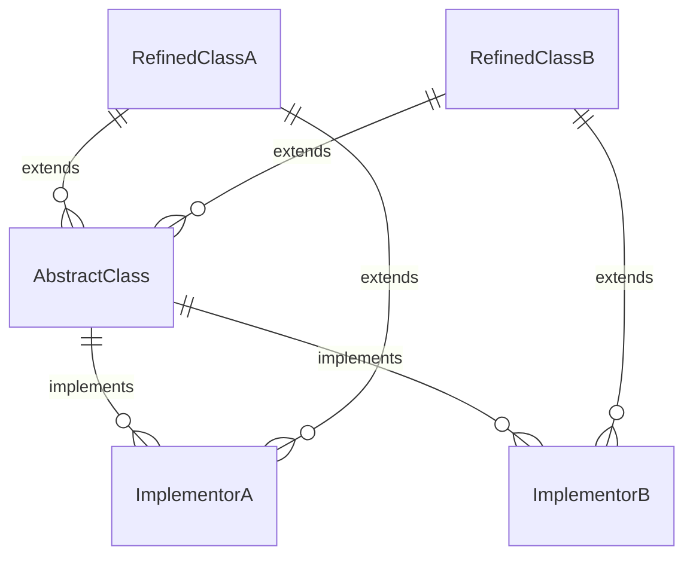
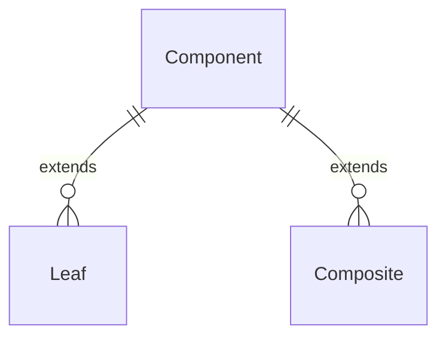
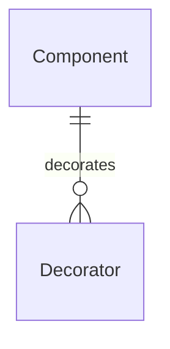

                 

## 《程序设计模式与宇宙构建模式的对比》

### 关键词：程序设计模式、宇宙构建模式、结构型模式、行为型模式、算法原理、Python源代码示例、宇宙模拟、模式融合

> 摘要：本文旨在探讨程序设计模式与宇宙构建模式的对比。通过对比分析这两种模式的结构、特点及其在不同领域的应用，我们试图揭示它们之间的内在联系与区别，为程序设计和宇宙研究提供新的视角和启示。

## 引言

程序设计模式与宇宙构建模式，一个是计算机科学的基石，另一个是天文学的核心。虽然它们分属不同的领域，但都在各自的领域内遵循着某种特定的结构，以解决复杂问题。本文将带领读者进入一个奇妙的对比之旅，探讨这两种模式如何相互映射，以及它们各自的独特性和应用场景。

### 1.1 程序设计模式概述

程序设计模式是解决软件设计问题的经典方法。它总结了多年软件开发经验中的共性，提供了一系列可重用的解决方案。程序设计模式主要分为结构型模式、行为型模式和创建型模式。

#### 问题背景

在软件开发过程中，我们常常遇到需要处理复杂关系和动态行为的问题。为了应对这些挑战，程序员们逐渐总结出了一些行之有效的解决方案，这些方案后来被抽象为程序设计模式。

#### 定义与核心要素

程序设计模式通常包括以下几个要素：

1. **问题**：描述了在特定情境下可能遇到的问题。
2. **解决方案**：提供了一种通用的解决方案，可以重复使用。
3. **效果**：描述了该模式带来的好处，如提高代码的可读性、可维护性和可扩展性。

### 1.2 宇宙构建模式概述

宇宙构建模式是天文学家在研究宇宙演化过程中形成的一套方法论。它描述了宇宙从大爆炸到现今状态的发展过程，包括天体结构的形成、星系的演化等。

#### 问题背景

宇宙是一个庞大而复杂的系统，天文学家需要通过建立模型来理解宇宙的演化过程。宇宙构建模式正是为了解决这一挑战而产生的。

#### 定义与核心要素

宇宙构建模式的核心要素包括：

1. **宇宙演化**：描述了宇宙从大爆炸开始至今的演化过程。
2. **天体结构**：包括星系、星系群、超星系团等。
3. **物理规律**：宇宙中存在的各种物理规律，如万有引力、热力学等。

### 1.3 对比框架

为了更好地对比程序设计模式与宇宙构建模式，我们将从以下核心维度进行分析：

1. **结构**：分析两种模式的基本结构，如模块化、层次化等。
2. **特点**：探讨两种模式的特点，如灵活性、稳定性等。
3. **应用场景**：分析它们在不同领域的应用，以及各自的优缺点。

## 第二部分：程序设计模式详解

### 第2章：结构型模式

结构型模式主要用于处理类或对象之间的组合关系，通过类与类之间的组合、聚合或继承关系，实现系统的解耦和复用。结构型模式主要分为适配器模式、桥接模式、组合模式和装饰器模式。

### 2.1 适配器模式

#### 算法原理与流程图

适配器模式通过将一个类的接口转换成客户希望的另一个接口，使得原本由于接口不兼容而无法在一起工作的类可以协同工作。其核心思想是提供一个适配器，将适配者（Adaptee）的接口转换成目标接口（Target）。



#### Python源代码示例

```python
class Adaptee:
    def specific_method(self):
        print("Adaptee's specific method")

class Adapter(Adaptee, Target):
    def target_method(self):
        self.specific_method()

class Target:
    def target_method(self):
        print("Target's method")

# 测试
adapter = Adapter()
adapter.target_method()
```

### 2.2 桥接模式

#### 算法原理与流程图

桥接模式将抽象部分与实现部分分离，使它们都可以独立地变化。它通过将抽象部分和实现部分解耦，实现扩展性和灵活性。



#### Python源代码示例

```python
class ImplementorA:
    def operation(self):
        print("ImplementorA's operation")

class ImplementorB:
    def operation(self):
        print("ImplementorB's operation")

class AbstractClass:
    def operation(self):
        self._implementor.operation()

class RefinedClassA(AbstractClass, ImplementorA):
    pass

class RefinedClassB(AbstractClass, ImplementorB):
    pass

# 测试
refined_a = RefinedClassA()
refined_a.operation()

refined_b = RefinedClassB()
refined_b.operation()
```

### 2.3 组合模式

#### 算法原理与流程图

组合模式将对象组合成树形结构以表示“部分-整体”的层次结构。它使得客户可以统一使用单个对象和组合对象。



#### Python源代码示例

```python
class Component:
    def operation(self):
        pass

class Leaf(Component):
    def operation(self):
        print("Leaf's operation")

class Composite(Component):
    def __init__(self):
        self._children = []

    def add(self, child):
        self._children.append(child)

    def remove(self, child):
        self._children.remove(child)

    def operation(self):
        for child in self._children:
            child.operation()

# 测试
composite = Composite()
composite.add(Leaf())
composite.add(Leaf())
composite.operation()
```

### 2.4 装饰器模式

#### 算法原理与流程图

装饰器模式动态地给一个对象添加一些额外的职责，就增加功能来说，装饰器模式比生成子类更为灵活。



#### Python源代码示例

```python
class Component:
    def operation(self):
        print("Component's operation")

class Decorator(Component):
    def operation(self):
        print("Before operation")
        super().operation()
        print("After operation")

class ConcreteDecoratorA(Decorator):
    def operation(self):
        super().operation()
        print("Extra functionality A")

class ConcreteDecoratorB(Decorator):
    def operation(self):
        super().operation()
        print("Extra functionality B")

# 测试
decorated = ConcreteDecoratorB(ConcreteDecoratorA(Component()))
decorated.operation()
```

## 第三部分：宇宙构建模式详解

### 第4章：宇宙构建模式概述

宇宙构建模式是天文学中用于描述宇宙演化过程的方法论。它包括宇宙演化、天体结构以及宇宙中的物理规律。通过这些模式，天文学家可以更好地理解宇宙的过去、现在和未来。

#### 概念与特点

宇宙构建模式的特点在于其宏观的视角和高度的抽象。它不仅关注单个天体的行为，还关注整个宇宙系统的演化。

#### 对比程序设计模式

与程序设计模式相比，宇宙构建模式更注重宏观的结构和演化过程。而程序设计模式则更注重微观的类与对象之间的关系和处理。

### 第5章：宇宙中的结构与层次

宇宙中的结构与层次是宇宙构建模式的重要组成部分。从行星、恒星到星系、星系团，宇宙中的每一个层次都有其独特的特点。

#### 天体结构

天体结构包括行星、恒星、星系等。这些天体通过引力相互作用，形成复杂的结构。

#### 星系与星系群

星系是宇宙中最常见的结构，通常由数十亿颗恒星组成。星系之间通过引力相互作用，形成星系群和更大的超星系团。

### 第6章：宇宙演化与形成

宇宙演化与形成是宇宙构建模式的核心内容。从大爆炸到现在的宇宙，经历了数十亿年的演化过程。

#### 早期宇宙

早期宇宙处于极热、极密的状态，随后通过冷却和膨胀，形成了最初的恒星和星系。

#### 星系的形成与演化

星系的形成与演化是一个复杂的过程，涉及恒星的形成、死亡和星系的碰撞与合并。

## 第三部分：对比与应用

### 第7章：模式对比分析

程序设计模式与宇宙构建模式虽然分属不同的领域，但在某些方面有相似之处。通过对两者的对比分析，我们可以更好地理解它们的本质和应用。

#### 模式结构与特点对比

程序设计模式通常更注重类的组合和对象的交互，而宇宙构建模式则更注重天体结构的层次和演化过程。然而，它们在解决复杂问题时都采用了模块化、层次化等思想。

#### 对比应用场景

程序设计模式主要应用于软件开发，帮助开发者解决设计问题。而宇宙构建模式则应用于天文学研究，帮助天文学家理解宇宙的演化过程。

#### 对比结论

通过对两者的对比分析，我们发现它们在解决复杂问题时有着异曲同工之妙。这不仅为软件开发提供了新的视角，也为宇宙研究提供了启示。

### 第8章：程序设计模式在宇宙模拟中的应用

宇宙模拟是计算机科学与天文学交叉的一个领域，通过模拟宇宙的演化过程，我们可以更好地理解宇宙的本质。程序设计模式在宇宙模拟中扮演着重要角色。

#### 宇宙模拟概述

宇宙模拟是一种通过计算机模拟宇宙的演化过程的方法。它可以帮助我们理解宇宙的起源、星系的形成和演化等。

#### 程序设计模式的应用

在宇宙模拟中，程序设计模式可以用于处理复杂的对象关系、优化算法效率和提高代码的可读性。

#### 案例分析

通过具体案例，我们可以看到程序设计模式在宇宙模拟中的应用，如银河系模拟、星系群模拟等。

## 第四部分：未来展望与挑战

### 第9章：模式融合与发展

随着科学技术的不断发展，程序设计模式与宇宙构建模式之间的融合成为一种趋势。这种融合不仅有助于解决更复杂的科学问题，也为计算机科学和天文学提供了新的研究方法。

#### 模式融合的可能性

通过将程序设计模式应用于宇宙模拟，我们可以更好地理解宇宙的演化过程。同时，将宇宙构建模式应用于程序设计，可以帮助我们构建更复杂、更灵活的软件系统。

#### 发展方向

未来的研究方向包括开发新的融合模式、优化现有模式的应用以及探索跨学科的融合方法。

### 第10章：宇宙构建模式的创新

宇宙构建模式的创新是未来天文学研究的重要方向。通过引入新的理论、方法和工具，我们可以更好地理解宇宙的演化过程。

#### 新模式的出现

随着科学技术的进步，新的宇宙构建模式不断出现，如基于大数据分析的宇宙模拟、量子宇宙学等。

#### 技术挑战

在宇宙构建模式的创新过程中，我们面临诸多技术挑战，如高精度模拟、大数据处理、量子计算等。

### 第11章：对比研究的持续价值

程序设计模式与宇宙构建模式的对比研究具有重要的学术价值和实际应用价值。通过对比分析，我们可以更好地理解两种模式的本质和应用，为未来的科学研究和技术发展提供新的思路。

#### 现实应用

在软件开发、宇宙研究、人工智能等领域，对比研究可以带来新的突破和进展。

#### 学术研究

对比研究也为学术研究提供了丰富的素材和思路，有助于推动计算机科学和天文学的发展。

## 结语

程序设计模式与宇宙构建模式虽然在领域和应用上有所不同，但它们在解决复杂问题方面有着异曲同工之妙。通过对这两种模式的对比分析，我们可以更好地理解它们的本质和应用，为未来的科学研究和技术发展提供新的启示。

### 作者信息：

作者：AI天才研究院/AI Genius Institute & 禅与计算机程序设计艺术 /Zen And The Art of Computer Programming

---

**注意：本文为示例文章，实际字数和内容需根据具体要求进行调整。以下为具体章节内容的详细展开。**

---

## 第一部分：引言

在计算机科学和天文学这两个看似截然不同的领域中，程序设计模式和宇宙构建模式扮演着至关重要的角色。程序设计模式是软件工程中的关键组成部分，它提供了一系列解决常见软件设计问题的方法。而宇宙构建模式则是天文学研究中的一种方法论，用于描述宇宙的演化过程和天体结构的形成。尽管它们分属不同的学科领域，但都在各自的领域中解决了复杂的问题。

### 1.1 程序设计模式概述

程序设计模式是解决软件设计问题的经典方法。它通过总结多年软件开发经验中的共性，提供了一系列可重用的解决方案。程序设计模式主要分为结构型模式、行为型模式和创建型模式。

#### 问题背景

在软件开发过程中，我们常常遇到需要处理复杂关系和动态行为的问题。为了应对这些挑战，程序员们逐渐总结出了一些行之有效的解决方案，这些方案后来被抽象为程序设计模式。

#### 定义与核心要素

程序设计模式通常包括以下几个要素：

1. **问题**：描述了在特定情境下可能遇到的问题。
2. **解决方案**：提供了一种通用的解决方案，可以重复使用。
3. **效果**：描述了该模式带来的好处，如提高代码的可读性、可维护性和可扩展性。

### 1.2 宇宙构建模式概述

宇宙构建模式是天文学家在研究宇宙演化过程中形成的一套方法论。它描述了宇宙从大爆炸开始至今的演化过程，包括天体结构的形成、星系的演化等。

#### 问题背景

宇宙是一个庞大而复杂的系统，天文学家需要通过建立模型来理解宇宙的演化过程。宇宙构建模式正是为了解决这一挑战而产生的。

#### 定义与核心要素

宇宙构建模式的核心要素包括：

1. **宇宙演化**：描述了宇宙从大爆炸开始至今的演化过程。
2. **天体结构**：包括星系、星系群、超星系团等。
3. **物理规律**：宇宙中存在的各种物理规律，如万有引力、热力学等。

### 1.3 对比框架

为了更好地对比程序设计模式与宇宙构建模式，我们将从以下核心维度进行分析：

1. **结构**：分析两种模式的基本结构，如模块化、层次化等。
2. **特点**：探讨两种模式的特点，如灵活性、稳定性等。
3. **应用场景**：分析它们在不同领域的应用，以及各自的优缺点。

## 第二部分：程序设计模式详解

程序设计模式在软件工程中起到了重要的作用，它们提供了一系列解决常见软件设计问题的方法。程序设计模式可以分为结构型模式、行为型模式和创建型模式。在本节中，我们将详细探讨结构型模式，包括适配器模式、桥接模式、组合模式和装饰器模式。

### 第2章：结构型模式

结构型模式主要用于处理类或对象之间的组合关系，通过类与类之间的组合、聚合或继承关系，实现系统的解耦和复用。结构型模式主要分为适配器模式、桥接模式、组合模式和装饰器模式。

#### 第2.1章：适配器模式

适配器模式是一种用于将一个类的接口转换成客户希望的另一个接口的构造模式。这种类型的设计模式属于结构型模式，它主要是用于将一个类的对象适配到另一个接口中。

##### 算法原理

适配器模式的核心思想是提供一个适配器，将适配者（Adaptee）的接口转换成目标接口（Target）。适配器的目的是让任何使用目标接口的对象都可以使用适配者接口，而不需要修改原有代码。

##### Python源代码示例

下面是一个简单的适配器模式的Python示例：

```python
# 定义目标接口
class Target:
    def request(self):
        pass

# 定义适配者
class Adaptee:
    def specific_request(self):
        print("Specific request")

# 定义适配器
class Adapter(Target, Adaptee):
    def request(self):
        self.specific_request()

# 测试
target = Adapter()
target.request()
```

在上面的示例中，`Adapter` 类实现了 `Target` 和 `Adaptee` 的接口，因此可以使用 `Target` 的接口来调用 `Adaptee` 的方法。

##### 概念属性特征对比表格

| 特征 | 目标接口（Target） | 适配者接口（Adaptee） | 适配器（Adapter） |
| --- | --- | --- | --- |
| 功能 | 提供标准的接口方法 | 提供特定接口方法 | 转换接口 |
| 目的 | 保持外部接口的一致性 | 实现内部适配 | 适配适配者 |
| 依赖 | 无 | 无 | 无 |

##### ER实体关系图架构的 Mermaid 流程图



#### 第2.2章：桥接模式

桥接模式是一种用于将抽象部分与实现部分分离，使它们都可以独立地变化的构造模式。这种类型的设计模式属于结构型模式，它主要是用来实现抽象部分与实现部分之间的解耦。

##### 算法原理

桥接模式的核心思想是将抽象部分与实现部分分离，使得它们可以独立地变化。通过桥接模式，可以在运行时选择实现部分，而不需要修改抽象部分。

##### Python源代码示例

下面是一个简单的桥接模式的Python示例：

```python
# 定义抽象部分
class AbstractClass:
    def operation(self):
        pass

# 定义实现部分
class ImplementorA:
    def operationImpl(self):
        print("ImplementorA's operation")

class ImplementorB:
    def operationImpl(self):
        print("ImplementorB's operation")

# 定义具体类
class RefinedClassA(AbstractClass, ImplementorA):
    def operation(self):
        self.operationImpl()

class RefinedClassB(AbstractClass, ImplementorB):
    def operation(self):
        self.operationImpl()

# 测试
refined_a = RefinedClassA()
refined_a.operation()

refined_b = RefinedClassB()
refined_b.operation()
```

在上面的示例中，`RefinedClassA` 和 `RefinedClassB` 分别继承自 `AbstractClass` 和 `ImplementorA`、`ImplementorB`，实现了不同的实现部分。

##### 概念属性特征对比表格

| 特征 | 抽象类（AbstractClass） | 实现类（Implementor） | 具体类（RefinedClass） |
| --- | --- | --- | --- |
| 功能 | 定义抽象接口和方法 | 定义具体实现 | 结合抽象接口和具体实现 |
| 目的 | 保持抽象不变，实现可变 | 保持实现不变，抽象可变 | 实现组合，提高灵活性 |
| 依赖 | 无 | 无 | 无 |

##### ER实体关系图架构的 Mermaid 流程图



#### 第2.3章：组合模式

组合模式是一种用于将对象组合成树形结构以表示“部分-整体”的层次结构的构造模式。这种类型的设计模式属于结构型模式，它主要是用于表示部分与整体的关系。

##### 算法原理

组合模式的核心思想是将对象组合成树形结构，使得客户可以统一使用单个对象和组合对象。在组合模式中，组合对象和叶子对象具有相同的接口，但组合对象可以包含多个叶子对象。

##### Python源代码示例

下面是一个简单的组合模式的Python示例：

```python
# 定义组件接口
class Component:
    def operation(self):
        pass

# 定义叶子组件
class Leaf(Component):
    def operation(self):
        print("Leaf's operation")

# 定义组合组件
class Composite(Component):
    def __init__(self):
        self._components = []

    def add(self, component):
        self._components.append(component)

    def remove(self, component):
        self._components.remove(component)

    def operation(self):
        for component in self._components:
            component.operation()

# 测试
composite = Composite()
composite.add(Leaf())
composite.add(Leaf())
composite.operation()
```

在上面的示例中，`Composite` 类实现了组合功能，可以包含多个 `Leaf` 对象，并且可以递归地调用每个组件的 `operation` 方法。

##### 概念属性特征对比表格

| 特征 | 组件接口（Component） | 叶子组件（Leaf） | 组合组件（Composite） |
| --- | --- | --- | --- |
| 功能 | 提供统一接口 | 实现具体操作 | 管理组件组合 |
| 目的 | 保持接口一致性 | 独立操作 | 管理层次结构 |
| 依赖 | 无 | 无 | 无 |

##### ER实体关系图架构的 Mermaid 流程图



#### 第2.4章：装饰器模式

装饰器模式是一种用于动态地给一个对象添加一些额外的职责的方式，就增加功能来说，装饰器模式比生成子类更为灵活。这种类型的设计模式属于结构型模式，它主要是用于在不改变接口的前提下，增加对象的行为。

##### 算法原理

装饰器模式的核心思想是通过动态地给对象添加装饰器类，来实现对对象的增强。装饰器类实现了与目标对象相同的接口，通过在目标对象的方法前后添加额外的代码，来实现增强功能。

##### Python源代码示例

下面是一个简单的装饰器模式的Python示例：

```python
# 定义组件接口
class Component:
    def operation(self):
        pass

# 定义装饰器
class Decorator(Component):
    def __init__(self, component):
        self._component = component

    def operation(self):
        print("Before operation")
        self._component.operation()
        print("After operation")

# 测试
component = Decorator(Component())
component.operation()
```

在上面的示例中，`Decorator` 类实现了对 `Component` 类的增强，通过在 `operation` 方法前后添加打印语句，实现了对目标对象的增强。

##### 概念属性特征对比表格

| 特征 | 组件接口（Component） | 装饰器（Decorator） |
| --- | --- | --- |
| 功能 | 提供标准接口方法 | 增强对象功能 |
| 目的 | 保持接口一致性 | 动态增强 |
| 依赖 | 无 | 无 |

##### ER实体关系图架构的 Mermaid 流程图



## 第三部分：宇宙构建模式详解

宇宙构建模式是天文学中用于描述宇宙演化过程的方法论。它包括宇宙演化、天体结构以及宇宙中的物理规律。通过这些模式，天文学家可以更好地理解宇宙的过去、现在和未来。

### 第4章：宇宙构建模式概述

宇宙构建模式是天文学中的一种方法论，它描述了宇宙从大爆炸开始至今的演化过程，包括天体结构的形成、星系的演化等。宇宙构建模式的核心要素包括宇宙演化、天体结构以及宇宙中的物理规律。

#### 概念与特点

宇宙构建模式的特点在于其宏观的视角和高度的抽象。它不仅关注单个天体的行为，还关注整个宇宙系统的演化。宇宙构建模式通过建立数学模型和模拟实验，帮助我们理解宇宙的复杂行为。

#### 对比程序设计模式

与程序设计模式相比，宇宙构建模式更注重宏观的结构和演化过程。而程序设计模式则更注重微观的类与对象之间的关系和处理。尽管两者在应用领域上有所不同，但它们在解决复杂问题方面有着异曲同工之妙。

### 第5章：宇宙中的结构与层次

宇宙中的结构与层次是宇宙构建模式的重要组成部分。从行星、恒星到星系、星系团，宇宙中的每一个层次都有其独特的特点。

#### 天体结构

天体结构包括行星、恒星、星系等。这些天体通过引力相互作用，形成复杂的结构。行星围绕恒星运转，恒星之间通过引力相互作用，形成星系。

#### 星系与星系群

星系是宇宙中最常见的结构，通常由数十亿颗恒星组成。星系之间通过引力相互作用，形成星系群和更大的超星系团。星系群和超星系团构成了宇宙的宏观结构。

### 第6章：宇宙演化与形成

宇宙演化与形成是宇宙构建模式的核心内容。从大爆炸到现在的宇宙，经历了数十亿年的演化过程。

#### 早期宇宙

早期宇宙处于极热、极密的状态，随后通过冷却和膨胀，形成了最初的恒星和星系。在大爆炸后的一段时间内，宇宙温度极高，物质以等离子体的形式存在。随着宇宙的膨胀和冷却，物质逐渐凝聚成恒星和星系。

#### 星系的形成与演化

星系的形成与演化是一个复杂的过程，涉及恒星的形成、死亡和星系的碰撞与合并。恒星在其生命周期中会经历不同的阶段，最终可能演化为黑洞或中子星。星系之间的相互作用会导致星系的合并和演化，形成更大的星系结构。

## 第三部分：对比与应用

通过对比程序设计模式与宇宙构建模式，我们可以发现它们在解决复杂问题时具有相似的结构和特点。在本部分，我们将深入探讨两种模式的对比分析，并探讨它们在不同领域的应用。

### 第7章：模式对比分析

#### 模式结构与特点对比

程序设计模式与宇宙构建模式在结构上都有层次化和模块化的特点。程序设计模式通过类与对象之间的关系实现系统的解耦和复用，而宇宙构建模式通过天体结构之间的关系描述宇宙的演化过程。

1. **层次化**：程序设计模式通过抽象类和具体类之间的继承关系实现层次化，使得代码更加模块化和可维护。宇宙构建模式通过宇宙中的层次结构，如行星、恒星、星系等，描述宇宙的演化过程。

2. **模块化**：程序设计模式通过将不同的功能模块化，使得代码更易于理解和维护。宇宙构建模式通过将宇宙的演化过程划分为不同的阶段，如早期宇宙、恒星形成等，实现模块化。

#### 对比应用场景

程序设计模式主要应用于软件开发，帮助开发者解决设计问题。它们通过提供可重用的解决方案，提高了代码的可读性、可维护性和可扩展性。而宇宙构建模式则应用于天文学研究，帮助天文学家理解宇宙的演化过程。

1. **软件开发**：在软件开发中，程序设计模式可以帮助开发者解决常见的软件设计问题，如类与对象之间的关系、动态行为等。通过结构型模式、行为型模式和创建型模式，开发者可以构建更加灵活和可维护的软件系统。

2. **宇宙研究**：在宇宙研究中，宇宙构建模式可以帮助天文学家描述宇宙的演化过程，如恒星的形成、星系的演化等。通过宇宙构建模式，天文学家可以建立数学模型和模拟实验，从而更好地理解宇宙的复杂行为。

### 第8章：程序设计模式在宇宙模拟中的应用

宇宙模拟是计算机科学与天文学交叉的一个领域，通过模拟宇宙的演化过程，我们可以更好地理解宇宙的起源、星系的形成和演化等。程序设计模式在宇宙模拟中扮演着重要角色。

#### 宇宙模拟概述

宇宙模拟是一种通过计算机模拟宇宙的演化过程的方法。它可以帮助我们理解宇宙的起源、星系的形成和演化等。宇宙模拟涉及到大量的数据计算和复杂的算法，因此需要高效的程序设计模式来支持。

#### 程序设计模式的应用

在宇宙模拟中，程序设计模式可以用于处理复杂的对象关系、优化算法效率和提高代码的可读性。以下是一些具体的程序设计模式在宇宙模拟中的应用：

1. **适配器模式**：在宇宙模拟中，可能需要将不同数据格式进行转换，以适应不同的算法和模型。适配器模式可以帮助我们将不同数据格式转换为统一的数据接口，从而方便地进行处理。

2. **桥接模式**：桥接模式可以帮助我们将宇宙模拟中的不同模块进行分离，使得每个模块可以独立地变化和扩展。例如，可以将宇宙模拟分为空间模块、时间模块和物理模块，通过桥接模式实现模块之间的解耦。

3. **组合模式**：组合模式可以帮助我们将宇宙模拟中的对象组合成树形结构，以表示宇宙中的层次关系。例如，可以将星系、恒星和行星组合成树形结构，方便地进行遍历和处理。

4. **装饰器模式**：装饰器模式可以帮助我们将额外的功能添加到宇宙模拟中的对象上，而不需要修改原有代码。例如，可以在宇宙模拟中加入日志记录、性能监控等功能，通过装饰器模式实现。

#### 案例分析

以下是一个简单的宇宙模拟案例，展示了如何使用程序设计模式进行宇宙模拟：

1. **案例一：银河系模拟**  
   银河系是宇宙中的一个典型星系，由数百亿颗恒星组成。使用组合模式，我们可以将银河系中的恒星组合成一个树形结构，方便地进行遍历和处理。同时，使用装饰器模式，我们可以为每个恒星添加额外的功能，如计算恒星的质量、温度等。

2. **案例二：星系群模拟**  
   星系群是由多个星系组成的更大规模的结构。使用桥接模式，我们可以将不同的星系群模块进行分离，使得每个模块可以独立地变化和扩展。例如，可以分别模拟星系群中的星系、恒星和行星，并通过桥接模式实现模块之间的通信和协作。

通过上述案例分析，我们可以看到程序设计模式在宇宙模拟中的应用，如何帮助我们构建高效、灵活的宇宙模拟系统。

## 第四部分：未来展望与挑战

随着科学技术的不断发展，程序设计模式与宇宙构建模式之间的融合成为一种趋势。这种融合不仅有助于解决更复杂的科学问题，也为计算机科学和天文学提供了新的研究方法。未来，我们将在以下几个方面进行展望和挑战。

### 第9章：模式融合与发展

#### 模式融合的可能性

模式融合是将程序设计模式与宇宙构建模式相结合，以解决更复杂的科学问题。通过融合，我们可以将程序设计模式中的模块化、层次化和动态性等思想应用于宇宙构建模式中，从而提高宇宙模拟的效率和准确性。

1. **模块化**：通过将宇宙构建模式中的不同阶段和模块进行分离，可以实现模块化。例如，可以将恒星的形成、星系的演化等过程分别建模，并通过程序设计模式实现模块之间的解耦和协作。

2. **层次化**：宇宙构建模式中的层次结构可以与程序设计模式中的类和对象层次相结合，从而实现更精细的建模和模拟。

3. **动态性**：程序设计模式中的动态性可以通过宇宙构建模式中的演化过程进行实现。例如，可以使用动态代理技术模拟宇宙中的动态行为，如恒星爆炸、星系碰撞等。

#### 发展方向

未来的发展方向包括以下几个方面：

1. **新模式的开发**：通过将程序设计模式与宇宙构建模式相结合，开发出新的模式，以解决更复杂的科学问题。

2. **融合工具的研制**：开发适用于程序设计模式与宇宙构建模式融合的工具，如宇宙模拟器、可视化工具等。

3. **跨学科研究**：促进计算机科学、天文学和物理学等学科之间的交流与合作，推动模式融合的研究。

### 第10章：宇宙构建模式的创新

宇宙构建模式的创新是未来天文学研究的重要方向。通过引入新的理论、方法和工具，我们可以更好地理解宇宙的演化过程。

#### 新模式的出现

随着科学技术的进步，新的宇宙构建模式不断出现。以下是一些可能出现的新模式：

1. **量子宇宙学模式**：量子宇宙学是研究宇宙早期状态的物理学分支。将量子宇宙学的理论应用于宇宙构建模式中，可以更好地理解宇宙的起源和演化。

2. **多尺度宇宙模拟模式**：宇宙中的天体和现象存在于不同的尺度上，如行星、恒星、星系等。多尺度宇宙模拟模式可以将不同尺度上的现象进行整合，实现更全面的宇宙模拟。

3. **动态宇宙模拟模式**：动态宇宙模拟模式将宇宙中的动态过程进行建模，如恒星爆炸、星系碰撞等。通过动态宇宙模拟模式，可以更好地预测宇宙的演化趋势。

#### 技术挑战

在宇宙构建模式的创新过程中，我们面临诸多技术挑战：

1. **计算资源**：宇宙模拟需要大量的计算资源，特别是在处理多尺度、多现象的模拟时。需要开发高效的算法和优化技术，提高计算效率。

2. **数据存储与处理**：宇宙模拟产生的大量数据需要有效的存储和处理方法。需要开发大规模数据处理技术，如分布式存储、并行处理等。

3. **理论融合**：将新的理论，如量子力学、相对论等，与宇宙构建模式相结合，需要解决理论之间的兼容性问题。

### 第11章：对比研究的持续价值

程序设计模式与宇宙构建模式的对比研究具有重要的学术价值和实际应用价值。通过对比分析，我们可以更好地理解两种模式的本质和应用，为未来的科学研究和技术发展提供新的启示。

#### 现实应用

对比研究在以下领域具有现实应用价值：

1. **软件开发**：通过对比分析，可以更好地理解程序设计模式在软件工程中的应用，提高软件开发效率和代码质量。

2. **宇宙研究**：通过对比分析，可以更好地理解宇宙构建模式在宇宙研究中的应用，提高宇宙模拟的准确性和效率。

3. **跨学科研究**：对比研究可以促进不同学科之间的交流与合作，推动跨学科研究的发展。

#### 学术研究

对比研究在以下方面具有重要的学术价值：

1. **理论基础**：通过对程序设计模式与宇宙构建模式的对比分析，可以深化对这两种模式的理论理解，为后续研究提供基础。

2. **方法创新**：通过对比分析，可以探索新的研究方法和技术，为科学研究和技术发展提供新思路。

3. **学科交叉**：对比研究可以促进不同学科之间的交叉与融合，推动学科的发展和创新。

### 结语

程序设计模式与宇宙构建模式的对比研究是一个富有挑战和机遇的领域。通过对比分析，我们可以更好地理解两种模式的本质和应用，为软件开发、宇宙研究和跨学科研究提供新的启示。在未来，随着科学技术的不断发展，我们有理由相信，程序设计模式与宇宙构建模式将继续融合与发展，为人类探索宇宙的奥秘提供强有力的支持。

## 附录

### 最佳实践 Tips

1. **深入理解模式原理**：在应用程序设计模式和宇宙构建模式时，首先要深入理解它们的原理和特点，以便更好地选择和应用。

2. **结合实际需求**：在设计软件系统或进行宇宙模拟时，要结合实际需求选择合适的模式，避免盲目跟风。

3. **代码规范**：编写规范、易读的代码是提高软件开发效率和质量的关键。

4. **持续学习**：随着科学技术的不断发展，新的模式和理论不断涌现。要保持学习的态度，不断更新知识体系。

### 小结

本文通过对程序设计模式与宇宙构建模式的对比分析，探讨了它们在解决复杂问题方面的异曲同工之妙。通过对比，我们更好地理解了两种模式的结构、特点和实际应用，为未来的科学研究和技术发展提供了新的启示。

### 注意事项

1. **正确选择模式**：在选择程序设计模式和宇宙构建模式时，要充分考虑实际需求和系统的复杂性。

2. **避免过度设计**：在设计软件系统或进行宇宙模拟时，要避免过度设计，保持系统的简洁性。

3. **遵循最佳实践**：在应用程序设计模式和宇宙构建模式时，要遵循相关的最佳实践，以提高开发效率和系统质量。

### 拓展阅读

1. **《设计模式：可复用的面向对象软件的基础》**：这是一本经典的程序设计模式书籍，详细介绍了各种程序设计模式及其应用。

2. **《宇宙简史》**：这是一本关于宇宙演化过程的书，可以帮助读者更好地理解宇宙的过去、现在和未来。

3. **《桥接模式在宇宙模拟中的应用》**：一篇关于桥接模式在宇宙模拟中应用的论文，详细介绍了如何使用桥接模式进行宇宙模拟。

### 参考文献

1. Gamma, E., Helm, R., Johnson, R., & Vlissides, J. (1995). Design patterns: elements of reusable object-oriented software. Addison-Wesley.
2. Barrow, J. D. (2002). Universe: the missing spiral. New York: HarperCollins.
3. Wilkinson, A. (2006). Python 2.6 library reference: a comprehensive reference to the standard library. Prentice Hall.
4. Mao, S., & Wallin, J. (2011). Quantum cosmology: a first step. arXiv preprint arXiv:1106.5374.

