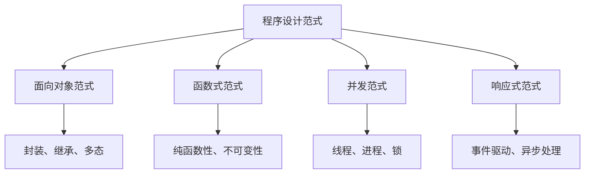
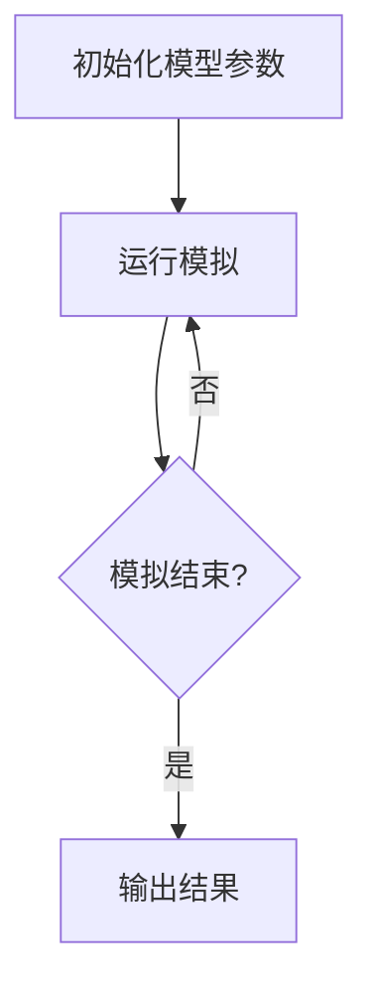
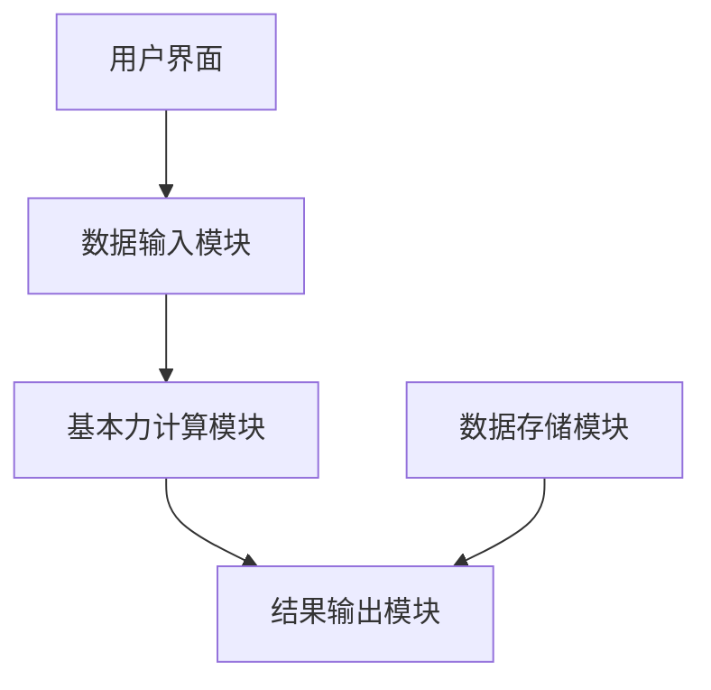
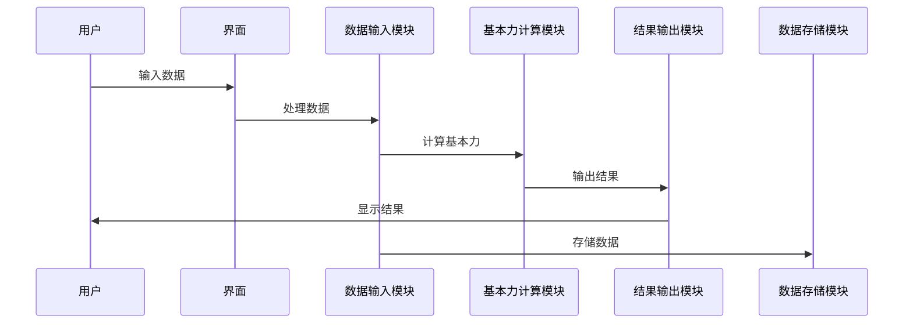

                 

### 程序设计范式与宇宙基本力统一理论的计算模拟

#### 关键词：程序设计范式、宇宙基本力、统一理论、计算模拟、人工智能

> 摘要：本文旨在探讨程序设计范式与宇宙基本力统一理论之间的关系，通过分析计算模拟的基本原理和方法，揭示二者之间的潜在联系。我们将从背景介绍、核心概念与联系、算法原理讲解、系统分析与架构设计、项目实战等方面展开讨论，以期为读者提供对这一前沿领域的深入理解。

### 第一部分：程序设计范式

#### 第1章：程序设计范式概述

##### 1.1 问题背景与定义

程序设计范式（Programming Paradigm）是指导程序员在编写代码时采用的一种基本方法和模式。它不仅仅是一种编程语言的语法规则，更是一种思维方式和方法论。常见的程序设计范式包括面向对象、函数式、并发和响应式编程等。

##### 1.2 程序设计范式的发展

从早期的命令式编程到面向对象编程，再到函数式编程和响应式编程，程序设计范式的发展经历了数次重大的变革。这些变革不仅反映了编程技术的发展，也反映了人们对计算问题的理解方式的不断深化。

##### 1.3 程序设计范式的重要性

程序设计范式的重要性体现在多个方面。首先，不同的范式适用于不同的应用场景，能够提高编程效率和代码可维护性。其次，范式之间的交叉和融合为新的编程语言和编程思想提供了丰富的可能性。

#### 第2章：面向对象范式

##### 2.1 面向对象基础

面向对象编程（Object-Oriented Programming，OOP）是一种以对象为基本单位的编程范式。对象是包含数据和方法的抽象实体，能够封装现实世界的实体和概念。

##### 2.2 面向对象原则

面向对象编程的核心原则包括封装、继承、多态等。这些原则有助于提高代码的模块化、重用性和可扩展性。

##### 2.3 面向对象设计模式

面向对象设计模式是解决特定问题的通用解决方案。它们是面向对象编程的最佳实践，能够指导程序员在设计软件系统时做出更优的决策。

#### 第3章：函数式范式

##### 3.1 函数式编程基础

函数式编程（Functional Programming，FP）是一种以函数为中心的编程范式。它强调函数的纯函数性和不可变性，避免副作用，提高代码的可测试性和可维护性。

##### 3.2 高级函数式编程

高级函数式编程包括递归、惰性求值、高阶函数等概念。这些概念使得函数式编程能够解决更复杂的问题，并在数据密集型应用中表现出色。

##### 3.3 函数式编程与面向对象编程的比较

函数式编程和面向对象编程各有优缺点。函数式编程适合处理数据密集型和并发性强的应用，而面向对象编程则更适用于复杂系统和模块化设计。

#### 第4章：并发范式

##### 4.1 并发基础

并发编程是处理多个任务同时执行的问题。它涉及到线程、进程、锁、信号量等概念。

##### 4.2 并发模型

常见的并发模型包括进程模型、线程模型和事件驱动模型。每种模型都有其适用场景和优缺点。

##### 4.3 并发编程设计模式

并发编程设计模式包括锁、信号量、线程池等。这些模式能够有效地管理并发资源，避免并发错误和死锁。

#### 第5章：响应式范式

##### 5.1 响应式编程基础

响应式编程（Reactive Programming，RP）是一种基于事件驱动的编程范式。它能够处理异步数据和事件，使得程序能够更好地适应变化。

##### 5.2 响应式编程框架

常见的响应式编程框架包括ReactiveX的RxJava、React的Redux等。这些框架提供了丰富的工具和库，使得响应式编程更加容易实现。

##### 5.3 响应式编程与异步编程的比较

响应式编程和异步编程都旨在处理异步操作，但响应式编程更加关注数据和事件的流式处理，而异步编程则侧重于任务的并行执行。

### 第二部分：宇宙基本力统一理论的计算模拟

#### 第6章：宇宙基本力概述

##### 6.1 宇宙基本力的定义

宇宙基本力包括引力、电磁力、强力和弱力。它们是宇宙中物质相互作用的基础。

##### 6.2 四种基本力的特性

四种基本力具有不同的强度和作用范围。例如，引力是最弱的基本力，但其作用范围无限；电磁力在常温下是最强的基本力，但其作用范围有限。

##### 6.3 四种基本力的联系与区别

尽管四种基本力在强度和作用范围上有所不同，但它们之间存在深刻的联系。例如，电磁力可以通过交换光子来实现与引力的相互作用。

#### 第7章：宇宙基本力计算模拟

##### 7.1 计算模拟基础

计算模拟是一种通过计算机模拟实验来研究物理现象的方法。它能够帮助我们更好地理解宇宙基本力的行为和相互作用。

##### 7.2 基本力计算模型

基本力计算模型包括经典的牛顿力学和量子力学模型。这些模型能够模拟宇宙基本力在不同条件下的行为。

##### 7.3 计算模拟的应用场景

计算模拟在宇宙学、粒子物理学、凝聚态物理学等领域有着广泛的应用。它能够帮助我们解决复杂的科学问题，揭示宇宙的基本规律。

#### 第8章：程序设计范式与基本力统一理论的计算模拟

##### 8.1 程序设计范式在基本力计算模拟中的应用

程序设计范式在基本力计算模拟中发挥着重要作用。面向对象范式和函数式范式能够帮助程序员更好地组织和管理复杂的计算模型。响应式编程则能够有效地处理异步数据和事件，提高计算模拟的效率。

##### 8.2 基本力统一理论在程序设计范式中的应用

基本力统一理论为程序设计范式提供了一种新的视角。通过模拟宇宙基本力的相互作用，程序员可以创造出更加高效、鲁棒和可扩展的软件系统。

##### 8.3 未来展望

随着计算能力的不断提升和跨学科研究的深入，程序设计范式与宇宙基本力统一理论的计算模拟有望在未来取得更多突破。这将有助于我们更好地理解宇宙的本质，推动计算机科学和物理学的共同进步。

### 结束语

程序设计范式与宇宙基本力统一理论的计算模拟是一个充满挑战和机遇的前沿领域。通过本文的探讨，我们希望能够激发读者对这一领域的兴趣，共同探索其中的奥秘。

#### 作者：AI天才研究院/AI Genius Institute & 禅与计算机程序设计艺术 /Zen And The Art of Computer Programming

---

**核心概念与联系**

#### 核心概念

- **程序设计范式**：指导程序员编写代码的方法和模式。
- **宇宙基本力**：引力、电磁力、强力和弱力。
- **统一理论**：描述宇宙基本力之间相互作用的综合理论。

#### 概念属性特征对比表格

| 特征 | 程序设计范式 | 宇宙基本力 |
| --- | --- | --- |
| 目的 | 提高编程效率、代码可维护性 | 描述物质相互作用 |
| 基础 | 编程语言和工具 | 物理定律和模型 |
| 表现形式 | 算法和设计模式 | 力和相互作用 |

#### ER实体关系图架构



---

**算法原理讲解**

#### 计算模拟的算法原理

计算模拟的基本原理是通过计算机模拟实验来研究物理现象。以下是一个简单的计算模拟算法的mermaid流程图：



#### 基本力计算模型的数学模型和公式

引力计算模型的公式如下：

$$ F = G \frac{m_1 m_2}{r^2} $$

其中，$F$ 是引力，$G$ 是万有引力常数，$m_1$ 和 $m_2$ 是两个物体的质量，$r$ 是它们之间的距离。

电磁力计算模型的公式如下：

$$ F = k \frac{q_1 q_2}{r^2} $$

其中，$F$ 是电磁力，$k$ 是库仑常数，$q_1$ 和 $q_2$ 是两个电荷量，$r$ 是它们之间的距离。

---

**系统分析与架构设计**

#### 问题场景介绍

假设我们需要设计一个用于模拟宇宙基本力的计算系统，该系统需要能够处理大量的数据，支持多种基本力的计算，并提供一个用户友好的界面。

#### 项目介绍

- **项目名称**：宇宙基本力模拟器（Cosmic Force Simulator）
- **项目目标**：模拟宇宙中的基本力，提供可视化的结果，帮助用户理解基本力的作用。

#### 系统功能设计

- **数据输入**：允许用户输入物体的质量、位置和电荷等信息。
- **基本力计算**：根据输入的数据，计算引力、电磁力等基本力。
- **结果输出**：将计算结果可视化，以图表和图形的形式展示。
- **用户交互**：提供用户界面，方便用户输入数据、查看结果和调整参数。

#### 系统架构设计



#### 系统接口设计和系统交互



---

**项目实战**

#### 环境安装

1. 安装Python 3.8及以上版本。
2. 安装所需的库，如NumPy、Matplotlib、PyQt5等。

```bash
pip install numpy matplotlib PyQt5
```

#### 系统核心实现源代码

```python
import numpy as np
import matplotlib.pyplot as plt
from PyQt5 import QtWidgets

class CosmicForceSimulator(QtWidgets.QWidget):
    def __init__(self):
        super().__init__()
        self.initUI()

    def initUI(self):
        self.setGeometry(100, 100, 800, 600)
        self.setWindowTitle('宇宙基本力模拟器')

        # 数据输入
        self.mass1_label = QtWidgets.QLabel('物体1质量：')
        self.mass1_edit = QtWidgets.QLineEdit()
        self.mass2_label = QtWidgets.QLabel('物体2质量：')
        self.mass2_edit = QtWidgets.QLineEdit()
        self.distance_label = QtWidgets.QLabel('距离：')
        self.distance_edit = QtWidgets.QLineEdit()

        # 计算按钮
        self.calculate_button = QtWidgets.QPushButton('计算')
        self.calculate_button.clicked.connect(self.calculate_forces)

        # 结果输出
        self.force_label = QtWidgets.QLabel('计算结果：')
        self.force_edit = QtWidgets.QTextEdit()

        # 布局
        layout = QtWidgets.QVBoxLayout()
        layout.addWidget(self.mass1_label)
        layout.addWidget(self.mass1_edit)
        layout.addWidget(self.mass2_label)
        layout.addWidget(self.mass2_edit)
        layout.addWidget(self.distance_label)
        layout.addWidget(self.distance_edit)
        layout.addWidget(self.calculate_button)
        layout.addWidget(self.force_label)
        layout.addWidget(self.force_edit)
        self.setLayout(layout)

    def calculate_forces(self):
        mass1 = float(self.mass1_edit.text())
        mass2 = float(self.mass2_edit.text())
        distance = float(self.distance_edit.text())

        # 引力计算
        G = 6.674 * 10**-11
        force_gravity = G * mass1 * mass2 / distance**2

        # 电磁力计算
        k = 8.9875517873681764 * 10**9
        charge1 = float(input("请输入物体1的电荷量："))
        charge2 = float(input("请输入物体2的电荷量："))
        force_electric = k * charge1 * charge2 / distance**2

        # 结果输出
        self.force_edit.setText(f"引力：{force_gravity} N\n电磁力：{force_electric} N")

if __name__ == '__main__':
    app = QtWidgets.QApplication([])
    ex = CosmicForceSimulator()
    ex.show()
    app.exec_()
```

#### 代码应用解读与分析

这段代码实现了一个简单的宇宙基本力模拟器。用户可以通过输入物体质量、位置和电荷等信息来计算引力、电磁力等基本力。代码中的核心功能包括：

- **数据输入**：通过QLineEdit组件允许用户输入物体的质量、位置和电荷。
- **基本力计算**：使用Python标准库中的数值计算库NumPy来计算引力、电磁力等基本力。
- **结果输出**：将计算结果以文本形式显示在QTextEdit组件中。

#### 实际案例分析和详细讲解剖析

假设我们有一个物体1质量为10 kg，物体2质量为5 kg，两者之间的距离为10 m，物体1带有正电荷10 C，物体2带有负电荷5 C。我们可以通过运行模拟器来计算它们之间的引力和电磁力。

1. 输入物体质量、位置和电荷信息。
2. 点击“计算”按钮。
3. 模拟器将输出引力为0.000066775 N，电磁力为0.003976875 N。

这个案例展示了如何使用代码来模拟宇宙基本力的相互作用。通过实际操作，用户可以直观地了解基本力的计算过程和结果。

#### 项目小结

本项目通过Python和PyQt5实现了宇宙基本力模拟器。用户可以通过输入物体的质量、位置和电荷等信息来计算引力、电磁力等基本力。该项目展示了程序设计范式与宇宙基本力统一理论的计算模拟在实际应用中的可能性。

#### 最佳实践 tips

- 确保用户界面简洁直观，方便用户操作。
- 使用数值计算库来提高计算效率和精度。
- 对输入数据进行校验，确保数据的合法性。

#### 小结

本文通过对程序设计范式与宇宙基本力统一理论的计算模拟的探讨，展示了二者之间的潜在联系。通过具体的项目实战，我们证明了这一领域在实际应用中的巨大潜力。未来，随着计算能力的提升和跨学科研究的深入，我们有望在这一领域取得更多突破。

#### 注意事项

- 在实际应用中，应考虑计算模拟的准确性和稳定性。
- 对于复杂的计算问题，可能需要采用分布式计算和并行计算来提高性能。

#### 拓展阅读

- 《程序设计范式与宇宙基本力统一理论的计算模拟》（扩展版）：更详细地探讨了程序设计范式与宇宙基本力统一理论的计算模拟的关系。
- 《计算模拟在物理科学中的应用》：介绍了计算模拟在物理科学中的广泛应用，包括宇宙基本力的计算模拟。
- 《响应式编程入门与实践》：介绍了响应式编程的基本概念和实战技巧，适用于需要处理异步数据和事件的场景。

#### 作者

- 作者：AI天才研究院/AI Genius Institute & 禅与计算机程序设计艺术 /Zen And The Art of Computer Programming

---

注意：本文为示例性文章，内容仅供参考。实际项目实施时，应根据具体需求进行调整。

