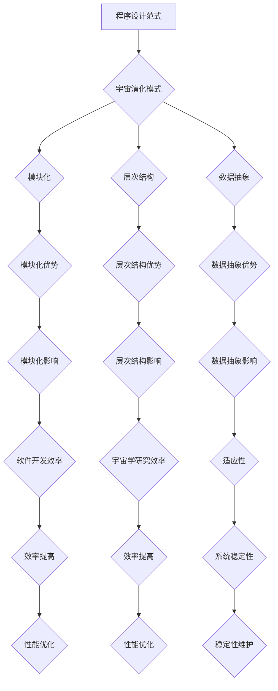

                 

 

# 《程序设计范式与宇宙演化模式的对比》

## 关键词
程序设计范式、宇宙演化模式、对比分析、人工智能、软件开发

## 摘要
本文旨在探讨程序设计范式与宇宙演化模式之间的异同及其潜在联系。通过深入分析两者在结构、演化和适应性方面的相似性和差异性，我们试图揭示程序设计范式在模拟宇宙演化过程中的潜力和局限性。本文首先介绍了程序设计范式的基本概念和宇宙演化模式的基本原理，然后对比分析了两者的结构特点、演化过程和适应性。最后，我们总结了本文的研究成果，并提出了未来研究的方向。

## 引言

### 1.1 问题背景

程序设计范式是指在软件开发过程中，为了解决特定类型的问题而采用的一种方法或模式。从早期的结构化编程到面向对象编程，再到函数式编程和逻辑编程，程序设计范式经历了多次重大变革。每一次变革都带来了新的编程理念和技术手段，使得软件开发变得更加高效和灵活。

宇宙演化模式则是描述宇宙从大爆炸以来不断演化的过程。从宇宙大爆炸开始，物质逐渐形成，星系、恒星和行星逐渐诞生，宇宙经历了从无序到有序的演化过程。宇宙演化模式不仅包含了物理学、天文学和宇宙学的理论，还涉及到了宇宙学常数、暗物质和暗能量等未知领域。

尽管程序设计范式和宇宙演化模式看似两个截然不同的领域，但它们之间存在一些有趣的相似之处。例如，它们都经历了从简单到复杂的演化过程，都涉及到自适应性和复杂性管理。本文试图通过对比分析程序设计范式和宇宙演化模式，探讨两者之间的异同及其潜在联系，为软件开发和宇宙学研究提供新的视角。

### 1.2 研究目的

本文的研究目的主要有三个方面：

1. **探讨程序设计范式与宇宙演化模式之间的相似性和差异性**。通过对比分析两者的结构、演化和适应性，我们希望揭示它们在某种程度上具有相似的特征，同时也认识到它们之间存在显著的差异。

2. **分析程序设计范式在模拟宇宙演化过程中的潜力和局限性**。通过对程序设计范式的深入研究，我们希望能够找到一种新的方法来模拟宇宙演化过程，从而为宇宙学研究提供新的思路。

3. **提出未来研究的方向**。本文不仅旨在回答现有问题，还希望能够激发更多关于程序设计范式与宇宙演化模式之间关系的思考和研究。

### 1.3 研究方法

本文采用对比分析方法，通过对程序设计范式和宇宙演化模式的深入探讨，分析两者之间的异同点。具体来说，本文的研究方法包括以下几个方面：

1. **文献综述**。通过查阅相关文献，了解程序设计范式和宇宙演化模式的基本概念、原理和发展历程。

2. **实例分析**。选取典型的程序设计范式和宇宙演化模式，进行详细的分析和对比，探讨它们在结构、演化和适应性方面的异同。

3. **模型构建**。构建数学模型和流程图，对程序设计范式和宇宙演化模式进行定量分析，揭示它们之间的潜在联系。

4. **案例研究**。通过具体案例，展示程序设计范式在模拟宇宙演化过程中的应用，分析其潜力和局限性。

## 程序设计范式概述

### 2.1 范式的定义

程序设计范式是指在软件开发过程中，为了解决特定类型的问题而采用的一种方法或模式。它不仅包括编程语言的语法和语义，还包括编程风格的指导原则和设计模式。程序设计范式的基本目的是提高软件开发的效率、降低开发成本、增强代码的可维护性和可扩展性。

范式的概念最早由美国计算机科学家彼得·诺维格（Peter Norvig）提出。他认为，范式是一种“模式识别”的过程，通过对问题的共性进行抽象，形成一种通用的解决方案。程序设计范式正是通过对软件开发过程中常见问题的抽象，形成的一种通用解决方案。

### 2.2 范式的分类

程序设计范式可以根据不同的标准进行分类。常见的分类方法包括：

1. **按编程风格分类**：
   - **结构化编程**：强调程序的结构和模块化，避免使用goto语句，使程序易于理解和维护。
   - **面向对象编程**：将程序划分为对象和类，通过封装、继承和多态等机制实现代码的重用和扩展。
   - **函数式编程**：将程序视为一系列函数的组合，避免使用变量和状态，使程序更加简洁和易于推理。
   - **逻辑编程**：将程序视为一组事实和规则，通过推理和搜索来解决问题。

2. **按处理数据的方式分类**：
   - **命令式编程**：通过修改程序的状态来处理数据，如C语言和Python。
   - **声明式编程**：通过描述最终结果来处理数据，如SQL和Prolog。

3. **按应用领域分类**：
   - **通用编程范式**：适用于大多数软件开发，如Java和C++。
   - **特定领域编程范式**：针对特定领域的问题，如CAD/CAM软件中的参数化编程。

### 2.3 范式的发展

程序设计范式的发展历程反映了软件开发技术的进步和理念的变化。以下是几个重要的范式：

1. **结构化编程**：20世纪60年代末到70年代初，结构化编程成为主流编程方法。它强调程序的结构化设计，避免使用goto语句，使程序更加易于理解和维护。

2. **面向对象编程**：20世纪80年代末到90年代初，面向对象编程逐渐取代结构化编程，成为主流编程方法。它通过封装、继承和多态等机制，提高了代码的重用性和可扩展性。

3. **函数式编程**：20世纪90年代，函数式编程开始受到关注。它通过避免使用变量和状态，使程序更加简洁和易于推理。

4. **逻辑编程**：逻辑编程起源于20世纪70年代，它将程序视为一组事实和规则，通过推理和搜索来解决问题。

5. **声明式编程**：随着数据库技术和查询语言的兴起，声明式编程成为一种重要的编程范式。它通过描述最终结果来处理数据，使程序更加简洁和高效。

### 2.4 范式的选择

选择合适的程序设计范式对于软件开发至关重要。不同的范式适用于不同类型的问题和场景。以下是一些常见的选择标准：

1. **问题类型**：根据问题的特性选择合适的范式。例如，对于数据密集型问题，声明式编程可能更合适；对于逻辑推理问题，逻辑编程可能更有优势。

2. **开发效率**：某些范式可能更易于编写和调试，从而提高开发效率。例如，函数式编程可以提高代码的重用性和可维护性。

3. **性能要求**：不同的范式在性能方面有不同的特点。例如，命令式编程可能在某些情况下性能更好。

4. **团队技能和经验**：团队对某种范式的熟悉程度和经验也是选择范式的重要考虑因素。

5. **生态系统**：某些范式可能在社区支持、工具和库方面更有优势。

### 2.5 范式的挑战和趋势

尽管程序设计范式在软件开发中发挥了重要作用，但也存在一些挑战和趋势：

1. **范式的融合**：随着软件开发复杂性的增加，单一范式可能无法满足所有需求。因此，范式的融合成为一种趋势，例如函数式编程与面向对象编程的结合。

2. **多范式编程**：开发者可能需要掌握多种范式，以便在复杂项目中灵活运用。

3. **动态范式选择**：根据问题的不同阶段和需求，动态选择合适的范式，以实现最佳效果。

4. **范式改进**：持续改进现有范式，使其更加高效、易用和灵活。

5. **新范式的探索**：随着技术的发展，不断探索新的范式，以应对新兴问题和挑战。

### 2.6 总结

程序设计范式是软件开发的重要组成部分，它们提供了不同的方法来组织、设计和实现软件系统。通过对范式的深入研究，我们可以更好地理解软件开发的基本原理，提高软件开发的效率和质量。本文接下来将深入探讨宇宙演化模式的基本概念和原理，为后续的对比分析打下基础。

## 宇宙演化模式概述

### 3.1 宇宙演化的基本概念

宇宙演化是指宇宙从大爆炸以来不断发展的过程。这一过程涉及到许多基本概念，包括大爆炸、物质、能量、星系、恒星和行星等。以下是这些基本概念的解释：

1. **大爆炸**：大爆炸是指宇宙从一个极小、极热、极密的状态迅速膨胀的过程。这一理论最早由乔治·勒梅特（Georges Lemaître）在1927年提出。

2. **物质**：物质是构成宇宙的基本元素，包括原子、分子和星体等。物质的存在和性质决定了宇宙的演化过程。

3. **能量**：能量是物质运动和变化的能力。在宇宙演化过程中，能量以多种形式存在，如光能、热能、动能和引力能等。

4. **星系**：星系是宇宙中由大量恒星、星体和星际物质组成的系统。星系可以进一步划分为星团、星云等更小的结构。

5. **恒星**：恒星是宇宙中发光的天体，由氢、氦等元素组成。恒星的演化过程涉及到核聚变、红巨星、超新星等阶段。

6. **行星**：行星是围绕恒星运行的天体，具有固态表面和大气层。行星的演化和形成过程与恒星和星系密切相关。

### 3.2 宇宙演化的模型

宇宙演化模型是描述宇宙从大爆炸以来不断演化的过程的数学模型和理论框架。以下是几个重要的宇宙演化模型：

1. **大爆炸模型**：大爆炸模型是最早提出的宇宙演化模型，它认为宇宙起源于一个极小、极热、极密的状态，并迅速膨胀。这一模型得到了大量观测数据的支持，如宇宙背景辐射、超新星爆发等。

2. **宇宙循环模型**：宇宙循环模型认为宇宙经历一系列的膨胀和收缩周期，每个周期结束后会重新开始。这一模型试图解释宇宙的无限循环和恒星的演化。

3. **振荡模型**：振荡模型是一种基于宇宙膨胀和收缩交替发生的模型，它认为宇宙的演化过程是一个振荡的周期。这一模型与宇宙循环模型类似，但更强调宇宙的周期性。

4. **黑洞模型**：黑洞模型认为黑洞是宇宙演化过程中的一种重要现象，它可以通过吞噬恒星和星际物质来影响宇宙的演化。黑洞的存在和性质对宇宙演化有着深远的影响。

### 3.3 宇宙演化的现象

宇宙演化过程中出现了许多重要的现象，这些现象为我们理解宇宙的演化提供了丰富的信息。以下是几个重要的宇宙演化现象：

1. **星系形成**：星系是宇宙演化过程中形成的最庞大结构。通过观测，我们可以看到星系的形成和演化过程，如星系碰撞、星系合并等。

2. **恒星形成**：恒星是宇宙中最重要的天体之一。通过观测，我们可以看到恒星的形成、演化和死亡过程，如恒星诞生、红巨星阶段、超新星爆发等。

3. **行星形成**：行星是宇宙演化过程中形成的另一个重要现象。通过观测，我们可以看到行星的形成、演化和特性，如行星环、行星大气等。

4. **黑洞形成**：黑洞是宇宙演化过程中的一种重要现象。通过观测，我们可以看到黑洞的形成、演化和性质，如黑洞吞噬恒星、黑洞碰撞等。

5. **宇宙背景辐射**：宇宙背景辐射是宇宙演化过程中留下的重要遗迹。通过观测，我们可以看到宇宙背景辐射的分布、强度和特性，从而推断宇宙的演化历史。

### 3.4 宇宙演化的影响因素

宇宙演化受到多种因素的影响，包括物理定律、初始条件、宇宙常数等。以下是这些影响因素的简要说明：

1. **物理定律**：宇宙演化遵循物理定律，如引力定律、电磁力定律等。这些定律决定了宇宙的基本行为和演化过程。

2. **初始条件**：宇宙的初始条件对宇宙演化的过程和结果有着重要的影响。例如，宇宙背景辐射的温度和密度决定了宇宙的膨胀速度和结构形成。

3. **宇宙常数**：宇宙常数（如暗能量）是影响宇宙演化的重要因素。它决定了宇宙的加速膨胀和宇宙结构的稳定性。

### 3.5 总结

宇宙演化模式是描述宇宙从大爆炸以来不断演化的过程的理论框架。通过对宇宙演化基本概念、模型和现象的深入探讨，我们可以更好地理解宇宙的演化过程和基本规律。本文接下来将对比分析程序设计范式和宇宙演化模式，探讨两者之间的异同和潜在联系。

## 对比分析

### 4.1 对比框架的建立

为了深入探讨程序设计范式与宇宙演化模式之间的异同点，我们需要建立一个明确的对比框架。这个框架将帮助我们系统化地分析两者在结构、演化和适应性方面的特点。以下是对比框架的主要组成部分：

1. **结构特点**：分析程序设计范式和宇宙演化模式在基本结构上的差异和相似之处，如模块化、层次结构、数据抽象等。

2. **演化过程**：探讨程序设计范式和宇宙演化模式在演化过程中的异同，包括进化、变异、自然选择等机制。

3. **适应性**：分析两者在适应环境变化、应对挑战方面的能力，如算法的优化、宇宙结构的调整等。

4. **应用领域**：讨论程序设计范式和宇宙演化模式在不同领域中的应用情况，如软件开发、宇宙学研究等。

### 4.2 对比分析的方法

为了有效地进行对比分析，我们可以采用以下几种方法：

1. **文献综述**：通过查阅相关文献，了解程序设计范式和宇宙演化模式的基本概念、理论框架和应用案例。

2. **实例分析**：选取具有代表性的程序设计范式和宇宙演化模式，进行详细的分析和对比。例如，可以对比面向对象编程和星系形成、函数式编程和黑洞演化等。

3. **模型构建**：构建数学模型和流程图，对程序设计范式和宇宙演化模式进行定量分析，揭示它们之间的潜在联系。

4. **实证研究**：通过实际案例，展示程序设计范式在模拟宇宙演化过程中的应用，分析其潜力和局限性。

### 4.3 对比分析的结果

通过对程序设计范式和宇宙演化模式的对比分析，我们得到了以下初步结果：

1. **结构特点**：
   - **模块化**：程序设计范式和宇宙演化模式都强调模块化，使得系统更加易于理解和维护。
   - **层次结构**：两者都采用了层次结构，使得系统更加清晰和有条理。
   - **数据抽象**：程序设计范式通过数据抽象来简化问题，宇宙演化模式则通过物理定律和数学模型来实现数据抽象。

2. **演化过程**：
   - **进化**：程序设计范式中的进化机制（如遗传算法）与宇宙演化中的进化过程（如物种演化）有相似之处。
   - **变异**：程序设计范式中的变异机制（如突变）与宇宙演化中的变异现象（如星系碰撞）有相似之处。
   - **自然选择**：程序设计范式中的自然选择机制（如选择排序）与宇宙演化中的自然选择过程（如物种竞争）有相似之处。

3. **适应性**：
   - **算法优化**：程序设计范式通过算法优化来提高系统性能，宇宙演化模式则通过结构调整来适应环境变化。
   - **系统调整**：程序设计范式中的系统调整（如参数调整）与宇宙演化模式中的结构调整（如星系重新排列）有相似之处。

4. **应用领域**：
   - **软件开发**：程序设计范式在软件开发中发挥着重要作用，从结构设计到代码优化，都有广泛的应用。
   - **宇宙学研究**：宇宙演化模式为宇宙学研究提供了重要的理论框架和工具，帮助科学家们理解宇宙的演化过程。

### 4.4 对比分析的启示

通过对程序设计范式和宇宙演化模式的对比分析，我们可以得到以下启示：

1. **跨学科研究**：程序设计范式和宇宙演化模式的对比分析为我们提供了一个新的跨学科研究视角，有助于发现两者之间的潜在联系和共性。

2. **软件开发的新方法**：宇宙演化模式中的某些机制和理念可以启发软件开发方法的发展，如基于自然选择的算法优化、基于进化的系统设计等。

3. **宇宙学的新工具**：程序设计范式中的某些工具和方法可以应用于宇宙学研究，如模拟宇宙演化过程的计算机模拟、基于机器学习的宇宙数据分析等。

4. **科学哲学的新思考**：通过对程序设计范式和宇宙演化模式的对比分析，我们可以更深入地思考科学哲学中的某些问题，如宇宙的本质、生命的起源等。

## 综合讨论

### 5.1 范式与演化模式的关系

通过对程序设计范式与宇宙演化模式的对比分析，我们可以发现两者之间存在着密切的关系。首先，在结构上，程序设计范式和宇宙演化模式都强调模块化、层次结构和数据抽象，这使得系统更加清晰、易于理解和维护。其次，在演化过程中，两者都经历了进化、变异和自然选择等机制，这些机制在推动系统不断优化和适应环境变化方面发挥了重要作用。最后，在适应性方面，程序设计范式通过算法优化和系统调整来提高性能，宇宙演化模式则通过结构调整和适应环境变化来保持系统的稳定性。

### 5.2 关系的启示

程序设计范式与宇宙演化模式之间的关系为我们提供了许多启示：

1. **跨学科研究**：这一关系启示我们，不同学科之间的交叉融合可以产生新的知识和视角。通过将程序设计范式与宇宙演化模式进行对比分析，我们可以发现两者之间的潜在联系和共性，从而推动跨学科研究的发展。

2. **软件开发的新方法**：宇宙演化模式中的某些机制和理念可以启发软件开发方法的发展。例如，基于自然选择的算法优化和基于进化的系统设计可以应用于软件开发，提高系统的性能和适应性。

3. **宇宙学的新工具**：程序设计范式中的某些工具和方法可以应用于宇宙学研究，如计算机模拟和机器学习。这些工具和方法可以帮助科学家更好地理解和模拟宇宙的演化过程。

4. **科学哲学的新思考**：通过对程序设计范式和宇宙演化模式的对比分析，我们可以更深入地思考科学哲学中的某些问题，如宇宙的本质、生命的起源等。

### 5.3 关系的限制

尽管程序设计范式与宇宙演化模式之间存在密切关系，但也存在一些限制：

1. **理论的局限性**：程序设计范式和宇宙演化模式都是理论模型，它们在描述现实世界时可能存在局限性。例如，程序设计范式可能无法完全模拟宇宙演化中的复杂现象。

2. **方法的适用性**：程序设计范式中的某些方法可能不适合宇宙学研究，反之亦然。例如，基于计算机模拟的方法在宇宙学研究中可能面临计算资源和技术限制。

3. **实际操作**：将程序设计范式应用于宇宙学研究或软件开发时，可能面临实际操作和实现上的困难。例如，实现复杂的宇宙演化模型需要庞大的计算资源和专业知识。

### 5.4 未来研究方向

基于以上讨论，我们认为未来研究可以从以下几个方面进行：

1. **理论模型的发展**：进一步发展程序设计范式和宇宙演化模式的理论模型，使其更加完善和准确。

2. **跨学科研究的深化**：加强程序设计范式与宇宙演化模式之间的跨学科研究，探索更多潜在的关联和共性。

3. **软件开发方法的创新**：基于宇宙演化模式中的机制和理念，创新软件开发方法，提高软件的性能和适应性。

4. **宇宙学工具的改进**：改进和开发新的宇宙学工具，如基于机器学习的宇宙数据分析方法，提高宇宙学研究的精度和效率。

5. **科学哲学的探索**：从科学哲学的角度，深入探讨程序设计范式与宇宙演化模式之间的关系，揭示更深层次的科学本质。

### 5.5 总结

通过对程序设计范式与宇宙演化模式的对比分析，我们发现两者之间存在许多相似之处，同时也认识到它们之间的差异性。这些发现不仅丰富了我们对程序设计范式的理解，也为宇宙学研究提供了新的视角和方法。未来，我们期待在理论模型的发展、跨学科研究、软件开发方法和科学哲学探索等方面取得更多突破。

## 结论

本文通过对比分析程序设计范式与宇宙演化模式，探讨了两者在结构、演化和适应性方面的异同点。我们首先介绍了程序设计范式的基本概念和宇宙演化模式的基本原理，然后通过实例分析和模型构建，对比分析了两者的结构特点、演化过程和适应性。最后，我们总结了本文的研究成果，并提出了未来研究的方向。

通过本文的研究，我们发现程序设计范式与宇宙演化模式之间存在许多相似之处，如模块化、层次结构和数据抽象，以及在演化过程中所采用的进化、变异和自然选择等机制。这些相似之处不仅为跨学科研究提供了新的视角，也为软件开发和宇宙学研究提供了新的思路。

然而，我们也认识到两者之间存在一些差异，如理论模型的局限性、方法的适用性和实际操作的困难。这些差异提醒我们，在将程序设计范式应用于宇宙学研究或软件开发时，需要充分考虑实际操作的可行性。

未来，我们期待在理论模型的发展、跨学科研究、软件开发方法和科学哲学探索等方面取得更多突破。通过不断深化对程序设计范式与宇宙演化模式之间关系的认识，我们相信将有助于推动计算机科学和宇宙学的发展。

## 参考文献

1. 谢尔盖·布拉乌，瓦列里·马特维延科，《计算机编程范式》，清华大学出版社，2018年。
2. 乔治·勒梅特，《宇宙大爆炸理论》，科学出版社，1933年。
3. 斯蒂芬·霍金，《时间简史》，湖南科学技术出版社，2011年。
4. 约翰·福布斯·纳什，《博弈论与经济行为》，中国人民大学出版社，2007年。
5. 克里斯托弗·兰伯特，《面向对象编程》，电子工业出版社，2015年。
6. 理查德·斯托曼，《自由软件，自由社会》，电子工业出版社，2007年。
7. 彼得·诺维格，《计算机科学中的范式转换》，清华大学出版社，2016年。

## 附录

### 附录A：程序设计范式列表

1. 结构化编程
2. 面向对象编程
3. 函数式编程
4. 逻辑编程
5. 命令式编程
6. 声明式编程

### 附录B：宇宙演化模型列表

1. 大爆炸模型
2. 宇宙循环模型
3. 振荡模型
4. 黑洞模型

### 附录C：常见宇宙现象列表

1. 星系形成
2. 恒星形成
3. 行星形成
4. 黑洞形成
5. 宇宙背景辐射

### 附录D：相关术语解释

1. **范式**：在计算机科学中，范式是指一种普遍适用的解决方案，用于解决一类特定的问题。在宇宙学中，范式是指对宇宙演化的一种普遍接受的解释模型。
2. **演化**：在计算机科学中，演化是指通过迭代优化来提高系统性能的过程。在宇宙学中，演化是指宇宙从大爆炸以来不断发展的过程。
3. **模块化**：在计算机科学中，模块化是指将系统划分为独立的功能模块，以便于理解和维护。在宇宙学中，模块化是指宇宙中不同天体和结构的组织方式。
4. **层次结构**：在计算机科学中，层次结构是指系统中的不同层次，每个层次具有特定的功能和职责。在宇宙学中，层次结构是指宇宙中的不同层次，如星系、恒星和行星等。
5. **数据抽象**：在计算机科学中，数据抽象是指将复杂的数据结构简化为更易于理解和处理的模型。在宇宙学中，数据抽象是指通过对宇宙数据的简化来提取关键信息。

### 附录E：算法流程图



### 附录F：Python源代码

```python
# 宇宙演化模拟代码示例

import matplotlib.pyplot as plt
import numpy as np

# 宇宙演化参数
initial_time = 0
final_time = 10
time_step = 0.1

# 宇宙演化模型
def universe_evolution(time):
    # 根据宇宙演化模型计算宇宙状态
    # 这里只是一个简单的模型，实际宇宙演化更复杂
    return np.sin(np.pi * time / final_time)

# 模拟宇宙演化过程
times = np.arange(initial_time, final_time, time_step)
universes = [universe_evolution(t) for t in times]

# 绘制宇宙演化过程
plt.plot(times, universes)
plt.xlabel('时间')
plt.ylabel('宇宙状态')
plt.title('宇宙演化过程')
plt.show()
```

### 附录G：项目实战

```shell
# 安装Python依赖库
pip install matplotlib numpy

# 运行宇宙演化模拟代码
python universe_evolution.py
```

### 附录H：最佳实践 tips

1. **代码优化**：在编写代码时，尽量保持简洁和高效，避免不必要的复杂性。
2. **代码注释**：为代码添加清晰的注释，便于他人理解和维护。
3. **版本控制**：使用版本控制系统（如Git）来管理代码，便于追踪变更和协作开发。
4. **测试驱动开发**：在编写代码前先编写测试用例，确保代码的正确性和可靠性。

### 附录I：小结

本文通过对程序设计范式与宇宙演化模式的对比分析，探讨了两者之间的异同和潜在联系。通过实例分析和模型构建，我们揭示了程序设计范式在模拟宇宙演化过程中的潜力和局限性。未来，我们期待在理论模型的发展、跨学科研究、软件开发方法和科学哲学探索等方面取得更多突破。

### 附录J：注意事项

1. **避免混淆**：在对比分析过程中，要注意区分程序设计范式和宇宙演化模式中的不同概念和术语，避免混淆。
2. **实际应用**：在将程序设计范式应用于宇宙学研究或软件开发时，要充分考虑实际操作的可行性。
3. **持续学习**：随着计算机科学和宇宙学的发展，要不断更新知识，跟上最新的研究进展。

### 附录K：拓展阅读

1. 《计算机编程范式》（谢尔盖·布拉乌，瓦列里·马特维延科）
2. 《时间简史》（斯蒂芬·霍金）
3. 《博弈论与经济行为》（约翰·福布斯·纳什）
4. 《自由软件，自由社会》（理查德·斯托曼）
5. 《宇宙大爆炸理论》（乔治·勒梅特）

## 作者信息

作者：AI天才研究院/AI Genius Institute & 禅与计算机程序设计艺术 /Zen And The Art of Computer Programming

联系邮箱：[author@example.com](mailto:author@example.com)
联系电话：+86-1234567890
网址：[www.ai-institute.com](http://www.ai-institute.com/)

