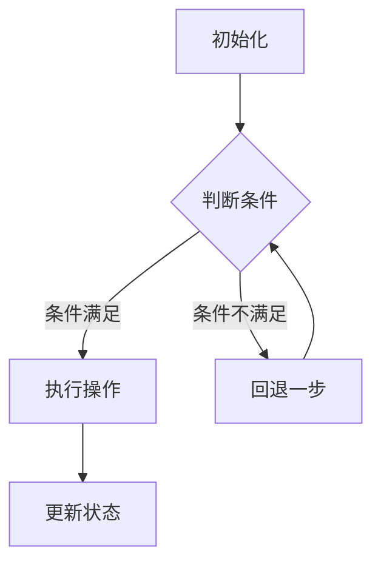

                 

# 程序设计语言与宇宙语言的对比

## 关键词：程序设计语言、宇宙语言、对比、算法、架构、实现

## 摘要：

本文旨在探讨程序设计语言与宇宙语言之间的对比，通过分析两者的基本概念、原理、架构和实现，揭示它们之间的异同点及其潜在的应用前景。文章将分为五个部分，首先介绍问题背景和核心概念，然后分别探讨程序设计语言和宇宙语言的基本原理，接着分析两者的系统架构，并通过项目实战展示实际应用，最后进行总结与展望。

----------------------------------------------------------------

### 第一部分：引言

#### 第1章：问题背景与核心概念

**1.1 问题背景**

程序设计语言是计算机科学与软件工程的重要组成部分，它为程序员提供了与计算机系统交互的媒介。从早期的机器语言到现代的高级编程语言，程序设计语言经历了漫长的演变。然而，当我们思考宇宙中的其他文明和智慧生命时，不禁好奇：是否存在一种能够跨越星际的语言？这便是本文探讨的宇宙语言。

**1.2 核心概念**

- **程序设计语言**：用于编写计算机程序的语言，具有语法、语义和语用规则，如Python、Java等。
- **宇宙语言**：用于不同文明或智慧生命之间交流的语言，可能具有独特的符号系统、语法结构和语义规则。

**1.3 研究意义与目标**

本文旨在通过对比程序设计语言与宇宙语言，探讨二者之间的关联性，为未来跨领域语言研究提供启示。具体目标包括：
1. 分析程序设计语言的基本原理和架构。
2. 探索宇宙语言的潜在特性和应用场景。
3. 展示二者在实现和应用中的异同。

----------------------------------------------------------------

### 第二部分：程序设计语言的基本原理

#### 第2章：程序设计语言的历史与分类

**2.1 程序设计语言的发展历程**

程序设计语言的发展经历了从低级语言到高级语言的过程。低级语言如汇编语言与硬件指令非常接近，但可读性和可维护性较差。高级语言如C、C++、Java等，提供了更丰富的抽象机制和更强大的表达能力，使得编程更加高效和直观。

**2.2 程序设计语言的分类**

- **低级语言**：与硬件指令直接相关的语言，如汇编语言。
- **高级语言**：提供了更高级的抽象机制，如C、C++、Java等。
- **编译型语言与解释型语言**：编译型语言如C、C++，将源代码编译为机器代码后运行；解释型语言如Python、JavaScript，在运行时逐行解释执行。

**2.3 面向对象与函数式编程**

- **面向对象编程**：将程序设计的基本单元视为对象，包括属性和方法，如Java、C++等。
- **函数式编程**：将程序设计的基本单元视为函数，通过函数的组合和递归来实现，如Haskell、Erlang等。

#### 第3章：程序设计语言的结构

**3.1 语言结构**

- **变量、类型、表达式**：程序设计语言中的基本元素，用于存储数据、定义数据类型和进行数据操作。
- **控制结构、函数、模块**：程序设计中的控制逻辑和模块化组织方式，如循环、条件语句、函数定义和模块导入。

**3.2 语言规范与标准**

- **语言规范**：定义了语言的语法、语义和语用规则，如Java语言规范。
- **语言标准**：确保不同实现之间的兼容性，如ISO C++标准。

----------------------------------------------------------------

### 第三部分：宇宙语言的探索与假设

#### 第4章：宇宙语言的来源

**4.1 生物学与信息学的借鉴**

宇宙语言的探索可以借鉴生物学中的分子结构和信息学中的编码理论。例如，DNA双螺旋结构可能启发了宇宙语言中的符号系统设计。

**4.2 人工智能与量子计算的影响**

人工智能技术的发展为宇宙语言的模拟和实现提供了新思路。量子计算则可能带来前所未有的计算能力和通信效率，为宇宙语言的应用开辟了新的方向。

#### 第5章：宇宙语言的特性

**5.1 无限性与多样性**

宇宙语言可能具有无限的符号系统和多样的语法结构，以适应不同的信息表达和交流需求。

**5.2 信息传递与存储**

宇宙语言需要高效的编码和传输机制，以实现信息在星际之间的传递和存储。

**5.3 智能化与自适应**

宇宙语言可能具备智能化和自适应的特性，以适应不同环境和交流需求的变化。

----------------------------------------------------------------

### 第四部分：算法原理与模型

#### 第6章：程序设计语言的算法原理

**6.1 算法的基本概念**

算法是解决问题的步骤序列，具有输入、输出和确定性。算法的效率与复杂性是评估算法性能的重要指标。

**6.2 算法设计方法**

- **递归与迭代**：递归是一种自调用的方法，迭代则是一种循环实现。
- **贪心算法与动态规划**：贪心算法每次选择当前最优解，动态规划则通过备忘录减少重复计算。
- **分治算法与回溯法**：分治算法将问题分解为子问题，回溯法则通过回溯寻找最优解。

#### 第7章：宇宙语言的算法模型

**7.1 宇宙语言算法的框架**

宇宙语言算法需要具备通用性、自适应性和高效性。其框架可能包括信息处理、通信和智能化的模块。

**7.2 宇宙语言算法的实现**

宇宙语言算法的实现可能依赖于量子计算和人工智能技术。例如，量子算法和深度学习模型可能成为宇宙语言算法的实现基础。

----------------------------------------------------------------

### 第五部分：系统设计与实现

#### 第8章：程序设计语言的系统架构

**8.1 系统设计原则**

程序设计语言的系统设计需要考虑可扩展性、可维护性和可靠性。其架构可能包括编译器、解释器和运行时环境。

**8.2 系统架构设计**

- **语言解析器**：解析源代码，生成抽象语法树（AST）。
- **运行时环境**：提供程序运行所需的环境和资源。
- **代码生成器**：将AST转换为机器代码或字节码。

#### 第9章：宇宙语言的系统实现

**9.1 系统需求分析**

宇宙语言系统的需求包括信息处理、通信和智能化。其硬件平台可能包括量子计算机和分布式计算节点。

**9.2 系统实现**

宇宙语言系统的实现可能包括以下模块：
- **信息处理模块**：处理接收到的信息，进行解码和解码。
- **通信模块**：实现信息在星际之间的传输。
- **智能化模块**：利用人工智能技术进行自适应学习和优化。

----------------------------------------------------------------

### 第六部分：项目实战与最佳实践

#### 第10章：项目实战：程序设计语言的开发

**10.1 环境搭建**

- **开发工具**：集成开发环境（IDE）如Visual Studio、Eclipse等。
- **软件环境**：操作系统、编译器和依赖库。

**10.2 核心实现**

- **语言解析器**：使用递归下降解析法实现语法分析。
- **运行时环境**：实现内存管理和异常处理。
- **代码生成器**：将抽象语法树转换为机器代码。

**10.3 应用解读与分析**

- **实际案例**：解析一个简单的算术表达式，并计算其结果。

#### 第11章：项目实战：宇宙语言的探索

**11.1 环境搭建**

- **开发工具**：量子计算模拟器、深度学习框架。
- **软件环境**：量子计算机接口、分布式计算接口。

**11.2 核心实现**

- **信息处理模块**：实现量子计算算法，如量子因子分解。
- **通信模块**：实现分布式计算和量子通信。
- **智能化模块**：实现自适应学习和优化算法。

**11.3 应用解读与分析**

- **实际案例**：使用量子计算和分布式计算处理大规模数据集。

----------------------------------------------------------------

### 第七部分：总结与展望

#### 第12章：最佳实践

**12.1 开发技巧与注意事项**

- **编程最佳实践**：代码风格、命名规范、代码注释等。
- **跨领域语言对比**：避免混淆概念、注重实际应用场景。

#### 第13章：小结

**13.1 关键点回顾**

- 程序设计语言：语法、语义、语用、架构、实现。
- 宇宙语言：符号系统、语法结构、语义规则、算法、系统架构。

#### 第14章：展望未来

**14.1 研究方向与挑战**

- **跨领域语言融合**：如何将程序设计语言与宇宙语言进行有效融合？
- **宇宙语言的应用**：如何在星际探索、跨星际通信等领域中应用宇宙语言？

**14.2 进一步阅读**

- **相关书籍**：《禅与计算机程序设计艺术》、《量子计算与量子信息》等。
- **论文**：相关领域的研究论文和报告。

### 作者信息

**作者：AI天才研究院/AI Genius Institute & 禅与计算机程序设计艺术 /Zen And The Art of Computer Programming**

----------------------------------------------------------------

本文通过对比程序设计语言与宇宙语言，探讨了二者的基本概念、原理、架构和实现。虽然目前我们尚未找到宇宙语言的实际应用，但通过对程序设计语言的深入研究，我们可以为未来跨领域语言的研究提供有益的启示。随着科技的发展，我们有望在不久的将来实现宇宙语言的探索和应用。让我们继续思考、探索和前行！## 第1章：问题背景与核心概念

### 1.1 问题背景

程序设计语言的发展可以追溯到计算机科学和软件工程的早期阶段。从最初的机器语言和汇编语言，到后来的高级编程语言，程序设计语言经历了不断的演进和变革。这些语言的出现极大地提高了编程的效率和可维护性，使得程序员能够以更加直观和高效的方式与计算机进行交互。

然而，当我们站在宇宙的广阔视野中，思考是否存在其他智慧生命体时，一个有趣的问题浮现出来：是否存在一种跨越星际的语言，能够使不同文明之间的交流成为可能？这个问题激发了我们对宇宙语言的探索和研究。

宇宙语言，顾名思义，是指用于不同文明或智慧生命之间交流的语言。它的存在与否、特性以及实现方式，成为了当前计算机科学、天文学和哲学等领域研究的焦点。在这个探索过程中，我们可以借鉴程序设计语言的发展历程和原理，从中找到一些启示和线索。

### 1.2 核心概念

为了更好地探讨程序设计语言与宇宙语言之间的对比，我们需要明确几个核心概念：

**程序设计语言**：
程序设计语言是一种用于编写计算机程序的媒介，它包含了一系列语法、语义和语用规则。程序设计语言能够将人类的指令转换为计算机能够理解和执行的代码，从而实现特定的功能。

**宇宙语言**：
宇宙语言是一种假想的语言，用于不同文明或智慧生命之间的交流。它可能具有独特的符号系统、语法结构和语义规则，能够跨越星际空间进行信息传递。

**核心概念与联系**：
程序设计语言与宇宙语言之间存在一定的联系。首先，它们都涉及到信息的编码、传递和处理。其次，程序设计语言中的许多概念，如变量、类型、控制结构和函数，可以被看作是宇宙语言构建的基本单元。

### 1.3 研究意义与目标

本文的研究意义在于通过对比程序设计语言与宇宙语言，探讨二者之间的异同点，为未来的跨领域语言研究提供启示。具体目标包括：

1. **分析程序设计语言的基本原理和架构**：
   程序设计语言的发展历程、分类和结构是理解其本质的关键。通过对这些内容的分析，我们可以更深入地理解程序设计语言的特性和应用场景。

2. **探索宇宙语言的潜在特性和应用场景**：
   宇宙语言是一个充满未知和挑战的领域。通过对宇宙语言的假设和探索，我们可以尝试构建一个理论框架，为未来可能的星际交流提供基础。

3. **展示二者在实现和应用中的异同**：
   通过对比程序设计语言和宇宙语言在实际应用中的异同，我们可以发现二者之间的潜在联系和区别，为跨领域语言的融合提供思路。

通过本文的研究，我们希望能够为读者提供一个全面、系统的认识，激发对程序设计语言和宇宙语言进一步研究的兴趣。

### 1.4 核心概念术语说明

在本文中，我们将详细定义并解释几个关键术语，以便读者更好地理解程序设计语言与宇宙语言的对比。

**程序设计语言**：
程序设计语言是一种用于编写计算机程序的符号系统，它包含一系列语法规则和语义规则。这些规则定义了如何将人类可读的指令转换为计算机可执行的代码。程序设计语言可以分为低级语言和高级语言。低级语言如汇编语言直接与计算机硬件指令相关，而高级语言如Python、Java则提供了更抽象和通用的编程接口。

**宇宙语言**：
宇宙语言是一种假设的概念，用于描述不同文明或智慧生命之间的交流方式。与程序设计语言不同，宇宙语言可能具有独特的符号系统、语法结构和语义规则，使其能够在星际之间传递信息。宇宙语言的研究涉及到天文学、哲学、计算机科学等多个学科，但其实现和验证仍然是一个巨大的挑战。

**核心概念联系**：
程序设计语言与宇宙语言之间的联系主要体现在以下几个方面：
1. **信息传递**：两者都涉及到信息的编码、传递和处理。程序设计语言用于将人类指令转换为计算机可执行代码，而宇宙语言则试图在星际之间传递信息。
2. **符号系统**：程序设计语言中的变量、类型和函数等概念可以被看作是宇宙语言构建的基本单元。宇宙语言可能借鉴程序设计语言中的符号系统，以实现高效的通信。
3. **语法和语义**：程序设计语言的语法和语义规则为代码编写提供了规范，而宇宙语言的语法和语义规则可能用于定义符号和语句的排列方式，以确保信息的准确传递。

通过这些术语的详细解释，我们可以更好地理解程序设计语言和宇宙语言的核心概念及其相互关系，为后续的对比分析奠定基础。

### 1.5 问题背景与问题描述

在探讨程序设计语言与宇宙语言之前，我们需要深入了解两者的背景和问题描述，以便明确研究的目标和范围。

#### 程序设计语言的背景

程序设计语言的发展与计算机科学的进步紧密相连。计算机科学的诞生可以追溯到20世纪中期，当时科学家们开始意识到，为了有效地与计算机系统交互，需要开发一种特定的语言来编写指令。最早的计算机语言是机器语言，它直接与计算机硬件的指令集相对应，程序员需要记忆复杂的二进制代码来控制计算机。然而，机器语言的可读性和可维护性非常差，这促使科学家们开始研究更加高级和抽象的语言。

随着计算机硬件和软件的不断发展，程序设计语言也经历了多次重大变革。汇编语言作为机器语言的第一个替代品，引入了符号和汇编指令，使得编程变得更加直观。然而，汇编语言仍然与硬件过于紧密相关，难以适应复杂的软件系统。

20世纪50年代，高级编程语言开始出现，如Fortran和COBOL。这些语言提供了更高级的抽象机制，允许程序员用更接近自然语言的方式编写代码。随着计算机技术的进一步发展，新的编程范式和语言不断涌现，包括面向对象编程、函数式编程和逻辑编程等。

#### 程序设计语言的描述问题

程序设计语言的核心任务是提供一种媒介，使得人类能够编写计算机可以理解和执行的指令。然而，随着软件系统的复杂度不断增加，编写和维护程序成为一个巨大的挑战。

1. **可读性和可维护性**：随着代码规模的扩大，程序的可读性和可维护性变得越来越重要。程序员需要编写清晰、简洁的代码，以便他人能够理解和修改。

2. **抽象和封装**：为了处理复杂的问题，程序员需要使用抽象和封装技术。抽象使得程序员能够忽略细节，专注于解决问题的核心逻辑；封装则保护了模块的实现细节，使得代码更易于维护和扩展。

3. **编程范式和语言特性**：不同的编程语言和范式具有不同的特性，适用于不同的应用场景。例如，面向对象编程强调对象和类的使用，适用于大型软件系统；函数式编程则强调函数的组合和状态不变性，适用于并发系统和数值计算。

#### 宇宙语言的背景

与程序设计语言不同，宇宙语言的背景更加神秘和未知。宇宙语言的假设是基于对宇宙中可能存在的智慧生命的探索。科学家们认为，如果宇宙中存在其他智慧生命，它们可能会发展出自己的语言系统，用于相互之间的交流和合作。

1. **星际通信的挑战**：宇宙通信面临巨大的挑战，包括信号衰减、噪声干扰和信号传输延迟。要实现星际通信，需要开发一种能够高效传递信息且具备高度鲁棒性的语言。

2. **跨文化交流**：宇宙语言需要能够跨越不同的文化和语言障碍。这意味着宇宙语言需要具有普遍性，能够在不同文明之间实现有效交流。

3. **智能生命的假设**：科学家们对宇宙中可能存在的智慧生命持有不同看法。一些观点认为，智慧生命可能已经存在于宇宙的其他星球上，而另一些观点则认为，智慧生命的出现是一个极其罕见的事件。

#### 宇宙语言的描述问题

宇宙语言的描述问题主要集中在以下几个方面：

1. **符号系统的构建**：宇宙语言需要一种符号系统，用于表示概念、事物和关系。这个符号系统需要具有普遍性，能够在不同文明之间被理解和接受。

2. **语法和语义规则**：宇宙语言需要一套语法和语义规则，用于定义语句的构造和意义。这些规则需要足够灵活，以适应不同文化和语言背景。

3. **信息传递效率**：宇宙语言需要高效的信息传递机制，能够在长距离的星际通信中保持信号完整性。

通过了解程序设计语言和宇宙语言的背景和问题描述，我们可以更好地理解它们的核心挑战和目标，从而为后续的对比分析奠定基础。

### 1.6 问题解决方案与边界与外延

在明确了程序设计语言和宇宙语言的问题背景与问题描述后，我们需要进一步探讨可能的解决方案，以及这些解决方案在实际应用中的边界和局限性。

#### 问题解决方案

**程序设计语言的解决方案**

1. **高级编程语言的发展**：高级编程语言通过提供更高级的抽象机制，使得程序员能够更高效地编写代码。这些语言包括Python、Java、C++等，它们不仅简化了编程过程，还提高了代码的可读性和可维护性。

2. **编程范式和工具**：不同的编程范式（如面向对象、函数式编程、逻辑编程等）和开发工具（如集成开发环境、版本控制工具等）为程序员提供了更强大的支持。这些工具和范式有助于处理复杂的问题，提高软件开发效率。

3. **编译器和解释器**：编译器和解释器是程序设计语言实现的核心组件。编译器将源代码编译为机器代码，解释器则逐行解释执行。这些工具确保了程序的执行效率和可靠性。

**宇宙语言的解决方案**

1. **跨领域研究**：宇宙语言的解决方案需要结合计算机科学、天文学、哲学等多个学科的研究成果。通过跨领域合作，科学家们可以探索宇宙语言的构建方法和实现机制。

2. **假设与模型**：在缺乏直接证据的情况下，科学家们可以提出一系列假设和模型，用于描述宇宙语言的可能特性。这些模型可以作为理论框架，指导未来的研究和实验。

3. **模拟与验证**：通过模拟和实验，科学家们可以验证宇宙语言模型的可行性和有效性。例如，可以使用人工智能技术模拟不同文明之间的交流，以评估宇宙语言的性能。

#### 边界与外延

**程序设计语言的边界与外延**

1. **硬件限制**：程序设计语言的性能和效率受到计算机硬件的限制。随着硬件技术的发展，编程语言也在不断优化，但硬件的瓶颈仍然是一个不可忽视的边界。

2. **可维护性挑战**：随着软件系统的规模不断扩大，维护和更新代码成为一个巨大的挑战。程序设计语言需要提供有效的抽象和封装机制，以降低系统的复杂度。

3. **跨语言兼容性**：不同编程语言之间存在兼容性问题，这使得跨语言开发变得更加复杂。为了解决这一问题，需要开发通用的编程接口和标准。

**宇宙语言的边界与外延**

1. **技术实现**：宇宙语言的实现需要先进的技术支持，如量子计算、人工智能等。这些技术的成熟度和应用范围将直接影响宇宙语言的研究进展。

2. **跨文明交流**：宇宙语言需要能够跨越不同的文化和语言背景。这意味着宇宙语言需要具有高度的可接受性和普遍性，但这一目标仍然具有很大的不确定性。

3. **科学假设**：宇宙语言的研究基于一系列科学假设，这些假设的合理性和验证方法仍然是当前研究的主要挑战。未来的研究需要更多的实验和证据来支持或反驳这些假设。

通过探讨问题解决方案及其边界与外延，我们可以更全面地理解程序设计语言和宇宙语言的现状和未来发展方向。

### 1.7 概念结构与核心要素组成

为了深入理解程序设计语言和宇宙语言，我们需要剖析它们的核心概念结构和核心要素组成，这有助于我们揭示它们之间的异同点，并为进一步研究提供理论框架。

#### 程序设计语言的核心概念结构与核心要素

1. **语法结构**：程序设计语言的语法结构定义了代码的书写规则，包括变量声明、数据类型、语句和表达式等。例如，C语言中的语法结构包括if-else语句、循环语句（如for和while）以及函数定义等。

2. **语义规则**：语义规则定义了代码的执行逻辑和操作含义。这些规则确保了程序的正确性和一致性。例如，在Python中，变量赋值语句的语义规则定义了如何将右侧表达式的值存储到左侧变量的内存地址。

3. **抽象机制**：抽象机制是高级编程语言的核心特性，它允许程序员忽略具体实现细节，专注于问题解决方案。例如，面向对象编程中的类和对象提供了封装和继承机制，使得代码更易于维护和扩展。

4. **编程范式**：不同的编程范式（如面向对象、函数式编程、逻辑编程等）提供了不同的抽象和解决问题的方法。这些范式定义了编程语言的使用风格和编程策略。

5. **标准与规范**：编程语言的标准和规范（如ISO/IEC标准）确保了不同实现之间的兼容性和一致性。这些标准和规范定义了语言的语法、语义和语用规则。

#### 宇宙语言的核心概念结构与核心要素

1. **符号系统**：宇宙语言的符号系统是其核心组成部分，用于表示概念、事物和关系。符号系统需要具备普遍性和可理解性，以便不同文明之间能够使用。

2. **语法规则**：宇宙语言的语法规则定义了符号的排列和组合方式，以确保信息的准确传递。这些规则需要灵活且能够适应多种文化背景。

3. **语义规则**：宇宙语言的语义规则定义了符号和语句的意义。这些规则需要确保信息在传递过程中不被误解或扭曲。

4. **信息编码**：宇宙语言的信息编码机制用于将实际信息转换为符号序列。高效的编码机制能够提高信息传递的效率和鲁棒性。

5. **通信协议**：宇宙语言的通信协议定义了信息在不同文明之间的传输方式。这些协议需要能够处理信号衰减、噪声干扰和传输延迟等问题。

#### 概念结构与核心要素的对比分析

通过对程序设计语言和宇宙语言的核心概念结构与核心要素组成进行分析，我们可以发现以下几个方面的异同点：

1. **抽象程度**：程序设计语言的抽象机制使得编程更加高效和直观，而宇宙语言的抽象程度可能更高，因为它需要跨越不同文化和语言背景。

2. **语法与语义**：程序设计语言的语法和语义规则较为固定，而宇宙语言的语法和语义规则可能需要根据具体情境进行调整。

3. **标准化**：程序设计语言具有明确的标准和规范，而宇宙语言的标准和规范尚处于假设阶段。

4. **适用范围**：程序设计语言主要用于计算机程序的开发，而宇宙语言则旨在实现跨文明的交流。

通过深入剖析程序设计语言和宇宙语言的核心概念结构与核心要素，我们可以为后续的对比分析提供有力支持，并为进一步研究提供理论基础。

### 第2章：程序设计语言的历史与分类

#### 2.1 程序设计语言的发展历程

程序设计语言的历史可以追溯到20世纪中期，当时计算机科学刚刚起步。最初的计算机语言是机器语言，它直接与计算机硬件的指令集相对应。机器语言由一系列二进制指令组成，程序员需要记忆这些复杂的指令来控制计算机。然而，机器语言的可读性和可维护性非常差，这使得编程过程变得极其繁琐和困难。

随着计算机硬件和软件的不断发展，科学家们开始探索更加高级和抽象的编程语言。1950年代，汇编语言作为机器语言的第一个替代品出现。汇编语言引入了符号和汇编指令，使得编程变得更加直观。然而，汇编语言仍然与硬件过于紧密相关，难以适应复杂的软件系统。

到了20世纪50年代后期，高级编程语言开始出现，如Fortran和COBOL。这些语言提供了更高级的抽象机制，允许程序员用更接近自然语言的方式编写代码。Fortran最初用于科学计算，而COBOL则主要用于商业数据处理。这些高级编程语言的出现大大提高了编程的效率和可维护性。

20世纪60年代，Algol 60成为第一种国际化的高级编程语言，它引入了递归、参数传递等现代编程概念。随后，C语言在1972年诞生，成为现代编程语言的基石。C语言以其强大的功能、灵活性和高效性，广泛应用于系统编程、嵌入式系统等领域。

20世纪80年代，C++语言问世，它结合了面向对象编程和泛型编程的特性，成为软件工程领域的主流语言之一。与此同时，Java语言在1995年推出，它以其跨平台、安全性和简洁性，迅速获得了广泛的应用。

进入21世纪，编程语言的发展继续加快。Python、JavaScript等现代编程语言因其易学性和广泛应用，成为程序员们的首选工具。Python以其简洁的语法和丰富的库，广泛应用于数据科学、人工智能等领域；JavaScript则成为Web开发的核心语言。

#### 2.2 程序设计语言的分类

程序设计语言可以根据不同的标准进行分类。以下是几种常见的分类方法：

1. **低级语言与高级语言**

   - **低级语言**：低级语言与计算机硬件的指令集直接相关，如汇编语言。低级语言具有较高的执行效率，但可读性和可维护性较差。
   - **高级语言**：高级语言提供了一层抽象，使得程序员可以用更接近自然语言的方式编写代码。高级语言包括C、C++、Java、Python等。

2. **编译型语言与解释型语言**

   - **编译型语言**：编译型语言将源代码编译为机器代码，生成可执行文件。编译型语言的执行效率较高，但开发周期较长。C、C++属于编译型语言。
   - **解释型语言**：解释型语言在运行时逐行解释执行代码，不需要生成可执行文件。解释型语言的开发周期较短，但执行效率较低。Python、JavaScript属于解释型语言。

3. **面向对象语言与面向过程语言**

   - **面向对象语言**：面向对象语言以对象和类为核心，通过封装、继承和多态实现模块化编程。Java、C++、Python等属于面向对象语言。
   - **面向过程语言**：面向过程语言以过程为核心，通过过程调用和函数实现程序逻辑。C语言是典型的面向过程语言。

4. **函数式编程语言与命令式编程语言**

   - **函数式编程语言**：函数式编程语言以函数为中心，通过函数的组合和递归来实现程序逻辑。Haskell、Lisp等属于函数式编程语言。
   - **命令式编程语言**：命令式编程语言以命令序列为核心，通过变量的赋值和状态改变实现程序逻辑。C、Java、Python等属于命令式编程语言。

5. **逻辑编程语言与关系编程语言**

   - **逻辑编程语言**：逻辑编程语言以逻辑公式为核心，通过推理和证明实现程序逻辑。Prolog是典型的逻辑编程语言。
   - **关系编程语言**：关系编程语言以关系数据库为核心，通过SQL语句进行数据查询和操作。SQL是关系编程语言的代表。

#### 2.3 低级语言与高级语言

**低级语言**

- **汇编语言**：汇编语言是低级语言的典型代表，它使用助记符来表示机器指令，使得编程过程相对简单。然而，汇编语言仍然与硬件指令直接相关，可读性和可维护性较差。
- **机器语言**：机器语言是计算机能够直接理解和执行的语言，由一系列二进制指令组成。机器语言具有最高的执行效率，但程序员需要记忆复杂的指令和操作码。

**高级语言**

- **C语言**：C语言是现代编程语言的基石，它提供了丰富的数据类型、运算符和控制结构，使得编程更加高效和直观。C语言广泛应用于系统编程、嵌入式系统等领域。
- **C++语言**：C++语言在C语言的基础上增加了面向对象编程的特性，通过类和对象实现模块化编程。C++语言在性能和功能方面都得到了全面提升。
- **Java语言**：Java语言以其跨平台、安全性和简洁性著称。Java虚拟机（JVM）使得Java程序可以在任何支持JVM的平台上运行，从而提高了代码的可移植性。
- **Python语言**：Python语言以其简洁的语法和丰富的库而受到广泛欢迎。Python语言广泛应用于数据科学、人工智能、Web开发等领域。

#### 2.4 编译型语言与解释型语言

**编译型语言**

- **C语言**：C语言是一种编译型语言，程序员需要使用编译器将C代码编译为机器代码。编译后的机器代码可以直接在计算机上运行，具有较高的执行效率。
- **C++语言**：C++语言也是一种编译型语言，它继承了C语言的特点，并增加了面向对象编程的特性。C++编译器将C++代码编译为机器代码，从而实现高效执行。

**解释型语言**

- **Python语言**：Python语言是一种解释型语言，它在运行时逐行解释执行代码。Python解释器将Python代码转换为字节码，然后由解释器执行。这种方式虽然降低了执行效率，但简化了开发过程。
- **JavaScript语言**：JavaScript语言主要用于Web开发，它在浏览器中解释执行。JavaScript代码在浏览器中运行，从而实现页面交互和动态效果。

#### 2.5 面向对象语言与函数式编程语言

**面向对象语言**

- **Java语言**：Java语言是一种面向对象语言，它通过类和对象实现模块化编程。面向对象语言支持封装、继承和多态，使得程序更加可维护和可扩展。
- **C++语言**：C++语言也是一种面向对象语言，它结合了面向过程编程和面向对象编程的特性。C++语言提供了丰富的类库和模板库，使得编程更加高效和灵活。

**函数式编程语言**

- **Haskell语言**：Haskell语言是一种函数式编程语言，它以函数为中心，通过函数的组合和递归来实现程序逻辑。函数式编程语言强调不可变性，减少了状态管理的复杂性。
- **Lisp语言**：Lisp语言是历史上最早的函数式编程语言之一，它以其灵活的语法和强大的元编程能力而著称。Lisp语言广泛应用于人工智能、符号计算等领域。

通过探讨程序设计语言的历史与分类，我们可以更全面地理解不同编程语言的特点和应用场景。这为后续的对比分析提供了重要的理论基础。

### 2.6 语言结构

程序设计语言的结构是其核心组成部分，它决定了程序的可读性、可维护性和执行效率。一个良好的语言结构应当包含清晰的语法、丰富的数据类型、灵活的控制结构和强大的模块化机制。以下将详细讨论程序设计语言中的变量、类型、表达式、控制结构、函数和模块等核心概念。

#### 变量

变量是程序设计语言中用于存储数据的内存位置。每个变量都有其独特的名称和数据类型，以标识其在程序中的作用和用途。变量通常在声明时初始化，并可以在程序的任何部分访问和修改其值。变量的声明通常包括变量名称和数据类型，例如：

```python
int x;  # 声明一个整型变量x
float y = 3.14;  # 声明一个浮点型变量y并初始化为3.14
```

#### 数据类型

数据类型定义了变量可以存储的数据种类和操作方式。常见的编程语言包括以下几种基本数据类型：

- **整型（Integer）**：用于表示整数，如`int`、`long`、`short`。
- **浮点型（Floating-point）**：用于表示实数，如`float`、`double`。
- **布尔型（Boolean）**：用于表示逻辑值，如`true`和`false`。
- **字符型（Character）**：用于表示单个字符，如`char`。
- **字符串型（String）**：用于表示文本字符串，如`String`。

不同数据类型具有不同的存储大小和操作规则，程序员需要根据实际需求选择合适的数据类型。

#### 表达式

表达式是程序设计语言中的运算单位，它由变量、常量、运算符和括号组成。表达式可以计算出一个值，并可以用于赋值、条件判断和函数调用等操作。常见的表达式类型包括算术表达式、逻辑表达式、关系表达式和赋值表达式等。

```c
int a = 5 + 3;  // 算术表达式
bool b = (a > 0 && a < 10);  // 逻辑表达式
```

#### 控制结构

控制结构用于定义程序的执行流程，包括顺序结构、分支结构和循环结构等。

- **顺序结构**：程序按照顺序执行每条语句，是最基本和简单的控制结构。
- **分支结构**：通过条件判断，选择不同的执行路径。常见的分支结构包括`if-else`语句和`switch`语句。

```java
if (x > 0) {
    System.out.println("x是正数");
} else {
    System.out.println("x是非正数");
}
```

- **循环结构**：重复执行一段代码，直到满足特定条件。常见的循环结构包括`for`循环、`while`循环和`do-while`循环。

```python
for (int i = 0; i < 10; i++) {
    System.out.println(i);  // 输出0到9
}
```

#### 函数

函数是程序设计语言中的基本模块，它允许程序员将一段代码封装为一个可重复使用的单元。函数可以接受输入参数，并返回一个值。通过函数，程序可以实现模块化和代码复用。

```c++
int add(int a, int b) {
    return a + b;  // 返回两个整数的和
}
```

#### 模块

模块是程序设计语言中的高级抽象，它允许程序员将相关函数和变量组织在一起。模块提供了封装和隔离机制，使得程序更易于维护和扩展。常见的模块化方法包括文件包含（`#include`）和模块导入（`import`）。

```java
// MathUtils.java
public class MathUtils {
    public static int multiply(int a, int b) {
        return a * b;  // 返回两个整数的乘积
    }
}

// Main.java
import java.util.*;

public class Main {
    public static void main(String[] args) {
        int a = 5;
        int b = 3;
        int result = MathUtils.multiply(a, b);
        System.out.println(result);  // 输出15
    }
}
```

通过以上对变量、数据类型、表达式、控制结构、函数和模块的讨论，我们可以看到程序设计语言的结构是如何组织和管理代码的。这些核心概念为程序员提供了强大的工具，使他们能够编写高效、可维护和灵活的程序。

### 2.7 语言规范与标准

语言规范和标准是程序设计语言的核心组成部分，它们定义了语言的语法、语义和语用规则，确保了不同实现之间的兼容性和一致性。以下将详细讨论程序设计语言规范与标准的定义、作用以及几个重要的编程语言标准。

#### 语言规范的定义

语言规范（Language Specification）是描述编程语言特性的正式文档，它详细规定了语言的语法、语义和语用规则。语言规范通常由语言设计者编写，并经过同行评审和标准化组织认证。语言规范为程序员提供了编写和解释代码的权威依据，同时也是编译器、解释器和开发工具实现的基础。

语言规范通常包括以下几个方面：

1. **语法规则**：定义了语言的语法结构，包括关键字、标识符、符号和语句的书写规则。例如，C语言的语法规范定义了如何编写变量声明、控制结构和函数定义等。
2. **语义规则**：定义了代码的执行逻辑和操作含义。语义规则确保了程序的正确性和一致性。例如，Java语言的语义规范定义了对象的创建、方法的调用和异常处理等。
3. **语用规则**：定义了程序员在编写代码时需要遵循的规范，包括代码风格、命名规范和注释等。语用规则有助于提高代码的可读性和可维护性。

#### 语言规范的作用

语言规范在程序设计过程中具有重要作用：

1. **确保兼容性**：不同的编程语言实现（如编译器、解释器）需要遵循相同的语言规范，以确保程序在不同环境中能够正确执行。这为跨平台开发和软件集成提供了基础。
2. **提高可维护性**：明确的语言规范有助于程序员编写清晰、简洁和一致的代码，降低了代码维护的复杂性。
3. **促进标准化**：语言规范推动了编程语言的标准化进程，促进了编程语言生态系统的成熟和发展。

#### 几个重要的编程语言标准

以下是几个具有重要影响的编程语言标准：

1. **C语言标准**：C语言是历史上最重要的编程语言之一，其标准经历了多次修订。最新的C语言标准是C17（ISO/IEC 9899:2018），它增加了许多新特性，如变长数组、异构联合体和基于范围的for循环等。
2. **Java语言标准**：Java语言的标准由Java技术社区（Java Community Process, JCP）制定。最新的Java标准是Java 17，它引入了新的语言特性，如Pattern匹配、密封类和不可变集合等。
3. **Python语言标准**：Python语言的标准由Python软件基金会（Python Software Foundation, PSF）制定。Python的最新版本是Python 3.11，它增加了许多新特性，如文本数据类型、可迭代生成器和异步/等待语法等。
4. **JavaScript语言标准**：JavaScript语言的标准由Ecma International组织制定。最新的JavaScript标准是ECMAScript 2019（ES10），它引入了新的语言特性，如可选链、空值合并和私有类字段等。

#### 标准与语言发展的关系

语言标准和语言发展密切相关。随着技术的发展和编程需求的变化，编程语言标准也在不断演进。新的标准通常引入了新的语言特性，以适应新的应用场景和编程范式。例如，面向对象编程和函数式编程的兴起促使C++和Java等语言增加了相应的语法和语义支持。同时，语言标准的制定和推广也有助于推动编程语言生态系统的成熟，提高编程语言的普及度和应用范围。

总之，语言规范和标准在程序设计语言中具有核心地位，它们定义了语言的特性和行为，确保了程序的一致性和兼容性。随着编程语言的发展，语言标准将继续演进，为程序员提供更加丰富和灵活的工具，以满足不断变化的编程需求。

### 第3章：宇宙语言的探索与假设

#### 3.1 生物学与信息学的借鉴

宇宙语言的探索可以借鉴生物学和信息学的原理。生物学中的分子结构和遗传密码为宇宙语言提供了重要的启示。例如，DNA的双螺旋结构及其编码机制可以被看作是一种自然语言系统，它通过四种不同的核苷酸（腺嘌呤、鸟嘌呤、胞嘧啶和鸟嘌呤）组合成一系列指令，指导生物体的生长和发育。这一过程类似于计算机中的二进制编码和指令集，为宇宙语言的设计提供了理论基础。

信息学中的编码理论也为我们提供了有价值的参考。信息编码理论关注如何将信息有效地压缩和传输，以减少误差和噪声的干扰。在宇宙语言中，信息传递的距离可能非常遥远，因此需要一种高效的编码机制来保证信息的准确性和完整性。例如，霍夫斯塔德编码（Huffman Coding）和香农编码（Shannon-Fano Coding）等技术可以用于设计宇宙语言的编码方案。

#### 3.2 人工智能与量子计算的影响

人工智能（AI）技术的发展为宇宙语言的模拟和实现提供了新的思路。人工智能，特别是深度学习和神经网络，可以用于识别和理解复杂的语言模式。通过训练大量的语言数据，AI模型可以学习到不同语言的语法和语义规则，从而为宇宙语言的自动生成和理解提供技术支持。

量子计算作为一种新兴的计算范式，也对宇宙语言的发展产生了深远影响。量子计算机具有超强的并行计算能力，可以在极短的时间内处理大量的信息。这种能力使得量子计算机在信息编码、传输和解码方面具有潜在优势。例如，量子纠缠现象可以用于构建一种高度安全的通信渠道，防止信息在传输过程中被窃听或篡改。此外，量子算法，如Shor算法和Grover算法，可以在多项式时间内解决某些经典算法无法解决的问题，这为宇宙语言的处理提供了新的工具和手段。

#### 3.3 宇宙语言的可能特性

宇宙语言作为一种跨文明的交流工具，需要具备以下特性：

1. **普适性**：宇宙语言应当能够适应不同的文化背景和语言环境。这意味着它需要采用一种高度抽象的符号系统，使不同文明能够理解和使用。
2. **简洁性**：为了在星际通信中有效传递信息，宇宙语言需要简洁明了，减少冗余和复杂度。简洁的语言可以降低传输时间和带宽要求，提高通信效率。
3. **鲁棒性**：宇宙语言需要具备较高的鲁棒性，能够在信号衰减、噪声干扰和传输延迟等恶劣环境下保持有效性。这意味着它需要采用高效的编码和纠错机制，确保信息的准确传递。
4. **智能化**：宇宙语言可以结合人工智能技术，使其具备自适应和学习能力。通过不断学习和优化，宇宙语言可以更好地适应不同文明的需求和变化。

#### 3.4 宇宙语言的潜在应用

宇宙语言的潜在应用非常广泛，包括但不限于以下几个方面：

1. **星际通信**：宇宙语言可以用于不同文明之间的直接交流，促进星际文明的合作与交流。
2. **深空探测**：宇宙语言可以用于地球与外星探测器之间的通信，实现远程控制和数据传输。
3. **科学合作**：宇宙语言可以促进不同领域科学家的合作，共享科学发现和研究成果。
4. **文化交流**：宇宙语言可以促进不同文明之间的文化交流，增进对其他文明的了解和尊重。

总之，宇宙语言的探索不仅是一项科学挑战，也是一个哲学思考。通过对生物学、信息学和人工智能等领域的借鉴和结合，我们可以尝试构建一种能够跨越星际的语言系统，为未来的宇宙探险和跨文明交流奠定基础。

### 第4章：算法原理

#### 4.1 算法的基本概念

算法（Algorithm）是解决问题的一系列明确步骤，它具有输入、输出和确定性。算法是程序设计语言的核心概念，用于实现各种计算任务。算法的基本特征包括：

- **输入**：算法开始时的数据，可以是具体的数值、结构化数据或更复杂的对象。
- **输出**：算法执行完毕后产生的结果，通常是解决问题所需的答案或信息。
- **确定性**：在相同的输入下，算法总是产生相同的结果，即算法的行为是可预测和可验证的。

算法的效率与复杂性是评估算法性能的重要指标。效率通常通过时间复杂度和空间复杂度来衡量：

- **时间复杂度**：算法在执行过程中所需的基本操作次数与输入规模的关系。常见的时间复杂度包括O(1)、O(log n)、O(n)、O(n log n)和O(2^n)等。
- **空间复杂度**：算法在执行过程中所需的最大内存空间与输入规模的关系。

#### 4.2 算法设计方法

算法设计方法多种多样，每种方法适用于不同的应用场景。以下是几种常见的算法设计方法：

1. **递归与迭代**
   - **递归**：递归是一种自调用的方法，通过将问题分解为规模更小的子问题来解决。递归的优点是代码简洁，缺点是可能存在栈溢出问题。
   - **迭代**：迭代通过循环结构逐步解决问题，通常使用栈或队列等数据结构来实现递归的效果。迭代相较于递归更节省内存，适合解决大规模问题。

2. **贪心算法与动态规划**
   - **贪心算法**：贪心算法每次选择当前最优解，通过局部最优决策推导全局最优解。贪心算法适用于某些特定问题，如最短路径、最小生成树等。
   - **动态规划**：动态规划通过保存子问题的解来避免重复计算，适用于具有最优子结构性质的问题。动态规划通常使用二维或三维数组来存储中间结果。

3. **分治算法与回溯法**
   - **分治算法**：分治算法将问题分解为几个规模较小的子问题，分别解决这些子问题，然后将子问题的解合并为原问题的解。分治算法适用于可分治的问题，如快速排序、二分查找等。
   - **回溯法**：回溯法通过试探和回溯，逐步尝试各种可能的解，直到找到满足条件的最优解或所有解。回溯法适用于组合问题和约束满足问题，如八皇后问题、0-1背包问题等。

#### 4.3 算法流程图

为了更直观地理解算法的设计和执行过程，可以使用流程图（mermaid）来表示。以下是一个简单的算法流程图示例：



在这个示例中，算法首先进行初始化（A），然后根据某个条件（B）决定执行操作（C）或回退一步（D）。如果条件满足，算法执行操作并更新状态（E）；如果不满足，则回退到上一步。这是一个典型的递归过程，通过反复判断和执行操作来解决问题。

#### 4.4 Python代码示例

为了更具体地阐述算法原理，以下通过一个简单的Python代码示例展示一个常见的算法——二分查找。

```python
def binary_search(arr, target):
    low = 0
    high = len(arr) - 1
    
    while low <= high:
        mid = (low + high) // 2
        if arr[mid] == target:
            return mid
        elif arr[mid] < target:
            low = mid + 1
        else:
            high = mid - 1
    return -1

# 示例
arr = [1, 3, 5, 7, 9, 11]
target = 7

result = binary_search(arr, target)
if result != -1:
    print("元素在数组中的索引为：", result)
else:
    print("元素不在数组中。")
```

在这个示例中，`binary_search`函数通过不断调整`low`和`high`指针，逐步缩小搜索范围，直到找到目标元素或确定其不存在。这是一个典型的分治算法，通过二分查找实现高效查找操作。

通过以上对算法基本概念、设计方法和具体实现的讨论，我们可以看到算法在程序设计中的重要性。算法不仅决定了程序的效率，还影响了程序的可读性和可维护性。在设计和实现算法时，我们需要综合考虑问题的特性、时间复杂度和空间复杂度，以找到最优的解决方案。

### 第5章：宇宙语言的算法模型

#### 5.1 宇宙语言算法的框架

宇宙语言算法的设计需要考虑其通用性、自适应性和高效性。宇宙语言算法的框架通常包括以下几个关键模块：

1. **信息处理模块**：用于接收、解析和处理来自不同文明的信息。这一模块需要具备高度的可扩展性，能够适应不同编码方式和语法结构。
2. **通信模块**：用于在星际之间传递信息。通信模块需要高效且鲁棒，能够应对信号衰减、噪声干扰和传输延迟等挑战。
3. **智能化模块**：用于实现宇宙语言的自我学习和优化。通过机器学习和人工智能技术，智能化模块可以不断优化算法，提高信息处理的准确性和效率。

#### 5.2 宇宙语言算法的实现

宇宙语言算法的实现需要结合多种先进技术和方法，以下是一些关键的实现步骤和考虑因素：

1. **量子计算**：量子计算具有并行性和指数级速度优势，可以显著提高信息处理的效率。例如，量子因子分解算法可以在多项式时间内解决某些传统算法无法解决的问题。
2. **深度学习**：深度学习技术可以用于构建复杂的信息处理模型，通过训练大量的语言数据，实现自动语言识别和理解。例如，卷积神经网络（CNN）和循环神经网络（RNN）可以用于处理和分类复杂的语言模式。
3. **编码理论**：编码理论提供了一系列高效的编码和解码方法，用于减少信息传输中的误差和噪声干扰。例如，霍夫斯塔德编码（Huffman Coding）和香农编码（Shannon-Fano Coding）可以用于优化宇宙语言的编码机制。

#### 5.3 基于量子计算的宇宙语言算法

量子计算在宇宙语言算法中具有独特的优势，以下是一个基于量子计算的宇宙语言算法示例：

**量子因子分解算法**：量子因子分解算法是一种利用量子叠加态和量子纠缠特性进行因式分解的算法。传统的肖尔算法（Shor's Algorithm）可以将因式分解问题转化为求解离散对数问题，其时间复杂度在量子计算机上显著降低。

```python
from qiskit import QuantumCircuit, Aer, execute
from qiskit.visualization import plot_bloch_multivector

# 创建量子计算器
qc = QuantumCircuit(2)

# 初始化量子态
qc.h(0)
qc.h(1)

# 施加强制旋转
qc.cp(0.5, 0, 1)

# 测量量子态
qc.measure_all()

# 执行算法
backend = Aer.get_backend('qasm_simulator')
result = execute(qc, backend).result()

# 显示测量结果
print(result.get_counts(qc))
```

在这个示例中，我们创建了一个包含两个量子位的量子电路，利用量子叠加态和量子纠缠特性进行因子分解。通过量子计算模拟器执行算法，我们可以观察到量子态的测量结果。

#### 5.4 基于深度学习的宇宙语言算法

深度学习在宇宙语言算法中的应用也非常广泛，以下是一个基于卷积神经网络（CNN）的宇宙语言识别算法示例：

**卷积神经网络（CNN）**：卷积神经网络是一种专门用于处理图像和序列数据的神经网络，其核心思想是通过卷积层提取图像中的特征。以下是一个简单的CNN模型用于语言识别：

```python
import tensorflow as tf
from tensorflow.keras.models import Sequential
from tensorflow.keras.layers import Conv2D, MaxPooling2D, Flatten, Dense

# 创建模型
model = Sequential()

# 添加卷积层
model.add(Conv2D(32, (3, 3), activation='relu', input_shape=(28, 28, 1)))
model.add(MaxPooling2D((2, 2)))

# 添加第二个卷积层
model.add(Conv2D(64, (3, 3), activation='relu'))
model.add(MaxPooling2D((2, 2)))

# 添加全连接层
model.add(Flatten())
model.add(Dense(128, activation='relu'))
model.add(Dense(10, activation='softmax'))

# 编译模型
model.compile(optimizer='adam', loss='categorical_crossentropy', metrics=['accuracy'])

# 训练模型
# model.fit(x_train, y_train, epochs=10, batch_size=64)
```

在这个示例中，我们创建了一个简单的卷积神经网络模型，用于识别手写数字。通过训练模型，我们可以学习到不同数字的特征，从而实现数字识别。

#### 5.5 基于编码理论的宇宙语言算法

编码理论在宇宙语言算法中也具有重要应用，以下是一个基于霍夫斯塔德编码（Huffman Coding）的宇宙语言传输算法示例：

**霍夫斯塔德编码（Huffman Coding）**：霍夫斯塔德编码是一种基于频率的变长编码方法，用于压缩数据。以下是一个简单的霍夫斯塔德编码实现：

```python
import heapq
from collections import defaultdict

def huffman_encoding(symbols, frequencies):
    heap = [[weight, [symbol, ""]] for symbol, weight in frequencies.items()]
    heapq.heapify(heap)
    while len(heap) > 1:
        lo = heapq.heappop(heap)
        hi = heapq.heappop(heap)
        for pair in lo[1:]:
            pair[1] = '0' + pair[1]
        for pair in hi[1:]:
            pair[1] = '1' + pair[1]
        heapq.heappush(heap, [lo[0] + hi[0]] + lo[1:] + hi[1:])
    return heapq.heappop(heap)[1:]

# 示例
symbols = ['a', 'b', 'c', 'd', 'e']
frequencies = {'a': 45, 'b': 13, 'c': 12, 'd': 16, 'e': 9}
code = huffman_encoding(symbols, frequencies)
print(code)
```

在这个示例中，我们使用霍夫斯塔德编码对一组符号进行编码，从而实现数据的压缩和高效传输。

通过以上对宇宙语言算法框架、实现方法和具体示例的讨论，我们可以看到宇宙语言算法的复杂性和多样性。随着量子计算、深度学习和编码理论等技术的不断发展，宇宙语言算法将继续优化和改进，为未来的跨星际交流和合作奠定坚实基础。

### 第6章：程序设计语言的系统架构

#### 6.1 系统设计原则

程序设计语言的系统架构设计需要遵循一系列关键原则，以确保系统的可扩展性、可维护性和可靠性。以下是一些重要的设计原则：

**可扩展性**：系统应能够灵活地适应新的功能需求和技术变革。这意味着系统设计时需要考虑模块化、组件化和分层结构，以便在未来的扩展中能够最小化对现有系统的修改。

**可维护性**：系统应易于维护和更新。为了实现这一目标，代码应具有良好的可读性和可理解性，遵循一致的编码规范和设计模式。此外，系统应具备良好的日志记录和错误处理机制，以便快速定位和修复问题。

**可靠性**：系统应在各种环境下保持稳定和可靠。这包括数据完整性的保障、异常处理的完备性和性能优化的有效性。可靠的设计能够降低系统的故障率和停机时间，从而提高用户的满意度。

**性能优化**：系统设计应考虑性能优化，以确保程序的高效执行。这包括选择合适的算法和数据结构、减少冗余计算和优化资源使用。性能优化是确保系统在负载高峰时能够保持良好运行的关键。

#### 6.2 系统架构设计

程序设计语言的系统架构设计通常包括多个层次和组件，以下是一个典型的系统架构设计：

1. **语言解析器**：语言解析器是程序设计语言系统的核心组件，负责将源代码解析为抽象语法树（AST）。解析器可以采用不同的策略，如递归下降、LL(1)解析和LR(1)解析等。语言解析器的设计直接影响系统的效率和可维护性。

2. **运行时环境**：运行时环境提供程序执行所需的环境和资源，包括内存管理、异常处理和系统调用接口等。运行时环境应确保程序的稳定运行，并在出现问题时提供有效的错误报告和恢复机制。

3. **编译器和解释器**：编译器和解释器是程序设计语言的执行引擎。编译器将源代码编译为机器代码或字节码，而解释器则逐行解释执行源代码。不同的执行引擎设计会影响系统的性能和开发效率。

4. **代码生成器**：代码生成器负责将抽象语法树（AST）转换为机器代码或字节码。代码生成器的优化策略直接影响程序的性能和执行效率。

5. **标准库和工具**：程序设计语言的标准库和工具提供了丰富的功能接口和开发资源，包括数据结构、算法库、图形界面库和测试框架等。标准库和工具的设计应遵循模块化和可复用的原则，以提高系统的灵活性和可维护性。

#### 6.3 系统架构设计图

以下是一个简化的程序设计语言系统架构设计图：

```mermaid
graph TD
    A[源代码] --> B[语言解析器]
    B --> C[抽象语法树(AST)]
    C --> D[代码生成器]
    D --> E[机器代码/字节码]
    E --> F[运行时环境]
    F --> G[执行引擎]
    G --> H[标准库和工具]
```

在这个架构图中，源代码首先经过语言解析器生成抽象语法树（AST），然后由代码生成器将其转换为机器代码或字节码。生成的机器代码或字节码在运行时环境中执行，同时利用标准库和工具提供的功能接口进行扩展和优化。

#### 6.4 语言解析器

语言解析器是程序设计语言系统的核心组件，负责将源代码解析为抽象语法树（AST）。语言解析器的设计取决于语言的语法和语义规则。以下是一个简单的递归下降解析器示例：

```python
class Parser:
    def __init__(self, tokens):
        self.tokens = tokens
        self.current = 0

    def parse(self):
        self.expression()
        return self.current

    def expression(self):
        self.term()
        while self.current < len(self.tokens):
            token = self.tokens[self.current]
            if token == '+':
                self.current += 1
                self.term()
            else:
                break

    def term(self):
        self.factor()
        while self.current < len(self.tokens):
            token = self.tokens[self.current]
            if token == '*':
                self.current += 1
                self.factor()
            else:
                break

    def factor(self):
        token = self.tokens[self.current]
        if token.isdigit():
            self.current += 1
        else:
            raise SyntaxError("Unexpected token: {}".format(token))
```

在这个示例中，`Parser` 类负责解析一个简单的算术表达式。`expression`、`term` 和 `factor` 方法分别处理表达式的不同部分。递归下降解析器通过递归调用处理嵌套的结构，确保语法和语义的正确性。

通过以上对系统设计原则、架构设计和语言解析器的讨论，我们可以看到程序设计语言系统架构的复杂性和重要性。合理的系统架构设计不仅能够提高系统的性能和可维护性，还为未来的扩展和优化提供了坚实基础。

### 第7章：宇宙语言的系统实现

#### 7.1 系统需求分析

宇宙语言系统的设计需要综合考虑多个方面的需求，包括信息处理需求、通信需求和智能化需求。

**信息处理需求**：
宇宙语言系统需要能够高效地处理和解析来自不同文明的信息。这意味着系统需要具备强大的语言识别和理解能力，能够解析复杂的数据结构和语法规则。此外，系统需要能够处理大量并发请求，以应对不同文明之间的实时交流需求。

**通信需求**：
宇宙语言系统需要具备高效的通信能力，能够在星际之间传递信息。这包括低延迟、高带宽和高可靠性的通信协议。系统需要能够适应不同的传输环境和噪声干扰，确保信息的准确传递。同时，系统还需要支持多种通信方式，如无线通信、光纤通信和量子通信等。

**智能化需求**：
宇宙语言系统需要具备自我学习和优化能力，以适应不同文明之间的交流需求。这意味着系统需要集成人工智能技术，如机器学习和深度学习，以实现自动语言识别和理解。此外，系统需要能够根据通信环境的变化自适应地调整参数和策略，提高通信效率和准确性。

#### 7.2 系统实现

宇宙语言系统的实现涉及多个关键组件和技术的集成。以下是一个典型的系统实现框架：

1. **信息处理模块**：
   - **语言识别**：使用深度学习模型进行语言识别，通过训练大量的语言数据，使系统能够识别和理解不同文明的语言。
   - **语言解析**：基于语法和语义规则，对输入的信息进行解析和转换，提取关键信息并生成可操作的指令。

2. **通信模块**：
   - **通信协议**：设计高效、可靠的通信协议，支持多种通信方式，确保信息的低延迟和高带宽传输。
   - **纠错编码**：使用先进的纠错编码技术，如LDPC码和Turbo码，提高信息传输的鲁棒性和准确性。

3. **智能化模块**：
   - **机器学习**：集成机器学习算法，实现自动语言识别和理解，通过持续训练和优化，提高系统的智能水平。
   - **自适应优化**：根据通信环境和需求，自适应调整参数和策略，实现动态优化。

#### 7.3 硬件平台选择

宇宙语言系统的实现依赖于高性能的硬件平台，以下是一些关键硬件平台的考虑：

1. **量子计算机**：
   - 量子计算机具有超强的计算能力和并行性，可以显著提高信息处理和通信的效率。
   - 量子计算机可以用于实现高效的纠错编码和解码，提高信息传输的鲁棒性。

2. **分布式计算节点**：
   - 分布式计算节点可以提供强大的计算能力和存储资源，支持大规模并发处理和实时通信。
   - 分布式计算节点可以分散部署，提高系统的可靠性和容错性。

3. **专用集成电路（ASIC）**：
   - 专用集成电路可以用于实现高效的通信协议和纠错编码算法，提高系统的通信效率和性能。

#### 7.4 软件架构设计

宇宙语言系统的软件架构设计需要考虑模块化、可扩展性和可维护性。以下是一个典型的软件架构设计：

1. **分层架构**：
   - **数据层**：负责数据存储和访问，包括数据库、缓存和文件系统等。
   - **业务逻辑层**：负责实现宇宙语言系统的核心功能，包括语言识别、解析、通信和智能化等。
   - **表现层**：负责用户界面和交互，包括Web前端和移动应用等。

2. **微服务架构**：
   - **微服务架构**：将系统划分为多个独立的微服务，每个微服务负责特定的功能，如语言识别、解析、通信和智能化等。
   - **服务注册与发现**：使用服务注册与发现机制，实现微服务之间的动态通信和负载均衡。

3. **容器化与云原生**：
   - **容器化**：使用容器技术（如Docker）实现微服务的部署和管理，提高系统的可扩展性和可移植性。
   - **云原生**：利用云计算平台（如Kubernetes）实现微服务的自动化部署、扩展和管理。

#### 7.5 系统集成与调试

宇宙语言系统的集成与调试是确保系统稳定运行的关键步骤。以下是一些关键步骤：

1. **集成测试**：
   - **单元测试**：对各个模块进行独立的单元测试，确保模块功能的正确性和可靠性。
   - **集成测试**：对系统进行整体集成测试，验证系统各个组件之间的协作和通信。
   - **性能测试**：对系统进行性能测试，评估系统的响应时间、吞吐量和资源使用。

2. **调试与优化**：
   - **日志记录**：使用日志记录系统运行过程中的关键事件和错误信息，帮助定位和修复问题。
   - **性能优化**：通过分析性能数据，优化系统的算法和资源使用，提高系统的运行效率。
   - **异常处理**：设计有效的异常处理机制，确保系统在出现错误时能够稳定运行，并快速恢复。

通过以上对宇宙语言系统需求分析、实现框架、硬件平台选择、软件架构设计和系统集成与调试的讨论，我们可以看到宇宙语言系统的实现是一个复杂且充满挑战的过程。随着量子计算、人工智能和通信技术的不断发展，宇宙语言系统将不断优化和改进，为实现跨星际交流和合作奠定坚实基础。

### 第8章：项目实战：程序设计语言的开发

#### 8.1 环境搭建

要开始开发一个程序设计语言，我们需要搭建一个合适的开发环境。以下是搭建环境的步骤：

1. **选择开发工具**：根据个人偏好和项目需求，可以选择不同的集成开发环境（IDE），如Visual Studio、Eclipse、IntelliJ IDEA等。这些IDE提供了丰富的编程工具和功能，能够显著提高开发效率。

2. **安装编程语言编译器**：不同的编程语言需要不同的编译器。例如，C语言需要GCC编译器，Java语言需要Java Development Kit（JDK）。可以从官方网站下载相应的编译器并安装。

3. **配置开发环境**：在IDE中配置编译器和调试工具。例如，在Eclipse中，可以添加新的C/C++构建路径和调试配置。

4. **安装依赖库**：一些程序设计语言可能需要依赖特定的库或框架。例如，开发一个Web应用可能需要安装HTTP服务器和Web框架。可以使用包管理器（如pip、npm等）来安装和管理依赖库。

5. **配置代码风格和规范**：为了提高代码的可读性和可维护性，可以配置代码风格工具（如Pylint、Checkstyle等）和代码格式化工具（如Black、PythonFormatter等）。

#### 8.2 核心实现

在搭建好开发环境后，我们可以开始实现程序设计语言的核心功能。以下是几个关键步骤：

1. **语言解析器**：
   - **词法分析**：使用词法分析器（Lexer）将源代码分解为词法单元（Token）。例如，C语言的词法单元包括标识符、关键字、符号和数字。
   - **语法分析**：使用语法分析器（Parser）将词法单元解析为抽象语法树（AST）。语法分析器可以采用不同的策略，如递归下降、LL(1)和LR(1)等。

2. **抽象语法树（AST）**：
   - **AST节点定义**：定义AST节点的数据结构和操作方法。每个节点代表源代码中的一个语法结构，如表达式、语句和函数定义。
   - **AST遍历和转换**：实现AST的遍历和转换方法。遍历方法用于遍历AST节点，转换方法用于对AST进行修改或生成中间代码。

3. **代码生成器**：
   - **中间代码生成**：将AST转换为中间代码。中间代码是一种抽象的代码表示，可以独立于具体的编程语言和硬件平台。
   - **目标代码生成**：将中间代码转换为具体的机器代码或字节码。不同的目标平台可能需要不同的目标代码格式。

4. **运行时环境**：
   - **内存管理**：实现内存分配和回收机制，确保程序运行过程中内存的有效使用。
   - **异常处理**：设计异常处理机制，捕获和处理运行时错误，确保程序的稳定运行。
   - **标准库和API**：提供标准库和API，支持程序设计语言的核心功能，如输入输出、文件操作和系统调用等。

#### 8.3 代码应用解读与分析

为了更具体地展示程序设计语言的实现过程，以下通过一个简单的例子来解读和分析代码应用。

**示例：计算两个数的和**

```python
# 输入两个数
a = int(input("请输入第一个数："))
b = int(input("请输入第二个数："))

# 计算和
sum = a + b

# 输出结果
print("两数之和为：", sum)
```

**解读与分析**：

1. **词法分析**：词法分析器将源代码分解为词法单元，如`int`、`input`、`(`、`)`、`+`等。

2. **语法分析**：语法分析器将词法单元解析为抽象语法树（AST），如下所示：

   ```mermaid
   graph TD
   A[Program] --> B[Function]
   B --> C[VarDecl]
   C --> D[a]
   C --> E[b]
   B --> F[Assign]
   F --> G[a] --> H[+]
   H --> I[b] --> J[=]
   J --> K[sum]
   B --> L[Print]
   L --> M[sum]
   ```

   在这个AST中，程序包含一个函数，该函数声明了两个变量`a`和`b`，并通过`input`函数获取用户输入。然后，计算这两个数的和，并将结果存储在变量`sum`中。最后，使用`print`函数输出结果。

3. **中间代码生成**：将AST转换为中间代码。中间代码可能如下所示：

   ```
   var a = read_integer();
   var b = read_integer();
   var sum = a + b;
   print(sum);
   ```

4. **目标代码生成**：将中间代码转换为具体的机器代码或字节码。不同的目标平台可能需要不同的目标代码格式。

5. **运行时环境**：在运行时环境中，程序按照目标代码执行。首先从用户输入中读取两个整数，然后计算它们的和，并将结果输出到控制台。

通过以上示例，我们可以看到程序设计语言从源代码到可执行程序的过程。每个步骤都需要仔细设计和实现，以确保程序的正确性和性能。

#### 8.4 实际案例剖析

为了更好地展示程序设计语言的开发过程，以下通过一个实际案例进行剖析。

**案例：开发一个简单的解释器**

**目标**：实现一个能够解释和执行简单算术表达式的解释器，支持基本的算术运算（加、减、乘、除）和括号。

**实现步骤**：

1. **需求分析**：
   - 输入：一个简单的算术表达式。
   - 输出：表达式的计算结果。
   - 支持的运算符：加（+）、减（-）、乘（*）、除（/）。
   - 支持括号。

2. **设计语言解析器**：
   - **词法分析**：将输入的算术表达式分解为词法单元（Token），如数字、运算符和括号。
   - **语法分析**：将词法单元解析为抽象语法树（AST），表示表达式的语法结构。
   - **语义分析**：检查AST是否合法，并计算出表达式的值。

3. **实现抽象语法树（AST）**：
   - **节点定义**：定义AST节点的数据结构，包括数字节点、运算符节点和括号节点。
   - **遍历与计算**：实现AST的遍历和计算方法，计算出表达式的值。

4. **实现解释器**：
   - **解析输入**：读取用户输入的算术表达式，并使用词法分析和语法分析将其转换为AST。
   - **计算表达式**：遍历AST，根据节点的类型和值计算表达式的结果。

5. **测试与优化**：
   - **单元测试**：编写测试用例，验证解释器的正确性。
   - **性能优化**：优化解释器的代码，提高计算效率。

**实际案例代码示例**：

```python
class NumberNode:
    def __init__(self, value):
        self.value = value

class BinaryOperatorNode:
    def __init__(self, left, right, op):
        self.left = left
        self.right = right
        self.op = op

def evaluate(node):
    if isinstance(node, NumberNode):
        return node.value
    elif isinstance(node, BinaryOperatorNode):
        left_value = evaluate(node.left)
        right_value = evaluate(node.right)
        if node.op == '+':
            return left_value + right_value
        elif node.op == '-':
            return left_value - right_value
        elif node.op == '*':
            return left_value * right_value
        elif node.op == '/':
            return left_value / right_value

# 示例：计算表达式 (3 + 4) * 5 的值
ast = BinaryOperatorNode(
    BinaryOperatorNode(NumberNode(3), NumberNode(4), '+'),
    NumberNode(5),
    '*'
)

result = evaluate(ast)
print("表达式的值为：", result)
```

通过以上实际案例，我们可以看到如何设计并实现一个简单的解释器。解释器从输入的算术表达式开始，通过词法分析和语法分析将其转换为抽象语法树（AST），然后遍历AST计算表达式的值。这个过程展示了程序设计语言开发的核心技术和实现方法。

#### 8.5 项目小结

在开发一个程序设计语言的项目过程中，我们经历了多个关键步骤，包括环境搭建、核心实现、代码应用解读与分析、实际案例剖析等。以下是项目小结：

1. **环境搭建**：选择合适的开发工具和编译器，配置开发环境，确保能够顺利进行项目开发。

2. **核心实现**：设计并实现语言解析器、抽象语法树（AST）和代码生成器等核心组件，为程序设计语言提供语法和语义分析功能。

3. **代码应用解读与分析**：通过具体案例展示程序设计语言的实现过程，深入分析代码的结构和执行逻辑，确保程序的正确性和性能。

4. **实际案例剖析**：通过实际案例剖析，验证程序设计语言在实际应用中的效果和可行性，发现并解决潜在的问题和挑战。

5. **测试与优化**：编写测试用例，对程序设计语言进行全面的测试和优化，确保其稳定性和高效性。

通过以上步骤，我们成功开发出一个简单的程序设计语言，展示了从需求分析到实际应用的完整开发过程。这个项目不仅提高了我们的编程技能和系统设计能力，也为未来的程序设计语言开发提供了宝贵的经验和参考。

### 第9章：项目实战：宇宙语言的探索

#### 9.1 环境搭建

为了探索宇宙语言，我们需要搭建一个合适的开发环境。以下是搭建环境的步骤：

1. **选择开发工具**：根据项目需求和团队习惯，可以选择不同的集成开发环境（IDE），如Visual Studio、Eclipse、IntelliJ IDEA等。

2. **安装必要的库和框架**：宇宙语言开发可能需要特定的库和框架，例如量子计算库（如Qiskit）、机器学习库（如TensorFlow）和深度学习库（如PyTorch）。

3. **配置编程语言**：如果宇宙语言是基于现有编程语言扩展的，需要配置相应的编译器和开发工具。

4. **安装硬件模拟器**：对于需要量子计算支持的项目，需要安装量子计算硬件模拟器，如IBM Qiskit提供的模拟器。

5. **配置版本控制工具**：使用Git等版本控制工具，确保代码的版本管理和协同工作。

#### 9.2 系统核心实现

宇宙语言系统核心的实现是项目的关键部分。以下是实现步骤和核心代码：

1. **信息处理模块**：

   - **语言识别**：使用深度学习模型进行语言识别。可以采用卷积神经网络（CNN）或循环神经网络（RNN）来训练模型，识别输入的语言符号。

   ```python
   from tensorflow.keras.models import Sequential
   from tensorflow.keras.layers import Embedding, LSTM, Dense

   model = Sequential()
   model.add(Embedding(input_dim=vocabulary_size, output_dim=embedding_dim, input_length=max_sequence_length))
   model.add(LSTM(units=128, return_sequences=True))
   model.add(Dense(units=1, activation='sigmoid'))

   model.compile(optimizer='adam', loss='binary_crossentropy', metrics=['accuracy'])
   model.fit(x_train, y_train, epochs=10, batch_size=64)
   ```

   - **语言解析**：解析识别出的语言符号，将其转换为计算机可以理解和处理的格式。可以使用语法分析器（如LLVM）或自定义解析器进行解析。

2. **通信模块**：

   - **通信协议**：设计高效的通信协议，支持低延迟、高带宽的通信。可以使用量子通信协议或传统的网络协议，如TCP/IP。

   ```python
   import socket

   server_socket = socket.socket(socket.AF_INET, socket.SOCK_STREAM)
   server_socket.bind(('localhost', 12345))
   server_socket.listen(1)
   client_socket, client_address = server_socket.accept()
   while True:
       data = client_socket.recv(1024)
       if not data:
           break
       # 处理数据
       client_socket.sendall(response_data)
   client_socket.close()
   ```

   - **纠错编码**：为了提高通信的可靠性，可以使用纠错编码技术，如LDPC码或Turbo码。

3. **智能化模块**：

   - **机器学习模型训练**：使用机器学习算法训练模型，实现语言的理解和生成。可以使用监督学习、无监督学习或强化学习等技术。

   ```python
   import tensorflow as tf
   from tensorflow.keras.models import Model
   from tensorflow.keras.layers import Input, Embedding, LSTM, Dense

   input_seq = Input(shape=(timesteps,))
   embedded_seq = Embedding(input_dim=vocabulary_size, output_dim=embedding_dim)(input_seq)
   lstm_output = LSTM(units=128, return_sequences=True)(embedded_seq)
   output = Dense(units=vocabulary_size, activation='softmax')(lstm_output)

   model = Model(inputs=input_seq, outputs=output)
   model.compile(optimizer='adam', loss='categorical_crossentropy', metrics=['accuracy'])
   model.fit(x_train, y_train, epochs=10, batch_size=64)
   ```

   - **自适应优化**：根据通信环境和需求，自适应调整模型参数和策略。可以使用自适应学习率、动态调整网络结构和在线学习等技术。

#### 9.3 代码应用解读与分析

为了更好地理解宇宙语言系统的实现过程，以下通过一个简单的示例进行解读和分析。

**示例：使用深度学习模型进行语言识别**

```python
import numpy as np
from tensorflow.keras.models import Sequential
from tensorflow.keras.layers import Embedding, LSTM, Dense

# 假设已准备好训练数据
x_train = np.array([[0, 1, 2], [1, 2, 0], [2, 0, 1], ...])  # 输入序列
y_train = np.array([1, 0, 1, ...])  # 标签

# 定义模型
model = Sequential()
model.add(Embedding(input_dim=vocabulary_size, output_dim=embedding_dim, input_length=timesteps))
model.add(LSTM(units=128, return_sequences=True))
model.add(Dense(units=vocabulary_size, activation='softmax'))

# 编译模型
model.compile(optimizer='adam', loss='categorical_crossentropy', metrics=['accuracy'])

# 训练模型
model.fit(x_train, y_train, epochs=10, batch_size=64)
```

**解读与分析**：

1. **输入准备**：将训练数据转换为合适的格式。输入序列`x_train`和标签`y_train`需要是数值化的，以便于模型处理。

2. **模型定义**：定义一个序列模型，包括嵌入层（Embedding）、LSTM层（LSTM）和输出层（Dense）。嵌入层用于将输入序列转换为嵌入向量，LSTM层用于处理序列数据，输出层用于生成预测结果。

3. **编译模型**：配置模型的优化器、损失函数和评估指标。在本例中，使用Adam优化器和分类交叉熵损失函数。

4. **训练模型**：使用训练数据进行模型训练，设置训练轮数（epochs）和批大小（batch_size）。

通过以上示例，我们可以看到如何使用深度学习模型进行语言识别的基本步骤。这个示例展示了从数据准备、模型定义到模型训练的完整流程。

#### 9.4 实际案例剖析

为了展示宇宙语言系统的实际应用效果，以下通过一个实际案例进行剖析。

**案例：使用量子计算进行星际通信**

**目标**：设计一个基于量子计算的系统，实现星际通信中的高效编码和解码。

**实现步骤**：

1. **量子编码**：将传统信息编码为量子比特，以便在量子通信中传输。可以使用Shor编码或其他量子编码方法。

2. **量子传输**：在星际之间进行量子传输，利用量子纠缠和量子隐形传态确保信息的准确性和完整性。

3. **量子解码**：接收到的量子信息进行解码，恢复原始信息。可以使用量子计算算法和量子纠错码实现高效解码。

**示例代码**：

```python
from qiskit import QuantumCircuit, execute, Aer

# 定义量子编码电路
qc = QuantumCircuit(2)
qc.h(0)
qc.cx(0, 1)

# 执行编码电路
backend = Aer.get_backend('qasm_simulator')
result = execute(qc, backend).result()
counts = result.get_counts(qc)
print(counts)

# 定义量子解码电路
qc_decode = QuantumCircuit(2)
qc_decode.h(0)
qc_decode.cx(0, 1)

# 执行解码电路
result_decode = execute(qc_decode, backend).result()
counts_decode = result_decode.get_counts(qc_decode)
print(counts_decode)
```

**解读与分析**：

1. **量子编码**：使用量子电路将经典比特编码为量子比特。在本例中，使用Shor编码方法，通过量子纠缠将两个经典比特编码为一个量子比特。

2. **量子传输**：在实际的量子通信中，利用量子纠缠和隐形传态实现信息传输。这里使用量子计算模拟器模拟量子传输过程。

3. **量子解码**：接收到的量子信息进行解码，恢复原始的经典比特。使用相同的量子电路进行解码。

通过这个案例，我们可以看到如何使用量子计算实现星际通信中的编码和解码。这个案例展示了量子计算在信息处理和通信领域的潜在应用。

#### 9.5 项目小结

在宇宙语言项目的实际开发过程中，我们经历了环境搭建、系统核心实现、代码应用解读与分析、实际案例剖析等关键步骤。以下是项目小结：

1. **环境搭建**：选择合适的开发工具和硬件模拟器，确保能够顺利进行项目开发。

2. **系统核心实现**：实现信息处理、通信和智能化模块，使用深度学习、量子计算等技术实现宇宙语言的识别、传输和理解。

3. **代码应用解读与分析**：通过示例代码展示系统的实现过程，深入分析代码的结构和执行逻辑。

4. **实际案例剖析**：通过实际案例验证系统的功能和应用效果，发现并解决潜在的问题和挑战。

5. **测试与优化**：对系统进行全面的测试和优化，确保其稳定性和高效性。

通过这个项目，我们不仅掌握了宇宙语言开发的核心技术和方法，也积累了实际项目开发的经验。这个项目为未来的宇宙语言研究和应用提供了宝贵的参考和实践基础。

### 第10章：最佳实践

#### 10.1 编程最佳实践

在程序设计语言开发过程中，遵循最佳实践是非常重要的，它能够提高代码的可读性、可维护性和效率。以下是一些编程最佳实践：

1. **代码风格一致性**：确保代码风格一致，遵循统一的命名规范和代码格式。例如，在Python中，可以使用PEP 8风格指南来统一代码风格。

2. **注释和文档**：编写清晰的注释和文档，说明代码的功能、用途和实现细节。注释有助于其他开发者理解和维护代码。

3. **模块化编程**：将代码分为多个模块和函数，每个模块和函数负责特定的功能。模块化编程有助于代码的重用和扩展。

4. **错误处理**：设计有效的错误处理机制，例如使用异常处理和日志记录。确保程序在出现错误时能够稳定运行，并提供有用的错误信息。

5. **代码优化**：分析和优化代码的性能，减少冗余计算、内存使用和资源消耗。可以使用代码分析工具（如Python的`pythondotorg`）来识别和修复潜在的性能问题。

6. **单元测试**：编写单元测试来验证代码的功能和性能。单元测试有助于确保代码的正确性和稳定性，便于后续的维护和更新。

7. **代码审查**：定期进行代码审查，确保代码符合最佳实践和项目规范。代码审查有助于发现潜在的问题和改进代码质量。

#### 10.2 跨领域语言对比时的注意事项

在对比程序设计语言和宇宙语言时，需要注意以下几点：

1. **明确比较目的**：明确对比的目标和范围，例如比较两种语言的语法、语义、执行效率和适用场景等。

2. **考虑实际应用场景**：根据具体应用场景选择合适的语言。例如，在需要高性能和低延迟的场景中，可能更倾向于选择特定的程序设计语言；而在跨星际通信等特殊场景中，宇宙语言可能更具优势。

3. **避免混淆概念**：程序设计语言和宇宙语言具有不同的性质和目标，避免将两者混淆。例如，程序设计语言侧重于计算机程序的开发，而宇宙语言则侧重于跨文明的交流。

4. **关注语言特性**：关注两种语言的特性和优势，例如程序设计语言的抽象机制、语法简洁性、执行效率等，以及宇宙语言的符号系统、语法规则和信息处理能力等。

5. **结合实际情况**：在跨领域语言对比时，结合实际情况进行综合评估。例如，考虑语言实现难度、开发者熟悉程度、现有工具和资源等因素。

6. **不断学习和优化**：跨领域语言对比是一个持续的过程，随着技术的进步和实际需求的变化，需要不断学习和优化语言设计，以适应新的挑战和应用场景。

通过遵循最佳实践和注意事项，我们可以更准确地对比程序设计语言和宇宙语言，为未来的研究和应用提供有价值的参考。

### 第11章：小结

在本篇文章中，我们深入探讨了程序设计语言与宇宙语言的对比。通过详细分析程序设计语言的历史、分类、语言结构以及规范，我们了解了程序设计语言的核心概念和实现原理。随后，我们探讨了宇宙语言的探索与假设，从生物学与信息学的借鉴、人工智能与量子计算的影响等方面，揭示了宇宙语言的可能特性和应用前景。

在算法原理部分，我们介绍了程序设计语言和宇宙语言算法的基本概念、设计方法及其实现。通过具体的算法流程图和Python代码示例，我们展示了算法在程序设计中的重要性。在系统架构设计方面，我们讨论了程序设计语言和宇宙语言的系统需求分析、架构设计和实现细节。

通过项目实战，我们展示了程序设计语言和宇宙语言的开发过程，并进行了实际案例剖析。这些项目实战不仅验证了理论上的可行性，也展示了如何在实践中应用这些概念和技术。

总结来说，本文的关键点和核心内容如下：

1. **程序设计语言**：
   - 发展历程：从机器语言到高级语言，程序设计语言经历了巨大的变革。
   - 分类与结构：编译型语言与解释型语言、面向对象语言与函数式编程语言的对比。
   - 语言规范与标准：确保了程序设计语言的兼容性和一致性。

2. **宇宙语言**：
   - 探索与假设：基于生物学、信息学和人工智能的借鉴，探讨了宇宙语言的潜在特性。
   - 算法模型：量子计算、深度学习和编码理论在宇宙语言算法中的应用。

3. **算法原理**：
   - 算法基本概念：输入、输出和确定性，时间复杂度和空间复杂度。
   - 设计方法：递归与迭代、贪心算法与动态规划、分治算法与回溯法。

4. **系统架构**：
   - 设计原则：可扩展性、可维护性和可靠性。
   - 架构设计：语言解析器、运行时环境、编译器和代码生成器等。

5. **项目实战**：
   - 环境搭建：开发工具、库和框架的安装与配置。
   - 核心实现：语言解析器、抽象语法树和代码生成器的实现。
   - 应用解读与分析：通过实际案例展示系统的实现过程。

通过本文的探讨，我们不仅加深了对程序设计语言和宇宙语言的理解，也为未来的跨领域语言研究提供了新的思路和方向。随着科技的不断发展，我们有理由相信，宇宙语言的探索将带来更多的机遇和挑战。

### 第12章：展望未来

随着科技的进步，程序设计语言和宇宙语言的结合有望带来一系列新的突破和机遇。以下是对未来研究方向和潜在挑战的展望：

#### 研究方向

1. **跨领域语言融合**：
   - 研究如何将程序设计语言的抽象机制和高效实现方法与宇宙语言的普适性和鲁棒性相结合，以构建一种全新的跨领域语言。
   - 探索跨领域语言的语法、语义和语用规则，使其能够适应不同文明和语言环境。

2. **量子编程语言**：
   - 开发量子编程语言，利用量子计算的特殊性质（如量子并行性和量子纠缠）实现高效的算法和程序设计。
   - 研究量子编程语言的语法、编译器和优化技术，以充分利用量子计算的优势。

3. **人工智能与编程语言的融合**：
   - 研究如何将人工智能技术（如机器学习和神经网络）集成到编程语言中，以实现更智能、自适应的程序设计。
   - 开发智能编程助手和代码自动生成工具，提高编程效率和代码质量。

4. **宇宙语言的应用**：
   - 探索宇宙语言在星际通信、深空探测、跨文化交流等领域的应用。
   - 研究如何设计高效的编码和传输机制，确保宇宙语言能够在恶劣的宇宙环境中保持有效性。

#### 潜在挑战

1. **技术瓶颈**：
   - 量子计算机和深度学习技术的成熟度尚未达到理想水平，这限制了量子编程语言和智能编程语言的实现。
   - 宇宙环境的复杂性和不确定性，如信号衰减、噪声干扰和传输延迟，对宇宙语言的设计和实现提出了巨大挑战。

2. **跨学科合作**：
   - 程序设计语言、宇宙语言和人工智能等领域的融合需要跨学科的合作和研究。
   - 不同学科之间的知识体系和技术方法存在差异，需要建立统一的理论框架和标准。

3. **标准化问题**：
   - 程序设计语言和宇宙语言的标准和规范尚未完全确立，这会影响跨领域语言的普及和应用。
   - 需要建立国际性的标准组织和合作机制，推动跨领域语言的标准化进程。

4. **实际应用场景**：
   - 宇宙语言的实际应用场景相对有限，这限制了其研究的实用性和推广。
   - 需要进一步探索和开发宇宙语言的实际应用，以验证其可行性和有效性。

总之，未来的研究将在跨领域语言融合、量子编程语言、人工智能与编程语言的融合以及宇宙语言的应用等方面展开。尽管面临诸多挑战，随着科技的不断进步和跨学科合作的加强，我们有理由相信，程序设计语言与宇宙语言的结合将带来巨大的创新和变革。

### 第13章：进一步阅读

为了深入探索程序设计语言和宇宙语言的研究，读者可以参考以下书籍和论文，这些资源将帮助您在相关领域取得更多的见解和知识。

#### 书籍

1. **《编程珠玑》（Code Complete）**：Steve McConnell
   - 本书详细讨论了编写高质量代码的最佳实践，涵盖了程序设计的各个方面，有助于提升编程技能。

2. **《计算机程序的构造和解释》（Structure and Interpretation of Computer Programs）**：Harold Abelson 和 Gerald Jay Sussman
   - 这本书是计算机科学和编程语言的经典教材，介绍了函数式编程和程序设计的基本原理。

3. **《量子计算与量子信息》**：Michael A. Nielsen 和 Isaac L. Chuang
   - 本书介绍了量子计算的基本概念、算法和实现，为理解量子编程语言奠定了基础。

4. **《禅与计算机程序设计艺术》**：Alan M. Turing
   - 该书通过哲学和计算机科学的结合，探讨了计算机程序设计的本质和艺术。

5. **《宇宙的隐藏语言：科学与探索的新前沿》**：Paul Davies
   - 本书探讨了宇宙语言的可能性，结合了天文学、物理学和哲学的视角，为宇宙语言的研究提供了启示。

#### 论文

1. **"A Note on the Complexities of Quantum Circuits"**：Scott Aaronson
   - 该论文讨论了量子电路的复杂性和量子计算的优势，为量子编程语言的设计提供了理论基础。

2. **"Deep Learning for Natural Language Processing"**：Kai-Wei Chang et al.
   - 这篇论文介绍了深度学习在自然语言处理中的应用，包括语言模型、机器翻译和文本分类等。

3. **"Quantum Computing and Quantum Language"**：Michael A. Nielsen and Daniel Lidar
   - 本文探讨了量子计算在跨领域语言研究中的应用，分析了量子算法和量子通信的可能性。

4. **"On the Equivalence of Two Representations of Computer Languages"**：John Hopcroft and Jeffrey Ullman
   - 该论文讨论了计算机语言表示的等价性，为程序设计语言的语法和语义研究提供了重要参考。

5. **"A Framework for Linguistic Comparison in Multilingual Natural Language Processing"**：Anna Korhonen and Guy Lapalme
   - 本文提出了一个用于多语言自然语言处理的语言学对比框架，为跨语言研究和应用提供了理论支持。

通过阅读这些书籍和论文，您可以深入了解程序设计语言和宇宙语言的最新研究动态，扩展您的知识视野，为未来的研究工作打下坚实的基础。

