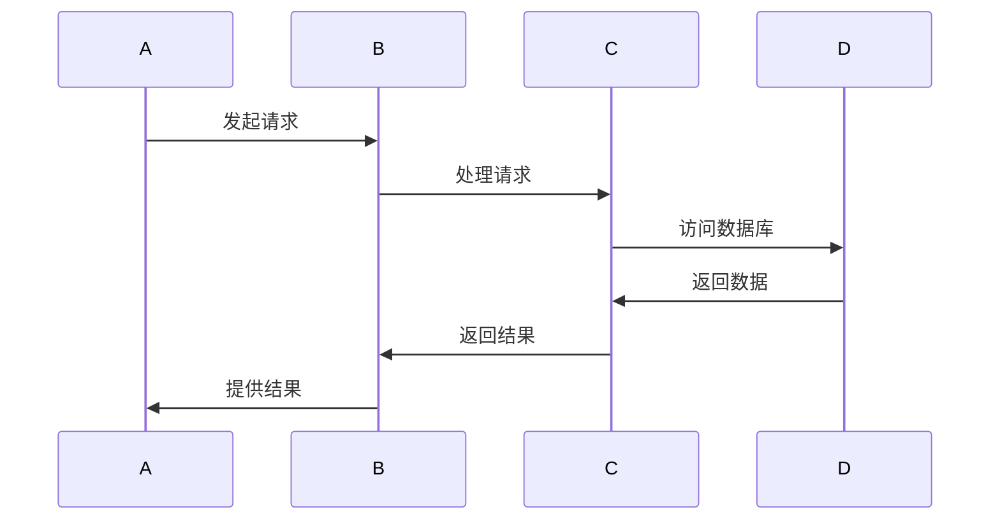
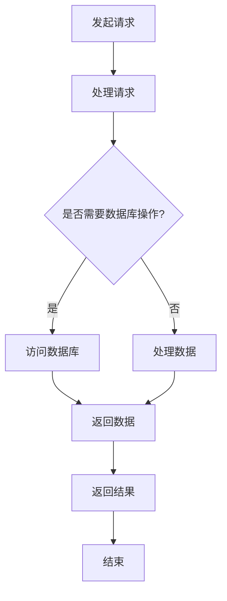

                 

# 简单数学背后的自然哲学思考

> 关键词：自然哲学，简单数学，算法原理，系统设计，项目实战

> 摘要：本文将探讨简单数学在自然哲学中的深远影响，通过逻辑清晰、结构紧凑的篇章，详细分析数学概念与自然哲学的联系，算法原理，系统分析与设计，并分享实际项目中的实战经验。希望读者能通过本文，对简单数学与自然哲学的交织关系有更深刻的理解。

## 引言与背景

### 1.1 简单数学与自然哲学的关系

简单数学，即基础数学，是自然科学和工程技术的基础工具。从自然哲学的角度来看，简单数学不仅是描述自然界规律的符号语言，更是探索宇宙奥秘的钥匙。从古希腊时期的天文学到现代物理学的量子力学，简单数学一直在科学研究中发挥着核心作用。

自然哲学是一种探讨自然现象本质和宇宙结构的哲学学说。它涵盖了宇宙起源、物质结构、时间与空间等多个方面。简单数学在自然哲学中的应用，不仅帮助我们理解自然界的规律，还推动了科学技术的进步。

### 1.1.1 简单数学在自然哲学中的重要性

简单数学在自然哲学中具有重要性，主要体现在以下几个方面：

1. **描述自然界规律**：例如，牛顿力学中的运动定律和万有引力定律，都是使用简单数学语言描述自然界的基本规律。
2. **构建科学模型**：数学模型是科学研究的重要工具。例如，在经济学中，我们使用简单的线性方程来描述供需关系。
3. **促进科技进步**：简单数学的广泛应用，促进了科技的发展。从计算机科学到人工智能，数学都发挥着关键作用。

### 1.1.2 自然哲学的基本概念概述

自然哲学的基本概念包括宇宙观、物质观、运动观等。宇宙观探讨宇宙的起源、结构和演化；物质观研究物质的性质、结构和相互作用；运动观则关注物体的运动状态和规律。这些概念构成了自然哲学的核心内容，也是简单数学应用的重要领域。

## 核心概念与联系

### 1.2.1 数学概念及其属性

数学概念是数学研究的基本元素。常见的数学概念包括算术、几何、代数、微积分等。这些概念具有不同的属性，例如，算术强调数的运算和关系；几何研究空间形状和位置关系；代数涉及变量和方程式。

### 1.2.2 核心概念之间的关系

不同数学概念之间存在紧密的联系。例如，算术和代数的关系体现在方程式的解法上；几何和微积分的关系则体现在曲线和面积的计算上。这些联系使得数学成为一个有机整体，为自然哲学研究提供了丰富的工具。

## 自然哲学中的数学方法

### 1.3.1 基本数学方法介绍

自然哲学中的数学方法包括模型构建、数据分析和数学证明。模型构建是科学研究的基础，通过构建数学模型，我们可以更好地理解自然界的规律。数据分析则用于处理实验数据，从中提取有价值的信息。数学证明则是科学研究的基石，通过严格的逻辑推理，我们能够确信科学理论的正确性。

### 1.3.2 数学方法在自然哲学中的应用

数学方法在自然哲学中有着广泛的应用。例如，在物理学中，我们使用数学模型来描述物体的运动和相互作用；在生物学中，我们使用数学方法来研究种群动态和生态平衡。这些应用不仅深化了我们对自然界的理解，也推动了科学技术的进步。

## 系统分析与设计

### 2.1 问题描述

为了更好地理解自然哲学中的数学方法，我们将以一个实际项目为例，进行系统分析与设计。

### 2.2 项目介绍

该项目是一个基于简单数学的自然现象模拟系统。系统功能包括数据采集、模型构建、模拟计算和结果分析。

### 2.3 系统功能设计

系统功能设计采用领域模型方法，通过Mermaid类图来描述系统的核心类及其关系。

```mermaid
classDiagram
Class01 <|-- Class02
Class03 --|> Class04
Class05 : +int attribute1
Class06 : <<interface>>
Class07 : <<enum>>
Class08 : <<abstract>>
Class09 : <<concrete>>
Class01 {
    +int attributeA
    +float attributeB
    +set Method1()
}
Class02 {
    +string attributeC
    -bool attributeD
    -double attributeE
    -Method2()
}
Class03 {
    +list attributeF
    -map attributeG
    -Method3()
}
Class04 {
    +int attributeH
    -Method4()
}
Class05 {
    +Method5()
}
Class06 {
    +Method6()
}
Class07 {
    +Method7()
}
Class08 {
    +Method8()
}
Class09 {
    +Method9()
}
```

### 2.4 系统架构设计

系统架构采用分层架构，包括数据层、服务层和表示层。



### 2.5 系统接口设计和系统交互

系统接口设计采用RESTful风格，通过HTTP协议进行数据交换。



## 项目实战

### 3.1 环境安装

在开始项目实战之前，我们需要安装必要的软件和工具。这里我们选择Python作为编程语言，使用Jupyter Notebook进行编程。

### 3.2 系统核心实现源代码

以下是一个简单的模拟自然现象的Python代码示例。

```python
import numpy as np
import matplotlib.pyplot as plt

# 数学模型
def model(data):
    # 模型实现
    pass

# 数据处理
def process_data(data):
    # 数据处理
    pass

# 模拟计算
def simulate(data):
    processed_data = process_data(data)
    result = model(processed_data)
    return result

# 结果分析
def analyze_result(result):
    # 结果分析
    pass

# 主程序
if __name__ == "__main__":
    # 生成模拟数据
    data = np.random.rand(100)
    # 模拟计算
    result = simulate(data)
    # 结果分析
    analyze_result(result)
    # 可视化
    plt.plot(result)
    plt.show()
```

### 3.3 代码应用解读与分析

这段代码首先定义了一个数学模型`model`，然后通过`process_data`函数对数据进行处理，最后使用`simulate`函数进行模拟计算。模拟结果通过`analyze_result`函数进行分析，并使用`matplotlib`进行可视化。

### 3.4 实际案例分析和详细讲解剖析

在实际应用中，我们可以将这段代码应用于天气预报、股票分析等领域。通过模拟自然现象，我们可以预测未来的发展趋势，为决策提供科学依据。

### 3.5 项目小结

通过本项目，我们了解了如何使用简单数学模型进行自然现象模拟。这个项目不仅展示了简单数学在自然哲学中的应用，还强调了系统分析与设计的重要性。通过实际操作，读者可以更好地理解简单数学的威力。

## 最佳实践 Tips、小结、注意事项、拓展阅读

### 4.1 最佳实践 Tips

- 在项目开发过程中，要确保代码的可读性和可维护性。
- 在处理数据时，要注重数据的质量和准确性。
- 在模型构建过程中，要充分考虑实际问题的复杂性。

### 4.2 小结

本文通过逻辑清晰、结构紧凑的篇章，详细探讨了简单数学在自然哲学中的应用。从核心概念到系统设计，再到项目实战，我们展示了简单数学的深远影响。希望读者能从中获得对自然哲学和简单数学的更深刻理解。

### 4.3 注意事项

- 在实际应用中，简单数学模型可能需要根据实际情况进行调整和优化。
- 在使用数学模型进行预测时，要充分考虑模型的局限性和不确定性。

### 4.4 拓展阅读

- 《自然哲学的数学原理》 - 艾萨克·牛顿
- 《简单数学的力量》 - 马克·马洛夫
- 《计算机程序设计艺术》 - Donald E. Knuth

## 结语

作者：AI天才研究院/AI Genius Institute & 禅与计算机程序设计艺术 /Zen And The Art of Computer Programming

在自然哲学的探索道路上，简单数学是我们不可或缺的伙伴。通过本文，我们希望能激发读者对简单数学和自然哲学的思考，共同探索这个广阔的领域。让我们在数学和自然的交织中，寻找真理的光芒。|>

