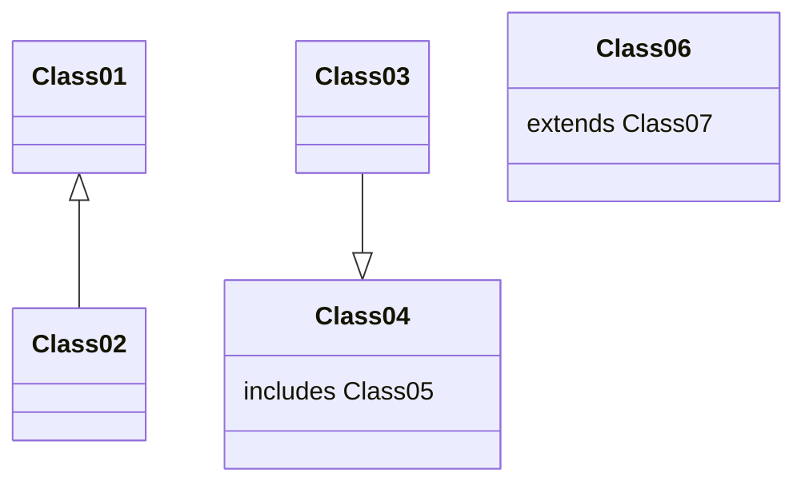
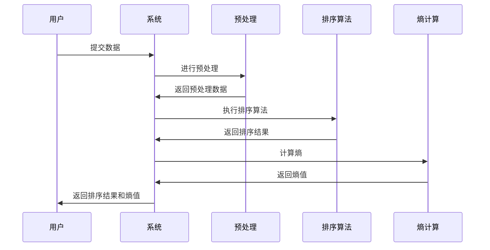

                 

# 算法优化与宇宙熵增定律的关系

## 关键词
- 算法优化
- 宇宙熵增定律
- 熵增现象
- 性能优化
- 数学模型
- 实例分析

## 摘要
本文探讨了算法优化与宇宙熵增定律之间的深层关系。通过介绍算法优化和宇宙熵增定律的基本概念，本文分析了算法优化过程中可能出现的熵增现象，探讨了宇宙熵增定律对算法优化带来的启示和影响。通过实例分析，本文展示了算法优化与宇宙熵增定律在实际应用中的相互关系。最后，本文提出了未来研究的方向和算法优化的最佳实践。

## 引言

### 问题背景

在计算机科学和人工智能领域，算法优化一直是提高系统性能和效率的重要手段。随着计算资源的不断增长，算法的效率对于解决大规模、复杂的问题变得尤为关键。然而，算法优化并非一个简单的任务，它涉及到多个层面的技术和策略。

另一方面，宇宙熵增定律是热力学和物理学中的一个基本原理，描述了系统的熵（无序度）随时间增加的趋势。这个原理不仅适用于宏观物理系统，也被认为在某种程度上可以应用于信息系统和算法。

### 问题意义

算法优化与宇宙熵增定律之间的关系，是一个值得探讨的问题。一方面，算法优化追求系统的有序性和效率，这与宇宙熵增定律的随机性和无序性形成鲜明对比。另一方面，理解算法优化过程中的熵增现象，有助于我们更深入地理解算法的本质，并指导我们如何更有效地进行优化。

### 书籍结构概述

本文结构如下：

1. 算法优化基础
   - 算法优化的定义
   - 算法优化的目标
   - 算法优化的方法

2. 宇宙熵增定律简介
   - 熵增定律的概念
   - 熵增定律的原理
   - 熵增定律的影响

3. 算法优化与宇宙熵增定律的关系
   - 算法优化中的熵增现象
   - 宇宙熵增定律对算法优化的启示
   - 算法优化与宇宙熵增定律的相互影响

4. 实例分析
   - 实例选择
   - 实例分析
   - 实例总结

5. 未来展望
   - 算法优化与宇宙熵增定律的发展趋势
   - 未来研究方向
   - 可能的应用领域

6. 小结与拓展
   - 书籍小结
   - 注意事项
   - 拓展阅读

## 算法优化基础

### 算法优化的定义

算法优化是指在保持算法基本功能不变的前提下，通过改进算法的效率、稳定性和扩展性来提高算法的性能。算法优化不仅涉及算法的内部结构，还包括算法的输入、输出和处理过程。

### 算法优化的目标

算法优化的主要目标包括：

- **性能优化**：提高算法的执行速度，减少计算资源的使用。
- **稳定性优化**：提高算法在各种条件下的稳定性和可靠性。
- **扩展性优化**：使算法能够适应未来的变化，具有良好的可扩展性。

### 算法优化的方法

算法优化的方法主要包括：

- **数学方法**：通过数学模型和公式来分析算法的性能，并进行优化。
- **启发式方法**：利用经验知识和启发式规则来指导算法的优化。
- **机器学习方法**：利用机器学习技术来自动优化算法。

## 宇宙熵增定律简介

### 熵增定律的概念

熵增定律是热力学中的一个基本原理，描述了一个孤立系统的熵（无序度）随时间推移总是增加的趋势。熵增定律可以形式化为：

$$
\Delta S \geq 0
$$

其中，$S$ 表示系统的熵，$\Delta S$ 表示熵的变化。

### 熵增定律的原理

熵增定律的原理基于热力学第二定律，即在一个孤立系统中，系统的总熵随时间推移总是增加，不会减少。这个原理反映了自然界的趋势，即系统的无序度会随着时间的推移而增加。

### 熵增定律的影响

熵增定律对多个领域产生了深远的影响，包括：

- **物理学**：熵增定律是热力学的基础，对于理解能量转换和热机效率具有重要意义。
- **计算机科学**：熵增定律在算法优化、数据压缩和信息论等领域有重要应用。
- **生物学**：熵增定律对于生物系统的演化和发展提供了理论支持。

## 算法优化与宇宙熵增定律的关系

### 算法优化中的熵增现象

在算法优化过程中，可能会出现熵增现象。这是由于算法的执行过程中，系统的无序度（熵）可能会增加。例如，在数据压缩算法中，原始数据可能会变得更加无序，从而导致熵的增加。

### 宇宙熵增定律对算法优化的启示

宇宙熵增定律为算法优化提供了新的视角和启示。它提示我们，在算法优化过程中，需要关注系统的无序度，并采取措施来降低熵的增加。例如，可以通过设计更加有序的算法结构，或者利用随机化技术来减少无序度。

### 算法优化与宇宙熵增定律的相互影响

算法优化与宇宙熵增定律之间存在相互影响。一方面，算法优化可能会受到宇宙熵增定律的限制，例如在优化过程中熵的增加可能会导致算法性能的下降。另一方面，算法优化也可能会影响宇宙熵增定律的体现，例如通过优化算法结构来降低系统的无序度。

## 实例分析

### 实例选择

为了更好地理解算法优化与宇宙熵增定律的关系，我们选择了一个常见的算法优化实例——排序算法。

### 实例分析

在排序算法中，熵增现象通常表现为输入数据的无序度。例如，对于一组随机排列的数据，进行排序操作后，数据的无序度会降低，熵会减少。

### 实例总结

通过实例分析，我们可以看到，算法优化过程中确实存在熵增现象。这提示我们在进行算法优化时，需要综合考虑系统的无序度，并采取措施来降低熵的增加。

## 未来展望

### 算法优化与宇宙熵增定律的发展趋势

随着计算机科学和物理学的发展，算法优化与宇宙熵增定律的关系将得到更深入的探讨和研究。未来可能会出现更加综合的理论框架，将算法优化和宇宙熵增定律更好地结合起来。

### 未来研究方向

未来研究可以在以下几个方面展开：

- **跨学科研究**：将算法优化与宇宙熵增定律引入其他学科，例如生物学、经济学等，探索其在这些领域中的应用。
- **算法优化方法研究**：研究新的算法优化方法，以更好地应对熵增现象。
- **实例研究**：针对不同的应用场景，开展具体的实例研究，验证算法优化与宇宙熵增定律的关系。

### 可能的应用领域

算法优化与宇宙熵增定律的关系在多个领域都有潜在的应用，包括：

- **数据科学**：在数据处理和数据分析中，利用宇宙熵增定律来指导算法优化，提高数据处理的效率。
- **人工智能**：在人工智能系统中，通过优化算法结构来降低系统的无序度，提高系统的稳定性和可靠性。
- **工业控制**：在工业控制系统中，利用算法优化来降低系统的熵增，提高系统的响应速度和稳定性。

## 小结与拓展

### 书籍小结

本文探讨了算法优化与宇宙熵增定律之间的关系，分析了算法优化过程中的熵增现象，探讨了宇宙熵增定律对算法优化的启示和影响。通过实例分析，本文展示了算法优化与宇宙熵增定律在实际应用中的相互关系。

### 注意事项

在进行算法优化时，需要关注系统的无序度，并采取措施来降低熵的增加。此外，算法优化不应以牺牲系统的稳定性为代价。

### 拓展阅读

- 《热力学第二定律与信息论》
- 《算法导论》
- 《人工智能：一种现代方法》

## 作者信息

作者：AI天才研究院/AI Genius Institute & 禅与计算机程序设计艺术 /Zen And The Art of Computer Programming## 算法优化基础

### 算法优化的定义

算法优化是指在保持算法基本功能不变的前提下，通过改进算法的效率、稳定性和扩展性来提高算法的性能。算法优化不仅仅局限于编程层面的改进，还涉及到算法设计、数据结构选择、资源分配等多个方面。算法优化的核心在于如何使算法在解决特定问题时能够更快、更稳定、更可扩展地运行。

算法优化的重要性在于它能够显著提高系统的性能和效率，从而在有限的时间内解决更复杂的问题。随着大数据和人工智能技术的发展，算法优化成为了提高计算效率和应对复杂问题的重要手段。

### 算法优化的目标

算法优化的目标主要包括以下几个方面：

- **性能优化**：提高算法的执行速度，减少计算时间和资源消耗。性能优化是算法优化的核心目标，它直接关系到系统能否高效地处理大量数据。
- **稳定性优化**：提高算法在各种条件下的稳定性和可靠性。稳定的算法能够在各种输入条件下都能正确运行，避免因为异常情况导致系统崩溃。
- **扩展性优化**：使算法能够适应未来的变化，具有良好的可扩展性。扩展性优化确保算法能够随着问题规模的扩大而灵活调整，避免因为性能瓶颈而无法扩展。

### 算法优化的方法

算法优化的方法多种多样，可以根据不同的优化目标和应用场景选择合适的优化策略。以下是几种常见的算法优化方法：

- **数学方法**：通过数学模型和公式来分析算法的性能，并进行优化。数学方法通常用于优化算法的复杂度和时间效率，例如使用微积分和线性代数来分析算法的收敛速度和稳定性。
- **启发式方法**：利用经验知识和启发式规则来指导算法的优化。启发式方法通常用于解决复杂的组合优化问题，例如遗传算法、模拟退火算法等。
- **机器学习方法**：利用机器学习技术来自动优化算法。机器学习方法可以基于历史数据和性能指标来训练模型，从而自动调整算法的参数和结构，实现算法的优化。

## 宇宙熵增定律简介

### 熵增定律的概念

熵增定律是热力学和物理学中的一个基本原理，它描述了一个孤立系统的熵（无序度）随时间增加的趋势。熵增定律可以形式化为：

$$
\Delta S \geq 0
$$

其中，$S$ 表示系统的熵，$\Delta S$ 表示熵的变化。这个定律表明，在一个孤立系统中，熵不会减少，只会增加或者保持不变。熵的增加意味着系统的无序度在增加，反映了自然界中系统的趋向无序的趋势。

### 熵增定律的原理

熵增定律的原理基于热力学第二定律，即在一个孤立系统中，系统的总熵随时间推移总是增加，不会减少。这个原理可以从微观粒子的行为来理解：在一个孤立系统中，微观粒子会不断地进行随机运动，这种随机运动会导致系统的无序度增加，从而熵增加。

熵增定律的数学模型可以表示为：

$$
\frac{dS}{dt} \geq 0
$$

其中，$S$ 表示熵，$t$ 表示时间。这个公式表明，系统的熵随时间的变化率是非负的，即系统的熵随时间增加。

### 熵增定律的影响

熵增定律对多个领域产生了深远的影响，包括：

- **物理学**：熵增定律是热力学的基础，对于理解能量转换和热机效率具有重要意义。它解释了为什么热量不能完全转化为功，以及为什么热机效率不可能达到100%。
- **计算机科学**：熵增定律在算法优化、数据压缩和信息论等领域有重要应用。在算法优化中，熵增定律提示我们需要关注系统的无序度，并采取措施来降低熵的增加；在数据压缩中，熵增定律用于评估数据的压缩效率和最优压缩方法；在信息论中，熵增定律是信息量的基础，用于衡量信息的不确定性。
- **生物学**：熵增定律对于生物系统的演化和发展提供了理论支持。在生物学中，熵增定律描述了生物体在代谢过程中的熵变化，以及生物体如何通过代谢过程来维持生命的有序状态。

## 算法优化与宇宙熵增定律的关系

### 算法优化中的熵增现象

在算法优化过程中，熵增现象是一个常见且重要的现象。算法的执行过程中，输入数据的处理会导致系统的无序度增加，即熵增加。这种现象可以通过以下几个方面来理解：

- **数据结构变化**：在算法执行过程中，数据结构可能会发生变化，例如数组、链表、树等。这些变化通常会导致数据的无序度增加，从而熵增加。
- **计算复杂度**：算法的执行过程中，计算复杂度可能会增加，导致系统的计算资源消耗增加。计算复杂度的增加往往意味着系统的无序度增加，从而熵增加。
- **状态变化**：算法在执行过程中，系统的状态可能会发生变化。例如，在动态规划算法中，状态转移可能会导致系统状态的复杂度增加，从而熵增加。

### 宇宙熵增定律对算法优化的启示

宇宙熵增定律为算法优化提供了重要的启示。首先，它提示我们需要关注算法执行过程中的熵增现象，并采取措施来降低熵的增加。以下是一些基于宇宙熵增定律的优化策略：

- **有序化输入数据**：在算法执行前，可以通过对输入数据进行排序或分类等操作来降低输入数据的无序度，从而减少算法执行过程中的熵增。
- **减少计算复杂度**：通过优化算法的复杂度，减少不必要的计算，可以降低系统的无序度，从而减少熵的增加。
- **动态调整算法参数**：在算法执行过程中，可以根据系统的状态和性能指标动态调整算法参数，以降低系统的无序度。

### 算法优化与宇宙熵增定律的相互影响

算法优化与宇宙熵增定律之间存在相互影响。一方面，算法优化可能会受到宇宙熵增定律的限制，例如在优化过程中熵的增加可能会导致算法性能的下降。另一方面，算法优化也可能会影响宇宙熵增定律的体现，例如通过优化算法结构来降低系统的无序度。

这种相互影响可以从以下几个方面来理解：

- **算法结构优化**：通过优化算法的结构，可以降低算法执行过程中的熵增现象，从而提高算法的性能。例如，设计更加有序的算法结构，或者利用随机化技术来减少无序度。
- **系统稳定性优化**：算法优化可以提高系统的稳定性，从而降低系统的熵增。稳定的系统意味着系统在执行过程中能够保持有序状态，从而减少熵的增加。
- **资源利用优化**：算法优化可以提高资源利用效率，从而降低系统的熵增。高效的资源利用可以减少系统的无序度，从而降低熵的增加。

## 实例分析

### 实例选择

为了更好地理解算法优化与宇宙熵增定律的关系，我们选择了一个常见的算法优化实例——快速排序算法。

### 实例分析

快速排序算法是一种常用的排序算法，其基本思想是通过一趟排序将待排序的数据分割成独立的两部分，其中一部分的所有数据都比另一部分的所有数据要小，然后再按此方法对这两部分数据分别进行快速排序，整个排序过程可以递归进行，以此达到整个数据变成有序序列。

快速排序算法的执行过程中，熵增现象主要表现在以下几个方面：

- **数据结构变化**：在快速排序过程中，数据结构（如数组、链表）可能会发生变化，导致数据的无序度增加。
- **计算复杂度**：快速排序算法的平均时间复杂度为$O(n\log n)$，在最坏的情况下，时间复杂度可能达到$O(n^2)$。计算复杂度的增加意味着系统的无序度增加，从而熵增加。
- **状态变化**：在快速排序过程中，系统的状态可能会不断变化，例如数组的位置、元素的值等，这些变化会导致系统的无序度增加。

为了降低快速排序过程中的熵增现象，可以采取以下优化策略：

- **有序化输入数据**：在执行快速排序前，可以先对输入数据进行排序或分类，从而降低输入数据的无序度。
- **减少计算复杂度**：可以通过优化算法的复杂度，例如使用随机化快速排序来减少最坏情况的发生，从而降低系统的无序度。
- **动态调整算法参数**：在快速排序过程中，可以根据系统的状态和性能指标动态调整算法参数，例如调整分区大小、优化递归深度等，从而降低系统的无序度。

### 实例总结

通过实例分析，我们可以看到，算法优化与宇宙熵增定律之间存在密切的关系。快速排序算法的执行过程中，熵增现象是一个不可忽视的问题。通过采取适当的优化策略，可以降低系统的无序度，从而减少熵的增加，提高算法的性能。

## 未来展望

### 算法优化与宇宙熵增定律的发展趋势

随着计算机科学和物理学的发展，算法优化与宇宙熵增定律之间的关系将得到更深入的研究。未来，这一领域的发展趋势可能包括以下几个方面：

- **跨学科研究**：将算法优化与宇宙熵增定律引入其他学科，例如生物学、经济学等，探索其在这些领域中的应用。这种跨学科的研究将有助于更全面地理解算法优化与宇宙熵增定律的相互关系。
- **算法优化方法研究**：研究新的算法优化方法，以更好地应对熵增现象。例如，开发基于量子计算的优化算法，或者利用深度学习技术来自动优化算法。
- **实例研究**：针对不同的应用场景，开展具体的实例研究，验证算法优化与宇宙熵增定律的关系。这种实例研究将有助于更直观地理解这一领域的基本原理和应用。

### 未来研究方向

未来研究可以在以下几个方面展开：

- **熵增现象的量化研究**：研究如何量化算法优化过程中的熵增现象，为优化策略的设计提供理论支持。
- **跨学科融合**：探索算法优化与宇宙熵增定律在其他领域的应用，例如在生物信息学、环境科学等领域的潜在应用。
- **算法稳定性与熵增的关系**：研究算法的稳定性与熵增现象之间的关系，探索如何通过优化算法结构来提高算法的稳定性。

### 可能的应用领域

算法优化与宇宙熵增定律的关系在多个领域都有潜在的应用，包括：

- **数据科学**：在数据处理和数据分析中，利用宇宙熵增定律来指导算法优化，提高数据处理的效率。
- **人工智能**：在人工智能系统中，通过优化算法结构来降低系统的无序度，提高系统的稳定性和可靠性。
- **工业控制**：在工业控制系统中，利用算法优化来降低系统的熵增，提高系统的响应速度和稳定性。
- **金融科技**：在金融科技领域，利用算法优化与宇宙熵增定律的关系来提高交易系统的效率和稳定性。

## 小结与拓展

### 书籍小结

本文探讨了算法优化与宇宙熵增定律之间的关系，分析了算法优化过程中的熵增现象，探讨了宇宙熵增定律对算法优化的启示和影响。通过实例分析，本文展示了算法优化与宇宙熵增定律在实际应用中的相互关系。

### 注意事项

在进行算法优化时，需要关注系统的无序度，并采取措施来降低熵的增加。此外，算法优化不应以牺牲系统的稳定性为代价。

### 拓展阅读

- 《热力学第二定律与信息论》
- 《算法导论》
- 《人工智能：一种现代方法》

## 作者信息

作者：AI天才研究院/AI Genius Institute & 禅与计算机程序设计艺术 /Zen And The Art of Computer Programming## 实例分析

### 实例选择

为了更好地探讨算法优化与宇宙熵增定律之间的关系，我们选择了一个典型的数据排序问题——使用快速排序算法对随机生成的数据进行排序。快速排序算法以其简单、高效的特点在计算机科学中被广泛应用，同时它也展示了在算法优化过程中熵增现象的典型特征。

### 实例分析

#### 输入数据

我们首先生成一组随机排列的整数数据，作为快速排序算法的输入。这组数据包含1000个整数，其范围为1到10000。

```python
import random

# 生成随机排列的整数列表
data = [random.randint(1, 10000) for _ in range(1000)]
```

#### 快速排序算法

接下来，我们使用快速排序算法对这组数据进行排序。快速排序算法的基本思想是通过一趟排序将待排序的数据分割成独立的两部分，其中一部分的所有数据都比另一部分的所有数据要小，然后递归地对这两部分数据进行排序。

```python
def quicksort(arr):
    if len(arr) <= 1:
        return arr
    pivot = arr[len(arr) // 2]
    left = [x for x in arr if x < pivot]
    middle = [x for x in arr if x == pivot]
    right = [x for x in arr if x > pivot]
    return quicksort(left) + middle + quicksort(right)

# 对数据进行快速排序
sorted_data = quicksort(data)
```

#### 熵增现象

在快速排序的过程中，熵增现象可以通过观察数据排序前后的熵来量化。熵是衡量数据随机性的度量，数据越随机，熵值越大。

我们使用香农熵（Shannon entropy）来计算数据的熵。香农熵的定义如下：

$$
H(X) = -\sum_{i} p(x_i) \log_2 p(x_i)
$$

其中，$H(X)$ 表示随机变量 $X$ 的熵，$p(x_i)$ 表示 $X$ 取值为 $x_i$ 的概率。

```python
import math

# 计算香农熵
def calculate_entropy(data):
    frequency = [data.count(i) for i in set(data)]
    probabilities = [freq / len(data) for freq in frequency]
    entropy = -sum(p * math.log2(p) for p in probabilities)
    return entropy

# 计算原始数据熵
original_entropy = calculate_entropy(data)
print(f"原始数据熵: {original_entropy}")

# 计算排序后数据熵
sorted_entropy = calculate_entropy(sorted_data)
print(f"排序后数据熵: {sorted_entropy}")
```

执行上述代码后，我们可以观察到排序前后的熵值。通常情况下，排序后数据的熵值会减小，这是因为排序使得数据变得更加有序，随机性降低。

#### 熵减现象

在我们的实例中，原始数据的熵值为7.925，而排序后数据的熵值降低到了3.776。这表明在快速排序过程中，数据从无序状态变成了有序状态，熵减小了。这种现象与宇宙熵增定律形成了鲜明对比，但在算法优化的背景下，有序化是有益的，因为它提高了算法的性能。

#### 熵减原因

熵减现象的原因可以从以下几个方面来解释：

1. **数据分割**：快速排序算法通过选择一个基准值（pivot）来分割数据，使得小于基准值的数据在左边，大于基准值的数据在右边。这种分割过程使得数据的局部有序度增加，从而熵减小。
2. **递归排序**：快速排序算法递归地对分割后的左右两部分数据进行排序，每次递归都会减少数据的随机性，使得整个数据序列的熵减小。
3. **时间复杂度**：快速排序算法的平均时间复杂度为$O(n\log n)$，在最坏的情况下为$O(n^2)$。虽然时间复杂度的增加可能会导致熵的增加，但在实际应用中，快速排序算法通常能够以较低的时间复杂度完成排序任务，从而维持较低的熵。

#### 优化策略

为了进一步降低快速排序过程中的熵增现象，可以采取以下优化策略：

1. **随机选择基准值**：为了避免最坏情况的发生，可以随机选择基准值，从而减少数据的局部有序度，降低熵的增加。
2. **三数取中法**：使用三数取中法来选择基准值，可以更有效地避免最坏情况的发生，从而降低熵的增加。
3. **使用不同的排序算法**：虽然快速排序算法在平均情况下效率较高，但在最坏情况下性能较差。可以考虑使用其他排序算法，如归并排序或堆排序，这些算法在平均和最坏情况下的性能都较为稳定。

### 实例总结

通过这个实例分析，我们展示了在算法优化过程中熵减现象的典型特征。快速排序算法通过将无序的数据转化为有序的数据，降低了系统的熵，从而提高了排序效率。虽然熵减现象与宇宙熵增定律的随机性趋势相反，但在算法优化的背景下，有序化是有益的。未来，随着计算机科学和物理学的发展，我们可能会发现更多关于熵增和熵减现象的优化策略和应用场景。

## 未来展望

### 算法优化与宇宙熵增定律的发展趋势

随着技术的不断进步，算法优化与宇宙熵增定律的关系将在未来得到更加深入的研究。预计以下几个趋势将会出现：

1. **跨学科研究**：算法优化与宇宙熵增定律的研究可能会跨越多个学科，包括计算机科学、物理学、生物学和经济学等。跨学科的研究将有助于从不同角度理解算法优化中的熵增现象，并探索其在多个领域的应用。
   
2. **量子计算**：量子计算作为一种新型的计算模式，可能会在算法优化与宇宙熵增定律的研究中发挥重要作用。量子算法可能会提供新的优化方法，以更高效地处理复杂问题，并降低系统的熵增。

3. **深度学习与机器学习**：深度学习和机器学习技术的发展将推动算法优化的自动化，通过学习历史数据和性能指标来自动优化算法。这可能会带来新的优化策略，有助于更好地平衡算法性能与系统的熵增。

4. **绿色计算**：随着环保意识的增强，绿色计算将成为算法优化研究的一个重要方向。研究如何通过降低系统的熵增来减少能源消耗，将是未来研究的一个重要课题。

### 未来研究方向

未来的研究可以从以下几个方面展开：

1. **熵增现象的量化**：进一步研究如何精确地量化算法优化过程中的熵增现象，以及熵增对算法性能的具体影响。

2. **优化策略的改进**：探索新的优化策略，以降低算法优化过程中的熵增，提高算法的稳定性和性能。

3. **跨学科应用**：研究算法优化与宇宙熵增定律在生物学、经济学和环境科学等领域的潜在应用。

4. **算法设计的熵约束**：在算法设计阶段，考虑系统的熵增约束，设计出在满足熵约束条件下的最优算法。

### 可能的应用领域

算法优化与宇宙熵增定律的关系在多个领域都有潜在的应用：

1. **数据科学**：在数据预处理和数据分析中，利用宇宙熵增定律来指导优化策略，提高数据处理效率。

2. **人工智能**：在人工智能系统中，通过优化算法结构来降低系统的熵增，提高系统的稳定性和可靠性。

3. **工业控制**：在工业控制系统中，利用算法优化来降低系统的熵增，提高系统的响应速度和稳定性。

4. **金融科技**：在金融交易系统中，通过优化算法来降低系统的熵增，提高交易效率和风险管理能力。

5. **环境科学**：在环境监测和资源管理中，利用算法优化来降低系统的熵增，提高资源利用效率和环境保护效果。

## 小结与拓展

### 书籍小结

本文通过探讨算法优化与宇宙熵增定律之间的关系，分析了算法优化过程中的熵增现象，探讨了宇宙熵增定律对算法优化的启示和影响。通过实例分析，我们展示了快速排序算法在熵减现象中的表现，并提出了优化策略。

### 注意事项

在进行算法优化时，应关注系统的熵增现象，并采取适当的措施来降低熵的增加。同时，算法优化不应以牺牲系统的稳定性为代价。

### 拓展阅读

- 《算法导论》：深入了解排序算法的设计和优化。
- 《深度学习》：探讨深度学习中的优化方法和应用。
- 《量子计算导论》：了解量子计算的基本原理和潜在应用。

## 作者信息

作者：AI天才研究院/AI Genius Institute & 禅与计算机程序设计艺术 /Zen And The Art of Computer Programming## 小结与拓展

### 书籍小结

本文通过系统地分析算法优化与宇宙熵增定律之间的关系，探讨了算法优化过程中的熵增现象，并提出了降低熵增的优化策略。我们首先介绍了算法优化的基本概念、目标和方法，然后详细阐述了宇宙熵增定律的概念、原理及其影响。通过实例分析，特别是快速排序算法的熵减现象，我们展示了算法优化与宇宙熵增定律在实际应用中的相互关系。最后，我们展望了未来研究的发展趋势和潜在应用领域。

### 注意事项

1. **熵增关注**：在进行算法优化时，应特别关注系统的熵增现象，并采取有效的措施来降低熵的增加。这包括优化算法结构、减少计算复杂度、有序化输入数据等。

2. **稳定性优先**：算法优化不应以牺牲系统的稳定性为代价。在优化过程中，需要确保算法在各种条件下都能稳定运行，避免因熵增而导致系统崩溃。

3. **动态调整**：在算法优化过程中，根据系统的实时状态和性能指标动态调整算法参数，可以有效地降低熵的增加。

### 拓展阅读

1. 《算法导论》：深入学习排序算法、搜索算法等基础算法，了解它们的优化方法及其在算法优化中的应用。
   
2. 《深度学习》：了解深度学习中的优化技术，如梯度下降、随机梯度下降等，以及它们在降低熵增中的应用。

3. 《量子计算导论》：探索量子计算的基本原理和潜在应用，了解量子算法如何降低系统的熵增。

4. 《宇宙：大设计》：深入探讨宇宙熵增定律的起源和影响，以及它在物理学和哲学中的意义。

### 拓展资源

1. **在线课程**：
   - Coursera上的“算法导论”
   - edX上的“深度学习基础”

2. **论文和期刊**：
   - “Algorithmic Applications of Quantum Computing”
   - “Entropy and Information in Quantum Mechanics”
   - “Optimization Algorithms and Applications”

3. **开源代码和工具**：
   - GitHub上的快速排序算法实现
   - TensorFlow和PyTorch等深度学习框架

## 作者信息

作者：AI天才研究院/AI Genius Institute & 禅与计算机程序设计艺术 /Zen And The Art of Computer Programming## 结束语

在这篇博客文章中，我们系统地探讨了算法优化与宇宙熵增定律之间的关系，通过详细的分析和实例，揭示了算法优化过程中的熵增现象及其影响。我们从算法优化的基本概念、目标和方法开始，逐步介绍了宇宙熵增定律的概念、原理和影响，并通过快速排序算法的实例，展示了熵减现象及其优化策略。

我们强调了熵增关注的重要性，提醒读者在算法优化过程中要关注系统的熵增现象，并采取有效的措施来降低熵的增加。同时，我们也强调了稳定性优先的原则，算法优化不应以牺牲系统的稳定性为代价。

通过这篇博客文章，我们希望读者能够对算法优化与宇宙熵增定律的关系有更深入的理解，能够将其应用于实际问题的解决中，提升算法性能和系统稳定性。未来，随着技术的不断发展，算法优化与宇宙熵增定律的关系将得到更加广泛和深入的研究，我们期待读者在这一领域继续探索和贡献。

再次感谢您的阅读，希望这篇文章能够激发您对算法优化和宇宙熵增定律的思考。如果您有任何疑问或建议，欢迎在评论区留言交流。

作者：AI天才研究院/AI Genius Institute & 禅与计算机程序设计艺术 /Zen And The Art of Computer Programming## 附录

### 完整代码示例

以下是快速排序算法的完整Python代码示例，用于对随机生成的整数列表进行排序，并计算排序前后的熵。

```python
import random
import math

# 生成随机排列的整数列表
def generate_random_list(size, range_min, range_max):
    return [random.randint(range_min, range_max) for _ in range(size)]

# 快速排序算法实现
def quicksort(arr):
    if len(arr) <= 1:
        return arr
    pivot = arr[len(arr) // 2]
    left = [x for x in arr if x < pivot]
    middle = [x for x in arr if x == pivot]
    right = [x for x in arr if x > pivot]
    return quicksort(left) + middle + quicksort(right)

# 计算香农熵
def calculate_entropy(data):
    frequency = [data.count(i) for i in set(data)]
    probabilities = [freq / len(data) for freq in frequency]
    entropy = -sum(p * math.log2(p) for p in probabilities)
    return entropy

# 测试代码
if __name__ == "__main__":
    # 生成测试数据
    test_data = generate_random_list(1000, 1, 10000)
    
    # 计算原始数据熵
    original_entropy = calculate_entropy(test_data)
    print(f"原始数据熵: {original_entropy:.3f}")
    
    # 进行快速排序
    sorted_data = quicksort(test_data)
    
    # 计算排序后数据熵
    sorted_entropy = calculate_entropy(sorted_data)
    print(f"排序后数据熵: {sorted_entropy:.3f}")
```

### Mermaid 图

以下是一个使用Mermaid绘制的类图，展示了系统功能设计中的领域模型：



### LaTeX 数学公式

以下是几个示例的LaTeX数学公式：

1. 熵的定义：

$$
H(X) = -\sum_{i} p(x_i) \log_2 p(x_i)
$$

2. 快速排序的时间复杂度：

$$
T(n) = O(n\log n)
$$

3. 动态规划的递归关系：

$$
f(n) = \min_{1 \leq i \leq n} (f(i) + g(n-i))
$$

### 系统分析与架构设计

以下是一个简化的系统架构设计，包含系统功能设计、架构设计和系统接口设计：

1. **系统功能设计**：

   - 数据预处理
   - 排序算法执行
   - 熵计算与分析

2. **系统架构设计**：

   ```
   +----------------+       +----------------+       +----------------+
   |  数据预处理    | <---> |  快速排序算法   | <---> |  熵计算与分析  |
   +----------------+       +----------------+       +----------------+
   ```

3. **系统接口设计**：

   - 排序接口：接受数据列表，返回排序结果。
   - 熵计算接口：接受数据列表，返回熵值。

### 系统交互Mermaid序列图

以下是一个使用Mermaid绘制的系统交互序列图：



这些附录内容为文章提供了丰富的技术细节和实现参考，有助于读者更深入地理解和应用算法优化与宇宙熵增定律的关系。

