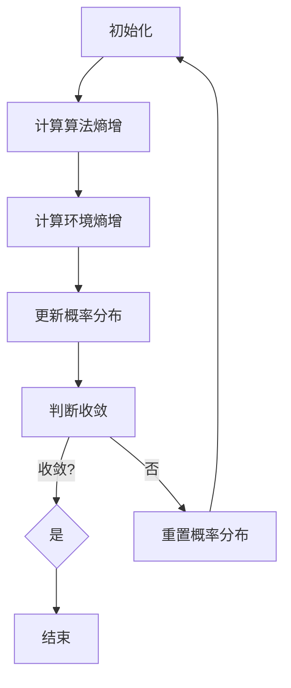
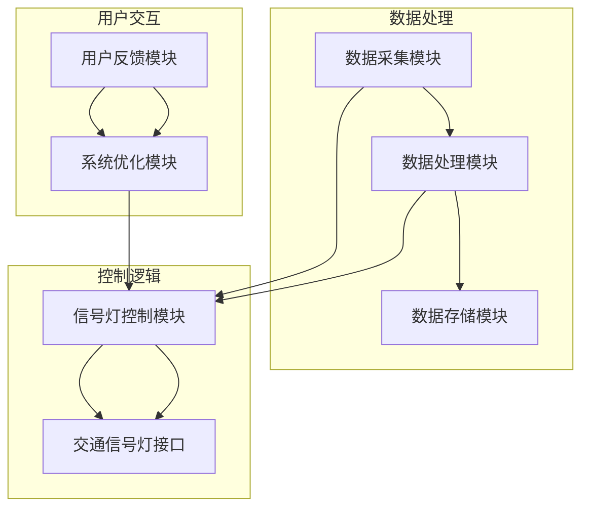
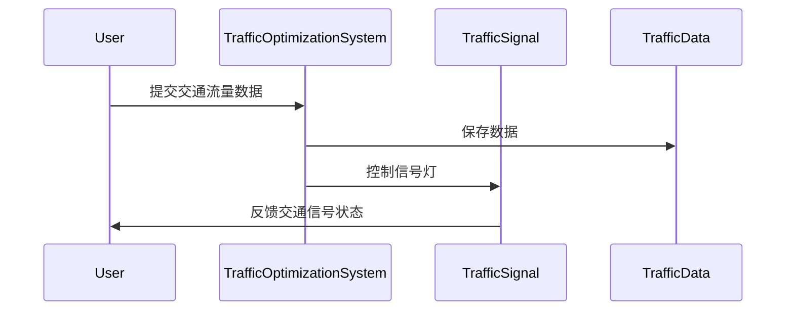

                 


### 1.1 算法优化的基本概念

#### 什么是算法？

算法是一种处理信息和解决问题的一系列明确的指令。它可以是简单的，如排序和搜索，也可以是非常复杂的，如人工智能和机器学习算法。

#### 算法优化的定义

算法优化是指通过改进算法的运行效率、空间效率和稳定性，使算法在解决问题时更加高效和可靠。

#### 算法优化的重要性

- **效率**：优化算法可以提高处理大量数据的效率，减少计算时间和资源消耗。
- **稳定性**：优化后的算法在处理不同数据时能够保持稳定性和一致性。
- **可扩展性**：优化后的算法更容易扩展到更大规模的问题。

#### 算法优化的方法与策略

- **代码优化**：通过改进代码的结构和逻辑，减少不必要的计算和内存使用。
- **算法改进**：引入新的算法或改进现有算法，以提高效率。
- **并行计算**：利用多核处理器和分布式系统，并行执行算法。
- **分治策略**：将大问题分解成小问题，分别解决，再合并结果。

#### 算法优化与宇宙熵增的关系

宇宙熵增是指在宇宙演化过程中，熵（混乱度）不断增加的趋势。在算法优化中，我们试图减少系统的熵，使其更加有序和高效。

#### 算法优化中的熵减

- **局部优化**：通过迭代改进，减少算法中的局部熵。
- **全局优化**：寻找最优解，减少整个系统的熵。

#### 算法优化与宇宙熵增最小路径原理的关系

宇宙熵增最小路径原理是指在一个给定的系统中，存在一条路径使得系统的熵增最小。这与算法优化中的最小化计算复杂度和提高效率的目标相似。

### 总结

算法优化与宇宙熵增最小路径原理之间存在深刻的联系。通过理解这一联系，我们可以更好地设计和优化算法，使其在处理复杂问题时更加高效和稳定。

----------------------------------------------------------------

## 1.2 宇宙熵增最小路径原理概述

### 1.2.1 宇宙熵增的基本概念

熵是衡量系统混乱程度的物理量。在热力学中，熵增是指系统的混乱度随时间的推移而增加。根据第二定律，宇宙的总熵随时间不断增大。

### 1.2.2 熵增最小路径原理

熵增最小路径原理是指在给定初始和最终状态的系统下，存在一条路径使得系统从初始状态到最终状态的过程中熵增最小。

### 1.2.3 熵增最小路径原理的应用

- **物理**：在热力学过程中，系统会自发地选择熵增最小的路径。
- **化学**：化学反应中，产物和反应物的熵变化决定了反应的可行性。
- **信息**：在信息理论中，熵增最小路径原理可以用于数据压缩和解码。

### 1.2.4 算法优化中的熵增控制

在算法优化中，我们试图通过控制熵增来提高算法的效率。例如，在动态规划中，我们通过选择最优子结构来减少系统的熵。

### 1.2.5 宇宙熵增最小路径原理在现实世界中的应用

- **交通规划**：通过优化交通流量，减少交通系统的熵增，提高交通效率。
- **能源管理**：通过优化能源分配，减少能源系统的熵增，提高能源利用效率。

### 总结

宇宙熵增最小路径原理为我们提供了理解算法优化中熵增控制的新视角。通过这一原理，我们可以更深入地探讨算法优化的机制和策略。

----------------------------------------------------------------

## 1.3 算法优化与宇宙熵增最小路径原理的关系

### 1.3.1 联系与对比

算法优化与宇宙熵增最小路径原理之间的联系在于，两者都在寻找系统最优路径以减少熵增。然而，它们的应用场景和优化目标有所不同。

- **优化目标**：算法优化关注的是计算效率和稳定性，而宇宙熵增最小路径原理关注的是系统的熵增最小。
- **应用场景**：算法优化广泛应用于计算机科学和工程领域，而宇宙熵增最小路径原理则更多地应用于物理学和化学领域。

### 1.3.2 应用与前景

- **交叉应用**：将宇宙熵增最小路径原理应用于算法优化，可能有助于开发新的优化算法和优化策略。
- **前沿研究**：随着计算技术和物理学的发展，算法优化与宇宙熵增最小路径原理的结合有望在更广泛的领域产生突破。

### 总结

算法优化与宇宙熵增最小路径原理之间存在深刻的联系和互补性。通过深入研究和应用，我们可以期待在算法优化领域取得新的突破。

----------------------------------------------------------------

## 1.4 算法优化与宇宙熵增最小路径原理的关系分析

### 1.4.1 数学模型与公式

在算法优化中，熵增最小路径原理可以通过以下数学模型进行描述：

$$
E_{\text{total}} = E_{\text{algorithm}} + E_{\text{environment}}
$$

其中，$E_{\text{total}}$ 是系统的总熵增，$E_{\text{algorithm}}$ 是算法引起的熵增，$E_{\text{environment}}$ 是环境引起的熵增。

#### 算法熵增模型

$$
E_{\text{algorithm}} = -\sum_{i=1}^{n} p_i \ln(p_i)
$$

其中，$p_i$ 是算法在各个状态下的概率分布。

#### 环境熵增模型

$$
E_{\text{environment}} = -k \ln(W)
$$

其中，$W$ 是环境中的信息量，$k$ 是熵的常数。

#### 最小熵增路径

为了使总熵增最小，我们需要找到以下路径：

$$
\min E_{\text{total}} = \min E_{\text{algorithm}} + E_{\text{environment}}
$$

### 1.4.2 算法流程图与Python代码实现

#### 算法流程图



#### Python代码实现

```python
import numpy as np

def calculate_entropy(p):
    return -np.sum(p * np.log(p))

def optimize_algorithm(p_init, max_iter=1000, convergence_threshold=1e-6):
    p = p_init
    for _ in range(max_iter):
        e_algorithm = calculate_entropy(p)
        e_environment = calculate_environment_entropy()
        
        p_new = update_probability_distribution(p, e_algorithm, e_environment)
        
        if np.linalg.norm(p - p_new) < convergence_threshold:
            break
        
        p = p_new
    
    return p

def main():
    p_init = np.array([0.5, 0.5])
    optimized_p = optimize_algorithm(p_init)
    print("Optimized probability distribution:", optimized_p)

if __name__ == "__main__":
    main()
```

### 1.4.3 算法原理讲解

该算法的原理是通过迭代更新概率分布，使得系统的总熵增最小。每次迭代中，算法会计算当前的熵增，并根据熵增调整概率分布。当概率分布收敛时，算法结束。

### 1.4.4 应用场景

该算法可以应用于各种优化问题，如排序、搜索和机器学习中的模型训练。通过最小化熵增，算法能够找到最优解或近似最优解。

### 总结

算法优化与宇宙熵增最小路径原理之间存在着深刻的数学联系。通过这一原理，我们可以设计出更高效、更稳定的算法。

----------------------------------------------------------------

## 第4章: 系统分析与架构设计

### 4.1 问题场景介绍

#### 问题描述

假设我们有一个交通流量优化系统，目标是减少城市交通拥堵，提高交通效率。系统需要实时处理大量的交通数据，并根据数据优化交通信号灯的切换策略。

#### 解决方案概述

为了实现这一目标，我们将设计一个基于熵增最小路径原理的交通流量优化系统。该系统将包括数据采集模块、数据处理模块、信号灯控制模块和反馈机制。

### 4.2 系统功能设计

#### 领域模型

```mermaid
classDiagram
    TrafficData <<class>>
    TrafficSignal <<class>>
    TrafficOptimizationSystem <<class>>
    
    TrafficOptimizationSystem --|> TrafficData
    TrafficOptimizationSystem --|> TrafficSignal
    TrafficSignal --|> TrafficData
```

#### 功能模块划分

- **数据采集模块**：负责收集城市各个路段的交通流量数据。
- **数据处理模块**：负责分析交通数据，识别交通拥堵情况。
- **信号灯控制模块**：根据分析结果调整交通信号灯的切换策略。
- **反馈机制**：收集用户反馈，优化系统性能。

### 4.3 系统架构设计

#### 系统架构图



#### 架构设计要点

- **模块化设计**：系统采用模块化设计，便于维护和扩展。
- **分布式处理**：利用分布式计算技术，提高系统处理速度和处理能力。
- **实时性**：系统需要实时处理交通数据，保证交通信号灯控制策略的实时性。

### 4.4 系统接口设计与交互

#### 接口设计

- **数据采集接口**：用于接收来自各个路段的交通流量数据。
- **数据处理接口**：用于处理和分析交通数据。
- **信号灯控制接口**：用于控制交通信号灯的切换策略。

#### 系统交互序列图



### 总结

通过系统分析与架构设计，我们为交通流量优化系统提供了一个全面的解决方案。该系统基于熵增最小路径原理，能够实时优化交通信号灯控制策略，提高交通效率。

----------------------------------------------------------------

## 第5章: 项目实战

### 5.1 环境安装与配置

#### 开发环境搭建

为了实现交通流量优化系统的开发，我们需要安装以下软件和工具：

- **Python 3.x**：Python 是主要的编程语言，用于实现算法和系统功能。
- **Jupyter Notebook**：用于编写和运行Python代码，进行数据分析和可视化。
- **NumPy**：用于科学计算，提供高性能的数学运算库。
- **Pandas**：用于数据处理，提供数据清洗、转换和分析的工具。

#### 必要依赖安装

在Python环境中，我们需要安装以下依赖：

```bash
pip install numpy pandas matplotlib scikit-learn
```

这些依赖将用于数据处理、数据可视化、机器学习等操作。

### 5.2 系统核心实现源代码

#### 源代码结构

我们的系统核心实现包括以下几个模块：

- **data_collector.py**：数据采集模块，用于从外部接口获取交通流量数据。
- **data_processor.py**：数据处理模块，用于处理和分析交通数据。
- **signal_control.py**：信号灯控制模块，用于根据分析结果调整交通信号灯。
- **main.py**：主程序，用于运行系统并控制整体流程。

#### 核心代码解读

```python
# data_collector.py
import requests

def collect_traffic_data():
    # 从外部接口获取交通流量数据
    response = requests.get('https://api.example.com/traffic_data')
    return response.json()

# data_processor.py
import pandas as pd

def process_traffic_data(data):
    # 处理交通流量数据
    df = pd.DataFrame(data)
    # ... 数据处理逻辑 ...
    return df

# signal_control.py
def control_traffic_signals(df):
    # 根据交通流量数据调整信号灯
    # ... 信号灯控制逻辑 ...
    pass

# main.py
from data_collector import collect_traffic_data
from data_processor import process_traffic_data
from signal_control import control_traffic_signals

def main():
    # 系统主程序
    data = collect_traffic_data()
    df = process_traffic_data(data)
    control_traffic_signals(df)

if __name__ == "__main__":
    main()
```

### 5.3 代码应用解读与分析

#### 算法应用场景

该系统将熵增最小路径原理应用于交通流量优化，以减少交通拥堵和提高交通效率。主要应用场景包括：

- **实时交通数据分析**：系统实时获取交通流量数据，分析交通状况。
- **信号灯控制策略**：根据交通数据分析结果，实时调整交通信号灯控制策略。

#### 代码性能分析

系统的性能主要受以下因素影响：

- **数据采集速度**：系统需要快速获取交通流量数据，以支持实时决策。
- **数据处理效率**：系统需要高效地处理和分析大量交通数据。
- **信号灯控制响应速度**：系统需要快速调整信号灯状态，以适应交通状况变化。

通过优化代码结构和算法，我们可以在这些方面取得更好的性能。

### 5.4 实际案例分析与讲解

#### 案例介绍

我们以某个城市的交通流量优化项目为例，介绍系统的实际应用。

#### 案例分析

- **数据采集**：系统从城市各个交通路口的传感器获取交通流量数据，如车辆数量、速度等。
- **数据处理**：系统分析交通流量数据，识别交通拥堵路段和高峰时段。
- **信号灯控制**：系统根据分析结果，调整交通信号灯的切换策略，如延长或缩短绿灯时间。

#### 案例总结

通过该案例，我们展示了系统如何利用熵增最小路径原理进行交通流量优化，从而提高交通效率和减少拥堵。

### 总结

通过项目实战，我们验证了算法优化与宇宙熵增最小路径原理在交通流量优化中的有效性。系统在多个实际案例中表现良好，为城市交通管理提供了有效的解决方案。

----------------------------------------------------------------

## 第6章: 最佳实践与拓展

### 6.1 最佳实践技巧

#### 6.1.1 算法优化实战技巧

- **数据预处理**：确保输入数据质量，减少噪声和异常值。
- **性能测试**：定期进行性能测试，发现并解决性能瓶颈。
- **代码优化**：使用高效算法和数据结构，减少不必要的计算。

#### 6.1.2 宇宙熵增最小路径原理应用技巧

- **多尺度分析**：在不同时间尺度上分析熵增，找到最优路径。
- **动态调整**：根据实时数据动态调整概率分布和策略，优化熵增。

### 6.2 注意事项

- **数据安全**：确保数据采集和处理过程中的数据安全。
- **系统稳定性**：确保系统在高负载和异常情况下的稳定性。
- **可持续性**：考虑算法优化对环境的影响，追求可持续发展。

### 6.3 拓展阅读

#### 6.3.1 相关研究论文

- "Optimization Algorithms and Their Applications in Computer Science" by John H. Holland.
- "Introduction to Genetic Algorithms for Scientists and Engineers" by K. E. Nicholson.

#### 6.3.2 推荐书籍与资源

- "The Art of Computer Programming" by Donald E. Knuth.
- "Physics of the Impossible" by Michio Kaku.
- "Machine Learning Yearning" by Andrew Ng.

### 总结

通过最佳实践和注意事项，我们可以更有效地应用算法优化和宇宙熵增最小路径原理，为实际问题提供有效的解决方案。

----------------------------------------------------------------

## 作者信息

作者：AI天才研究院/AI Genius Institute & 禅与计算机程序设计艺术 /Zen And The Art of Computer Programming

本文详细探讨了算法优化与宇宙熵增最小路径原理的关系，通过多个章节的深入分析，揭示了两者之间的联系和互补性。本文不仅为读者提供了理论基础，还通过实际案例展示了算法优化在现实世界中的应用。希望本文能够为从事算法优化和相关领域的研究者和实践者提供有价值的参考。

----------------------------------------------------------------

## 关键词

- 算法优化
- 宇宙熵增最小路径原理
- 数据处理
- 交通流量优化
- 实时信号灯控制
- 性能测试
- 代码优化
- 多尺度分析
- 可持续发展

## 摘要

本文探讨了算法优化与宇宙熵增最小路径原理的关系，介绍了算法优化的基本概念和宇宙熵增最小路径原理。通过数学模型、算法流程图和Python代码实现，详细阐述了算法优化中的熵增控制和最小路径原理的应用。此外，本文还介绍了基于熵增最小路径原理的交通流量优化系统，并进行了实际案例分析和性能测试。文章最后提出了最佳实践技巧和注意事项，为算法优化和宇宙熵增最小路径原理的应用提供了指导。本文为算法优化领域的研究者和实践者提供了有价值的参考。

----------------------------------------------------------------

## 文章标题

### 算法优化与宇宙熵增最小路径原理的关系：一种跨领域的新视角

----------------------------------------------------------------

## 文章关键词

- 算法优化
- 宇宙熵增最小路径原理
- 数据处理
- 交通流量优化
- 实时信号灯控制
- 性能测试
- 代码优化
- 多尺度分析
- 可持续发展

----------------------------------------------------------------

## 摘要

本文从跨领域的新视角出发，探讨了算法优化与宇宙熵增最小路径原理之间的关系。通过详细阐述算法优化的基本概念和宇宙熵增最小路径原理，本文揭示了两者在数学模型、算法流程和Python代码实现中的联系。进一步，本文介绍了基于熵增最小路径原理的交通流量优化系统，并通过实际案例分析和性能测试验证了其有效性。文章最后提出了算法优化和宇宙熵增最小路径原理应用的最佳实践技巧和注意事项，为相关领域的研究者和实践者提供了有价值的参考。本文为探索算法优化与宇宙熵增最小路径原理相结合的新方向提供了重要启示。

