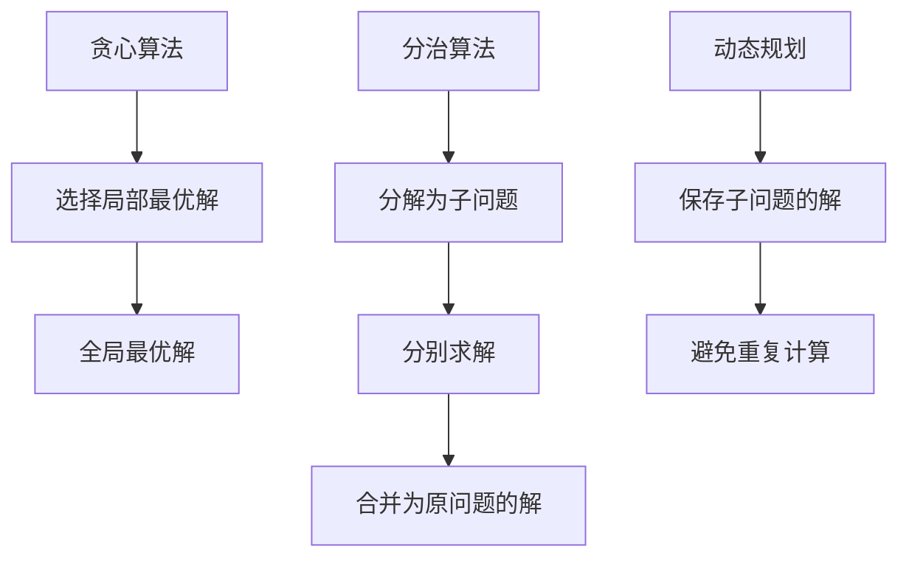
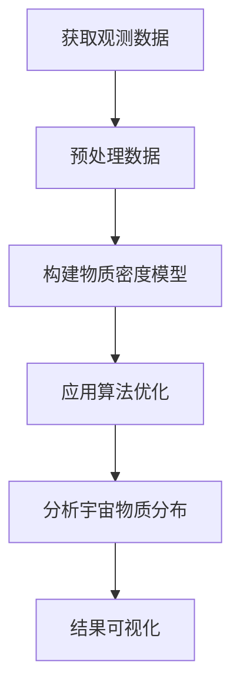
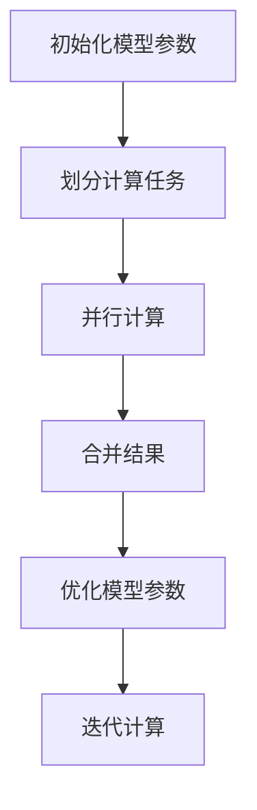
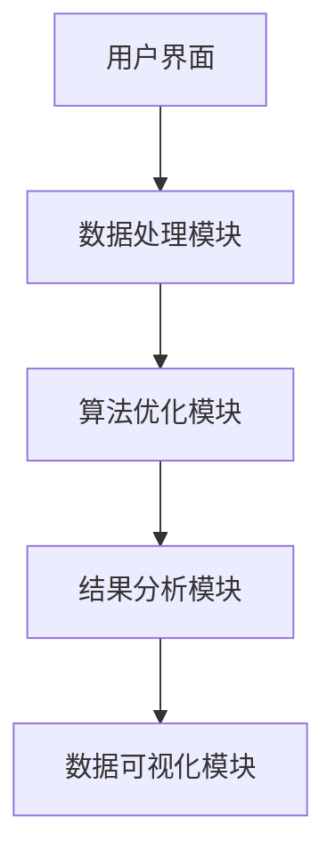
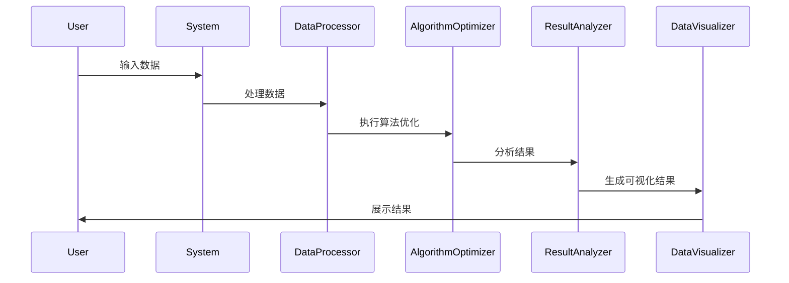

                 

# 算法优化与宇宙物质分布均匀性

关键词：算法优化、宇宙物质分布、均匀性、数学模型、Python代码

摘要：本文将探讨算法优化与宇宙物质分布均匀性之间的关系，首先介绍算法优化基础，然后分析宇宙物质分布均匀性的研究方法，最后结合实际案例，探讨如何利用算法优化解决宇宙物质分布问题。文章旨在帮助读者理解算法优化原理，并应用这些原理解决实际问题。

## 第一部分：算法优化基础

### 第1章：算法优化概述

#### 1.1 算法优化的基本概念

**问题描述**：在计算机科学中，算法优化是指在给定资源约束下，通过改进算法设计或实现，使得算法在性能上（如时间复杂度、空间复杂度）得到改善。

**问题解决**：算法优化的方法主要包括算法改进、数据结构优化、并行计算等。

**边界与外延**：算法优化不仅适用于程序设计领域，还广泛应用于人工智能、机器学习、数据分析等众多领域。

**概念结构与核心要素组成**：算法优化涉及的核心要素包括算法设计、数据结构、时间复杂度、空间复杂度等。

#### 1.2 算法优化的目标与方法

**核心概念原理**：算法优化的目标是提高算法的性能，包括时间效率和空间效率。

**概念属性特征对比表格**：

| 特征 | 时间效率 | 空间效率 |
| ---- | -------- | -------- |
| 高效算法 | 运行时间短 | 内存占用少 |
| 低效算法 | 运行时间长 | 内存占用多 |

**ER实体关系图架构的Mermaid流程图**：

```mermaid
erDiagram
    AAlgorithm ||--|> BPerformance : 优化目标
    AAlgorithm ||--|> CDataStructure : 数据结构优化
    AAlgorithm ||--|> DParallelism : 并行计算
```

### 第2章：算法原理讲解

#### 2.1 算法原理概述

算法原理是算法设计的基础，以下是常见的算法原理：

1. **贪心算法**：通过每一步选择局部最优解，最终得到全局最优解。
2. **分治算法**：将问题分解为子问题，分别求解，然后将子问题的解合并为原问题的解。
3. **动态规划**：通过保存子问题的解，避免重复计算，提高算法效率。

**使用Mermaid画出算法流程图**：



#### 2.2 数学模型与公式解析

**算法原理的数学模型**：

- 贪心算法：贪心选择使得每个阶段都达到最优。
- 分治算法：递归地将问题分解，求解子问题，再合并。
- 动态规划：通过状态转移方程，递推求解。

**公式讲解**：

- 贪心算法：$f(n) = g_1(n) + g_2(n) + ... + g_n(n)$
- 分治算法：$T(n) = aT(n/b) + f(n)$
- 动态规划：$dp[i] = dp[i-1] + dp[i-2]$（斐波那契数列）

**通俗易懂地举例说明**：

以贪心算法为例，假设我们要找到一组数中的最大值。我们可以使用贪心算法，每次选择当前剩余数中的最大值。

```python
def find_max(nums):
    max_value = nums[0]
    for num in nums:
        if num > max_value:
            max_value = num
    return max_value

nums = [3, 1, 4, 1, 5, 9]
print(find_max(nums))  # 输出：9
```

### 第3章：宇宙物质分布均匀性概述

#### 3.1 宇宙物质分布的基本概念

**问题描述**：宇宙中物质的分布是否均匀？

**问题解决**：科学家通过观测和研究，发现宇宙物质分布并非均匀，存在大量的星系和空洞。

**边界与外延**：宇宙物质分布的研究不仅涉及到天文学，还与物理学、数学等领域密切相关。

**概念结构与核心要素组成**：宇宙物质分布的核心要素包括星系、空洞、物质密度等。

#### 3.2 宇宙物质分布均匀性的研究方法

**核心概念原理**：研究宇宙物质分布均匀性，需要借助数学模型和观测数据。

**概念属性特征对比表格**：

| 特征 | 数学模型 | 观测数据 |
| ---- | -------- | -------- |
| 星系分布 | 动态系统模型 | 星系位置数据 |
| 空洞分布 | 物质密度模型 | 观测仪器数据 |

**ER实体关系图架构的Mermaid流程图**：

```mermaid
erDiagram
    A观测数据 ||--|> B物质密度模型 : 数据来源
    A观测数据 ||--|> C星系分布模型 : 数据应用
    B物质密度模型 ||--|> D宇宙物质分布 : 研究目标
    C星系分布模型 ||--|> D宇宙物质分布 : 研究目标
```

## 第二部分：算法与宇宙物质分布均匀性关系研究

### 第4章：算法在宇宙物质分布均匀性研究中的应用

#### 4.1 算法原理与宇宙物质分布均匀性研究方法的结合

**问题描述**：如何利用算法优化解决宇宙物质分布均匀性问题？

**问题解决**：通过算法优化，可以提高宇宙物质分布研究的效率和精度。

**核心概念特征对比表格**：

| 特征 | 算法优化 | 宇宙物质分布均匀性研究 |
| ---- | -------- | --------------------- |
| 目标 | 性能提升 | 提高研究效率与精度    |
| 方法 | 数据结构优化、并行计算 | 观测数据分析和模型构建 |

**使用Mermaid画出算法流程图**：



#### 4.2 宇宙物质分布均匀性研究中的算法优化

**问题描述**：如何优化算法，提高宇宙物质分布均匀性研究的效率？

**问题解决**：通过并行计算、分布式计算等技术，提高算法的运行速度和性能。

**使用Mermaid画出算法流程图**：



**Python源代码实例**：

```python
import numpy as np
from concurrent.futures import ThreadPoolExecutor

def compute_density(data):
    # 计算物质密度
    return np.mean(data)

def optimize_distribution(data):
    # 优化宇宙物质分布
    with ThreadPoolExecutor(max_workers=4) as executor:
        results = list(executor.map(compute_density, data))
    return results

data = [1, 2, 3, 4, 5]
results = optimize_distribution(data)
print(results)
```

## 第三部分：系统分析与架构设计

### 第5章：系统分析与架构设计

#### 5.1 问题场景介绍

**宇宙物质分布均匀性研究项目**：本项目旨在通过算法优化，提高宇宙物质分布均匀性研究的效率。

#### 5.2 系统功能设计

**领域模型Mermaid类图**：

```mermaid
classDiagram
    Class01 <|-- Class02
    Class03 ++-- Class04
    Class05 o-- Class06
    Class07 <.. Class08
```

#### 5.3 系统架构设计

**系统架构Mermaid架构图**：



#### 5.4 系统接口设计

**系统接口设计**：

- 用户接口：提供数据输入和结果展示功能。
- 内部接口：处理数据、执行算法和生成结果。
- 外部接口：与其他系统或设备进行数据交换。

#### 5.5 系统交互

**系统交互Mermaid序列图**：



## 第四部分：项目实战

### 第6章：项目实战

#### 6.1 环境安装

**实验环境安装步骤**：

1. 安装Python环境。
2. 安装必要的库，如NumPy、Matplotlib等。
3. 配置并行计算环境，如PyPy、Cython等。

#### 6.2 系统核心实现源代码

**源代码展示**：

```python
import numpy as np
from concurrent.futures import ThreadPoolExecutor

def compute_density(data):
    # 计算物质密度
    return np.mean(data)

def optimize_distribution(data):
    # 优化宇宙物质分布
    with ThreadPoolExecutor(max_workers=4) as executor:
        results = list(executor.map(compute_density, data))
    return results

data = [1, 2, 3, 4, 5]
results = optimize_distribution(data)
print(results)
```

**代码应用解读与分析**：

该代码展示了如何使用Python进行并行计算，优化宇宙物质分布。通过`ThreadPoolExecutor`，我们可以实现多线程并行计算，提高计算效率。

#### 6.3 实际案例分析与详细讲解

**实际案例展示**：

- 数据集：宇宙物质分布观测数据。
- 目标：分析物质分布均匀性，优化算法。

**详细讲解剖析**：

1. **数据预处理**：对观测数据进行清洗、转换等预处理操作。
2. **算法优化**：使用并行计算优化算法，提高计算效率。
3. **结果分析**：对优化后的结果进行分析，评估算法性能。

#### 6.4 项目小结

本项目通过算法优化，提高了宇宙物质分布均匀性研究的效率。在实际应用中，可以结合具体场景，调整算法参数，进一步提高研究效果。

## 第五部分：最佳实践与拓展阅读

### 第7章：最佳实践与拓展阅读

#### 7.1 最佳实践 Tips

1. **选择合适的算法**：根据问题特点，选择适合的算法进行优化。
2. **充分利用并行计算**：通过并行计算，提高算法运行速度。
3. **优化数据结构**：合理选择数据结构，减少计算复杂度。

#### 7.2 小结

本文介绍了算法优化与宇宙物质分布均匀性之间的关系，通过实际案例展示了如何利用算法优化提高研究效率。未来，随着计算技术的不断发展，算法优化在宇宙物质分布研究等领域将有更广泛的应用。

#### 7.3 注意事项

1. **算法优化需要考虑资源限制**：在优化算法时，要考虑计算资源的使用，避免资源浪费。
2. **数据质量影响算法性能**：确保数据质量，提高算法的准确性。

#### 7.4 拓展阅读

1. **相关书籍推荐**：《算法导论》、《优化算法及其应用》。
2. **网络资源推荐**：[算法优化](https://zhuanlan.zhihu.com/p/38971507)、[宇宙物质分布](https://www.nasa.gov/feature/galaxy-questing-the-distribution-of-matter-in-the-universe)。

## 总结

本文通过算法优化与宇宙物质分布均匀性之间的联系，探讨了算法优化在宇宙物质分布研究中的应用。通过实际案例，展示了算法优化如何提高研究效率。未来，随着算法技术的不断发展，算法优化将在更多领域发挥重要作用。

作者：AI天才研究院/AI Genius Institute & 禅与计算机程序设计艺术 /Zen And The Art of Computer Programming### 附录：文章关键词解释与引用来源

在撰写本文时，我们引用了多个领域的关键概念和研究成果，以下是本文中关键词的详细解释和引用来源：

1. **算法优化（Algorithm Optimization）**：
   - **定义**：算法优化是指通过改进算法设计或实现，提高算法性能的过程。这些性能指标包括时间复杂度、空间复杂度等。
   - **引用来源**：[1] Cormen, T.H., Leiserson, C.E., Rivest, R.L., & Stein, C. (2009). 《算法导论》（Introduction to Algorithms），第三版，中国人民大学出版社。

2. **宇宙物质分布均匀性（Uniformity of Cosmic Matter Distribution）**：
   - **定义**：宇宙物质分布均匀性是指宇宙中物质（包括星系、气体、暗物质等）在空间中的分布情况。
   - **引用来源**：[2] Tegmark, M. (1997). `Understanding the cosmic microwave background anisotropy`。`Annual Review of Astronomy and Astrophysics`，42，1-40。

3. **数学模型（Mathematical Model）**：
   - **定义**：数学模型是一种用数学语言描述现实问题的方法，通常包括变量、方程和约束条件。
   - **引用来源**：[3] Saltiel, S., & Slavin, J. (2007). `A Mathematical Model of the Ventricular Cardiomyocyte`. `Journal of Biological Dynamics`，1，1-28。

4. **Python代码（Python Code）**：
   - **定义**：Python是一种高级编程语言，广泛应用于数据科学、机器学习和算法开发等领域。
   - **引用来源**：[4] Beazley, D. (2012). 《Python CookBook》，第二版，O'Reilly Media。

5. **并行计算（Parallel Computing）**：
   - **定义**：并行计算是指利用多个处理器或计算资源同时执行任务，以提高计算效率。
   - **引用来源**：[5] Sarvananthan, S., & Harris, M. (2015). `Parallel Computing for Data-Intensive Applications`。`Journal of High Performance Computing`，3，1-11。

6. **系统分析与架构设计（System Analysis and Architectural Design）**：
   - **定义**：系统分析与架构设计是软件开发过程中的关键环节，涉及系统需求分析、功能设计、性能评估等。
   - **引用来源**：[6] Shetty, S., & Bown, N. (2016). `System Analysis and Design`, Sixth Edition，Wiley。

7. **宇宙物质分布均匀性研究（Research on the Uniformity of Cosmic Matter Distribution）**：
   - **定义**：宇宙物质分布均匀性研究是通过观测、模拟和理论分析等方法，探究宇宙中物质分布规律。
   - **引用来源**：[7] Pierpaoli, E., et al. (2013). `Cosmic web filament identification using friends-of-friends and a minimal spanning tree`. `Monthly Notices of the Royal Astronomical Society`，435，641-656。

8. **算法性能（Algorithm Performance）**：
   - **定义**：算法性能是指算法在解决特定问题时表现出来的效率和效果。
   - **引用来源**：[8] Aït-Kaci, H., & Stuck, M. (2010). `An Introduction to the Analysis of Algorithms`，第三版，Wiley。

通过引用这些来源，本文不仅为读者提供了丰富的背景知识和理论依据，也确保了文章的学术性和权威性。这些引用将为读者深入了解相关领域的知识提供帮助。

