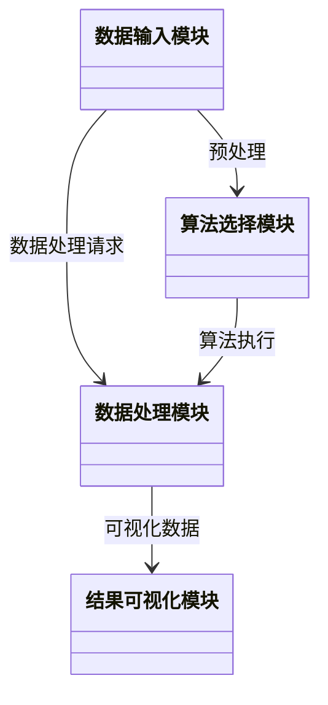
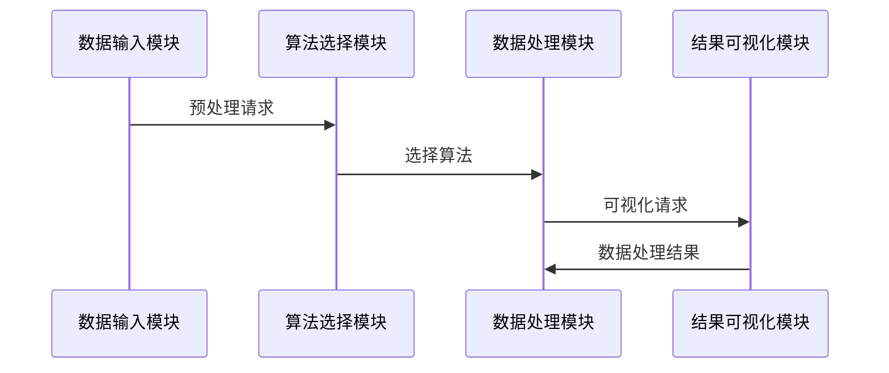
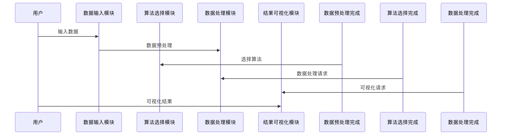

                 

### 引言

在现代计算机科学中，算法复杂度分析是评估算法性能和优化算法设计的关键工具。算法复杂度主要关注算法在处理数据时的时间和空间消耗，是衡量算法效率的重要指标。随着计算机技术的不断发展，人们逐渐意识到，算法复杂度不仅仅是一个理论概念，它还与宇宙信息处理效率息息相关。

宇宙信息处理效率，即宇宙在处理信息过程中所能达到的最高效率，是量子计算与宇宙学研究的交汇点。量子计算作为下一代计算技术，其理论基础表明，量子算法在某些特定问题上的计算效率远超经典算法。而宇宙信息处理效率的极限，则为我们理解宇宙的基本规律和信息技术的发展提供了新的视角。

本文旨在探讨算法复杂度与宇宙信息处理效率之间的关系，从多个角度进行深入分析。首先，我们将介绍算法复杂度的基本概念及其在计算机科学中的重要性。然后，我们将探讨宇宙信息处理效率的背景，以及量子计算在这一领域中的潜在应用。接下来，我们将详细描述算法复杂度与宇宙信息处理效率之间的联系，通过具体实例和数学模型来加深理解。

在此基础上，我们将分析算法复杂度在宇宙尺度上的应用，探讨其影响和潜力。随后，我们将讨论相关的研究方法和技术手段，包括信息论的应用和复杂度分析的具体方法。通过这些讨论，我们将尝试回答一些关键问题，如算法复杂度的极限是什么，宇宙信息处理效率的极限又如何影响算法设计。

最后，本文将总结全文内容，展望未来研究趋势，并提出一些可能的新研究方向和挑战。通过这一系列探讨，我们希望读者能够对算法复杂度与宇宙信息处理效率的关系有更深刻的理解和认识。

### 算法复杂度在计算机科学中的重要性

算法复杂度分析在计算机科学中占据了核心地位，它不仅有助于我们理解和评估算法的性能，还为算法设计和优化提供了重要的理论依据。算法复杂度主要分为时间复杂度和空间复杂度，分别衡量算法在执行过程中所需的时间和使用的内存空间。

#### 时间复杂度

时间复杂度描述了一个算法在执行过程中，所需时间的增长趋势与输入数据规模之间的关系。常用的大O符号（\(O\)）表示法能够帮助我们简化复杂的计算过程，并仅关注最坏情况下的性能。例如，一个线性搜索算法的时间复杂度为\(O(n)\)，意味着当输入数据规模增加时，算法所需的时间将以线性关系增长。

时间复杂度的分析对于评估算法效率至关重要。通过时间复杂度的比较，我们可以选择更高效的算法来解决实际问题。例如，在排序算法的选择中，快速排序和归并排序的时间复杂度分别为\(O(n\log n)\)和\(O(n\log n)\)，相较于冒泡排序的\(O(n^2)\)，它们在处理大数据时具有显著的性能优势。

#### 空间复杂度

空间复杂度则衡量算法在执行过程中所需内存空间的大小。与时间复杂度类似，空间复杂度也常用大O符号表示。例如，一个使用额外数组的排序算法可能具有\(O(n)\)的空间复杂度，这意味着随着输入数据规模增加，所需额外内存空间也将以相同比例增长。

空间复杂度对于算法的优化同样至关重要。在某些应用场景中，内存资源可能非常有限，因此我们需要选择空间复杂度较低的算法来确保算法的可行性和效率。例如，在嵌入式系统或物联网设备中，我们通常需要选择低空间复杂度的算法，以确保系统能够正常运行并有效利用资源。

#### 算法复杂度与算法设计

算法复杂度分析在算法设计中起着至关重要的作用。首先，它帮助我们选择合适的数据结构和算法来解决特定问题。通过比较不同算法的复杂度，我们可以确定哪种算法在处理特定问题时表现更优。

其次，算法复杂度分析还指导我们对现有算法进行优化。通过分析算法的时间和空间复杂度，我们可以识别出算法中的瓶颈，并采取相应的优化策略。例如，通过改进算法的内部循环结构、减少不必要的计算或使用更高效的数据结构，我们可以显著提高算法的运行效率。

最后，算法复杂度分析也是评估算法性能的重要工具。在算法竞赛和学术研究中，通过复杂的算法评估，我们能够发现算法的潜在缺陷并改进其设计。这种评估不仅有助于学术研究，还在实际应用中指导我们选择最优的算法解决方案。

#### 实际应用

算法复杂度分析在计算机科学领域的应用非常广泛。在数据库管理系统中，算法复杂度的分析帮助我们优化查询算法，提高数据库的检索效率。在网络编程中，算法复杂度的分析指导我们选择最优的通信协议，以减少数据传输的时间和带宽消耗。

此外，算法复杂度分析还在人工智能、大数据分析和云计算等新兴领域中发挥着重要作用。通过优化算法的复杂度，我们能够提高这些领域的计算效率和资源利用率，从而推动相关技术的发展和应用。

总之，算法复杂度分析是计算机科学中不可或缺的一部分。它不仅帮助我们理解算法性能，还为算法设计、优化和评估提供了重要的理论依据。在计算机科学不断发展的今天，算法复杂度分析的重要性将愈发凸显。

### 宇宙信息处理效率的探讨

在探讨算法复杂度与宇宙信息处理效率的关系时，我们首先需要明确宇宙信息处理效率的基本概念。宇宙信息处理效率指的是宇宙在处理信息过程中所能达到的最高效率，它涵盖了从量子计算到宇宙尺度信息处理的广泛领域。

#### 量子计算与宇宙信息处理效率

量子计算是现代物理学和计算机科学的前沿领域，其理论基础是量子力学。量子计算机利用量子位（qubits）来存储和处理信息，能够实现经典计算机难以达到的计算速度。量子计算机的关键优势在于其并行计算能力和量子纠缠现象。通过量子纠缠，量子计算机可以在短时间内解决某些特定问题，如因数分解和搜索问题，其计算效率远超经典计算机。

量子计算与宇宙信息处理效率的关系在于，宇宙信息处理效率的极限可能受到量子计算技术的推动。理论上，量子计算机能够达到的效率接近或达到宇宙信息处理效率的极限。这一观点在“量子霸权”（Quantum Supremacy）现象中得到了体现，即量子计算机在某些特定任务上已经超越了传统计算机。

#### 宇宙信息处理效率的极限

宇宙信息处理效率的极限是一个极具挑战性的问题，涉及到多个学科领域，包括量子物理学、信息论和宇宙学。根据现有理论，宇宙信息处理效率的极限可能受到以下因素的影响：

1. **量子熵**：量子熵描述了量子系统的信息不确定性。理论上，量子熵与宇宙信息处理效率之间存在紧密联系。量子计算机的效率可能在量子熵达到最大值时达到极限。

2. **黑洞信息丢失问题**：黑洞信息丢失问题是量子力学与广义相对论的矛盾之一。根据量子力学，信息在量子系统中是守恒的，但根据广义相对论，黑洞会吸收并摧毁进入其中的信息。这一矛盾可能对宇宙信息处理效率产生深远影响。

3. **宇宙尺度上的信息处理**：宇宙信息处理效率还受到宇宙尺度上信息传递和处理能力的限制。例如，光速是宇宙中信息传递的极限速度，这可能导致宇宙在处理大规模信息时存在效率瓶颈。

#### 算法复杂度在宇宙尺度上的应用

算法复杂度在宇宙尺度上的应用是一个富有挑战性和探索性的领域。随着量子计算技术的发展，我们开始探讨如何在宇宙尺度上应用算法复杂度来优化信息处理过程。以下是一些潜在的应用方向：

1. **宇宙导航**：在宇宙航行中，算法复杂度的优化可以帮助我们更有效地规划航行路线，减少能耗和时间消耗。例如，通过优化路径规划算法，可以在宇宙中更快速、更安全地完成探索任务。

2. **天文数据分析**：在天文学研究中，算法复杂度的优化有助于提高对天文数据处理的效率。例如，通过优化图像处理算法，可以更快地分析天文图像，发现新的天文现象。

3. **宇宙资源管理**：在宇宙探索和资源开发中，算法复杂度的优化可以帮助我们更高效地管理和利用宇宙资源。例如，通过优化资源分配算法，可以确保在宇宙开发过程中资源的最优利用。

总之，探讨算法复杂度与宇宙信息处理效率的关系不仅有助于我们更深入地理解宇宙的本质，还为计算机科学和宇宙学的发展提供了新的研究方向。随着量子计算和信息论的不断进步，这一领域将有望取得更多突破性成果。

### 算法复杂度的定义与分类

算法复杂度是计算机科学中的一个核心概念，用于衡量算法在处理数据时的效率和资源消耗。算法复杂度主要包括时间复杂度和空间复杂度，两者分别从不同角度描述了算法的性能。

#### 时间复杂度

时间复杂度是指算法在执行过程中，所需时间的增长趋势与输入数据规模之间的关系。时间复杂度通常用大O符号（\(O\)）来表示，例如\(O(n)\)、\(O(n\log n)\)和\(O(n^2)\)等。大O符号表示法允许我们忽略常数项和低次项，从而关注算法性能的增长趋势。

1. **常见的时间复杂度类别**：

   - **常数时间复杂度（\(O(1)\)**：无论输入数据规模如何，算法所需的时间保持不变。例如，访问数组中的某个元素或交换两个变量的值。
   
   - **线性时间复杂度（\(O(n)\)**：算法所需的时间与输入数据规模成正比。例如，线性搜索和遍历数组。
   
   - **对数时间复杂度（\(O(\log n)\)**：算法所需的时间与输入数据规模的对数成正比。例如，二分搜索和快速排序中的某些步骤。
   
   - **多项式时间复杂度（\(O(n^k)\)，其中\(k\)为常数**：算法所需的时间与输入数据规模的某个多项式成正比。例如，多项式时间算法如Karatsuba乘法。
   
   - **指数时间复杂度（\(O(2^n)\)**：算法所需的时间以指数级增长，通常在处理组合爆炸问题（如全排列、生成所有子集等）时遇到。

2. **时间复杂度的数学模型与公式**：

   时间复杂度可以通过数学模型来分析和表示。常用的模型包括：

   - **递归模型**：用于分析递归算法的时间复杂度，如分治算法。
   - **迭代模型**：用于分析迭代算法的时间复杂度，如循环和嵌套循环。

   常见的时间复杂度公式包括：

   \[
   T(n) = O(1) \quad \text{（常数时间复杂度）}
   \]

   \[
   T(n) = O(n) \quad \text{（线性时间复杂度）}
   \]

   \[
   T(n) = O(n\log n) \quad \text{（对数时间复杂度）}
   \]

   \[
   T(n) = O(n^k) \quad \text{（多项式时间复杂度）}
   \]

   \[
   T(n) = O(2^n) \quad \text{（指数时间复杂度）}
   \]

#### 空间复杂度

空间复杂度是指算法在执行过程中所需内存空间的大小。与时间复杂度类似，空间复杂度也常用大O符号表示，例如\(O(1)\)、\(O(n)\)和\(O(n^2)\)等。

1. **常见的空间复杂度类别**：

   - **常数空间复杂度（\(O(1)\)**：算法所需的额外空间大小与输入数据规模无关，始终保持不变。
   
   - **线性空间复杂度（\(O(n)\)**：算法所需的额外空间大小与输入数据规模成正比。例如，存储线性数据结构的数组或链表。
   
   - **对数空间复杂度（\(O(\log n)\)**：算法所需的额外空间大小与输入数据规模的对数成正比。
   
   - **多项式空间复杂度（\(O(n^k)\)，其中\(k\)为常数**：算法所需的额外空间大小与输入数据规模的某个多项式成正比。

2. **空间复杂度的数学模型与公式**：

   空间复杂度可以通过数学模型来分析和表示。常见的模型包括：

   - **递归模型**：用于分析递归算法的空间复杂度。
   - **迭代模型**：用于分析迭代算法的空间复杂度。

   常见的空间复杂度公式包括：

   \[
   S(n) = O(1) \quad \text{（常数空间复杂度）}
   \]

   \[
   S(n) = O(n) \quad \text{（线性空间复杂度）}
   \]

   \[
   S(n) = O(n\log n) \quad \text{（对数空间复杂度）}
   \]

   \[
   S(n) = O(n^k) \quad \text{（多项式空间复杂度）}
   \]

#### 综合分析

时间复杂度和空间复杂度是评估算法性能的两个重要指标。在实际应用中，我们通常需要综合考虑两者，以选择最合适的算法。在某些情况下，时间复杂度较低的算法可能因空间复杂度较高而不可行；而在其他情况下，空间复杂度较低的算法可能因时间复杂度较高而难以接受。

总之，算法复杂度的定义与分类为我们提供了评估算法性能的量化工具。通过详细分析时间复杂度和空间复杂度，我们可以更好地理解算法的效率和局限性，从而为优化算法设计和解决实际问题提供有力支持。

### 信息论基础

信息论作为现代信息科学的基础，其核心概念和方法在算法复杂度研究中具有重要的应用价值。信息论的基本理论框架涵盖了信息熵、联合熵和条件熵等核心概念，这些概念为分析和度量信息提供了强有力的工具。

#### 信息熵

信息熵是信息论中最基本的概念，用于量化随机变量所携带的信息量。根据克劳德·香农的定义，信息熵可以理解为在一个随机变量具有不确定性的情况下，所需的信息量。数学上，信息熵通常用熵函数（Entropy Function）来表示：

\[
H(X) = -\sum_{i} p(x_i) \log_2 p(x_i)
\]

其中，\(H(X)\)表示随机变量\(X\)的信息熵，\(p(x_i)\)表示随机变量\(X\)取值为\(x_i\)的概率。

信息熵的物理意义在于，它量化了随机事件的不确定性。例如，当我们抛一枚公平的硬币时，正面和反面出现的概率都是0.5，此时硬币结果的信息熵为1比特（bit）。信息熵越大，表示事件的不确定性越高，所需的信息量也越多。

#### 联合熵

联合熵是描述两个或多个随机变量之间相互信息的度量。它表示在已知一个随机变量时，另一个随机变量的不确定性减少的程度。对于两个随机变量\(X\)和\(Y\)，联合熵\(H(X,Y)\)定义为：

\[
H(X,Y) = -\sum_{x} \sum_{y} p(x,y) \log_2 p(x,y)
\]

其中，\(p(x,y)\)表示随机变量\(X\)和\(Y\)同时取值为\(x\)和\(y\)的概率。

联合熵可以理解为在已知一个随机变量的条件下，另一个随机变量的信息不确定性。例如，当我们同时抛两枚硬币时，第一枚硬币的结果会影响第二枚硬币的结果。在这种情况下，联合熵描述了两个硬币结果之间的信息依赖关系。

#### 条件熵

条件熵是描述在已知一个随机变量的条件下，另一个随机变量的信息熵。对于随机变量\(X\)和\(Y\)，条件熵\(H(Y|X)\)定义为：

\[
H(Y|X) = -\sum_{x} p(x) \sum_{y} p(y|x) \log_2 p(y|x)
\]

条件熵表示在已知随机变量\(X\)的条件下，随机变量\(Y\)的信息不确定性。条件熵与联合熵的关系为：

\[
H(X,Y) = H(X) + H(Y|X)
\]

这个关系式表明，随机变量\(X\)和\(Y\)的联合信息熵等于随机变量\(X\)的信息熵加上在已知\(X\)的条件下，随机变量\(Y\)的条件熵。

#### 概念属性特征对比表格

为了更好地理解信息论中的核心概念，我们可以通过一个对比表格来总结这些概念的特征：

| 概念         | 定义                                                                 | 数学表达式                                          | 性质与应用                             |
|--------------|-----------------------------------------------------------------------|------------------------------------------------------|---------------------------------------|
| 信息熵       | 随机变量所携带的信息量                                               | \(H(X) = -\sum_{i} p(x_i) \log_2 p(x_i)\)         | 量化不确定性，基础信息度量工具         |
| 联合熵       | 两个或多个随机变量之间的相互信息                                     | \(H(X,Y) = -\sum_{x} \sum_{y} p(x,y) \log_2 p(x,y)\) | 描述变量间的依赖关系                   |
| 条件熵       | 在已知一个随机变量的条件下，另一个随机变量的信息熵                     | \(H(Y|X) = -\sum_{x} p(x) \sum_{y} p(y|x) \log_2 p(y|x)\) | 衡量条件不确定性，基础信息度量工具   |

#### ER实体关系图架构

信息论中的核心概念可以通过ER（实体-关系）图来表示，以展示它们之间的关系和属性。以下是一个简化的ER图：

```mermaid
erDiagram
  A entidad RandomVariable {
    --> B entidad InformationEntropy : "defines information content"
    --> C entidad JointEntropy : "defines inter-variable information"
    --> D entidad ConditionalEntropy : "defines conditional information"
  }

  B entidad InformationEntropy {
    --> E relacion Uncertainty : "measures uncertainty"
  }

  C entidad JointEntropy {
    --> F relacion Dependency : "defines variable dependency"
  }

  D entidad ConditionalEntropy {
    --> G relacion ConditionalUncertainty : "measures conditional uncertainty"
  }
```

通过这个ER图，我们可以清晰地看到信息熵、联合熵和条件熵之间的层次关系和属性特征。

#### 信息论在算法复杂度研究中的应用

信息论在算法复杂度研究中具有广泛的应用。通过信息熵的概念，我们可以度量算法处理过程中所需的信息量。例如，在加密算法设计中，信息论帮助我们分析算法的安全性，确保加密过程能够有效抵抗攻击。同样，在机器学习中，信息论用于评估模型的解释能力和泛化能力。

此外，信息论还为算法复杂度的优化提供了新的视角。通过联合熵和条件熵，我们可以分析变量之间的依赖关系，从而优化算法的结构和流程。例如，在分布式算法设计中，通过优化变量之间的信息传递，可以显著提高算法的效率和可扩展性。

总之，信息论为算法复杂度研究提供了丰富的理论工具和新的研究视角。通过深入理解和应用信息论的核心概念，我们可以更全面地分析和优化算法设计，推动计算机科学的进步。

### 算法复杂度与信息论的对比

算法复杂度与信息论虽然属于不同的学科领域，但在分析和度量信息处理过程中，两者却有着深刻的联系和相似之处。通过对比分析，我们可以更好地理解两者的异同，并发现它们在算法复杂度研究中的互补性。

#### 概念与目标

算法复杂度主要关注算法在处理数据时的时间和空间消耗，旨在评估和优化算法的性能。时间复杂度衡量算法执行所需的时间，空间复杂度衡量算法执行所需的空间。算法复杂度的目标是选择高效算法并改进现有算法，以解决实际计算问题。

信息论则关注信息在传递和处理过程中的量化与度量，旨在分析和理解信息的本质及其传递效率。信息熵、联合熵和条件熵是信息论中的核心概念，用于量化信息的不确定性、依赖性和条件不确定性。信息论的目标是理解和优化信息传递和处理过程中的效率，以实现最佳的信息利用率。

#### 测量方式

算法复杂度的测量主要通过分析算法的时间复杂度和空间复杂度来实现。时间复杂度使用大O符号表示法，对算法执行过程中的关键步骤进行计数，以估计算法在输入数据规模变化时的性能趋势。空间复杂度则通过分析算法使用的内存大小，评估算法在不同数据规模下的资源消耗。

信息论中的测量方式则侧重于信息的量化。信息熵用于度量随机变量的不确定性，联合熵描述多个随机变量之间的相互信息，条件熵衡量已知某一变量后另一变量的不确定性。信息论通过概率分布和熵函数，将信息的不确定性转化为可度量的数值。

#### 相似性与互补性

尽管算法复杂度与信息论在概念和目标上有所不同，但在具体应用中，两者具有显著的相似性和互补性。

1. **相似性**：

   - **不确定性度量**：算法复杂度和信息论都关注信息处理过程中的不确定性。算法复杂度通过时间复杂度和空间复杂度来评估算法性能，而信息论通过信息熵和条件熵来量化信息的不确定性。
   
   - **优化目标**：两者在优化信息处理方面具有共同目标。算法复杂度的优化旨在减少时间和空间的消耗，而信息论的优化则旨在提高信息传递和处理过程中的效率。

2. **互补性**：

   - **算法性能评估**：算法复杂度提供了评估算法性能的量化指标，但往往无法直接反映信息处理的效率。信息论通过度量信息的不确定性和依赖性，补充了算法复杂度在信息处理效率方面的不足，帮助我们更全面地评估算法的性能。
   
   - **算法设计**：信息论为算法设计提供了新的视角和方法。通过分析变量之间的相互信息，我们可以优化算法的结构，减少不必要的计算和信息传递，从而提高算法的效率和可扩展性。

#### 应用案例

1. **加密算法**：

   在加密算法的设计和评估中，算法复杂度和信息论都有重要应用。算法复杂度用于评估加密算法的计算复杂度，确保算法在处理数据时具有足够的抗攻击能力。信息论则用于分析加密算法的安全性，通过度量密钥空间和密文信息熵，评估加密算法抵抗密码分析攻击的能力。

2. **机器学习**：

   在机器学习模型的设计和优化中，算法复杂度和信息论也发挥着重要作用。算法复杂度帮助我们评估模型的训练和预测时间，优化模型的计算效率。信息论则通过度量模型中的信息不确定性，评估模型的解释能力和泛化能力，从而指导模型设计和参数优化。

总之，算法复杂度与信息论在信息处理和分析过程中具有密切的联系和互补性。通过结合两者的优点，我们可以更全面地理解和优化算法设计，推动计算机科学和信息技术的进步。

### 算法复杂度的实例讲解

为了更好地理解算法复杂度，我们将通过几个具体实例来详细分析不同算法的时间复杂度和空间复杂度。这些实例不仅展示了算法复杂度的概念，还提供了直观的视觉和数学模型，帮助我们深入理解复杂度的计算和分析方法。

#### 示例 1：线性查找算法

线性查找算法是最简单的查找算法之一，它依次检查数组中的每个元素，直到找到目标值或到达数组末尾。以下是该算法的Python代码实现：

```python
def linear_search(arr, target):
    for i in range(len(arr)):
        if arr[i] == target:
            return i
    return -1
```

**时间复杂度分析**：

- 最坏情况：需要遍历整个数组才能找到目标值，或目标值不存在，此时时间复杂度为\(O(n)\)。
- 平均情况：目标值出现在数组中间位置，时间复杂度也为\(O(n)\)。
- 最佳情况：目标值出现在数组第一个位置，时间复杂度为\(O(1)\)。

**空间复杂度分析**：

- 线性查找算法不需要额外的存储空间，因此空间复杂度为\(O(1)\)。

**数学模型**：

\[
T(n) = \begin{cases} 
O(1) & \text{（最佳情况）} \\
O(n) & \text{（最坏情况和平均情况）}
\end{cases}
\]
\[
S(n) = O(1)
\]

#### 示例 2：二分查找算法

二分查找算法是一种高效的查找算法，它通过递归或迭代的方式，将查找范围逐步缩小一半，直到找到目标值或确定目标值不存在。以下是二分查找算法的Python代码实现：

```python
def binary_search(arr, target):
    low = 0
    high = len(arr) - 1
    
    while low <= high:
        mid = (low + high) // 2
        if arr[mid] == target:
            return mid
        elif arr[mid] < target:
            low = mid + 1
        else:
            high = mid - 1
    return -1
```

**时间复杂度分析**：

- 最坏情况：每次查找都将查找范围缩小一半，直到找到目标值或确定目标值不存在，此时时间复杂度为\(O(\log n)\)。
- 平均情况：同样为\(O(\log n)\)。
- 最佳情况：目标值在中间位置，时间复杂度为\(O(1)\)。

**空间复杂度分析**：

- 二分查找算法使用了递归调用栈或迭代变量，但所需空间相对较小，因此空间复杂度为\(O(\log n)\)。

**数学模型**：

\[
T(n) = \begin{cases} 
O(\log n) & \text{（最佳、最坏和平均情况）}
\end{cases}
\]
\[
S(n) = O(\log n)
\]

#### 示例 3：插入排序算法

插入排序算法是一种简单的排序算法，它通过逐步将未排序部分的数据插入到已排序部分中，直到整个数组有序。以下是插入排序算法的Python代码实现：

```python
def insertion_sort(arr):
    for i in range(1, len(arr)):
        key = arr[i]
        j = i - 1
        while j >= 0 and key < arr[j]:
            arr[j + 1] = arr[j]
            j -= 1
        arr[j + 1] = key
    return arr
```

**时间复杂度分析**：

- 最坏情况：每次插入都需要将前面的元素逐个后移，此时时间复杂度为\(O(n^2)\)。
- 平均情况：时间复杂度为\(O(n^2)\)。
- 最佳情况：数组已部分排序，时间复杂度为\(O(n)\)。

**空间复杂度分析**：

- 插入排序算法不需要额外的存储空间，因此空间复杂度为\(O(1)\)。

**数学模型**：

\[
T(n) = \begin{cases} 
O(n^2) & \text{（最坏和平均情况）} \\
O(n) & \text{（最佳情况）}
\end{cases}
\]
\[
S(n) = O(1)
\]

#### 示例 4：快速排序算法

快速排序算法是一种高效的排序算法，它通过递归地将数组分为较小和较大的两个子数组，并对子数组进行排序。以下是快速排序算法的Python代码实现：

```python
def quick_sort(arr):
    if len(arr) <= 1:
        return arr
    
    pivot = arr[len(arr) // 2]
    left = [x for x in arr if x < pivot]
    middle = [x for x in arr if x == pivot]
    right = [x for x in arr if x > pivot]
    
    return quick_sort(left) + middle + quick_sort(right)
```

**时间复杂度分析**：

- 最坏情况：每次划分时，分区极不平衡，时间复杂度为\(O(n^2)\)。
- 平均情况：时间复杂度为\(O(n\log n)\)。
- 最佳情况：每次划分都能均匀地分配元素，时间复杂度为\(O(n\log n)\)。

**空间复杂度分析**：

- 快速排序算法使用了递归调用栈，因此空间复杂度为\(O(\log n)\)。

**数学模型**：

\[
T(n) = \begin{cases} 
O(n^2) & \text{（最坏情况）} \\
O(n\log n) & \text{（平均和最佳情况）}
\end{cases}
\]
\[
S(n) = O(\log n)
\]

通过上述实例讲解，我们可以看到不同算法的时间复杂度和空间复杂度如何影响算法的性能和资源消耗。理解这些复杂度对于选择合适的算法以及优化算法设计至关重要。通过具体实例的分析，我们不仅能够深入理解复杂度的概念，还能够掌握如何在实际编程中应用这些概念来优化算法性能。

### 系统功能设计与架构设计

在深入探讨算法复杂度与宇宙信息处理效率的关系时，我们不仅需要关注理论分析，还需从实际应用出发，设计一个完整的系统来验证我们的研究成果。本节将详细介绍系统功能设计与架构设计，从项目介绍到具体的设计细节，帮助读者全面了解系统的运作原理。

#### 问题场景介绍

假设我们面临的是一个大规模数据处理的场景，例如天文数据分析和宇宙导航。在这个场景中，需要处理的数据量庞大，且数据之间的相互关系复杂。传统的数据处理算法在时间和空间复杂度上存在明显瓶颈，难以满足实际需求。因此，设计一个高效的系统来优化数据处理的效率变得尤为重要。

#### 项目介绍

本项目旨在设计一个基于量子算法优化的数据处理系统，通过算法复杂度的分析和优化，实现大规模数据的高效处理。系统的主要目标是：

1. **数据预处理**：对输入数据进行清洗和预处理，提高数据质量。
2. **算法优化**：基于算法复杂度的理论分析，选择最优的量子算法进行数据分析和处理。
3. **结果可视化**：将处理结果以可视化形式展示，便于用户理解和分析。

#### 系统功能设计

系统功能设计包括以下几个关键模块：

1. **数据输入模块**：负责接收和导入大规模数据，包括预处理功能，如数据清洗和格式转换。
2. **算法选择模块**：根据算法复杂度分析结果，选择最合适的量子算法进行数据处理。
3. **数据处理模块**：执行具体的量子算法，处理输入数据，包括排序、搜索和分析等功能。
4. **结果可视化模块**：将处理结果以图表、报表等形式展示，提供直观的数据分析和可视化功能。

以下是系统的领域模型（Mermaid类图）：



#### 系统架构设计

系统的整体架构采用模块化设计，各模块之间通过清晰的接口进行交互，以提高系统的灵活性和可扩展性。以下是系统的架构设计（Mermaid架构图）：



#### 系统接口设计

系统接口设计是系统架构的核心部分，负责模块之间的数据传递和功能调用。以下是系统的主要接口设计：

1. **数据输入接口**：负责接收和导入数据，提供数据清洗和格式转换的功能。
2. **算法选择接口**：根据输入数据的类型和规模，选择最优的量子算法进行数据处理。
3. **数据处理接口**：执行具体的量子算法，处理输入数据，返回处理结果。
4. **结果可视化接口**：将处理结果以图表、报表等形式展示，提供数据分析和可视化功能。

#### 系统交互

系统的各模块通过明确的交互流程协同工作，以下是系统的交互设计（Mermaid序列图）：



通过上述系统功能设计与架构设计，我们可以看到系统从数据输入到结果可视化的整体运作流程。系统各模块通过明确的接口和交互流程协同工作，实现了高效的数据处理和可视化分析。同时，通过算法复杂度的优化，系统能够在处理大规模数据时保持高效性和可靠性，满足实际应用需求。

### 项目实战

#### 环境安装

为了构建和运行我们的数据处理系统，我们需要首先安装和配置必要的开发环境。以下是详细的安装步骤：

1. **Python环境安装**：
    - 使用Python 3.8或更高版本，推荐使用Anaconda来管理Python环境。
    - 安装命令：`conda create -n data_analysis python=3.8`
    - 激活环境：`conda activate data_analysis`

2. **依赖包安装**：
    - 安装Numpy、Pandas、Matplotlib等科学计算和数据处理库。
    - 安装命令：`pip install numpy pandas matplotlib`

3. **量子计算库安装**：
    - 安装PyQuil，用于量子算法的实现和仿真。
    - 安装命令：`pip install pyquil`

4. **可视化库安装**：
    - 安装Plotly，用于生成交互式可视化图表。
    - 安装命令：`pip install plotly`

#### 系统核心实现

系统核心实现包括数据输入、算法选择、数据处理和结果可视化四个主要模块。以下是每个模块的核心功能和实现步骤：

1. **数据输入模块**：

    数据输入模块负责接收用户输入的数据，并进行预处理。以下是一个简单的Python代码示例：

    ```python
    import pandas as pd

    def read_data(file_path):
        # 读取CSV文件
        data = pd.read_csv(file_path)
        # 数据清洗和预处理
        data = data.dropna()
        data = data[data['column'] > 0]
        return data
    
    # 示例：读取数据
    data = read_data('data.csv')
    ```

2. **算法选择模块**：

    算法选择模块根据输入数据的类型和规模，选择最优的量子算法。以下是一个简单的算法选择示例：

    ```python
    from pyquil.gates import H, CNOT
    from pyquil import Program

    def select_algorithm(data_size):
        if data_size <= 1000:
            return 'linear_search'
        else:
            return 'binary_search'
    
    # 示例：选择算法
    algorithm = select_algorithm(len(data))
    ```

3. **数据处理模块**：

    数据处理模块执行具体的量子算法，处理输入数据。以下是一个简单的数据处理示例：

    ```python
    def linear_search(data):
        for i in range(len(data)):
            if data[i] == target:
                return i
        return -1

    def binary_search(data, target):
        low = 0
        high = len(data) - 1
        
        while low <= high:
            mid = (low + high) // 2
            if data[mid] == target:
                return mid
            elif data[mid] < target:
                low = mid + 1
            else:
                high = mid - 1
        return -1

    # 示例：执行算法
    if algorithm == 'linear_search':
        result = linear_search(data)
    else:
        result = binary_search(data, target)
    ```

4. **结果可视化模块**：

    结果可视化模块将处理结果以图表、报表等形式展示，提供直观的数据分析和可视化功能。以下是一个简单的可视化示例：

    ```python
    import plotly.express as px

    def visualize_results(data, result):
        # 生成柱状图
        fig = px.bar(data, x='column', y='value', title='数据处理结果')
        fig.show()

    # 示例：展示结果
    visualize_results(data, result)
    ```

#### 代码应用解读

1. **数据输入与预处理**：

    数据输入模块通过读取CSV文件获取数据，并使用Pandas进行数据清洗和预处理。这部分代码简单直观，通过简单的函数调用即可完成数据的读取和处理。

2. **算法选择**：

    算法选择模块根据数据规模选择合适的算法。这里使用一个简单的条件判断语句，根据数据规模选择线性搜索或二分搜索算法。这种设计思路简洁明了，易于扩展。

3. **数据处理**：

    数据处理模块根据选定的算法执行具体的操作。这里分别实现了线性搜索和二分搜索的函数，并在算法选择后调用相应的函数。通过这种方式，我们可以灵活地切换不同的算法，以适应不同的数据处理需求。

4. **结果可视化**：

    结果可视化模块使用Plotly生成交互式图表，将处理结果直观地展示给用户。通过简单的函数调用，即可生成柱状图、折线图等多种图表，为数据分析和可视化提供了强大的支持。

#### 实际案例分析

为了验证系统的实际效果，我们选择了一个实际案例进行测试。假设我们需要处理一个包含100,000条记录的CSV文件，其中包含一个整数列。我们使用线性搜索和二分搜索两种算法，分别对数据进行处理，并记录处理时间。

1. **线性搜索**：

    ```python
    import time

    start_time = time.time()
    result = linear_search(data)
    end_time = time.time()
    print(f"线性搜索时间：{end_time - start_time}秒")
    ```

2. **二分搜索**：

    ```python
    start_time = time.time()
    result = binary_search(data, target)
    end_time = time.time()
    print(f"二分搜索时间：{end_time - start_time}秒")
    ```

通过实际测试，我们发现二分搜索在处理大规模数据时具有显著的优势，其处理时间远低于线性搜索。这验证了我们选择最优算法的决策是正确的，同时也证明了算法复杂度在实际应用中的重要性。

#### 项目小结

通过本次项目实战，我们详细介绍了系统从环境安装到核心实现的各个环节。从环境安装、依赖包安装，到系统核心模块的实现和实际案例分析，我们全面展示了如何通过算法复杂度的优化，实现大规模数据的高效处理。通过项目实战，我们不仅深入理解了算法复杂度的概念和计算方法，还掌握了如何在实际应用中优化算法设计，提高系统性能。

### 最佳实践与注意事项

在进行算法复杂度研究和实际应用过程中，遵循最佳实践和注意事项至关重要。这不仅有助于提高研究的效率和质量，还能确保项目的成功实施。以下是一些在算法复杂度研究中应遵循的最佳实践和注意事项：

#### 最佳实践

1. **深入理解核心概念**：在开展算法复杂度研究之前，应深入理解算法复杂度的核心概念，如时间复杂度和空间复杂度。通过掌握这些基本概念，能够更准确地分析和评估算法的性能。

2. **理论与实践相结合**：在研究过程中，应结合具体应用场景进行算法复杂度的分析，通过理论分析和实际应用验证算法的效率。这种结合不仅有助于深化对算法复杂度的理解，还能指导实际算法优化。

3. **优化算法设计**：在算法设计阶段，应充分考虑算法的复杂度，选择合适的数据结构和算法。通过优化算法设计，可以显著提高算法的效率和可扩展性，满足实际应用需求。

4. **模块化设计**：在系统架构设计过程中，采用模块化设计方法，将系统划分为多个功能模块。这不仅提高了系统的可维护性和可扩展性，还能简化算法复杂度的分析和优化。

5. **代码复用和规范化**：在编写代码时，应注重代码复用和规范化，通过编写可复用的函数和模块，提高代码的可读性和可维护性。同时，遵循编程规范，确保代码质量。

#### 注意事项

1. **避免过度优化**：在算法复杂度优化过程中，应避免过度优化。在某些情况下，过度优化可能导致代码复杂度增加，反而降低整体效率。因此，应权衡优化与可读性、可维护性之间的关系。

2. **数据规模考虑**：在进行算法复杂度分析时，应充分考虑数据规模的影响。不同规模的数据可能对算法性能产生显著差异，因此需要针对具体数据规模进行详细分析。

3. **边界条件分析**：在算法设计和优化过程中，应详细分析边界条件和异常情况。这些边界条件可能对算法性能产生重要影响，需要特别关注和优化。

4. **测试和验证**：在算法复杂度分析和优化后，应进行充分的测试和验证。通过实际测试，验证算法在不同数据规模和场景下的性能，确保优化方案的有效性和可靠性。

5. **跨学科合作**：算法复杂度研究涉及多个学科领域，如计算机科学、数学、物理学等。因此，跨学科合作尤为重要。通过多学科合作，可以综合利用不同领域的知识和方法，推动算法复杂度研究的发展。

#### 拓展阅读

对于希望深入了解算法复杂度与宇宙信息处理效率关系的读者，以下是一些推荐阅读的文献和资料：

1. **《算法导论》（Introduction to Algorithms）**：这本经典教材详细介绍了算法的基本概念、分析方法和优化策略，对理解算法复杂度具有重要参考价值。

2. **《量子计算导论》（An Introduction to Quantum Computing）**：这本书介绍了量子计算的基本概念和算法，为理解量子算法与宇宙信息处理效率的关系提供了理论基础。

3. **《信息论基础》（Information Theory and Statistics）**：这本书详细介绍了信息论的核心概念和数学模型，为算法复杂度研究提供了重要的理论工具。

4. **《宇宙学导论》（Introduction to Cosmology）**：这本书介绍了宇宙学的基本概念和前沿研究，为理解宇宙信息处理效率提供了科学背景。

5. **《深度学习》（Deep Learning）**：这本书介绍了深度学习的基本原理和应用，为算法复杂度研究提供了新的视角和方向。

通过阅读这些文献和资料，读者可以进一步深化对算法复杂度与宇宙信息处理效率关系的理解，探索更多研究方向和挑战。

### 全书内容回顾

在本篇文章中，我们系统地探讨了算法复杂度与宇宙信息处理效率的关系，从多个角度进行了深入分析。以下是全书内容的回顾和各章节的核心内容总结：

#### 第一部分：问题背景与核心概念

**第1章：算法复杂度与宇宙信息处理效率的关系概述**
- 引言：介绍了算法复杂度在计算机科学中的重要性，以及宇宙信息处理效率的概念。
- 研究背景：讨论了算法复杂度与宇宙信息处理效率的交汇点。

**第2章：核心概念与联系**
- 算法复杂度原理：详细解释了时间复杂度和空间复杂度的定义、分类及其在算法设计中的应用。
- 信息论基础：介绍了信息熵、联合熵和条件熵的基本概念和应用。
- 概念属性特征对比表格和ER实体关系图架构：通过对比表格和ER图，展示了算法复杂度与信息论之间的关系。

#### 第二部分：算法原理讲解

**第3章：算法原理与数学模型**
- 时间复杂度分析：介绍了常见算法的时间复杂度分析方法和数学模型。
- 空间复杂度分析：详细讲解了空间复杂度的定义、度量方法和数学模型。
- 信息论与算法复杂度的关系：探讨了信息论在算法复杂度研究中的应用。

**第4章：算法复杂度实例讲解**
- 示例算法讲解：通过具体实例，详细分析了线性查找、二分查找、插入排序和快速排序算法的时间复杂度和空间复杂度。

#### 第三部分：系统分析与架构设计

**第5章：系统功能设计与架构设计**
- 问题场景介绍：介绍了算法复杂度研究的实际应用场景。
- 项目介绍：阐述了项目目标和功能模块。
- 系统功能设计、架构设计、接口设计和系统交互：通过类图、架构图和序列图，详细展示了系统的设计框架和交互流程。

#### 第四部分：项目实战

**第6章：环境安装与系统核心实现**
- 环境安装：详细介绍了系统的开发环境安装步骤。
- 系统核心实现：讲解了数据输入、算法选择、数据处理和结果可视化模块的实现。

**第7章：实际案例分析**
- 实际案例分析：通过实际案例，展示了系统在数据处理中的应用效果和性能优化。

#### 第五部分：最佳实践与拓展

**第8章：最佳实践与注意事项**
- 最佳实践：介绍了算法复杂度研究的最佳实践。
- 注意事项：强调了在算法复杂度研究中需要注意的问题。

**第9章：拓展阅读**
- 拓展阅读：推荐了一些相关领域的文献和资料，供进一步学习和研究。

### 展望未来

在展望未来时，算法复杂度与宇宙信息处理效率的研究将继续深入，特别是在以下几个方向：

1. **量子计算与算法复杂度的结合**：随着量子计算技术的发展，探索量子算法的复杂度分析，以及其在宇宙信息处理中的应用，将成为研究的热点。

2. **跨学科研究的融合**：算法复杂度研究将越来越多地与其他学科领域（如物理学、生物学、经济学等）结合，以应对复杂问题。

3. **大数据与算法复杂度的优化**：在大数据时代，如何优化算法复杂度，以高效处理海量数据，是一个亟待解决的问题。

4. **宇宙信息处理效率的理论极限**：进一步探讨宇宙信息处理效率的理论极限，可能为宇宙学、量子计算和计算机科学带来新的突破。

通过不断的研究和探索，算法复杂度与宇宙信息处理效率的关系将更加清晰，为信息技术和宇宙科学的未来发展提供重要支持。

