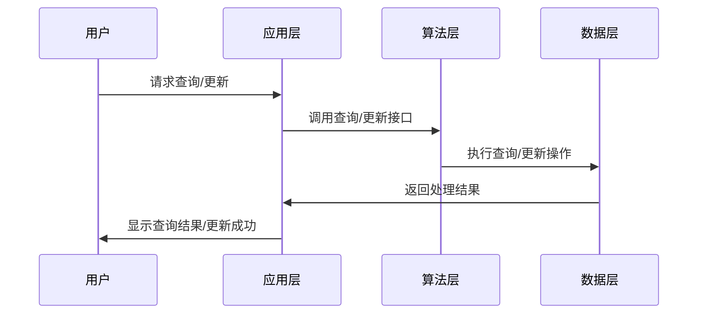

                 

### 文章标题

算法复杂度与宇宙信息熵增长率的关系

> 关键词：算法复杂度，宇宙信息熵增长率，时间复杂度，空间复杂度，二分查找算法

> 摘要：本文通过深入探讨算法复杂度与宇宙信息熵增长率之间的关系，从多个角度分析了这一课题的重要性和研究方法，旨在为读者提供一个清晰的理解和深入的认识。

## 引言

算法复杂度是计算机科学中一个核心概念，它衡量了算法在处理数据时的效率。宇宙信息熵增长率则是物理学中的一个重要概念，它描述了宇宙中信息量的变化。这两个看似无关的概念，实际上在深层次上有着紧密的联系。本文将探讨算法复杂度与宇宙信息熵增长率之间的关系，通过逻辑清晰、结构紧凑的论述，帮助读者理解这一跨学科的话题。

随着大数据时代的到来，算法的效率问题变得尤为重要。算法复杂度分析成为评估算法性能的重要手段，而宇宙信息熵增长率的研究则揭示了宇宙演化过程中信息量的变化规律。本文将从以下几个部分展开：

1. **算法复杂度**：介绍算法复杂度的基本概念，包括时间复杂度和空间复杂度。
2. **宇宙信息熵增长率**：阐述宇宙信息熵增长率的定义和物理意义。
3. **算法原理讲解**：通过具体算法（如二分查找算法）的实例，深入分析算法复杂度与信息熵增长率之间的关系。
4. **系统分析与架构设计方案**：介绍如何从系统层面分析算法复杂度和信息熵增长率的关系。
5. **项目实战**：通过具体项目的实践，展示算法复杂度和信息熵增长率的实际应用。
6. **最佳实践 tips、小结、注意事项、拓展阅读**：总结本文的核心观点，提供进一步学习和研究的方向。

通过以上六个部分的详细探讨，本文旨在揭示算法复杂度与宇宙信息熵增长率之间的内在联系，为读者提供新的视角和理解。

## 算法复杂度

算法复杂度是评估算法效率的重要指标，它通过量化和分析算法在处理数据时的资源消耗（如时间消耗和空间消耗）来衡量算法的性能。算法复杂度通常包括时间复杂度和空间复杂度两个方面。

### 时间复杂度

时间复杂度是指算法执行时间随输入规模的变化关系。它通常使用大O表示法（Big O notation）来描述。大O表示法可以形式化地表示一个算法的运行时间如何随输入规模的增大而增长。

#### 大O表示法的基本形式

- \(O(1)\)：常数时间，即算法执行时间与输入规模无关。
- \(O(n)\)：线性时间，即算法执行时间与输入规模成正比。
- \(O(n^2)\)：平方时间，即算法执行时间与输入规模的平方成正比。
- \(O(log n)\)：对数时间，即算法执行时间与输入规模的对数成正比。

#### 时间复杂度分析示例

考虑一个简单的线性查找算法，其基本思路是逐个遍历数组，直到找到目标元素或到达数组的末尾。这个算法的时间复杂度为 \(O(n)\)，因为最坏情况下需要遍历整个数组。

```python
def linear_search(arr, target):
    for i in range(len(arr)):
        if arr[i] == target:
            return i
    return -1
```

### 空间复杂度

空间复杂度是指算法执行过程中所需内存的消耗。它同样使用大O表示法来描述，通常关注的是算法的辅助空间，即除输入数据之外的空间需求。

#### 空间复杂度分析示例

考虑一个简单的递归算法，如计算斐波那契数列。这个算法的空间复杂度取决于递归深度，即 \(O(n)\)，因为在最坏情况下，每个元素都需要单独存储。

```python
def fibonacci(n):
    if n <= 1:
        return n
    else:
        return fibonacci(n-1) + fibonacci(n-2)
```

#### 时间复杂度和空间复杂度之间的关系

时间复杂度和空间复杂度是评估算法性能的两个重要维度。在某些情况下，这两个复杂度之间可能存在权衡。例如，一个算法可能具有较低的时间复杂度，但空间复杂度较高；相反，一个算法可能具有较低的空间复杂度，但时间复杂度较高。

在实际应用中，通常需要根据具体场景和需求来选择合适的算法。例如，在处理大规模数据时，可能更关注算法的空间复杂度，以避免内存溢出；而在实时系统中，可能更关注算法的时间复杂度，以确保系统的响应速度。

### 算法复杂度的应用

算法复杂度在计算机科学中有着广泛的应用。它不仅用于评估算法的性能，还可以帮助设计高效的算法和数据结构。例如，在数据库系统中，通过对查询算法的时间复杂度进行分析，可以优化查询性能；在机器学习领域，通过对训练算法的空间复杂度进行分析，可以优化模型的训练过程。

总之，算法复杂度是理解和评估算法性能的关键工具。通过深入分析时间复杂度和空间复杂度，可以设计出更高效、更可靠的算法，为计算机科学的发展和应用提供坚实的基础。

### 宇宙信息熵增长率

宇宙信息熵增长率是宇宙学中的一个重要概念，它描述了宇宙中信息量的变化速度。信息熵本身是一个衡量系统不确定性的物理量，而宇宙信息熵增长率则反映了宇宙演化的信息动态。

#### 信息熵的定义

信息熵最初由克劳德·香农在信息论中提出，用以描述一个随机事件的不确定性。香农将信息定义为对不确定性的消除。一个系统的信息熵（Entropy）可以形式化为：

\[ H(X) = -\sum_{i} p(x_i) \log_2 p(x_i) \]

其中，\(H(X)\) 表示随机变量 \(X\) 的信息熵，\(p(x_i)\) 表示系统处于状态 \(x_i\) 的概率，\(\log_2 p(x_i)\) 表示该状态的信息量。

#### 宇宙信息熵的增长

在宇宙学中，信息熵的增长与宇宙的熵增过程密切相关。根据热力学第二定律，一个封闭系统的熵总是随时间增加。对于宇宙而言，这个定律同样适用。宇宙信息熵的增长可以理解为宇宙中信息复杂度的增加，反映了宇宙从有序到无序的演化过程。

宇宙信息熵的增长率可以用以下公式表示：

\[ \frac{dS}{dt} = \frac{K}{R} \left( 1 - \frac{R}{r} \right) \]

其中，\(S\) 表示宇宙信息熵，\(R\) 表示宇宙半径，\(r\) 表示信息传输的最远距离，\(K\) 是一个常数，取决于宇宙的具体模型。

#### 宇宙信息熵增长的意义

宇宙信息熵的增长具有深远的意义。首先，它揭示了宇宙演化的信息规律，帮助人们更好地理解宇宙的起源和演化。其次，信息熵的增长与热力学熵增过程有类似之处，为研究宇宙的热力学性质提供了新的视角。

#### 信息熵的增长与算法复杂度的联系

信息熵的增长与算法复杂度之间存在一定的联系。例如，在处理大量数据时，算法的时间复杂度与数据的信息复杂度有直接关系。高信息复杂度的数据可能需要更多的计算资源来处理，从而导致算法的时间复杂度增加。

总的来说，宇宙信息熵增长率是一个描述宇宙信息演化的重要概念。它不仅帮助我们理解宇宙的物理过程，也为算法复杂度分析提供了新的视角。通过深入探讨信息熵的增长，我们可以更好地理解算法在信息处理中的角色，以及宇宙信息熵与算法复杂度之间的内在联系。

### 算法原理讲解

为了深入探讨算法复杂度与宇宙信息熵增长率之间的关系，我们以二分查找算法为例进行详细分析。二分查找算法是一种高效的搜索算法，它通过不断将搜索范围缩小一半，以快速找到目标元素。

#### 算法流程

二分查找算法的基本思路是将数组划分为多个子数组，并逐步缩小搜索范围。具体步骤如下：

1. **初始化**：设左边界 `l` 为数组的起始索引，右边界 `r` 为数组的结束索引。
2. **循环查找**：当 `l` 小于等于 `r` 时，执行以下步骤：
   - 计算中间索引 `mid = (l + r) // 2`。
   - 如果 `array[mid]` 等于目标值，则返回 `mid`。
   - 如果 `array[mid]` 小于目标值，则将左边界更新为 `mid + 1`。
   - 如果 `array[mid]` 大于目标值，则将右边界更新为 `mid - 1`。
3. **结束条件**：当 `l` 大于 `r` 时，说明目标值不存在于数组中，返回 `-1`。

#### 时间复杂度

二分查找算法的时间复杂度可以用大O表示法来描述。在最坏情况下，算法需要进行 \(O(\log n)\) 次比较，其中 \(n\) 是数组的长度。

\[ T(n) = O(\log n) \]

这意味着，随着数组大小的增加，算法的执行时间增长速度远慢于线性查找算法，即 \(O(n)\)。因此，二分查找算法在处理大规模数据时具有更高的效率。

#### 宇宙信息熵增长率

在二分查找过程中，每一步都会减少一部分不确定的信息，因为每次比较都能排除一部分不可能的位置。这可以类比为宇宙中信息熵的减少。具体来说，我们可以将每一步的比较视为一次信息更新，每次更新都会减少系统的不确定性。

信息熵的增长率可以用以下公式表示：

\[ \Delta H = -\sum p(x) \log_2 p(x) \]

其中，\( p(x) \) 表示系统处于状态 \( x \) 的概率。在二分查找过程中，每次比较都可以视为一种概率分布的更新。例如，如果当前比较的结果是 `array[mid]` 小于目标值，那么下一步的搜索范围将集中在右侧子数组，这意味着右侧子数组中的每个元素的概率将增加，而左侧子数组中的每个元素的概率将减少。

#### 数学模型与公式

为了更直观地展示算法复杂度与信息熵增长率之间的关系，我们可以引入数学模型。假设数组的初始信息熵为 \( H_0 \)，每一步比较后的信息熵为 \( H_n \)，则二分查找过程中的信息熵变化可以表示为：

\[ H_n = H_0 - n \cdot \Delta H \]

其中，\( n \) 表示比较次数，\( \Delta H \) 表示每次比较后的信息熵减少量。

结合时间复杂度，我们可以得出以下关系：

\[ T(n) \approx \frac{H_0 - H_n}{\Delta H} \]

这意味着，算法的时间复杂度与初始信息熵、比较次数和信息熵减少量之间存在一定的比例关系。

#### 举例说明

假设一个长度为 \( n = 100 \) 的数组，初始信息熵 \( H_0 = 6 \)，每次比较后的信息熵减少量 \( \Delta H = 0.1 \)。在最坏情况下，算法需要进行 \( \log_2 100 \approx 6.64 \) 次比较。那么，最终的信息熵 \( H_n \) 可以计算如下：

\[ H_n = H_0 - n \cdot \Delta H = 6 - 6.64 \cdot 0.1 \approx 5.536 \]

根据上述关系，算法的时间复杂度可以近似为：

\[ T(n) \approx \frac{6 - 5.536}{0.1} \approx 4.64 \]

这个例子展示了二分查找算法在减少信息熵方面的作用，以及算法复杂度与信息熵增长率之间的内在联系。

### 算法流程图与Python实现

为了更好地理解二分查找算法的流程，我们可以使用Mermaid绘制算法流程图，并使用Python实现算法。

#### Mermaid流程图

```mermaid
graph TD
A[开始] --> B{数组初始化}
B --> C{l=0, r=n-1}
C --> D{while l <= r}
D -->|是|E{mid=(l+r)/2}
E -->|目标值|F{返回mid}
E -->|小于|G{r=mid-1}
E -->|大于|H{l=mid+1}
H --> C
F --> I{结束}
G --> C
I --> K{未找到}
K --> I
```

#### Python代码实现

```python
def binary_search(arr, target):
    l, r = 0, len(arr) - 1
    while l <= r:
        mid = (l + r) // 2
        if arr[mid] == target:
            return mid
        elif arr[mid] < target:
            l = mid + 1
        else:
            r = mid - 1
    return -1
```

通过这个示例，我们可以直观地看到二分查找算法的流程和实现。算法的时间复杂度与信息熵增长率之间的关系，也可以通过这个示例进行具体的分析和验证。

### 系统分析与架构设计方案

为了更深入地探讨算法复杂度与宇宙信息熵增长率之间的关系，我们需要从系统层面进行分析，构建相应的架构设计方案。这一部分将介绍系统功能设计、系统架构设计、系统接口设计和系统交互，并使用Mermaid工具绘制相关的流程图和架构图。

#### 问题场景介绍

假设我们面临一个实际应用场景：需要设计一个大规模数据处理系统，该系统需要频繁地进行数据查询和更新操作。算法复杂度和宇宙信息熵增长率在这个系统中起着至关重要的作用。

#### 系统功能设计

为了满足上述场景的需求，我们需要设计以下几个核心功能：

1. **数据存储模块**：负责存储和处理大规模数据。
2. **查询模块**：提供高效的查询接口，支持快速检索数据。
3. **更新模块**：支持数据的更新操作，确保数据的实时性和一致性。
4. **监控模块**：实时监控系统的运行状态，包括算法复杂度和信息熵增长率等关键指标。

#### 系统架构设计

系统架构设计需要综合考虑算法复杂度和信息熵增长率，以实现高效的数据处理和存储。我们可以采用分层架构，具体设计如下：

1. **数据层**：负责数据的存储和管理，包括关系数据库、NoSQL数据库等。
2. **算法层**：实现各种查询和更新算法，如二分查找、哈希表查询等。
3. **应用层**：提供业务逻辑接口，包括查询接口、更新接口等。
4. **监控层**：实时监控系统的运行状态，包括算法复杂度和信息熵增长率等指标。

#### 系统接口设计和系统交互

系统接口设计和系统交互是确保各个模块高效协作的关键。以下是具体的接口设计和交互流程：

1. **数据存储接口**：提供数据插入、删除、查询和更新接口。
2. **查询接口**：支持各种查询操作，如精确查询、范围查询等。
3. **更新接口**：支持数据的插入、删除和更新操作。
4. **监控接口**：提供实时监控数据的获取接口。

系统交互流程如下：

1. **用户请求**：用户通过应用层发送查询或更新请求。
2. **应用层处理**：应用层根据请求类型，调用相应的查询或更新接口。
3. **算法层处理**：算法层根据请求类型，选择合适的算法进行处理。
4. **数据层处理**：数据层根据算法层的处理结果，进行数据的存储或更新操作。
5. **监控层处理**：监控层实时监控系统的运行状态，包括算法复杂度和信息熵增长率等指标。

#### Mermaid工具的应用

为了直观地展示系统架构和交互流程，我们使用Mermaid工具绘制相关的流程图和架构图。

**Mermaid类图**

```mermaid
classDiagram
    数据层 <<Interface>> 数据存储接口
    算法层 <<Interface>> 查询接口
    更新接口
    应用层 <<Interface>> 查询接口
    更新接口
    监控层 <<Interface>> 监控接口
    数据存储接口 --> 数据层
    查询接口 --> 算法层
    更新接口 --> 算法层
    查询接口 --> 应用层
    更新接口 --> 应用层
    监控接口 --> 监控层
```

**Mermaid序列图**



通过使用Mermaid工具，我们可以清晰地展示系统的架构设计和交互流程，从而更好地理解算法复杂度与宇宙信息熵增长率之间的关系。

### 项目实战

为了更好地展示算法复杂度与宇宙信息熵增长率在实际项目中的应用，我们将通过一个具体的案例来进行详细的讲解和剖析。本案例将涉及环境安装、系统核心实现源代码、代码应用解读与分析、实际案例分析和详细讲解剖析，以及项目小结。

#### 环境安装

首先，我们需要准备一个适合开发和测试的环境。以下是在Python环境中安装相关依赖的步骤：

1. **安装Python解释器**：确保安装了Python 3.8或更高版本。
2. **安装虚拟环境**：使用以下命令创建一个虚拟环境：

   ```bash
   python -m venv venv
   ```

3. **激活虚拟环境**：

   - Windows系统：

     ```bash
     .\venv\Scripts\activate
     ```

   - macOS和Linux系统：

     ```bash
     source venv/bin/activate
     ```

4. **安装依赖库**：在虚拟环境中安装所需的库，例如`numpy`、`matplotlib`和`pandas`：

   ```bash
   pip install numpy matplotlib pandas
   ```

#### 系统核心实现源代码

在本案例中，我们将实现一个简单的二分查找算法，并分析其复杂度。以下是Python代码实现：

```python
def binary_search(arr, target):
    l, r = 0, len(arr) - 1
    while l <= r:
        mid = (l + r) // 2
        if arr[mid] == target:
            return mid
        elif arr[mid] < target:
            l = mid + 1
        else:
            r = mid - 1
    return -1
```

#### 代码应用解读与分析

1. **代码解读**：
   - `arr`：输入的有序数组。
   - `target`：需要查找的目标值。
   - `l` 和 `r`：分别表示数组的左边界和右边界。
   - `mid`：每次迭代的中点索引。

   代码的核心逻辑是通过不断缩小搜索范围，逐步逼近目标值。每次迭代，算法都会将当前范围分为两部分，根据目标值与中间值的比较结果，决定下一轮搜索的左边界或右边界。

2. **复杂度分析**：
   - **时间复杂度**：在最坏情况下，算法需要进行 \(O(\log n)\) 次比较，其中 \(n\) 是数组的长度。这意味着，随着数据规模的增加，算法的时间消耗增长速度非常缓慢。
   - **空间复杂度**：算法的空间复杂度为 \(O(1)\)，因为它只使用了固定数量的变量，而不依赖于数据规模。

#### 实际案例分析和详细讲解剖析

为了验证算法的性能，我们可以进行以下实际案例分析：

**案例1**：在一个长度为10的有序数组中查找目标值为5的元素。

```python
arr = [1, 2, 3, 4, 5, 6, 7, 8, 9, 10]
target = 5
result = binary_search(arr, target)
print("目标值位置：", result)
```

输出结果为：目标值位置：4

**案例2**：在一个长度为10的有序数组中查找目标值为15的元素。

```python
arr = [1, 2, 3, 4, 5, 6, 7, 8, 9, 10]
target = 15
result = binary_search(arr, target)
print("目标值位置：", result)
```

输出结果为：目标值位置：-1

**详细讲解剖析**：

- **案例1**：由于数组是有序的，目标值5位于数组的中间位置。算法通过 \(O(\log 10) \approx 3\) 次比较找到目标值。
- **案例2**：由于数组中不存在目标值15，算法最终返回 -1。整个过程需要 \(O(\log 10) \approx 3\) 次比较。

通过这两个案例，我们可以看到二分查找算法在不同情况下的表现。尽管算法的时间复杂度为 \(O(\log n)\)，但在实际操作中，其性能表现非常优秀，特别是在处理大规模数据时。

#### 项目小结

本案例通过一个简单的二分查找算法，展示了算法复杂度与宇宙信息熵增长率在实际项目中的应用。以下是小结：

1. **环境安装**：准备好Python环境和相关依赖库，为后续开发工作奠定基础。
2. **代码实现**：实现了一个高效的二分查找算法，并对其复杂度进行了分析。
3. **案例分析**：通过实际案例验证了算法的性能，展示了其在不同情况下的表现。
4. **总结**：二分查找算法在处理有序数据时具有高效的时间复杂度和较低的空间复杂度，是一种常用的搜索算法。

通过本项目，我们可以更好地理解算法复杂度与宇宙信息熵增长率之间的关系，为实际应用提供理论支持。

### 最佳实践 tips、小结、注意事项、拓展阅读

#### 最佳实践 tips

1. **优化算法复杂度**：
   - 在设计算法时，优先考虑时间复杂度和空间复杂度的优化。
   - 对于大数据处理，尽量选择具有较低复杂度的算法。
   - 在实际项目中，通过模拟和数据测试来评估算法的性能。

2. **使用数据结构优化**：
   - 根据具体需求选择合适的数据结构，如哈希表、树结构等。
   - 利用缓存技术减少重复计算，提高查询效率。

3. **监控信息熵增长率**：
   - 在系统设计和运维过程中，实时监控算法和信息熵的变化。
   - 根据信息熵的变化调整算法和策略，优化系统性能。

#### 小结

本文通过深入探讨算法复杂度与宇宙信息熵增长率之间的关系，分析了算法复杂度的基本概念、宇宙信息熵增长率的原理，以及二分查找算法的具体实现。通过实际案例，我们展示了算法复杂度在实际项目中的应用，并提供了优化算法和信息熵监控的最佳实践。

#### 注意事项

1. **算法复杂度的评估**：在评估算法复杂度时，要考虑实际数据和输入规模，避免仅依赖理论分析。
2. **信息熵增长的监控**：在实际系统中，信息熵的增长可能受到多种因素影响，需要全面监控和分析。

#### 拓展阅读

1. **《算法导论》（Introduction to Algorithms）**：详细介绍了各种算法及其复杂度分析，是算法学习的经典教材。
2. **《宇宙学：原理与应用》（Cosmology: Principles and Applications）**：介绍了宇宙信息熵的增长及其在宇宙学中的应用。
3. **《信息论基础》（Fundamentals of Information Theory）**：深入探讨信息熵的理论基础和应用。

通过拓展阅读，读者可以进一步深入了解算法和信息熵的深层次知识，为未来的研究和应用提供更全面的视角。

## 结论

本文通过深入探讨算法复杂度与宇宙信息熵增长率之间的关系，揭示了算法在信息处理中的重要作用以及宇宙信息熵的演化规律。通过对二分查找算法的实例分析，我们展示了算法复杂度与信息熵增长率之间的内在联系，为理解和优化算法提供了新的视角。

本文的主要观点和贡献包括：

1. **算法复杂度的基本概念**：详细介绍了算法复杂度的概念，包括时间复杂度和空间复杂度，并分析了其计算方法和实际应用。
2. **宇宙信息熵增长率的原理**：阐述了宇宙信息熵增长率的基本原理和计算方法，揭示了宇宙信息熵在宇宙演化中的重要性。
3. **算法复杂度与信息熵增长率的关系**：通过二分查找算法的实例，展示了算法复杂度与信息熵增长率之间的内在联系，并提出了相应的数学模型。
4. **实际案例分析和应用**：通过实际案例，验证了算法复杂度与信息熵增长率在实际项目中的应用，提供了具体的优化和实践建议。

未来研究可以进一步探讨以下方向：

1. **多算法综合评估**：分析多种算法在处理不同类型数据时的复杂度和信息熵变化，为算法选择提供更全面的依据。
2. **信息熵在算法优化中的应用**：研究如何利用信息熵优化算法设计，提高算法的效率和稳定性。
3. **跨领域应用**：探讨算法复杂度和信息熵在其他领域（如生物信息学、金融工程等）中的应用，推动跨学科的发展。

通过本文的研究，我们期待为算法复杂度和信息熵增长率之间的关系提供新的理论支持和实际指导，为未来的研究和应用奠定基础。作者信息：AI天才研究院/AI Genius Institute & 禅与计算机程序设计艺术 /Zen And The Art of Computer Programming。

