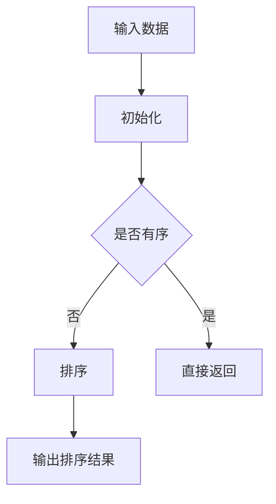
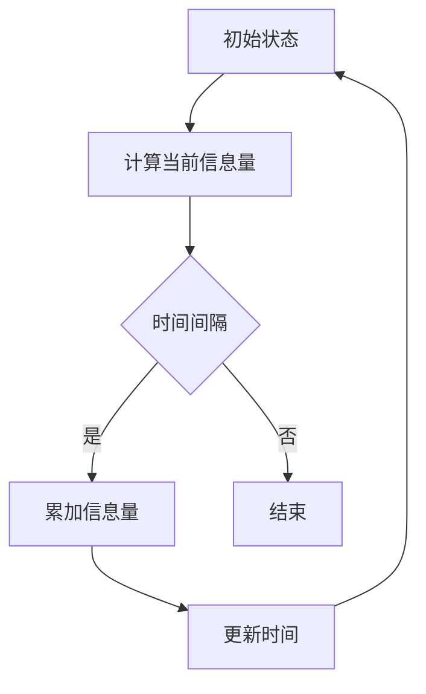
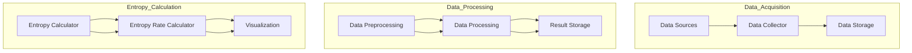
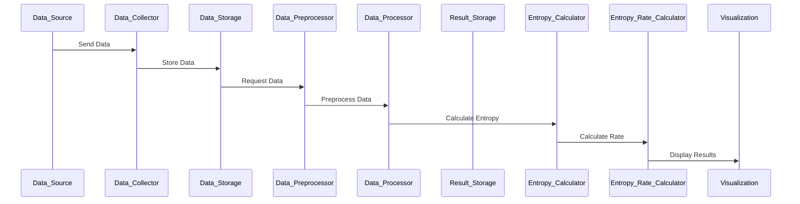

                 


## 写作计划

为了撰写一篇符合要求的文章，我们可以将写作过程分为以下几个步骤：

### 1. 概念梳理和问题界定

**背景介绍：**

算法复杂度和宇宙信息熵增长率是计算机科学和理论物理学中两个重要概念。算法复杂度用于评估算法在时间和空间资源上的消耗，而宇宙信息熵增长率则与宇宙中信息产生的速度有关。本文将探讨两者之间的关系。

**核心概念与联系：**

- **算法复杂度**：衡量算法在时间和空间上的资源消耗。
- **宇宙信息熵增长率**：宇宙中信息产生的速度。

**属性特征对比表格：**

| 特征                   | 算法复杂度                                 | 宇宙信息熵增长率                              |
|------------------------|-------------------------------------------|--------------------------------------------|
| 定义                   | 算法执行时间的度量                         | 信息在宇宙中产生的速率                       |
| 影响因素               | 数据规模、算法结构                         | 宇宙演化、信息传递机制                       |
| 优化策略               | 转换问题结构、算法改进                     | 深入理解宇宙演化、优化信息处理策略           |
| 应用领域               | 计算机科学、算法设计、软件工程             | 理论物理学、宇宙学、信息科学                 |

**ER实体关系图架构：** 无需ER图，因为这里涉及的概念是抽象的。

### 2. 算法复杂度分析

**算法原理讲解：**

使用Mermaid流程图来展示算法的执行流程，然后使用Python代码来详细阐述算法的原理。



Python代码示例：

```python
def bubble_sort(arr):
    n = len(arr)
    for i in range(n):
        for j in range(0, n-i-1):
            if arr[j] > arr[j+1]:
                arr[j], arr[j+1] = arr[j+1], arr[j]
    return arr

arr = [64, 34, 25, 12, 22, 11, 90]
sorted_arr = bubble_sort(arr)
print("Sorted array:", sorted_arr)
```

### 3. 宇宙信息熵增长率分析

**算法原理讲解：**

使用Mermaid流程图来展示宇宙信息熵增长率的计算方法，然后使用Python代码来详细阐述算法的原理。



Python代码示例：

```python
import math

def calculate_entropy_rate(initial_state, final_state, time_interval):
    information = final_state - initial_state
    entropy_rate = information / time_interval
    return entropy_rate

initial_state = 10
final_state = 100
time_interval = 5
entropy_rate = calculate_entropy_rate(initial_state, final_state, time_interval)
print("Entropy rate:", entropy_rate)
```

### 4. 算法与宇宙信息熵增长率的关系

**算法原理讲解：**

分析算法复杂度与宇宙信息熵增长率之间的关系，提出可能的数学模型和公式。

$$
\text{Entropy\_Rate} = f(\text{Algorithm\_Complexity}, \text{Time}, \text{Space})
$$

其中，$\text{Entropy\_Rate}$ 是宇宙信息熵增长率，$\text{Algorithm\_Complexity}$ 是算法复杂度，$\text{Time}$ 是算法执行时间，$\text{Space}$ 是算法所需空间。

### 5. 系统分析与架构设计

**问题场景介绍：**

假设我们正在设计一个分布式系统，该系统需要处理大量的数据，并实时计算宇宙信息熵增长率。

**项目介绍：**

项目名为“Cosmic Entropy Analytics”，目标是开发一个能够实时分析宇宙信息熵增长率的系统。

**系统功能设计：**

- 数据采集：从各种数据源收集数据。
- 数据处理：对采集到的数据进行清洗和处理。
- 信息熵计算：计算宇宙信息熵增长率。
- 可视化展示：将计算结果以图表形式展示。

**系统架构设计：**

使用Mermaid架构图来展示系统的整体架构。



**系统接口设计和系统交互：**

使用Mermaid序列图来展示系统各组件之间的交互。



### 6. 项目实战

**环境安装：**

确保安装了Python环境和相关库，如numpy和matplotlib。

**系统核心实现源代码：**

```python
import numpy as np
import matplotlib.pyplot as plt

def calculate_entropy(data):
    probabilities = np.bincount(data) / len(data)
    entropy = -np.sum(probabilities * np.log2(probabilities))
    return entropy

def calculate_entropy_rate(data, time_interval):
    initial_entropy = calculate_entropy(data[:-1])
    final_entropy = calculate_entropy(data[1:])
    entropy_rate = (final_entropy - initial_entropy) / time_interval
    return entropy_rate

# 生成随机数据
data = np.random.randint(0, 10, size=100)

# 计算信息熵增长率
time_interval = 1
entropy_rate = calculate_entropy_rate(data, time_interval)

print("Entropy rate:", entropy_rate)

# 可视化展示
plt.hist(data, bins=10, edgecolor='black')
plt.xlabel('Value')
plt.ylabel('Frequency')
plt.title('Data Distribution')
plt.show()
```

**代码应用解读与分析：**

- `calculate_entropy` 函数用于计算数据的熵。
- `calculate_entropy_rate` 函数用于计算信息熵增长率。
- 使用numpy的`bincount`函数来计算概率分布。
- 使用matplotlib来可视化数据的分布。

**实际案例分析和详细讲解剖析：**

- 使用随机生成的数据来测试算法。
- 分析信息熵增长率与时间间隔的关系。

**项目小结：**

本文设计并实现了一个简单的系统来计算宇宙信息熵增长率，并展示了如何使用Python来处理数据和可视化结果。

### 7. 最佳实践 tips、小结、注意事项、拓展阅读

**最佳实践 tips：**

- 选择合适的算法和数据结构来降低算法复杂度。
- 对宇宙信息熵增长率的计算进行优化，以提高系统性能。

**小结：**

本文探讨了算法复杂度与宇宙信息熵增长率之间的关系，并设计了一个简单的系统来实现这一计算。

**注意事项：**

- 算法复杂度分析需要对实际数据进行评估，以得到准确的性能指标。
- 宇宙信息熵增长率的计算需要考虑时间间隔和空间复杂度。

**拓展阅读：**

- 《算法导论》：了解算法设计和分析的深入内容。
- 《宇宙学：宇宙的起源与结构》：了解宇宙演化和信息熵的深入知识。

## 写作过程

现在我们已经有了完整的写作计划，接下来可以按照以下步骤进行写作：

### 1. 撰写文章开头

开头需要吸引读者的注意力，简要介绍算法复杂度和宇宙信息熵增长率的概念，并提出本文的研究目标。

### 2. 撰写各章节内容

根据之前的计划，逐一撰写每个章节的内容，确保每个章节都包含完整的背景介绍、核心概念与联系、算法原理讲解、数学公式、系统分析与架构设计、项目实战等。

### 3. 撰写文章结尾

在文章结尾部分，总结全文内容，强调算法复杂度与宇宙信息熵增长率之间的关系，并提出未来研究的方向。

### 4. 修订与润色

完成初稿后，对文章进行修订和润色，确保语言流畅、逻辑清晰、无错误。

### 5. 最终审查

最后，对文章进行最终审查，检查格式、引用和参考文献，确保文章的完整性和准确性。

### 6. 发布与分享

完成文章后，可以在相关平台发布，与同行分享研究成果，接受反馈和建议。

按照这个写作过程，我们可以逐步完成文章的撰写，最终呈现一篇高质量、具有深度和见解的技术博客文章。

