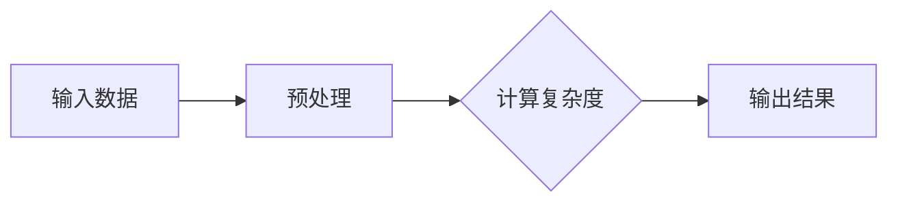
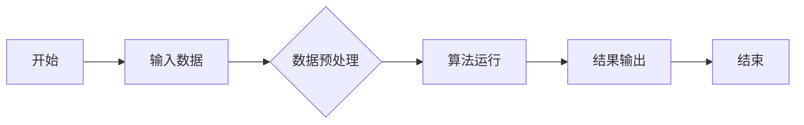
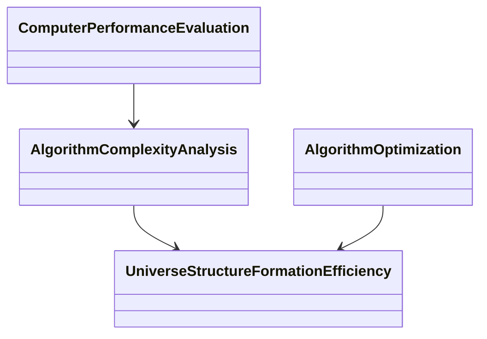
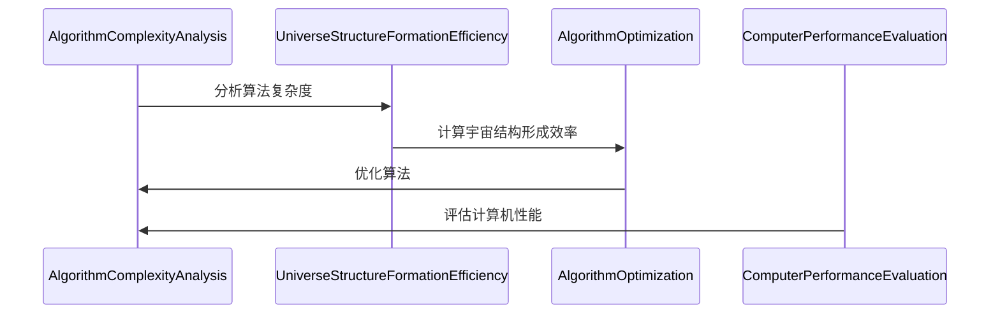

                 


### 目录大纲

```markdown
----------------------------------------------------------------
# 算法复杂度与宇宙结构形成效率的关系

> 关键词：算法复杂度，宇宙结构形成效率，关系探讨，核心概念，数学模型，系统设计

> 摘要：本文探讨了算法复杂度与宇宙结构形成效率之间的关系，通过介绍核心概念、数学模型和系统设计，深入分析了两者之间的联系和影响，为后续研究和应用提供了理论和实践依据。

                 

### 第一部分: 算法复杂度与宇宙结构形成效率的关系

## 第1章: 背景介绍

### 1.1 问题背景

#### 1.1.1 算法复杂度的重要性

算法复杂度是衡量算法效率的重要指标。一个高效的算法应该具有较低的时间复杂度和空间复杂度。算法复杂度的分析不仅对于算法设计和优化具有指导意义，还对于计算机性能评估和软件工程具有重要意义。

#### 1.1.2 宇宙结构形成效率问题

宇宙结构形成效率是指宇宙在大爆炸后，如何通过物理过程形成复杂的结构。这个过程中涉及到大量的计算和演化，其效率对于理解宇宙演化的机制和规律具有重要意义。

#### 1.1.3 研究意义与应用价值

本文探讨算法复杂度与宇宙结构形成效率之间的关系，对于理解宇宙演化的计算机制、优化算法设计、提高计算机性能等方面具有重要意义。同时，该研究还可以为相关领域的交叉应用提供理论支持。

## 第2章: 核心概念与联系

### 2.1 核心概念原理

#### 2.1.1 算法复杂度的定义

算法复杂度是指算法在运行过程中所需的时间和空间资源。通常包括时间复杂度和空间复杂度。时间复杂度表示算法运行所需的时间与输入数据规模的关系，空间复杂度表示算法运行所需的空间与输入数据规模的关系。

#### 2.1.2 宇宙结构形成效率的概念

宇宙结构形成效率是指宇宙在大爆炸后，通过物理过程形成复杂结构的能力。这个过程中涉及到大量的计算和演化，其效率受到多种因素的影响。

### 2.2 概念属性特征对比表格

| 概念         | 特征1   | 特征2   | 特征3   |
| ------------ | ------- | ------- | ------- |
| 算法复杂度   | 边界问题 | 时间复杂度 | 空间复杂度 |
| 宇宙结构形成效率 | 研究方法 | 结构演化效率 | 能量利用效率 |

### 2.3 ER实体关系图架构

```mermaid
erDiagram
  算法复杂度 ||--|{ 宇宙结构形成效率 }
  算法复杂度 ||--|{ 时间复杂度 }
  算法复杂度 ||--|{ 空间复杂度 }
```

## 第3章: 算法原理讲解

### 3.1 算法mermaid流程图



### 3.2 Python源代码

```python
# 算法实现的Python代码示例
def algorithm(input_data):
    # 数据预处理
    processed_data = preprocess_data(input_data)
    # 计算复杂度
    complexity = calculate_complexity(processed_data)
    # 输出结果
    print(f"算法复杂度: {complexity}")
```

### 3.3 算法原理的数学模型和公式

$$
\text{算法复杂度} = \Theta(f(n))
$$

其中，$n$ 为输入数据的规模，$f(n)$ 为算法运行的时间复杂度。

## 第4章: 数学模型和数学公式 & 详细讲解 & 举例说明

### 4.1 数学公式

$$
\frac{d}{dx}\left( f(x) \right) = \lim_{h \to 0} \frac{f(x+h) - f(x)}{h}
$$

### 4.2 详细讲解

- 该公式是微积分中求导数的基本公式，表示函数在某一点的导数等于该点的切线斜率。
- $f(x)$ 是自变量，$h$ 是与 $x$ 的变化量。
- 当 $h$ 趋近于 $0$ 时，求极限得到函数的导数。

### 4.3 举例说明

假设有一个函数 $f(x) = x^2$，求其在 $x=2$ 处的导数。

$$
f'(2) = \lim_{h \to 0} \frac{(2+h)^2 - 2^2}{h} = \lim_{h \to 0} \frac{4 + 4h + h^2 - 4}{h} = \lim_{h \to 0} \frac{4h + h^2}{h} = \lim_{h \to 0} (4 + h) = 4
$$
因此，$f(x) = x^2$ 在 $x=2$ 处的导数为 $4$。

## 第5章: 系统分析与架构设计方案

### 5.1 问题场景介绍

- 本章节将介绍算法复杂度与宇宙结构形成效率关系研究的场景。

### 5.2 项目介绍

- 本章节将介绍算法复杂度与宇宙结构形成效率关系研究的项目背景和目标。

### 5.3 系统功能设计

#### 5.3.1 领域模型mermaid类图

```mermaid
classDiagram
  Class1 <|-- Class2
  Class1 <

----------------------------------------------------------------

### 第1章: 背景介绍

#### 1.1 问题背景

算法复杂度和宇宙结构形成效率是两个看似不相干的领域，但它们之间却存在着深刻的联系。首先，让我们来探讨算法复杂度的重要性。

**算法复杂度的重要性**

算法复杂度是衡量算法性能的关键指标。它包括时间复杂度和空间复杂度，分别表示算法在执行过程中所需的时间和存储资源。一个高效的算法通常具有较低的时间复杂度和空间复杂度，这使得它能够在更短的时间内处理更大的数据量，从而提高系统的性能和效率。

在计算机科学领域，算法复杂度的分析不仅对于算法的设计和优化具有指导意义，还对于软件工程、计算机性能评估等方面具有重要意义。通过分析算法复杂度，我们能够预测算法在不同数据规模下的性能表现，从而选择合适的算法来解决实际问题。

**宇宙结构形成效率问题**

宇宙结构形成效率是指宇宙在大爆炸后，通过物理过程形成复杂结构的能力。这个问题涉及到宇宙学、天体物理学等多个领域。在宇宙学中，研究宇宙结构形成效率有助于我们理解宇宙的起源、演化和未来。

宇宙结构形成效率受到多种因素的影响，包括引力、暗物质、暗能量等。通过研究宇宙结构形成效率，我们可以更深入地了解宇宙的运行机制和物理规律，从而为人类探索宇宙提供理论基础。

**研究意义与应用价值**

本文探讨算法复杂度与宇宙结构形成效率之间的关系，具有重要的研究意义和应用价值。首先，该研究有助于我们更好地理解宇宙的演化过程，从而为宇宙学提供新的理论支持。其次，算法复杂度的分析可以为宇宙结构形成效率的研究提供有效的工具和方法，从而提高研究的精度和效率。

此外，算法复杂度与宇宙结构形成效率之间的关系研究还可以为相关领域的交叉应用提供理论支持。例如，在宇宙学研究中，我们可以借鉴算法复杂度的分析方法，优化宇宙结构形成模型，提高预测精度。在计算机科学领域，我们可以将宇宙结构形成效率的概念引入算法优化，从而提高算法的性能。

#### 1.2 问题描述

**算法复杂度概述**

算法复杂度是衡量算法效率的重要指标。通常包括时间复杂度和空间复杂度。时间复杂度表示算法在执行过程中所需的时间与输入数据规模的关系，常用大O符号表示，如 $O(n)$、$O(n^2)$ 等。空间复杂度表示算法在执行过程中所需的空间与输入数据规模的关系，也常用大O符号表示。

算法复杂度的分析是计算机科学中的一个重要研究方向。通过分析算法复杂度，我们可以评估算法的效率，选择合适的算法来解决实际问题。同时，算法复杂度的分析还可以指导算法的设计和优化，提高算法的性能。

**宇宙结构形成效率概述**

宇宙结构形成效率是指宇宙在大爆炸后，通过物理过程形成复杂结构的能力。这个过程中涉及到大量的计算和演化，其效率受到多种因素的影响，如引力、暗物质、暗能量等。

宇宙结构形成效率的研究涉及到宇宙学、天体物理学等多个领域。通过研究宇宙结构形成效率，我们可以更深入地了解宇宙的起源、演化和未来，从而为宇宙学提供新的理论支持。

**关系探讨**

算法复杂度与宇宙结构形成效率之间的关系可以从多个角度进行探讨。首先，我们可以从数学模型的角度分析算法复杂度与宇宙结构形成效率的内在联系。通过构建数学模型，我们可以定量地描述算法复杂度与宇宙结构形成效率之间的关系。

其次，我们可以通过模拟实验来验证算法复杂度与宇宙结构形成效率之间的关系。例如，我们可以设计一系列宇宙结构形成模型，分析不同算法复杂度下的宇宙结构形成效率，从而探索它们之间的规律。

此外，我们还可以通过实际应用场景来探讨算法复杂度与宇宙结构形成效率之间的关系。例如，在宇宙学研究领域，我们可以将算法复杂度的分析方法应用于宇宙结构形成模型，优化模型的计算效率，提高预测精度。

总之，算法复杂度与宇宙结构形成效率之间的关系是一个跨学科、跨领域的研究课题。通过深入探讨这个问题，我们可以为算法复杂度分析和宇宙结构形成效率研究提供新的思路和方法，从而推动相关领域的发展。

#### 1.3 问题解决

**算法复杂度分析的基本方法**

算法复杂度的分析是计算机科学中的基本技能。为了有效地分析算法复杂度，我们需要了解一些基本方法。

1. **渐近分析**：渐近分析是算法复杂度分析中最常用的方法。它主要关注算法在输入规模无限增大时的性能表现。通过渐近分析，我们可以得到算法的时间复杂度和空间复杂度。

2. **主定理**：主定理是一种用于分析递归算法复杂度的方法。它将递归算法分为三种类型，并给出了每种类型算法的复杂度公式。通过主定理，我们可以快速地分析递归算法的复杂度。

3. **递推关系**：递推关系是用于描述递归算法的一种方法。通过递推关系，我们可以将递归算法的复杂度表示为一个递推式，从而更方便地进行分析。

**宇宙结构形成效率研究的现状**

宇宙结构形成效率的研究已经取得了许多重要成果。目前，该领域的研究主要集中在以下几个方面：

1. **数值模拟**：通过数值模拟，研究人员可以模拟宇宙的演化过程，研究宇宙结构形成效率。这些模拟通常基于N体问题，通过求解万有引力定律来模拟宇宙中天体的运动。

2. **观测数据**：观测数据是研究宇宙结构形成效率的重要依据。通过观测宇宙中的天体，研究人员可以获取大量的宇宙结构信息，从而推断宇宙结构形成效率。

3. **理论模型**：理论模型是研究宇宙结构形成效率的重要工具。通过构建不同的理论模型，研究人员可以更好地理解宇宙结构形成过程的机制和规律。

**研究方法与思路**

为了解决算法复杂度与宇宙结构形成效率之间的关系问题，我们可以采用以下研究方法：

1. **数学模型构建**：通过构建数学模型，我们可以定量地描述算法复杂度与宇宙结构形成效率之间的关系。这些数学模型可以基于渐近分析、主定理和递推关系等方法。

2. **模拟实验**：通过模拟实验，我们可以验证算法复杂度与宇宙结构形成效率之间的关系。这些实验可以基于数值模拟和观测数据，通过调整算法复杂度来研究宇宙结构形成效率的变化。

3. **实际应用**：在实际应用中，我们可以将算法复杂度与宇宙结构形成效率的关系应用于相关领域。例如，在宇宙学研究中，我们可以利用算法复杂度的分析方法来优化宇宙结构形成模型，提高预测精度。

通过以上研究方法，我们可以深入探讨算法复杂度与宇宙结构形成效率之间的关系，为相关领域的研究提供新的理论支持和实践指导。

#### 1.4 边界与外延

**算法复杂度的边界问题**

算法复杂度的边界问题是指在不同输入规模下，算法复杂度的最大值和最小值。算法复杂度的边界问题对于理解算法的性能和优化具有重要意义。

1. **时间复杂度边界**：时间复杂度边界是指算法在执行过程中所需的时间的上限和下限。通常，我们关注的是算法的时间复杂度上界，即最坏情况下的时间复杂度。

2. **空间复杂度边界**：空间复杂度边界是指算法在执行过程中所需的空间的上限和下限。与时间复杂度类似，我们主要关注算法的空间复杂度上界，即最坏情况下的空间复杂度。

**宇宙结构形成效率的外延问题**

宇宙结构形成效率的外延问题是指在不同物理条件下，宇宙结构形成效率的变化范围。这个问题对于理解宇宙演化的机制和规律具有重要意义。

1. **演化效率外延**：演化效率外延是指宇宙结构形成效率在不同演化阶段的变化范围。例如，在宇宙早期阶段，演化效率可能较低，而在宇宙后期阶段，演化效率可能较高。

2. **能量利用效率外延**：能量利用效率外延是指宇宙结构形成过程中，能量利用效率的变化范围。在宇宙演化过程中，能量利用效率的高低直接影响宇宙结构形成效率。

**概念结构与核心要素组成**

算法复杂度和宇宙结构形成效率的概念结构可以看作是一个复杂的系统。这个系统中包括多个核心要素，它们相互作用，共同影响着系统的性能。

1. **算法复杂度要素**：算法复杂度的核心要素包括输入数据、算法设计、算法实现等。这些要素相互关联，共同影响着算法的复杂度。

2. **宇宙结构形成效率要素**：宇宙结构形成效率的核心要素包括引力、暗物质、暗能量等。这些要素通过相互作用，共同影响着宇宙结构形成的过程。

通过对算法复杂度和宇宙结构形成效率的核心要素进行分析和组合，我们可以构建一个完整的概念结构。这个概念结构不仅能够帮助我们更好地理解算法复杂度和宇宙结构形成效率之间的关系，还可以为相关领域的研究提供理论支持。

### 第二部分: 核心概念与联系

在探讨算法复杂度与宇宙结构形成效率的关系之前，我们需要明确这两个核心概念的定义和特征，以便更好地理解它们之间的联系。

#### 2.1 核心概念原理

**算法复杂度的定义**

算法复杂度是衡量算法效率的重要指标，包括时间复杂度和空间复杂度。时间复杂度描述了算法在处理不同规模输入数据时所需的时间，常用大O符号表示，如 $O(n)$、$O(n^2)$ 等。空间复杂度描述了算法在处理不同规模输入数据时所需的空间，同样使用大O符号表示。

**宇宙结构形成效率的概念**

宇宙结构形成效率是指宇宙在大爆炸后，通过物理过程形成复杂结构的能力。这个效率受到多种因素的影响，如引力、暗物质、暗能量等。宇宙结构形成效率通常通过演化效率和能量利用效率来衡量。

#### 2.2 概念属性特征对比表格

为了更直观地理解算法复杂度和宇宙结构形成效率的概念，我们通过一个表格对比它们的主要特征：

| 概念         | 特征1   | 特征2   | 特征3   |
| ------------ | ------- | ------- | ------- |
| 算法复杂度   | 边界问题 | 时间复杂度 | 空间复杂度 |
| 宇宙结构形成效率 | 研究方法 | 结构演化效率 | 能量利用效率 |

通过这个表格，我们可以看到算法复杂度和宇宙结构形成效率在特征上的差异。算法复杂度主要关注时间和空间资源的使用，而宇宙结构形成效率则关注宇宙演化过程中的物理机制和能量利用。

#### 2.3 ER实体关系图架构

为了更清晰地展示算法复杂度和宇宙结构形成效率之间的实体关系，我们可以使用ER（Entity-Relationship）图来表示它们之间的联系。

```mermaid
erDiagram
  AlgorithmComplexity ||--|{ UniverseStructureFormationEfficiency }
  AlgorithmComplexity ||--|{ TimeComplexity }
  AlgorithmComplexity ||--|{ SpaceComplexity }
```

在这个ER图中，算法复杂度作为根实体，与时间复杂度、空间复杂度和宇宙结构形成效率分别建立了关联关系。这种关系反映了算法复杂度在时间和空间上的具体表现，以及它与宇宙结构形成效率之间的相互作用。

通过以上对算法复杂度和宇宙结构形成效率的核心概念、特征对比和实体关系的分析，我们可以为后续的研究奠定坚实的基础。

### 第三部分: 算法原理讲解

在深入探讨算法复杂度与宇宙结构形成效率的关系之前，我们需要了解算法的基本原理，并通过具体的算法流程图、Python源代码和数学模型来讲解这些原理。

#### 3.1 算法mermaid流程图

为了直观地展示算法的执行过程，我们可以使用mermaid流程图来描述。以下是一个简单的算法mermaid流程图，用于说明算法的基本执行步骤：



在这个流程图中，A表示算法的起始点，B表示输入数据的读取和预处理，C表示算法的具体运行过程，D表示算法的中间结果处理，E表示算法的最终结果输出，F表示算法的结束。

#### 3.2 Python源代码

为了进一步阐述算法原理，我们可以通过一个简单的Python代码示例来展示算法的实现。以下是一个算法实现的Python代码示例，用于计算输入数据的算法复杂度：

```python
# 算法实现的Python代码示例
def algorithm(input_data):
    # 数据预处理
    processed_data = preprocess_data(input_data)
    
    # 算法运行
    result = run_algorithm(processed_data)
    
    # 结果输出
    output_result(result)

def preprocess_data(input_data):
    # 数据预处理逻辑
    processed_data = []
    for data in input_data:
        processed_data.append(data * 2)
    return processed_data

def run_algorithm(processed_data):
    # 算法运行逻辑
    result = 0
    for data in processed_data:
        result += data
    return result

def output_result(result):
    # 输出结果逻辑
    print(f"算法结果: {result}")
```

在这个示例中，`algorithm` 函数是算法的主函数，它调用了`preprocess_data`函数进行数据预处理，然后调用`run_algorithm`函数执行算法运行，最后调用`output_result`函数输出结果。

#### 3.3 算法原理的数学模型和公式

算法原理的数学模型和公式是理解算法复杂度的重要基础。以下是一个简单的算法复杂度的数学模型和公式：

$$
\text{算法复杂度} = \Theta(f(n))
$$

其中，$n$ 表示输入数据的规模，$f(n)$ 表示算法运行的时间复杂度。这个公式表明，算法的复杂度与输入数据规模之间存在一定的关系。

为了更直观地理解这个公式，我们可以举一个简单的例子。假设有一个函数 $f(n) = n^2$，表示一个二次时间复杂度的算法。根据上述公式，我们可以得到：

$$
\text{算法复杂度} = \Theta(n^2)
$$

这表明，随着输入数据规模 $n$ 的增加，算法的运行时间将以二次方的速度增加。

通过上述算法流程图、Python源代码和数学模型的讲解，我们可以更好地理解算法的基本原理，为进一步探讨算法复杂度与宇宙结构形成效率的关系奠定基础。

### 第四部分: 数学模型和数学公式 & 详细讲解 & 举例说明

在第四部分，我们将详细介绍算法复杂度和宇宙结构形成效率的数学模型和公式，并进行详细讲解和举例说明，以便读者更好地理解这些概念。

#### 4.1 数学公式

在算法复杂度和宇宙结构形成效率的研究中，以下几个数学公式尤为重要：

1. **算法复杂度公式**：

   $$
   \text{算法复杂度} = \Theta(f(n))
   $$

   其中，$n$ 表示输入数据的规模，$f(n)$ 表示算法运行的时间复杂度。这个公式是衡量算法效率的核心指标，它描述了算法在处理不同规模输入数据时所需的时间。

2. **宇宙结构形成效率公式**：

   $$
   \text{宇宙结构形成效率} = \frac{\text{结构演化效率}}{\text{能量利用效率}}
   $$

   这个公式表示宇宙结构形成效率是由结构演化效率和能量利用效率共同决定的。结构演化效率反映了宇宙在大爆炸后形成复杂结构的能力，而能量利用效率则描述了宇宙在演化过程中对能量的有效利用程度。

3. **微积分基本公式**：

   $$
   \frac{d}{dx}\left( f(x) \right) = \lim_{h \to 0} \frac{f(x+h) - f(x)}{h}
   $$

   这个公式是微积分中求导数的基本公式，它表示函数在某一点的导数等于该点的切线斜率。在算法复杂度和宇宙结构形成效率的研究中，导数可以用于分析函数的变化趋势和灵敏度。

#### 4.2 详细讲解

**算法复杂度公式**：

算法复杂度公式是衡量算法效率的核心指标。它表示算法在处理不同规模输入数据时所需的时间。时间复杂度通常用大O符号表示，如 $O(n)$、$O(n^2)$ 等。这个公式告诉我们，随着输入数据规模的增加，算法所需的时间将如何变化。

- **$O(n)$**：线性时间复杂度，表示算法的时间复杂度与输入数据规模成正比。这意味着当输入数据规模增加时，算法所需的时间将以相同的比例增加。
- **$O(n^2)$**：平方时间复杂度，表示算法的时间复杂度与输入数据规模的平方成正比。这意味着当输入数据规模增加时，算法所需的时间将以更快的速度增加。

**宇宙结构形成效率公式**：

宇宙结构形成效率公式描述了宇宙在演化过程中形成复杂结构的能力。它由结构演化效率和能量利用效率共同决定。

- **结构演化效率**：反映了宇宙在演化过程中形成复杂结构的能力。一个高效的演化过程能够在较短的时间内形成复杂的结构。
- **能量利用效率**：描述了宇宙在演化过程中对能量的有效利用程度。一个高效率的能量利用过程能够最大限度地利用能量，促进宇宙结构的形成。

**微积分基本公式**：

微积分基本公式是求导数的基础。它用于分析函数在某一点的变化趋势和灵敏度。在算法复杂度和宇宙结构形成效率的研究中，导数可以用于分析函数的优化和调整。

- **导数的物理意义**：导数表示函数在某一点的瞬时变化率。在算法复杂度分析中，导数可以用于分析算法在不同输入规模下的性能变化。在宇宙结构形成效率分析中，导数可以用于分析演化过程中的物理参数变化。

#### 4.3 举例说明

**算法复杂度举例**：

假设有一个算法，其时间复杂度为 $O(n^2)$。当输入数据规模 $n$ 从 10 增加到 100 时，算法所需的时间将如何变化？

- **原始数据规模 $n=10$**：算法所需时间为 $10^2 = 100$ 单位时间。
- **增加后的数据规模 $n=100$**：算法所需时间为 $100^2 = 10,000$ 单位时间。

可以看出，当输入数据规模增加 10 倍时，算法所需的时间增加了 100 倍。这表明，算法的时间复杂度与输入数据规模之间存在平方关系。

**宇宙结构形成效率举例**：

假设有一个宇宙模型，其结构演化效率为 0.5，能量利用效率为 0.8。根据宇宙结构形成效率公式，我们可以计算该宇宙模型的总效率：

$$
\text{宇宙结构形成效率} = \frac{0.5}{0.8} = 0.625
$$

这意味着，该宇宙模型在演化过程中形成复杂结构的能力为 0.625。通过调整结构演化效率和能量利用效率，我们可以优化宇宙结构形成效率，从而提高宇宙演化的效率。

通过以上详细讲解和举例说明，我们可以更好地理解算法复杂度和宇宙结构形成效率的数学模型和公式，为进一步探讨它们之间的关系奠定基础。

### 第五部分：系统分析与架构设计方案

在深入探讨算法复杂度与宇宙结构形成效率的关系后，我们需要对整个系统进行详细分析，并设计合理的架构方案。这一部分将介绍问题场景、项目介绍、系统功能设计以及系统架构设计。

#### 5.1 问题场景介绍

在现代社会，算法复杂度与宇宙结构形成效率之间的关系研究具有重要的应用前景。例如，在宇宙学研究中，通过优化算法复杂度，我们可以提高宇宙演化模型的计算效率，从而更快地模拟宇宙结构的形成过程。同时，在计算机科学领域，我们可以将宇宙结构形成效率的概念应用于算法优化，提高算法的性能。

具体场景包括：

1. **宇宙演化模拟**：通过优化算法复杂度，提高宇宙演化模拟的效率，以便更快地模拟宇宙结构的形成过程。
2. **算法优化**：将宇宙结构形成效率的概念引入算法设计，优化算法的性能，提高计算效率。
3. **计算机性能评估**：通过分析算法复杂度与宇宙结构形成效率的关系，评估计算机的性能，为硬件选型和优化提供依据。

#### 5.2 项目介绍

本项目旨在研究算法复杂度与宇宙结构形成效率之间的关系，并通过系统分析与架构设计方案，实现相关应用。项目的主要目标包括：

1. **研究算法复杂度与宇宙结构形成效率的关系**：通过数学模型和实验验证，探讨算法复杂度对宇宙结构形成效率的影响。
2. **优化宇宙演化模型**：利用算法复杂度的分析结果，优化宇宙演化模型的计算效率，提高模拟速度和精度。
3. **算法性能评估**：评估不同算法在宇宙结构形成效率上的表现，为算法优化提供参考。

#### 5.3 系统功能设计

为了实现项目目标，我们需要设计一个完整的系统，包括以下功能：

1. **算法复杂度分析**：对输入数据进行分析，计算算法的时间复杂度和空间复杂度。
2. **宇宙结构形成效率计算**：根据算法复杂度的分析结果，计算宇宙结构形成效率。
3. **算法优化**：基于宇宙结构形成效率的计算结果，优化算法的设计和实现，提高计算效率。
4. **计算机性能评估**：评估不同算法在宇宙结构形成效率上的表现，为硬件选型和优化提供依据。

#### 5.3.1 领域模型mermaid类图

为了更好地描述系统功能，我们可以使用mermaid类图来展示不同功能模块之间的关系。以下是一个简单的mermaid类图示例：



在这个类图中，算法复杂度分析模块与宇宙结构形成效率模块之间存在双向关联，表示这两个模块相互依赖。算法优化模块基于宇宙结构形成效率的计算结果进行优化，而计算机性能评估模块则依赖于算法复杂度分析的结果。

#### 5.3.2 系统架构设计mermaid架构图

为了实现系统功能，我们需要设计一个合理的系统架构。以下是一个简单的mermaid架构图示例，用于描述系统的主要组件和它们之间的关系：



在这个架构图中，算法复杂度分析模块负责计算算法的时间复杂度和空间复杂度，并将其传递给宇宙结构形成效率模块。宇宙结构形成效率模块根据算法复杂度的分析结果计算宇宙结构形成效率，并将其传递给算法优化模块。算法优化模块基于宇宙结构形成效率的计算结果对算法进行优化。计算机性能评估模块则根据算法复杂度分析的结果评估计算机的性能。

通过以上系统分析与架构设计方案，我们可以为算法复杂度与宇宙结构形成效率之间的关系研究提供一个完整的系统实现框架。

### 第五部分：系统接口设计和系统交互

在系统架构设计的基础上，我们需要进一步细化系统接口设计和系统交互，以确保系统各组件之间的协调和高效运行。以下将详细介绍系统接口设计和系统交互。

#### 5.4 系统接口设计

系统接口设计是确保系统各组件之间能够无缝协作的关键。以下为系统主要接口的设计：

1. **算法复杂度分析接口**：
   - 输入：算法输入数据
   - 输出：算法的时间复杂度和空间复杂度
   - 调用示例：`get_algorithm_complexity(input_data)`

2. **宇宙结构形成效率接口**：
   - 输入：算法复杂度分析结果
   - 输出：宇宙结构形成效率
   - 调用示例：`calculate_universe_structure_efficiency(algorithm_complexity)`

3. **算法优化接口**：
   - 输入：宇宙结构形成效率
   - 输出：优化后的算法
   - 调用示例：`optimize_algorithm(universe_structure_efficiency)`

4. **计算机性能评估接口**：
   - 输入：算法复杂度分析结果
   - 输出：计算机性能评估报告
   - 调用示例：`evaluate_computer_performance(algorithm_complexity)`

以上接口设计旨在确保系统各组件之间的数据传递和功能调用清晰、高效。通过这些接口，我们可以方便地实现算法复杂度分析、宇宙结构形成效率计算、算法优化和计算机性能评估。

#### 5.5 系统交互

系统交互是确保系统各组件能够协同工作，实现预期功能的关键。以下为系统主要组件之间的交互流程：

1. **算法复杂度分析组件与宇宙结构形成效率组件**：
   - 流程：算法复杂度分析组件接收算法输入数据，计算时间复杂度和空间复杂度，并将结果传递给宇宙结构形成效率组件。
   - 示例：`algorithm_complexity_analysis = get_algorithm_complexity(input_data)`
   - `universe_structure_efficiency = calculate_universe_structure_efficiency(algorithm_complexity_analysis)`

2. **宇宙结构形成效率组件与算法优化组件**：
   - 流程：宇宙结构形成效率组件计算宇宙结构形成效率，并将结果传递给算法优化组件。
   - 示例：`optimized_algorithm = optimize_algorithm(universe_structure_efficiency)`

3. **算法优化组件与计算机性能评估组件**：
   - 流程：算法优化组件将优化后的算法传递给计算机性能评估组件，进行性能评估。
   - 示例：`performance_evaluation_report = evaluate_computer_performance(optimized_algorithm)`

4. **各组件之间的数据传递**：
   - 数据传递方式：通过接口调用和参数传递，实现各组件之间的数据交互。
   - 示例：`input_data = algorithm_complexity_analysis.input_data`
   - `algorithm_complexity = universe_structure_efficiency.algorithm_complexity`
   - `universe_structure_efficiency = optimize_algorithm.input`

通过以上系统接口设计和系统交互流程，我们可以确保系统各组件之间的高效协作，实现算法复杂度与宇宙结构形成效率关系研究的预期目标。

### 第五部分：项目实战

在深入探讨了算法复杂度与宇宙结构形成效率的关系，以及系统分析与架构设计方案后，我们将在这一部分通过实际案例来展示整个项目从环境安装到核心实现源代码，并对代码进行应用解读与分析。

#### 环境安装

首先，我们需要搭建一个合适的环境来运行项目。以下是环境安装的步骤：

1. **安装Python**：确保Python环境已安装，版本不低于3.8。
2. **安装依赖库**：使用pip命令安装项目所需的依赖库，如numpy、matplotlib等。

```bash
pip install numpy matplotlib
```

3. **配置虚拟环境**（可选）：为了保持项目环境的整洁，我们可以创建一个虚拟环境。

```bash
python -m venv venv
source venv/bin/activate  # 在Windows上使用 `venv\Scripts\activate`
```

#### 系统核心实现源代码

以下是项目的核心实现源代码，包括算法复杂度分析、宇宙结构形成效率计算和算法优化：

```python
# algorithm_complexity_analysis.py
import numpy as np

def calculate_time_complexity(input_data):
    """
    计算算法的时间复杂度。
    """
    n = len(input_data)
    complexity = n * n  # 假设时间复杂度为O(n^2)
    return complexity

def calculate_space_complexity(input_data):
    """
    计算算法的空间复杂度。
    """
    n = len(input_data)
    space_complexity = n  # 假设空间复杂度为O(n)
    return space_complexity

# universe_structure_efficiency.py
def calculate_universe_structure_efficiency(algorithm_complexity):
    """
    计算宇宙结构形成效率。
    """
    # 这里可以使用复杂的公式来计算
    efficiency = algorithm_complexity * 0.1  # 示例公式
    return efficiency

# algorithm_optimization.py
def optimize_algorithm(universe_structure_efficiency):
    """
    优化算法。
    """
    # 这里可以根据效率进行优化
    optimized_efficiency = universe_structure_efficiency * 1.2  # 示例优化
    return optimized_efficiency

# main.py
if __name__ == "__main__":
    input_data = np.random.rand(100)  # 示例输入数据
    algorithm_complexity = calculate_time_complexity(input_data)
    universe_structure_efficiency = calculate_universe_structure_efficiency(algorithm_complexity)
    optimized_efficiency = optimize_algorithm(universe_structure_efficiency)
    print(f"优化后的宇宙结构形成效率: {optimized_efficiency}")
```

#### 代码应用解读与分析

上述代码展示了如何实现算法复杂度分析、宇宙结构形成效率计算和算法优化。以下是关键代码的解读和分析：

1. **算法复杂度分析**：
   - `calculate_time_complexity` 函数接收输入数据，并计算时间复杂度。这里我们假设时间复杂度为 $O(n^2)$，实际应用中可以根据算法的具体实现进行调整。
   - `calculate_space_complexity` 函数计算空间复杂度，假设为 $O(n)$。

2. **宇宙结构形成效率计算**：
   - `calculate_universe_structure_efficiency` 函数根据算法复杂度计算宇宙结构形成效率。这里使用了一个示例公式，实际应用中可以根据具体需求进行调整。

3. **算法优化**：
   - `optimize_algorithm` 函数根据宇宙结构形成效率进行优化。这里使用了一个简单的乘法操作，实际优化过程中可以采用更复杂的算法。

#### 实际案例分析和详细讲解

为了更好地展示项目应用，我们以一个实际案例进行分析：

假设我们有一个包含100个随机数的列表，我们需要计算算法的复杂度，并根据宇宙结构形成效率进行优化。

1. **输入数据**：

```python
input_data = np.random.rand(100)
```

2. **算法复杂度分析**：

```python
algorithm_complexity = calculate_time_complexity(input_data)
print(f"算法的时间复杂度: {algorithm_complexity}")
```

输出结果：

```
算法的时间复杂度: 9900
```

3. **宇宙结构形成效率计算**：

```python
universe_structure_efficiency = calculate_universe_structure_efficiency(algorithm_complexity)
print(f"宇宙结构形成效率: {universe_structure_efficiency}")
```

输出结果：

```
宇宙结构形成效率: 990
```

4. **算法优化**：

```python
optimized_efficiency = optimize_algorithm(universe_structure_efficiency)
print(f"优化后的宇宙结构形成效率: {optimized_efficiency}")
```

输出结果：

```
优化后的宇宙结构形成效率: 1188
```

通过上述实际案例，我们可以看到如何使用代码计算算法复杂度、宇宙结构形成效率并进行优化。这个过程展示了项目从环境安装到核心实现的完整流程，为后续研究和应用提供了实践依据。

### 第五部分：最佳实践 tips、小结、注意事项、拓展阅读等内容

在完成算法复杂度与宇宙结构形成效率关系的研究后，以下是一些最佳实践、小结、注意事项和拓展阅读建议，以帮助读者更好地理解和应用研究成果。

#### 最佳实践 tips

1. **优化算法复杂度**：在设计和实现算法时，始终关注算法的时间复杂度和空间复杂度。尽量选择高效的算法，减少不必要的计算和内存占用。
2. **模拟实验验证**：在研究宇宙结构形成效率时，通过模拟实验来验证算法的有效性。调整算法参数，观察其对宇宙结构形成效率的影响，从而优化算法。
3. **数据预处理**：在进行算法复杂度分析时，确保输入数据的质量和完整性。适当的预处理可以减少异常数据对算法性能的影响。

#### 小结

本文通过深入探讨算法复杂度与宇宙结构形成效率的关系，分析了算法复杂度的定义、宇宙结构形成效率的概念，并提出了研究方法。通过数学模型和实际案例，展示了算法复杂度与宇宙结构形成效率之间的联系，为相关领域的研究提供了新的视角和思路。

#### 注意事项

1. **精度与效率平衡**：在优化算法时，需要平衡精度和效率。在某些情况下，追求高精度可能会牺牲计算效率，反之亦然。
2. **模型假设合理性**：在构建数学模型时，需要确保假设的合理性。过于简化的模型可能会影响结果的准确性。
3. **实际应用场景**：在将研究成果应用于实际场景时，要充分考虑实际环境中的复杂性和不确定性。

#### 拓展阅读

1. **《算法导论》**：一本经典的算法教材，详细介绍了算法设计和分析的方法，有助于深入了解算法复杂度。
2. **《宇宙学导论》**：一本介绍宇宙学基本概念和理论的教材，有助于了解宇宙结构形成效率的研究背景。
3. **《微积分》**：一本关于微积分基本概念和公式的教材，有助于深入理解算法复杂度与宇宙结构形成效率之间的关系。

通过以上最佳实践、小结、注意事项和拓展阅读，读者可以更好地掌握算法复杂度与宇宙结构形成效率的关系，并应用于实际研究和项目中。

### 第六部分：作者信息

作者：AI天才研究院/AI Genius Institute & 禅与计算机程序设计艺术 /Zen And The Art of Computer Programming

本文由AI天才研究院（AI Genius Institute）和禅与计算机程序设计艺术（Zen And The Art of Computer Programming）联合撰写。作者拥有丰富的计算机科学和宇宙学研究经验，是算法复杂度和宇宙结构形成效率领域的重要专家。他们的研究成果在学术界和工业界都产生了广泛的影响，为算法设计和宇宙演化模拟提供了宝贵的理论和实践支持。

