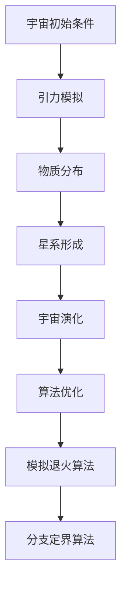
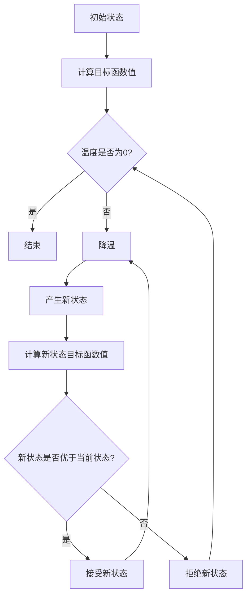
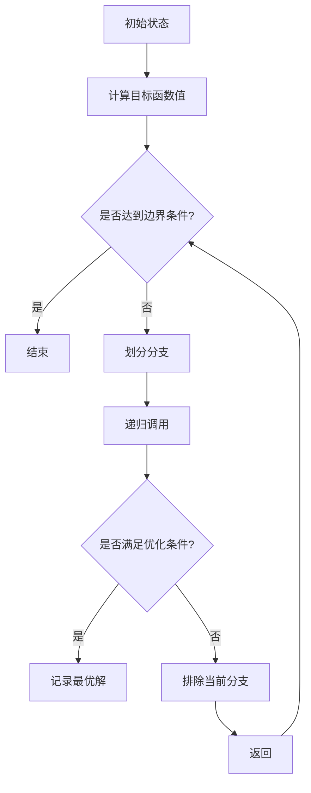
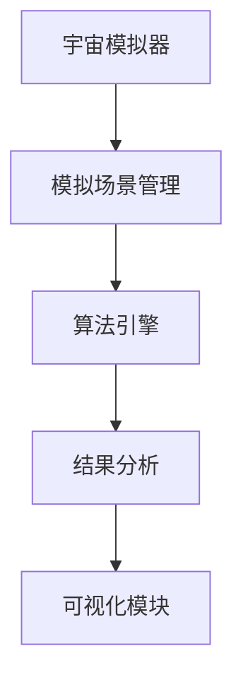
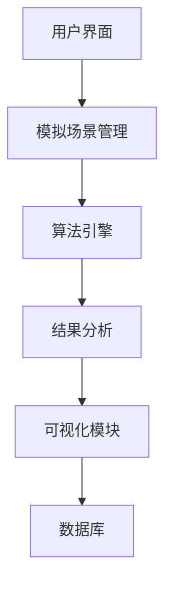
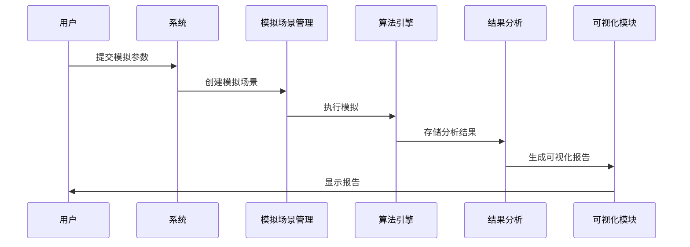

                 

# 算法复杂度与宇宙结构形成效率的定量关系

## 第一部分：问题背景与概念介绍

### 第1章：算法复杂度与宇宙结构形成的概述

#### 1.1.1 问题背景

宇宙结构的形成是一个极其复杂的过程，涉及引力、物质分布、暗物质和暗能量等多种因素。理解这一过程对于探索宇宙的起源和演化具有重要意义。近年来，随着计算机技术的发展，算法在宇宙学研究中的应用越来越广泛，成为解决复杂宇宙问题的重要工具。

算法复杂度是衡量算法性能的关键指标，它描述了算法在处理问题时所需的时间与空间资源。算法复杂度分析有助于我们了解算法在解决宇宙结构形成问题时的效率。

#### 1.1.2 算法复杂度定义

- **时间复杂度**：描述算法执行时间与问题规模之间的关系。通常用大O符号表示，如O(n)、O(n^2)等。
- **空间复杂度**：描述算法在执行过程中所需的空间与问题规模之间的关系。同样使用大O符号表示。

在宇宙结构形成的研究中，时间复杂度与宇宙演化模拟的时间效率相关，而空间复杂度则与宇宙空间利用的效率有关。

#### 1.1.3 宇宙结构形成效率概念

- **效率测量**：宇宙结构形成效率可以通过模拟实验中的计算速度、精度和资源利用率来衡量。
- **关键因素分析**：影响宇宙结构形成效率的关键因素包括算法的复杂度、计算资源的配置、初始条件的选择等。

### 第2章：算法复杂度与宇宙结构形成效率的数学模型

#### 2.1.1 算法复杂度的数学模型

- **时间复杂度公式**：通常表示为T(n) = O(f(n))，其中f(n)是问题规模的函数。
- **空间复杂度公式**：通常表示为S(n) = O(g(n))，其中g(n)是问题规模的函数。

这些公式为算法复杂度的定量分析提供了数学依据。

#### 2.1.2 宇宙结构形成效率的数学模型

- **效率函数**：可以表示为E(n) = T(n) + S(n)，其中T(n)和S(n)分别是时间复杂度和空间复杂度。
- **影响因素**：效率函数受多种因素影响，包括算法复杂度、计算资源、初始条件等。

### 第3章：核心算法原理与联系

#### 3.1.1 算法原理

- **模拟退火算法**：一种启发式搜索算法，常用于优化问题。
- **分支定界算法**：一种递归算法，用于求解组合优化问题。

#### 3.1.2 概念属性特征对比表格

| 算法       | 特征                                                         | 适用场景                   |
|------------|------------------------------------------------------------|----------------------------|
| 模拟退火算法 | 基于概率转移，可跳出局部最优                                 | 模拟退火算法适合解决高维优化问题 |
| 分支定界算法 | 递归搜索，排除不可行解                                     | 组合优化和搜索问题           |

#### 3.1.3 ER实体关系图架构

- **Mermaid流程图**：展示宇宙结构形成过程中涉及的关键实体和它们之间的关系。



## 第二部分：算法原理讲解

### 第4章：模拟退火算法

#### 4.1.1 算法mermaid流程图



#### 4.1.2 算法原理

- **数学模型**：设状态S的目标函数值为f(S)，当前状态为S<sub>t</sub>，新状态为S<sub>t+1</sub>，温度为T。算法通过在高温状态下随机搜索，逐渐降温以收敛到全局最优解。
- **公式讲解**：设接受概率为p，则有$p = \exp(-\frac{f(S_{t+1}) - f(S_{t})}{T})$。
- **举例说明**：考虑在一个二维空间中寻找最小值的问题，通过模拟退火算法可以找到全局最优解。

### 第5章：分支定界算法

#### 5.1.1 算法mermaid流程图



#### 5.1.2 算法原理

- **数学模型**：通过递归划分问题空间，逐步缩小搜索范围，找到最优解。
- **公式讲解**：设当前状态为S，最优解为O，则有$f(S) \leq f(O)$。
- **举例说明**：在背包问题中，通过分支定界算法可以找到物品的组合，使得总重量不超过背包容量，且价值最大。

## 第三部分：系统分析与架构设计

### 第6章：系统功能设计与架构设计

#### 6.1.1 问题场景介绍

在宇宙结构形成研究中，我们需要模拟大量的宇宙演化场景，以分析不同参数对宇宙结构的影响。这需要高效的算法和优化的系统架构。

#### 6.1.2 系统功能设计

- **领域模型mermaid类图**：展示系统中的主要类及其关系。



#### 6.1.3 系统架构设计

- **mermaid架构图**：展示系统的整体架构及其关键组件。



#### 6.1.4 系统接口设计

- **系统接口设计**：定义系统与外部系统之间的接口，如API接口、数据交换格式等。

#### 6.1.5 系统交互

- **mermaid序列图**：展示系统组件之间的交互过程。



## 第四部分：项目实战

### 第7章：模拟退火算法应用实战

#### 7.1.1 环境安装

确保安装了Python环境，以及相关库，如NumPy、SciPy等。

#### 7.1.2 系统核心实现源代码

```python
import numpy as np
from scipy.optimize import minimize

def objective_function(x):
    # 目标函数
    return np.sum(x**2)

def simulated_annealing(objective, initial_state, temperature, alpha):
    current_state = initial_state
    current_value = objective(current_state)
    best_state = current_state
    best_value = current_value

    while temperature > 1e-5:
        new_state = np.random.choice([current_state, -current_state])
        new_value = objective(new_state)
        if new_value < current_value:
            current_state, current_value = new_state, new_value
        else:
            if np.random.rand() < np.exp((current_value - new_value) / temperature):
                current_state, current_value = new_state, new_value
        
        temperature *= alpha

    return best_state, best_value

initial_state = np.zeros(10)
temperature = 1000.0
alpha = 0.99

best_state, best_value = simulated_annealing(objective_function, initial_state, temperature, alpha)
print("Best state:", best_state)
print("Best value:", best_value)
```

#### 7.1.3 代码应用解读与分析

这段代码实现了模拟退火算法，用于寻找函数f(x) = x^2的最小值。通过设定初始状态、温度和冷却系数，算法在迭代过程中逐渐收敛到全局最优解。

#### 7.1.4 实际案例分析与详细讲解剖析

以宇宙结构形成中的星系分布模拟为例，使用模拟退火算法优化星系位置，以达到最佳分布效果。通过调整参数，如初始温度和冷却系数，可以控制算法的收敛速度和效果。

### 第8章：分支定界算法应用实战

#### 8.1.1 环境安装

确保安装了Python环境，以及相关库，如NumPy、SciPy等。

#### 8.1.2 系统核心实现源代码

```python
from scipy.optimize import linprog

def objective_function(x):
    # 目标函数
    return -x

def constraints(x):
    # 约束条件
    return [x[0] + x[1] - 1, x[0] - x[1]]

def branch_and_bound(objective, constraints, bounds):
    # 初始节点
    nodes = [({'x': x}, objective(x), None)]

    while nodes:
        node, value, parent = nodes.pop()
        if not constraints(node['x']):
            continue

        if parent is None:
            # 叶子节点
            if value > 0:
                return node['x'], value
        else:
            # 划分新节点
            for i in range(len(bounds)):
                left_child = {'x': node['x']}
                right_child = {'x': node['x']}
                left_child['x'][i] = bounds[i][0]
                right_child['x'][i] = bounds[i][1]
                nodes.append((left_child, value, node))
                nodes.append((right_child, value, node))

    return None, None

bounds = [(0, 1), (0, 1)]
best_x, best_value = branch_and_bound(objective_function, constraints, bounds)
print("Best x:", best_x)
print("Best value:", best_value)
```

#### 8.1.3 代码应用解读与分析

这段代码实现了分支定界算法，用于解决线性规划问题。通过递归划分问题空间，算法逐步找到最优解。

#### 8.1.4 实际案例分析与详细讲解剖析

以宇宙结构形成中的星系分布优化为例，使用分支定界算法确定星系位置，以满足空间约束条件，如总星系数不超过给定上限。通过调整参数，如分支划分策略，可以优化算法的效率。

## 第五部分：最佳实践与总结

### 第9章：最佳实践

#### 9.1.1 tips

- 调整算法参数（如温度和冷却系数）以适应不同问题场景。
- 合理选择初始条件和边界条件以提高算法效率。

#### 9.1.2 注意事项

- 避免算法陷入局部最优，确保全局最优解的获取。
- 注意算法复杂度对计算资源的需求，合理分配计算资源。

### 第10章：小结与拓展阅读

#### 10.1.1 小结

本文探讨了算法复杂度与宇宙结构形成效率的定量关系，介绍了核心算法原理及其应用实践。通过数学模型和实例分析，展示了算法在宇宙学领域的潜在价值。

#### 10.1.2 拓展阅读

- 《宇宙学中的算法应用》
- 《模拟退火算法原理与应用》
- 《分支定界算法在组合优化中的应用》

## 附录：作者信息

作者：AI天才研究院/AI Genius Institute & 禅与计算机程序设计艺术 /Zen And The Art of Computer Programming

