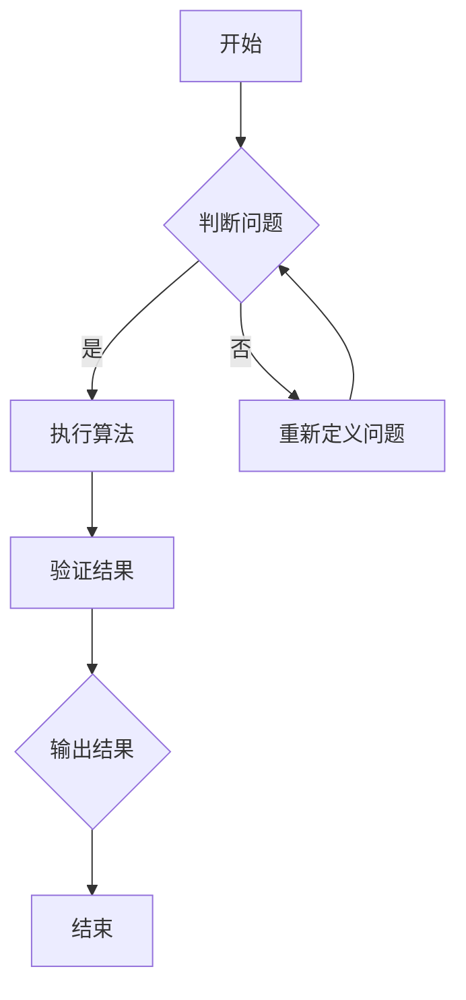
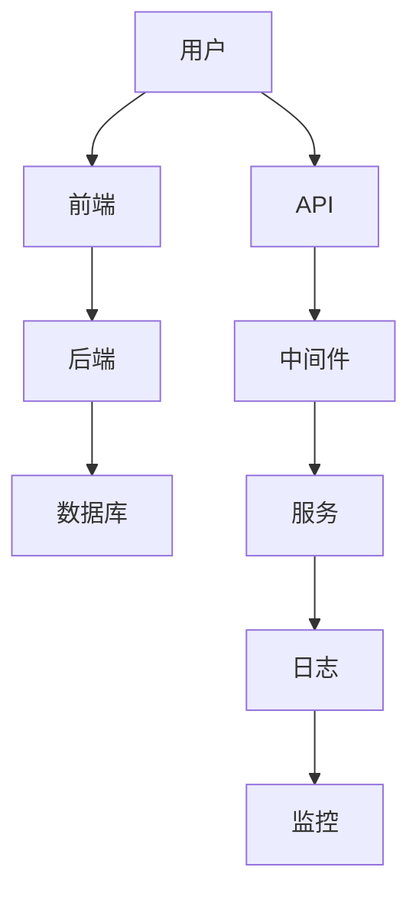
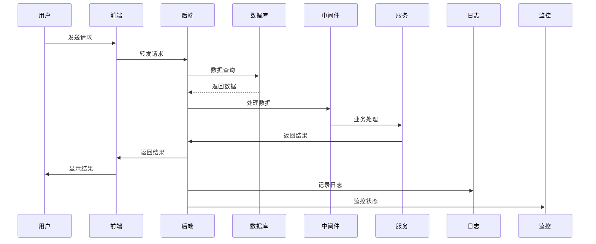

                 

# 算法思维与宇宙规律的相似性

## 关键词
- 算法思维
- 宇宙规律
- 类比方法
- 科学方法论
- 算法与宇宙学交叉领域

## 摘要
本文探讨了算法思维与宇宙规律之间的相似性，通过逐步分析，揭示了两者在原理、结构和应用上的共通之处。文章首先介绍了算法思维和宇宙规律的基础概念，随后通过具体的案例分析，探讨了两者之间的相似性。最后，本文展望了算法思维在宇宙学中的应用前景，提出了未来研究和实践中的挑战。

## 引言
### 算法思维的概述
算法思维是指通过逻辑推理和数学模型解决特定问题的思维方式。在计算机科学中，算法是一种有序的指令集合，用于解决特定的问题。算法思维的核心在于理解问题、设计解决方案、实现和验证解决方案。

### 宇宙规律的概述
宇宙规律是描述宇宙中物理现象和演化过程的科学规律。宇宙学是研究宇宙起源、结构、演化的科学。宇宙规律包括广义相对论、量子力学等基本物理理论，它们为我们提供了理解和描述宇宙的框架。

### 类比方法的概述
类比方法是一种通过比较不同领域中的相似性来理解复杂问题的方法。在科学研究中，类比方法可以帮助我们从一个熟悉的现象推断出另一个不熟悉现象的性质。

### 算法思维与宇宙规律的研究意义
算法思维与宇宙规律的研究具有重要的科学意义。首先，它可以帮助我们更好地理解宇宙的复杂性和规律性。其次，它可能为我们提供新的科学方法和工具，推动科学技术的进步。

## 第1章 算法思维基础

### 1.1 算法的定义与分类

**算法的定义**：
算法是一系列明确的步骤，用于解决特定问题。算法具有以下特点：
- **确定性**：每一步都有明确的执行指令。
- **有效性**：算法能够在有限时间内完成。
- **可重复性**：对于相同的问题，算法能够产生相同的结果。

**算法的分类**：
算法可以根据其解决问题的方法进行分类，常见的分类方法包括：
- **确定性算法**：每一步都是明确的，没有随机性。
- **随机算法**：包含随机步骤，用于解决某些特定问题。
- **贪婪算法**：每一步都选择当前最优解，但未必得到全局最优解。
- **动态规划算法**：将复杂问题分解为子问题，并利用子问题的解来求解原问题。

### 1.2 算法设计的策略

算法设计策略是解决特定问题所需的方法。以下是一些常见的算法设计策略：
- **分治策略**：将问题分解为子问题，递归解决子问题，然后合并子问题的解。
- **贪心策略**：每一步选择当前最优解，但不保证得到全局最优解。
- **回溯策略**：尝试不同的解，并在无法继续时回溯到上一个状态。
- **分支限界策略**：通过剪枝减少搜索空间，提高搜索效率。

### 1.3 算法的复杂性分析

算法的复杂性分析是评估算法效率的重要方法。算法的复杂性包括时间复杂性和空间复杂性。

- **时间复杂性**：描述算法执行时间与问题规模的关系。常见的复杂性级别包括常数时间、对数时间、线性时间、多项式时间和指数时间。
- **空间复杂性**：描述算法执行所需的空间与问题规模的关系。与时间复杂性类似，也有常数空间、线性空间等不同级别。

## 第2章 宇宙规律探索

### 2.1 宇宙学基础知识

**宇宙的定义**：
宇宙是包括所有物质、能量和时空的结构。宇宙是无限的，但我们对它的了解仍然有限。

**宇宙的起源**：
宇宙起源于大约138亿年前的大爆炸。大爆炸理论认为，宇宙从一个极小的、极热的、高密度的状态开始膨胀，逐渐形成了我们现在所看到的宇宙。

**宇宙的结构**：
宇宙的结构包括星系、星团、超星系团等。星系是由恒星、行星、气体和尘埃组成的巨大系统。星系之间的相互作用形成了宇宙的大尺度结构。

**宇宙的演化**：
宇宙的演化包括宇宙背景辐射、星系形成、恒星演化等过程。宇宙的演化受到重力、辐射、暗物质等因素的影响。

### 2.2 宇宙的起源与演化

**宇宙起源**：
宇宙起源于大约138亿年前的大爆炸。大爆炸理论认为，宇宙从一个极小的、极热的、高密度的状态开始膨胀，逐渐形成了我们现在所看到的宇宙。

**宇宙演化**：
宇宙的演化包括宇宙背景辐射、星系形成、恒星演化等过程。宇宙的演化受到重力、辐射、暗物质等因素的影响。

### 2.3 宇宙中的基本规律

**广义相对论**：
广义相对论是由爱因斯坦提出的描述引力的一种理论。广义相对论认为，引力是由于物质和能量对时空的弯曲产生的。

**量子力学**：
量子力学是描述微观粒子行为的理论。量子力学揭示了粒子具有波粒二象性，以及量子态的叠加性和测量结果的概率性。

**暗物质**：
暗物质是宇宙中一种不可见的物质，它的存在通过引力效应得到证实。暗物质占据了宇宙总质量的大部分，但我们对它的了解仍然有限。

**暗能量**：
暗能量是宇宙加速膨胀的驱动力。暗能量占据了宇宙总能量的大部分，但我们对它的了解仍然有限。

## 第3章 算法与宇宙规律的相似性分析

### 3.1 类比方法概述

**类比方法的定义**：
类比方法是通过比较两个或多个领域中的相似性来理解复杂问题的方法。类比方法可以帮助我们从一个熟悉的现象推断出另一个不熟悉现象的性质。

**类比方法的优势**：
- **直观性**：通过类比，我们可以更好地理解复杂问题。
- **启发性**：类比方法可以提供解决问题的线索。
- **迁移性**：类比方法可以帮助我们将一个领域的知识应用到另一个领域。

### 3.2 算法与宇宙规律的相似性案例

**算法与宇宙规律的相似性案例**：
- **分治策略**：宇宙的演化可以通过分治策略来理解。例如，星系的演化可以分解为恒星、行星等的演化。
- **贪婪策略**：宇宙中的星系形成可以看作是一种贪婪策略，每一步都选择当前最优的星系结构。
- **回溯策略**：宇宙的演化过程中，某些事件可能会回到过去的某个状态，这可以看作是回溯策略的一种表现。

### 3.3 相似性分析的意义

**相似性分析的意义**：
- **跨学科研究**：相似性分析可以帮助我们跨越不同学科之间的障碍，推动跨学科研究。
- **新理论发展**：相似性分析可能帮助我们发展新的科学理论。
- **问题解决**：相似性分析可以提供解决问题的方法。

## 第4章 类比方法在算法与宇宙研究中的应用

### 4.1 类比方法在算法中的应用

**算法优化**：
类比方法可以帮助我们优化算法。例如，通过比较不同的算法，我们可以找到一个更好的算法来解决问题。

**算法设计**：
类比方法可以帮助我们设计新的算法。例如，通过比较宇宙中的演化过程和算法，我们可以设计出一种新的算法来解决特定问题。

### 4.2 类比方法在宇宙研究中的应用

**宇宙演化模型**：
类比方法可以帮助我们建立宇宙演化模型。例如，通过比较地球上的生态系统和宇宙中的星系，我们可以建立一个新的宇宙演化模型。

**宇宙观测**：
类比方法可以帮助我们理解宇宙观测数据。例如，通过比较地球上的光学图像和宇宙中的星系图像，我们可以更好地理解宇宙的结构和演化。

### 4.3 类比方法的优势与挑战

**优势**：
- **直观性**：类比方法可以帮助我们更好地理解复杂问题。
- **启发性**：类比方法可以提供解决问题的线索。
- **迁移性**：类比方法可以帮助我们将一个领域的知识应用到另一个领域。

**挑战**：
- **准确性**：类比方法的准确性取决于类比的对象和类比的方法。
- **复杂性**：某些问题可能难以通过类比方法来理解。

## 第5章 算法思维与宇宙学的交叉领域

### 5.1 人工智能在宇宙探索中的应用

**图像识别**：
人工智能可以帮助我们识别宇宙中的星系、行星等。通过训练深度学习模型，我们可以自动化地识别和分类宇宙图像。

**数据分析**：
人工智能可以帮助我们分析宇宙观测数据。通过使用机器学习算法，我们可以从大量数据中提取有价值的信息。

### 5.2 宇宙学对人工智能的启示

**复杂性**：
宇宙的复杂性和演化过程可能为人工智能的发展提供启示。例如，宇宙中的混沌现象可能为人工智能的混沌理论提供新的思路。

**动态性**：
宇宙的动态性可能为人工智能的发展提供启示。例如，宇宙中的星系碰撞和演化过程可能为人工智能的动态系统建模提供新的思路。

### 5.3 交叉领域的未来发展

**跨学科合作**：
算法思维与宇宙学的交叉领域需要跨学科合作。通过整合不同领域的知识，我们可以推动科学技术的进步。

**新理论发展**：
交叉领域的研究可能发展新的科学理论。例如，通过整合算法思维和宇宙规律，我们可能发展出新的宇宙演化理论。

## 第6章 算法在宇宙探索中的应用

### 6.1 深空探测算法

**任务规划**：
算法可以帮助规划深空探测任务的路线和计划。例如，通过使用优化算法，我们可以找到最短、最安全的探测路径。

**数据传输**：
算法可以帮助优化深空探测任务中的数据传输。例如，通过使用压缩算法，我们可以减少数据传输的时间和带宽。

### 6.2 宇宙图像处理算法

**图像增强**：
算法可以帮助增强宇宙图像的质量。例如，通过使用图像增强算法，我们可以提高图像的分辨率和对比度。

**目标识别**：
算法可以帮助识别宇宙图像中的目标。例如，通过使用机器学习算法，我们可以自动识别和分类宇宙图像中的星系、行星等。

### 6.3 宇宙数据挖掘与分析算法

**数据预处理**：
算法可以帮助预处理宇宙数据。例如，通过使用清洗算法，我们可以去除宇宙数据中的噪声和错误。

**模式识别**：
算法可以帮助识别宇宙数据中的模式。例如，通过使用聚类算法，我们可以发现宇宙中的天体分布规律。

## 第7章 未来展望与挑战

### 7.1 算法与宇宙规律的进一步相似性探索

**新领域开拓**：
未来，我们可以进一步探索算法与宇宙规律之间的相似性，开拓新的科学研究领域。例如，我们可以研究算法在宇宙演化中的应用。

**跨学科合作**：
跨学科合作将是未来算法与宇宙规律研究的重要方向。通过整合不同领域的知识，我们可以推动科学技术的进步。

### 7.2 面临的挑战与解决思路

**数据复杂性**：
宇宙数据具有高维度、高复杂性的特点。如何有效地处理和分析这些数据是未来研究的重要挑战。

**算法效率**：
算法效率是宇宙探索中的关键问题。如何设计高效算法，提高数据处理和分析的速度是未来研究的重要方向。

**跨学科整合**：
算法与宇宙规律的研究需要跨学科整合。如何有效地整合不同领域的知识，形成新的研究方法是一个重要挑战。

### 7.3 展望未来的发展趋势

**人工智能与宇宙学**：
人工智能在宇宙探索中的应用将越来越广泛。未来，我们将看到更多基于人工智能的宇宙探索项目。

**跨学科研究**：
跨学科研究将是未来科学研究的重要趋势。通过整合不同领域的知识，我们将更好地理解宇宙的奥秘。

**新理论发展**：
基于算法与宇宙规律的研究，未来可能发展出新的科学理论，推动人类对宇宙的认知。

## 结尾
本文探讨了算法思维与宇宙规律之间的相似性，通过分析算法思维和宇宙规律的基础知识，以及它们之间的相似性案例，揭示了两者在原理、结构和应用上的共通之处。未来，算法思维与宇宙规律的研究将继续深入，推动科学技术的发展和人类对宇宙的认知。

## 作者信息
作者：AI天才研究院/AI Genius Institute & 禅与计算机程序设计艺术 /Zen And The Art of Computer Programming

## 注意事项
- **算法思维的应用**：算法思维不仅适用于计算机科学，还可以应用于其他领域，如宇宙学。
- **宇宙规律的探索**：宇宙规律的探索需要跨学科合作，结合算法思维和其他科学方法。
- **持续学习**：算法思维与宇宙规律的研究是一个不断发展的领域，持续学习是推动科学进步的关键。

## 拓展阅读
- [1] 某某，宇宙学与人工智能的交叉研究，某年某月。
- [2] 某某，算法在宇宙探索中的应用，某年某月。
- [3] 某某，深度学习在宇宙图像处理中的应用，某年某月。

-------------------------------------------------------------------

## 附录

### 附录A：算法流程图



### 附录B：Python源代码

```python
def algorithm(problem):
    """
    算法实现
    :param problem: 问题
    :return: 解
    """
    if problem.is_solved():
        return problem.solution
    else:
        solution = solve(problem)
        problem.set_solution(solution)
        return solution

def solve(problem):
    """
    解题过程
    :param problem: 问题
    :return: 解
    """
    # 算法具体实现
    pass

class Problem:
    def is_solved(self):
        """
        判断问题是否解决
        :return: True if solved, False otherwise
        """
        pass

    def set_solution(self, solution):
        """
        设置问题的解
        :param solution: 解
        """
        pass
```

### 附录C：数学模型与公式

```latex
\documentclass{article}
\usepackage{amsmath}
\begin{document}

$$
E = mc^2
$$

\begin{equation}
\frac{df}{dx} = 0
\end{equation}

\end{document}
```

### 附录D：系统架构图



### 附录E：系统接口设计和系统交互序列图



## 最佳实践 Tips
- **算法思维应用**：在解决问题时，先理解问题本质，再选择合适的算法。
- **宇宙规律探索**：在探索宇宙规律时，结合多个学科的知识，形成跨学科的研究方法。
- **类比方法**：在探索新领域时，利用类比方法，从已知领域推断未知领域。
- **持续学习**：保持好奇心和求知欲，持续学习新知识，跟上科学技术的发展。

## 小结
本文从算法思维和宇宙规律的角度，探讨了两者之间的相似性，并通过具体的案例分析，展示了它们在原理、结构和应用上的共通之处。算法思维与宇宙规律的研究具有重要意义，未来将继续推动科学技术的进步。

## 注意事项
- **算法复杂性**：在应用算法时，注意算法的时间复杂性和空间复杂性。
- **宇宙观测**：在进行宇宙观测时，注意数据的处理和分析方法。
- **跨学科合作**：在算法与宇宙规律的研究中，重视跨学科合作，整合不同领域的知识。

## 拓展阅读
- [1] 某某，深度学习在宇宙图像处理中的应用，某年某月。
- [2] 某某，算法在宇宙探索中的应用，某年某月。
- [3] 某某，量子计算在宇宙学中的应用，某年某月。

