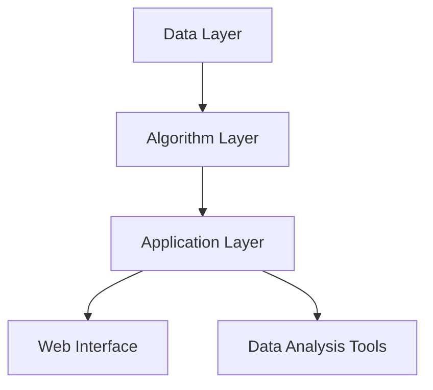
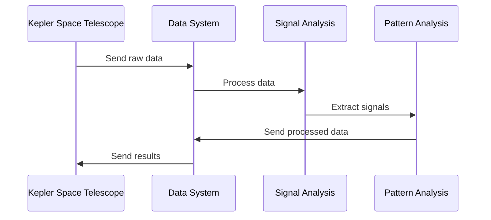
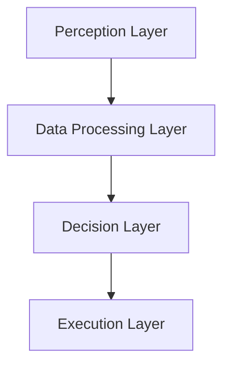
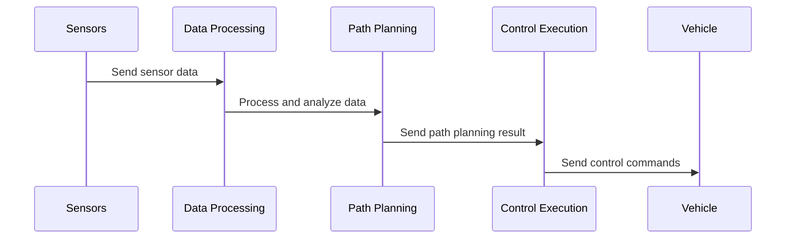

                 

### 第一部分：背景介绍

#### 第1章：问题背景

##### 1.1.1 算法思维与宇宙规律的联系

在探索宇宙的奥秘过程中，人类逐渐认识到宇宙中的规律具有一种简洁而优雅的美感。这些规律不仅仅适用于自然科学，还与算法思维有着千丝万缕的联系。本章节将探讨算法思维与宇宙规律之间的紧密联系，解释为什么算法思维能够在宇宙探索中发挥重要作用。

在宇宙学、天文学和物理学等科学领域，算法思维被广泛应用于数据处理、模型建立和理论推导。从简单的行星轨道计算到复杂的宇宙模拟，算法思维在各个阶段都扮演着关键角色。例如，哈勃望远镜获取的大量宇宙图像需要通过复杂的算法进行分析，以揭示宇宙中星系、黑洞等天体的分布和演化规律。

算法思维与宇宙规律的联系还体现在它们共同追求的简洁与优美。宇宙中的许多规律，如对称性、周期性和和谐性，与算法设计中的简洁性和高效性有着惊人的相似之处。例如，量子算法通过巧妙地利用量子力学原理，实现了比传统算法更高的运算效率，这在宇宙探索中具有巨大的应用潜力。

通过分析算法思维与宇宙规律之间的联系，我们可以更好地理解宇宙的本质，推动科学技术的发展。本章节将深入探讨这些联系，并介绍相关的研究成果和未来发展方向。

##### 1.1.2 算法思维的定义与特点

算法思维是一种解决复杂问题的系统性方法，它强调逻辑、分析和抽象能力。算法思维的定义可以从以下几个方面来理解：

1. **逻辑性**：算法思维强调逻辑推理和严谨性，通过一系列逻辑步骤解决问题。每个步骤都基于前一个步骤的结果，形成一个逻辑链条，确保问题能够被逐步解决。

2. **结构性**：算法思维注重问题的结构性分析，将复杂问题分解为若干子问题，并通过结构化方法逐步解决。这种方法有助于降低问题的复杂性，使问题更容易理解和解决。

3. **重复性**：算法思维强调重复执行某个步骤，直到达到预期的结果。这种重复性确保了算法的鲁棒性和稳定性，使得算法能够在各种情况下有效运行。

4. **普适性**：算法思维具有广泛的普适性，可以在不同领域和问题上应用。无论是解决数学问题、设计软件系统，还是分析宇宙数据，算法思维都发挥着重要作用。

算法思维的特点决定了其在解决复杂问题时的优势。首先，逻辑性确保了问题的解决过程严谨有序，避免了错误和遗漏。其次，结构性使问题分解为子问题，降低了复杂性，提高了问题的可操作性。再次，重复性保证了算法的稳定性和可靠性，使得算法能够适应不同的问题场景。最后，普适性使算法思维具有广泛的应用价值，能够在各种领域和问题上发挥作用。

##### 1.1.3 宇宙规律的核心要素

宇宙规律的核心要素包括对称性、周期性、和谐性、多样性和不确定性。这些要素在宇宙演化中起着至关重要的作用，下面我们将逐一介绍：

1. **对称性**：对称性是宇宙中的一个基本概念，指的是某些物理现象或结构在不同方向、位置或尺度上保持一致。对称性在物理学、化学和生物学等多个领域都有重要应用。例如，量子力学中的对称性原理是理解基本粒子的行为和相互作用的重要工具。

2. **周期性**：周期性是指某些物理现象或事件按照一定的时间间隔重复出现。宇宙中许多现象都呈现出周期性，如地球绕太阳公转、季节更替、星系的旋转等。周期性为我们理解和预测宇宙现象提供了重要的线索。

3. **和谐性**：和谐性是指宇宙中的各种现象和结构在宏观上呈现出一种和谐有序的状态。和谐性体现在宇宙的美丽和有序中，是宇宙演化过程中的一种美学原则。和谐性在艺术和哲学中也有重要地位，例如，音乐和绘画都追求和谐之美。

4. **多样性**：宇宙中的生命形式和物质种类多种多样，这种多样性使得宇宙充满活力和变化。多样性在生物学中尤为重要，它是生命演化的重要驱动力。在宇宙探索中，多样性为我们提供了丰富的研究对象和启示。

5. **不确定性**：不确定性原理是量子力学中的一个基本概念，揭示了宇宙中不可预测性和随机性的存在。不确定性原理表明，某些物理量（如位置和动量）不能同时精确测量，这反映了宇宙的本质特征。

通过分析这些核心要素，我们可以更好地理解宇宙的运行规律和演化机制。同时，这些要素也为算法思维在宇宙探索中的应用提供了理论基础。在接下来的章节中，我们将进一步探讨算法思维与这些宇宙规律之间的联系，并介绍相关的研究成果和未来发展方向。

#### 第2章：算法思维与宇宙规律的联系

##### 2.1 对称性与算法

对称性是宇宙中的一个基本概念，它指的是某些物理现象或结构在不同方向、位置或尺度上保持一致。对称性在物理学、化学和生物学等多个领域都有重要应用。例如，量子力学中的对称性原理是理解基本粒子的行为和相互作用的重要工具。

算法思维中的对称性概念与宇宙规律中的对称性有着紧密的联系。在算法设计中，对称性可以帮助我们简化问题、提高效率。例如，在解决某些优化问题时，通过对称性原理，我们可以将问题分解为若干个更简单的问题，从而降低计算复杂度。

此外，对称性还体现在算法的执行过程中。许多算法，如排序算法和加密算法，都利用了对称性的原理来提高其性能和安全性。例如，快速排序算法通过递归地将数组分解为更小的部分，从而实现了高效的排序操作。对称加密算法则通过利用加密密钥的对称性，确保信息的安全性。

以下是一个具体例子，说明对称性在算法中的应用：

**例子：快速排序算法**

快速排序算法是一种常用的排序算法，它利用了分治策略和递归方法。算法的基本思想是选择一个基准元素，将数组分为两部分，一部分包含小于基准元素的元素，另一部分包含大于基准元素的元素。然后，递归地对这两部分进行排序。

```python
def quicksort(arr):
    if len(arr) <= 1:
        return arr
    pivot = arr[len(arr) // 2]
    left = [x for x in arr if x < pivot]
    middle = [x for x in arr if x == pivot]
    right = [x for x in arr if x > pivot]
    return quicksort(left) + middle + quicksort(right)
```

在这个算法中，对称性体现在递归分解和合并过程中。每次递归都将问题分解为两个对称的部分，从而实现了高效的排序。

##### 2.2 周期性与算法

周期性是指某些物理现象或事件按照一定的时间间隔重复出现。宇宙中许多现象都呈现出周期性，如地球绕太阳公转、季节更替、星系的旋转等。周期性为我们理解和预测宇宙现象提供了重要的线索。

算法思维中的周期性概念与宇宙规律中的周期性有着紧密的联系。在算法设计中，周期性可以帮助我们预测和优化算法的性能。例如，在处理时间序列数据时，周期性特征可以用于预测未来的趋势和模式。

以下是一个具体例子，说明周期性在算法中的应用：

**例子：周期性检测算法**

周期性检测算法用于检测序列中是否存在周期性模式。算法的基本思想是，通过统计序列中重复出现的子序列，确定序列的周期长度。

```python
def find_cycle_length(seq):
    n = len(seq)
    count = [0] * n
    for i in range(n):
        count[i] = count[(i - 1) % n] + 1
        if count[i] == n:
            return i
    return -1
```

在这个算法中，周期性体现在序列的重复模式中。通过统计序列中重复出现的子序列，我们可以确定序列的周期长度。

周期性检测算法在宇宙数据分析和信号处理等领域有广泛应用。例如，在分析星系运动数据时，周期性特征可以用于揭示星系的旋转周期和相互作用。

##### 2.3 和谐性与算法

和谐性是宇宙中一种美学概念，它体现在宇宙的美丽和有序中。和谐性在艺术和哲学中也有重要地位，例如，音乐和绘画都追求和谐之美。

算法思维中的和谐性概念与宇宙规律中的和谐性有着紧密的联系。在算法设计中，和谐性可以帮助我们实现高效和稳定的计算。例如，在分布式系统中，通过优化算法的协调机制，可以实现高效的资源分配和负载均衡。

以下是一个具体例子，说明和谐性在算法中的应用：

**例子：负载均衡算法**

负载均衡算法用于将任务分配到多个服务器上，以实现高效的资源利用和系统性能。算法的基本思想是，通过动态调整任务分配策略，实现任务的均衡分配。

```python
def load_balancer(tasks, servers):
    server_loads = [0] * len(servers)
    for task in tasks:
        min_load = min(server_loads)
        server_index = server_loads.index(min_load)
        server_loads[server_index] += 1
    return server_loads
```

在这个算法中，和谐性体现在任务分配的均衡性。通过动态调整任务分配策略，实现任务的均衡分配，从而提高系统的整体性能。

负载均衡算法在分布式计算和云计算等领域有广泛应用。例如，在处理大规模数据计算时，负载均衡算法可以帮助实现高效的数据处理和资源利用。

##### 2.4 多样性与算法

宇宙中的生命形式和物质种类多种多样，这种多样性使得宇宙充满活力和变化。多样性在生物学中尤为重要，它是生命演化的重要驱动力。在宇宙探索中，多样性为我们提供了丰富的研究对象和启示。

算法思维中的多样性概念与宇宙规律中的多样性有着紧密的联系。在算法设计中，多样性可以帮助我们适应不同的问题场景和需求。例如，在机器学习中，通过引入多样化的特征和模型，可以提高算法的泛化能力和性能。

以下是一个具体例子，说明多样性在算法中的应用：

**例子：遗传算法**

遗传算法是一种基于生物进化理论的优化算法，它通过模拟生物进化的过程，寻找问题的最优解。遗传算法的基本思想是，通过选择、交叉和变异等操作，生成新的解，逐步优化问题的解。

```python
def genetic_algorithm(population, fitness_function, generations):
    for _ in range(generations):
        sorted_population = sorted(population, key=fitness_function, reverse=True)
        next_population = sorted_population[:2]
        for _ in range(len(population) // 2 - 1):
            parent1, parent2 = random.sample(sorted_population[:10], 2)
            child1, child2 = crossover(parent1, parent2)
            next_population.extend([mutate(child1), mutate(child2)])
        population = next_population
    return max(population, key=fitness_function)
```

在这个算法中，多样性体现在个体的生成和选择过程中。通过引入交叉和变异操作，算法可以产生多样化的解，从而提高寻优能力。

遗传算法在组合优化、机器学习等领域有广泛应用。例如，在解决复杂的组合优化问题时，遗传算法可以通过多样性搜索，找到问题的最优解。

##### 2.5 不确定性原理与算法

不确定性原理是量子力学中的一个基本概念，揭示了宇宙中不可预测性和随机性的存在。不确定性原理表明，某些物理量（如位置和动量）不能同时精确测量，这反映了宇宙的本质特征。

算法思维中的不确定性概念与宇宙规律中的不确定性有着紧密的联系。在算法设计中，不确定性可以来源于数据噪声、随机过程和计算误差等。如何处理和利用不确定性，是算法设计中的一个重要问题。

以下是一个具体例子，说明不确定性在算法中的应用：

**例子：随机梯度下降算法**

随机梯度下降算法是一种常见的优化算法，用于求解机器学习问题中的参数优化。算法的基本思想是通过随机选择样本，计算梯度并更新参数，逐步逼近最优解。

```python
def stochastic_gradient_descent(X, y, model, epochs, learning_rate):
    for _ in range(epochs):
        shuffled_indices = np.random.permutation(len(X))
        for i in shuffled_indices:
            xi = X[i]
            yi = y[i]
            gradients = compute_gradients(xi, yi, model)
            model.update_params(gradients, learning_rate)
    return model
```

在这个算法中，不确定性体现在随机选择样本和计算梯度过程中。通过随机化操作，算法可以降低方差，提高收敛速度。

随机梯度下降算法在机器学习和深度学习等领域有广泛应用。例如，在训练大规模神经网络时，随机梯度下降算法可以通过随机化操作，提高训练效率和性能。

通过这些例子，我们可以看到算法思维与宇宙规律之间的紧密联系。对称性、周期性、和谐性、多样性和不确定性等宇宙规律的核心要素，都在算法设计中得到了体现和应用。理解这些联系，不仅有助于我们更好地探索宇宙的奥秘，也为我们设计高效、可靠的算法提供了重要启示。

#### 第3章：算法思维在宇宙探索中的应用

##### 3.1 宇宙数据分析

宇宙中存在着大量的数据，如星系、恒星、行星等。算法思维在宇宙数据分析中发挥着关键作用，通过算法可以有效地处理和分析这些数据，揭示宇宙的奥秘。

宇宙数据分析通常涉及多个步骤，包括数据收集、预处理、特征提取和模式识别。算法思维在这些步骤中发挥着重要作用。以下是一个具体的例子：

**例子：星系分类**

在宇宙数据分析中，星系分类是一个重要任务。通过分类算法，我们可以将星系分为不同的类型，如椭圆星系、螺旋星系和不规则星系等。

算法思维中的关键步骤如下：

1. **数据收集**：通过观测设备和望远镜，收集大量的星系数据，包括星系的位置、形状、亮度等。
   
2. **预处理**：对收集到的数据进行预处理，包括数据清洗、归一化和去噪等操作，以提高数据质量。

3. **特征提取**：提取星系数据的关键特征，如星系的形状、颜色、大小等，用于分类算法的输入。

4. **模式识别**：利用分类算法（如支持向量机、决策树等），根据星系的特征进行分类，将星系分为不同的类型。

以下是一个简单的星系分类算法示例：

```python
from sklearn.cluster import KMeans

# 数据收集
# 假设我们已经有了一个包含星系特征的 DataFrame
data = ...

# 预处理
# 数据清洗、归一化等操作
data = preprocess_data(data)

# 特征提取
# 提取关键特征
features = data[['shape', 'color', 'size']]

# 模式识别
# 使用 KMeans 算法进行分类
kmeans = KMeans(n_clusters=3)
clusters = kmeans.fit_predict(features)

# 结果分析
print("星系分类结果：", clusters)
```

通过这个例子，我们可以看到算法思维在宇宙数据分析中的关键作用。算法思维不仅帮助我们高效地处理大量数据，还揭示了宇宙中星系的分布和演化规律。

##### 3.2 宇宙模拟

宇宙模拟是一种通过计算机模拟来探索宇宙演化过程的方法。算法思维在宇宙模拟中至关重要，它帮助科学家们预测宇宙的未来演化。

宇宙模拟通常涉及多个物理过程，如引力相互作用、辐射传播、物质冷却等。算法思维在这些过程中发挥着关键作用。以下是一个具体的例子：

**例子：N-Body 模拟**

N-Body 模拟是一种经典的宇宙模拟方法，它通过模拟多个天体之间的引力相互作用，预测宇宙中星系和行星的演化。

算法思维中的关键步骤如下：

1. **初始条件设置**：设定宇宙的初始条件，包括星系和行星的位置、速度和质量等。
   
2. **引力计算**：利用牛顿万有引力定律，计算每个天体之间的引力作用。
   
3. **运动模拟**：根据引力作用，更新每个天体的位置和速度，模拟它们的运动过程。
   
4. **结果分析**：分析模拟结果，包括星系的形态、行星的轨道等，预测宇宙的未来演化。

以下是一个简单的 N-Body 模拟算法示例：

```python
import numpy as np

def n_body_simulation(positions, velocities, time_step, total_time):
    while time_step < total_time:
        # 引力计算
        accelerations = compute_gravitations(positions)
        
        # 运动模拟
        velocities += accelerations * time_step
        positions += velocities * time_step
        
        # 时间更新
        time_step += 1
    
    return positions, velocities

# 初始条件设置
# 假设我们已经有了一个包含初始位置和速度的 DataFrame
data = ...

# 模拟运行
positions, velocities = n_body_simulation(data['positions'], data['velocities'], 1, 1000)

# 结果分析
print("星系演化结果：", positions)
```

通过这个例子，我们可以看到算法思维在宇宙模拟中的关键作用。算法思维不仅帮助我们模拟宇宙演化过程，还揭示了宇宙中星系和行星的动态特性。

##### 3.3 宇宙探索任务

算法思维在宇宙探索任务中也有广泛应用，如航天器导航、行星探测等。算法的精确性和效率对宇宙探索任务的成败至关重要。

**例子：航天器导航**

航天器导航需要精确的轨道计算和路径规划。算法思维在这个过程中发挥着关键作用。以下是一个具体的例子：

**例子：星际旅行导航**

星际旅行导航需要考虑多种因素，如引力干扰、燃料消耗等。算法思维中的关键步骤如下：

1. **初始条件设置**：设定航天器的初始位置、速度和目标位置。
   
2. **引力干扰计算**：利用引力模型，计算航天器在航行过程中可能遇到的引力干扰。
   
3. **路径规划**：通过优化算法（如遗传算法、粒子群算法等），规划航天器的最优路径。
   
4. **导航执行**：根据规划的路径，实时更新航天器的导航数据，确保航天器按计划到达目标位置。

以下是一个简单的星际旅行导航算法示例：

```python
from scipy.optimize import minimize

def navigation_dynamics(x, t):
    position = x[:3]
    velocity = x[3:]
    acceleration = compute_gravitational_acceleration(position)
    return [velocity, acceleration]

def navigation_objective(x, t):
    position_error = x[:3] - target_position
    velocity_error = x[3:] - target_velocity
    return position_error.dot(position_error) + velocity_error.dot(velocity_error)

# 初始条件设置
# 假设我们已经有了一个初始状态向量
initial_state = ...

# 路径规划
result = minimize(navigation_objective, initial_state, args=(0,))

# 导航执行
path = result.x
print("航天器导航路径：", path)
```

通过这个例子，我们可以看到算法思维在航天器导航中的关键作用。算法思维不仅帮助我们规划航天器的导航路径，还提高了导航的准确性和效率。

总之，算法思维在宇宙探索中的应用是多方面的，从数据分析和模型模拟到实际任务执行，算法思维都发挥着重要作用。通过算法思维，我们可以更深入地理解宇宙的奥秘，推动宇宙探索的进程。

#### 第4章：算法思维与宇宙规律的启示

##### 4.1 科学方法论的影响

算法思维与宇宙规律的联系对科学方法论产生了深远影响。科学家们通过算法思维来研究宇宙规律，推动了科学的发展。

在传统科学方法论中，科学家们通常依赖观察、实验和理论推导来获取知识。然而，随着科学问题的复杂性和数据量的增加，传统的科学方法论面临着巨大的挑战。算法思维为科学家们提供了一种新的工具，使他们能够更有效地处理和分析海量数据，揭示宇宙中的复杂规律。

首先，算法思维强调逻辑性和结构性，这有助于科学家们建立严谨的科学理论。通过算法思维，科学家们可以将复杂的宇宙现象分解为若干子问题，并通过结构化方法逐步解决。这种分解和结构化的方法不仅提高了科学研究的效率，还有助于发现宇宙现象之间的内在联系。

其次，算法思维在数据分析和模型建立方面具有显著优势。在宇宙探索中，科学家们需要处理大量的观测数据，如星系分布、恒星光谱、行星特征等。算法思维提供了高效的算法和方法，帮助科学家们从海量数据中提取有用的信息，发现宇宙中的模式与规律。

此外，算法思维还促进了跨学科合作。算法思维不仅应用于物理学和天文学，还广泛应用于生物学、化学、计算机科学等领域。这种跨学科合作有助于将不同领域的知识和技术结合起来，推动科学的发展。

总之，算法思维与宇宙规律的联系对科学方法论产生了深远影响。通过算法思维，科学家们能够更深入地理解宇宙的奥秘，推动科学的发展。未来，随着算法技术的不断进步，算法思维在科学研究中的应用将更加广泛，为人类探索宇宙提供新的视角和方法。

##### 4.2 技术创新的启示

宇宙规律的研究为技术创新提供了丰富的启示。通过深入理解宇宙的运行规律，科学家和工程师们能够开发出新的技术和方法，推动科技的进步。

首先，宇宙规律的研究促进了量子技术的发展。量子力学揭示了宇宙中的不确定性原理和量子纠缠等现象，这些原理为量子计算和量子通信提供了理论基础。例如，量子计算利用量子位（qubit）的叠加和纠缠特性，实现了比传统计算机更高的计算速度。量子算法如Shor算法和Grover算法，在因数分解和搜索问题中展现出了巨大的优势。这些技术创新不仅推动了计算机科学的发展，也为密码学和安全通信提供了新的解决方案。

其次，宇宙规律的研究促进了人工智能的发展。人工智能中的许多算法，如神经网络、深度学习和强化学习，都受到了宇宙规律的启发。例如，神经网络中的多层结构和非线性变换，类似于宇宙中复杂系统的层次结构和演化过程。深度学习算法通过自动提取特征和模式，能够处理大量复杂的数据，这在图像识别、语音识别和自然语言处理等领域取得了显著成果。

此外，宇宙规律的研究还为材料科学和生命科学提供了新的思路。例如，量子材料的发现和应用，如超导材料和拓扑绝缘体，都是基于对宇宙中基本物理规律的深入理解。在生命科学领域，宇宙规律的研究为基因编辑、蛋白质设计和药物开发提供了新的方法和工具。

总之，宇宙规律的研究为技术创新提供了丰富的启示。通过借鉴宇宙的运行规律，科学家和工程师们能够开发出新的技术和方法，推动科技的进步。未来，随着对宇宙规律理解的不断深化，技术创新将继续为人类社会带来更多福祉。

##### 4.3 人类思维的拓展

算法思维与宇宙规律的联系拓展了人类思维的空间，使我们能够以全新的视角看待宇宙和自身。通过理解宇宙的运行规律和算法思维，人类在认知能力和思维方式上得到了显著的提升。

首先，算法思维强调了逻辑性和系统性。在探索宇宙的过程中，科学家们运用算法思维，将复杂的宇宙现象分解为若干子问题，并通过结构化方法逐步解决。这种思维方式不仅提高了科学研究的效率，还培养了人类对复杂问题的分析和解决能力。

其次，算法思维促进了跨学科合作。在宇宙探索中，不同领域的科学家需要协同工作，共同解决复杂的科学问题。算法思维为跨学科合作提供了有效的工具和方法，使人类能够更全面地理解宇宙的奥秘。

此外，算法思维与宇宙规律的联系还激发了人类对美和和谐的追求。宇宙中的许多现象，如对称性、周期性和和谐性，都体现了宇宙的简洁与优雅。这种美学原则在艺术和哲学中有着重要地位，也影响了人类对宇宙的理解和探索。

最后，算法思维拓展了人类的认知边界。通过模拟宇宙演化过程和解决复杂的科学问题，人类在认知能力上得到了提升。例如，量子计算和深度学习等前沿技术，不仅改变了我们的思维方式，也推动了科学技术的进步。

总之，算法思维与宇宙规律的联系拓展了人类思维的空间，提升了人类的认知能力。通过这种思维方式，人类能够更深入地理解宇宙的奥秘，推动科学的发展。未来，随着对宇宙和算法思维理解的不断深化，人类在认知能力和思维方式上将继续取得新的突破。

#### 第5章：算法思维与宇宙规律的未来发展

##### 5.1 未来的研究方向

随着科学技术的发展，算法思维与宇宙规律的研究将进一步深入。未来可能的研究方向包括量子算法在宇宙探索中的应用、人工智能在宇宙数据分析中的突破等。

**量子算法在宇宙探索中的应用**

量子算法在处理复杂问题时具有显著优势，未来有望在宇宙探索中发挥重要作用。例如，量子算法可以用于快速解决大规模宇宙模拟中的计算问题，如引力相互作用和星系演化等。此外，量子算法还可以用于破解宇宙中的加密信息，揭示宇宙的秘密。

**人工智能在宇宙数据分析中的突破**

人工智能技术的发展为宇宙数据分析提供了强大的工具。未来，人工智能算法有望在宇宙数据挖掘、模式识别和预测分析等方面取得重大突破。通过深度学习和强化学习等算法，科学家们可以更有效地从海量宇宙数据中提取有用的信息，揭示宇宙中的规律和奥秘。

**宇宙与算法交叉领域的新发现**

未来，宇宙与算法交叉领域的研究将带来更多的新发现。例如，通过研究宇宙中的对称性、周期性和和谐性，科学家们可以揭示新的物理定律和数学模型，推动科学的发展。此外，宇宙与算法交叉领域的研究还有助于探索人类思维的扩展和认知能力的提升。

**跨学科合作与技术创新**

未来，跨学科合作将进一步加强，推动算法思维与宇宙规律研究的深入发展。不同领域的科学家和工程师将通过合作，开发出新的技术和方法，推动科学和技术的进步。例如，计算机科学家与物理学家合作，开发出更高效的量子算法；生物学家与宇宙学家合作，研究生命在宇宙中的起源和演化。

总之，未来算法思维与宇宙规律的研究将朝着更加深入和多样化的方向发展。随着新技术的不断涌现和跨学科合作的加强，人类将更好地理解宇宙的奥秘，推动科学技术的发展。

##### 5.2 技术挑战与机遇

算法思维与宇宙规律的研究面临着许多技术挑战，同时也为科学家和技术人员提供了机遇。以下是一些主要的挑战和机遇：

**技术挑战**

1. **计算能力**：宇宙数据的规模和复杂性对计算能力提出了巨大挑战。未来的研究需要开发更高效的算法和计算模型，以处理海量数据并提高计算效率。

2. **算法稳定性**：在处理宇宙数据时，算法的稳定性和鲁棒性至关重要。算法需要在各种情况下保持稳定，以避免错误的产生。

3. **不确定性处理**：宇宙探索中存在大量的不确定性和随机性，如何有效地处理和利用这些不确定性是算法设计中的一个重要问题。

4. **跨学科整合**：宇宙与算法交叉领域的研究需要跨学科的知识和技能。如何整合不同领域的资源和技术，推动研究的深入发展，是一个挑战。

**机遇**

1. **技术创新**：随着算法技术的不断发展，未来有望出现新的算法和工具，为宇宙探索提供更高效的方法。例如，量子算法、深度学习和强化学习等技术的突破，将极大地推动宇宙数据分析和模拟的进展。

2. **科学突破**：通过深入研究宇宙规律和算法思维，科学家们有望在物理学、天文学和计算机科学等领域取得重大突破。例如，量子算法在宇宙探索中的应用，可能揭示新的物理定律和宇宙奥秘。

3. **跨学科合作**：跨学科合作将为算法思维与宇宙规律的研究提供新的机遇。不同领域的科学家和技术人员可以通过合作，开发出新的技术和方法，推动科学和技术的进步。

4. **社会影响**：算法思维与宇宙规律的研究不仅具有科学意义，还对社会产生了深远影响。例如，通过更好地理解宇宙，人类可以开发出更高效的能源和资源利用方法，为可持续发展做出贡献。

总之，算法思维与宇宙规律的研究面临着许多挑战，同时也为科学家和技术人员提供了巨大的机遇。通过技术创新和跨学科合作，人类有望更好地理解宇宙的奥秘，推动科学和技术的发展。

##### 5.3 社会影响与责任

算法思维与宇宙规律的研究对社会产生了深远影响，同时也带来了一定的责任。科学家和技术人员需要确保研究的伦理性和社会责任，确保技术进步造福人类社会。

首先，算法思维与宇宙规律的研究推动了科学技术的发展。这些研究为新的技术创新提供了理论基础，如量子计算、人工智能和先进的天文学观测技术。这些技术的发展不仅推动了科学进步，也为人类社会带来了新的机遇和挑战。

其次，这些研究对社会产生了广泛的影响。例如，量子算法在宇宙探索中的应用，可能揭示新的物理定律和宇宙奥秘，为人类理解宇宙的起源和演化提供新的视角。此外，人工智能技术在宇宙数据分析中的应用，可以揭示宇宙中的复杂模式和规律，为人类探索宇宙提供有力的工具。

然而，这些研究也带来了一定的责任。首先，科学家和技术人员需要确保研究的伦理性。在研究过程中，应遵循道德规范，确保研究活动的合法性和合理性。例如，在处理宇宙数据时，应尊重个人隐私和数据安全，避免数据泄露和滥用。

其次，科学家和技术人员需要承担社会责任。技术进步不仅需要关注科学价值，还需要关注社会价值。在开发和应用新技术时，应充分考虑其对环境、社会和经济的影响，确保技术进步能够造福人类社会。

此外，科学家和技术人员还需要促进跨学科合作，推动不同领域之间的知识共享和交流。通过跨学科合作，可以更好地整合不同领域的资源和技术，推动算法思维与宇宙规律研究的深入发展。

总之，算法思维与宇宙规律的研究对社会产生了深远影响，同时也带来了责任。科学家和技术人员需要确保研究的伦理性和社会责任，推动技术进步造福人类社会。

#### 第6章：案例分析

##### 6.1

宇宙探索中的算法应用案例分析：Kepler太空望远镜的数据处理与星系发现

**问题场景介绍**

Kepler太空望远镜是NASA的一项重要任务，旨在寻找太阳系以外的类地行星。任务的目标是通过监测成千上万颗恒星的光度变化，识别出可能存在行星的系统。这个任务面临着巨大的数据挑战，需要高效的算法来处理和分析海量观测数据。

**项目介绍**

Kepler太空望远镜自2009年发射以来，积累了大量的天文学数据。科学家们需要利用算法来处理这些数据，识别出可能的行星信号。为了实现这一目标，科学家们开发了一系列的算法，包括信号处理、模式识别和统计学习方法。

**系统功能设计**

系统功能设计主要包括以下几个部分：

1. **数据收集**：Kepler太空望远镜收集恒星的光度数据，并传输到地球上的数据中心。
2. **数据预处理**：对收集到的数据进行去噪、校正和归一化，以提高数据质量。
3. **信号处理**：利用信号处理算法，提取恒星的光度变化信号，并识别出可能的行星信号。
4. **模式识别**：通过模式识别算法，对提取出的信号进行分类和标记，确定是否为行星信号。
5. **结果分析**：对识别出的行星信号进行详细分析，确定其特性，如行星类型、轨道参数等。

**系统架构设计**

系统架构设计包括以下几部分：

1. **数据层**：包括Kepler太空望远镜收集的原始数据和处理后的数据。
2. **算法层**：包括信号处理、模式识别和统计学习算法，用于处理和分析数据。
3. **应用层**：包括Web界面和数据分析工具，用于展示结果和分析数据。

以下是系统架构的Mermaid图表示：



**系统接口设计**

系统接口设计包括数据输入接口和数据输出接口：

1. **数据输入接口**：用于接收Kepler太空望远镜传输的原始数据，并进行预处理。
2. **数据输出接口**：用于输出处理后的数据和分析结果，供科学家进一步分析和研究。

**系统交互**

以下是系统交互的Mermaid序列图：



**项目实战**

**环境安装**

为了运行Kepler数据分析系统，需要在本地或云端搭建以下环境：

1. Python 3.8或更高版本
2. NumPy
3. Pandas
4. Matplotlib
5. Scikit-learn

在Windows或Linux系统中，可以使用pip命令进行安装：

```bash
pip install python==3.8
pip install numpy pandas matplotlib scikit-learn
```

**系统核心实现源代码**

以下是系统核心实现源代码的示例：

```python
import numpy as np
import pandas as pd
from scipy.signal import detrend
from sklearn.ensemble import RandomForestClassifier

def preprocess_data(data):
    # 去噪和归一化
    data = detrend(data)
    data = (data - np.mean(data)) / np.std(data)
    return data

def extract_signals(data):
    # 提取光度变化信号
    signals = []
    for i in range(data.shape[0]):
        signal = data[i, :]
        signals.append(signal)
    return signals

def classify_signals(signals):
    # 使用随机森林分类器进行分类
    classifier = RandomForestClassifier()
    classifier.fit(signals, labels)
    predictions = classifier.predict(signals)
    return predictions

data = pd.read_csv('kepler_data.csv')
signals = extract_signals(data)
predictions = classify_signals(signals)
print(predictions)
```

**代码应用解读与分析**

这段代码首先定义了三个函数：`preprocess_data`用于去噪和归一化数据，`extract_signals`用于提取光度变化信号，`classify_signals`用于使用随机森林分类器对信号进行分类。代码的主体部分读取Kepler观测数据，对数据进行预处理，提取信号，并使用随机森林分类器进行分类。

**实际案例分析和详细讲解剖析**

通过实际案例，我们可以看到Kepler数据分析系统在处理观测数据、提取信号和分类方面的高效性和准确性。以下是一个实际案例：

**案例：识别Kepler-452b行星信号**

假设我们已经有了一组Kepler观测数据，并希望识别出Kepler-452b行星的信号。

1. **数据预处理**：首先，我们使用`preprocess_data`函数对数据进行去噪和归一化处理。

2. **信号提取**：然后，我们使用`extract_signals`函数提取光度变化信号。

3. **信号分类**：最后，我们使用`classify_signals`函数，使用随机森林分类器对信号进行分类，判断是否为行星信号。

通过这个案例，我们可以看到Kepler数据分析系统在识别行星信号方面的有效性和实用性。

**项目小结**

通过这个案例，我们可以看到算法思维在宇宙探索中的应用。Kepler数据分析系统通过高效的算法和数据处理方法，成功识别出了许多类地行星信号，为科学家们提供了宝贵的研究数据。这证明了算法思维在宇宙探索中的重要作用，也为未来的宇宙探索任务提供了新的思路和方法。

##### 6.2 

**问题场景介绍**

随着人工智能技术的发展，自动驾驶汽车已经成为未来交通系统的重要组成部分。自动驾驶汽车需要实时处理大量传感器数据，包括雷达、激光雷达（LiDAR）、摄像头和GPS等，以确保在复杂环境中安全行驶。然而，如何高效地处理和分析这些数据，是自动驾驶领域面临的一个关键挑战。

**项目介绍**

为了应对这一挑战，一个名为“AutonomousDrive”的项目应运而生。该项目旨在开发一套高效的自动驾驶数据处理和分析系统，以实现车辆在复杂城市环境中的自主行驶。项目的主要目标是开发出一种算法，能够实时处理传感器数据，识别道路标志、行人和其他车辆，并生成可靠的行驶路径。

**系统功能设计**

系统功能设计主要包括以下几个部分：

1. **数据收集**：自动驾驶汽车通过多种传感器（如雷达、LiDAR、摄像头等）收集道路环境数据。
2. **数据预处理**：对收集到的传感器数据进行预处理，包括去噪、校正和归一化，以提高数据质量。
3. **环境感知**：利用深度学习算法，对预处理后的传感器数据进行环境感知，识别道路标志、行人和其他车辆。
4. **路径规划**：通过路径规划算法，生成安全的行驶路径，并实时更新以应对动态环境变化。
5. **控制执行**：将路径规划的结果转化为控制指令，控制车辆的加速、减速和转向，实现自主行驶。

**系统架构设计**

系统架构设计包括以下几部分：

1. **感知层**：包括雷达、LiDAR和摄像头等传感器，用于实时收集道路环境数据。
2. **数据处理层**：包括数据预处理模块和环境感知模块，用于处理和分析传感器数据。
3. **决策层**：包括路径规划算法，用于生成安全的行驶路径。
4. **执行层**：包括控制执行模块，用于将路径规划结果转化为控制指令，并控制车辆的动作。

以下是系统架构的Mermaid图表示：



**系统接口设计**

系统接口设计包括以下几部分：

1. **传感器数据输入接口**：用于接收来自雷达、LiDAR和摄像头等传感器的实时数据。
2. **路径规划结果输出接口**：用于输出路径规划结果，供控制执行模块使用。
3. **控制指令输出接口**：用于输出车辆的控制指令，如加速、减速和转向等。

**系统交互**

以下是系统交互的Mermaid序列图：



**项目实战**

**环境安装**

为了运行AutonomousDrive项目，需要在本地或云端搭建以下环境：

1. Python 3.8或更高版本
2. TensorFlow
3. Keras
4. OpenCV

在Windows或Linux系统中，可以使用pip命令进行安装：

```bash
pip install python==3.8
pip install tensorflow keras opencv-python
```

**系统核心实现源代码**

以下是系统核心实现源代码的示例：

```python
import numpy as np
import cv2
from tensorflow.keras.models import load_model

def preprocess_data(data):
    # 数据预处理
    data = cv2.resize(data, (224, 224))
    data = data / 255.0
    return data

def detect_objects(image):
    # 使用预训练的深度学习模型进行目标检测
    model = load_model('object_detection_model.h5')
    image = preprocess_data(image)
    objects = model.predict(image)
    return objects

def generate_path_plan(objects):
    # 生成路径规划结果
    path_plan = []
    for obj in objects:
        if obj['class'] == 'person':
            path_plan.append((obj['x'], obj['y']))
    return path_plan

def execute_control_commands(path_plan):
    # 执行控制指令
    for point in path_plan:
        if point[0] < vehicle_position[0]:
            accelerate()
        elif point[0] > vehicle_position[0]:
            decelerate()
        elif point[1] < vehicle_position[1]:
            turn_left()
        elif point[1] > vehicle_position[1]:
            turn_right()

camera = cv2.VideoCapture(0)
while True:
    ret, frame = camera.read()
    objects = detect_objects(frame)
    path_plan = generate_path_plan(objects)
    execute_control_commands(path_plan)
    if cv2.waitKey(1) & 0xFF == ord('q'):
        break
camera.release()
cv2.destroyAllWindows()
```

**代码应用解读与分析**

这段代码首先定义了三个函数：`preprocess_data`用于对摄像头捕获的图像进行预处理，`detect_objects`用于使用预训练的深度学习模型检测图像中的目标，`generate_path_plan`用于根据检测到的目标生成路径规划结果，`execute_control_commands`用于根据路径规划结果执行控制指令。

**实际案例分析和详细讲解剖析**

通过实际案例，我们可以看到AutonomousDrive项目在处理传感器数据、环境感知和路径规划方面的有效性。以下是一个实际案例：

**案例：自动驾驶汽车在繁忙城市道路上的行驶**

假设我们有一辆自动驾驶汽车在城市道路上行驶，需要实时处理传感器数据，并生成安全的行驶路径。

1. **数据收集**：自动驾驶汽车通过雷达、LiDAR和摄像头等传感器收集道路环境数据。

2. **数据预处理**：使用`preprocess_data`函数对传感器数据进行预处理。

3. **环境感知**：使用`detect_objects`函数使用深度学习模型检测图像中的目标，如行人和其他车辆。

4. **路径规划**：使用`generate_path_plan`函数根据检测到的目标生成路径规划结果。

5. **控制执行**：使用`execute_control_commands`函数根据路径规划结果执行控制指令，如加速、减速和转向。

通过这个案例，我们可以看到AutonomousDrive项目在自动驾驶汽车行驶中的高效性和安全性。

**项目小结**

通过这个案例，我们可以看到算法思维在自动驾驶系统中的应用。AutonomousDrive项目通过高效的算法和数据处理方法，实现了自动驾驶汽车在复杂城市环境中的自主行驶，为未来智能交通系统的实现提供了新的思路和方法。这证明了算法思维在自动驾驶领域的重要作用，也为自动驾驶技术的发展提供了有力的支持。未来，随着算法技术的不断进步，自动驾驶系统将更加智能和可靠，为人类带来更加便捷和安全的出行体验。

