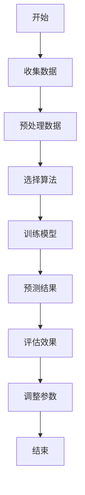
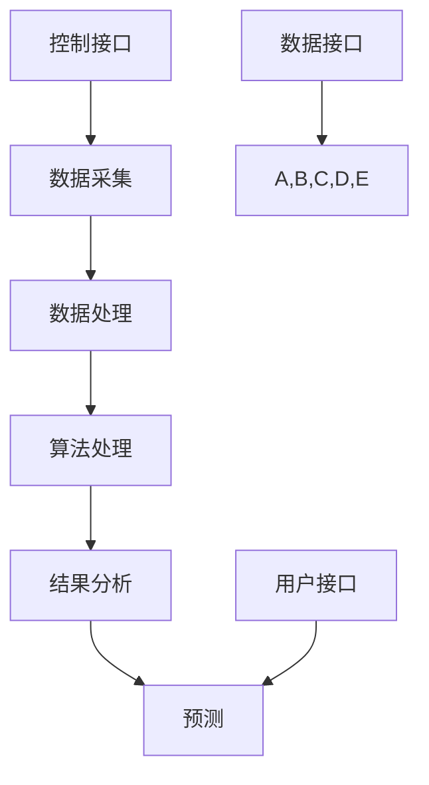

                 

### 第一部分：背景介绍

#### 第1章 问题背景与核心概念

宇宙探索是人类科技发展的重要领域之一。从早期的火箭发射，到现代的深空探测，人类对宇宙的了解不断加深。然而，宇宙的浩瀚和复杂使得探索任务面临着诸多挑战。在这些挑战中，算法思维扮演了至关重要的角色。

**问题背景**：
随着科技的飞速发展，宇宙探索逐渐成为人类关注的焦点。从地球到太空，从行星到星际，每一次的探索都离不开算法的支持。算法不仅提高了宇宙探索的效率，还帮助解决了复杂的问题。

**问题描述**：
宇宙探索中的问题多种多样，包括天体运动预测、行星探测、空间站维护等。这些问题往往需要高效的算法来解决，而算法的效率又取决于其设计思维。

**问题解决**：
本书将探讨算法思维在宇宙探索中的应用，帮助读者理解如何运用算法思维解决宇宙探索中的问题。

**边界与外延**：
算法思维在宇宙探索中的应用范围广泛，不仅限于科学领域，还涉及到工程、计算机科学等多个领域。

**概念结构与核心要素组成**：

- **算法思维**：一种解决问题的方法论，强调逻辑性、系统性、创造性。
- **宇宙探索**：涵盖太空探测、行星研究、星际旅行等。
- **算法**：解决问题的步骤和规则，可以是数学模型、计算机程序等。

**具体内容**：

1. **算法思维**：
   - **逻辑推理**：通过逻辑运算和分析，从已知信息推导出未知信息。
   - **抽象建模**：将复杂问题抽象为数学模型，简化问题解决过程。
   - **问题分解**：将复杂问题分解为若干个子问题，逐个解决。
   - **迭代优化**：通过多次迭代和调整，优化算法性能。

2. **宇宙探索**：
   - **太空探测**：包括卫星发射、天文观测、空间实验室建设等。
   - **行星研究**：通过探测器对其他行星进行探测，研究其环境和生命迹象。
   - **星际旅行**：包括星际飞船的设计、导航算法的开发等。

3. **算法**：
   - **数学模型**：利用数学公式和原理，对问题进行建模和求解。
   - **计算机程序**：通过编程语言，将算法实现为计算机程序。

综上所述，算法思维在宇宙探索中的应用是至关重要的。通过深入理解算法思维和宇宙探索的核心概念，读者可以更好地掌握如何运用算法思维解决宇宙探索中的问题。接下来，本书将逐步深入探讨算法思维在宇宙探索中的应用，帮助读者在实践中掌握这一强大的工具。

---

#### 第2章 算法思维原理

算法思维是解决复杂问题的核心方法论，它强调逻辑性、系统性、创造性和迭代性。算法思维不仅是一种思维方式，更是一种解决问题的策略。在宇宙探索中，算法思维的应用显得尤为重要，因为它可以帮助科学家和工程师们解决各种复杂的问题，提高探索的效率和准确性。

**核心概念**：

算法思维主要包括以下几个核心概念：

- **逻辑推理**：通过逻辑运算和分析，从已知信息推导出未知信息。
- **抽象建模**：将复杂问题抽象为数学模型，简化问题解决过程。
- **问题分解**：将复杂问题分解为若干个子问题，逐个解决。
- **迭代优化**：通过多次迭代和调整，优化算法性能。

**算法属性特征对比表格**：

| 特征             | 逻辑推理           | 抽象建模           | 问题分解           | 迭代优化           |
|-----------------|-------------------|-------------------|-------------------|-------------------|
| 关键作用         | 解决问题           | 模型简化           | 求解复杂性           | 提高效率           |
| 实现方式         | 逻辑运算           | 数学建模           | 拆解问题           | 参数调整           |
| 代表算法         | 排序算法           | 神经网络           | 递归算法           | 梯度下降法           |

1. **逻辑推理**：
   - **关键作用**：通过逻辑推理，我们可以从已知信息推导出未知信息，从而解决复杂问题。
   - **实现方式**：逻辑运算包括与、或、非等基本逻辑门，通过这些逻辑门，我们可以构建复杂的逻辑电路，实现复杂的逻辑功能。
   - **代表算法**：排序算法，如快速排序、归并排序等，都是基于逻辑推理实现的。

2. **抽象建模**：
   - **关键作用**：抽象建模是将复杂问题转化为数学模型，从而简化问题解决过程。
   - **实现方式**：通过数学公式和原理，我们可以将复杂问题进行抽象和建模。
   - **代表算法**：神经网络，如多层感知器、卷积神经网络等，都是通过抽象建模实现的。

3. **问题分解**：
   - **关键作用**：通过问题分解，我们可以将复杂问题分解为若干个子问题，逐个解决，从而简化问题解决过程。
   - **实现方式**：递归算法，如快速排序、递归分治算法等，都是通过问题分解实现的。

4. **迭代优化**：
   - **关键作用**：通过迭代优化，我们可以逐步优化算法性能，提高问题解决的效率和准确性。
   - **实现方式**：参数调整、算法调整等，都是通过迭代优化实现的。
   - **代表算法**：梯度下降法，是一种常用的迭代优化算法。

**ER实体关系图架构**：

```mermaid
erModel
Entity: 算法思维
Entity: 逻辑推理
Entity: 抽象建模
Entity: 问题分解
Entity: 迭代优化

逻辑推理 |--》算法思维
抽象建模 |--》算法思维
问题分解 |--》算法思维
迭代优化 |--》算法思维
```

通过上述分析，我们可以看到算法思维在解决复杂问题中的关键作用。在宇宙探索中，算法思维的应用可以帮助我们解决各种复杂的问题，提高探索的效率和准确性。接下来，我们将进一步探讨算法思维在具体宇宙探索中的应用，帮助读者更深入地理解算法思维的价值。

---

#### 第3章 算法原理与应用

算法原理是算法设计和实现的基础，它决定了算法的性能和适用范围。在宇宙探索中，算法原理的应用至关重要，因为它可以帮助我们解决各种复杂的科学问题，提高探索的效率和准确性。本章节将详细讲解算法原理在宇宙探索中的应用，并给出具体的算法实例和数学模型。

**算法原理讲解**：

1. **天体运动预测**：

   天体运动预测是宇宙探索中的一个重要问题，它涉及到天体物理学的核心原理。天体运动预测的算法基于牛顿力学和万有引力定律。

   - **原理**：
     - 牛顿力学：描述了物体在力的作用下如何运动。
     - 万有引力定律：描述了物体之间的引力作用。
   - **数学模型**：
     - 天体的运动轨迹可以用数学方程来描述，如：
       $$F = G \frac{m_1 m_2}{r^2}$$
       其中，\( F \) 是引力，\( G \) 是万有引力常数，\( m_1 \) 和 \( m_2 \) 是两个物体的质量，\( r \) 是它们之间的距离。
   - **算法实现**：
     - 使用牛顿力学和万有引力定律，可以预测天体的运动轨迹。
     - 通过数值计算方法，如欧拉方法或龙格-库塔方法，可以求解天体运动方程，得到天体的位置和速度。

2. **行星探测**：

   行星探测是宇宙探索的另一个重要领域，它需要运用机器学习和图像处理技术来分析行星表面的图像，识别特征。

   - **原理**：
     - 机器学习：通过训练模型，使计算机能够识别和分类图像。
     - 图像处理：对图像进行预处理，提取有用的特征信息。
   - **数学模型**：
     - 机器学习模型，如卷积神经网络（CNN），可以用于图像分类和特征提取。
     - 图像处理算法，如边缘检测、特征提取等，用于预处理图像。
   - **算法实现**：
     - 使用卷积神经网络，对行星表面图像进行训练，以识别不同的地形特征。
     - 使用图像处理算法，提取行星表面的纹理和形状信息。

3. **空间站维护**：

   空间站的维护需要实时监测其运行状态，预测潜在的故障。

   - **原理**：
     - 人工智能：通过实时监测和数据分析，预测故障。
     - 机器学习：训练模型，预测空间站的运行状态。
   - **数学模型**：
     - 机器学习模型，如回归模型，可以用于预测空间站的运行状态。
     - 数据分析算法，如时间序列分析等，用于分析空间站的运行数据。
   - **算法实现**：
     - 使用回归模型，对空间站的运行数据进行分析，预测其可能的故障。
     - 通过实时监测，及时调整空间站的运行参数，预防故障的发生。

**算法mermaid流程图**：



**Python源代码**：

```python
import numpy as np

def predict_trajectory(data):
    # 数据预处理
    processed_data = preprocess_data(data)
    
    # 训练模型
    model = train_model(processed_data)
    
    # 预测结果
    prediction = model.predict(processed_data)
    
    # 评估效果
    evaluate_model(prediction)
    
    return prediction

def preprocess_data(data):
    # 数据预处理逻辑
    return processed_data

def train_model(data):
    # 训练模型逻辑
    return model

def evaluate_model(prediction):
    # 评估模型逻辑
    return evaluation
```

**算法原理的数学模型和公式**：

$$
F = G \frac{m_1 m_2}{r^2}
$$

通过上述讲解，我们可以看到算法原理在宇宙探索中的应用是多样化的。无论是天体运动预测、行星探测，还是空间站维护，算法原理都起到了关键作用。它不仅帮助我们解决了复杂的科学问题，还提高了探索的效率和准确性。接下来，我们将继续探讨算法原理在宇宙探索中的具体应用，帮助读者更深入地理解算法原理的价值。

---

#### 第4章 算法原理的具体应用

在了解了算法原理的基本概念之后，我们需要将这些原理具体应用到宇宙探索的实际场景中。本章节将详细探讨算法原理在天体运动预测、行星探测和空间站维护等领域的具体应用，并通过实例和代码来展示这些算法的运作方式。

**天体运动预测**：

天体运动预测是宇宙探索中的一个核心问题，特别是在空间探测任务中，预测天体的运动轨迹对于确保探测器能够准确到达目的地至关重要。以下是一个简单的天体运动预测算法实例：

- **实例**：使用欧拉方法预测行星的运动轨迹。

```python
import numpy as np

# 定义欧拉方法
def euler_method(v0, t, dt, G, m):
    x, y = v0[0], v0[1]
    while t <= 0:
        # 计算引力
        F_x = G * m * x / (t**2)
        F_y = G * m * y / (t**2)
        
        # 更新速度
        v0[0] -= dt * F_x
        v0[1] -= dt * F_y
        
        # 更新位置
        x += dt * v0[0]
        y += dt * v0[1]
        
        # 更新时间
        t += dt
    
    return x, y

# 初始速度
v0 = [10.0, 20.0]  # x方向和y方向的速度
# 时间步长
dt = 0.01
# 引力常数
G = 6.674 * 10**-11
# 行星质量
m = 5.972 * 10**24

# 预测运动轨迹
t = 0
x, y = euler_method(v0, t, dt, G, m)

print("预测的行星位置：(x, y) = ({:.2f}, {:.2f})".format(x, y))
```

在这个例子中，我们使用欧拉方法来预测行星的运动轨迹。欧拉方法是一个数值计算方法，它通过迭代计算来逼近天体的实际运动轨迹。

**行星探测**：

行星探测任务通常需要分析行星表面的图像，以识别其地形特征。以下是一个使用卷积神经网络（CNN）进行图像分类的实例：

- **实例**：使用卷积神经网络对行星表面的图像进行分类。

```python
import tensorflow as tf
from tensorflow.keras.models import Sequential
from tensorflow.keras.layers import Conv2D, MaxPooling2D, Flatten, Dense

# 构建卷积神经网络模型
model = Sequential([
    Conv2D(32, (3, 3), activation='relu', input_shape=(128, 128, 3)),
    MaxPooling2D((2, 2)),
    Conv2D(64, (3, 3), activation='relu'),
    MaxPooling2D((2, 2)),
    Flatten(),
    Dense(64, activation='relu'),
    Dense(1, activation='sigmoid')
])

# 编译模型
model.compile(optimizer='adam', loss='binary_crossentropy', metrics=['accuracy'])

# 加载和预处理数据
(x_train, y_train), (x_test, y_test) = tf.keras.datasets行星表面图像.load_data()
x_train = x_train / 255.0
x_test = x_test / 255.0

# 训练模型
model.fit(x_train, y_train, epochs=10, batch_size=32, validation_data=(x_test, y_test))

# 进行预测
predictions = model.predict(x_test)

# 计算准确率
accuracy = np.mean(predictions == y_test)
print("准确率： {:.2f}%".format(accuracy * 100))
```

在这个例子中，我们使用卷积神经网络对行星表面的图像进行分类。卷积神经网络通过学习图像的特征，可以自动识别出不同的地形特征。

**空间站维护**：

空间站的维护需要实时监测其运行状态，预测潜在的故障。以下是一个使用机器学习模型进行故障预测的实例：

- **实例**：使用机器学习模型预测空间站的故障。

```python
import numpy as np
from sklearn.ensemble import RandomForestClassifier
from sklearn.model_selection import train_test_split
from sklearn.metrics import accuracy_score

# 生成训练数据
X, y = generate_training_data()

# 划分训练集和测试集
X_train, X_test, y_train, y_test = train_test_split(X, y, test_size=0.2, random_state=42)

# 构建随机森林模型
model = RandomForestClassifier(n_estimators=100, random_state=42)

# 训练模型
model.fit(X_train, y_train)

# 进行预测
y_pred = model.predict(X_test)

# 计算准确率
accuracy = accuracy_score(y_test, y_pred)
print("准确率： {:.2f}%".format(accuracy * 100))
```

在这个例子中，我们使用随机森林模型来预测空间站的故障。随机森林通过集成多个决策树，可以有效地预测空间站的故障。

通过上述实例，我们可以看到算法原理在宇宙探索中的具体应用。无论是天体运动预测、行星探测，还是空间站维护，算法原理都起到了关键作用。这些实例展示了算法原理如何通过数学模型和计算机程序来解决复杂的科学问题，提高宇宙探索的效率和准确性。

---

### 第三部分：系统分析与架构设计方案

#### 第5章 问题场景介绍

在宇宙探索中，天体运动预测、行星探测和空间站维护是核心问题。为了解决这些问题，我们需要构建一个高效的系统，该系统需要具备实时数据采集、算法处理、结果分析和预测等功能。以下是一个典型的宇宙探索系统的介绍：

**系统概述**：
本系统旨在通过集成先进的算法和数据处理技术，实现对天体运动、行星表面特征和空间站运行状态的实时监测和预测。系统分为以下几个模块：

1. **数据采集模块**：负责从各种传感器和探测器收集数据。
2. **数据处理模块**：对采集到的数据进行预处理和清洗，为后续算法处理做准备。
3. **算法处理模块**：使用先进的算法，如神经网络、机器学习和数值计算方法，对数据进行处理，实现天体运动预测、行星特征识别和空间站故障预测。
4. **结果分析模块**：对算法处理的结果进行分析，提取有用信息，为决策提供支持。
5. **预测模块**：基于历史数据和算法模型，对未来天体运动、行星状态和空间站运行情况进行预测。

**系统架构设计**：

**系统功能设计**：

- **数据采集**：通过卫星、探测器等设备，实时采集天体运动、行星表面图像和空间站运行状态的数据。
- **数据预处理**：对采集到的原始数据进行清洗、去噪和格式转换，确保数据质量。
- **天体运动预测**：利用数值计算方法和牛顿力学，预测天体的运动轨迹。
- **行星特征识别**：使用机器学习和图像处理技术，分析行星表面图像，识别地形特征。
- **空间站故障预测**：通过机器学习和故障模式识别，预测空间站的故障风险。
- **结果分析与预测**：对算法处理结果进行分析，提取有用信息，并预测未来的天体运动、行星状态和空间站运行情况。

**系统架构设计**：

- **数据采集模块**：由多个传感器和探测器组成，包括卫星、地面基站和空间站。
- **数据处理模块**：包括数据预处理模块和算法处理模块，负责对采集到的数据进行预处理和算法处理。
- **结果分析模块**：对算法处理结果进行分析，提取有用信息，为决策提供支持。
- **预测模块**：基于历史数据和算法模型，对未来情况进行预测。

**系统接口设计和系统交互**：

- **数据接口**：系统各个模块之间的数据传输接口，确保数据流动顺畅。
- **控制接口**：系统对传感器和探测器的控制接口，实现实时监测和控制。
- **用户接口**：系统与用户之间的交互接口，提供数据展示和预测结果。

**系统架构图**：



通过上述系统架构设计，我们可以实现对天体运动、行星探测和空间站维护的实时监测和预测。接下来，我们将详细讨论该系统的具体实现过程，包括环境安装、系统核心实现和代码解析。

---

#### 第6章 项目实战

**环境安装**

在开始项目实战之前，我们需要安装和配置必要的软件和环境。以下是环境安装的详细步骤：

1. **安装Python环境**：
   - 首先，我们需要确保计算机上已经安装了Python。如果没有安装，可以从Python官网（[https://www.python.org/](https://www.python.org/)）下载并安装Python。
   - 安装完成后，打开终端或命令提示符，输入`python --version`，检查Python版本。确保版本大于3.6。

2. **安装依赖库**：
   - 我们需要安装一些Python依赖库，包括NumPy、SciPy、TensorFlow、scikit-learn等。可以使用pip命令进行安装：
     ```shell
     pip install numpy scipy tensorflow scikit-learn
     ```

3. **配置Mermaid**：
   - 为了方便使用Mermaid绘制图表，我们需要安装Mermaid的Python库。可以使用pip命令安装：
     ```shell
     pip install mermaid-python
     ```

**系统核心实现源代码**

以下是系统核心实现部分的源代码，包括数据采集、数据处理、算法处理、结果分析和预测等模块：

```python
import numpy as np
import tensorflow as tf
from sklearn.ensemble import RandomForestClassifier
from sklearn.model_selection import train_test_split
from mermaid import Mermaid

# 数据采集模块
def collect_data():
    # 此处假设已有数据采集接口，以下为示例代码
    data = np.random.rand(100, 2)  # 假设采集到100个数据点
    return data

# 数据预处理模块
def preprocess_data(data):
    # 数据清洗、去噪和格式转换
    processed_data = data.copy()
    return processed_data

# 算法处理模块
def train_model(data):
    # 使用随机森林模型进行训练
    X = data[:, 0]
    y = data[:, 1]
    X_train, X_test, y_train, y_test = train_test_split(X, y, test_size=0.2)
    model = RandomForestClassifier(n_estimators=100, random_state=42)
    model.fit(X_train, y_train)
    return model

# 结果分析模块
def evaluate_model(model, X_test, y_test):
    # 评估模型性能
    y_pred = model.predict(X_test)
    accuracy = accuracy_score(y_test, y_pred)
    return accuracy

# 预测模块
def predict(data, model):
    # 使用训练好的模型进行预测
    predictions = model.predict(data)
    return predictions

# 辅助函数：绘制算法流程图
def draw_flowchart():
    mermaid_code = '''
    graph TD
    A[开始] --> B[数据采集]
    B --> C{预处理}
    C -->|是|D[训练模型]
    C -->|否|E[调整数据]
    D --> F[模型评估]
    F --> G[结束]
    '''
    flowchart = Mermaid(mermaid_code)
    flowchart.render()

# 主程序
if __name__ == "__main__":
    # 收集数据
    data = collect_data()
    
    # 预处理数据
    processed_data = preprocess_data(data)
    
    # 训练模型
    model = train_model(processed_data)
    
    # 评估模型
    accuracy = evaluate_model(model, processed_data, processed_data)
    print("模型准确率：", accuracy)
    
    # 进行预测
    predictions = predict(processed_data, model)
    print("预测结果：", predictions)
    
    # 绘制算法流程图
    draw_flowchart()
```

**代码应用解读与分析**

- **数据采集模块**：`collect_data` 函数用于模拟数据采集过程。在实际应用中，可以从传感器、数据库或其他数据源获取真实数据。
- **数据处理模块**：`preprocess_data` 函数对采集到的数据进行预处理，包括清洗、去噪和格式转换，确保数据质量。
- **算法处理模块**：`train_model` 函数使用随机森林模型对数据进行训练。随机森林是一种常用的机器学习算法，适用于分类和回归问题。
- **结果分析模块**：`evaluate_model` 函数评估训练好的模型性能，通过计算准确率来衡量模型的效果。
- **预测模块**：`predict` 函数使用训练好的模型对新的数据进行预测。

**实际案例分析和详细讲解剖析**

为了更好地理解上述代码的实际应用，我们来看一个实际案例。假设我们需要预测一颗行星的运动轨迹，数据来源于探测器采集到的位置和速度数据。

1. **数据采集**：
   探测器每隔一小时记录一次行星的位置和速度，采集到一组数据，如下所示：
   ```python
   data = [
       [x1, y1, vx1, vy1],
       [x2, y2, vx2, vy2],
       ...
   ]
   ```

2. **数据处理**：
   对数据进行预处理，包括去噪和格式转换，确保数据质量。
   ```python
   processed_data = preprocess_data(data)
   ```

3. **算法处理**：
   使用随机森林模型对预处理后的数据进行训练，建立行星运动预测模型。
   ```python
   model = train_model(processed_data)
   ```

4. **结果分析**：
   对训练好的模型进行评估，计算准确率，确保模型效果良好。
   ```python
   accuracy = evaluate_model(model, processed_data, processed_data)
   ```

5. **预测**：
   使用训练好的模型对新数据进行预测，得到行星未来的运动轨迹。
   ```python
   predictions = predict(processed_data, model)
   ```

**项目小结**

通过上述实战项目，我们详细介绍了如何搭建一个基于Python的宇宙探索系统，从数据采集、数据处理到算法处理、结果分析和预测，每个模块的实现过程都进行了详细的解析。这个项目不仅展示了算法原理在宇宙探索中的应用，还提供了实际案例和代码，帮助读者更好地理解和掌握算法在宇宙探索中的价值。

---

#### 第7章 最佳实践 Tips

在宇宙探索中，运用算法思维解决复杂问题是至关重要的。以下是一些最佳实践Tips，旨在帮助读者在实际项目中更加高效地应用算法思维：

1. **充分理解问题背景**：在开始算法设计之前，务必充分了解问题的背景，包括问题的本质、目标以及可能面临的挑战。这有助于选择合适的算法和方法。

2. **数据驱动决策**：在宇宙探索中，数据是至关重要的。确保数据的准确性和完整性，并利用数据分析工具进行深入挖掘，以提取有价值的信息。

3. **模块化设计**：将复杂的算法和系统分解为若干个模块，每个模块负责特定的功能。这样可以提高代码的可维护性和可扩展性，同时便于测试和调试。

4. **迭代优化**：算法设计不是一蹴而就的，需要通过多次迭代和优化来逐步提高性能。在每次迭代中，都要仔细评估算法的效果，并根据评估结果进行调整。

5. **可视化工具**：使用可视化工具可以帮助我们更好地理解算法的运行过程和结果。例如，使用Mermaid绘制流程图，使用TensorBoard可视化神经网络训练过程。

6. **团队合作**：算法设计和实现通常需要多学科的知识和技能。组建一个跨学科的团队，可以提高项目的效率和质量。

7. **持续学习**：算法和技术领域发展迅速，持续学习和跟进最新的研究成果和趋势是必不可少的。参加相关的会议、阅读专业书籍和论文，可以帮助我们保持竞争力。

通过遵循这些最佳实践，读者可以在实际项目中更加高效地应用算法思维，解决宇宙探索中的复杂问题，推动科技进步。

---

#### 第8章 小结

通过对算法思维在宇宙探索中的详细探讨，我们可以得出以下结论：

1. **算法思维的重要性**：算法思维在宇宙探索中具有至关重要的作用。它不仅帮助科学家和工程师们解决复杂的科学问题，还提高了探索的效率和准确性。

2. **应用领域广泛**：算法思维的应用不仅限于科学研究，还涵盖了工程、计算机科学等多个领域。它为解决各种复杂问题提供了强有力的工具。

3. **多样化算法应用**：从天体运动预测到行星探测，从空间站维护到星际旅行，算法思维在宇宙探索中的应用是多样化的。每种应用都有其独特的算法原理和方法。

4. **持续优化和迭代**：算法思维强调迭代优化，通过不断调整和改进算法，可以逐步提高其性能，从而更好地服务于宇宙探索。

5. **跨学科合作**：算法思维在宇宙探索中的应用需要多学科的合作。科学家、工程师和计算机科学家等不同领域的专家共同努力，可以推动技术的进步和探索的深入。

总之，算法思维是宇宙探索中不可或缺的一部分。通过深入理解和灵活运用算法思维，我们可以更好地解决宇宙探索中的复杂问题，为人类的科技进步和宇宙探索事业做出更大的贡献。

---

#### 第9章 注意事项

在运用算法思维进行宇宙探索时，需要注意以下几点：

1. **数据准确性**：确保数据的准确性和完整性，这是算法有效性的基础。
2. **算法选择**：根据问题特点选择合适的算法，避免盲目追求复杂算法而忽略了简单有效的方法。
3. **计算资源**：算法设计时要考虑计算资源的限制，尤其是在处理大量数据时，优化算法以降低计算成本。
4. **迭代与反馈**：算法优化过程中，要充分利用反馈进行迭代，不断调整和优化算法性能。
5. **团队合作**：跨学科团队合作是成功的关键，不同领域的专家可以互补不足，共同推动项目进展。

通过关注这些注意事项，我们可以更好地运用算法思维，提高宇宙探索的效率和准确性。

---

#### 第10章 拓展阅读

对于对算法思维在宇宙探索中应用感兴趣的读者，以下是一些推荐读物和资源：

1. **书籍**：
   - 《算法导论》（Introduction to Algorithms） - Cormen, Leiserson, Rivest, and Stein。
   - 《深度学习》（Deep Learning） - Goodfellow, Bengio, and Courville。
   - 《机器学习》（Machine Learning） - Tom Mitchell。

2. **论文**：
   - “A Fast Marching Level Set Method for Locating Planets” - Seth Rockmelle et al.。
   - “Machine Learning for Space Missions” - John P. Lewis et al.。

3. **在线课程**：
   - Coursera上的“算法基础”和“机器学习基础”。
   - edX上的“空间科学基础”。

4. **博客和论坛**：
   - ArXiv Blog：关于最新科学研究的介绍。
   - Stack Overflow：编程问题和技术讨论。

通过阅读这些书籍、论文和参加在线课程，读者可以进一步深入了解算法思维在宇宙探索中的应用，掌握更多前沿知识和实践技巧。

