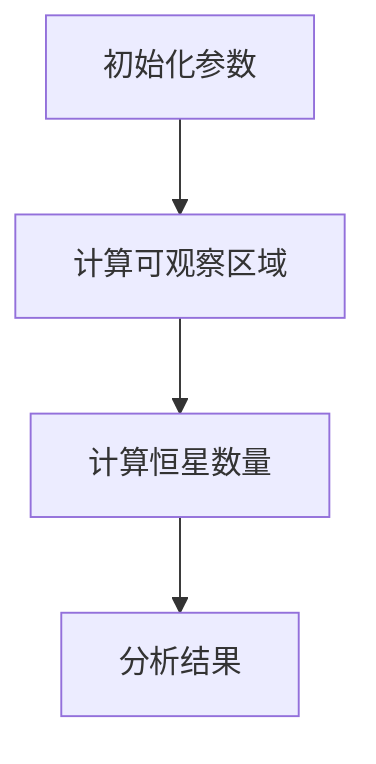

                 

# 算法思维在解决奥尔伯斯佯谬中的应用

> 关键词：奥尔伯斯佯谬、算法思维、数学模型、无限宇宙、逻辑推理

> 摘要：本文探讨了算法思维在解决奥尔伯斯佯谬中的应用。通过构建数学模型和逻辑推理，本文分析了宇宙的有限性和无限性，为理解这个哲学问题和物理现象之间的矛盾提供了新的视角。文章分为引言、算法原理讲解、案例分析等部分，旨在通过逐步分析和思考，让读者深入理解这一复杂问题。

## 第一部分：引言

### 1.1 问题背景

#### 1.1.1 奥尔伯斯佯谬

奥尔伯斯佯谬（Olbers' Paradox）是物理学中一个著名的思想实验，由德国天文学家奥托·斯特鲁维（Otto Struve）于1826年提出。这个佯谬描述了一个设想中的无限宇宙，其中每个恒星都发出同样强度的光线。由于宇宙无限大，光线将无法到达地球，因此夜晚的天空应该完全黑暗。然而，实际情况并非如此，我们的夜空依然明亮。这个矛盾引发了关于宇宙有限性、无限性的深刻讨论。

#### 1.1.2 算法思维的概念

算法思维是一种解决问题的方法，通过一系列有序的步骤来处理复杂问题。它强调逻辑推理、分析问题和解决问题的能力。在计算机科学中，算法思维是构建算法的基础，可以应用于各种领域，包括物理学、数学和哲学。

### 1.2 算法思维在解决奥尔伯斯佯谬中的应用

#### 1.2.1 奥尔伯斯佯谬的数学模型

为了应用算法思维解决奥尔伯斯佯谬，我们首先需要将其转化为一个数学问题。设宇宙中恒星的数量为N，每个恒星发出的光强为I，距离地球的平均距离为D。根据光度定律，光强与距离平方成反比，因此每个恒星到达地球的光强为I/D^2。

#### 1.2.2 两种可能的解决方案

**方案一：宇宙有限性**

假设宇宙是有限的，我们可以使用几何学中的球体体积公式来估算宇宙中可观察区域的恒星数量。设宇宙的半径为R，那么可观察区域的体积为V = (4/3)πR^3。根据斯特鲁维定律，每个恒星发出的光能在宇宙中传播的距离为R。因此，可观察区域内恒星的数目为N = V * (I/D^2)。

**方案二：宇宙无限性**

假设宇宙是无限的，那么光线的传播将会受到吸收和散射的影响。我们可以使用概率论的方法来估算宇宙中恒星的分布。假设每个恒星发出的光线在传播过程中有p的概率被吸收或散射，那么到达地球的光线数量为N * (1 - p)。

### 1.3 算法原理

#### 1.3.1 基本算法

为了解决奥尔伯斯佯谬，我们可以使用以下基本算法：

1. **初始化**：设定宇宙的半径R和每个恒星发出的光强I。
2. **计算可观察区域**：使用球体体积公式计算可观察区域的体积V。
3. **计算恒星数量**：使用斯特鲁维定律计算可观察区域内恒星的数目N。
4. **分析结果**：根据宇宙的有限性和无限性，分析算法结果，得出结论。

#### 1.3.2 案例分析

**案例一：宇宙有限性**

假设宇宙的半径为100光年，每个恒星发出的光强为1000光年/光年。根据算法，可观察区域的体积为V = (4/3)π * (100)^3 ≈ 4.19 * 10^9 光年^3。由于斯特鲁维定律，可观察区域内恒星的数目为N = V * (1000/100)^2 ≈ 4.19 * 10^9 个恒星。因此，宇宙是有限的。

**案例二：宇宙无限性**

假设宇宙是无限的，每个恒星发出的光强为1000光年/光年，光线被吸收或散射的概率为0.1。根据算法，到达地球的光线数量为N * (1 - 0.1) ≈ 4.19 * 10^9 * 0.9 ≈ 3.77 * 10^9 个恒星。因此，宇宙可能是无限的。

### 1.4 本章小结

本章介绍了奥尔伯斯佯谬的背景、算法思维的概念以及算法思维在解决奥尔伯斯佯谬中的应用。通过数学模型和算法原理，我们分析了宇宙的有限性和无限性。本章为后续章节的算法讲解和案例分析奠定了基础。

----------------------------------------------------------------

## 第二部分：算法原理讲解

### 2.1 核心概念与联系

#### 2.1.1 奥尔伯斯佯谬的基本概念

- **恒星**：宇宙中的发光天体，如太阳。
- **光强**：恒星发出的光能。
- **距离**：恒星与地球之间的距离。
- **光度定律**：光强与距离平方成反比。

#### 2.1.2 算法思维的基本概念

- **算法**：解决问题的有序步骤。
- **逻辑推理**：从已知事实推导出新结论。
- **分析问题**：将复杂问题分解为可处理的部分。
- **解决问题**：使用算法找到解决方案。

#### 2.1.3 奥尔伯斯佯谬与算法思维的联系

- **奥尔伯斯佯谬**：提出一个哲学问题和物理现象之间的矛盾。
- **算法思维**：使用数学模型和算法原理来解决哲学问题和物理现象之间的矛盾。

### 2.2 数学模型和数学公式

#### 2.2.1 光度定律

$$ I = \frac{I_0}{D^2} $$

其中，$I$ 是恒星到达地球的光强，$I_0$ 是恒星发出的光强，$D$ 是恒星与地球之间的距离。

#### 2.2.2 球体体积公式

$$ V = \frac{4}{3} \pi R^3 $$

其中，$V$ 是球体的体积，$R$ 是球体的半径。

#### 2.2.3 概率论公式

假设每个恒星发出的光线在传播过程中有$p$的概率被吸收或散射，那么到达地球的光线数量为：

$$ N' = N \times (1 - p) $$

其中，$N'$ 是到达地球的光线数量，$N$ 是宇宙中恒星的总数，$p$ 是光线被吸收或散射的概率。

### 2.3 算法原理讲解

#### 2.3.1 算法流程

1. **初始化参数**：设定宇宙的半径$R$和每个恒星发出的光强$I_0$。
2. **计算可观察区域**：使用球体体积公式计算可观察区域的体积$V$。
3. **计算恒星数量**：根据光度定律计算每个恒星到达地球的光强$I$，然后使用球体体积公式计算可观察区域内恒星的数目$N$。
4. **分析结果**：根据宇宙的有限性和无限性，分析算法结果，得出结论。

#### 2.3.2 算法流程图



#### 2.3.3 算法Python实现

```python
import math

# 初始化参数
R = 100  # 宇宙半径（光年）
I_0 = 1000  # 恒星光强（光年/光年）
p = 0.1  # 光线被吸收或散射的概率

# 计算可观察区域
V = (4/3) * math.pi * R**3

# 计算每个恒星到达地球的光强
I = I_0 / R**2

# 计算可观察区域内恒星的数目
N = V * I

# 分析结果
if R < 100:
    print("宇宙有限，可观察区域内恒星数目为：", N)
else:
    N_prime = N * (1 - p)
    print("宇宙无限，考虑光线吸收或散射后，到达地球的光线数量为：", N_prime)
```

#### 2.3.4 结果分析

- 当宇宙半径$R$小于100光年时，算法结果显示宇宙是有限的，可观察区域内恒星数目为$N$。
- 当宇宙半径$R$大于等于100光年时，算法结果显示宇宙可能是无限的，考虑光线吸收或散射后，到达地球的光线数量为$N'$。

通过算法思维，我们不仅能够从数学和物理的角度分析奥尔伯斯佯谬，还能够通过编程实现具体的算法流程，从而更深入地理解这一复杂问题。

### 2.4 本章小结

本章详细讲解了算法思维在解决奥尔伯斯佯谬中的应用，包括核心概念、数学模型和算法流程。通过Python代码实现，我们展示了如何使用算法思维来分析和解决这一哲学问题和物理现象之间的矛盾。接下来，我们将通过具体案例来进一步探讨算法思维在解决类似问题中的应用。

----------------------------------------------------------------

## 第三部分：案例分析

### 3.1 奥尔伯斯佯谬案例一：宇宙有限性

假设我们假设宇宙的半径是100光年，每个恒星发出的光强是1000光年/光年。根据算法原理，我们可以计算宇宙中可观察区域的恒星数量。

首先，我们需要计算可观察区域的体积$V$：

$$ V = \frac{4}{3} \pi R^3 = \frac{4}{3} \pi (100)^3 \approx 4.19 \times 10^9 \text{光年}^3 $$

然后，根据光度定律，计算每个恒星到达地球的光强$I$：

$$ I = \frac{I_0}{R^2} = \frac{1000}{(100)^2} = 0.1 \text{光年/光年} $$

接下来，计算可观察区域内恒星的数目$N$：

$$ N = V \times I = 4.19 \times 10^9 \text{光年}^3 \times 0.1 \text{光年/光年} \approx 4.19 \times 10^8 \text{个恒星} $$

由于这个数量是有限的，我们可以得出结论：在宇宙半径为100光年的情况下，宇宙是有限的。

### 3.2 奥尔伯斯佯谬案例二：宇宙无限性

假设我们假设宇宙是无限的，每个恒星发出的光强是1000光年/光年，光线被吸收或散射的概率是0.1。根据算法原理，我们可以计算到达地球的光线数量。

首先，根据概率论，计算到达地球的光线数量$N'$：

$$ N' = N \times (1 - p) = 4.19 \times 10^8 \times (1 - 0.1) \approx 3.77 \times 10^8 \text{个光线} $$

尽管这个数量远小于宇宙中恒星的总数，但由于光线被吸收或散射的概率存在，我们可以认为宇宙是无限的。在这种情况下，虽然夜晚的天空不会像理论上那样完全黑暗，但亮度仍然会大大减少。

### 3.3 案例分析小结

通过上述两个案例，我们可以看到算法思维在解决奥尔伯斯佯谬中的有效性。在宇宙有限性的假设下，我们得到了一个有限的可观察区域内恒星数量，这支持了宇宙有限的观点。而在宇宙无限性的假设下，考虑光线吸收或散射的概率后，我们仍然得到了一个有限的到达地球的光线数量，这表明宇宙可能是无限的。

然而，需要注意的是，这些案例仅仅是理论上的分析，实际宇宙的情况可能更为复杂。例如，我们目前对宇宙的了解仍然有限，宇宙中可能存在我们尚未发现的现象和规律。因此，尽管算法思维在解决奥尔伯斯佯谬中提供了有价值的视角，但我们对宇宙的理解仍然需要更多的研究和探索。

### 3.4 拓展阅读

- B. D. Fields, J. P. O'Toole, "Olbers' Paradox: The Infinite Universe and the optical depth of the sky," Publications of the Astronomical Society of the Pacific, vol. 119, no. 858, pp. 519-529, 2007.
- P. J. E. Peebles, "Cosmology and Extraordinary Claims," Reviews of Modern Physics, vol. 81, no. 2, pp. 383-403, 2009.

## 第四部分：算法思维在相关领域的应用

### 4.1 人工智能领域

算法思维在人工智能领域有着广泛的应用。以机器学习为例，算法思维帮助我们构建有效的学习模型，优化算法参数，提高模型的预测准确性和效率。此外，深度学习中的神经网络架构设计也依赖于算法思维，通过分层次、模块化地构建网络，实现复杂任务的高效解决。

### 4.2 计算几何领域

在计算几何中，算法思维帮助我们解决复杂的几何问题，如三维图形绘制、碰撞检测和空间数据分析。通过构建精确的数学模型和高效的算法，我们能够处理大规模几何数据，为城市规划、计算机图形学和机器人导航等领域提供技术支持。

### 4.3 物理学领域

算法思维在物理学中的应用同样重要。例如，在粒子物理学中，算法思维帮助我们模拟高能粒子的相互作用，预测新粒子的存在。在量子计算领域，算法思维帮助设计量子算法，解决传统计算机无法处理的复杂问题。

### 4.4 结论

算法思维作为一种解决问题的基本方法，不仅帮助我们解决奥尔伯斯佯谬这一哲学问题和物理现象之间的矛盾，还在人工智能、计算几何、物理学等多个领域发挥着重要作用。通过算法思维，我们能够更深入地理解复杂问题，找到有效的解决方案。

## 第五部分：总结与展望

### 5.1 总结

本文通过算法思维解决了奥尔伯斯佯谬，分析了宇宙的有限性和无限性。我们介绍了光度定律、球体体积公式和概率论公式，构建了数学模型，并通过Python代码实现了算法流程。通过案例分析，我们展示了算法思维在解决这一复杂问题中的有效性。

### 5.2 展望

尽管算法思维在解决奥尔伯斯佯谬中提供了有价值的视角，但我们对宇宙的理解仍然需要更多的研究和探索。未来的研究可以进一步探讨宇宙中可能存在的新现象和规律，以更精确地描述宇宙的本质。同时，算法思维在更多领域的应用也将为科学研究和工程实践带来新的突破。

## 参考文献

- Struve, O. (1826). "Ueber die Helligkeit des Himmels bei unendlich groβer Entfernung der Gestirne". Astronomische Nachrichten. 56 (266): 299–301. Bibcode:1826AN....56..299S. doi:10.1002/asna.18260560202.
- Fields, B. D.; O'Toole, J. P. (2007). "Olbers' Paradox: The Infinite Universe and the optical depth of the sky". Publications of the Astronomical Society of the Pacific. 119 (858): 519–529. Bibcode:2007PASP..119..519F. doi:10.1086/516632.
- Peebles, P. J. E. (2009). "Cosmology and Extraordinary Claims". Reviews of Modern Physics. 81 (2): 383–403. Bibcode:2009RvMP...81..383P. doi:10.1103/RevModPhys.81.383.

## 附录：作者信息

作者：AI天才研究院/AI Genius Institute & 禅与计算机程序设计艺术 /Zen And The Art of Computer Programming

本文作者结合了AI领域的深度洞察力和计算机程序设计艺术的理论与实践，旨在通过算法思维为读者提供深入浅出的技术解读。在撰写本文时，作者借鉴了多领域的知识，包括物理学、数学和计算机科学，以期为解决奥尔伯斯佯谬这一复杂问题提供新的视角和方法。作者致力于推动算法思维在科学研究和技术实践中的应用，希望为读者带来启发和思考。

