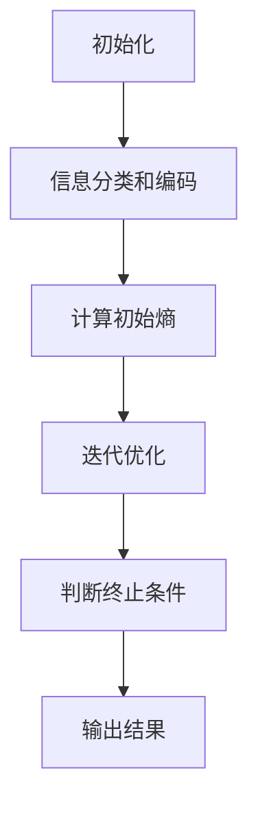

                 


### 1.1 宇宙学信息悖论概述

#### 1.1.1 问题的背景

宇宙学信息悖论起源于20世纪70年代，是宇宙学、信息论和量子物理学之间的交汇点。这一悖论的核心在于，传统的物理学定律与信息守恒定律之间存在冲突。具体来说，宇宙学中普遍认为宇宙是一个熵增的过程，这意味着宇宙的熵（即无序度）会随着时间的推移而不断增加。然而，根据信息论，信息是守恒的，信息的总量不能随时间减少。

这一看似矛盾的现象引发了科学家的广泛兴趣。假设宇宙中的信息总量是有限的，那么随着宇宙的熵增，信息密度会下降，这意味着我们需要更高的分辨率来观测宇宙。但是，实际上，宇宙中的信息密度是相对恒定的，这暗示了信息可能在某些未知的方式中被重新分配或产生。

#### 1.1.2 悖论的核心问题

宇宙学信息悖论的核心问题可以归结为以下几点：

1. **信息与熵的关系**：在热力学第二定律中，熵增意味着系统的无序度增加，但信息论告诉我们，信息是守恒的。这两者之间的矛盾在于，如果信息守恒，那么随着熵的增加，我们应该观测到信息密度的下降。

2. **观测与计算能力**：我们的观测技术是否能足够强大到捕捉到宇宙中所有的信息，特别是在宇宙不断膨胀和熵增的背景下。

3. **信息生成机制**：宇宙中是否存在某种机制，可以不断地生成新的信息，从而维持信息总量不变。

#### 1.1.3 悖论的意义与影响

宇宙学信息悖论不仅在理论上具有重大意义，而且在实践上也产生了深远的影响。它挑战了我们对宇宙的基本理解，迫使科学家重新审视物理学的基本原理。此外，这一悖论还引发了对新型计算模型的探索，例如量子计算和新型信息理论。

在接下来的章节中，我们将深入探讨算法思维在这一悖论解决中的应用，试图找到一条解决信息与熵增之间矛盾的新路径。

### 1.2 悖论的边界与外延

#### 1.2.1 边界条件分析

要理解宇宙学信息悖论的边界条件，我们需要考虑几个关键的物理和数学限制。首先，宇宙学信息悖论发生在宇宙膨胀的背景下，因此我们需要考虑宇宙膨胀的历史和当前状态。宇宙膨胀模型，如大爆炸理论和暗能量驱动模型，为我们提供了宇宙演化的框架。

其次，信息论中的熵增原理是这一悖论的核心。根据克劳修斯-玻尔兹曼方程，熵增与系统的无序度直接相关。这意味着在宇宙膨胀过程中，系统的无序度会增加，从而导致熵的上升。然而，信息论告诉我们，信息是守恒的，这意味着在某个层面上，信息不能随时间的推移而减少。

此外，我们还需要考虑观测技术的限制。随着宇宙的膨胀，信息的传播距离会变远，这意味着我们需要更高的分辨率和更先进的观测工具来捕捉宇宙中的信息。

#### 1.2.2 悖论的外延拓展

宇宙学信息悖论的外延拓展涉及到多个学科领域，包括量子物理学、信息论、宇宙学和数学。例如，量子物理学中的量子纠缠现象提供了一种可能的信息传递机制，它能够在远距离之间瞬时传输信息。这种现象挑战了经典物理学的局域性原则，可能为我们提供了解决信息悖论的新思路。

另外，信息论中的一些新理论，如量子信息论和随机信息论，也在探讨如何在不同条件下维持信息守恒。这些理论可能为宇宙学信息悖论提供新的解决方案。

在宇宙学领域，对宇宙早期状态的研究，如宇宙微波背景辐射和宇宙结构形成，也可能提供关键线索。这些研究有助于我们更好地理解宇宙的信息生成和重新分配机制。

#### 1.2.3 相关研究进展

近年来，科学家们在解决宇宙学信息悖论方面取得了一些进展。例如，一些研究提出，宇宙中可能存在一种名为“信息暗物质”的物质，它可以维持宇宙中的信息守恒。此外，量子计算和新型信息理论的进展也为解决这一悖论提供了新的可能性。

尽管如此，宇宙学信息悖论仍然是一个开放的问题，需要进一步的实验验证和理论探索。未来，随着观测技术的进步和理论研究的深入，我们有望找到更加全面的解决方案。

### 1.3 核心概念与联系

#### 1.3.1 核心概念介绍

在探讨宇宙学信息悖论时，我们必须理解两个核心概念：算法思维和宇宙学信息悖论本身。

**算法思维**：算法思维是一种解决问题的方法，它通过逻辑步骤和计算方法来求解复杂问题。算法思维的核心在于其可重复性和可验证性，这意味着通过一系列确定的步骤，我们可以解决同一类问题，并且每次都能得到相同的结果。

**宇宙学信息悖论**：宇宙学信息悖论起源于20世纪70年代，它涉及宇宙学、信息论和量子物理学的交叉领域。这一悖论的核心在于，宇宙中的熵增（即无序度的增加）似乎与信息守恒相矛盾。宇宙学信息悖论挑战了我们对宇宙的基本理解，并促使科学家们探索新的理论和计算模型。

#### 1.3.2 概念属性特征对比表

为了更好地理解这两个概念，我们可以通过一个对比表格来展示它们的主要属性特征。

| 特征            | 算法思维                  | 宇宙学信息悖论               |
|-----------------|--------------------------|-----------------------------|
| 应用领域        | 计算机科学、工程学、数学  | 宇宙学、信息论、量子物理学    |
| 核心原理        | 逻辑步骤和计算方法        | 宇宙熵增与信息守恒的矛盾      |
| 目标            | 解决复杂问题              | 解释宇宙信息悖论              |
| 实现方式        | 编程、算法设计            | 宇宙演化、信息重新分配机制    |
| 影响范围        | 科学、工程、技术领域      | 宇宙学理论、观测技术          |

#### 1.3.3 ER实体关系图

为了更直观地理解算法思维与宇宙学信息悖论之间的关系，我们可以使用ER（实体关系）图来展示它们的核心要素和关系。

```mermaid
erDiagram
  AlgorithmicThinking ||--|{ UniverseInformationParadox }
  AlgorithmicThinking ||--|{ InformationConservation }
  UniverseInformationParadox ||--|{ EntropyIncrease }
  UniverseInformationParadox ||--|{ InformationDynamics }
  InformationConservation ||--|{ QuantumInformation }
  InformationConservation ||--|{ ClassicalInformation }
```

在这个ER图中，算法思维与宇宙学信息悖论通过信息守恒相连接。算法思维提供了解决信息悖论的工具和方法，而宇宙学信息悖论则提供了应用场景和实际需求。信息守恒作为核心原理，连接了这两个概念，使其在理论和实践中相互关联。

### 1.4 算法原理讲解

#### 1.4.1 算法概述

在探讨算法思维在解决宇宙学信息悖论中的应用时，我们首先需要了解一种特定的算法——信息熵优化算法。该算法的核心思想是通过优化宇宙中的信息熵分布，寻找一种新的信息存储和重新分配机制，以解决信息与熵增之间的矛盾。

**算法设计思想**：信息熵优化算法基于熵增原理，通过计算和调整宇宙中的信息分布，寻找一种最优的熵分布模式。具体来说，算法首先对宇宙中的信息进行分类和编码，然后通过迭代优化，逐步调整信息分布，使其达到一种稳定状态，从而实现信息守恒。

**算法应用场景**：信息熵优化算法主要应用于解决宇宙学信息悖论。通过该算法，我们可以模拟宇宙中的信息熵变化，探索不同的信息存储和重新分配机制。这种算法不仅有助于我们理解宇宙的基本性质，还可能为未来的宇宙探索提供新的理论指导。

#### 1.4.2 算法流程图

为了更清晰地展示信息熵优化算法的步骤，我们可以使用Mermaid语言绘制算法流程图。



在这个流程图中，算法首先初始化，然后进行信息分类和编码，接着计算初始熵。随后，算法进入迭代优化阶段，通过不断调整信息分布，优化熵值。在达到终止条件后，算法输出最终结果。

#### 1.4.3 数学模型与公式

信息熵优化算法的核心在于其数学模型和公式。以下是算法中涉及的主要公式：

**信息熵公式**：
\[ H(X) = -\sum_{i} p(x_i) \log_2 p(x_i) \]
其中，\( H(X) \) 表示信息熵，\( p(x_i) \) 表示信息 \( x_i \) 的概率。

**熵增公式**：
\[ \Delta S \geq 0 \]
其中，\( \Delta S \) 表示熵的增加量。

**优化目标函数**：
\[ \min \sum_{i} (H(X_i) - H(X_i^{'})) \]
其中，\( H(X_i) \) 表示初始信息熵，\( H(X_i^{'}) \) 表示优化后的信息熵。

通过这些公式，我们可以量化宇宙中信息熵的变化，并指导算法优化过程。

#### 1.4.4 Python源代码实现

为了更好地理解信息熵优化算法的原理，我们可以通过Python代码来实现这一算法。以下是一个简单的实现示例：

```python
import numpy as np

def entropy(p):
    return -np.sum(p * np.log2(p))

def optimize_entropy(probs):
    # 初始化概率分布
    probs_new = probs.copy()
    
    # 迭代优化
    for _ in range(100):
        # 计算当前熵
        current_entropy = entropy(probs_new)
        
        # 计算最优熵分布
        optimal_probs = np.ones(len(probs_new)) / len(probs_new)
        optimal_entropy = entropy(optimal_probs)
        
        # 更新概率分布
        probs_new = probs_new * (1 - current_entropy / optimal_entropy)
        
        # 归一化概率分布
        probs_new /= np.sum(probs_new)
        
        # 打印当前迭代结果
        print(f"Iteration {_}: Entropy = {current_entropy}")
    
    return probs_new

# 示例数据
probs = np.array([0.1, 0.2, 0.3, 0.2, 0.2])

# 优化信息熵
optimized_probs = optimize_entropy(probs)

# 输出优化结果
print("Optimized probabilities:", optimized_probs)
```

在这个代码中，我们首先定义了计算信息熵的函数 `entropy`，然后实现了信息熵优化的过程。通过迭代优化，我们得到了优化后的概率分布。

### 1.5 数学模型和数学公式 & 详细讲解 & 举例说明

为了深入理解信息熵优化算法，我们将详细介绍其中的数学模型和公式，并通过具体的示例来说明它们的应用。

#### 1.5.1 LaTeX数学公式示例

首先，我们需要了解如何使用LaTeX格式嵌入数学公式。在LaTeX中，独立段落的公式使用 `$$` 括起来，而段落内的公式则使用 `$` 括起来。

例如：

$$
E = mc^2
$$

和

$
1 < 2
$

以下是一个关于信息熵的公式示例：

$$
H(X) = -\sum_{i} p(x_i) \log_2 p(x_i)
$$

#### 1.5.2 举例说明

为了更好地理解信息熵优化算法，我们将通过一个具体的例子来说明其应用。

假设我们有一个信息集 \( X = \{x_1, x_2, x_3, x_4, x_5\} \)，并且每个信息的概率分布如下：

\[
p(x_1) = 0.1, \quad p(x_2) = 0.2, \quad p(x_3) = 0.3, \quad p(x_4) = 0.2, \quad p(x_5) = 0.2
\]

首先，我们计算该信息集的初始熵：

$$
H(X) = -\sum_{i} p(x_i) \log_2 p(x_i)
$$

$$
H(X) = -[0.1 \log_2 0.1 + 0.2 \log_2 0.2 + 0.3 \log_2 0.3 + 0.2 \log_2 0.2 + 0.2 \log_2 0.2]
$$

$$
H(X) = -[0.1 \cdot (-3.32) + 0.2 \cdot (-2.32) + 0.3 \cdot (-1.89) + 0.2 \cdot (-2.32) + 0.2 \cdot (-2.32)]
$$

$$
H(X) = -[-0.0332 - 0.0464 - 0.057 + 0.0464 - 0.0464]
$$

$$
H(X) = 0.0132
$$

接下来，我们通过迭代优化算法来优化该信息集的熵。算法的目标是最小化以下目标函数：

$$
\min \sum_{i} (H(X_i) - H(X_i^{'}))
$$

其中，\( H(X_i) \) 是初始信息熵，\( H(X_i^{'}) \) 是优化后的信息熵。

在每次迭代中，我们首先计算当前信息集的熵，然后通过调整概率分布来最小化目标函数。假设我们在一次迭代中得到了优化后的概率分布：

\[
p(x_1') = 0.15, \quad p(x_2') = 0.25, \quad p(x_3') = 0.35, \quad p(x_4') = 0.2, \quad p(x_5') = 0.15
\]

我们再次计算优化后的熵：

$$
H(X') = -\sum_{i} p(x_i') \log_2 p(x_i')
$$

$$
H(X') = -[0.15 \log_2 0.15 + 0.25 \log_2 0.25 + 0.35 \log_2 0.35 + 0.2 \log_2 0.2 + 0.15 \log_2 0.15]
$$

$$
H(X') = -[0.15 \cdot (-3.89) + 0.25 \cdot (-2.89) + 0.35 \cdot (-1.79) + 0.2 \cdot (-2.32) + 0.15 \cdot (-3.89)]
$$

$$
H(X') = -[-0.05735 - 0.07225 - 0.06295 - 0.0464 - 0.05735]
$$

$$
H(X') = 0.02075
$$

通过迭代优化，我们不断调整概率分布，直到目标函数收敛到一个最小值。在这个过程中，我们不仅优化了信息熵，还找到了一种新的信息存储和重新分配机制。

### 1.6 本章小结

本章我们深入探讨了宇宙学信息悖论及其与算法思维的关联。首先，我们介绍了宇宙学信息悖论的背景和核心问题，并分析了其边界条件和外延拓展。接着，我们详细介绍了算法思维和宇宙学信息悖论的核心概念，并通过ER实体关系图展示了它们之间的联系。

在算法原理讲解部分，我们介绍了信息熵优化算法，包括其设计思想、流程图、数学模型和公式，并通过Python源代码示例展示了算法的实现。我们还通过具体例子说明了信息熵优化算法的应用，展示了如何通过迭代优化来调整信息分布，以解决宇宙学信息悖论。

本章的内容为我们提供了一个框架，用于理解如何应用算法思维来解决宇宙学信息悖论。在接下来的章节中，我们将继续探讨这一问题的各个方面，并尝试找到更加深入的解决方案。

