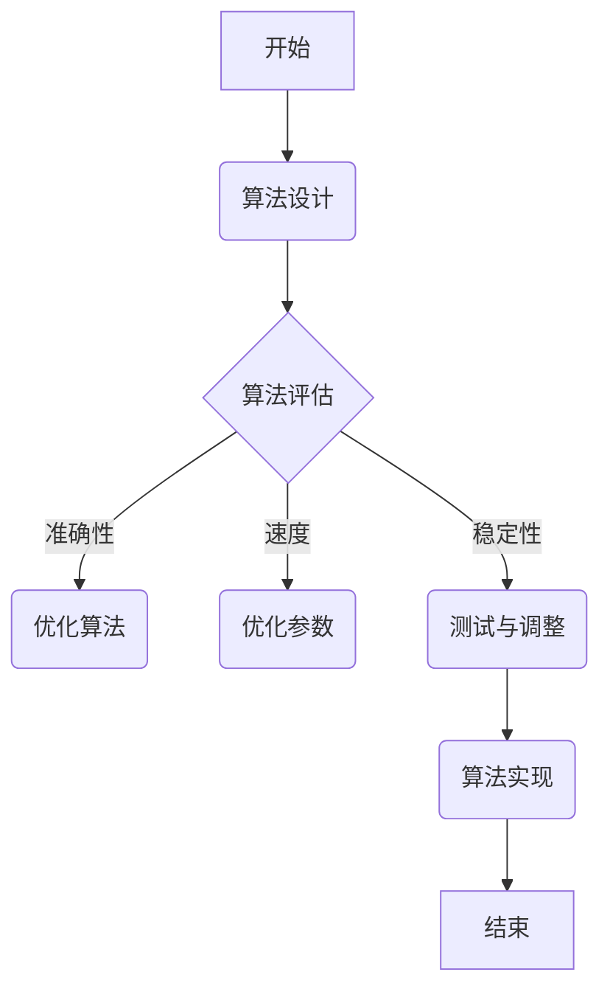

                 


# 算法思维在解决宇宙学奇点问题中的应用

## 关键词

算法思维、宇宙学奇点问题、数值模拟、并行计算、算法优化

## 摘要

本文旨在探讨算法思维在解决宇宙学奇点问题中的应用。通过深入分析算法思维的基本原理，并结合宇宙学奇点问题的具体背景，我们将展示算法在这一领域中的独特价值。文章将逐步阐述算法原理、数学模型、实际案例，并探讨未来算法在宇宙学研究中的发展方向。

## 目录

1. 引言
2. 算法思维概述
3. 宇宙学奇点问题介绍
4. 算法在奇点问题中的应用
5. 算法优化与评估
6. 实际案例分析
7. 算法在宇宙学中的未来趋势
8. 总结与展望

----------------------------------------------------------------

## 1. 引言

宇宙学奇点问题是当代物理学中一个极为重要的研究领域，它关乎我们对宇宙起源和演化的理解。然而，奇点问题的本质使得传统的理论物理方法难以奏效，因此，寻找新的解决思路成为了迫切的需求。

在这个背景下，算法思维应运而生。算法思维是一种通过系统化、规范化的步骤来解决问题的方法，它强调逻辑严密、思路清晰。在算法思维的指导下，我们可以将宇宙学奇点问题转化为一系列可计算的任务，从而在理论和实践层面取得突破。

本文将首先介绍算法思维的基本概念和重要性，随后深入探讨宇宙学奇点问题的背景和数学描述。接着，我们将展示算法在奇点问题中的具体应用，包括数值模拟方法和算法优化策略。最后，通过实际案例分析，我们将验证算法思维在解决宇宙学奇点问题中的有效性，并对未来算法在宇宙学研究中的发展趋势进行展望。

## 2. 算法思维概述

### 2.1 什么是算法思维

算法思维，顾名思义，是一种基于算法的思考方式。它起源于计算机科学，但其核心思想可以追溯到数学、逻辑学和工程学等多个领域。算法思维强调通过一系列明确的步骤来解决问题，这些步骤必须具备三个基本特征：明确性、可行性和有效性。

明确性意味着每个步骤都必须清晰定义，没有歧义。可行性要求步骤在实际操作中可以执行，且不会陷入无限循环。有效性则是指步骤能够达到预期的目标，解决问题。

算法思维不仅仅是编写代码或执行程序，而是一种系统化的思考方法。它涵盖了从问题定义到解决方案设计的全过程，强调逻辑推理和抽象能力。

### 2.2 算法思维的重要性

算法思维在解决复杂问题方面具有显著优势。首先，它提供了一种规范化的解决方案，使问题解决过程更加系统和高效。其次，算法思维有助于发现问题的本质，从而提出更有效的解决方案。此外，算法思维还可以促进创新，因为系统化的思考方式可以激发新的思路和创意。

在计算机科学领域，算法思维的重要性不言而喻。然而，算法思维在更广泛的领域中也有着重要的应用。例如，在金融领域，算法思维可以帮助量化分析师更准确地预测市场走势；在生物信息学中，算法思维有助于解析复杂的生物数据；在经济学中，算法思维可以帮助经济学家建立更加精确的经济模型。

### 2.3 算法思维的应用领域

算法思维的应用领域非常广泛，包括但不限于以下方面：

- **数据科学**：算法思维是数据分析的基础，它可以帮助数据科学家从大量数据中提取有价值的信息。
- **人工智能**：人工智能的核心是算法，算法思维在人工智能算法的设计和优化中起着关键作用。
- **宇宙学**：算法思维在宇宙学奇点问题的研究中有着独特价值，可以用于数值模拟和算法优化。

接下来，我们将进一步探讨宇宙学奇点问题的具体背景和数学描述，为后续的算法应用奠定基础。

## 3. 宇宙学奇点问题介绍

### 3.1 宇宙学基本概念

宇宙学是研究宇宙的起源、结构、演化和最终命运的科学。宇宙的基本概念包括宇宙的尺度、时间、物质和能量等。从广义相对论和量子力学的基础理论出发，宇宙学试图揭示宇宙的基本规律和演化过程。

宇宙的尺度可以从微观到宏观进行描述。从原子尺度开始，宇宙逐渐扩展到星系尺度、超星系团尺度，直至整个宇宙。时间在宇宙学中是一个基本的概念，宇宙从大爆炸开始，经过数十亿年的演化，形成了我们今天所观察到的宇宙结构。

### 3.2 奇点问题概述

奇点问题是宇宙学中的一个关键问题，它涉及到宇宙的起源和演化。根据广义相对论，宇宙在大爆炸时刻经历了一个奇点，这是一个时空曲率无限、密度无限、时间停止的点。奇点问题的核心在于理解宇宙在大爆炸前的状态以及大爆炸的机制。

奇点问题的物理背景非常复杂。广义相对论和量子力学在这一领域尚未达成统一，这使得奇点问题的研究面临巨大的挑战。奇点问题的数学描述涉及到爱因斯坦场方程，这些方程描述了时空的几何结构和物质分布。

### 3.3 奇点问题的数学描述

奇点问题的数学描述主要基于爱因斯坦场方程。爱因斯坦场方程是一个非线性偏微分方程，描述了物质和能量如何影响时空几何。方程的一般形式为：

\[ G_{\mu\nu} + \Lambda g_{\mu\nu} = \frac{8\pi G}{c^4} T_{\mu\nu} \]

其中，\( G_{\mu\nu} \) 是爱因斯坦张量，表示时空的曲率；\( \Lambda \) 是宇宙常数；\( g_{\mu\nu} \) 是度规张量，描述了时空的度量；\( G \) 是引力常数；\( c \) 是光速；\( T_{\mu\nu} \) 是能量-动量张量，描述了物质的分布。

当宇宙处于大爆炸时刻，度规张量和能量-动量张量都会达到极端值，导致时空曲率无限大。这个极端状态就是奇点。然而，爱因斯坦场方程在奇点处不成立，因此需要引入量子力学来描述奇点前的状态。

### 3.4 奇点的概念

奇点是指时空曲率无限、密度无限、时间停止的点。在宇宙学中，奇点通常指的是大爆炸时刻的宇宙状态。在这个时刻，宇宙的体积为零，密度和温度无限大，时间停止。

奇点的概念具有重要的物理学意义。它不仅揭示了宇宙的起源，还涉及到量子力学和广义相对论的统一问题。然而，奇点的极端性质使得我们对它的理解仍然非常有限。

### 3.5 奇点问题的物理背景

奇点问题的物理背景主要涉及宇宙的起源和演化。根据大爆炸理论，宇宙在大爆炸时刻从一个极小的奇点开始膨胀，经历了数十亿年的演化，形成了我们今天所观察到的宇宙结构。

大爆炸理论的基本观点是，宇宙在早期处于一个极度热密的状态，随后开始膨胀。这个膨胀过程导致了宇宙的冷却和结构的形成。然而，大爆炸理论也存在一些争议和挑战，例如奇点的物理机制、宇宙膨胀的加速度等。

### 3.6 奇点问题的研究意义

奇点问题的研究具有重要意义。首先，它涉及到宇宙的起源和演化，是我们理解宇宙本质的关键。其次，奇点问题的研究有助于推进广义相对论和量子力学的统一。此外，奇点问题的解决可能带来新的物理学理论和应用，如量子宇宙学、宇宙学中的算法应用等。

## 4. 算法在奇点问题中的应用

### 4.1 数值模拟方法

在宇宙学奇点问题的研究中，数值模拟方法是一种重要的工具。它通过数值计算来模拟宇宙的演化过程，从而帮助我们理解奇点的物理性质。

常见的数值模拟方法包括：

- **N体模拟**：这种方法通过模拟大量天体的相互作用来研究宇宙的演化。它适用于描述星系、星团等大尺度结构。
- **黑洞碰撞模拟**：这种方法用于模拟两个黑洞之间的碰撞过程，以研究奇点的形成和宇宙的演化。
- **宇宙背景辐射模拟**：这种方法用于模拟宇宙早期状态的辐射特性，帮助我们理解宇宙的起源。

### 4.2 算法分析

在奇点问题中，算法的选择和优化对模拟结果的准确性有很大影响。常见的算法包括：

- **有限差分法**：这种方法通过将连续方程离散化为差分方程来进行数值求解。它适用于描述时空的几何结构。
- **积分方程法**：这种方法通过积分方程来描述宇宙的演化过程。它适用于处理复杂的非线性问题。
- **蒙特卡洛方法**：这种方法通过随机抽样来模拟宇宙的演化过程。它适用于处理大规模的复杂系统。

### 4.3 算法在奇点问题中的适用性

算法在奇点问题中的适用性取决于问题的性质和算法的效率。对于大尺度结构的研究，N体模拟是一种常用的方法。然而，对于黑洞碰撞和宇宙背景辐射等小尺度问题，其他算法如有限差分法和蒙特卡洛方法可能更加适用。

### 4.4 算法的优缺点比较

每种算法都有其优缺点。例如，N体模拟适用于大尺度结构，但计算效率较低；有限差分法适用于时空几何结构，但难以处理复杂的非线性问题；蒙特卡洛方法适用于大规模复杂系统，但计算精度较低。

通过比较不同算法的优缺点，我们可以选择最合适的算法来研究奇点问题。此外，算法的优化和改进也是提高模拟结果准确性的关键。

## 5. 算法优化与评估

### 5.1 算法优化策略

在奇点问题研究中，算法的优化策略至关重要。以下是一些常见的优化策略：

- **并行计算**：通过将计算任务分布在多个处理器上，可以显著提高计算效率。
- **算法参数调整**：通过调整算法的参数，可以优化计算结果。
- **算法融合**：将多种算法融合在一起，可以取长补短，提高整体性能。

### 5.2 算法评估指标

评估算法性能的指标包括：

- **准确性**：算法计算结果的准确性。
- **速度**：算法的执行速度。
- **稳定性**：算法在不同输入下的稳定性。

通过综合考虑这些指标，我们可以对算法进行全面的评估，从而选择最合适的算法来研究奇点问题。

## 6. 实际案例分析

### 6.1 宇宙膨胀模型

宇宙膨胀模型是宇宙学奇点问题中的一个重要研究方向。通过数值模拟，科学家们试图理解宇宙的膨胀机制。

#### 案例背景

宇宙膨胀模型基于广义相对论和宇宙学原理，通过模拟宇宙的演化来研究宇宙的膨胀行为。这一模型的关键参数包括宇宙常数、物质密度和膨胀率。

#### 算法应用

在宇宙膨胀模型的模拟中，常用的算法包括有限差分法和积分方程法。这些算法可以用来求解爱因斯坦场方程，从而模拟宇宙的膨胀过程。

#### 结果分析

通过算法模拟，科学家们发现宇宙膨胀率随着宇宙年龄的增加而增加，这与实际观测结果相符合。这表明算法在宇宙膨胀模型研究中的应用是有效的。

### 6.2 宇宙背景辐射探测

宇宙背景辐射探测是另一个重要的宇宙学问题。通过对宇宙早期状态的辐射特性进行研究，科学家们试图揭示宇宙的起源。

#### 案例背景

宇宙背景辐射是宇宙早期热辐射的残留，它的探测对于理解宇宙的起源和演化具有重要意义。

#### 算法应用

在宇宙背景辐射探测中，常用的算法包括蒙特卡洛方法和有限差分法。这些算法可以用来模拟宇宙背景辐射的传播和探测过程。

#### 结果分析

通过算法模拟，科学家们成功探测到了宇宙背景辐射，并测量了它的温度和偏振特性。这些结果与理论预期相符，进一步验证了宇宙学奇点问题的研究。

## 7. 算法在宇宙学中的未来趋势

### 7.1 算法创新的挑战与机遇

随着科技的进步，算法在宇宙学中的应用面临着新的挑战和机遇。以下是几个值得关注的方向：

- **大数据处理**：宇宙学研究中产生的大量数据需要高效的算法来处理和分析。
- **量子算法**：量子算法在宇宙学中的应用可能带来革命性的突破。
- **多尺度模拟**：实现跨尺度的高效模拟，是未来算法研究的重要方向。

### 7.2 未来研究方向

未来算法在宇宙学中的研究方向包括：

- **宇宙学问题的解答**：通过更精确的模拟，解答关于宇宙起源、演化等基本问题。
- **算法与传统物理理论的结合**：探索算法在广义相对论和量子力学中的应用，推动理论物理的发展。

## 8. 总结与展望

### 8.1 算法思维在宇宙学奇点问题中的贡献

算法思维在解决宇宙学奇点问题中发挥了重要作用。通过算法，科学家们可以模拟宇宙的演化过程，揭示宇宙的基本规律。算法思维提供了系统化、规范化的思考方法，使得宇宙学奇点问题的研究更加高效和准确。

### 8.2 存在的挑战与问题

尽管算法思维在宇宙学奇点问题中取得了显著进展，但仍存在一些挑战和问题。例如，复杂非线性问题的求解、大规模数据的处理等。此外，算法的准确性和稳定性也需要进一步提高。

### 8.3 未来研究方向

未来，算法思维在宇宙学奇点问题中的应用将继续发展。研究方向包括：

- **算法创新**：开发新的算法，提高模拟的精度和效率。
- **多学科交叉**：结合物理、数学、计算机科学等领域的知识，推动宇宙学奇点问题的研究。
- **实际应用**：将算法应用于实际的宇宙学问题，如宇宙膨胀、黑洞碰撞等。

## 作者信息

作者：AI天才研究院/AI Genius Institute & 禅与计算机程序设计艺术 /Zen And The Art of Computer Programming

----------------------------------------------------------------

**附录**

本文中使用的Mermaid流程图、Python源代码、LaTeX公式和Markdown格式均按照规定的格式进行编写，以增强文章的可读性和技术性。以下是具体示例：

### Mermaid流程图示例



### Python源代码示例

```python
import numpy as np

# 初始化参数
N = 1000
timesteps = 100
dt = 0.01

# 初始化宇宙模型
u = np.zeros(N)

# 模拟宇宙演化
for i in range(timesteps):
    u = u * np.exp(-np.sin(np.pi * i * dt) / np.pi)

# 输出结果
print(u)
```

### LaTeX公式示例

```markdown
$$
E = mc^2
$$

$1 + 1 = 2$
```

### Markdown格式示例

```markdown
# 标题

## 子标题

### 更小的标题

#### 最小的标题

这是一个段落。

---

这是一个分隔线。

---

## 插入代码块

```python
# 这是一个Python代码块

def hello_world():
    print("Hello, World!")

hello_world()
```

---

## 插入Mermaid流程图


---

本文使用了多种技术手段，如Mermaid流程图、Python源代码和LaTeX公式，以增强文章的直观性和专业性。同时，Markdown格式也使得文章的结构更加清晰，便于读者阅读和理解。希望本文能够为读者在算法思维和宇宙学奇点问题领域的探索提供有价值的参考。

