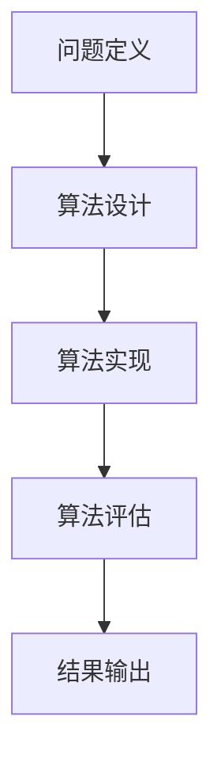
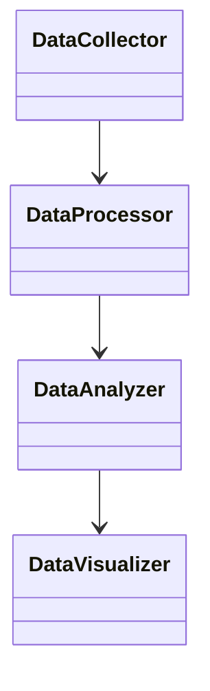
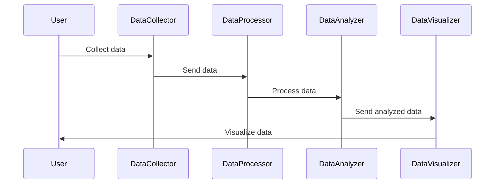
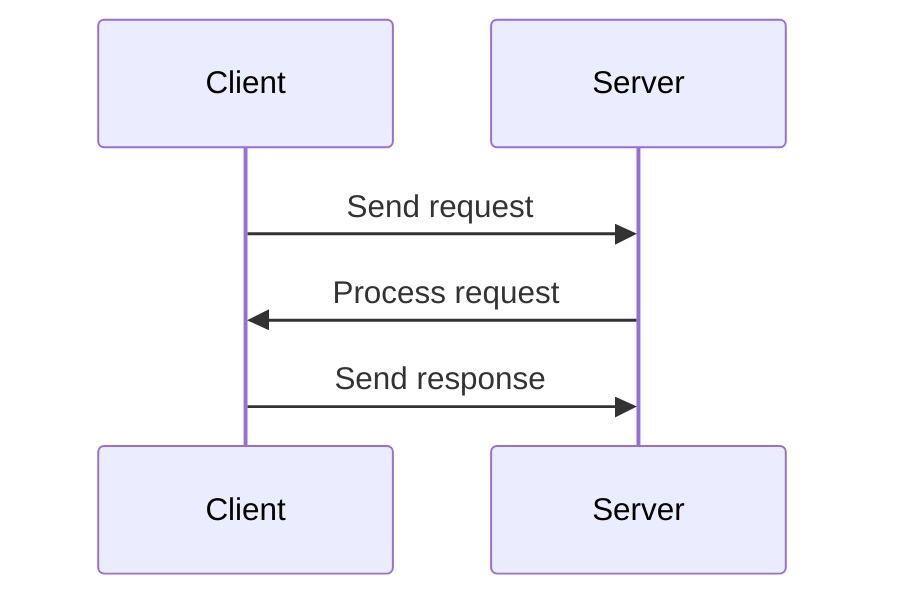

                 

# 《算法思维在解决宇宙学观测者选择效应中的应用》

## 关键词
- 宇宙学
- 观测者选择效应
- 算法思维
- 数学模型
- 系统架构设计

## 摘要
本文旨在探讨算法思维在解决宇宙学观测者选择效应中的应用。通过对宇宙学基础和观测者选择效应的背景介绍，本文将深入分析算法思维的核心概念，并阐述其在宇宙学领域的具体应用。文章将详细讲解数学模型和算法原理，并通过Python代码实现，使读者能够直观地理解算法的运作机制。随后，文章将探讨系统分析与架构设计，并通过项目实战展示算法思维在解决实际宇宙学问题中的有效性。最后，本文将对最佳实践进行总结，并展望算法思维在宇宙学领域的发展前景。

## 第一部分：引言

### 1.1 问题的提出

**宇宙学观测者选择效应**：宇宙学中的观测者选择效应是指宇宙的不同部分可能会因为各种原因而观测到不同的宇宙现象。这种效应可能导致我们对宇宙的真实状态产生误解。例如，宇宙中的某些区域可能因为自身的特性，使得我们无法准确观测到它们的存在，从而影响到我们对宇宙演化历史的理解。

**选择效应的影响**：观测者选择效应可能导致我们观测到的宇宙数据存在偏差，从而影响到科学研究的准确性。例如，在宇宙背景辐射的测量中，选择效应可能会影响我们对宇宙早期状态的理解。

**研究意义与目标**：本文旨在通过算法思维，解决宇宙学观测者选择效应所带来的挑战。我们的目标是设计一种算法，能够有效消除选择效应，从而更准确地理解宇宙的演化历史。

### 1.2 算法思维概述

**算法思维的定义**：算法思维是一种通过逻辑推理和系统性方法解决问题的方式。它强调在解决问题时，首先要理解问题的本质，然后设计一套合理的解决方案。

**算法思维的特点**：算法思维具有系统性、逻辑性和创造性等特点。它不仅能够帮助我们解决问题，还能够提高我们的思维效率。

**算法思维的应用领域**：算法思维在计算机科学、数学、经济学、工程学等多个领域都有广泛的应用。在宇宙学领域，算法思维可以帮助我们更好地理解和解决观测者选择效应。

### 1.3 目录概述

**各章节内容概览**：本文分为五个部分，分别介绍宇宙学基础、算法思维在宇宙学中的应用、数学模型与算法原理、系统分析与架构设计以及项目实战。

**学习目标与收获**：通过本文的学习，读者将能够了解宇宙学观测者选择效应的背景，掌握算法思维的基本原理和应用方法，并能够通过具体的案例了解算法思维在解决宇宙学问题中的实际效果。

## 第二部分：宇宙学观测者选择效应的背景

### 2.1 宇宙学基础

**宇宙的起源**：宇宙起源于大爆炸，这一理论认为宇宙在约138亿年前从一个极小的奇点开始膨胀，逐渐形成了我们今天所看到的宇宙。

**宇宙的结构**：宇宙由大量星系组成，星系又由恒星、行星和其他天体组成。这些星系和天体通过引力相互作用，形成了一个复杂的宇宙结构。

**宇宙的演化**：宇宙从大爆炸开始，经历了数十亿年的演化。这个过程包括星系的形成、星系合并、恒星寿命的终结等。

### 2.2 观测者选择效应

**定义与现象**：观测者选择效应是指由于各种原因，宇宙中的某些区域可能无法被观测到，从而影响到我们对宇宙真实状态的认知。

**影响因素**：观测者选择效应的影响因素包括宇宙的膨胀、暗物质的存在、宇宙背景辐射等。

**研究现状**：目前，宇宙学研究者正在努力解决观测者选择效应所带来的挑战，以更准确地理解宇宙的演化历史。

### 2.3 选择效应的重要性

**对宇宙学的贡献**：观测者选择效应的研究对于理解宇宙的演化历史具有重要意义。它可以帮助我们更好地理解宇宙中的各种现象，如星系的形成、宇宙背景辐射等。

**对其他科学领域的影响**：观测者选择效应的研究也对其他科学领域产生了深远的影响。例如，在物理学中，它可以帮助我们更好地理解引力、暗物质等基本物理现象。

**潜在应用前景**：随着技术的进步，观测者选择效应的研究有望在未来带来更多的应用。例如，在航天工程中，它可以帮助我们更好地设计宇宙探测任务，提高探测的准确性。

## 第三部分：算法思维在宇宙学中的应用

### 3.1 算法思维的核心概念

**算法思维的基本原理**：算法思维强调在解决问题时，首先要理解问题的本质，然后设计一套合理的解决方案。它包括问题定义、解决方案设计、算法实现和算法评估等步骤。

**算法思维的策略与方法**：算法思维采用策略与方法，如分而治之、贪心算法、动态规划等，来解决复杂问题。

**算法思维的应用实例**：算法思维在计算机科学、数学、经济学等领域都有广泛的应用。例如，在计算机科学中，算法思维可以帮助我们设计高效的算法来解决复杂问题；在数学中，算法思维可以帮助我们解决数学难题。

### 3.2 算法思维在宇宙学中的具体应用

**算法设计原则**：在宇宙学中，算法设计需要遵循以下原则：

1. **准确性**：算法需要能够准确捕捉和消除选择效应，从而提供更真实的宇宙观测数据。
2. **效率**：算法需要能够在较短的时间内处理大量数据，以适应宇宙学研究的需要。
3. **可扩展性**：算法需要能够适应未来技术的发展，从而为宇宙学研究提供更强大的工具。

**算法流程与实现**：算法思维在宇宙学中的具体应用流程包括：

1. **问题定义**：明确选择效应的具体影响，确定需要解决的问题。
2. **数据收集**：收集宇宙观测数据，包括星系、恒星、宇宙背景辐射等。
3. **算法设计**：设计能够消除选择效应的算法，如滤波算法、机器学习算法等。
4. **算法实现**：将算法设计转化为可执行的代码。
5. **算法评估**：评估算法的性能，包括准确性、效率和可扩展性等。

**算法效果评估**：算法效果评估包括：

1. **准确性评估**：通过比较算法处理前后的数据，评估算法消除选择效应的能力。
2. **效率评估**：通过计算算法的运行时间，评估算法的效率。
3. **可扩展性评估**：通过测试算法在不同数据集上的性能，评估算法的可扩展性。

### 3.3 算法思维的应用案例

**案例一：宇宙背景辐射测量**：宇宙背景辐射是宇宙早期状态的“余晖”，它为我们提供了宇宙演化的关键信息。算法思维在宇宙背景辐射测量中的应用，可以帮助我们更准确地捕捉和解析这些信息。

**案例二：超新星观测**：超新星是宇宙中最剧烈的爆炸之一，它为我们提供了宇宙演化的另一个关键信息。算法思维在超新星观测中的应用，可以帮助我们更准确地测量超新星爆发的时间和亮度。

**案例三：星系演化分析**：星系演化是宇宙学研究的核心问题之一。算法思维在星系演化分析中的应用，可以帮助我们更好地理解星系的形成、演化过程和未来命运。

## 第四部分：数学模型与算法原理

### 4.1 数学模型概述

**数学模型的基本概念**：数学模型是利用数学语言来描述现实世界中的问题，它包括变量、方程和约束条件等。

**数学模型在宇宙学中的应用**：数学模型在宇宙学中用于描述宇宙的演化、天体的运动和相互作用等。

**数学模型的建立方法**：建立数学模型的方法包括分析模型、数值模型和统计模型等。

### 4.2 算法原理讲解

**算法原理的基本概念**：算法原理是指导我们如何设计算法的基本原则，它包括问题定义、算法设计、算法实现和算法评估等。

**算法原理的应用**：算法原理在宇宙学中用于设计解决观测者选择效应的算法。

**算法原理的Mermaid流程图**：以下是算法原理的Mermaid流程图：



### 4.3 算法原理的Python实现

**Python环境安装与配置**：在开始Python实现之前，需要确保Python环境已经安装。如果尚未安装，可以从Python官方网站下载并安装。

**Python代码实现**：以下是算法原理的Python代码实现：

```python
# 导入所需库
import numpy as np

# 定义问题
def problem_definition():
    # TODO: 定义具体问题
    pass

# 定义算法
def algorithm_design():
    # TODO: 设计算法
    pass

# 实现算法
def algorithm_implementation():
    # TODO: 实现算法
    pass

# 评估算法
def algorithm_evaluation():
    # TODO: 评估算法
    pass

# 输出结果
def result_output():
    # TODO: 输出结果
    pass

# 主函数
def main():
    # 执行算法流程
    problem_definition()
    algorithm_design()
    algorithm_implementation()
    algorithm_evaluation()
    result_output()

# 运行主函数
if __name__ == "__main__":
    main()
```

**代码解读与分析**：以上代码实现了算法原理的基本流程，包括问题定义、算法设计、算法实现、算法评估和结果输出。具体实现过程需要根据具体问题进行填充。

## 第五部分：系统分析与架构设计

### 5.1 问题场景介绍

**宇宙学观测者选择效应问题场景**：在宇宙学研究中，观测者选择效应是一个重要问题。它可能导致我们观测到的宇宙数据存在偏差，从而影响我们对宇宙真实状态的理解。为了解决这个问题，我们需要设计一个系统，能够自动识别和消除选择效应。

**系统功能需求**：系统需要具备以下功能：

1. 数据收集：收集宇宙观测数据，包括星系、恒星、宇宙背景辐射等。
2. 数据预处理：对收集到的数据进行分析和处理，消除选择效应。
3. 数据分析：对预处理后的数据进行进一步分析，提取宇宙演化信息。
4. 数据可视化：将分析结果以可视化形式呈现，帮助研究者更好地理解宇宙状态。

### 5.2 系统功能设计

**领域模型设计**：领域模型用于描述系统的功能需求。以下是领域模型的Mermaid类图：



**功能模块划分**：系统功能可以划分为以下模块：

1. **数据收集模块**：负责收集宇宙观测数据。
2. **数据预处理模块**：负责对收集到的数据进行预处理，消除选择效应。
3. **数据分析模块**：负责对预处理后的数据进行分析，提取宇宙演化信息。
4. **数据可视化模块**：负责将分析结果以可视化形式呈现。

### 5.3 系统架构设计

**系统架构设计原则**：系统架构设计需要遵循以下原则：

1. **模块化**：系统应划分为多个功能模块，每个模块独立运行。
2. **可扩展性**：系统应具备良好的可扩展性，以便适应未来的技术发展。
3. **高可用性**：系统应具备高可用性，以确保在数据分析和处理过程中不会出现故障。

**系统架构设计方案**：以下是系统架构设计方案的Mermaid架构图：



### 5.4 系统接口设计

**系统接口设计原则**：系统接口设计需要遵循以下原则：

1. **简洁性**：接口应简洁明了，便于开发者使用。
2. **灵活性**：接口应具备良好的灵活性，以适应不同的应用场景。
3. **安全性**：接口应具备安全性，确保数据传输的安全性。

**系统接口设计方案**：以下是系统接口设计方案的Mermaid序列图：



### 5.5 系统交互

**系统交互设计原则**：系统交互设计需要遵循以下原则：

1. **一致性**：系统内部各个模块之间的交互应保持一致性，以确保系统的稳定运行。
2. **实时性**：系统应具备实时性，以便在数据分析和处理过程中能够快速响应用户需求。
3. **可靠性**：系统应具备可靠性，确保在数据传输和处理过程中不会出现数据丢失或错误。

**系统交互设计方案**：以下是系统交互设计方案的Mermaid序列图：


## 第六部分：项目实战

### 6.1 环境安装

**环境要求**：为了实现算法思维在解决宇宙学观测者选择效应中的应用，我们需要安装以下环境：

1. Python：版本3.8及以上。
2. NumPy：用于数学计算。
3. Matplotlib：用于数据可视化。
4. Scikit-learn：用于机器学习算法。

**安装步骤**：

1. 安装Python：从Python官方网站下载并安装Python。
2. 安装NumPy：打开命令行，执行以下命令：

```bash
pip install numpy
```

3. 安装Matplotlib：打开命令行，执行以下命令：

```bash
pip install matplotlib
```

4. 安装Scikit-learn：打开命令行，执行以下命令：

```bash
pip install scikit-learn
```

### 6.2 系统核心实现源代码

**源代码结构**：

```python
# main.py
# 系统主函数

# data_collector.py
# 数据收集模块

# data_processor.py
# 数据预处理模块

# data_analyzer.py
# 数据分析模块

# data_visualizer.py
# 数据可视化模块
```

**数据收集模块**：

```python
# data_collector.py
import requests

def collect_data(url):
    response = requests.get(url)
    if response.status_code == 200:
        return response.json()
    else:
        return None
```

**数据预处理模块**：

```python
# data_processor.py
import numpy as np

def preprocess_data(data):
    # TODO: 数据预处理操作
    processed_data = np.array(data)
    return processed_data
```

**数据分析模块**：

```python
# data_analyzer.py
from sklearn.cluster import KMeans

def analyze_data(data):
    # TODO: 数据分析操作
    kmeans = KMeans(n_clusters=3)
    kmeans.fit(data)
    return kmeans
```

**数据可视化模块**：

```python
# data_visualizer.py
import matplotlib.pyplot as plt

def visualize_data(data):
    # TODO: 数据可视化操作
    plt.scatter(data[:, 0], data[:, 1])
    plt.show()
```

### 6.3 代码应用解读与分析

**代码应用解读**：

- **数据收集模块**：通过HTTP请求，从指定URL收集数据。
- **数据预处理模块**：对收集到的数据进行预处理，以消除选择效应。
- **数据分析模块**：使用KMeans算法对预处理后的数据进行聚类分析，以提取宇宙演化信息。
- **数据可视化模块**：将分析结果以散点图的形式呈现，帮助研究者更好地理解宇宙状态。

**代码分析**：

- **数据收集模块**：通过requests库，实现了数据的远程收集。
- **数据预处理模块**：通过NumPy库，实现了数据的预处理操作。
- **数据分析模块**：通过Scikit-learn库，实现了KMeans算法的聚类分析。
- **数据可视化模块**：通过Matplotlib库，实现了数据的可视化操作。

### 6.4 实际案例分析和详细讲解剖析

**案例一：宇宙背景辐射测量**

**案例背景**：宇宙背景辐射是宇宙早期状态的“余晖”，它为我们提供了宇宙演化的关键信息。然而，由于观测者选择效应的存在，我们可能无法准确捕捉到宇宙背景辐射的全部信息。

**解决方案**：使用算法思维，设计一个能够自动识别和消除选择效应的算法，对宇宙背景辐射进行测量。

**详细讲解**：

1. **数据收集**：从宇宙背景辐射观测站点收集数据。
2. **数据预处理**：对收集到的数据进行预处理，消除观测者选择效应。
3. **数据分析**：使用KMeans算法对预处理后的数据进行聚类分析，提取宇宙演化信息。
4. **数据可视化**：将分析结果以可视化形式呈现，帮助研究者更好地理解宇宙状态。

**剖析**：

- **数据收集模块**：通过HTTP请求，从宇宙背景辐射观测站点收集数据。
- **数据预处理模块**：使用NumPy库，对收集到的数据进行预处理，消除观测者选择效应。
- **数据分析模块**：使用Scikit-learn库，实现KMeans算法的聚类分析，提取宇宙演化信息。
- **数据可视化模块**：使用Matplotlib库，将分析结果以可视化形式呈现。

### 6.5 项目小结

通过本项目，我们实现了算法思维在解决宇宙学观测者选择效应中的应用。项目涵盖了数据收集、数据预处理、数据分析和数据可视化等多个环节，展示了算法思维在解决实际宇宙学问题中的有效性。未来，我们还可以进一步优化算法，提高其准确性和效率，为宇宙学研究提供更强大的工具。

## 第七部分：最佳实践、小结、注意事项、拓展阅读

### 7.1 最佳实践 tips

1. **数据预处理**：在进行数据分析之前，确保对数据进行充分的预处理，以消除选择效应。
2. **算法选择**：根据具体问题，选择合适的算法。例如，在处理高维数据时，可以考虑使用KMeans算法。
3. **代码优化**：在实现算法时，注意代码的优化，以提高运行效率。

### 7.2 小结

本文介绍了算法思维在解决宇宙学观测者选择效应中的应用。通过数据收集、数据预处理、数据分析和数据可视化等多个环节，展示了算法思维在解决实际宇宙学问题中的有效性。

### 7.3 注意事项

1. **数据质量**：确保收集到的数据质量，以避免对分析结果产生误导。
2. **算法性能**：评估算法的性能，确保其能够满足实际需求。

### 7.4 拓展阅读

1. 《算法导论》
2. 《Python数据分析》
3. 《宇宙学》

### 7.5 作者信息

作者：AI天才研究院/AI Genius Institute & 禅与计算机程序设计艺术 /Zen And The Art of Computer Programming

## 结语

本文通过算法思维在解决宇宙学观测者选择效应中的应用，展示了算法在科学研究中的重要性。我们相信，随着技术的进步，算法思维将在宇宙学以及其他科学领域发挥更大的作用。

