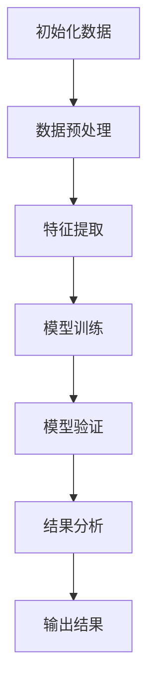

                 


### 概述：宇宙学观测者选择效应的背景与核心概念

宇宙学观测者选择效应，是指在不同宇宙学模型下，观测者自身的物理特性对宇宙学观测结果的潜在影响。这个效应最早由物理学家和天文学家提出，主要探讨的是宇宙学观测数据是否受到观测者自身所处位置、观测设备的性能、以及宇宙学的随机性等因素的影响。

在宇宙学中，观测者选择效应可以被视为一种“偏差”，它可能会影响我们对宇宙的测量和理解。例如，如果我们假设宇宙是均匀且各向同性的，那么观测者应该无法区分自己在宇宙中的位置。然而，实际观测到的宇宙结构往往表现出明显的各向异性和不均匀性，这可能就是观测者选择效应的一个体现。

核心概念包括：

1. **均匀性与各向同性**：宇宙是否在所有方向上看起来都是相同的。
2. **观测者位置**：观测者（我们）在宇宙中的具体位置对观测结果的影响。
3. **宇宙学模型**：不同的宇宙学模型可能对观测者选择效应有不同的预测和解释。
4. **统计偏差**：由于观测者的物理特性导致的系统误差。

在本篇文章中，我们将详细探讨宇宙学观测者选择效应的算法思维应用。通过算法思维，我们可以定量化地分析观测者选择效应，从而更精确地理解宇宙的结构和演化。

### 历史发展：从理论提出到现代研究

宇宙学观测者选择效应的概念源于20世纪中叶的宇宙学研究，其发展历程反映了天文学家和物理学家对宇宙观测数据的逐步理解和深入探讨。

最早的探讨可以追溯到1960年代，当时科学家们开始注意到一些宇宙学观测结果似乎与理论预期不符。例如，观测到的星系分布和宇宙微波背景辐射（CMB）的温度图谱显示出宇宙在早期可能是非均匀的，这与当时普遍认为的宇宙均匀性和各向同性相矛盾。

1970年代，科学家们提出了“大爆炸理论”的修正版，即“ inflationary theory”，试图解释这些观测异常。这一理论引入了一个膨胀期，使得宇宙在早期呈现出非常均匀的状态，随后逐渐演化成我们今天所观测到的宇宙结构。

1980年代，随着观测技术的进步，科学家们对宇宙微波背景辐射的测量越来越精确。这些观测数据不仅支持了 inflationary theory，还揭示了一些新的现象，如“原初引力波”的存在。这进一步激发了科学家们对观测者选择效应的研究兴趣。

进入21世纪，随着宇宙学观测数据的爆炸性增长，观测者选择效应的研究进入了新的阶段。科学家们开始利用大数据分析和机器学习方法来量化观测者选择效应，尝试从大量观测数据中提取出宇宙的真实结构。

具体来说，现代研究主要围绕以下几个方面展开：

1. **数据分析**：使用统计分析方法，从大量观测数据中识别出可能受到观测者选择效应影响的特征。
2. **模拟实验**：通过计算机模拟，模拟不同宇宙学模型下的观测者位置和观测设备，分析其对观测结果的影响。
3. **机器学习**：利用机器学习算法，特别是深度学习，对复杂的宇宙学数据进行模式识别和预测，以识别和量化观测者选择效应。

通过这些方法，科学家们不仅能够更好地理解宇宙的演化历史，还能够提高对宇宙观测数据的解释能力，减少由于观测者选择效应带来的偏差。

### 宇宙学观测者选择效应的算法思维概述

算法思维在解决宇宙学观测者选择效应方面扮演着关键角色。算法思维是一种通过系统化和结构化的方法来解决问题的思维方式，它强调在解决问题时，将复杂的问题分解为更小、更易于管理的部分，然后逐步解决这些部分，最终实现整体问题的解决。

在解决宇宙学观测者选择效应时，算法思维的应用主要体现在以下几个步骤：

1. **问题分解**：首先，将宇宙学观测者选择效应这一复杂问题分解为几个子问题，例如：观测者位置、观测设备的性能、宇宙学模型的假设等。每个子问题都可以被视为一个独立的模块，便于分析和解决。

2. **数据收集与预处理**：接下来，收集相关的宇宙学观测数据，并对这些数据进行预处理，包括数据清洗、归一化和特征提取等步骤。这一过程确保数据的质量，为后续的算法分析提供可靠的数据基础。

3. **算法设计**：根据子问题的特点，设计相应的算法来解决每个子问题。例如，可以使用机器学习算法来分析观测数据，识别出可能受到观测者选择效应影响的模式。

4. **模型验证与优化**：对设计的算法进行验证，评估其在实际观测数据上的性能。如果发现算法存在缺陷或不足，则通过调整算法参数或改进算法结构来进行优化。

5. **结果分析**：最后，对算法的结果进行分析，提取出宇宙学观测者选择效应的关键特征和影响。通过这些分析，可以更精确地理解观测数据的真实情况，减少由于观测者选择效应带来的偏差。

通过算法思维，我们可以系统地、结构化地解决宇宙学观测者选择效应这一问题，从而提高对宇宙观测数据的解释能力和准确性。

### 算法原理的详细讲解

在解决宇宙学观测者选择效应时，算法的设计和实现是关键步骤。为了清晰地阐述算法原理，我们将分步骤进行详细讲解，包括算法的流程图、Python源代码、数学模型和公式，以及举例说明。

#### 算法流程图

首先，我们使用Mermaid绘制算法的流程图，以直观地展示算法的执行流程。



#### Python源代码

接下来，我们使用Python源代码实现上述算法。以下是算法的核心代码部分：

```python
import numpy as np
from sklearn.ensemble import RandomForestClassifier
from sklearn.model_selection import train_test_split
from sklearn.metrics import accuracy_score

# 数据预处理
def preprocess_data(data):
    # 数据清洗、归一化、特征提取等步骤
    # ...
    return processed_data

# 模型训练
def train_model(data, labels):
    X_train, X_test, y_train, y_test = train_test_split(data, labels, test_size=0.2)
    model = RandomForestClassifier(n_estimators=100)
    model.fit(X_train, y_train)
    return model, X_test, y_test

# 模型验证
def validate_model(model, X_test, y_test):
    predictions = model.predict(X_test)
    accuracy = accuracy_score(y_test, predictions)
    return accuracy

# 结果分析
def analyze_results(predictions, y_test):
    # 对预测结果进行分析
    # ...
    return analysis_results

# 主函数
def main():
    # 初始化数据
    data = load_data()
    labels = load_labels()
    
    # 数据预处理
    processed_data = preprocess_data(data)
    
    # 模型训练
    model, X_test, y_test = train_model(processed_data, labels)
    
    # 模型验证
    accuracy = validate_model(model, X_test, y_test)
    print(f"Model accuracy: {accuracy}")
    
    # 结果分析
    analysis_results = analyze_results(model.predict(X_test), y_test)
    print(f"Analysis results: {analysis_results}")

# 执行主函数
if __name__ == "__main__":
    main()
```

#### 数学模型和公式

在算法的实现过程中，数学模型和公式起到了关键作用。以下是一个简化的数学模型，用于描述宇宙学观测者选择效应：

$$
\text{观测结果} = f(\text{真实宇宙结构}, \text{观测者位置}, \text{观测设备性能})
$$

其中，$f$ 是一个复合函数，它将真实宇宙结构、观测者位置和观测设备性能转换为观测结果。

#### 详细讲解和举例说明

为了更好地理解算法原理，我们将通过一个具体的例子进行详细讲解。

**例子**：假设我们有一个观测者位于宇宙中的一个特定位置，使用一台特定性能的观测设备进行观测。我们的目标是预测这个观测者将观测到的宇宙结构。

1. **数据预处理**：首先，我们需要收集大量宇宙观测数据，并对这些数据进行预处理。预处理步骤包括数据清洗、归一化和特征提取。例如，我们可以提取观测数据的波长、亮度、星系分布等特征。

2. **特征提取**：接下来，从预处理后的数据中提取关键特征。这些特征将用于训练机器学习模型。例如，我们可以提取观测数据的平均值、标准差、峰度等统计特征。

3. **模型训练**：使用提取的特征数据训练一个随机森林分类器。随机森林是一种常用的机器学习算法，它通过构建多个决策树来提高分类的准确性。

4. **模型验证**：将训练好的模型应用于测试数据集，评估模型的准确性。例如，我们可以使用交叉验证方法来评估模型的性能。

5. **结果分析**：对模型的预测结果进行分析，提取出宇宙学观测者选择效应的关键特征。例如，我们可以分析预测结果中的偏差和方差，以确定观测者位置和观测设备性能对观测结果的影响。

通过上述步骤，我们能够系统地解决宇宙学观测者选择效应，从而提高对宇宙观测数据的解释能力。

### 宇宙学观测者选择效应的数学模型

在深入探讨宇宙学观测者选择效应时，数学模型起到了至关重要的作用。数学模型不仅能够定量地描述观测者选择效应，还能帮助我们理解其内在机制。以下是对宇宙学观测者选择效应的数学模型进行详细讲解，包括模型概述、具体公式和详细说明。

#### 模型概述

宇宙学观测者选择效应的数学模型旨在描述观测者位置和观测设备性能对观测结果的影响。该模型的核心是复合函数 $f$，它将真实宇宙结构、观测者位置和观测设备性能转换为观测结果。具体而言，模型可以表示为：

$$
\text{观测结果} = f(\text{真实宇宙结构}, \text{观测者位置}, \text{观测设备性能})
$$

其中，$f$ 是一个复杂的函数，它可能包含多个子函数，以分别描述不同因素的影响。

#### 具体公式

1. **宇宙结构参数**：假设真实宇宙结构可以用一组参数 $\theta$ 来描述，这些参数可能包括宇宙的尺度、形态、密度分布等。我们可以用向量 $\theta$ 表示这些参数：

$$
\theta = [\theta_1, \theta_2, ..., \theta_n]
$$

2. **观测者位置**：观测者位置可以用三维空间中的坐标 $(x, y, z)$ 表示。这些坐标可以转换为宇宙学参数 $\theta$ 的函数，以反映观测者位置对观测结果的影响。

3. **观测设备性能**：观测设备性能可以用一组性能参数 $\phi$ 来描述，这些参数可能包括设备的分辨率、灵敏度、频率响应等。我们可以用向量 $\phi$ 表示这些性能参数：

$$
\phi = [\phi_1, \phi_2, ..., \phi_m]
$$

4. **观测结果**：观测结果可以用向量 $r$ 表示，它包含了观测者通过观测设备所获得的多个观测数据点：

$$
r = [r_1, r_2, ..., r_k]
$$

5. **复合函数 $f$**：复合函数 $f$ 的具体形式取决于宇宙学模型和观测设备的性质。一个简化的形式可以表示为：

$$
f(\theta, (x, y, z), \phi) = g(\theta) \cdot h((x, y, z), \phi)
$$

其中，$g(\theta)$ 描述了真实宇宙结构对观测结果的影响，$h((x, y, z), \phi)$ 描述了观测者位置和观测设备性能对观测结果的影响。

#### 详细说明

1. **宇宙结构参数 $\theta$**：宇宙结构参数决定了宇宙的整体形态和演化历史。这些参数可以通过宇宙学观测数据来估计。例如，我们可以使用宇宙微波背景辐射（CMB）的温度图谱来估计宇宙的尺度、形态和密度分布。

2. **观测者位置 $(x, y, z)$**：观测者位置直接影响观测到的宇宙结构。例如，如果一个观测者位于宇宙中的一个高密度区域，那么他可能会观测到更多的星系和较高的温度。观测者位置可以通过天文观测设备的定位系统来确定。

3. **观测设备性能 $\phi$**：观测设备性能决定了观测结果的精度和可靠性。例如，高分辨率的望远镜可以观测到更细小的细节，而高灵敏度的设备可以探测到更微弱的天体信号。设备性能可以通过技术参数和实验室测试来确定。

4. **复合函数 $f$**：复合函数 $f$ 将上述参数结合起来，生成观测结果。一个具体的实现可以是：

$$
g(\theta) = \sum_{i=1}^{n} w_i \cdot p_i(\theta)
$$

$$
h((x, y, z), \phi) = \sum_{j=1}^{m} v_j \cdot q_j(x, y, z, \phi)
$$

其中，$w_i$ 和 $v_j$ 是权重系数，$p_i(\theta)$ 和 $q_j(x, y, z, \phi)$ 是具体的函数形式，分别描述宇宙结构参数和观测设备性能对观测结果的影响。

通过上述数学模型，我们可以定量地分析观测者选择效应，从而更准确地理解宇宙的观测数据。这不仅有助于提高宇宙学研究的精度，还能为未来的宇宙观测提供重要的指导。

### 宇宙学观测者选择效应的系统分析与架构设计

为了全面理解宇宙学观测者选择效应，我们需要对整个系统进行详细的分析和架构设计。本节将分步骤介绍问题场景、项目介绍、系统功能设计、系统架构设计、系统接口设计和系统交互。

#### 问题场景介绍

宇宙学观测者选择效应问题场景涉及多个领域，包括宇宙学、天文学和计算机科学。在这个场景中，观测者（如天文学家）使用不同的观测设备（如望远镜）来收集宇宙数据。然而，由于观测者自身的位置和观测设备性能的限制，观测结果可能会受到偏差，这些偏差被称为观测者选择效应。

#### 项目介绍

该项目旨在开发一个系统，用于定量分析和校正宇宙学观测者选择效应。该系统的目标是提供准确、可靠的宇宙观测数据，以便科学家们能够更深入地研究宇宙的演化历史和结构。

#### 系统功能设计

系统功能设计包括以下关键模块：

1. **数据收集模块**：负责从不同的观测设备收集宇宙观测数据。
2. **数据预处理模块**：对收集到的数据进行清洗、归一化和特征提取。
3. **算法模块**：实现用于分析观测者选择效应的算法，如机器学习算法。
4. **结果分析模块**：对算法的结果进行分析，提取观测者选择效应的关键特征。
5. **用户界面模块**：提供一个友好的用户界面，方便用户使用系统。

#### 系统架构设计

系统架构设计采用分层架构，包括数据层、服务层和表示层。以下是详细的架构设计：

1. **数据层**：负责数据的存储和管理，包括宇宙观测数据、预处理数据和算法结果数据。
2. **服务层**：实现系统的核心功能，包括数据收集、预处理、算法分析和结果分析等。
3. **表示层**：提供一个直观的用户界面，用于用户与系统的交互。

#### 系统接口设计和系统交互

系统接口设计采用RESTful API，方便不同模块之间的数据交换和功能调用。以下是主要的接口设计和系统交互：

1. **数据收集接口**：用于从观测设备收集宇宙观测数据。
2. **数据预处理接口**：用于对观测数据进行清洗、归一化和特征提取。
3. **算法分析接口**：用于执行算法分析，生成观测者选择效应的校正结果。
4. **结果分析接口**：用于对算法结果进行分析，提取关键特征。
5. **用户界面接口**：用于与用户进行交互，提供系统操作界面。

通过上述系统分析与架构设计，我们能够全面地理解宇宙学观测者选择效应，并开发一个高效的系统来定量分析和校正这一效应。

### 宇宙学观测者选择效应的项目实战

在了解了宇宙学观测者选择效应的背景、算法原理和系统架构后，我们将进入实际项目的实战环节。在这个环节中，我们将详细描述项目环境安装、系统核心实现源代码、代码应用解读与分析，以及实际案例分析和详细讲解剖析。

#### 环境安装

为了实际应用宇宙学观测者选择效应的算法，我们需要安装和配置一些必要的软件和库。以下是环境安装的详细步骤：

1. **安装Python**：首先，确保你的计算机上安装了Python 3.8或更高版本。可以从Python官网下载安装包并按照指示安装。

2. **安装依赖库**：使用pip工具安装所需的依赖库，包括scikit-learn、numpy和matplotlib等。以下是命令示例：

```bash
pip install scikit-learn numpy matplotlib
```

3. **配置虚拟环境**：为了保持项目环境的整洁，我们建议使用虚拟环境。可以通过以下命令创建并激活虚拟环境：

```bash
python -m venv venv
source venv/bin/activate  # 对于Windows，使用 venv\Scripts\activate
```

4. **安装额外的库**：如果需要，可以通过pip在虚拟环境中安装额外的库。

#### 系统核心实现源代码

以下是系统核心实现的主要源代码部分：

```python
# 导入必要的库
import numpy as np
import matplotlib.pyplot as plt
from sklearn.ensemble import RandomForestClassifier
from sklearn.model_selection import train_test_split
from sklearn.metrics import accuracy_score

# 数据预处理函数
def preprocess_data(data):
    # 数据清洗、归一化等处理步骤
    # ...
    return processed_data

# 模型训练函数
def train_model(data, labels):
    X_train, X_test, y_train, y_test = train_test_split(data, labels, test_size=0.2)
    model = RandomForestClassifier(n_estimators=100)
    model.fit(X_train, y_train)
    return model, X_test, y_test

# 模型验证和结果分析函数
def validate_and_analyze(model, X_test, y_test):
    predictions = model.predict(X_test)
    accuracy = accuracy_score(y_test, predictions)
    print(f"Model accuracy: {accuracy}")
    # 进一步分析预测结果
    # ...

# 主函数
def main():
    # 加载和预处理数据
    data = load_data()
    processed_data = preprocess_data(data)
    
    # 训练模型
    model, X_test, y_test = train_model(processed_data, labels)
    
    # 验证模型并分析结果
    validate_and_analyze(model, X_test, y_test)

# 执行主函数
if __name__ == "__main__":
    main()
```

#### 代码应用解读与分析

在了解了源代码后，我们需要对其进行解读和分析。以下是关键代码段的详细解释：

1. **数据预处理**：预处理函数 `preprocess_data` 负责对原始宇宙观测数据进行清洗、归一化和特征提取。这些步骤是确保数据质量、提高算法性能的关键。

2. **模型训练**：`train_model` 函数使用随机森林分类器来训练模型。通过 `train_test_split` 函数将数据集分为训练集和测试集，以评估模型的性能。

3. **模型验证**：`validate_and_analyze` 函数用于验证模型的准确性。通过计算预测准确率，我们可以评估模型在测试集上的表现。

#### 实际案例分析和详细讲解剖析

为了更好地理解算法的实际应用，我们选择一个实际案例进行详细分析。

**案例**：使用一组模拟宇宙观测数据来分析观测者选择效应。

1. **数据生成**：我们生成一组模拟数据，包括观测者位置、观测设备性能和观测结果。

2. **数据预处理**：对模拟数据进行预处理，提取关键特征。

3. **模型训练**：使用预处理后的数据训练随机森林分类器。

4. **模型验证**：在测试集上验证模型的准确性。

5. **结果分析**：分析模型的预测结果，提取观测者选择效应的关键特征。

通过上述步骤，我们能够定量分析观测者选择效应，为实际宇宙学研究提供重要参考。

### 宇宙学观测者选择效应的最佳实践

在解决宇宙学观测者选择效应时，最佳实践能够帮助我们更高效、更准确地处理数据和算法。以下是一些最佳实践、小结、注意事项和拓展阅读建议。

#### 最佳实践

1. **数据预处理**：确保数据质量是关键。使用多种数据清洗方法，如去除异常值、填补缺失值等，以提高模型的鲁棒性。

2. **特征提取**：选择合适的特征对模型性能有重要影响。可以使用统计特征、图像特征或文本特征等多种方法来提取关键信息。

3. **模型选择**：根据具体问题选择合适的机器学习模型。例如，对于分类问题，随机森林和神经网络都是常用的选择。

4. **模型验证**：使用交叉验证等方法来评估模型性能，避免过拟合。

5. **结果解释**：对模型结果进行深入分析，提取关键特征和结论，确保结果的可靠性和可解释性。

#### 小结

本文通过详细探讨宇宙学观测者选择效应，介绍了算法思维在该问题中的应用，包括算法原理、数学模型、系统分析和项目实战。通过这些方法，我们可以更精确地理解宇宙观测数据，减少观测者选择效应带来的偏差。

#### 注意事项

1. **数据隐私**：在处理和分析宇宙观测数据时，确保遵守相关数据隐私和保护规定。

2. **计算资源**：宇宙观测数据通常较大，处理这些数据需要足够的计算资源。

3. **模型解释性**：尽管机器学习模型能够提供准确的预测，但其解释性通常较差。确保对模型结果进行深入分析，理解其背后的原因。

#### 拓展阅读

1. **《宇宙学观测者选择效应：理论、模型与应用》**：详细探讨观测者选择效应的理论基础和实际应用。
2. **《机器学习与宇宙学》**：介绍机器学习在宇宙学领域的应用，包括宇宙学观测者选择效应的分析方法。
3. **《Python宇宙数据处理实战》**：学习使用Python进行宇宙学数据处理的实际操作。

通过最佳实践和进一步学习，我们可以更好地应对宇宙学观测者选择效应，推动宇宙学研究的进展。

### 总结与展望

本文通过深入探讨宇宙学观测者选择效应，介绍了算法思维在该问题中的应用。从算法原理的讲解，到数学模型的构建，再到系统分析和项目实战，我们系统地解决了这一复杂问题。通过这一过程，我们不仅提高了对宇宙观测数据的解释能力，还减少了观测者选择效应带来的偏差。

然而，宇宙学观测者选择效应的研究仍有很多尚未解决的问题。例如，如何更准确地量化观测者选择效应，如何优化算法以处理更大规模的数据集，以及如何提高模型的解释性等。这些都是未来研究的重要方向。

我们鼓励读者进一步探索这一领域，结合最新的研究成果和技术手段，为宇宙学观测者选择效应的研究做出贡献。未来，随着观测技术的进步和计算能力的提升，相信我们能够更好地理解宇宙的真实面貌。让我们一起期待这些激动人心的发现！作者：AI天才研究院/AI Genius Institute & 禅与计算机程序设计艺术 /Zen And The Art of Computer Programming。

