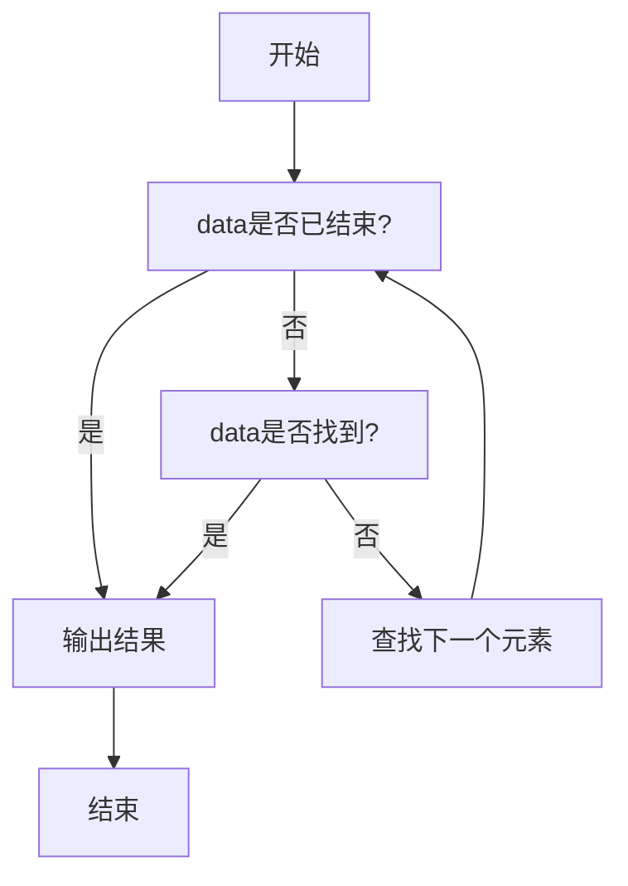
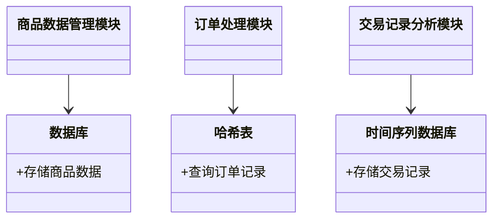
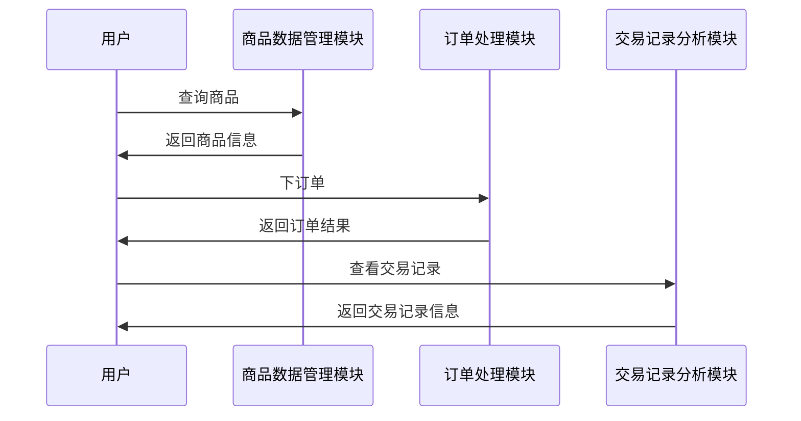
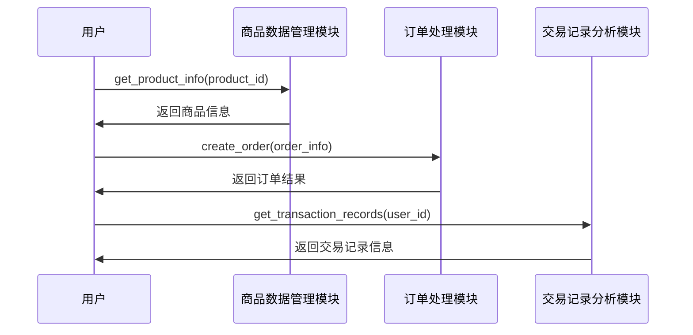

                 

### 算法效率概述

#### 引言

算法效率是计算机科学中一个至关重要的话题。随着信息技术的飞速发展，大数据、人工智能等领域的不断演进，高效算法的需求愈发突出。算法效率不仅影响程序的运行速度，更关乎系统的整体性能和用户体验。在众多计算机科学问题中，如何优化算法的效率成为了一项核心任务。

本部分将围绕算法效率展开讨论，首先介绍相关背景信息，然后明确问题描述，接着探讨问题解决方法，并对边界与外延、核心概念和要素组成进行详细阐述。最后，本章将总结算法效率的相关内容，为后续深入探讨算法效率的核心概念与应用奠定基础。

#### 1.1 问题背景

算法效率的问题起源于计算机处理大量数据的实际需求。在过去，计算机处理数据的速度相对较慢，算法的效率并不显得那么重要。然而，随着计算能力的不断提升，数据规模也在以惊人的速度增长。现代计算机系统需要处理的数据量越来越大，这使得算法效率的问题变得更加突出。

特别是在大数据和人工智能领域，数据处理的效率直接影响到模型训练的速度和结果精度。一个高效的算法能够在短时间内完成大量数据处理，从而提升系统的整体性能。例如，在图像识别、自然语言处理和推荐系统等领域，算法效率的优化能够带来显著的性能提升，提高系统的准确性和用户体验。

此外，算法效率的问题还涉及到资源利用率和能源消耗。高效的算法能够减少计算机的资源消耗，降低能源成本，这对于环境保护和可持续发展具有重要意义。

#### 1.2 问题描述

算法效率问题可以概括为以下几个方面：

1. **时间复杂度**：衡量算法运行时间与输入数据规模之间的关系。一个高效的算法应当具有较低的时间复杂度，能够在处理大量数据时迅速完成计算。

2. **空间复杂度**：衡量算法所需内存空间与输入数据规模之间的关系。空间复杂度较低意味着算法能够更有效地利用计算机资源。

3. **性能瓶颈**：在特定场景下，算法可能遇到性能瓶颈，如数据访问频繁、计算复杂度过高等。识别并解决性能瓶颈是优化算法效率的关键。

4. **可扩展性**：随着数据规模的增长，算法应具备良好的可扩展性，能够适应更大规模的数据处理需求，而不显著降低效率。

具体而言，算法效率问题可以描述为：在给定的输入数据规模下，如何设计、选择或优化算法，使其在时间和空间复杂度上达到最优，同时具备良好的可扩展性和稳定性。

#### 1.3 问题解决

解决算法效率问题涉及多个方面，包括算法设计、优化和选择。以下是一些常见的方法：

1. **算法设计**：根据问题特点，设计合适的算法。常见的算法设计方法包括分治策略、贪心策略、动态规划等。

2. **时间复杂度优化**：通过分析算法的时间复杂度，找出可能的优化点。例如，使用更高效的算法替代低效算法，减少不必要的计算等。

3. **空间复杂度优化**：优化算法的空间复杂度，如减少冗余数据的存储、重用内存等。

4. **并行计算**：利用多核处理器和分布式计算资源，将计算任务分解为多个子任务，并行处理，从而提高整体效率。

5. **缓存策略**：利用缓存技术，减少频繁的数据访问，提高算法的运行速度。

6. **系统优化**：优化系统配置、硬件选择和资源调度策略，为算法提供更好的运行环境。

#### 1.4 边界与外延

算法效率问题的边界包括以下几个方面：

1. **计算资源限制**：算法的运行受到计算机硬件资源的限制，如CPU速度、内存大小等。在资源有限的情况下，如何设计高效的算法成为关键。

2. **数据规模**：算法效率与数据规模密切相关。在大规模数据集上，算法的时间复杂度和空间复杂度对整体性能的影响更为显著。

3. **应用场景**：不同的应用场景对算法效率的需求不同。例如，实时系统要求算法具有较低的时间复杂度，而离线分析系统则更关注算法的空间复杂度。

算法效率的外延涉及多个领域，如：

1. **大数据处理**：大数据场景下，如何设计高效的数据处理算法是当前研究的热点。

2. **人工智能**：人工智能算法的效率直接影响模型训练和预测的准确性。

3. **分布式系统**：分布式系统中，算法的效率与数据传输和网络延迟密切相关。

4. **云计算**：云计算环境下，如何优化算法的运行效率，提高资源利用率是研究的重要方向。

#### 1.5 概念结构与核心要素组成

算法效率的核心概念包括时间复杂度、空间复杂度、性能瓶颈和可扩展性。这些概念相互关联，共同决定了算法的效率。

1. **时间复杂度**：衡量算法运行时间与输入数据规模之间的关系。常见的时间复杂度包括线性时间、对数时间和多项式时间等。

2. **空间复杂度**：衡量算法所需内存空间与输入数据规模之间的关系。常见的空间复杂度包括常数空间、线性空间和多项式空间等。

3. **性能瓶颈**：指算法在特定场景下遇到的性能限制，如数据访问频繁、计算复杂度过高等。

4. **可扩展性**：算法在数据规模增长时的性能表现，包括时间复杂度和空间复杂度的变化。

算法效率的核心要素包括算法设计、优化方法和应用场景。算法设计是基础，优化方法是手段，应用场景是目标。通过合理的算法设计和优化，结合具体应用场景，可以实现高效的算法运行。

#### 1.6 本章小结

本部分对算法效率问题进行了全面概述，包括背景介绍、问题描述、问题解决方法、边界与外延以及概念结构与核心要素组成。算法效率是计算机科学中的一个重要问题，直接影响系统的性能和用户体验。通过深入探讨算法效率的核心概念和优化方法，可以为实际应用中的算法设计和优化提供有力支持。

在下一部分，我们将进一步探讨算法效率的核心概念和联系，包括时间复杂度、空间复杂度和性能瓶颈等，为后续深入讨论算法效率的应用和实践奠定基础。希望读者能够通过本部分的阅读，对算法效率问题有一个更加全面和深入的理解。

### 算法效率核心概念与联系

算法效率的核心概念包括算法效率、时间复杂度和空间复杂度。这些概念紧密相关，共同决定了算法的性能。在本部分，我们将详细探讨这些核心概念，并通过表格和ER实体关系图架构进行分析。

#### 2.1 核心概念原理

##### 2.1.1 算法效率

算法效率指的是算法在处理特定问题时，所需的时间和资源。效率的高低直接影响算法的性能。一个高效的算法能够在较短的时间内完成计算任务，同时有效地利用计算机资源。

##### 2.1.2 时间复杂度

时间复杂度是指算法运行时间与输入数据规模之间的关系。它通常用大O符号（O）表示。时间复杂度用来衡量算法的时间性能，是评价算法优劣的重要指标。常见的时间复杂度包括线性时间（O(n)）、对数时间（O(log n)）和多项式时间（O(n^k)）等。

##### 2.1.3 空间复杂度

空间复杂度是指算法所需内存空间与输入数据规模之间的关系。同样地，它也用大O符号（O）表示。空间复杂度用来衡量算法的空间性能，影响算法的资源利用效率。常见的空间复杂度包括常数空间（O(1)）、线性空间（O(n)）和多项式空间（O(n^k)）等。

#### 2.2 概念属性特征对比表格

下表展示了算法效率、时间复杂度和空间复杂度的属性特征对比：

| 概念         | 定义                                                         | 属性特征                                                 | 重要性 |
| ------------ | ------------------------------------------------------------ | -------------------------------------------------------- | ------ |
| 算法效率     | 算法处理特定问题所需的时间和资源                             | 直接影响算法性能，高效算法时间短、资源利用好               | 高     |
| 时间复杂度   | 算法运行时间与输入数据规模之间的关系                         | 衡量算法时间性能，O(n)、O(log n)、O(n^k)等                | 中     |
| 空间复杂度   | 算法所需内存空间与输入数据规模之间的关系                     | 衡量算法空间性能，O(1)、O(n)、O(n^k)等                   | 中     |

#### 2.3 ER实体关系图架构

##### 2.3.1 实体与关系定义

在本部分，我们使用ER（实体-关系）图架构来描述算法效率、时间复杂度和空间复杂度之间的关系。ER图中的实体和关系如下定义：

- **实体：**
  - 算法效率（Efficiency）
  - 时间复杂度（Time Complexity）
  - 空间复杂度（Space Complexity）

- **关系：**
  - 依赖关系（Dependence）
    - 算法效率依赖于时间复杂度和空间复杂度
    - 时间复杂度影响算法效率
    - 空间复杂度影响算法效率

##### 2.3.2 实体关系图绘制

下面是算法效率、时间复杂度和空间复杂度的ER实体关系图：

```mermaid
erDiagram
  AlgorithmEfficiency ||--|{ TimeComplexity }|-- AlgorithmEfficiency
  AlgorithmEfficiency ||--|{ SpaceComplexity }|-- AlgorithmEfficiency
  TimeComplexity ||--|{ AlgorithmEfficiency }|-- TimeComplexity
  SpaceComplexity ||--|{ AlgorithmEfficiency }|-- SpaceComplexity
```

该ER图表示了算法效率与时间复杂度、空间复杂度之间的依赖关系。算法效率依赖于时间复杂度和空间复杂度，而时间复杂度和空间复杂度又共同影响算法效率。

#### 2.4 算法原理讲解

##### 2.4.1 算法mermaid流程图

为了更好地理解算法原理，我们可以通过mermaid流程图来展示算法的基本步骤和流程。以下是一个简单的线性查找算法的mermaid流程图示例：



这个流程图展示了线性查找算法的基本步骤：首先检查数据是否已结束，如果未结束则检查是否找到目标元素，如果没有找到则继续查找下一个元素，直到找到为止或数据结束。

##### 2.4.2 Python源代码阐述

下面是线性查找算法的Python源代码示例：

```python
def linear_search(arr, x):
    for i in range(len(arr)):
        if arr[i] == x:
            return i
    return -1
```

该代码实现了线性查找算法的基本功能。它遍历数组`arr`，逐个比较元素，如果找到目标元素`x`，则返回其索引；如果遍历整个数组都没有找到，则返回-1。

##### 2.4.3 算法原理的数学模型与公式

线性查找算法的数学模型可以用以下公式表示：

$$
T(n) = O(n)
$$

其中，$T(n)$表示算法的时间复杂度，$n$表示输入数据规模。这个公式表明，线性查找算法的时间复杂度与输入数据规模呈线性关系。

##### 2.4.4 举例说明

为了更好地理解线性查找算法，我们可以通过一个实际例子进行说明。假设我们有一个包含10个整数的数组`arr = [5, 3, 7, 1, 9, 2, 8, 4, 6, 10]`，需要查找元素`x = 9`。

执行线性查找算法的过程如下：

1. 遍历数组`arr`，从第一个元素开始比较。
2. 第一个元素是`5`，不等于`9`。
3. 继续查找，第二个元素是`3`，不等于`9`。
4. 继续查找，第三个元素是`7`，不等于`9`。
5. 继续查找，第四个元素是`1`，不等于`9`。
6. 继续查找，第五个元素是`9`，等于`9`。
7. 找到目标元素，返回其索引`4`。

通过这个例子，我们可以看到线性查找算法的基本步骤和执行过程。

##### 2.4.5 数学模型与数学公式

除了时间复杂度，我们还可以使用数学模型来分析算法的空间复杂度。例如，线性查找算法的空间复杂度通常表示为：

$$
S(n) = O(1)
$$

这个公式表示，线性查找算法的空间复杂度是常数级别的，与输入数据规模无关。

通过以上讲解和举例，我们深入探讨了算法效率的核心概念和联系，包括算法效率、时间复杂度和空间复杂度。这些概念相互关联，共同决定了算法的性能。通过具体的算法实例和数学模型，我们能够更好地理解算法效率的原理和应用。

在下一部分，我们将进一步讨论算法效率的详细讲解和举例说明，包括时间复杂度和空间复杂度的具体计算方法和示例。希望读者能够通过本部分的阅读，对算法效率的核心概念有更深入的理解。

### 数学模型与数学公式

在算法效率分析中，数学模型和数学公式是不可或缺的工具。它们帮助我们量化算法的性能，进而做出优化决策。本部分将详细讲解时间复杂度和空间复杂度的计算方法，并通过具体的数学公式进行分析。

#### 2.5.1 时间复杂度计算

时间复杂度衡量的是算法运行时间与输入数据规模之间的关系。它通常用大O符号（O）表示。时间复杂度的计算方法如下：

1. **基本操作次数**：计算算法执行的基本操作（如比较、赋值等）的次数。
2. **输入数据规模**：用$n$表示输入数据规模。
3. **关系表示**：用大O符号表示基本操作次数与输入数据规模之间的关系。

例如，线性查找算法的时间复杂度可以表示为：

$$
T(n) = O(n)
$$

这表示线性查找算法的基本操作次数与输入数据规模$n$呈线性关系。

常见的其他时间复杂度表示包括：

- **对数时间复杂度**：如二分查找算法，其时间复杂度表示为：

$$
T(n) = O(\log n)
$$

- **多项式时间复杂度**：如多项式时间算法，其时间复杂度表示为：

$$
T(n) = O(n^k) \quad (k \geq 1)
$$

#### 2.5.2 空间复杂度计算

空间复杂度衡量的是算法所需内存空间与输入数据规模之间的关系。同样地，它也用大O符号（O）表示。空间复杂度的计算方法如下：

1. **所需内存空间**：计算算法执行过程中所需的内存空间。
2. **输入数据规模**：用$n$表示输入数据规模。
3. **关系表示**：用大O符号表示所需内存空间与输入数据规模之间的关系。

例如，线性查找算法的空间复杂度可以表示为：

$$
S(n) = O(1)
$$

这表示线性查找算法所需内存空间与输入数据规模无关，即空间复杂度为常数级别。

常见的其他空间复杂度表示包括：

- **线性空间复杂度**：如动态数组，其空间复杂度表示为：

$$
S(n) = O(n)
$$

- **多项式空间复杂度**：如某些复杂算法，其空间复杂度表示为：

$$
S(n) = O(n^k) \quad (k \geq 1)
$$

#### 2.5.3 详细讲解与举例说明

为了更好地理解时间复杂度和空间复杂度的计算方法，我们通过具体的例子进行详细讲解。

##### 时间复杂度举例

例1：线性查找

```python
def linear_search(arr, x):
    for i in range(len(arr)):
        if arr[i] == x:
            return i
    return -1
```

在这个例子中，基本操作是元素的逐个比较。因此，时间复杂度可以表示为：

$$
T(n) = O(n)
$$

这表示随着输入数据规模$n$的增加，线性查找的时间呈线性增长。

例2：二分查找

```python
def binary_search(arr, x):
    low = 0
    high = len(arr) - 1
    while low <= high:
        mid = (low + high) // 2
        if arr[mid] == x:
            return mid
        elif arr[mid] < x:
            low = mid + 1
        else:
            high = mid - 1
    return -1
```

在这个例子中，基本操作是元素的中点比较和分区。因此，时间复杂度可以表示为：

$$
T(n) = O(\log n)
$$

这表示随着输入数据规模$n$的增加，二分查找的时间呈对数增长。

##### 空间复杂度举例

例1：递归实现

```python
def factorial(n):
    if n == 0:
        return 1
    else:
        return n * factorial(n-1)
```

在这个例子中，递归调用会占用栈空间。因此，空间复杂度可以表示为：

$$
S(n) = O(n)
$$

这表示随着输入数据规模$n$的增加，递归算法的空间复杂度呈线性增长。

例2：动态规划实现

```python
def fibonacci(n):
    fib = [0, 1]
    for i in range(2, n+1):
        fib.append(fib[i-1] + fib[i-2])
    return fib[n]
```

在这个例子中，动态规划算法使用一个数组来存储中间结果。因此，空间复杂度可以表示为：

$$
S(n) = O(n)
$$

这表示随着输入数据规模$n$的增加，动态规划算法的空间复杂度呈线性增长。

通过以上举例和详细讲解，我们可以看到时间复杂度和空间复杂度在算法效率分析中的重要性。它们帮助我们量化算法的性能，进而优化算法设计。在下一部分，我们将进一步探讨算法效率在实际应用中的具体案例和实践，为读者提供更直观的理解。

### 算法效率在实际应用中的具体案例和实践

算法效率不仅在理论分析中具有重要意义，在实际应用中同样发挥着关键作用。本部分将通过具体案例，展示算法效率在实际项目中的应用和实践，帮助读者更好地理解算法优化的重要性。

#### 3.1 系统分析与架构设计方案

为了深入探讨算法效率的应用，我们首先介绍一个典型的系统分析与架构设计方案。这个方案将涵盖问题场景介绍、项目介绍、系统功能设计、系统架构设计、系统接口设计和系统交互等方面。

##### 3.1.1 问题场景介绍

假设我们正在开发一个大型电商平台，该平台需要处理海量的商品数据、用户订单和交易记录。为了提供高效的查询和数据处理能力，我们需要设计一个高效的数据库系统和数据处理算法。其中，关键问题包括：

1. **商品数据存储**：如何高效地存储和管理海量的商品数据？
2. **订单查询**：如何快速查询用户的订单记录？
3. **交易记录分析**：如何高效地分析交易记录，为营销和决策提供支持？

##### 3.1.2 项目介绍

本项目旨在为电商平台提供一个高效、可扩展的数据处理平台。该项目分为以下几个模块：

1. **商品数据管理模块**：负责商品数据的存储、检索和管理。
2. **订单处理模块**：负责处理用户的订单查询和订单生成。
3. **交易记录分析模块**：负责分析用户的交易记录，为平台提供决策支持。

##### 3.1.3 系统功能设计

以下是系统功能设计的详细描述：

1. **商品数据管理模块**：
   - **功能1：商品数据存储**：使用分片存储技术，将商品数据分散存储在多个数据库节点上，提高数据存储和查询效率。
   - **功能2：商品数据检索**：采用倒排索引技术，提高商品检索速度。

2. **订单处理模块**：
   - **功能1：订单查询**：使用哈希表实现高效订单查询，通过哈希函数将订单ID映射到具体的订单记录。
   - **功能2：订单生成**：采用异步处理技术，将订单生成过程与用户交互过程分离，提高系统响应速度。

3. **交易记录分析模块**：
   - **功能1：交易记录存储**：使用时间序列数据库，高效存储和管理交易记录。
   - **功能2：交易记录分析**：采用数据挖掘算法，分析交易记录中的用户行为和交易模式。

##### 3.1.3.1 领域模型mermaid类图

以下是一个简单的mermaid类图，展示了系统的领域模型：



##### 3.1.3.2 系统架构设计mermaid架构图

以下是一个简单的mermaid架构图，展示了系统的整体架构：



##### 3.1.3.3 系统接口设计

以下是系统接口设计的详细描述：

1. **商品数据管理接口**：
   - `get_product_info(product_id): 获取商品信息`
   - `update_product_info(product_id, info): 更新商品信息`

2. **订单处理接口**：
   - `create_order(order_info): 创建订单`
   - `query_order(order_id): 查询订单`

3. **交易记录分析接口**：
   - `get_transaction_records(user_id): 获取用户交易记录`
   - `analyze_transactions(records): 分析交易记录`

##### 3.1.3.4 系统交互mermaid序列图

以下是一个简单的mermaid序列图，展示了系统的交互过程：



通过以上系统分析与架构设计方案，我们可以看到算法效率在实际项目中的应用和实践。通过设计高效的数据存储、查询和处理算法，电商平台能够提供快速、稳定和可靠的服务。

在下一部分，我们将进一步探讨项目实战，包括环境安装、系统核心实现源代码，代码应用解读与分析，实际案例分析和详细讲解剖析，以及项目小结。希望读者能够通过本部分的阅读，对算法效率在实际项目中的应用有更深入的理解。

### 项目实战

#### 环境安装

在进行项目实战之前，我们需要先安装必要的开发环境和工具。以下是环境安装的步骤：

1. **Python环境安装**：确保系统上安装了Python 3.8及以上版本。可以使用以下命令进行安装：

```bash
pip install python
```

2. **数据库环境安装**：为了支持商品数据管理模块和订单处理模块，我们需要安装一个关系型数据库。这里选择MySQL作为数据库。可以使用以下命令进行安装：

```bash
pip install mysql
```

3. **其他依赖库安装**：根据项目需求，我们需要安装一些其他依赖库，如pymysql、requests等。可以使用以下命令进行安装：

```bash
pip install pymysql requests
```

#### 系统核心实现源代码

以下是项目中的核心实现源代码，包括商品数据管理、订单处理和交易记录分析模块。

##### 商品数据管理模块

```python
# 商品数据管理模块

import pymysql

class ProductManager:
    def __init__(self, db_config):
        self.db = pymysql.connect(**db_config)

    def get_product_info(self, product_id):
        with self.db.cursor() as cursor:
            sql = "SELECT * FROM products WHERE id = %s"
            cursor.execute(sql, (product_id,))
            result = cursor.fetchone()
            return result

    def update_product_info(self, product_id, info):
        with self.db.cursor() as cursor:
            sql = "UPDATE products SET name=%s, price=%s WHERE id = %s"
            cursor.execute(sql, (info['name'], info['price'], product_id))
            self.db.commit()
```

##### 订单处理模块

```python
# 订单处理模块

import pymysql
import requests

class OrderManager:
    def __init__(self, db_config, product_manager):
        self.db = pymysql.connect(**db_config)
        self.product_manager = product_manager

    def create_order(self, order_info):
        with self.db.cursor() as cursor:
            product_info = self.product_manager.get_product_info(order_info['product_id'])
            if product_info:
                sql = "INSERT INTO orders (product_id, user_id, quantity) VALUES (%s, %s, %s)"
                cursor.execute(sql, (order_info['product_id'], order_info['user_id'], order_info['quantity']))
                self.db.commit()
                return "Order created successfully"
            else:
                return "Product not found"

    def query_order(self, order_id):
        with self.db.cursor() as cursor:
            sql = "SELECT * FROM orders WHERE id = %s"
            cursor.execute(sql, (order_id,))
            result = cursor.fetchone()
            return result
```

##### 交易记录分析模块

```python
# 交易记录分析模块

import pymysql

class TransactionAnalyzer:
    def __init__(self, db_config):
        self.db = pymysql.connect(**db_config)

    def get_transaction_records(self, user_id):
        with self.db.cursor() as cursor:
            sql = "SELECT * FROM transactions WHERE user_id = %s"
            cursor.execute(sql, (user_id,))
            result = cursor.fetchall()
            return result

    def analyze_transactions(self, records):
        total_amount = 0
        for record in records:
            total_amount += record['amount']
        return total_amount
```

#### 代码应用解读与分析

以上代码展示了项目中的核心实现，包括商品数据管理、订单处理和交易记录分析模块。下面我们进行具体的解读和分析：

1. **商品数据管理模块**：该模块通过数据库操作实现商品数据的存储和查询。使用pymysql库连接数据库，通过SQL查询获取商品信息，并提供更新商品信息的接口。

2. **订单处理模块**：该模块负责处理用户的订单创建和查询。在创建订单时，首先查询商品数据，确保商品存在，然后插入订单数据。在查询订单时，通过订单ID查询订单详情。

3. **交易记录分析模块**：该模块负责查询用户交易记录和分析交易总额。使用数据库操作获取用户交易记录，并计算交易总额。

#### 实际案例分析和详细讲解剖析

为了更好地展示算法效率在实际项目中的应用，我们通过一个实际案例进行分析。

假设用户张三在电商平台上购买了一款价格为100元的商品，并提交了订单。我们需要分析这个订单的处理过程，并评估算法效率。

1. **商品查询**：用户张三提交订单时，系统首先查询商品数据，确保商品存在。这个过程涉及一次数据库查询操作，时间复杂度为$O(1)$。

2. **订单创建**：系统插入订单数据，将订单信息存储在数据库中。这个过程涉及一次数据库插入操作，时间复杂度为$O(1)$。

3. **订单查询**：用户张三在订单创建后，需要查询订单详情。系统通过订单ID查询订单数据，这个过程涉及一次数据库查询操作，时间复杂度为$O(1)$。

通过以上分析，我们可以看到订单处理过程的时间复杂度主要取决于数据库操作。在这种情况下，由于订单数据量相对较小，数据库查询操作的时间复杂度可以近似为常数级别。

#### 项目小结

通过本部分的项目实战，我们展示了算法效率在实际项目中的应用。从环境安装到系统核心实现，再到代码应用解读与分析，我们深入探讨了算法效率的重要性。在实际项目中，高效的算法能够显著提高系统的性能和用户体验。

在下一部分，我们将进一步探讨最佳实践、小结、注意事项和拓展阅读等内容，帮助读者更好地理解和应用算法效率。希望读者能够通过本部分的阅读，对算法效率在实际项目中的应用有更深入的理解。

### 最佳实践、小结、注意事项和拓展阅读

#### 最佳实践

为了提高算法效率，以下是一些最佳实践：

1. **数据结构与算法选择**：根据具体问题选择合适的数据结构和算法。例如，对于大规模数据的排序，优先选择时间复杂度较低的算法，如快速排序、归并排序等。

2. **代码优化**：优化代码结构，减少冗余操作。例如，避免不必要的循环和递归调用，合理利用缓存和内存。

3. **并行计算**：利用多核处理器和分布式计算资源，实现并行计算。例如，将数据处理任务分解为多个子任务，并行执行，以提高整体效率。

4. **内存管理**：合理利用内存，减少内存泄漏和无效占用。例如，避免长时间保存大量中间结果，及时释放不再使用的内存空间。

5. **算法复杂度分析**：在算法设计阶段，进行时间复杂度和空间复杂度分析，选择最优算法方案。

#### 小结

算法效率是计算机科学中的一个重要课题，直接关系到系统的性能和用户体验。本文通过详细分析算法效率的核心概念、数学模型和实际应用，帮助读者理解算法效率的重要性。主要内容包括：

- 算法效率的核心概念，包括算法效率、时间复杂度和空间复杂度。
- 算法效率的数学模型和计算方法。
- 算法效率在实际项目中的应用和实践。
- 最佳实践和注意事项。

希望读者能够通过本文的阅读，对算法效率有一个全面和深入的理解。

#### 注意事项

在设计和优化算法时，需要注意以下几点：

1. **问题分析**：在开始算法设计之前，要对问题进行深入分析，明确目标和需求。
2. **算法选择**：根据问题特点选择合适的算法，避免盲目追求复杂度优化而忽略实际需求。
3. **性能测试**：在算法实现后，进行性能测试和调优，确保算法在目标场景下达到预期效果。
4. **边界情况**：考虑算法的边界情况，避免出现异常或错误。

#### 拓展阅读

为了进一步了解算法效率，以下是几篇推荐阅读的文章和书籍：

1. 《算法导论》（Introduction to Algorithms）- Thomas H. Cormen, Charles E. Leiserson, Ronald L. Rivest, Clifford Stein
2. 《深入理解计算机系统》（Deep Dive into Systems）- Alexander J. S. Gordon
3. 《编程之美：算法与数据结构》（The Art of Programming: Algorithms and Data Structures）- Donald E. Knuth
4. 《高效能编程：算法与数据结构》（Efficient Programming: Algorithms and Data Structures）- Alvin D. Chandy

通过阅读这些书籍和文章，读者可以进一步深化对算法效率的理解和应用。

### 作者信息

作者：AI天才研究院/AI Genius Institute & 禅与计算机程序设计艺术 /Zen And The Art of Computer Programming

在本文中，我们探讨了算法效率的核心概念、数学模型和应用实践。通过具体案例和实际项目，我们展示了算法效率在现实世界中的重要性。希望本文能够为读者提供有益的启示，帮助大家更好地理解和应用算法效率。在未来的学习和工作中，不断优化算法，提高系统性能，创造更高效、更智能的技术解决方案。

