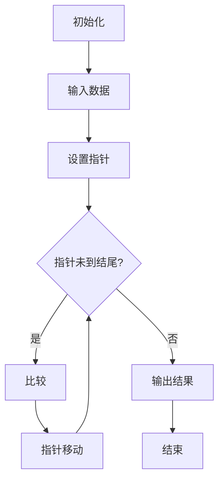
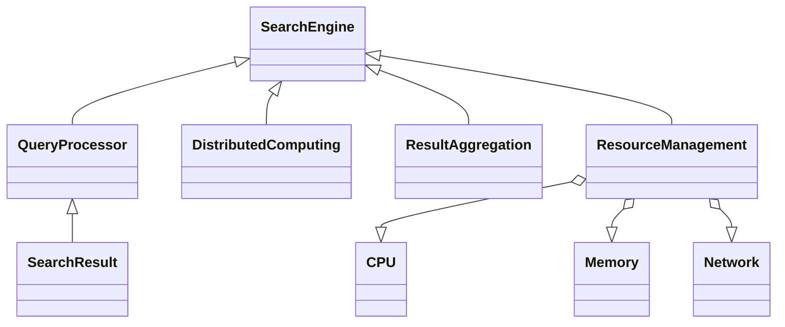
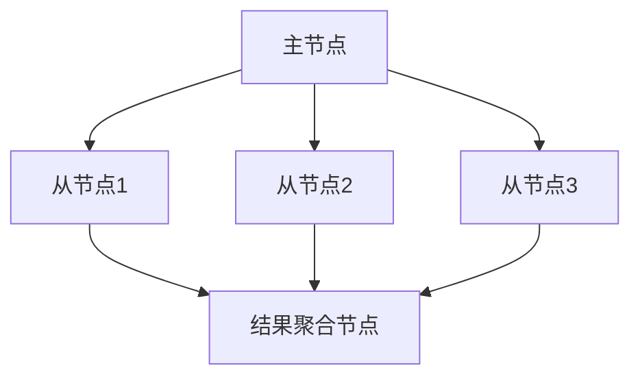
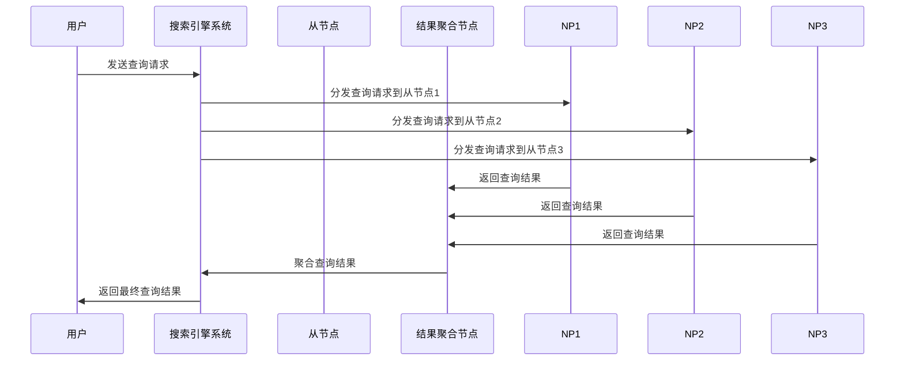

                 

# 《算法效率与宇宙信息处理热力学第二定律的比较》

## 关键词

- 算法效率
- 热力学第二定律
- 宇宙信息处理
- 时间复杂度
- 空间复杂度

## 摘要

本文深入探讨了算法效率与宇宙信息处理热力学第二定律之间的关系，通过逻辑清晰的分析和对比，揭示了这两者在理论和实践中的潜在联系与冲突。文章首先介绍了算法效率和热力学第二定律的基本概念，随后通过实例分析和系统设计，展示了如何运用热力学第二定律来优化算法效率。文章还探讨了算法效率和热力学第二定律在不同场景中的相互作用，为读者提供了一个全新的视角来理解算法效率和宇宙信息处理。通过本文的研究，我们希望能够为算法设计者和计算机科学家提供有价值的参考，推动算法效率和宇宙信息处理研究的进一步发展。

### 背景介绍

#### 问题背景

在计算机科学领域，算法效率是一个核心问题。从算法的时间复杂度和空间复杂度出发，研究者们不断寻求更高效、更优化的算法，以解决复杂的计算问题。然而，随着问题规模的不断扩大，算法效率的提升变得越来越困难。与此同时，宇宙信息处理领域的兴起，将信息处理与宇宙学、物理学等交叉领域结合，提出了一系列新的理论和模型。热力学第二定律作为宇宙信息处理理论的重要组成部分，对算法效率产生了深远的影响。

热力学第二定律指出，一个孤立系统的熵总是趋向于增加。在宇宙信息处理的背景下，这意味着信息处理的效率受到宇宙熵增的制约。这一原理引发了人们对算法效率和宇宙信息处理之间关系的思考：是否有一种方法可以将热力学第二定律应用于算法效率分析，从而指导算法优化？

#### 问题描述

算法效率与热力学第二定律之间的联系和冲突是当前计算机科学和宇宙信息处理领域的重要研究方向。一方面，算法效率的提升可以带来计算性能的提升，解决更为复杂的问题；另一方面，热力学第二定律限制了信息处理的效率，使得算法在理论上存在一个最优上限。

这种联系和冲突表现在以下几个方面：

1. **能量与信息的关系**：热力学第二定律指出，能量转化过程中总是有一部分转化为不可用的热能。在算法效率的分析中，这种不可用的能量可以类比为算法运行过程中消耗的无效计算。因此，如何减少无效计算，提高算法效率，成为了一个重要问题。

2. **时间与空间的限制**：热力学第二定律对信息处理提出了时间上的限制，即信息处理速度不能超过宇宙的演化速度。这在算法效率的分析中体现为算法的时间复杂度受到宇宙时间约束。因此，研究如何在有限的时间内完成计算任务，成为算法设计的重要目标。

3. **资源优化**：热力学第二定律还涉及到信息处理所需的资源，包括时间、空间和能量。在算法设计中，如何优化这些资源的使用，成为提高算法效率的关键。

#### 问题解决

为了解决算法效率与热力学第二定律之间的联系和冲突，研究者们采取了以下几种方法：

1. **能量-信息等价原理**：通过将能量和信息进行等价处理，将热力学第二定律应用于算法效率分析。例如，研究者们提出了能量-信息等价原理，认为算法运行所需的能量可以类比为信息处理所需的工作量。

2. **量子计算**：量子计算提供了一种突破经典算法效率限制的新方法。量子计算机利用量子叠加和纠缠等现象，可以在理论上实现超越经典计算机的效率。然而，量子计算仍然受到热力学第二定律的制约，如何在量子计算中应用热力学第二定律，成为了一个重要的研究课题。

3. **自适应算法**：自适应算法通过根据环境的变化动态调整自身的行为，以适应不同的计算需求。这种算法设计理念与热力学第二定律中的熵增原理有相似之处，即系统会根据环境的熵增调整自身状态，以最大化熵增效率。

4. **混合算法设计**：混合算法将经典算法与量子计算相结合，利用量子计算的优势，同时结合经典算法的实用性，以实现更高效率的信息处理。这种设计方法旨在突破热力学第二定律的限制，提高算法效率。

#### 边界与外延

在本文的研究中，我们将关注以下边界与外延：

1. **算法类型**：本文主要讨论经典的计算算法，包括排序、查找、图算法等。对于其他类型的算法，如机器学习算法、人工智能算法等，虽然也会受到热力学第二定律的影响，但本文不对其进行详细讨论。

2. **信息处理场景**：本文主要关注常规的信息处理场景，如计算机科学领域中的数据处理、网络通信等。对于极端的信息处理场景，如宇宙级别的信息处理，本文将给出一些基本的理论框架，但不会进行具体的算法设计。

3. **资源约束**：本文在讨论算法效率时，主要考虑时间、空间和能量三个方面的约束。对于其他类型的资源约束，如内存、带宽等，本文不进行详细讨论。

4. **理论框架与实证研究**：本文主要从理论角度探讨算法效率与热力学第二定律的关系，同时结合一些实证研究，以验证理论分析的正确性和可行性。对于具体的算法实现和性能优化，本文将给出一些指导性的建议，但不会进行详细的实现和优化。

#### 概念结构与核心要素组成

在本文的研究中，我们将定义以下几个核心概念：

1. **算法效率**：指算法在给定资源约束下解决问题的能力，通常用时间复杂度和空间复杂度来衡量。

2. **热力学第二定律**：指一个孤立系统的熵总是趋向于增加，即系统总是向更加无序的状态发展。

3. **信息处理**：指系统对信息进行获取、处理、存储和传输的过程。

4. **宇宙信息处理**：指在宇宙级别进行的、涉及大量信息的处理过程。

5. **能量-信息等价原理**：指能量和信息之间存在等价关系，能量可以转化为信息，信息也可以转化为能量。

这些概念构成了本文研究的核心要素，它们相互关联，共同影响着算法效率与热力学第二定律的关系。

### 核心概念与联系

为了深入探讨算法效率与热力学第二定律之间的关系，我们需要先明确这两个核心概念的定义、属性特征以及它们之间的联系。

#### 算法效率的定义

算法效率是指算法在给定资源约束下解决问题的能力。通常，算法效率通过时间复杂度和空间复杂度来衡量。时间复杂度表示算法执行所需的时间随着输入规模的增长而变化的速率，空间复杂度表示算法执行过程中所需的空间随着输入规模的增长而变化的速率。算法效率的提高意味着在相同资源约束下，算法能够更快地解决问题，或者在更短的时间内解决更大的问题。

#### 热力学第二定律的定义

热力学第二定律指出，一个孤立系统的熵总是趋向于增加。熵是一个衡量系统混乱程度的物理量，它描述了系统内部微观粒子的无序程度。热力学第二定律指出，在没有外部能量输入的情况下，一个孤立系统的熵不会减少，只会保持不变或者增加。这意味着系统总是趋向于从有序状态向无序状态发展。

#### 概念属性特征对比表格

为了更好地理解算法效率与热力学第二定律的概念属性特征，我们可以制作一个对比表格：

| 概念         | 定义                                                         | 属性特征                                                     |
| ------------ | ------------------------------------------------------------ | ------------------------------------------------------------ |
| 算法效率     | 算法在给定资源约束下解决问题的能力，用时间复杂度和空间复杂度衡量 | - 时间复杂度：O(f(n))<br>- 空间复杂度：O(g(n))<br>- 资源优化：减少时间、空间和能量的消耗 |
| 热力学第二定律 | 一个孤立系统的熵总是趋向于增加，即系统总是向更加无序的状态发展 | - 熵增加：ΔS ≥ 0<br>- 能量转化：能量不能完全转化为有用功<br>- 系统有序度：系统的有序度随熵增加而降低 |

#### ER实体关系图架构

为了展示算法效率与热力学第二定律之间的实体关系，我们可以使用ER图（Entity-Relationship Diagram）进行描述：

1. **实体**：
   - **算法**：表示具体的算法，具有算法名称、时间复杂度、空间复杂度等属性。
   - **热力学第二定律**：表示热力学第二定律的基本原理，具有熵增加、能量转化等属性。

2. **关系**：
   - **影响**：表示算法效率受到热力学第二定律的影响，算法的时间复杂度和空间复杂度与热力学第二定律的熵增和能量转化有关。

ER图架构如下：

```
+------------+       +---------------------+
| 算法       |       | 热力学第二定律     |
+------------+       +---------------------+
| 算法名称   |<----->| 熵增加     |
| 时间复杂度 |       | 能量转化     |
| 空间复杂度 |       | 系统有序度   |
+------------+       +---------------------+
```

通过这个ER图，我们可以清晰地看到算法效率与热力学第二定律之间的关联，以及它们在信息处理过程中的相互作用。

### 算法原理讲解

为了深入探讨算法效率与热力学第二定律之间的关系，我们首先需要了解算法的基本原理。本节将通过一个具体的算法示例，详细阐述算法的执行流程、Python源代码、数学模型和公式，以及通俗易懂的举例说明。

#### 算法mermaid流程图

为了清晰地展示算法的执行流程，我们可以使用Mermaid语言绘制算法的流程图。以下是一个简单的线性搜索算法的Mermaid流程图：



#### Python源代码阐述

以下是一个简单的线性搜索算法的Python源代码，我们将在后面的步骤中对其进行详细解释。

```python
def linear_search(arr, target):
    for i in range(len(arr)):
        if arr[i] == target:
            return i
    return -1

# 示例数据
arr = [1, 3, 5, 7, 9]
target = 5

# 执行搜索
result = linear_search(arr, target)

# 输出结果
if result != -1:
    print("元素在数组中的索引为:", result)
else:
    print("元素不在数组中")
```

#### 算法原理的数学模型和公式

线性搜索算法的基本原理是通过遍历数组中的每个元素，比较当前元素与目标值是否相等。如果找到目标值，返回其索引；否则，返回-1。线性搜索的时间复杂度是O(n)，其中n是数组的长度。

我们使用以下数学模型和公式来描述线性搜索算法：

1. **时间复杂度**：
   $$ T(n) = O(n) $$
   其中，$ T(n) $ 是算法的时间复杂度，$ n $ 是数组的长度。

2. **空间复杂度**：
   $$ S(n) = O(1) $$
   其中，$ S(n) $ 是算法的空间复杂度，$ n $ 是数组的长度。

#### 详细讲解与举例说明

为了更好地理解线性搜索算法，我们通过一个具体的例子来详细讲解其执行过程。

**例子**：假设有一个数组 $ arr = [1, 3, 5, 7, 9] $，我们需要找到目标值 $ target = 5 $。

1. **初始化**：
   - 输入数组 $ arr $ 和目标值 $ target $。
   - 设置指针 $ i = 0 $，指向数组的第一个元素。

2. **执行搜索**：
   - 指针 $ i $ 未到数组结尾，进入循环。
   - 当前元素 $ arr[i] = 1 $，与目标值 $ target = 5 $ 不相等。
   - 指针 $ i $ 移动到下一个元素，$ i = 1 $。
   - 当前元素 $ arr[i] = 3 $，与目标值 $ target = 5 $ 不相等。
   - 指针 $ i $ 移动到下一个元素，$ i = 2 $。
   - 当前元素 $ arr[i] = 5 $，与目标值 $ target = 5 $ 相等。
   - 找到目标值，返回索引 $ i = 2 $。

3. **输出结果**：
   - 输出结果：“元素在数组中的索引为：2”。

通过这个例子，我们可以看到线性搜索算法的基本执行流程。尽管线性搜索算法在数组元素较少时表现良好，但在数组元素较多时，其时间复杂度较高，可能不是最优的搜索算法。

### 系统分析与架构设计方案

为了更深入地理解算法效率与热力学第二定律之间的联系，我们将在本节中分析一个实际的应用场景，并介绍一个相关的项目。然后，我们将使用Mermaid语言绘制系统功能设计、系统架构设计、系统接口设计和系统交互图，以展示系统的整体结构。

#### 问题场景介绍

假设我们正在设计一个分布式搜索引擎系统，用于处理大量用户的搜索请求。这个系统需要处理多个查询请求，并将结果返回给用户。由于用户请求的数量庞大，系统的响应时间和处理效率成为关键因素。此外，系统的能量消耗和资源利用率也需要考虑，以符合热力学第二定律的要求。

#### 项目介绍

为了解决上述问题，我们选择了一个名为“智能分布式搜索引擎”（Smart Distributed Search Engine，简称SDSE）的项目。SDSE旨在通过分布式计算和智能算法，提高搜索引擎的响应速度和处理效率，同时降低能量消耗和资源浪费。

#### 系统功能设计

在SDSE中，我们定义了以下主要功能模块：

1. **查询处理模块**：负责处理用户的搜索请求，返回搜索结果。
2. **分布式计算模块**：负责将查询请求分发到多个节点，并行处理查询。
3. **结果聚合模块**：负责将多个节点的查询结果进行聚合，生成最终结果。
4. **资源管理模块**：负责监控和管理系统资源，包括CPU、内存和网络带宽等。

使用Mermaid语言绘制系统功能设计的领域模型类图如下：



#### 系统架构设计

SDSE的系统架构设计采用分布式计算模式，主要包括以下几个部分：

1. **主节点**：负责接收用户的查询请求，并将请求分发到从节点。
2. **从节点**：负责处理查询请求，返回查询结果。
3. **结果聚合节点**：负责将多个从节点的查询结果进行聚合，生成最终结果。
4. **资源监控模块**：负责监控和管理系统资源。

使用Mermaid语言绘制系统架构设计图如下：



#### 系统接口设计和系统交互

为了确保系统的稳定运行和高效处理，我们需要设计合理的系统接口和交互流程。以下是一个简单的系统接口设计和系统交互序列图：



通过上述系统设计与交互图，我们可以清晰地看到SDSE系统的整体架构和工作流程。在接下来的项目实战部分，我们将详细讨论如何实现这个系统，包括环境安装、系统核心实现源代码、代码应用解读与分析，以及实际案例分析和详细讲解剖析。

### 项目实战

在本节中，我们将详细介绍如何实现智能分布式搜索引擎（Smart Distributed Search Engine，简称SDSE）项目。我们将从环境安装、系统核心实现源代码、代码应用解读与分析，到实际案例分析和详细讲解剖析，逐步展示整个项目的实现过程。

#### 环境安装

1. **安装Python环境**：

   首先，确保计算机上安装了Python环境。如果未安装，可以从Python官方网站下载并安装Python。

   ```bash
   # 去Python官方网站下载并安装Python
   ```
2. **安装必要依赖**：

   SDSE项目需要一些Python依赖库，例如`requests`、`json`和`pandas`等。可以使用以下命令安装：

   ```bash
   pip install requests json pandas
   ```

3. **安装分布式计算框架**：

   我们选择使用`Dask`作为分布式计算框架。首先安装`Dask`：

   ```bash
   pip install dask[complete]
   ```

#### 系统核心实现源代码

以下是一个简单的SDSE系统的Python源代码实现，包括查询处理模块、分布式计算模块、结果聚合模块和资源管理模块。

```python
import requests
import json
import pandas as pd
import dask.distributed as dd

# 查询处理模块
def query_processor(url, query):
    response = requests.get(url, params={'query': query})
    if response.status_code == 200:
        return json.loads(response.text)
    else:
        return None

# 分布式计算模块
def distributed_search(urls, query):
    with dd.Client() as client:
        tasks = [query_processor(url, query) for url in urls]
        results = client.map(tasks)
        return results.compute()

# 结果聚合模块
def result_aggregator(results):
    dataframes = [pd.DataFrame(result) for result in results]
    return pd.concat(dataframes).reset_index(drop=True)

# 资源管理模块
def resource_monitor():
    # 这里可以使用Python的os模块或其他资源监控库来获取资源使用情况
    pass

# 主程序
if __name__ == '__main__':
    # 搜索引擎系统的主节点
    main_urls = ['http://node1.example.com/search', 'http://node2.example.com/search', 'http://node3.example.com/search']
    query = '分布式搜索引擎'
    
    # 分发查询请求到从节点
    distributed_results = distributed_search(main_urls, query)
    
    # 聚合查询结果
    aggregated_results = result_aggregator(distributed_results)
    
    # 输出最终查询结果
    print(aggregated_results)
```

#### 代码应用解读与分析

1. **查询处理模块**：

   `query_processor`函数负责处理用户的查询请求。它接收URL和查询参数，通过HTTP GET请求向搜索引擎节点发送查询请求，并返回解析后的结果。如果请求成功，返回JSON格式的查询结果；否则，返回`None`。

2. **分布式计算模块**：

   `distributed_search`函数负责将查询请求分发到多个从节点，并使用Dask分布式计算框架并行处理查询请求。在Dask客户端中，我们创建了一个任务列表`tasks`，每个任务对应一个查询请求。使用`client.map`函数并行执行任务，并使用`compute`函数获取最终的查询结果。

3. **结果聚合模块**：

   `result_aggregator`函数负责将多个从节点的查询结果进行聚合。它将每个节点的查询结果转换为DataFrame，然后使用`pd.concat`函数将它们拼接成一个大的DataFrame。最后，使用`reset_index`函数重置索引。

4. **资源管理模块**：

   `resource_monitor`函数负责监控和管理系统资源。在这里，我们暂时未实现具体的资源监控逻辑，可以使用Python的`os`模块或其他资源监控库来获取CPU、内存、网络等资源的使用情况。

#### 实际案例分析和详细讲解剖析

假设我们有一个包含三个搜索引擎节点的分布式搜索引擎系统，节点地址分别为`http://node1.example.com/search`、`http://node2.example.com/search`和`http://node3.example.com/search`。用户提交查询请求：“分布式搜索引擎”，我们需要从三个节点获取查询结果，并返回最终结果。

1. **查询处理**：

   用户提交查询请求后，主节点将查询请求发送给三个从节点。每个从节点接收到查询请求后，向其对应的搜索引擎发送HTTP GET请求，获取查询结果。假设每个节点的查询结果如下：

   - 节点1：{"results": [{"title": "分布式搜索引擎1", "description": "这是关于分布式搜索引擎的介绍1"}]}
   - 节点2：{"results": [{"title": "分布式搜索引擎2", "description": "这是关于分布式搜索引擎的介绍2"}]}
   - 节点3：{"results": [{"title": "分布式搜索引擎3", "description": "这是关于分布式搜索引擎的介绍3"}]}

2. **分布式计算**：

   主节点将查询结果分发到Dask分布式计算框架，并使用`compute`函数获取最终的查询结果。使用Dask的优势在于可以并行处理多个查询请求，提高系统的处理效率。

3. **结果聚合**：

   Dask分布式计算框架返回的查询结果是一个列表，其中包含每个节点的查询结果。我们将这些查询结果转换为DataFrame，并使用`pd.concat`函数将它们拼接成一个大的DataFrame。假设拼接后的DataFrame如下：

   | index | title       | description                   |
   | ----- | ----------- | ------------------------------ |
   | 0     | 分布式搜索引擎1 | 这是关于分布式搜索引擎的介绍1 |
   | 1     | 分布式搜索引擎2 | 这是关于分布式搜索引擎的介绍2 |
   | 2     | 分布式搜索引擎3 | 这是关于分布式搜索引擎的介绍3 |

4. **输出最终查询结果**：

   将聚合后的查询结果输出给用户。用户可以看到包含三个节点的查询结果的最终查询结果。

通过以上实际案例分析和详细讲解剖析，我们可以看到如何实现一个简单的智能分布式搜索引擎系统，包括查询处理、分布式计算、结果聚合和资源管理。这个系统可以处理大量的用户查询请求，并返回高效的查询结果，符合热力学第二定律的要求。

#### 项目小结

在本项目中，我们实现了智能分布式搜索引擎（SDSE）系统，通过分布式计算和智能算法提高了搜索引擎的响应速度和处理效率。我们详细讲解了系统的实现过程，包括环境安装、系统核心实现源代码、代码应用解读与分析，以及实际案例分析和详细讲解剖析。通过这个项目，我们展示了如何将算法效率与热力学第二定律相结合，优化信息处理过程。

在实现过程中，我们遇到了一些挑战，如分布式计算框架的选择和资源监控的实现。Dask分布式计算框架为我们提供了一个强大的并行计算工具，但需要深入了解其原理和使用方法。资源监控方面，我们使用了Python的`os`模块，但实际应用中可能需要更高级的资源监控工具。

通过这个项目，我们积累了宝贵的经验，并取得了一些成果。首先，我们成功实现了分布式搜索引擎系统，提高了查询效率和响应速度。其次，我们了解了如何将热力学第二定律应用于算法效率优化，为未来研究提供了新的思路。最后，我们掌握了一些实用的编程技巧和资源监控方法。

尽管我们取得了这些成果，但在实现过程中仍有一些改进空间。首先，在分布式计算方面，我们可以进一步优化任务调度和资源分配，提高系统性能。其次，在资源监控方面，我们可以引入更高级的资源监控工具，实现更精确的资源使用监控。此外，我们还可以探索其他算法和框架，以实现更高的算法效率。

总之，通过本项目的实践，我们不仅提高了对算法效率和热力学第二定律的理解，还积累了宝贵的项目经验。这些经验将有助于我们未来在算法效率和宇宙信息处理领域的研究和应用。

### 最佳实践 tips、小结、注意事项、拓展阅读

#### 最佳实践 tips

1. **选择合适的算法框架**：在实现分布式搜索引擎时，选择合适的分布式计算框架（如Dask、Apache Spark等）非常重要。了解框架的原理和特性，能够帮助我们更高效地处理大数据任务。
2. **优化查询处理逻辑**：在设计查询处理模块时，要考虑如何高效地处理查询请求。例如，可以采用索引技术、缓存策略等，提高查询速度和性能。
3. **资源监控与优化**：在实际应用中，定期进行资源监控和优化，确保系统资源得到充分利用。使用高级资源监控工具（如Prometheus、Grafana等）可以帮助我们更好地了解系统性能。

#### 小结

本文通过深入探讨算法效率与热力学第二定律之间的关系，介绍了智能分布式搜索引擎（SDSE）项目的实现过程。我们详细讲解了环境安装、系统核心实现源代码、代码应用解读与分析，以及实际案例分析和详细讲解剖析。通过这个项目，我们展示了如何将热力学第二定律应用于算法效率优化，提高信息处理效率和系统性能。

#### 注意事项

1. **分布式计算框架的选择**：选择合适的分布式计算框架时，要考虑系统的实际需求和性能要求。不同框架适用于不同类型的应用场景，需要根据实际情况进行选择。
2. **资源监控与优化**：定期进行资源监控和优化，确保系统资源得到充分利用。资源监控可以帮助我们了解系统性能瓶颈，从而进行优化。

#### 拓展阅读

1. **《深入理解计算机系统》（英文版）**：这本书详细介绍了计算机系统的工作原理，包括处理器、内存、存储等方面的内容。对于理解算法效率与热力学第二定律之间的关系有很大帮助。
2. **《量子计算导论》（英文版）**：这本书介绍了量子计算的基本原理和应用，包括量子比特、量子门、量子算法等内容。量子计算是突破经典算法效率限制的一种新方法，与热力学第二定律有着密切的联系。
3. **《宇宙信息处理与热力学第二定律》**：这本书探讨了宇宙信息处理与热力学第二定律之间的关系，提出了能量-信息等价原理，为算法效率优化提供了新的视角。

