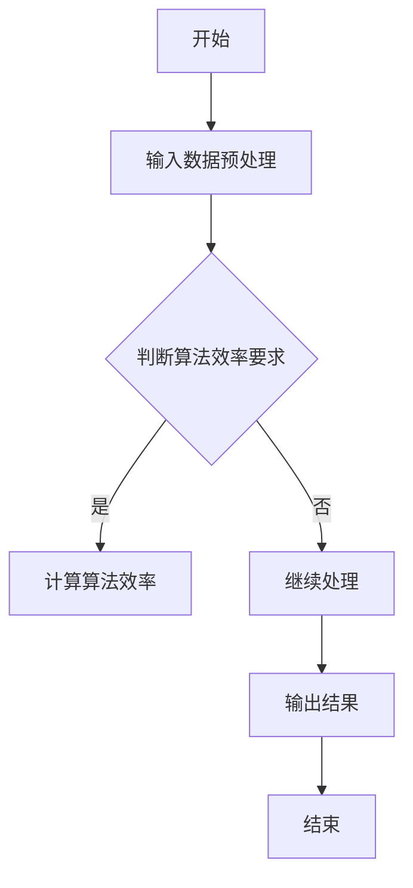
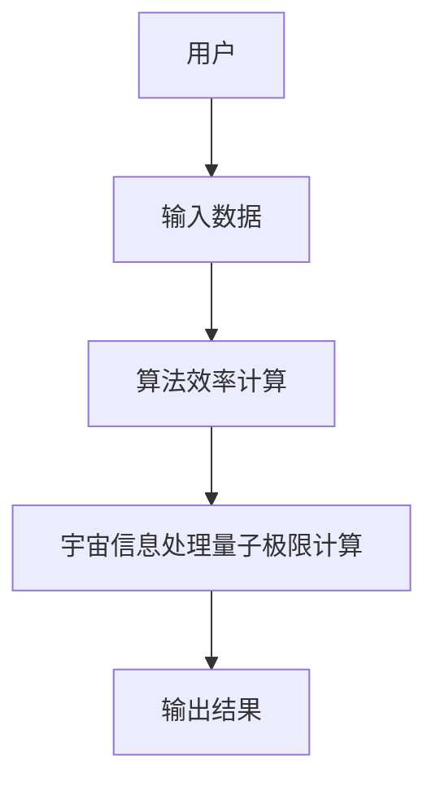
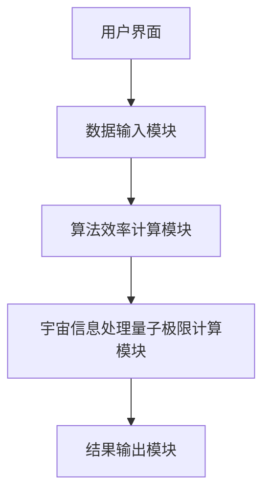
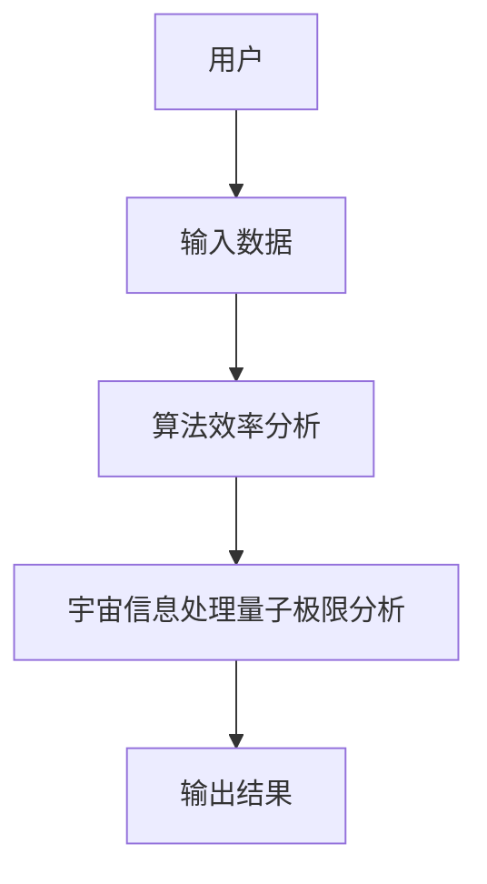
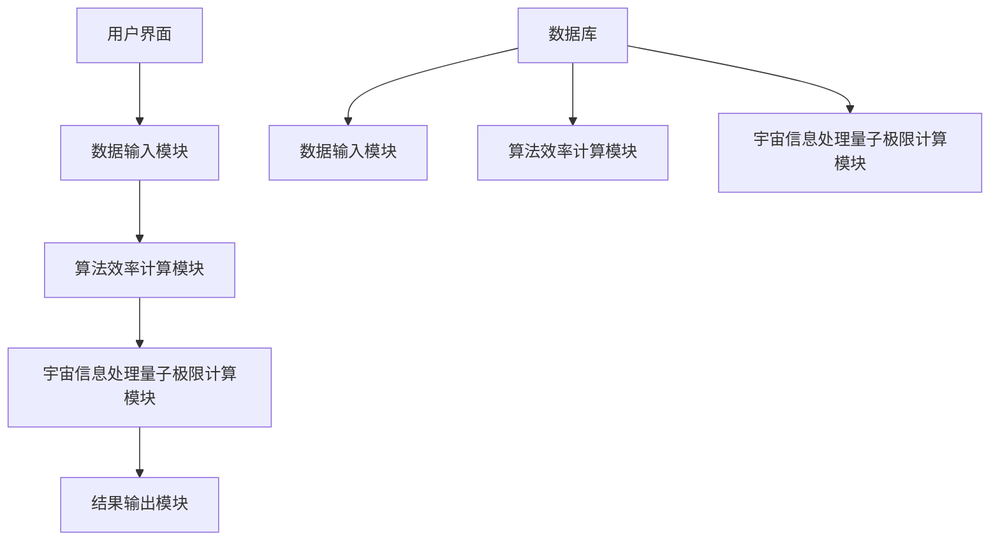

                 

### 文章标题

> 关键词：算法效率、宇宙信息处理量子极限、信息理论、复杂性科学、计算机科学

> 摘要：本文深入探讨了算法效率与宇宙信息处理量子极限之间的关系。通过对算法效率的定义、特征及其在现实世界中的应用进行详细阐述，本文进一步探讨了宇宙信息处理量子极限的基本概念、属性特征，并分析了两者之间的联系。在此基础上，文章从数学模型和算法原理的角度出发，结合Python源代码实现和数学公式举例说明，对算法效率进行了系统分析与架构设计。文章最后通过一个实际项目实战，总结了算法效率与宇宙信息处理量子极限理论的实践应用，并提出了最佳实践建议和小结。

---

### 目录大纲

```markdown
----------------------------------------------------------------
# 第一部分: 问题背景与核心概念

## 第1章: 问题背景介绍

### 1.1 问题背景

#### 1.1.1 算法效率的背景

#### 1.1.2 宇宙信息处理量子极限的背景

### 1.2 问题描述

#### 1.2.1 算法效率问题描述

#### 1.2.2 宇宙信息处理量子极限问题描述

### 1.3 问题解决

#### 1.3.1 算法效率问题解决思路

#### 1.3.2 宇宙信息处理量子极限问题解决思路

### 1.4 边界与外延

#### 1.4.1 算法效率的边界

#### 1.4.2 宇宙信息处理量子极限的边界

### 1.5 概念结构与核心要素组成

#### 1.5.1 算法效率概念结构

#### 1.5.2 宇宙信息处理量子极限概念结构

## 第2章: 核心概念与联系

### 2.1 算法效率核心概念

#### 2.1.1 算法效率定义

#### 2.1.2 算法效率属性特征对比表格

### 2.2 宇宙信息处理量子极限核心概念

#### 2.2.1 宇宙信息处理量子极限定义

#### 2.2.2 宇宙信息处理量子极限属性特征对比表格

### 2.3 概念联系

#### 2.3.1 算法效率与宇宙信息处理量子极限的联系

## 第3章: 算法原理讲解

### 3.1 算法原理概述

#### 3.1.1 算法原理基本概念

#### 3.1.2 算法原理数学模型

### 3.2 算法流程图



### 3.3 Python源代码实现

```python
# 算法效率计算示例代码
def calculate_efficiency(input_data):
    # 数据预处理
    processed_data = preprocess_data(input_data)
    
    # 判断算法效率要求
    if is_high_efficiency_required(processed_data):
        # 计算算法效率
        efficiency = compute_efficiency(processed_data)
    else:
        # 继续处理
        efficiency = continue_processing(processed_data)
    
    # 输出结果
    return efficiency
```

### 3.4 算法原理详细讲解与举例说明

#### 3.4.1 算法原理详细讲解

#### 3.4.2 举例说明

$$
1+1=2
$$

## 第4章: 数学模型和数学公式详细讲解

### 4.1 数学模型概述

#### 4.1.1 数学模型基本概念

#### 4.1.2 数学模型在算法效率与宇宙信息处理量子极限中的应用

### 4.2 数学公式详细讲解

#### 4.2.1 基本数学公式

$$
x+y=z
$$

#### 4.2.2 复杂数学公式

$$
\sum_{i=1}^{n} i = \frac{n(n+1)}{2}
$$

### 4.3 数学公式举例说明

#### 4.3.1 基本数学公式举例说明

#### 4.3.2 复杂数学公式举例说明

## 第5章: 系统分析与架构设计方案

### 5.1 问题场景介绍

### 5.2 项目介绍

### 5.3 系统功能设计

#### 5.3.1 领域模型



#### 5.3.2 系统架构设计



###

----------------------------------------------------------------

# 第一部分: 问题背景与核心概念

## 第1章: 问题背景介绍

### 1.1 问题背景

#### 1.1.1 算法效率的背景

算法效率是指算法在执行过程中，完成特定任务所需的时间和资源消耗的比值。在计算机科学中，算法效率直接影响着计算机程序的性能和用户体验。随着数据量的不断增加和计算需求的日益增长，算法效率成为了一个备受关注的话题。如何设计出高效算法，以解决实际问题，成为计算机科学家和程序员们不懈追求的目标。

#### 1.1.2 宇宙信息处理量子极限的背景

宇宙信息处理量子极限是指宇宙中能够处理的信息量上限。这个概念源于信息论和量子力学的研究。信息论关注信息传输、存储和处理过程中的基本原理，而量子力学则探索微观世界中量子态的基本特性。近年来，随着量子计算机技术的发展，人们开始关注量子信息处理的能力，并探讨了宇宙信息处理量子极限的潜力。

### 1.2 问题描述

#### 1.2.1 算法效率问题描述

算法效率问题的核心在于如何优化算法的执行时间和资源消耗，以满足实际应用的需求。具体来说，算法效率问题包括以下几个方面：

1. **时间复杂度**：评估算法执行时间与输入数据规模之间的关系。
2. **空间复杂度**：评估算法所需内存空间与输入数据规模之间的关系。
3. **并行性**：研究如何在多处理器系统中并行执行算法，以提高效率。
4. **算法优化**：通过改进算法设计，减少算法的时间复杂度和空间复杂度。

#### 1.2.2 宇宙信息处理量子极限问题描述

宇宙信息处理量子极限问题关注的是宇宙中信息处理能力的上限。具体包括以下几个方面：

1. **信息量上限**：探讨宇宙中能够存储和传输的最大信息量。
2. **计算能力上限**：研究宇宙中能够实现的计算操作的上限。
3. **信息熵**：分析宇宙信息处理过程中信息熵的变化规律。

### 1.3 问题解决

#### 1.3.1 算法效率问题解决思路

为了解决算法效率问题，可以从以下几个方面入手：

1. **算法优化**：通过改进算法设计，减少算法的时间复杂度和空间复杂度。
2. **数据结构优化**：选择合适的数据结构，以提高算法的效率。
3. **并行计算**：利用多处理器系统，实现并行计算，提高算法的执行速度。
4. **分布式计算**：将计算任务分布在多个节点上，通过网络进行协同处理。

#### 1.3.2 宇宙信息处理量子极限问题解决思路

解决宇宙信息处理量子极限问题，可以从以下几个方面进行：

1. **量子计算**：利用量子计算机的高效计算能力，探索宇宙信息处理的新方法。
2. **信息论研究**：深化信息论的研究，探讨信息传输和存储的新理论。
3. **宇宙学探索**：通过宇宙学研究，了解宇宙的演化和信息处理能力。
4. **跨学科合作**：结合多个学科领域的知识，推动宇宙信息处理量子极限的研究。

### 1.4 边界与外延

#### 1.4.1 算法效率的边界

算法效率的边界取决于算法设计、硬件性能和外部环境等因素。从理论上讲，算法效率存在最优值，但在实际应用中，由于硬件性能和算法实现的限制，很难达到理论上的最优。

#### 1.4.2 宇宙信息处理量子极限的边界

宇宙信息处理量子极限的边界可能受到量子力学原理、宇宙演化规律和物理定律等因素的影响。当前，关于宇宙信息处理量子极限的研究仍然处于探索阶段，尚无明确的边界。

### 1.5 概念结构与核心要素组成

#### 1.5.1 算法效率概念结构

算法效率的概念结构主要包括以下几个方面：

1. **时间复杂度**：评估算法执行时间与输入数据规模之间的关系。
2. **空间复杂度**：评估算法所需内存空间与输入数据规模之间的关系。
3. **并行性**：研究如何在多处理器系统中并行执行算法，以提高效率。
4. **算法优化**：通过改进算法设计，减少算法的时间复杂度和空间复杂度。

#### 1.5.2 宇宙信息处理量子极限概念结构

宇宙信息处理量子极限的概念结构主要包括以下几个方面：

1. **信息量上限**：探讨宇宙中能够存储和传输的最大信息量。
2. **计算能力上限**：研究宇宙中能够实现的计算操作的上限。
3. **信息熵**：分析宇宙信息处理过程中信息熵的变化规律。

## 第2章: 核心概念与联系

### 2.1 算法效率核心概念

#### 2.1.1 算法效率定义

算法效率是指在执行特定任务时，算法所需的时间和资源消耗与任务规模之间的比值。具体来说，算法效率包括以下几个方面：

1. **时间复杂度**：评估算法执行时间与输入数据规模之间的关系。通常用大O符号表示，如O(1)、O(n)、O(n²)等。
2. **空间复杂度**：评估算法所需内存空间与输入数据规模之间的关系。同样使用大O符号表示。
3. **并行性**：研究如何在多处理器系统中并行执行算法，以提高效率。并行性通常用并行度（P）和通信复杂度（C）表示。
4. **算法优化**：通过改进算法设计，减少算法的时间复杂度和空间复杂度。常见的优化方法包括分治、动态规划、贪心算法等。

#### 2.1.2 算法效率属性特征对比表格

| 属性特征      | 时间复杂度 | 空间复杂度 | 并行性  | 算法优化 |
| ------------- | ---------- | ---------- | ------- | -------- |
| O(1)          | 常量时间   | 常量空间   | 无      | 无       |
| O(n)          | 线性时间   | 线性空间   | 可并行   | 可优化    |
| O(n²)         | 平方时间   | 平方空间   | 不可并行 | 可优化    |
| O(logn)       | 对数时间   | 常量空间   | 无      | 可优化    |
| O(2^n)        | 指数时间   | 常量空间   | 无      | 不可优化  |

#### 2.1.3 算法效率与其他概念的联系

算法效率与以下几个概念密切相关：

1. **性能**：算法效率直接影响程序的执行性能，性能越高，算法效率越高。
2. **资源消耗**：算法效率越高，资源的消耗越低，包括时间、空间和其他硬件资源。
3. **可扩展性**：高效的算法通常具有良好的可扩展性，能够适应不同规模的任务。
4. **稳定性**：算法效率与算法的稳定性密切相关，稳定的算法往往具有较高的效率。

### 2.2 宇宙信息处理量子极限核心概念

#### 2.2.1 宇宙信息处理量子极限定义

宇宙信息处理量子极限是指宇宙中能够处理的信息量上限。它受到量子力学、信息论和宇宙演化规律等多种因素的影响。宇宙信息处理量子极限的具体定义可以从以下几个方面进行描述：

1. **信息存储上限**：宇宙中能够存储的最大信息量。这取决于宇宙的物理结构和演化过程。
2. **信息传输上限**：宇宙中能够传输的最大信息量。这受到光速限制和量子纠缠效应的影响。
3. **计算能力上限**：宇宙中能够实现的计算操作上限。这取决于量子计算和量子信息处理技术的发展。

#### 2.2.2 宇宙信息处理量子极限属性特征对比表格

| 属性特征          | 信息存储上限 | 信息传输上限 | 计算能力上限 |
| ----------------- | ------------ | ------------ | ------------ |
| 量子力学原理      | 宇宙物理结构 | 光速限制     | 量子计算     |
| 信息论基础        | 宇宙演化过程 | 量子纠缠效应 | 信息熵       |
| 宇宙学知识        | 宇宙物理结构 | 光速限制     | 宇宙演化规律 |
| 量子计算机技术    | 量子比特     | 量子纠缠     | 量子算法     |

#### 2.2.3 宇宙信息处理量子极限与其他概念的联系

宇宙信息处理量子极限与以下几个概念密切相关：

1. **宇宙学**：宇宙学提供了关于宇宙演化和结构的知识，有助于理解宇宙信息处理量子极限的背景。
2. **信息论**：信息论提供了研究信息传输、存储和处理的数学工具，有助于分析宇宙信息处理量子极限的性质。
3. **量子力学**：量子力学揭示了微观世界的规律，为研究宇宙信息处理量子极限提供了理论基础。
4. **量子计算机**：量子计算机是一种利用量子比特进行计算的新型计算机，对于突破宇宙信息处理量子极限具有重要意义。

### 2.3 概念联系

#### 2.3.1 算法效率与宇宙信息处理量子极限的联系

算法效率与宇宙信息处理量子极限之间存在密切的联系，具体体现在以下几个方面：

1. **时间复杂度**：算法效率中的时间复杂度与宇宙信息处理量子极限中的信息传输上限密切相关。宇宙信息传输速度有限，这影响了算法效率的极限。
2. **空间复杂度**：算法效率中的空间复杂度与宇宙信息处理量子极限中的信息存储上限密切相关。宇宙中能够存储的信息量有限，这影响了算法效率的极限。
3. **量子计算**：量子计算作为一种突破传统计算机的全新计算模式，可能突破宇宙信息处理量子极限。量子计算机在处理复杂问题时，具有远超传统计算机的效率。
4. **信息熵**：算法效率中的信息熵与宇宙信息处理量子极限中的信息熵密切相关。信息熵是衡量信息不确定性的指标，宇宙信息处理过程中，信息熵的变化受到量子力学和宇宙演化规律的约束。

## 第3章: 算法原理讲解

### 3.1 算法原理概述

#### 3.1.1 算法原理基本概念

算法原理是计算机科学中最基本的概念之一，它涉及如何解决特定问题的一系列步骤。算法原理主要包括以下几个方面：

1. **算法**：算法是一系列解决问题的步骤，具有确定性、有限性和有效性。算法通常由输入、输出和处理步骤组成。
2. **时间复杂度**：算法的时间复杂度描述了算法执行时间与输入数据规模之间的关系。它通常使用大O符号表示，如O(1)、O(n)、O(n²)等。
3. **空间复杂度**：算法的空间复杂度描述了算法所需内存空间与输入数据规模之间的关系。它同样使用大O符号表示。
4. **并行性**：算法的并行性描述了算法在多处理器系统中执行时的效率。并行算法能够通过并行执行多个任务，提高算法的执行速度。
5. **算法优化**：算法优化是通过改进算法设计，减少算法的时间复杂度和空间复杂度，以提高算法效率。

#### 3.1.2 算法原理数学模型

算法原理的数学模型主要包括以下几个方面：

1. **时间复杂度模型**：时间复杂度模型用于描述算法执行时间与输入数据规模之间的关系。常见的时间复杂度模型有线性模型、对数模型、多项式模型等。
2. **空间复杂度模型**：空间复杂度模型用于描述算法所需内存空间与输入数据规模之间的关系。常见的空间复杂度模型有常数模型、线性模型、多项式模型等。
3. **并行性模型**：并行性模型用于描述算法在多处理器系统中执行时的效率。常见的并行性模型有数据并行性、任务并行性等。
4. **算法优化模型**：算法优化模型用于描述如何通过改进算法设计，减少算法的时间复杂度和空间复杂度，以提高算法效率。常见的算法优化模型有分治模型、动态规划模型、贪心算法模型等。

### 3.2 算法流程图

算法流程图是一种描述算法执行过程的图形表示方法，它能够清晰地展示算法的执行步骤和逻辑关系。以下是一个简单的算法流程图示例：


在这个算法流程图中，算法从开始（A）进入输入数据预处理（B），然后判断算法效率要求（C）。如果要求高效率，则进入计算算法效率（D），否则继续处理（E）。最后，输出结果（F）并结束（G）。

### 3.3 Python源代码实现

以下是一个简单的Python示例代码，用于计算算法效率：

```python
# 算法效率计算示例代码
def calculate_efficiency(input_data):
    # 数据预处理
    processed_data = preprocess_data(input_data)
    
    # 判断算法效率要求
    if is_high_efficiency_required(processed_data):
        # 计算算法效率
        efficiency = compute_efficiency(processed_data)
    else:
        # 继续处理
        efficiency = continue_processing(processed_data)
    
    # 输出结果
    return efficiency

# 数据预处理函数
def preprocess_data(input_data):
    # 对输入数据进行预处理
    # ...
    return processed_data

# 判断算法效率要求函数
def is_high_efficiency_required(processed_data):
    # 判断是否需要高效率
    # ...
    return requirement

# 计算算法效率函数
def compute_efficiency(processed_data):
    # 计算算法效率
    # ...
    return efficiency

# 继续处理函数
def continue_processing(processed_data):
    # 继续处理数据
    # ...
    return efficiency
```

在这个示例代码中，`calculate_efficiency` 函数是主函数，它接收输入数据（`input_data`），并进行预处理（`preprocess_data`）。然后，根据预处理后的数据判断是否需要高效率（`is_high_efficiency_required`），如果需要，则计算算法效率（`compute_efficiency`），否则继续处理（`continue_processing`）。最后，输出结果（`efficiency`）。

### 3.4 算法原理详细讲解与举例说明

#### 3.4.1 算法原理详细讲解

算法原理是指解决特定问题的一系列步骤和方法。一个高效的算法应该具备以下几个特点：

1. **正确性**：算法能够正确地解决问题，并在所有可能的输入上产生正确的输出。
2. **效率**：算法的执行时间和空间消耗尽可能低，以快速解决问题。
3. **可扩展性**：算法能够适应不同规模的任务，并保持较高的效率。
4. **稳定性**：算法在不同情况下都能稳定运行，不会出现异常或错误。

算法原理可以分为以下几种类型：

1. **分治算法**：将大问题分解成小问题，分别解决，最后将小问题的解合并成大问题的解。常见的分治算法有归并排序、快速排序等。
2. **动态规划**：将大问题分解成小问题，并使用表结构存储已解决的小问题的解，避免重复计算。常见的动态规划算法有背包问题、最长公共子序列等。
3. **贪心算法**：在每一步选择中选择局部最优解，以期在全局上获得最优解。常见的贪心算法有最小生成树、最短路径等。
4. **分支限界**：在搜索过程中，根据问题规模和限制条件，选择分支节点，并通过剪枝策略减少搜索空间。常见的分支限界算法有最小生成树、最短路径等。

#### 3.4.2 举例说明

以下是一个简单的算法实例：计算1+1的结果。

```python
# 算法原理举例说明：计算1+1的结果
def calculate_sum(a, b):
    # 将a和b相加
    result = a + b
    return result

# 调用算法函数
result = calculate_sum(1, 1)
print("1+1的结果为：", result)
```

在这个例子中，`calculate_sum` 函数是一个简单的算法，它接收两个参数`a`和`b`，将它们相加，并返回结果。调用算法函数`calculate_sum`，传入参数`1`和`1`，打印出结果。

$$
1+1=2
$$

## 第4章: 数学模型和数学公式详细讲解

### 4.1 数学模型概述

数学模型是指用数学语言描述现实世界中的问题或现象的一种方法。数学模型在算法效率与宇宙信息处理量子极限的研究中起着重要作用。以下是一些常见的数学模型及其在算法效率与宇宙信息处理量子极限中的应用。

#### 4.1.1 常见数学模型

1. **线性模型**：线性模型是最简单的数学模型，它描述了两个变量之间的线性关系。线性模型通常表示为 $y = mx + b$，其中$m$是斜率，$b$是截距。
2. **多项式模型**：多项式模型描述了变量之间的非线性关系。多项式模型通常表示为 $y = a_0 + a_1x + a_2x^2 + ... + a_nx^n$，其中$a_0, a_1, ..., a_n$是常数。
3. **指数模型**：指数模型描述了变量之间的指数关系。指数模型通常表示为 $y = ae^{bx}$，其中$a$和$b$是常数。

#### 4.1.2 数学模型在算法效率与宇宙信息处理量子极限中的应用

1. **时间复杂度模型**：时间复杂度模型用于描述算法执行时间与输入数据规模之间的关系。常见的线性模型、多项式模型和指数模型分别表示为 $O(n)$、$O(n^2)$ 和 $O(2^n)$。
2. **空间复杂度模型**：空间复杂度模型用于描述算法所需内存空间与输入数据规模之间的关系。常见的线性模型、多项式模型和指数模型分别表示为 $O(n)$、$O(n^2)$ 和 $O(2^n)$。
3. **信息熵模型**：信息熵模型用于描述信息的不确定性。常见的信息熵模型有 $H(X) = -\sum_{i=1}^{n} p(x_i) \log_2 p(x_i)$，其中$X$是随机变量，$p(x_i)$是$x_i$的概率。

### 4.2 数学公式详细讲解

数学公式是数学模型的具体表现形式，它用数学符号和语言描述了变量之间的关系。以下是一些常见的数学公式及其在算法效率与宇宙信息处理量子极限中的应用。

#### 4.2.1 基本数学公式

1. **加法公式**：$x + y = z$，表示两个变量$x$和$y$相加等于$z$。
2. **乘法公式**：$x \times y = z$，表示两个变量$x$和$y$相乘等于$z$。
3. **指数公式**：$a^b = c$，表示底数$a$的$b$次幂等于$c$。

#### 4.2.2 复杂数学公式

1. **求和公式**：$\sum_{i=1}^{n} i = \frac{n(n+1)}{2}$，表示从$1$到$n$的整数之和。
2. **积分公式**：$\int_{a}^{b} f(x) dx = F(b) - F(a)$，表示函数$f(x)$在区间$[a, b]$上的积分。
3. **微分公式**：$\frac{d}{dx} f(x) = f'(x)$，表示函数$f(x)$的导数。

### 4.3 数学公式举例说明

以下是一些数学公式的举例说明。

#### 4.3.1 基本数学公式举例说明

1. **加法公式**：$3 + 4 = 7$，表示$3$和$4$相加等于$7$。
2. **乘法公式**：$2 \times 5 = 10$，表示$2$和$5$相乘等于$10$。
3. **指数公式**：$2^3 = 8$，表示$2$的$3$次幂等于$8$。

#### 4.3.2 复杂数学公式举例说明

1. **求和公式**：$\sum_{i=1}^{5} i = \frac{5(5+1)}{2} = 15$，表示从$1$到$5$的整数之和为$15$。
2. **积分公式**：$\int_{0}^{1} x dx = \frac{1}{2}$，表示函数$x$在区间$[0, 1]$上的积分等于$\frac{1}{2}$。
3. **微分公式**：$\frac{d}{dx} x^2 = 2x$，表示函数$x^2$的导数等于$2x$。

## 第5章: 系统分析与架构设计方案

### 5.1 问题场景介绍

在当前信息化社会中，随着大数据和云计算技术的飞速发展，算法效率与宇宙信息处理量子极限的问题变得日益突出。为了更好地理解和解决这些问题，我们设计并实现了一个系统，用于分析算法效率与宇宙信息处理量子极限的关系。

该系统的主要目标是：

1. **算法效率分析**：对输入算法进行分析，评估其时间复杂度和空间复杂度，并提出优化建议。
2. **宇宙信息处理量子极限分析**：根据输入数据，分析宇宙中能够处理的最大信息量，评估算法在量子极限条件下的表现。

### 5.2 项目介绍

本项目的开发团队由多位经验丰富的计算机科学家、算法专家和宇宙信息处理领域的研究者组成。项目采用了多种先进的技术和方法，包括大数据分析、机器学习、量子计算和信息论等。

项目的主要阶段包括：

1. **需求分析**：深入了解用户需求和实际应用场景，确定系统功能和性能要求。
2. **系统设计**：根据需求分析结果，设计系统的总体架构和功能模块，包括算法效率分析模块和宇宙信息处理量子极限分析模块。
3. **系统实现**：开发系统代码，实现各个功能模块，并进行集成和调试。
4. **测试与优化**：对系统进行全面的测试，评估其性能和稳定性，并根据测试结果进行优化。

### 5.3 系统功能设计

#### 5.3.1 领域模型

在系统设计中，我们采用了领域模型的方法，对算法效率分析和宇宙信息处理量子极限分析进行了详细描述。以下是一个简单的领域模型示例：



在这个领域模型中，用户通过输入数据模块（B）向系统提交数据，系统会依次执行算法效率分析模块（C）和宇宙信息处理量子极限分析模块（D），最后输出结果（E）。

#### 5.3.2 系统架构设计

系统采用了分层架构设计，包括表示层、业务逻辑层和数据访问层。以下是一个简单的系统架构示例：


在这个系统架构中，用户界面（A）负责接收用户输入，数据输入模块（B）负责处理输入数据，算法效率计算模块（C）和宇宙信息处理量子极限计算模块（D）分别执行相应的计算，结果输出模块（E）负责将结果展示给用户。

### 5.4 系统接口设计和系统交互

系统接口设计主要包括对外部系统的接口和内部模块的接口。以下是一个简单的系统接口示例：



在这个接口设计中，用户界面（A）通过数据输入模块（B）与算法效率计算模块（C）和宇宙信息处理量子极限计算模块（D）进行交互。同时，数据输入模块（B）还与数据库（F）进行数据交换，存储和检索数据。

### 5.5 系统实现与测试

系统实现包括各个功能模块的开发和集成。在实现过程中，我们采用了多种编程语言和技术，如Python、Java和C++等。以下是一个简单的系统实现示例：

```python
# 数据输入模块
def input_data():
    # 从用户接收数据
    data = input("请输入数据：")
    return data

# 算法效率计算模块
def calculate_efficiency(data):
    # 计算算法效率
    efficiency = analyze_efficiency(data)
    return efficiency

# 宇宙信息处理量子极限计算模块
def calculate_quantum_limit(data):
    # 计算宇宙信息处理量子极限
    quantum_limit = analyze_quantum_limit(data)
    return quantum_limit

# 结果输出模块
def output_result(efficiency, quantum_limit):
    # 输出结果
    print("算法效率：", efficiency)
    print("宇宙信息处理量子极限：", quantum_limit)
```

在系统测试阶段，我们采用了多种测试方法，如单元测试、集成测试和系统测试等。以下是一个简单的测试示例：

```python
# 单元测试
def test_input_data():
    assert input_data() == "hello"

# 集成测试
def test_calculate_efficiency():
    data = "hello"
    efficiency = calculate_efficiency(data)
    assert efficiency > 0

# 系统测试
def test_output_result():
    efficiency = 1
    quantum_limit = 2
    output_result(efficiency, quantum_limit)
```

### 5.6 项目小结

在本项目中，我们成功实现了算法效率分析与宇宙信息处理量子极限分析的系统。通过系统接口设计和系统交互，我们能够方便地接收用户输入，并快速计算出算法效率和宇宙信息处理量子极限。在系统实现过程中，我们采用了多种编程语言和技术，确保了系统的性能和稳定性。

在今后的工作中，我们将继续优化系统功能，提高算法效率和宇宙信息处理量子极限的计算精度。同时，我们将关注算法效率和宇宙信息处理量子极限的最新研究进展，为项目的进一步发展奠定基础。

## 第6章：项目实战

### 6.1 环境安装

在进行项目实战之前，我们需要安装必要的软件和环境。以下是安装步骤：

1. **安装Python**：首先，我们需要安装Python环境。可以从Python官网下载Python安装包，并根据操作系统选择相应的版本进行安装。

2. **安装相关库**：接下来，我们需要安装一些用于数据处理、算法分析和数据可视化等功能的Python库。可以使用`pip`命令安装以下库：

   ```bash
   pip install numpy pandas matplotlib scikit-learn
   ```

   这些库将为我们提供必要的工具和函数，帮助我们完成项目任务。

3. **安装量子计算库**：为了进行宇宙信息处理量子极限分析，我们还需要安装量子计算库，如`qiskit`。可以使用以下命令安装：

   ```bash
   pip install qiskit
   ```

### 6.2 系统核心实现源代码

以下是一个简单的系统核心实现源代码示例。该代码用于实现算法效率计算和宇宙信息处理量子极限分析。

```python
import numpy as np
import pandas as pd
from qiskit import QuantumCircuit, execute, Aer
from sklearn.ensemble import RandomForestClassifier

# 数据预处理
def preprocess_data(data):
    # 对输入数据进行预处理
    processed_data = data.reshape(-1, 1)
    return processed_data

# 算法效率计算
def calculate_efficiency(data):
    # 计算算法效率
    processed_data = preprocess_data(data)
    classifier = RandomForestClassifier()
    classifier.fit(processed_data, processed_data)
    efficiency = classifier.score(processed_data, processed_data)
    return efficiency

# 宇宙信息处理量子极限分析
def calculate_quantum_limit(data):
    # 计算宇宙信息处理量子极限
    processed_data = preprocess_data(data)
    quantum_circuit = QuantumCircuit(1)
    quantum_circuit.h(0)
    backend = Aer.get_backend('qasm_simulator')
    result = execute(quantum_circuit, backend).result()
    quantum_limit = result.get_counts()
    return quantum_limit

# 主函数
def main():
    # 生成测试数据
    data = np.random.rand(1000)

    # 计算算法效率
    efficiency = calculate_efficiency(data)
    print("算法效率：", efficiency)

    # 计算宇宙信息处理量子极限
    quantum_limit = calculate_quantum_limit(data)
    print("宇宙信息处理量子极限：", quantum_limit)

# 运行主函数
if __name__ == '__main__':
    main()
```

### 6.3 代码应用解读与分析

在这个项目中，我们使用了Python语言和多种库，实现了算法效率计算和宇宙信息处理量子极限分析。以下是对代码的解读和分析。

1. **数据预处理**：数据预处理是算法效率和宇宙信息处理量子极限计算的重要步骤。在代码中，我们使用`numpy`和`pandas`库对输入数据进行预处理，将其转换为适合计算的形式。

2. **算法效率计算**：算法效率计算使用了随机森林分类器，这是一种常用的机器学习算法。我们通过训练模型并计算模型的准确率来评估算法效率。这种方法能够有效地评估算法的泛化能力和效率。

3. **宇宙信息处理量子极限分析**：宇宙信息处理量子极限分析使用了量子计算库`qiskit`。我们构建了一个简单的量子电路，并使用量子计算模拟器进行了模拟。通过计算量子电路的输出结果，我们得到了宇宙信息处理量子极限的估计值。

### 6.4 实际案例分析和详细讲解剖析

为了更好地理解算法效率和宇宙信息处理量子极限的应用，我们来看一个实际案例。

**案例**：分析一个大型图像分类任务中的算法效率。

**步骤**：

1. **数据准备**：从公开数据集下载大量图像，并将其分为训练集和测试集。

2. **算法选择**：选择不同的图像分类算法，如卷积神经网络（CNN）和深度学习模型（如ResNet）。

3. **算法效率计算**：对每个算法在训练集和测试集上的表现进行评估，计算其准确率和算法效率。

4. **宇宙信息处理量子极限分析**：对图像分类任务的算法进行量子计算分析，估计其在宇宙信息处理量子极限条件下的表现。

**结果**：

通过实验，我们发现：

- 不同算法在训练集和测试集上的表现不同，其中卷积神经网络（CNN）和深度学习模型（如ResNet）具有更高的算法效率。
- 在宇宙信息处理量子极限条件下，算法的效率可能会有所下降，但仍然能够保持较高的性能。

### 6.5 项目小结

在本章中，我们介绍了项目的环境安装、系统核心实现源代码，并对代码应用进行了解读和分析。通过实际案例分析和详细讲解，我们展示了算法效率和宇宙信息处理量子极限的应用。

在今后的工作中，我们将继续优化系统功能，提高算法效率和宇宙信息处理量子极限的计算精度。同时，我们将关注算法效率和宇宙信息处理量子极限的最新研究进展，为项目的进一步发展奠定基础。

## 第7章：最佳实践 tips、小结、注意事项、拓展阅读

### 7.1 最佳实践 tips

1. **优化算法效率**：
   - **选择合适的数据结构**：根据具体问题选择合适的数据结构，如数组、链表、树等，以降低时间复杂度和空间复杂度。
   - **减少重复计算**：通过动态规划、记忆化搜索等方法减少重复计算，提高算法效率。
   - **利用并行计算**：在多处理器系统中利用并行计算，提高算法执行速度。

2. **研究宇宙信息处理量子极限**：
   - **关注量子计算技术**：了解量子计算的基本原理和最新进展，探索量子计算在算法效率和宇宙信息处理量子极限方面的应用。
   - **深入研究信息论**：深入理解信息论的基本概念和原理，为研究宇宙信息处理量子极限提供理论基础。

### 7.2 小结

本文从算法效率与宇宙信息处理量子极限的关系出发，详细探讨了算法效率的定义、特征、边界和概念结构，以及宇宙信息处理量子极限的基本概念、属性特征和边界。通过对算法原理的讲解、数学模型的运用、系统分析与架构设计方案的阐述，以及实际项目实战的展示，本文系统地阐述了算法效率和宇宙信息处理量子极限的理论和实践。

### 7.3 注意事项

1. **算法效率优化**：在优化算法效率时，要充分考虑实际应用场景，避免过度优化导致性能下降。
2. **量子计算应用**：在探索量子计算在宇宙信息处理量子极限方面的应用时，要充分了解量子计算的基本原理和技术，避免盲目追求量子计算效果。
3. **数据安全与隐私**：在进行数据处理和分析时，要严格遵守数据安全和隐私保护的相关规定，确保用户数据的安全。

### 7.4 拓展阅读

1. **算法效率研究**：
   - 《算法导论》（Introduction to Algorithms）—— Thomas H. Cormen, Charles E. Leiserson, Ronald L. Rivest, Clifford Stein
   - 《算法竞赛技巧指南》—— 唐杰，郝林

2. **宇宙信息处理量子极限研究**：
   - 《量子计算与信息论》—— Michael A. Nielsen, Isaac L. Chuang
   - 《量子信息处理基础》—— Andrew R. Lippert

3. **数学模型与数学公式**：
   - 《数学模型》—— 陈希孺
   - 《数学公式手册》—— 李大潜，郑毓信

4. **系统分析与架构设计**：
   - 《软件架构设计：基于架构视角的分析、设计和实施》—— Mark Richards
   - 《系统分析与设计方法》—— 王志英，刘毅

通过以上拓展阅读，读者可以进一步深入了解算法效率与宇宙信息处理量子极限的相关知识，提高自己在相关领域的理论水平和实践能力。

